​		许多图像只是将数学方法直接转换为代码。数学方法越清清晰得到的代码就越清晰；所以该书的很多内容都集中在使用正确的数学方法来完成相应的工作。这章回顾了高中和大学数学中的各种数学工具，主要是作为一个参考而不是专门的教学。这好像是一个大杂烩，但事实也确实如此；这章中挑选的这一些主题要么是因为在“标准”数学课程中有点不同寻常，要么是因为在图形学中具有巨大的重要性，要么是因为通常不是从几何角度看待问题。除了对书中的符号进行复习，这一章还强调了一些在本科标准课程中有时会被跳过点，比如三角形的重心坐标。这章并不打算对材质做严格对待，而是强调直觉和几何解释。线性代数（linear algebra）的讨论会推迟到第五章关于变换矩阵（transformation matrices）的讨论之前。我们鼓励读者略读本章来熟悉本章所涵盖的主题，并在需要时参考本章。本章结尾的练习可能有助于确定那些主题需要复习。

### 2.1 集合和映射（Sets and Mappings）

​		映射，也叫函数，是数学和编程的基础。就像程序中的函数一样，数学中的映射需要一个类型的参数，并将其映射到（返回）特定类型的对象，在程序中我们称之为类型，在数学中会定义为集合。当我们有一个物体，它是一个集合的成员时，我们使用 ∈ 表示。例如
$$
a \in S
$$
可以读作“a 是集合 S 的成员”。给定任何两个集合 A 和 B，我们能通过这两个集合的笛卡尔积（Cartesian product）创建第三个集合，表示为 A x B。集合A x B由所有可能的有序对（a, b）组成，其中 a ∈ A，b ∈ B。作为简写，使用 A^2^ 来表示 A x A。我们可以扩展笛卡尔积来创建由三个集合中所有可能有序三元组组成的集合，诸如此类，可以粗暴的扩展到对于任何多个集合中的任意长的有序元组

​		通常感兴趣的集合包括：		

​			R：实数集

​			R^+^：非负实数集（包含0）

​			R^2^：实二维平面上的有序对

​			R^n^：n维笛卡尔空间中的点

​			Z：整数集

​			S^2^：单位球上三维点的集合（也属于R^3^中的点）

注意虽然 S^2^ 是由嵌入三维空间中的点组成，但这些点也位于一个可用两个变量来参数化表示的曲面上，所以也可以被认为是2D的集合。映射使用箭头和冒号表示，例如
$$
f:R\mapsto{}Z
$$
可以理解为“这有一个名为 f 的函数，其接收一个实数作为参数并输出一个整数”，这里，箭头之前的集合叫做函数的定义域（domain），之后的集合叫做函数的目标（target）（注：因为右边集合不要求左边有对应的原像，所以不能称之为定义域所对应的值域）。计算机程序员可能更习惯用下面等价的说法：“这有一个名为 f 的函数，其接收一个实数形参并返回一个整数”。换句话说，上面的集合表示法等价于常见的编程表示法：
$$
integer \; f(real) \; \leftarrow \; 等价 \; \rightarrow \; f:R \mapsto Z
$$
因此冒号箭头表示法可以看成是一种编程语法，就是这么简单。

​		点 f(a) 的集合称为 a 的像（image），集合A（定义域的子集）的像是包含了所有 A 中的点的像，是目标的子集。整个定义域的像称为函数的值域（range）

#### 2.1.1 逆映射（Inverse Mappings）

​		如果我们有一个函数 f：A -> B，那么就可能存在一个逆函数（inverse function）f^-1^：B -> A，其中b = f(a) 时 f^-1^(b) = a。当且仅当 b = f(a) 且 f^-1^(b) = a。这个定义只有在对于所有 b ∈ B都是 f 中的某一点的像（即值域就等于目标）且只对应一个点（即对于 f(a) = b 只存在一个 a 映射到 b）才成立。这样的映射或者函数称之为双射（bijection）。一个双射映射所有 a ∈ A 到唯一的 b ∈ B，且对于所有 b ∈ B 都满足，这里实际上只有一个 a ∈ A 使得 f(a) = b（图2.1）。一群骑手和马之间的双射就表示每个人都骑一匹马，且每个马都有一个人骑。这两个函数就是 rider(horse) 和 horse(rider)，它们互为逆函数。非双射函数没有逆函数（图2.2）

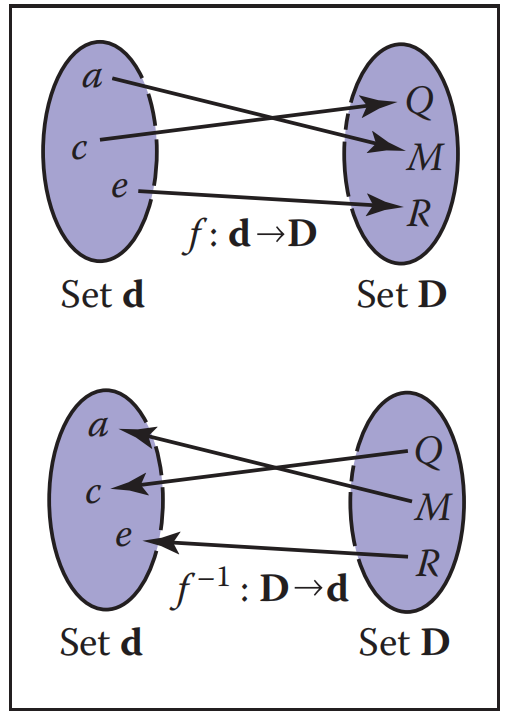

​																					**图2.1 一个双射函数 f 和它的逆函数 f^-1^。注意 f^-1^ 也是双射**

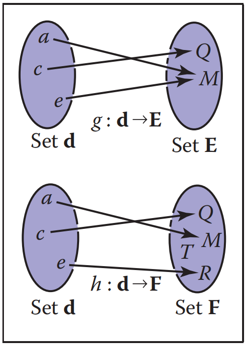

**图2.2 函数 g 没有逆函数，因为 d 集合中的两个元素映射到集合 E 中的同一个元素。函数 h 没有逆函数，因为集合 d 中没有一个元素映射到集合 F 中的元素 T**

​		举一个双射的例子，f：R -> R，其中 f(x) = x^3^，它的逆函数就是 f^-1^(x) = ^3^√x。这个例子表明标准的表示法可能有些笨拙，因为 x 在 f 和 f^-1^都用作哑变量（dummy variable）。有时使用不同的哑变量更直观，如 y = f(x)，x = f^-1^(y)。这就得到了更直观的 y = x^3^ 和 x = ^3^√y。没有逆函数的一个例子是 sqr：R -> R，其中 sqr(x) = x^2^，这有两个理由可以证明：第一是 x^2^ = (-x)^2^，第二是定义域的任何成员都不会映射到负数的目标。注意，当限制定义域和值域都为 R^+^，我们可以定义一个逆函数，这时 √x 就是有效的逆

#### 2.1.2 区间（Intervals）

​		通常我们想指定一个函数去处理限制了值范围的实数。这样的约束之一是指定一个区间。一个区间的例子是 0 到 1 的实数，不包括 0 和 1，我们用 (0, 1) 表示。因为它不包含它的端点，所以称之为开区间（open interval）。与之对应的是闭区间（closed interval），其包含了端点，用方括号 [0, 1] 表示。这个符号可以混用，如 [0, 1) 包含 0 但不包含 1。在写区间 [a, b] 时，我们会假设 a <= b。图2.3 展现了表示区间的三种方法。常常使用笛卡尔积的区间（the Cartesian products of intervals）。例如，要表示一个点 x 在三维的单位立方体中，可以用 x ∈ [0, 1]^3^

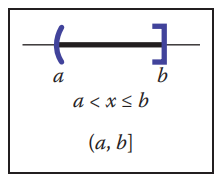

​																			**图2.3 三种等价的方法去表示从 a 到 b 的区间，其包含 b 但不包含 a**

​		区间在和集合运算结合使用时特别有用：交集（intersection）、并集（union）、差集（difference）。例如，两个区间的交集就是它们都含有的点的集合。符号 ∩ 用于表示交集。如[3, 5) ∩ [4, 6] = [4, 5)。对于并集，使用符号 ∪ 表示存在在两个区间的所有点。如 [3, 5) ∪ [4, 6] = [3, 6]。和前两个操作符不同，差分操作符会根据参数顺序产生不同的结果。减号表示差分操作符，它返回左边区间中不在右边区间的点。如 [3, 5) - [4, 6] = [3, 4)，[4, 6] - [3, 5) = [5, 6]。使用区间图（interval diagrams）可以很容易的可视化这些操作（图2.4）。

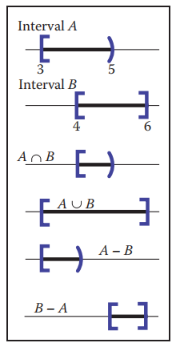

​																										**图2.4 [3, 5) 和 [4, 6] 上的区间操作**

#### 2.1.3 对数（Logrithms）

​		尽管现在对数不再像计算机出现之前那么普遍，但是在有指数项（exponential terms）的方程出现的问题中经常很有用。根据定义，每个对数都有一个底（base）a。x “log 以 a 为底” 写作 log~a~ x，定义为 “a 的某个指数可以得到 x”，即
$$
y = \log_{a}x \; \Leftrightarrow{} \; a^{y} = x
$$
注意以 a 为底的对数和以 a 为底的指数函数两者互逆。这个基本定义可以得出几个结论
$$
a^{\log_{a}x} = x
$$

$$
\log_a(a^{x}) = x
$$

$$
\log_{a}(xy) = \log_{a}x + \log_{a}y
$$

$$
\log_{a}(x/y) = \log_{a}x - \log_{a}y
$$

$$
\log_{a}x = \log_{a}b * \log_{b}x
$$

当我们在对数上运用微积分（calculus），特殊数字 e = 2.718... 就会经常出现。以 e 为底的对数称为自然对数（natrual logarithm）。我们场采用简写 ln 来表示它：
$$
\ln x \equiv{} \log_{e}x
$$
注意， “*≡*” 符号可以读作 “在定义上是等价的”。就像 π，特殊数字 e 在很多情况下出现。很多领域在操作时除了使用 e 之外还使用特定的底数，并且在表示法中忽略了底数，即 log x，天文学家经常使用其作为底数为10的对数，理论计算机科学家经常使用其作为底数为2的对数。由于计算机图形学使用了很多领域的技术，所以我们将避免使用这种简写。

​		对数和指数的导数说明了为什么自然对数是“自然”的：
$$
\frac{d\log_a x}{dx} = \frac{1}{x\ln{}a}
$$

$$
\frac{da^{x}}{dx} = a^{x}\ln{}a
$$

上面的常数乘数只在 a = e 时才是单位的（ln e = 1）

### 2.2 解二次方程（Solving Quadratic Equations）

​		二次方程可以是这种形式：
$$
Ax^{2} + Bx + C = 0
$$
其中 x 是未知数，而 A、B、C 是三个已知的常数。如果你思考一个二维的 xy 坐标图，方程为 y = Ax^2^ + Bx + C，那解就是任意 x 值在 y 上相交为 0 的点（也就是与 x 轴的交点）。因为 y = Ax^2^ + Bx + C 是一条抛物线，就会有0个、1个或 2 个实解，这取决于跑预先是否偏离、掠过或碰到 x 轴（图2.5）。

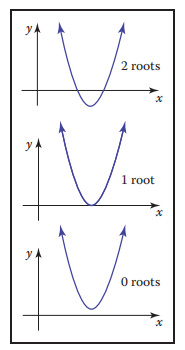

​																					**图2.5 二次方程根的几何解释是图中抛物线和 x 轴的交点**

​		为了得到二次方程的解析解，我们首先除以 A：
$$
x^{2} + \frac{B}{A}x + \frac{C}{A} = 0
$$
然后使用 ”完全平方“ 来将各项分组：
$$
(x + \frac{B}{2A})^2 - \frac{B^{2}}{4A^{2}} + \frac{C}{A} = 0
$$
将常数部分移到右边然后开根号：
$$
x + \frac{B}{2A} = \pm{}\sqrt{\frac{B^{2}}{4A^{2}} - \frac{C}{A}}
$$
两边同时减去 B/(2A)，然后用分母 2A 将各项分组，最后得到我们熟悉的形式：（式2.1）（注：一个健壮的实现将使用等价的表达式 2C / ( -B ∓ √( B^2^ - 4AC ) ) 去依赖 B 的符号计算其中一个根（练习 7）
$$
x = \frac{-B \pm{} \sqrt{B^{2} - 4AC}}{2A}
$$
这里的符号 “±” 代表有两个解，一个带正号一个带负号。因此 3 ± 1 等同于 “2 或 4”。注意，决定实数解的项是：
$$
D \equiv{} B^{2} - 4AC
$$
其被叫做二次方程的判别式（discriminant）。如果 D > 0，这里就有两个实解（也叫根）。如果 D = 0，这里仅有一个实解（二重根）。如果 D < 0，这里就没有实解。

​		例如，2x^2^ + 6x + 4 = 0 的解是 x = -1 和 x = -2，方程 x^2^ + x + 1 = 0 没有实解，它们两个的判别式分别为 D = 4 和 D = -3，所以我们能预计解的个数。在程序中，若 D 是负数，最好先求 D 的值然后返回 “没有根”，而不是开平方根

### 2.3 三角学（Trigonometry）

​		在图形学中，我们在很多情况下使用基础的三角学。通常情况下，这并不是什么复杂的事情，记住基本的定义往往会有所帮助

#### 2.3.1 角（Angles）

​		虽然我们有点认为角度是理所当然的，但是我们需要回到它的定义以便将其概念扩展到球面上去。两条半直线（half-line）（从一个原点发出的射线）或两个方向之间会形成一个角，必须使用某种约定来决定它们之间创建的角度的两种可能性（图2.6）。一个角可以用单位圆上切出的弧长来定义。一个通常的约定是使用较小的弧长，而角的符号是由两个指定的半直线顺序决定的。根据这个约定，所有角都在 [-π, π] 范围内。

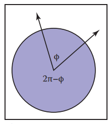

**图2.6 两根半直线将单位元切成两条弧，任一弧的长度是两个半直线间的有效角度。我们可以使用约定，较小的长度是角。或按两根半直线的一定顺序指定，决定角 φ 的弧是从第一个半直线到第二个半直线的逆时针方向扫过的弧**

​		所有这些角都是被两条直线 “切割” 的单位圆上的弧长。因为单位圆的周长是 2π，所以被两条半直线切割的两个角的和也是 2π。这些弧长的单位是弧度（radians）。另一个常见的单位是角度（degrees），其中圆的周长是 360 度。因此，π 弧度对应 180 角度，通常表示为 180^◦^。角度和弧度之间的转换：
$$
degrees = \frac{180}{\pi}radians
$$

$$
radians = \frac{\pi}{180}degrees
$$

#### 2.3.2 三角函数（Trigonometric function）

​		给定一个边长为 a，o，h的直角三角形（right triangle），其中 h 是最长的边（总是对着直角）或叫斜边（hypotenuse），勾股定理（Pythagorean theorem）描述了这样一个重要关系：
$$
a^{2} + o^{2} = h^{2}
$$
你可以从图2.7看出这一点，其中大正方形的面积为 (a + o)^2^，那四个三角形合起来的面积为 2ao，中间正方形的面积为 h^2^

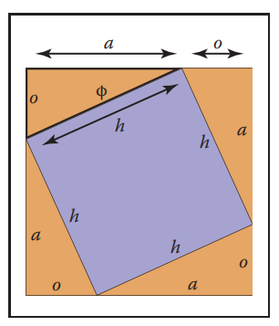

​																											**图2.7 勾股定理的一个几何证明**

​		因为三角形和内部的正方形均匀的细分了大正方形，所以我们得到 2ao + h^2^ = (a + o)^2^，这可以很容易的得到上面的勾股定理。

​		我们定义了角 φ 正弦（sine）、余弦（cosine）以及其他基于比例的表达式：
$$
\sin{}\phi = \frac{o}{h}
$$

$$
\csc{}\phi = \frac{h}{o}
$$

$$
\cos{}\phi = \frac{a}{h}
$$

$$
\sec{}\phi = \frac{h}{a}
$$

$$
\tan{}\phi = \frac{o}{a}
$$

$$
\cot{}\phi = \frac{a}{o}
$$

​		这些定义允许我们建立极坐标系（polar coordinates），这里一个点被编码为与原点的距离和与正 x 轴的有符号角度（图2.8）。注意，约定角 φ ∈ (-π, π]，且正角表示从 x 轴正半轴逆时针反向，这个将逆时针方向映射到正数的约定是任意的，但它在图形学的很多情形中被使用，所以需要被记住。

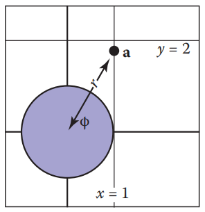

​																						**图2.8 点 (x~a~, y~a~) = (1, √3) 的极坐标为 (r~a~, φ~a~) = (2, π/3)**

​		三角函数是周期性的使多个角度对应一个值。如 sin(A) = sin(A + 2π)。这意味着在定义域 R 中，三角函数是不可逆的。这个问题可以通过限制标准逆函数的范围来避免，几乎所有现代数学库都采用该标准的方法（如Plauger，1997）。它们的定义域和值域是：（式2.2）
$$
asin：[-1, 1] \mapsto{} [-\frac{\pi}{2}, \frac{\pi}{2}]
$$

$$
acos：[-1, 1] \mapsto [0, \pi]
$$

$$
atan: R \mapsto [-\frac{\pi}{2}, \frac{\pi}{2}]
$$

$$
atan2：R^{2} \mapsto [-\pi, \pi]
$$

最后一个函数 atan2(s, c) 通常很有用，它的 s 参数和 sinA 成比例，c 参数和 cosA 成比例，结果会返回A。该因子会被假定为正的。一种思考方法是，它返回极坐标系下二维笛卡尔点 (s, c) 的角度（图2.9）

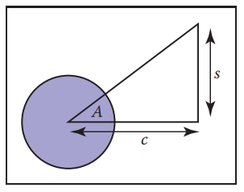

​																						**图2.9 函数 atan2(s, c) 返回角度A，这在图形学中非常有用**

#### 2.3.3 有用的恒等式（Useful Identities）

​		本节不会推导的各种有用的三角恒等式：

**变换恒等式**（shifting identities）：
$$
sin(-A) = -sinA
$$

$$
cos(-A) = cosA
$$

$$
tan(-A) = -tanA
$$

$$
sin(\frac{\pi}{2} - A) = cosA
$$

$$
cos(\frac{\pi}{2} - A) = sinA
$$

$$
tan(\frac{\pi}{2} - A) = cotA
$$

**毕达哥拉斯恒等式**（Pythagorean identities）：
$$
sin^{2}A + cos^{2}A = 1
$$

$$
sec^{2}A - tan^{2}A = 1
$$

$$
csc^{2}A - cot^{2}A = 1
$$

**加减恒等式**（Addition and substraction identities）：
$$
sin(A + B) = sinAcosB + cosAsinB
$$

$$
sin(A - B) = sinAcosB - cosAsinB
$$

$$
sin(2A) = 2sinAcosA
$$

$$
cos(A+B) = cosAcosB - sinAsinB
$$

$$
cos(A-B) = cosAcosB + sinAsinB
$$

$$
cos(2A) = cos^{2}A - sin^{2}A
$$

$$
tan(A+B) = \frac{tanA + tanB}{1 - tanAtanB}
$$

$$
tan(A - B) = \frac{tanA - tanB}{1 + tanAtanB}
$$

$$
tan(2A) = \frac{2tanA}{1 - tan^{2}A}
$$

**半角恒等式**（Half-angle identities）：
$$
sin^{2}(\frac{A}{2}) = \frac{1 - cosA}{2}
$$

$$
cos^{2}(\frac{A}{2}) = \frac{1+cosA}{2}
$$

**乘积恒等式**（Product identities）：
$$
sinAsinB = -\frac{cos(A + B) - cos(A - B)}{2}
$$

$$
sinAcosB = \frac{sin(A + B) + sin(A - B)}{2}
$$

$$
cosAcosB = -\frac{cos(A + B) + cos(A - B)}{2}
$$

下面的等式适用于边长为a，b，c的任意三角形，每个边的对角分别是A，B，C（图2.10）：
$$
\frac{sinA}{a} = \frac{sinB}{b} = \frac{sinC}{c}（正弦定理）
$$

$$
c^{2} = a^{2} + b^{2} - 2abcosC（余弦定理）
$$

$$
\frac{a+b}{a-b} = \frac{tan(\frac{A+B}{2})}{tan(\frac{A-B}{2})}（正切定理）
$$

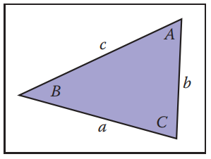

​																												**图2.10 三角定理的几何图**

三角形的面积也可以用这些边长来算：
$$
S_{三角形} = \frac{1}{4}\sqrt{(a+b+c)(-a+b+c)(a-b+c)(a+b-c)}
$$

### 2.4 向量（Vectors）

​		一个向量描述一个长度和一个方向，可以用箭头表示。若果两个向量具有相同的长度和方向，则它们相等，即使认为它们位于不同的位置（图2.11）。你应该尽可能的把向量想象成一个箭头而不是坐标或数字。在某些情况下，我们不得不在程序中用数字表示向量，但即使在代码中它们也应该作为对象进行操作，只有底层低级的向量操作才应该知道它们的数字表示（DeRose，1989）。向量用粗体字母表示，例如 **a**。一个向量的长度表示为 ||**a**||。单位向量（unit vector）是任何长度为 1 的向量。零向量（zero vector）是长度为 0 的向量，其方向没有定义。

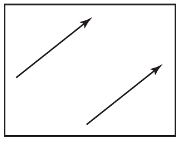

​																					**图2.11 这两个向量相等，因为它们有相同的长度和方向**

​		向量可以用来表示许多不同的东西。例如，他们可以用来存储偏移量（offset），也称作位移量（displacement）。如果我们知道 ”宝藏就埋在秘密集会地点的东两步，北三步的地方“，这时我们知道偏移量是多少，但是不知道从哪里开始。向量也可以用来存储位置（location）信息，也是表示位置（position）和点（point）的另一种表示方法。位置可以表示为从另一个位置的位移。通常会有一个已知的原点位置，所有其他位置都以该位置存储为偏移量。注意位置并不是向量。正如我们将要讨论的，你可以将两个向量相加，然后，将两个位置相加通常是没有意义的，除非是一个计算位置加权平均的中间操作（Goldman，1985）。两个偏移量相加是有意义的，这就是为什么偏移量可以用向量表示的原因之一。但这强调了位置不是偏移，它是一个特定原点的偏移量，偏移量本身不是位置。

#### 2.4.1 向量运算（Vector Operations）

​		向量具有常和实数联系起来的大多数算术运算。两向量相等当且仅当它们有相同的长度和方向。两向量相加符合平行四边形法则（parallelogram rule），该规则指出两个向量的和是通过将其中一个向量的尾部和另一个向量的头部连接起来得到的（图 2.12），向量和是由两个向量要 “完成三角形” 的向量，平行四边形按任意顺序求和而形成的，其强调了向量的加法是可交换的：
$$
\vec{a} + \vec{b} = \vec{b} + \vec{a}
$$
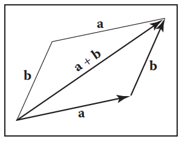

​																						**2.12 两个向量首尾排列相加，可以按任何一种顺序进行**

注意，平行四边形法则只是形式化了我们对位移的感觉，想象一下从一个向量沿着尾部走到头部，然后沿着另一个向量走，纯位移（net displacement）就是四边形的对角线。你还可以给向量给定一个一元负号（unary minus）：-**a**（图2.13），它和向量 **a** 有相同的长度但是方向相反。这可以让我们定义减法：
$$
\vec{b} - \vec{a} = -\vec{a} + \vec{b}
$$
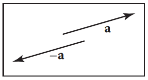

​																					**图2.13 向量 -a 和向量 a 有相同的长度，但是有相反的方向**

你可以用一个平行四边形可视化向量减法（图2.14）。我们可以这样写
$$
\vec{a} + (\vec{b} - \vec{a}) = \vec{b}
$$
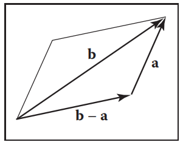

​																							**图2.14 向量减法就是第二个向量反过来的向量加法**

向量同样可以相乘。事实上，有几种和向量有关的乘法。首先，我们可以通过乘以一个实数 k 改变向量大小（scale），这只会乘以向量的长度而不会改变它的方向。例如 3.5**a** 和向量 **a** 方向相同，但是长度是 **a** 的3.5倍。在本节的后面部分我们讨论两个涉及两个向量的乘法，点乘（dot product）和叉乘（cross product），以及在第 5 章讨论涉及三个向量的乘积，行列式（determinant）。

#### 2.4.2 向量的笛卡尔坐标（Cartesian Coordinates of a Vector）

​		一个二维向量可以被写成任意两个不平行的非零向量的组合，这两个向量的性质被称为线性无关（linear independence）。两个线性无关向量构成了一个二维基（basis），因此这两个向量被称为基向量（basis vector）。例如一个向量 **c** 可以表示为两个基向量 **a**、**b** 的组合（图2.15）：（式2.3）
$$
\vec{c} = a_{c}\vec{a} + b_{c}\vec{b}
$$
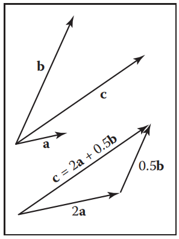

​																		**图2.15 任意二维向量 c 都是任意两个非平行二维向量 a 和 b 的加权和**

注意权重 a~c~ 和b~c~ 是唯一的。若两个向量是正交的（orthogonal），基就非常有用，即它们互为直角。如果它们还是单位向量的话那就更有用了，这种情况下它们是标准正交的（orthonormal）。假设我们已知这样两个 “特殊” 向量 **x** 和 **y**，那么可以用它们来表示笛卡尔坐标系中的所有其他向量，其中每个向量都可以用两个实数表示。例如一个向量 **a** 可能被表示为
$$
\vec{a} = x_{a}\vec{x} + y_{a}\vec{y}
$$
其中 x~a~ 和 y~a~ 是二维向量 **a** 的笛卡尔坐标（图 2.16）。注意这实际上和等式 2.3 在概念上没有任何不同，除了的基向量不是标准正交的。但笛卡尔坐标系有几个优点，例如，根据勾股定理 **a** 向量的长度是
$$
||\vec{a}|| = \sqrt{x_{a}^{2} + y_{a}^{2}}
$$
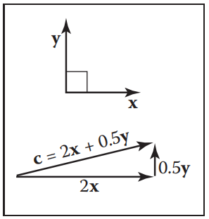

​																											**图2.16 向量的二维笛卡尔基**

我们将在下面几节中看到，在笛卡尔坐标系中计算叉积、点积和坐标也很简单。

​		按照惯例，我们将 **a** 的坐标协程有序对（x~a~, y~a~）或者是列矩阵：
$$
\vec{a} = \begin{bmatrix} x_{a} \\ y_{a} \end{bmatrix}
$$
我们使用的形式将取决于排版的方便性。我们也会将向量写成行矩阵，用 a^T^ 表示：
$$
\vec{a}^{T} = \begin{bmatrix} x_{a} & y_{a} \end{bmatrix}
$$
我们也可以用笛卡尔坐标表示三维、四维等等向量。对于三维的情况，我们使用一个与 **x** 和 **y** 都正交的基向量 **z**

#### 2.4.3 点乘（Dot Product）

​		向量乘法最简单的方式是点乘。向量 **a** 和 **b** 的点乘记为 **a** · **b**，因为其返回一个标量，所以通常称为标量积（scalar product）。点乘返回一个与参数长度和它们之间的角度 φ 有关的值（图2.17）：（式2.4）
$$
\vec{a} \cdot{} \vec{b} = ||\vec{a}|| \; ||\vec{b}|| cos\phi
$$
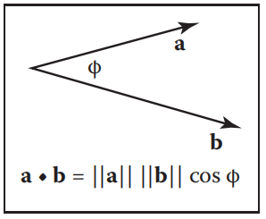

​																		**图2.17 点乘和长度以及角度有关，且它是图形学中最重要的公式之一**

在图形学中经常使用点乘去计算两个向量之间夹角的余弦值。

​		点乘也可以用来计算一个向量在另一个向量上的投影。**a** *→* **b** 是向量 **a** 到 **b** 上成直角的投影长度（图2.18）：（式2.5）
$$
\vec{a} \rightarrow \vec{b} = ||\vec{a}|| cos\phi = \frac{\vec{a} \cdot{} \vec{b}}{||\vec{b}||}
$$
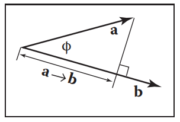

​																							**图2.18 a 在 b 上的投影是由式子 2.5 得到的长度**

点乘遵从我们在实数运算中熟悉的结合律和分配率：（式2.6）
$$
\vec{a} \cdot{} \vec{b} = \vec{b} \cdot{} \vec{a}
$$

$$
\vec{a} \cdot{} (\vec{b} + \vec{c}) = \vec{} \cdot{a} \vec{b} + \vec{a} \cdot{} \vec{c}
$$

$$
(k\vec{a}) \cdot{} \vec{b} = \vec{a} \cdot{} (k\vec{b}) = k\vec{a} \cdot{} \vec{b}
$$

如果二维向量 **a** 和 **b** 用笛卡尔坐标表示，可以利用  **x** · **x** =  **y** · **y** = 1和  **x** · **y** = 0 去推导它们的点积：
$$
\vec{a} \cdot{} \vec{b} = (x_{a}\vec{x} + y_{a}\vec{y}) \cdot{} (x_{b}\vec{x} + y_{b}\vec{y}) \qquad \qquad \qquad \qquad \qquad \qquad \;\;\;	\\
=x_{a}x_{b}(\vec{x} \cdot{} \vec{x}) + x_{a}y_{b}(\vec{x} \cdot{} \vec{y}) + x_{b}y_{a}(\vec{y} \cdot{} \vec{x}) + y_{a}y_{b}(\vec{y} \cdot{} \vec{y}) \\
=x_{a}x_{b} + y_{a}y_{b} \qquad \qquad \qquad \qquad \qquad \qquad \qquad \qquad \;\;
$$
在三维空间中同样可以发现：
$$
\vec{a} \cdot{} \vec{b} = x_{a}x_{b} + y_{a}y_{b} + z_{a}z_{b}
$$

#### 2.4.4 叉乘（Cross Product）

​		叉乘 **a** x **b** 通常只用于三维向量，广义的叉乘在本章注释中给出的参考文献中进行了讨论。两个向量的叉乘返回垂直于这两个向量的三维向量，所得向量的长度和 sinφ 有关系：
$$
||\vec{a} \cross \vec{b}|| = ||\vec{a}|| \; ||\vec{b}||sin\phi
$$
**a** x **b** 的模等于这两个向量组成的平行四边形的面积。另外， **a** x **b** 同时垂直于 **a** 和 **b**（图2.19），注意该向量只有两个可能的方向。通过定义，在 x，y，z 轴方向上的向量是：
$$
\vec{x} = (1,0,0)	\\
\vec{y} = (0,1,0)	\\
\vec{z} = (0,0,1)
$$
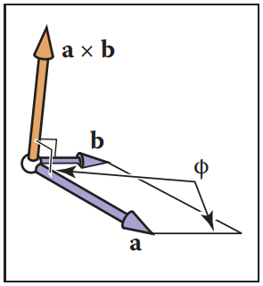

​													**图2.19 叉乘 a x b 是一个垂直于 a 和 b 的三维向量，如上图所示，它的长度等于的四边形的面积**

我们约定 **x** x **y** 必须在 z 轴的正方向或负方向。虽然这个选择看上去比较武断，但这是标准的假设：
$$
\vec{z} = \vec{x} \cross{} \vec{y}
$$
三个笛卡尔向量所有可能的排列是：
$$
\vec{x} \cross{} \vec{y} = +\vec{z}		\\
\vec{y} \cross{} \vec{x} = -\vec{z}		\\
\vec{y} \cross{} \vec{z} = +\vec{x}		\\
\vec{z} \cross{} \vec{y} = -\vec{x}		\\
\vec{z} \cross{} \vec{x} = +\vec{y}		\\
\vec{x} \cross{} \vec{z} = -\vec{y}
$$
​		由于 sinφ 的性质，我们可以知道向量叉乘自己是向量，即 **x** x **x** = 0，以此类推。注意叉乘不满足交换律，即 **x** x **y** != **y** x **x**。细心的读者会注意到，上面的讨论并不能让我们清楚的描绘出笛卡尔坐标轴之间的关系。更具体的说，如果我们把 **x** 和 **y** 放在人行道上，**x** 指向东方，**y** 指向北方，那么 **z** 指向天空还是地面？常用的约定是让 **z** 指向天空。这就被称为右手坐标系（right-handed coordinate system）。这个名字来自于用你的右手掌和手指 “抓住” **x** 并向 **y** 行旋转的记忆方案，向量 **z** 应该和你的拇指对齐，如图 2.20 所示。

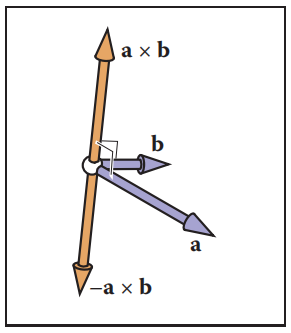

​								**图2.20 右手定则。想象一下把右手掌放在 a 和 b 尾巴连接处，将四根手指从 a 的指向 b，此时右手拇指应该指向 a x b**

​		叉乘有一些很好的性质：
$$
\vec{a} \cross{} (\vec{b} + \vec{c}) = \vec{a} \cross{} \vec{b} + \vec{a} \cross{} \vec{c}
$$

$$
\vec{a} \cross{} (k\vec{b}) = k(\vec{a} \cross{} \vec{b})
$$

然而，右手定则的结果是
$$
\vec{a} \cross{} \vec{b} = -(\vec{b} \cross{} \vec{a})
$$
​		在笛卡尔坐标系中，我们可以显示展开来计算叉积：（式2.7）
$$
\begin{align}
\vec{a} \cross{} \vec{b} &= (x_{a}\vec{x} + y_{a}\vec{y} + z_{a}\vec{z}) \cross{} (x_{b}\vec{x} + y_{b}\vec{y} + z_{b}\vec{z}) \\
& = x_{a}x_{b}\vec{x} \cross{} \vec{x} + x_{a}y_{b}\vec{x} \cross{y} \vec{} + x_{a}z_{b}\vec{x} \cross{} \vec{z}		\\
& + y_{a}x_{b}\vec{y} \cross{} \vec{x} + y_{a}y_{b}\vec{y} \cross{y} \vec{} + y_{a}z_{b}\vec{y} \cross{} \vec{z} 		\\
& + z_{a}x_{b}\vec{z} \cross{} \vec{x} + z_{a}y_{b}\vec{z} \cross{y} \vec{} + z_{a}z_{b}\vec{z} \cross{} \vec{z}		\\
& = (y_{a}z_{b} - z_{a}y_{b})\vec{x} + (z_{a}x_{b} - x_{a}z_{b})\vec{y} + (x_{a}y_{b} - y_{a}x_{b})\vec{z}
\end{align}
$$
所以，坐标形式是：（式2.8）
$$
\vec{a} \cross{} \vec{b} = (y_{a}z_{b} - z_{a}y_{b}, z_{a}x_{b} - x_{a}z_{b}, x_{a}y_{b} - y_{a}x_{b})
$$

#### 2.4.5 标准正交基和坐标系（Orthonormal Bases and Corrdinate Frames）

​		管理坐标系统几乎是所有图形程序的核心任务之一，其关键在于管理标准正交坐标基。任何由两个二维向量 **u** 和 **v** 组成的集合，只要它们是正交的（是直角）且每个都是单位长度，就构成一个标准正交基。因此
$$
||\vec{u}|| = ||\vec{v}|| = 1
$$

$$
\vec{u} \cross{} \vec{v} = 0
$$

在三维空间中，三个向量 **u**，**v **和 **w** 组成标准正交基需要满足下面条件
$$
||\vec{u}|| = ||\vec{v}|| = ||\vec{w}|| = 1
$$

$$
\vec{u} \cdot{} \vec{v} = \vec{v} \cdot{} \vec{w} = \vec{w} \cdot{} \vec{u} = 0
$$

该标准正交基由右手定则提供
$$
\vec{w} = \vec{u} \cross{} \vec{v}
$$
否则就是左手定则。

​		注意笛卡尔标准正交基只是无穷多个可能的标准正交基中的一个，其特殊之处在于它和它的隐式原点位置用于程序中的低级表示，所以向量 **x**， **y**，**z** 以及标准原点 o 从没被显示存储。全局模型通常存储在该标准坐标系统中，所以通常称为全局坐标系统。然而，若我们想要使用另一个原点是 p 和标准正交基向量 **u**，**v**，**w** 的坐标系，那么就需要显式存储这些向量。这样的坐标系称为参考系（frame of reference）或坐标系（coordinate frame）。例如，在飞行模拟器中，我们可能想要维护一个原点在飞机机头的坐标系统，标准正交基与飞机对齐。同样的，我们将有一个主要的标准坐标系统（图2.21）。与特定物体（如平面）相关联的坐标系统通常称为局部坐标系（local coordinate system）

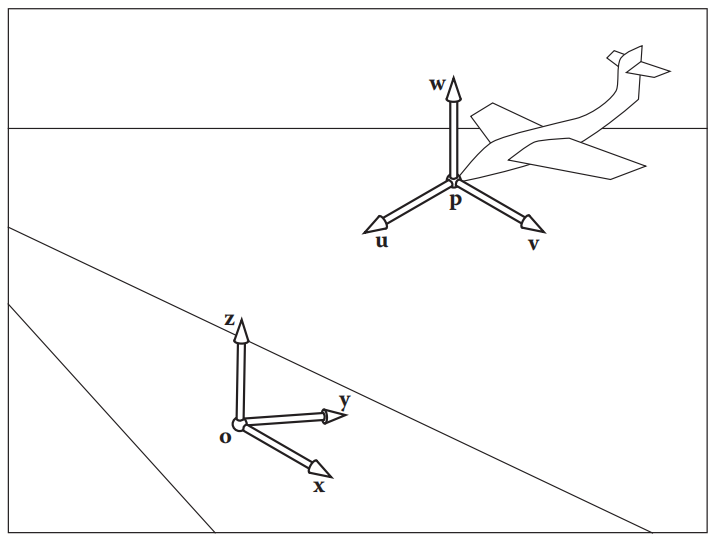

**图2.21 总有一个原点为 o，标准正规坐标基为 x，y，z 的主坐标系或 “标准坐标系”，该坐标系通常被定义为与全局模型对齐，因此通常称为“全局”或“世界”坐标系统，其原点和基向量从没有被显示存储。所有其他向量和位置存储在与全局坐标系相关的坐标中**

​		在低层次上，局部坐标被存储在标准坐标中。例如，向量 **u** 的坐标为（x~u~, y~u~, z~u~）
$$
\vec{u} = x_{u}\vec{x} + y_{u}\vec{y} + z_{u}\vec{z}
$$
一个位置隐式的包含了一个标准原点的偏移量：
$$
\vec{p} = \vec{o} + x_{p}\vec{x} + y_{p}\vec{y} + z_{p}\vec{z}
$$
其中（x~p~，y~p~，z~p~）是 **p** 的坐标

​		注意，若我们存储一个关于 **u**-**v**-**w** 坐标系的向量 **a**，需要存储一个三元组（u~a~，v~a~，w~a~），我们可以从几何上解释为
$$
\vec{a} = u_{a}\vec{u} + v_{a}\vec{v} + w_{a}\vec{w}
$$
要得到存储在 **u**-**v**-**w** 坐标系中的向量 **a** 的标准坐标，只需记住 **u**，**v**，**w** 本身是用笛卡尔坐标存储的，所以只要显示计算表达式 u~a~**u** + v~a~**v** + w~a~**w** 就已经在笛卡尔坐标系中了。要得到存储在标准坐标系中的向量 **b** 在 **u**-**v**-**w** 坐标系中的坐标，我们可以使用点乘
$$
u_b = \vec{u} \cdot{} \vec{b}; \qquad v_b = \vec{v} \cdot{} \vec{b}; \qquad w_b = \vec{w} \cdot{} \vec{b};
$$
这是可行的，因为我们知道对于某些 u~b~，v~b~，w~b~：
$$
u_{b}\vec{u} + v_{b}\vec{v} + w_{b}\vec{w} = \vec{b}
$$
而且点积分离了 u~b~ 坐标
$$
\vec{u} \cdot{} \vec{b} = u_{b}(\vec{u} \cdot{} \vec{u}) + v_{b}(\vec{u} \cdot{} \vec{v}) + w_{b}(\vec{u} \cdot{} \vec{w}) = u_{b}
$$
而这是可行的是因为 **u**，**v**，**w** 是标准正交的。

​		在章节 6.2.1 和 6.5 会讨论使用矩阵管理坐标系统的改变

#### 2.4.6 从单个向量构建基（Constructing a Basis from a Single Vector）

​		通常我们需要一个与给定向量对齐的标准正交基。也就是说给定一个向量 **a**，我们想要一个标准正交的 **u**，**v**，**w** 使 **w** 指向与 **a** 相同的方向（Hughes & Moller，1999），但是我们不特别关心 **u** 和 **v** 是什么。一个向量不足以唯一确定答案，我们只需要一个可靠的程序来找到任何可能的基。

​		这可以通过下面的叉乘来完成。首先让 **w** 称为 **a** 方向的单位向量
$$
\vec{w} = \frac{\vec{a}}{||\vec{a}||}
$$
接下来选择任何一个不和 **w** 共线的向量 **t**，并用叉乘得到垂直于 **w** 的单位向量 **u**
$$
\vec{u} = \frac{\vec{t} \cross{} \vec{w}}{||\vec{t} \cross{} \vec{w}||}
$$
如果 **t** 和 **w** 共线，那么分母就会为0，若它们几乎共线，那么结果的精度就会很低。找到到一个与 **w** 差距很大的向量的一个简单步骤是，从 **t** 等于 **w** 开始，将 **t** 的最小分量改为 1。例如，**w** = （1/√2，-1/√2，0）则让 **t** = （1/√2，-1/√2，1）。只要有了 **w** 和 **u**，完成基就很简单了：
$$
\vec{v} = \vec{w} \cross{} \vec{u}
$$
使用这种构造基的一个例子是表面着色，一个与表面法线对齐的基是必要的，但围绕法线旋转通常是不重要的。

​		当然，同样的过程也可以用来构造任意顺序的三个向量，只要注意叉乘的顺序，确保基是满足右手定则的。

#### 2.4.7 从两个向量构建基（Constructing a Basis from Two Vectors）

​		在基围绕给定向量旋转很重要的情况下，可以使用上一节使用的过程。一个常见的例子是为摄像机创建一个基：让一个向量与摄像机看向的方向对齐是很重要的，但是其围绕这个向量的方向不是任意的，需要以某种方式指定。一旦确定了方向，基就被完全指定了。

​		完全指定一个坐标系的常用方法是提供两个向量 **a**（指定 **w**） 和 **b**（指定 **v**）。若已知这两个向量是垂直了，那么可以非常简单的使用 **u** = **b** x **a** 来构建第三个向量了。 **u** = **a** x **b** 也可以构建标准正交基，但是其满足左手定则。 

​		为了确保得到的基确实是标准正交的，即使给定的向量不是，那么也可以使用类似单向量的过程：
$$
\vec{w} = \frac{\vec{a}}{||\vec{a}||}		\\
\vec{u} = \frac{\vec{b} \cross{} \vec{w}}{||\vec{b} \cross{} \vec{w}||}		\\
\vec{v} = \vec{w} \cross{} \vec{u}
$$
事实上，该过程在 **a** 和 **b** 不是垂直的情况下也工作的很好。在该情况下，**w** 将沿着 **a** 的方向构造，而 **v** 是所有垂直于 **w** 的向量中离 **b** 最接近的向量

​		如果你想让我把 **w** 和 **v** 设为两个不垂直的方向，在该方案中，可以按照你想的方式来设置所有对象，除了对 **v** 做最小的改变使它实际垂直于 **w**

​		当 **a** 和 **b** 是线性的时候该过程没有用。在该情况下，**b** 对于选择哪个方向垂直于 **a** 没有帮助：垂直于 **a** 的都垂直于 **b**

​		在指定摄像机位置的例子中（章节4.3），我们想要建立一个坐标系，让 **w** 平行于摄像机所观察的方向，而 **v** 应指向摄像机的上方向，为了获得相机上方向的朝向，我们围绕视角方向建立基，使用直接上方向作为参考向量建立相机围绕视角方向的方向，将 **v** 设置的尽可能接近上方向，这与 “保持相机垂直” 的直观感觉完全符合

#### 2.4.8 计算一个基（Squaring Up a Basis）

​		你偶尔可能会发现在计算中存在由标准正交基引发的问题，但是错误却悄悄出现了 —— 如，由于计算中的舍入误差或基被存储在一个精度较低的文件中。

​		可以使用上一节的程序，简单的用现有的 **w** 和 **v** 向量重新构造基，将会产生一个新的标准正交基且接近旧的基。

​		这个方法对于许多应用程序都很好，但是不是可用的最佳方法。它确实能产生精确的正交向量，而且对于几乎正交的基，结果不会离开始的某个给定的基太远。但是他是不对称的： 它更 ”偏爱“ **w** 向量，然后是 **v** 向量，最后是 **u**（越后的向量的初始值越容易被丢弃）。它选择一个接近起始基的基但不能保证选择最接近的标准正交基。当着还不够好时，可以使用 SVD（第5.4.1节）来计算一个标准正交基，该基保证最接近原始基。

### 2.5 曲线和曲面（Curves and Surface）

​		曲线的几何，尤其是曲面在图形学中扮演了重要的角色。这里我们回顾二维和三维空间中曲线和曲面的知识。

#### 2.5.1 二维隐式曲线（2D Implicit Curves）

​		从直接上讲，曲线一组能不抬笔在纸上画出的点。描述曲线的常用方式是使用隐式方程。一个二维的隐式方程具有如下形式
$$
f(x, y) = 0
$$
​		函数 f(x, y) 返回了一个实数。值是 0 的点 (x, y) 在曲线上，不是 0 的点则不在曲线上。例如，假设 f(x, y) 是（式2.9）
$$
f(x, y) = (x - x_{c})^{2} + (y - y_{c})^{2} - r^{2}
$$
其中 (x~c~，y~c~) 是一个二维的点且 r 是非零实数。若令 f(x, y) = 0，该方程描述的点在圆心为 (x~c~，y~c~) 半径为 r 的圆上。之所以称为 “隐式” 方程，是因为曲线上的点 (x, y) 不能直接通过方程计算出来，而必须通过解方程获得。因此，曲线上的点不是通过方程显式生成的，而是隐式的隐藏在方程中。

​		有趣的是，f 对任何的 (x, y) 都有值。我们可以将 f 想成一个地形，海平面在 f = 0 的位置（图 2.22），海岸就是那个隐式的曲线，地形的高度就是 f。另一个需要注意的事是，曲线将地形划分为了 f > 0、f = 0、f < 0 三个部分，所以可以求 f 的值判断一个点是否在曲线内。注意 f(x, y) = c 是任何常数 c 的曲线，c = 0 只是作为惯例使用。例如，若 f(x, y) = x^2^ + y^2^ - 1，不同的 c 值给出了以原点为圆心的各种圆（图2.23）。

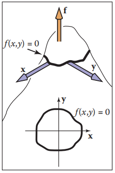

​								**图2.22 隐式方程 f(x, y) = 0 可以被想象成一个高度场，其中 f 是高度（顶部）。一个高度为 0 的路径就是隐式曲面（底部）**

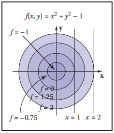

​							**图2.23 隐式方程 f(x, y) = 0 可以被想象成一个高度场，其中 f 是高度（顶部）。一个高度为 0 的路径就是隐式曲面（底部）**

​		我们可以使用向量来压缩方程。如果我们有向量 **c** = (x~c~, y~c~) 和 **p** = (x, y)，以 **c** 为圆心半径为 r 的圆以满足以下条件的位置向量定义
$$
(\vec{p} - \vec{c}) \cdot (\vec{p} - \vec{c}) - r^{2} = 0
$$
若该方程代数展开就会获得式子2.9，但是通过几何方式 “理解” 这个方程，可以很容易的看出这是一个圆的方程，它可以理解 ”在圆上的点 **p** 有如下性质：**c** 到 **p** 的向量点乘自身的值是 r^2^，因为一个向量点乘自身是它长度的平方，所以我们也可以将该方程理解为 “在圆上的点 **p** 有如下性质：**c** 到 **p** 向量的长度是 r^2^”。

​		更好的方法是去观察长度的平方就是 **c** 到 **p** 的平方，这给出了等价的形式
$$
||\vec{p} - \vec{c}||^{2} - r^{2} = 0
$$
当然，该形式也可
$$
||\vec{p} - \vec{c}|| - r = 0
$$
上面可以理解为 “圆上的点 **p** 是这些距离圆心 **c** 长 r 的点”，这说明方程的矢量形式比具有 x和 y 的完全笛卡尔形式更直观更有几何感。基于该原因，通常建议尽可能使用向量形式。另外，你可以在你的代码中提供一个 vector 类，当使用向量形式时代码会更清晰。面向向量的方程在使用中也更不容易出错：一旦在代码中实现和调试 vector 类型之后，涉及 x，y，z 的 cut-and-paste 错误就会消失。习惯这些向量方程需要一点时间，但一旦掌握了它的窍门，回报是巨大的

#### 2.5.2 二维梯度（The 2D Gradient）

​		若我们把方程 f(x, y) 看成高度为 f(x, y) 的高度场，梯度向量（gradient vector）指向坡度幅度最大的上坡，即直上坡。梯度向量 ∇f(x, y) 通过下面得出
$$
\nabla{}f(x,y) = (\frac{\partial{}f}{\partial{}x}, \frac{\partial{}f}{\partial{}y})
$$
隐式曲线 f(x, y) = 0 的上一点的梯度向量垂直于该点的切线向量（tangent vector），该垂直向量通常被称作曲线的法向量（normal vector）。另外，由于梯度点向上，其指向了 f(x, y) > 0 区域的方向。

​		在高度场的概念下，偏导数和梯度的几何含义比平常更明显。假设在点 (a, b) 附近，f(x, y) 是一个平面（图 2.24），其有一个特定的上坡和下坡方向，与该方向成直角的是平面的水平方向，平面和 f(x, y) = 0 的平面的任何交点都是水平方向上的点，因此，上坡/下坡方向将会垂直于和 f(x, y) = 0 平面的交线。为了看看偏导数和这个有什么关系，我们需要将它的几何意义可视化。会向一下一维函数 y = g(x) 的常规导数是（式2.10）
$$
\frac{dy}{dx} \equiv{} \lim_{\Delta{}x\rightarrow{}0}\frac{\Delta{}y}{\Delta{}x} = \lim_{\Delta{}x\rightarrow{}0}\frac{g(x + \Delta{}x) - g(x)}{\Delta{}x}
$$
它测量的是 g 切线的斜率（slope）（图 2.25）。

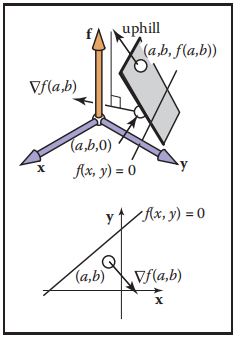

​													**图 2.24 表面高度 = f(x, y) 在 (x, y) = (a, b) 附近是局部平面，梯度就是上坡方向在高度 = 0 平面上的投影**

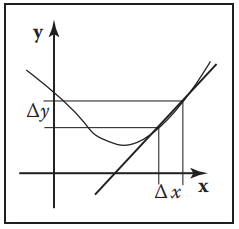

​																							   	**图2.25 一维函数的导数测量曲线切线的斜率**

​		偏导数是一维函数导数的推广。对于二维函数 f(x, y)，我们不能和方程（2.10）一样对 x 取极限，因为对于给定的 x 的变化，f 有多种变化与之对应。然而，如果我们让 y 是常量，就可以定义类似的导数，称为偏导数（图 2.26）：
$$
\frac{\partial{}f}{\partial{}x} \equiv{} \lim_{\Delta{}x\rightarrow{}0}\frac{f(x + \Delta{}x,y) - f(x,y)}{\Delta{}x}
$$
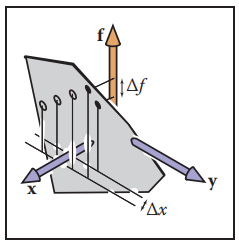

​									**图 2.26 函数 f 对 x 的偏导必须要使 y 保持变才有唯一的值，就如同图中黑色的点所示。空心点表示 y 值变化的其他 f 值**

为什么对 x 和 y 的偏导数是梯度向量的分量？同样的，在几何中比在代数中观察更明显。在图 2.27中，我们看到向量 **a** 沿着 f 不变的路径移动。注意这也能在足够小的尺寸下，认为表面高度 (x, y) = f(x, y) 是一个局部平面。从图片中可以看到向量 **a** = (Δx, Δy)。

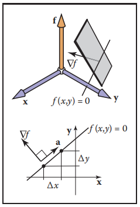

​																				**图2.27 向量 a 指向 f 没有变化的方向，因此垂直于梯度向量 ∇f**

​		因为上坡方向垂直于 **a**，我们知道点乘结果等于 0：（式 2.11）
$$
(\nabla{}f)\cdot{} \vec{a} \equiv{} (x_{\nabla{}},y_{\nabla{}}) \cdot{} (x_{a},y_{a}) = x_{\nabla{}}\Delta{}x + y_{\nabla{}}\Delta{}y = 0
$$
我们也知道 f 在 (x~a~，y~a~) 方向上的变化等于 0：
$$
\Delta{}f = \frac{\partial{}f}{\partial{}x}\Delta{}x + \frac{\partial{}f}{\partial{}y}\Delta{}y \equiv{} 
\frac{\partial{}f}{\partial{}x}x_{a} + \frac{\partial{}f}{\partial{}y}y_{a} = 0
$$
​		给定任何垂直的向量 (x，y) 和 (x'，y')，我们知道它们之间的夹角为 90 度，因此它们点积等于 0（记住点积和两向量夹角的余弦成正比）。所以我们有 xx' + yy' = 0，给定 (x，y)，可以容易的构造出一个有效的向量使之点乘  (x，y) = 0，最显而易见的两个是 (y，-x) 和 (-y，x)。你可以证明这些向量和给定的 (x，y) 点乘为 0。该结果的一个推广是 (x，y) 垂直于 k(y，-x) 其中 k 为任意非零常数。这意味着（式 2.12）
$$
(x_{a},y_{a}) = k(\frac{\partial{}f}{\partial{}y},-\frac{\partial{}f}{\partial{}x})
$$
结合方程 2.11 和 2.12 可以得出
$$
(x_{\nabla{}},y_{\nabla{}}) = k'(\frac{\partial{}f}{\partial{}x},\frac{\partial{}f}{\partial{}y})
$$
其中 k' 是任意非零常数。根据定义，“上坡” 意味着 f 的变化是正的，所以认为 k' > 0，那么 k' = 1 是很好的定义。

​		作为梯度的一个例子，考虑隐式圆 x^2^ + y^2^ - 1 = 0，其梯度向量是 (2x，2y) ，其表示圆外是方程 f(x，y) = x^2^ + y^2^ - 1 的正区域。注意梯度向量的常数依赖于隐式方程的常数。如，对于任意非零 A，单位圆可以用 Ax^2^ + Ay^2^ - A = 0描述，该曲线的梯度向量为 (2Ax，2Ay)，它是（垂直于）圆的法线，但长度由 A 决定。当 A > 0，法线将会从圆上指向圆外，当 A < 0，将会从圆上指到圆内。这种向外向内的转换是正常的，因为圆的正区域也在转换。根据高度场的观点，h = Ax^2^ + Ay^2^ - A，圆在高度为 0 的地方。对于 A > 0，圆包围着一个凹区域，对于 A < 0，圆包围着一个凸区域，当 A 变的更负时，凸起的高度会增加，但 h = 0 的圆没有改变，最大上坡的方向没有改变，但是坡度增加。梯度的长度反应坡度角度的改变。所以直觉上你可以认为梯度的方向是指向上坡，且它的大小测量了上坡的坡度。

**隐式二维线（Implicit 2D Lines）**

​		熟悉的直线的 “斜截式”（slope-intercept）形式是（式 2.13）
$$
y = mx + b
$$
这可以很容易的转换成隐式形式（图 2.28）（式 2.14）
$$
y - mx - b = 0
$$
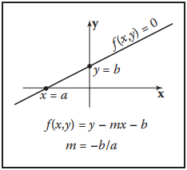

​																				**图 2.28 一条二维的直线可以通过方程 y - mx - b = 0 来描述**

这里 m 是 “坡度”（y和x的比率），b 是直线与 y 轴相交地方的 y 值，通常称为 y 轴截距（y-intercept）。这条线也划分了二维平面，但这里 “内” 和 “外” 可以更直观的称为 “上” 和 “下”。

​		因为我们可以给隐式方程乘以任何一个常数也不会改变其为 0 的点，所以 kf(x，y) = 0 对于任何非零的 k 都是同一条曲线，这允许对相同的直线使用几种隐式形式，例如
$$
2y - 2mx - 2b = 0
$$
​		有时不适合用斜截式的一个原因是它不能表示一些直线，如 x = 0，因为 m 必须是无限的。因为这个原因，一个更一般的形式通常是有用的：（式 2.15）
$$
Ax + By + C = 0
$$
A，B，C为任何实数。

​		假设，我们已知两个在直线上的点 (x~0~，y~0~) 和 (x~1~，y~1~)，描述通过这两个点的直线的 A，B，C 的值是什么？因为这两个点在直线上，所以他们必须都满足方程（2.15）：
$$
Ax_{0} + By_{0} + C = 0			\\
Ax_{1} + By_{1} + C = 0	
$$
不幸的是，我们有两个方程和三个未知量 A、B 和 C。这个问题产生的原因是隐式方程的乘数可以是任意的。为了方便可以是指 C = 1：
$$
Ax + By + 1 = 0
$$
但是我们有类似斜截式中斜率无穷大的情况：通过原点的直线需要有 A * 0 + B * 0 + 1 = 0，但这是矛盾的。例如，通过原点的 45 度直线的方程能被写为 x - y = 0，或等价的 y - x= 0，甚至是 17y - 17x = 0，但是不能写成 Ax + By + 1 = 0 的形式。

​		每当我们遇见这种棘手的集合问题时，可以尝试以几何直观作为指导来解决这些问题。我们有一个工具，就是在 2.5.2 节讨论的梯度。对于直线 Ax + By + C = 0，它的梯度向量是 (A，B)。该向量和这条线垂直（图 2.29），且指向 Ax + By + C 为正的那一边。给定直线上的两个点 (x~0~，y~0~) 和 (x~1~，y~1~)，我们知道它们两点连接起来的向量方向和直线相同，这个向量就是 (x~1~ - x~0~，y~1~ - y~0~)，因为它平行于直线，所以也必须和梯度向量 (A，B) 垂直。回想一下，有无数个 (A，B，C) 值描述该直线，因为隐式方程的任意缩放特性，我们想要任意一个有效的 (A，B，C) 值。

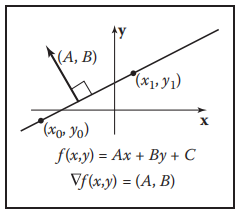

​																					**图2.29 梯度向量 (A，B) 垂直于隐式直线 Ax + By + C = 0**

​		我们可以从任意垂直于 (x~1~ - x~0~，y~1~ - y~0~) 的 (A，B) 开始。这样的向量就是 (A，B) = (y~0~ - y~1~，x~1~ - x~0~)，其推导和第 2.5.2 节相同。这意味着经过的直线方程是（式 2.16）
$$
(y_{0} - y_{1})x + (x_{1} - x_{0})y + C = 0
$$
现在我们只需要找到 C 的值。因为 (x~0~，y~0~) 和 (x~1~，y~1~) 在直线上，所以他们必须满足方程（2.16），我们可以代入任何一个值然后求出 C。代入 (x~0~，y~0~) 得到 C = x~0~y~1~ - x~1~y~0~，因此直线完整的方程是（式 2.17）
$$
(y_{0} - y_{1})x + (x_{1} - x_{0})y + x_{0}y_{1} - x_{1}y_{0} = 0
$$
同样，这是无穷多个经过两点的直线的有效隐式方程之一，但该形式没有除法，所以对于有限的用笛卡尔坐标表示的点没有数值退化情况。对于方程（2.17），一个很妙的事是可以将其转换成斜截式（当它存在的时候），通过将方程中不包含 y 的项移到右面，然后除以 y 项的乘数：
$$
y = \frac{y_{1} - y_{0}}{x_{1} - x_{0}}x + \frac{x_{1}y_{0} - x_{0}y_{1}}{x_{1} - x_{0}}
$$
​		隐式线性方程一个有趣属性是它能用来求点到直线带符号的距离，Ax + By + C 的值和点到直线的距离成正比（图 2.30）。如图 2.31 所示，点到直线的距离是向量 k(A，B) 的长度（式 2.18）
$$
distance = k\sqrt{A^{2} + B^{2}}
$$
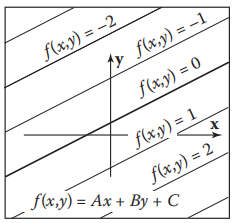

​														**图2.30 隐式方程 f(x，y) = Ax + By + C 的值是一个常数乘以 Ax + By + C = 0 的带符号距离**

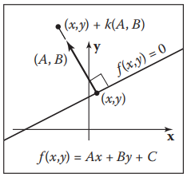

​													**图2.31 向量 k(A，B) 连接了不在直线上的一个点到直线上与该点距离最近的点，两点距离和 k 成正比**

对于点 (x，y) + k(A，B)，f(x，y) = Ax + By + C 的值是（式 2.19）
$$
f(x+kA,y+kB) = Ax + kA^{2} + By + kB^{2} + C = k(A^{2} + B^{2})
$$
该方程化简的理由是我们知道 (x，y) 在直线上，因此 Ax + By + C = 0。由方程 2.18 和 2.19 可得，点 (a，b) 到直线 Ax + By + C = 0 的带符号距离为
$$
distance = \frac{f(a,b)}{\sqrt{A^{2} + B^{2}}}
$$
这里 “带符号的距离” 意味着它的大小（绝对值）是几何距离，在直线的一边距离是正的，另一边距离是负的。如果你的某些情况更倾向于使用正面的那面，你可以在同样有效的表示 f(x，y) = 0 和 -f(x，y) = 0 中做出选择。注意如果 (A，B) 是单位向量，f(a， b) 就是带符号距离。我们可以给方程（2.17）乘以一个常数以保证 (A，B) 是单位向量：（式 2.20）
$$
f(x,y) = \frac{y_{0} - y_{1}}{\sqrt{(x_{1} - x_{0})^{2} + (y_{0} - y_{1})^{2}}}x + 
\frac{x_{1} - x_{0}}{\sqrt{(x_{1} - x_{0})^{2} + (y_{0} - y_{1})^{2}}}y  + 
\frac{x_{0}y_{1} - x_{1}y_{0}}{\sqrt{(x_{1} - x_{0})^{2} + (y_{0} - y_{1})^{2}}} = 0
$$

注意方程（2.20）求 f(x，y) 直接可以求带符号距离距离，但是它需要一个平方根来建立方程。隐式直线对于三角形光栅化是非常有用的（章节 8.1.2）。二维直线的其他形式将在 14 章讨论。

**隐式二次曲线（Implicit Quadric Curves）**

​		在上一节中可以看到一个线性方程 f(x，y) 可以得到隐式直线 f(x，y) = 0。如果 f 是 x 和 y 的二次函数，其一般形式为
$$
Ax^{2} + Bxy + Cy^{2} + Dx + Ey + F = 0
$$
这得到的曲线称为二次曲线。二维二次曲线包含椭圆和双曲线。以及抛物线、圆、直线等特殊情况。

​		二次曲线的例子包括以 (x~c~，y~c~) 为圆形，半径为 r 的圆
$$
(x - x_{c})^{2} + (y - y_{c})^{2} - r^{2} = 0
$$
以及轴对称的椭圆形式
$$
\frac{(x - x_{c})^{2}}{a^{2}} + \frac{(y - y_{c})^{2}}{b^{2}} - 1 = 0
$$
其中 (x~c~，y~c~) 是椭圆的圆形，a 和 b 是长半轴和短半轴（图 2.32）。

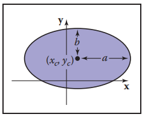

​																					**图2.32 圆心为 (x~c~，y~c~) ，长半轴和短半轴为 a 和 b 的椭圆**

#### 2.5.3 三维隐式表面（3D Implicit Surfaces）

​		就像隐式方程可以用来定义二维曲线一样，它们也可以在三维中定义表面。在二维中，隐式方程隐式的定义了表面上的一组点集：
$$
f(x,y,z) = 0
$$
表面上任何点 (x，y，z) 作为 f 的参数时结果都为0，不在表面上的任何一个点都会得到非零的一个点。你可以计算 f 的值来检查一个点是否在表面上，或者通过f的符号判断点在表面的哪一边。但是不能明确的在表面上显示的构造点。使用向量表示法，我们将 **p** = (x，y，z) 写成
$$
f(\vec{p}) = 0
$$

#### 2.5.4 隐式表面的表面法线（Surface Normal to an Implicit Surface）

​		表面法线是垂直于表面的向量（在光照计算中是需要的，或在其他计算中）。表面上的每一个点都可能有不同的法向量。同理，二维隐式曲线由梯度给出，在隐式表面上的点 **p** 处的表面法线由隐式函数的梯度给出
$$
\vec{n} = \nabla{}f(\vec{p}) = (\frac{\partial{}f(\vec{p})}{\partial{}x},\frac{\partial{}f(\vec{p})}{\partial{}y},\frac{\partial{}f(\vec{p})}{\partial{}z})
$$
其推导和二维情况相同：梯度指向 f 增长最快的方向，垂直于表面所有的切线方向，其中 f 保持不变。梯度向量指向表面 f(**p**) > 0 的一侧，在给定的情形下，我们可以认为它是 ”进入“ 表面或 ”离开“ 表面。如果 f 的特定形式创建了向内的梯度，但是需要向外的梯度，表面 - f(**p**) = 0 和 f(**p**) = 0 表面相同，但是梯度方向相反，即 -∇f(**p**) = ∇(−f(**p**))。

#### 2.5.5 隐式平面（Implicit Planes）

​		考虑经过点 **a** 法线为 **n** 的无限平面。该平面的隐式方程可以用这个给出（式 2.21）
$$
(\vec{p} - \vec{a}) \cdot{} n = 0
$$
注意 **a** 和 **n** 是已知量，点 **p** 所有满足方程的未知点。从几何角度该方程表达了 “**a** 到 **b** 的向量垂直于平面法向量”。若 **p** 不在平面上，则 (**p** - **a**) 不会和 **n** 成直角（图 2.33）。

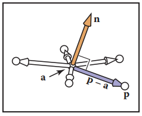

​																		**图2.33 若满足方程 2.21，所有所示的 p 点都在经过点 a 法线为 n 的平面上**

​		有时我们想要求通过点 **a**，**b**，**c** 的隐式方程。平面的法向量可以使用平面上任意两个向量的叉积获得。这样一个叉积如
$$
\vec{n} = (\vec{b} - \vec{a}) \cross{} (\vec{c} - \vec{a})
$$
这样就可以写出平面的隐式方程了：（式 2.22）
$$
(\vec{p} - \vec{a}) \cdot{} ((\vec{b} - \vec{a}) \cross{} (\vec{c} - \vec{a})) = 0
$$
从几何方式理解方程的方式是由 **p** - **a**，**b** - **a** 和 **c** - **a** 定义的平行六面体体积为 0 ，即它们共面。这只有在 **p** 和 **a**，**b**，**c** 在同一个平面上才成立。其完全笛卡尔表示是有行列式给出（这将在第 5.3 节中进行更详细的讨论）：（式 2.23）
$$
\begin{vmatrix} x-x_{a} & y-y_{a} & z-z_{a} \\ x_{b}-x_{a} & y_{b}-y_{a} & z_{b}-z_{a} \\ x_{c}-x_{a} & y_{c}-y_{a} & z_{c}-z_{a}\end{vmatrix} = 0
$$
行列式可以展开成拥有许多想的膨胀形式（bloated form）（关于行列式的展开机制，详见 5.3 节）。

​		方程（2.22）和（2.23）是等价的，对于它们的比较具有指导意义。方程（2.22）易于几何解释，且可以产出有效的代码，另外，若利用调试过的叉积和点积代码，可以相对容易的避免编译成错误代码的打字排印错误（typographic error）。等式（2.23）同样易于几何解释，若执行一个有效的 3x3 行列式函数，它将是有效的。若一个方程中行列式 (**a**，**b**，**c**) 是已知的，则也可以容易的实现没有打字排印错误（typo，typographic error缩写）。如果你将行列式函数重命名为体积可以让其他人阅读你的代码更容易。因为方程（2.22）和（2.23）都可以很好的映射到代码中。将两个方程中任意一个扩展成 x，y，z 分量的形式将可能产生打字排印错误，这样的打字排印错误可能会被编译，会变的特别麻烦。这是一个很好的例子，说明干净的数学生成干净的代码，臃肿的数学生成臃肿的代码。

**三维二次表面（3D Quadric Surfaces）**

​		正如两个变量的二次曲线，x，y，z 的二次多项式定义了三维的二次曲面。例如，球可以写为
$$
f(\vec{p}) = \frac{(x - x_{c})^{2}}{a^{2}} + \frac{(y - y_{c})^{2}}{b^{2}} + \frac{(z - z_{c})^{2}}{c^{2}} - 1 = 0
$$
 **隐式曲面的三维曲线（3D Curves from Implicit Surfaces）**

​		有人可能希望用 f(**p**) = 0 创建隐式的三维曲线。但是所有这些曲线都只是在退化曲面，在实践中很少使用。一个三维的曲线能被两个联系的三维隐式方程的交点给创建出来：
$$
f(\vec{p}) = 0		\\
g(\vec{p}) = 0
$$
例如，一个三维的直线能被两个隐式的平面的交点组成。通常使用参数曲线代替更方便，我们将在下面几章讨论它们。

#### 2.5.6 二维参数曲线（2D Parametric Curves）

​		参数曲线是有一个参数进行控制的，该参数可以看成沿曲线连续运动的索引。这样的曲线形式为
$$
\begin{bmatrix} x \\ y \end{bmatrix} = \begin{bmatrix} g(t) \\ h(t) \end{bmatrix}
$$
这里 (x，y) 是在曲线上的一点，t 是影响曲线的参数。对于一个给定的 t，会有某个被函数 g 和 h 决定的点。对于连续的 g 和 h，t 的一个小变化将引起 x 和 y的小变化。因此当 t 连续的变化，一个连续曲面上的点将会被得出。这是一个很好的特性，因为我们可以使用参数 t 显示的构造曲线的上的点。通常我们可以把存书曲线写成向量的形式。
$$
\vec{p} = f(t)
$$
其中 f 是向量生成值的函数，f：R→R^2^，这样的向量函数可以产生非常干净的代码，因此应该尽可能使用它们。

​		我们可以把曲线位置看成一个时间的函数。该曲线可以是任意的，可以是循环的，也可以是和自己交叉的。我们也可以将曲线看成是任意一点的速度。例如，点 **p**(t) 在 t = -2 附近移动的很慢，在 t = 2 和 t = 3 之间移动的很快。这种类 “移动的点” 的词汇经常在讨论参数曲线时使用，即使曲线并没有描述移动的点

**二维参数直线（2D Parametric Lines）**

​		一条经过 **p~0~** = (x~0~，y~0~) 和 **p1** = (x~1~，y~1~) 的二维参数直线可以被写为
$$
\begin{bmatrix} x \\ y \end{bmatrix} = \begin{bmatrix} x_{0} + t(x_{1} - x_{0}) \\ y_{0} + t(y_{1} - y_{0}) \end{bmatrix}
$$
因为 x 和 y 的公式具有相似的结构，所以可以使用向量形式 **p** = (x，y) （图 2.34）：
$$
\vec{p}(t) = \vec{p_{0}} + t(\vec{p_{1}} - \vec{p_{0}})
$$
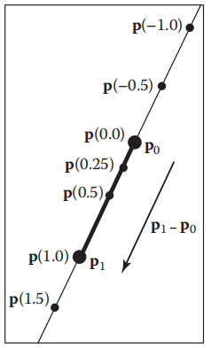

​															**图2.34 一条经过 p~0~ 和 p~1~ 的二维参数直线，t∈[0,1] 定义的线段使用粗线表示**

你可以从几何结构上理解：“从 **p~0~** 开始向 **p~1~** 移动一段由参数 t 决定的距离”。这个形式的一个好的特性是 **p**(0) = **p~0~** 以及 **p**(1) = **p~1~**。因为点随 t 线性变换，所以在 **p~0~** 和 **p~1~** 之间的 t 值表示两点之间的分数距离。t < 0 的点在 **p~0~** 方向的外边，t > 1 的点在 **p~1~** 方向的外边。

​		参数直线也可以描述为一个点 **o** 和一个向量 **d**：
$$
\vec{p}(t) = \vec{o} + t(\vec{d})
$$
当向量 **d** 是单位长度，直线被弧长参数化（arc-length parameterized）。这意味着 t 是直线上距离的精确度量。任何参数化曲线都能进行弧长参数化，这显然是一种方便的形式，但不是任何曲线都能被解析转化。

**二维参数圆（2D Parametric Circles）**

​		圆心为 (x~c~，y~c~) 半径为 r 的圆有这样的参数形式：
$$
\begin{bmatrix} x \\ y \end{bmatrix} = \begin{bmatrix} x_{c} + r\cos\phi \\ y_{c} + r\sin\phi \end{bmatrix}
$$
为了确保圆上你的每个点都有唯一的参数 φ，我们可以限制其定义域为 φ∈[0，2π) ， φ∈(-π，π]，或其他任意长度为 2π 半开区间。

​		一个轴对称的椭圆可以用分别缩放 x 和 y 的参数方程来构造：
$$
\begin{bmatrix} x \\ y \end{bmatrix} = \begin{bmatrix} x_{c} + a\cos\phi \\ y_{c} + b\sin\phi \end{bmatrix}
$$

#### 2.5.7 三维参数曲线（3D Parametric Curves）

​		一个三维参数曲线工作原理和二维参数曲线很相似：
$$
x = f(t)		\\
y = g(t)		\\
z = h(t)
$$
例如一个绕 z 轴的螺旋可以表示为：
$$
x = \cos{}t		\\
y = \sin{}t		\\
z = t
$$
同二维曲线一样，如果我们想控制曲线的起点和终点就需要定义函数 f，g 和 h 的定义域为 D⊂R。我们可以写成向量形式
$$
\begin{bmatrix} x \\ y \\ z \end{bmatrix} = \vec{p}(t)
$$
*参数曲线的范围为 **p**：R→R^3^*

​		在本章节我们只会讨论三维参数直线的细节。一般的三维参数曲线会在第 15 章进行更广泛的讨论。

**三维参数直线（3D Parametric Lines）**

​		三维参数直线能直接理解为二维参数直线的直接扩展，例如
$$
x = 2 + 7t		\\
y = 1 + 2t		\\
z = 3 - 5t
$$
​		这比较繁琐且不能很好的转化为代码变量，所以我们将其写成向量形式：
$$
\vec{p} = \vec{o} + t\vec{d}
$$
上个例子中，**o** 和 **d** 的值为
$$
\vec{o} = (2,1,3)		\\
\vec{d} = (7,2,-5)
$$
注意这和二维情况非常相似。我们可以这样想，这条直线通过 **o** 且平行于 **d**。给定任何一个 t 的值，你可以获得直线上的某个点 **p**(t) 。例如，在 t = 2 时，p(t) = (2，1，3) + 2(7，2，-5) = (16，5，-7)。这个大体的概念和二维是一样的（图 2.30）。

​		就如同二维一样，一个线段可以用一个三维的参数直线和一个区间 t ∈ [t~a~，t~b~] 描述。点 **a** 和 **b** 之间的线段通过 **p**(t) = **a** + t(**b** - **a**) 得出，其中 t∈[0,1]。这里 **p**(0) = **a**，**p**(1) = b，中点为 **p**(0.5) = (**a** + **b**) / 2。

​		一条射线（ray），或称半直线（half-line），是一个半开区间的三维参数直线，通常是 [0,∞)。从现在开始，我们把所有的直线，线段以及射线统称为 “射线”。这是草率的，但符合一般用法且可以使讨论更简单。

#### 2.5.8 三维参数表面（3D Parametric Surfaces）

​		参数化方法可以用来定义三维空间中的曲面，除了用两个参数处理曲面的二维面积其它就像我们定义曲线一样。这些表面的形式为
$$
x = f(u,v)		\\
y = g(u,v)		\\
z = h(u,v)
$$
或者向量向量形式
$$
\begin{bmatrix} x\\ y \\ z \end{bmatrix} = \vec{p}(u,v)
$$
*参数曲面函数的范围为 **p**：R^2^→R^3^*

例子：例如，地球曲面上的一个点可以被描述为经度和纬度两个参数。若我们将原点定义在地球的中心，且 r 代表地球的半径，这样得到一个以原点为中心的球坐标系（图 2.35），然后让我们定义参数方程（式 2.24）

*为了便于讨论，假设地球完全是球形的*
$$
x = r\cos{}\phi{}\sin{}\theta		\\
y = r\sin{}\phi{}\sin{}\theta		\\
z = r\cos{}\theta
$$
*这里 θ 和 φ 可能是反过来用的也可能不是，这取决于应用背景，这些符号在不同学科中不同。在这本书中，我们将总是假设 θ 和 φ 的含义和等式（2.24）以及图 2.35 中的相同*

​																															**球坐标的几何图**

理想状态下，我们想把它写向量形式，但是对于这个参数形式是不可行的。

​		我们还想根据给定的 (x，y，z) 求出 (θ，φ)。若我们假设 φ∈(-π,π]，这可以很方便的去使用公式 2.2 中的 atan2 函数来计算：（式 2.25）
$$
\theta = \acos{}(\frac{z}{\sqrt{x^{2} + y^{2} + z^{2}}})		\\
\phi = atan2(y,x)
$$
​		对于隐式曲面，函数 f 的导数给出了曲面的法向量。对于参数曲面，**p** 的导数同样给出了曲面的几何信息。

​		考虑方程 **q**(t) = **p**(t，v~0~)。该方程定义了一个参数曲线，其由固定 v 值为 v~0~ 然后改变 u 获得。这个曲线被称为等参曲线（isoparametric curve）（又是简称为 “isoparm”），其位于曲面上。**q** 的导数给出了曲线的切向量，因为曲线在曲面上，所以向量 **q‘** 也在曲面上。因为它是通过改变 **p** 的一个参数得到的，向量 **q'** 是 **p** 对 **u** 的偏导数，我们用 **p~u~** 来表示。一个类似的论证表明，偏导数 **p~v~**给出等参数曲线的正切值，当 u 为常数时，它是曲面的第二个切向量。

​		**p** 的导数，得到曲面上任意一点的两个切向量。曲面的法向量可以通过这些向量的叉积求得：因为它们都和曲面相切，所以它们的叉积垂直于两个切线，也就是垂直于曲面。叉乘的右手定则提供了一种方法来决定哪边是曲面的正面，哪些是外部。我们使用约定好的向量
$$
\vec{n} = \vec{p}_{u} \cross \vec{p}_{v}
$$
其指向表面的外面。

#### 2.5.9 曲线和曲面的总结（Summary of Curves and Surfaces）

​		二维中隐式的曲线和三维中隐式的曲面由两或三个变量的标量值函数 f：R^2^→R 或 f：R^3^→R定义，而且由所有函数值为 0 的点组成：
$$
S = \{\vec{p} | f(\vec{p} = 0)\}
$$
​		二维或三维的参数曲线是由一个变量的向量值函数 **p**: D⊂R→R^2^或 **p**: D⊂R→R^3^ 定义的，当t在整个D上变化时，曲线就能得出来：
$$
S = \{\vec{p}(t)|t\in{}D\}
$$
​		三维参数曲面由两个变量的向量值函数 **p**：D⊂ R^2^→R^3^ 定义，曲面由定义域内所有点 (u, v) 的像组成：
$$
S = \{\vec{p}(t)|(u,v)\in{}D\}
$$
​		对于隐式曲线和曲面，法向量由 f 的导数（梯度） 给出，而一个切向量（对于曲线）或多个切向量（对于曲面）可以通过构造基的方法从法向量推导出来。

​		对于参数曲线和曲面，**p** 的导数给出一个切向量（对于曲线）或多个切向量（对于曲面），法向量可以通过构造基方法从切线推导出来。

### 2.6 线性插值（Linear Interpolation）

​		也许图形学中最常见的数学运算是线性插值。我们已经见过一个对二维和三维线段位置线性插值的例子，其中两点 **a** 和 **b** 与参数t相关联，形成直线 **p** =(1−t)**a** + t**b**。这就是插值，因为 **p** 在 t = 0 和 t = 1 时经过 **a** 和 **b**。它是线性的插值，因为权重项 t 和 1 - t 是 t 的线性多项式。另一种常见的线性插值是在 x 轴上的一组位置中：x，x~1~，…，x~n~，对于每个 x~i~，我们有一个对应的高度 y~i~。我们想要创建一个连续函数 y = f(x) 来插值这些位置，让 f 能经过每一个数据点，也就是 f(x~i~) =  y~i~。对于线性插值，点 ((x~i~, y~i~) 由直线段连接。对于这些线段，使用参数直线方程是很自然的。参数 t 就是 x~i~ 和 x~i+1~ 之间的分数距离：（式 2.26）
$$
f(x) = y_{i} + \frac{x - x_{i}}{x_{i+1} - x_{i}}(y_{i+1} - y_{i})
$$
因为权重函数是x的线性多项式，所以这是线性插值。

​		以上两个例子具有线性插值的通用形式。我们创建一个变量 t，当我们从数据项 A 移动到数据项 B 时，它的变化范围从 0 到 1，中间值就是函数( 1−t)A + tB。请注意，式（2.26）有这种形式
$$
t = \frac{x-x_{i}}{x_{i+1}-x_{i}}
$$

### 2.7 三角形（Triangles）

​		在许多图形程序中，三角形在二维和三维中都是基本的建模基元，通常情况下，诸如颜色之类的信息会被记录到三角形顶点上，并且这些信息会被插值到整个三角形上。像这种可以直接插值的坐标系统称为重心坐标（barycentric coordinates），我们将从头开发这些。我们还将讨论二维三角形，在我们能够在二维屏幕上绘制它们的图像之前，必须先理解它们。

#### 2.7.1 二维三角形（2D Triangles）

​		如果我们有一个由点 **a**, **b**, **c** 定义的二维三角形，我们可以先求出它的面积：（式 2.27）
$$
area = \frac{1}{2}\begin{vmatrix} x_{b} - x_{a} & x_{c} - x_{a} \\ y_{b} - y_{a} & y_{c} - y_{a} \end{vmatrix} =
\frac{1}{2}(x_{a}y_{b} + x_{b}y_{c} + x_{c}y_{a} - x_{a}y_{c} - x_{b}y_{a} - x_{c}y_{b})
$$
这个公式的推导可以在第 5.3 节中找到。如果点 **a**, **b**, **c** 是逆时针的，这个面积就是正号，否则就是负号。

​		通常在图形学中，我们希望在每个三角形顶点上分配一个属性，比如颜色，并在整个三角形上平滑地插入该属性的值，有很多中方法都可以实现该效果，但最简单的还是使用重心坐标。将重心坐标看作非正交坐标系的一种方法在2.4.2节中已简要讨论过。这样的坐标系如图 2.36 所示，其中坐标原点为 **a**，从 **a** 到 **b** 和 **c** 的向量为基向量。有了这个原点和这些基向量，任何点 **p** 都能写为（式 2.28）
$$
\vec{p} = \vec{a} + \beta(\vec{b} - \vec{a}) + \gamma(\vec{c} - \vec{a})
$$

**图2.36 一个顶点为 a, b, c 的二维三角形可以用来建立一个非正交坐标系，该坐标系的原点为 a，基向量为 (b - a) 和 (c - a)，一个点用有序对 (β， γ) 表示。例如，点 p = (2.0, 0.5)，即 p = a + 2.0(b - a) + 0.5(c - a)**

注意，我们可以对（2.28）式中的项重新排列，得到
$$
\vec{p} = (1-\beta{}-\gamma{})\vec{a} + \beta{}\vec{b} + \gamma{}\vec{c}
$$
通常人们定义一个新的变量 α 来改善方程的对称性:
$$
\alpha{} \equiv{} 1 - \beta{} - \gamma{}
$$
就得到了该方程（式 2.29）
$$
\vec{p}(\alpha{},\beta{},\gamma{}) = \alpha{}\vec{a} + \beta{}\vec{b} + \gamma{}\vec{c}
$$
其约束条件为（式 2.30）
$$
\alpha{} + \beta{} + \gamma{} = 1
$$
​		重心坐标一开始似乎是一个抽象的、不直观的构造，但事实证明，它们很强大，也很方便。去观察在有两个平行的而不是成直角的街道的城市中，街道地址是如何工作的这个事是有用的。自然的系统本质上是重心坐标，你很快就会习惯它们。重心坐标定义了平面上所有的点。重心坐标的一个特别好的特性是若点 **p** 在由 **a**, **b**, **c** 组成的三角形内，当且仅当
$$
0 < \alpha < 1		\\
0 < \beta < 1		\\
0 < \gamma < 1		
$$
如果其中一个坐标是 0 另外两个在 0 和 1 之间，那么该点就在一条边上。如果其中两个坐标为 0，另一个坐标为 1，那么该点在一个顶点上。质心坐标的另一个很好的性质是方程（2.29）实际上以一种平滑的方式混合了三个顶点的坐标，这同样的混合系数（α， β， γ）可以用来混合其他属性，如颜色，我们将在下一章中看到。

​		给定一个点 **p**，我们如何计算它的重心坐标？一种方法是将（2.28）式写成以 β 和 γ 为未知量的线性方程组，求解并设置 α = 1− β − γ。该线性方程组为（式 2.31）
$$
\begin{bmatrix} x_{b}-x_{a} & x_{c}-x_{a} \\ y_{b}-y_{a} & y_{c}-y_{a} \end{bmatrix}\begin{bmatrix} \beta{} \\ \gamma{} \end{bmatrix} = \begin{bmatrix} x_{p}-x_{a} \\ y_{p}-y_{a} \end{bmatrix}
$$
虽然用代数方法直接求解（2.31）式是很简单的，但计算直接的几何解往往是富有成效的。

​		重心坐标的一个几何性质是，它们是从直线通过三角形边的带符号的缩放距离，如在图 2.37 的 β 所示。回忆一下第 2.5.2 节，求直线 f(x, y) = 0 的方程 f(x, y)的值，得到从 (x, y) 到直线的带符号距离，还回忆一下如果 f(x, y) = 0 是特定直线的方程，那么对于任意非零 k, kf(x, y) = 0 也是。改变 k 缩放距离，并控制线的哪边是正号距离，哪边是负号距离。我们想选择这样一个 k，例如，kf(x, y) = β。因为只有 k 一个未知数，我们可以用一个约束条件来强迫它，即在 **b** 点我们知道 β = 1。如果直线 f~ac~(x, y) = 0 经过 **a** 和 **c**，那么我们可以计算点 (x, y) 的 β，如下所示：（式 2.32）
$$
\beta{} = \frac{f_{ac}(x,y)}{f_{ac}(x_{b},y_{b})}
$$
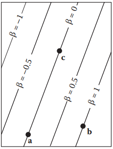

​																						**图2.37 重心坐标 β 是经过点 a 和 c 的直线的带符号缩放距离**

我们可以用类似的方法计算 γ 和 α。为了效率，通常明智的做法是直接计算两个重心坐标，然后使用式（2.30）计算第三个。

​		为了找到通过 **p~0~** 和 **p~1~** 的直线的这种 “理想” 形式，我们可以首先使用第 2.5.2 节的技术，通过顶点找到一些有效的隐式直线。式（2.17）给出
$$
f_{ab}(x,y) \equiv{} (y_{a} - y_{b})x + (x_{b} - x_{a})y + x_{a}y_{b} - x_{b}y_{a} = 0
$$
注意，f~ab~(x~c~, y~c~) 可能不等于 1，所以它可能不是我们所寻求的理想形式。通过除以 f~ab~(x~c~, y~c~) 得到
$$
\gamma{} = \frac{(y_{a}-y_{b})x + (x_{b}-x_{a})y + x_{a}y_{b} - x_{b}y_{a}}{(y_{a}-y_{b})x_{c} + (x_{b}-x_{a})y_{c} + x_{a}y_{b} - x_{b}y_{a}}
$$
​		除法的存在可能会让我们担心，因为它引入了除数为零的除法的可能性，但这对于面积不接近零的三角形是不可能发生的。α 和 β 也有类似的公式，但通常只需要一个：
$$
\beta{} = \frac{(y_{a}-y_{c})x + (x_{c}-x_{a})y + x_{a}y_{c} - x_{c}y_{a}}{(y_{a}-y_{c})x_{c} + (x_{c}-x_{a})y_{c} + x_{a}y_{c} - x_{c}y_{a}}		\\
\alpha{} = 1 - \beta{} - \gamma{}
$$
另一种计算重心坐标的方法是计算子三角形的面积 A~a~, A~b~, A~c~，如图2.38所示。重心坐标遵从该规则（式 2.33）
$$
\alpha{} = \frac{A_{a}}{A}			\\
\beta{} = \frac{A_{b}}{A}			\\
\gamma{} = \frac{A_{c}}{A}
$$
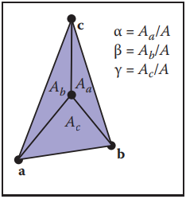

​																					**图2.38 重心坐标与所示的三个子三角形的面积成正比**

其中 A 是三角形的面积。注意，A = A~a~ + A~b~ + A~c~，所以它可以用两个加法计算，而不是一个完整的面积公式。这个规则仍然适用于三角形以外的点，如果这些面积允许带符号，原因如图 2.39 所示。注意，这些是带符号的面积，只要对 A 和子三角形 A~a~、A~b~ 和 A~c~ 使用相同的带符号面积计算，就可以正确地计算出这些面积。  

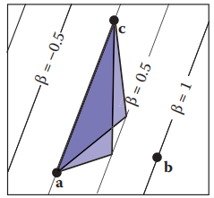

​						**图2.39 三角形的面积为底乘高，因此这两个三角形面积是相同的，与任何顶点在β = 0.5线上的三角形一样。高度和面积与β成正比**

#### 2.7.2 三维三角形（3D Triangles）

​		重心坐标的一个奇妙之处在于，它几乎可以直接地扩展到3D。如果我们假设点 **a**, **b**, **c** 是三维的，那么我们仍然可以使用这个表示
$$
\vec{p} = (1-\beta{}-\gamma{})\vec{a} + \beta{}\vec{b} + \gamma{}\vec{c}
$$
现在，当我们改变 β 和 γ，我们得出一个平面。三角形的法向量可以通过取三角形平面上任意两个向量的叉积得到（图 2.40），最简单的方法是用三条边中的两条作为这些向量，例如：（式 2.34）
$$
\vec{n} = (\vec{b} - \vec{a}) \cross{} (\vec{c} - \vec{a})
$$
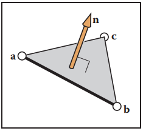

​														**图2.40 三角形的法向量垂直于三角形平面上的所有向量，因此也垂直于三角形的边**

注意这个法向量不一定是单位长度的，它遵循叉乘的右手法则。

​		三角形的面积可以用叉乘的长度求出来：（式 2.35）
$$
area = \frac{1}{2}||(\vec{b} - \vec{a}) \cross{} (\vec{c} - \vec{a})||
$$
注意，这不是带符号的面积，因此不能直接使用它来计算重心坐标。然而，我们可以观察到一个顶点顺序为“顺时针”的三角形的法向量将指向与顶点顺序为“逆时针”的三角形的法向量相反的方向。回忆这个
$$
\vec{a} \cdot{} \vec{b} = ||\vec{a}|| \; ||\vec{b}|| \cos{}\phi{}
$$
其中φ是两个向量的夹角。如果a和b是平行的，那么 cosφ = ±1，这就测试出了向量是否指向相同或相反方向。这与式（2.33）、（2.34）和（2.35）相结合，得出公式
$$
\alpha{} = \frac{\vec{n} \cdot{} \vec{n}_{a}}{||\vec{n}||^{2}}		\\
\beta{} = \frac{\vec{n} \cdot{} \vec{n}_{b}}{||\vec{n}||^{2}}		\\
\gamma{} = \frac{\vec{n} \cdot{} \vec{n}_{c}}{||\vec{n}||^{2}}
$$
其中 **n** 是等式（2.34）用顶点 **a**, **b**, **c** 求值，**n~a~** 为（2.34）式通过顶点 **b**、**c**、**p** 计算，依此类推，即：（式 2.36）
$$
\vec{n}_{a} = (\vec{c} - \vec{b}) \cross{} (\vec{p} - \vec{b})		\\
\vec{n}_{b} = (\vec{a} - \vec{c}) \cross{} (\vec{p} - \vec{c})		\\
\vec{n}_{c} = (\vec{b} - \vec{a}) \cross{} (\vec{p} - \vec{a})
$$

### 常见问答（Frequently Asked Questions）

- **为什么没有向量除法？**

事实证明，向量除法没有一个 “好的” 类比。然而，有可能通过详细审查这个问题来得到四元数的推理（参阅章节备注中引用的 Hoffmann 的书）。

- **对于超过三条边的多边形，是否有像重心坐标一样简洁的东西？**

不幸的是并没有，即使是凸四边形也要复杂得多，这就是三角形是图形中常见的几何基元的原因之一。

- **是否有一种隐式的三维直线形式？**

不。然而，两个三维平面的交点定义了一条三维直线，因此一条三维直线可以用两个联立隐式三维方程来描述

### 备注（Notes）

​		向量分析的历史特别有趣。它在很大程度上是由 Grassman 在19世纪中期发明的，但后来被忽视，再又被重新使用（Crowe，1994）。Grassman 现在在图形领域有一批追随者，他们正在基于他的一些想法发展《Geometric Algebra》（Doran & Lasenby，2003）。如果读者对为什么标量和向量乘积在某种意义上是正确的，以及为什么我们没有一个常用的向量除法感兴趣，可以在简明的《About Vectors》（Hoffmann，1975）一书中获得启发。另一个重要的几何工具是 Hamilton 在19世纪中期发明的四元数，四元数在许多情况下都很有用，尤其在涉及方向的情况下更是如此（Hanson，2005）。

### 练习（Exercises）

1. 集合的基数是它所包含的元素的数量，在IEEE浮点表示（1.5 节）下，浮点数的基数是多少？

2.  是否可能实现一个函数将32位整数映射到64位整数，且具有明确定义的逆？从32位整数到64位整数的所有函数都有定义良好的反函数吗?

3.  用三个区间的笛卡儿积指定单位立方体（x、y 和 z 坐标都在 0 到 1 之间闭区间）。

4.  如果你有 ln(x) 的自然对数函数，请说明你如何用它来实现一个 log(b, x )的函数，其中 b 是 log 的底。当b为负时，函数应该做什么？假设都是 IEEE 浮点数实现。

5.  解二次方程 2x^2^ + 6x +4 = 0。

6.  实现一个函数，取二次方程 Ax^2^ + Bx + C = 0 的系数 A, B，C 并计算这两个解。函数是否返回有效解（不是 NaN）的数量，并填充入返回参数，以便两个解中较小的是第一个。

7. 证明如下两个等式等价（假设算法是精确的），并解释如何为每个根选择一个方法去避免减去几乎相等的浮点数（会导致精度损失）
   $$
   x = \frac{-B \pm{} \sqrt{B^{2} - 4AC}}{2A}
   $$

   $$
   x = \frac{2C}{-B \mp{} \sqrt{B^{2} - 4AC}}
   $$

8. 通过反例证明，对于三维向量 **a**, **b**, **c** , **a** × (**b** × **c**) = (**a** × **b**) × **c** 并不总是正确的。

9. 给定非平行的三维向量 **a** 和 **b**，计算一个右手系正交基使 **u** 平行于 **a**，且 **v** 在由 **a** 和 **b** 定义的平面上。

10. f(x, y, z) = x^2^ + y − 3z^3^ 的梯度是多少？

11. 轴对齐的二维椭圆的参数形式是什么?

12. 平面通过三维点 (1,0,0)，(0,1,0) 和 (0,0,1) 的隐式方程是什么？参数方程是什么？这个平面的法向量是什么？

13. 给定四个二维点 a~0~, a~1~, b~0~ 和 b~1~，设计一个健壮的程序来确定线段 a~0~a~1~ 和 b~0~b~1~ 是否相交。

14. 设计了一个鲁棒的程序来计算一个二维点相对于三个非共线点的重心坐标。