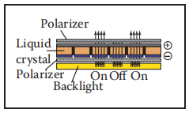
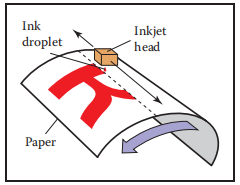
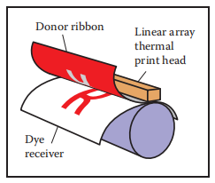
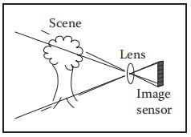
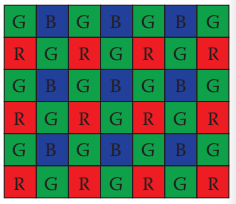
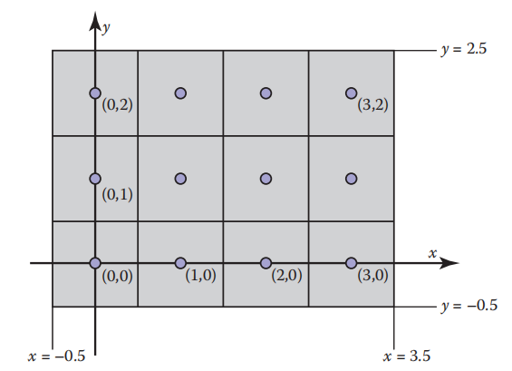
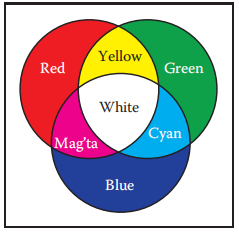
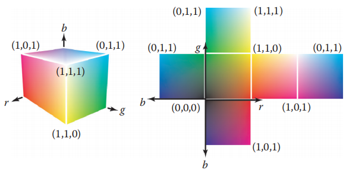
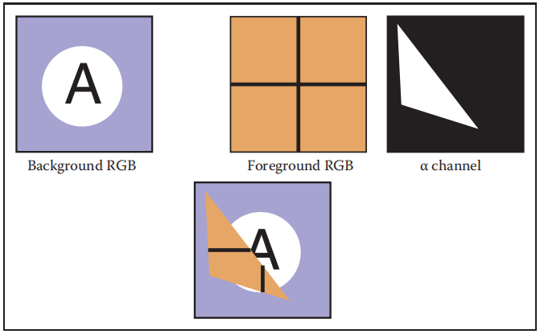

​		大多数计算机图形图像是通过某种光栅显示器（raster display）呈现给用户的，光栅显示器显示图像为矩形像素（pixel）阵列。一个常见的例子是，一种平板电脑显示器或电视，它有一个小的发光像素的矩形阵列，可以单独设置成不同的颜色来产生任何想要的图像。不同的颜色是由不同强度的红、绿、蓝光混合而成的。大多数打印机，如激光打印机和喷墨打印机，也是光栅设备，它们是基于扫描的：其没有物理的像素网格，但图像是通过在网格上选定的点上沉积墨水来顺序放置的。

*像素是 “图像元素” 的缩写*

​		光栅在图像输入设备中也很普遍，数码相机包含一个由光敏像素网格组成的图像传感器，每个像素记录落在它上面的光线的颜色和强度，桌面扫描仪包含一个线性像素阵列，它被扫过被扫描的页面，每秒进行多次测量，以生成一个像素网格。

*打印机的颜色要复杂得多，至少要混合四种颜料。*

​		因为光栅在设备中非常普遍，所以光栅图像（rester image）是存储和处理图像最常用的方法 。光栅图像只是一个二维数组，存储每个像素的像素值——通常是存储为三个数字的一种颜色，分别是红、绿和蓝。存储为三个数字。存储在内存中的光栅图像可以通过使用存储图像中的每个像素来控制显示的一个像素的颜色来显示。

*或者，可能是因为栅格图像太方便了，所以栅格设备很流行。*

​		但我们并不总是希望以这种方式显示图像。我们可能想要改变图像的大小或方向，纠正颜色，甚至显示粘贴在移动三维表面上的图像，即使在电视中，显示器也很少有与所显示图像相同的像素数。这样的考虑破坏了图像像素和显示像素之间的直接联系。最好将光栅图像看作是要显示的图像的与设备无关（device-independent）的描述，而显示设备则是接近理想图像的一种方法。

​		除了使用像素数组之外，还有其他描述图像的方法。矢量图像（vector image）是通过存储对形状的描述来描述的——以线或曲线为边界的颜色区域——而不参考任何特定的像素网格，本质上，这相当于存储显示图像的指令，而不是存储显示图像所需的像素，矢量图像的主要优点是它们与分辨率无关，可以在非常高分辨率的设备上很好地显示，相应的缺点是在显示之前必须对其进行栅格化。矢量图像通常用于文本、图表、机械制图和其他应用，在这些应用中，清晰度和精度很重要，其不需要摄影图像和复杂的着色。

​		在本章中，我们讨论光栅图像和显示器的基础知识，特别关注非线性的标准显示。当我们在后面的章节讨论计算图像时，像素值如何与光强联系起来的细节是非常重要的。

*或者:你必须知道图像中这些数字的真正含义*

### 3.1 光栅设备（Raster Devices）

​		在讨论抽象的光栅图像之前，先看看使用这些图像的一些特定设备的基本操作是有指导意义的。 一些熟悉的光栅设备可以归类为一个简单的层次结构：

- 输出
  - 显示
    - 透射：液晶显示器（liquid crystal display，LCD）
    - 发射：发光二极管（light-emitting diode，LED）显示器
  - 硬拷贝
    - 硬墨打印机（ink-jet printer）
    - 连续色调：热升华打印机（dye sublimation printer）
- 输入
  - 二维阵列传感器：数字摄像机
  - 一维阵列传感器：平板扫描仪

#### 3.1.1 显示器（Displays）

​		目前的显示器，包括电视和数字电影放映机以及电脑上的显示器和放映机，几乎都是基于固定的像素阵列。它们可以分为发射型显示器和透射型显示器，前者使用像素直接发射可控数量的光，后者像素本身不发射光，而是改变它们允许通过的光的数量。透射显示器需要光源来照亮它们：在直视（direct-viewed）显示器中，这是阵列后面的背光（backlight），在投影仪中，它是一盏灯，它发出的光通过阵列后投射到屏幕上。发射显示器是它自己的光源。

​		LED 显示器是发射显示器类型的一个例子。每个像素由一个或多个 LED 组成，它们是半导体器件（基于无机或有机半导体），其发光强度取决于通过它们的电流（图 3.1）。

​																											**图3.1 发光二极管显示器的工作图**

​		彩色显示器中的像素被分为三个独立控制的亚像素（subpixels）——红色，绿色，蓝色——每个像素都有自己的 LED 并使用不同的材料，以便它们发出不同颜色的光（图 3.2）。当从远处观看显示器时，眼睛无法分离单独的亚像素，所感知到的颜色是红、绿、蓝的混合色。  

​																						**图3.2  在平板显示器的一个像素内的红、绿、蓝亚像素**

​		LCD 是透射型显示器的一个例子。液晶是一种材料，其分子结构使其能够旋转通过它的光的偏振，并且通过外加电压可以调节旋转的程度。一个 LCD 像素（图3.3）的后面有一层偏振光膜，因此它被偏振光照亮——假设它是水平偏振光。

**图3.3 在关闭状态下(下图)的一个像素的LCD显示器，前面的偏振器阻挡了所有通过后面的偏振器的光。在开启状态（上图），在这个状态下液晶单元旋转光的偏振，使它可以通过前面的偏振器。图由 Erik Reinhard（Reinhard，Khan，Akyuz，& Johnson，2008）提供 **

​		在所述像素前的第二层偏振光膜定向以只传输垂直偏振光。如果将施加的电压设置为中间的液晶层不改变偏振，则所有光都被阻挡，像素处于“关闭”（最小强度）状态。如果电压设置为使液晶旋转90度的偏振，那么所有从像素后面进入的光将从前面通过，像素完全 “打开”——它有最大的强度。中间电压将部分旋转偏振，使前偏振器部分阻挡光，导致强度介于最小和最大之间（图 3.4）。类似彩色 LED 显示器，彩色 LCD 在每个像素内都有红、绿、蓝三个亚像素，且它们是独立的并拥有红、绿、蓝滤光片。

​																										**图3.4 液晶显示器（LCD）的工作原理**

​		任何具有固定像素网格的显示器，包括这些和其他技术，都具有由网格大小决定的基本的固定分辨率。对于显示器和图片，分辨率仅仅意味着像素网格的尺寸：若桌面显示器的分辨率是 1920 × 1200 像素，这意味着它有 2,304,000 像素排列在 1920 列和 1200 行中。

*显示器的分辨率有时被称为“本机分辨率”，因为大多数显示器可以通过内置转换处理其他分辨率的图像。*

​		一个不同分辨率的图像，要填满屏幕，必须采用第9章的方法将其转换为 1920 × 1200 图像。

#### 3.1.2 硬拷贝设备（Hardcopy Devices）

​		在纸上永久记录图像的过程与在显示器上短暂显示图像的过程有非常不同的限制。在印刷中，颜料分布在纸上或其他介质上，当光线从纸上反射时，就形成了想要的图像。打印机和显示器一样是光栅设备，但许多打印机只能打印二进制图像（binary image）——颜料要么在每个网格位置沉积，要么不在每个网格位置，不可能有中间数量。

​		喷墨打印机（图3.5）是一个通过扫描形成光栅图像的设备示例。喷墨打印头含有携带颜料的液体墨水，可以在电子控制下以非常小的滴状喷射。喷墨打印头在纸上移动，当其经过应该接收墨水的网格位置时，墨水滴出，没有喷墨的区域是想要保持空白的，每次扫完后，将纸稍稍向前移动，然后放置下一行网格。彩色打印是通过使用几个打印头，每个喷墨与不同的颜料，以便每个网格位置可以收到不同的颜色滴的任何组合。由于所有的水滴都是相同的，喷墨打印机打印出二值图像：在每个网格点上有墨水或没有墨水，不存在中间着色。

*还有一种是连续喷墨打印机，它在纸上绕着旋转的滚筒以连续的螺旋路径进行打印，而不是前后移动磁喷墨头。*

​																												**图3.5 喷墨打印机的工作原理**

​		喷墨打印机没有像素的物理阵列，分辨率是由水滴的大小和每次扫纸后纸张前进的距离决定的。许多喷墨打印机在打印头上有多个喷嘴，可以一次进行多次扫描，但最终决定行间距的是纸张的前进速度，而不是喷嘴的间距。

​		热染料转移（thermal dye transfer）过程是连续色调（continuous tone）印刷过程的一个例子，这意味着可以在每个像素上沉积不同数量的染料——它不像喷墨打印机那样要么全部要么全部不要（图3.6）。一个含有彩色染料的供体色带（donor ribbon）被压在纸张或染料接收器（dye receiver），打印头包含一个线性阵列的加热元件，每个加热元件对应图像中的每一列像素。当纸和纸带经过打印头时，加热元件就会开和关，在需要染料的地方加热纸带，使染料从纸带扩散到纸上 ，这一过程对每种染料重复进行。由于更高的温度导致更多的染料被转移，在每个网格位置沉积的每种染料的数量可以被控制，从而允许产生连续的颜色范围。在打印头的加热元件的数量在整个页面的方向上建立了一个固定的分辨率，但是沿着页面的分辨率是由加热和冷却的速度相对于纸张的速度来决定的。

​																											**图3.6 热染料转移打印机的工作原理**

​		与显示器不同，打印机的分辨率是用像素密度（pixel density）而不是像素总数来描述的。因此，热染料转移打印机的打印头每英寸间距为300的元素在页面上的分辨率为每英寸300像素（pixels per inch，ppi）。如果沿着页面的分辨率被选择为相同的，我们可以简单地说打印机的分辨率是300 ppi。在每英寸1200个网点的网格上放置点的喷墨打印机被描述为分辨率为每英寸1200个网点（dot per inch，dpi）。因为喷墨打印机是一种二进制设备，它需要更精细的网格，其至少有两个原因：因为边缘是突然的黑/白边界，所需要非常高的分辨率以避免出现阶梯或走样问题（参见第8.3节）；在打印连续色调图像时，需要高分辨率通过打印被称为半色调（halftone）的可变密度网点图案来模拟中间色。

*术语 “dpi” 经常用来表示 “每英寸像素（pixels per inch）”，但dpi应该用于二进制设备，而ppi用于连续色调设备*

#### 3.1.3 输入设备（Input Devices）

​		栅格图像必须来自某个地方，而任何不是由某种算法计算出来的图像必须由某些栅格输入设备（raster input device）测量出来，通常是相机或扫描仪。即使在渲染三维场景的图像时，照片也经常被用作纹理贴图（参见第 11 章）。光栅输入设备必须对每个像素进行光测量，（像输出设备一样）它们通常基于传感器阵列。

​		数码相机是二维阵列输入设备的一个例子。相机里的图像传感器是一种半导体装置，由光敏像素组成网格。两种常见的阵列被称为 CCDs（电荷耦合器件，charge-coupled devices）和 CMOS（互补金属氧化物半导体，complimentary metal-oxide-semiconductor）图像传感器。相机的镜头将要拍摄的场景的图像投射到传感器上，然后每个像素测量落在其上的光能，最终得到一个进入输出图像的数字（图 3.7）。彩色显示器也使用差不多的方法，用红、绿、蓝三个亚像素，大部分彩色相机工作原理是通过颜色滤镜阵列（color-filter array）或马赛克（mosaic）来允许每个像素只看到红色、绿色或蓝色光，不使用图像处理软件来填充缺失值的过程被称为去马赛克（demosaicking）（图 3.8）。

​																													**图3.7 数码相机的工作原理**

​												**图3.8 大多数彩色数码相机都使用类似 Bayer mosaic 的滤色器阵列。每个像素可以测量红光、绿光或蓝光。**

​		其他相机使用三个独立的阵列或阵列中的三个独立层，去测量每个像素上独立的红、绿、蓝值，这样无需进一步处理就能生成可用的彩色图像。相机的分辨率是由数组中的固定像素数决定的，通常用像素总数来引用：一个有 3000 列 2000 行阵列的相机产生的图像分辨率为 3000 × 2000，有 600 万像素，被称为 600 万像素（megapixel，MP）的摄像机。重要的是要记住，马赛克传感器不能测量完整的彩色图像，所以一个相机测量相同的像素数，但独立的红、绿、蓝测量记录了比马赛克传感器更多的图像信息。  

*卖相机的人用 “mega” 表示10^6^ megabytes，而不是 2^20^ megabytes。*

​		平板扫描仪也可以测量每个像素网格的红、绿、蓝值，但像热染料转移打印机一样，它使用一维阵列扫描被扫描的页面，每秒进行多次测量。整个页面的分辨率由阵列的大小确定，而沿页面的分辨率则由测量频率与扫描头移动速度的比率决定。彩色扫描仪有一个 3 × n~x~ 数组，其中 n~x~ 是整个页面的像素数，且有三列红色、绿色和蓝色过滤器覆盖。在测量三种颜色的时间之间有一个适当的延迟，这允许在每个网格点上测量三种独立的颜色，与连续色调打印机一样，扫描仪的分辨率以每英寸像素（ppi）计算。

*扫描仪的分辨率有时被称为 “光学分辨率”，因为大多数扫描仪可以通过内置转换产生其他分辨率的图像。*

​																													**图3.9 平板扫描器的工作原理**

​		有了这些关于图像来源和去向的具体信息，现在我们将以在图形算法中使用它们的方式更抽象地讨论图像。

### 3.2 图片，像素和几何（Images，Pixels，and Geometry）

​		我们知道一个栅格图像是一个大的像素数组，每个像素存储关于图像在其网格点上的颜色的信息。我们已经看到了各种输出设备如何处理我们发送给它们的图像，以及输入设备如何从物理世界中由光形成的图像中获得图像。但对于计算机的计算，我们需要一个方便的抽象，它独立于任何设备的细节，我们可以用它来推理如何产生或解释存储在图像中的值。

​		当我们测量或复制图像时，它们采用的是光能的二维分布形式：监视器发出的光作为显示器表面位置的函数; 落在相机图像传感器上的光作为传感器平面上位置的函数; 在纸上的反射率，或被反射的光（相对于被吸收的光）的比例，是纸上位置的函数。所以在现实世界中，图像是二维区域上定义的函数——几乎总是矩形。所以我们可以把图像抽象成函数
$$
I(x,y)：R \rightarrow{} V
$$
*“一个像素不是一个小方块!” ——Alvy Ray Smith（A.R.Smith，1995）*

其中 R⊂R^2^ 是一个矩形区域，V 是可能的像素值的集合。最简单的情况是一个理想化的灰度图像，其中矩形中的每个点只有一个亮度（没有颜色），我们可以说 V = R^+^（非负实数）。一个理想化的彩色图像，在每个像素上都有红、绿和蓝的值，其 V = (R^+^)^3^。我们将在下一节讨论 V 的其他可能性。

*有没有不是矩形的光栅设备?*

​		栅格图像与连续图像的抽象概念有什么关系？从具体的例子来看，来自相机或扫描仪的像素是对像素周围某个小区域上图像的平均颜色的测量，显示器像素（包括其红色、绿色和蓝色的亚像素）的设计使该像素表面上的图像的平均颜色由光栅图像中相应的像素值控制，在这两种情况下，像素值都是图像颜色的局部平均值，它被称为图像的采样点（point sample）。换句话说，当我们在一个像素中找到 x 值时，它意味着 “在这个网格点附近的图像的值是 x”。图像作为函数的采样表示的思想将在第9章中进一步探讨。

​		一个普通但重要的问题是像素在2D空间中的位置。这只是一个惯例，但建立一个一致的惯例是重要的！在这本书中，光栅图像是由表示像素的列（i）和行（j）的对（i，j）索引的，从左下角开始计数，如果图像有 n~x~ 列和 n~y~ 行像素，左下角像素为 (0，0)，右上角像素为 (n，n~y−1~) 。我们需要2D真实屏幕坐标来指定像素位置。我们将像素的采样点放置在整数坐标上，如图 3.10 中的 4 × 3 屏幕所示。

*在一些 APIi 和许多文件格式中，图像的行是由上至下组织的，因此 (0,0) 位于左上角。这是有历史原因的：模拟电视传输的行是从顶部开始的。*

​																				**图3.10 4 × 3 像素屏幕的坐标。注意，在某些 API 中，y 轴是向下的。**

​		图像的矩形域的宽度为 n~x~，高度为 n~y~，并以网格为中心，这意味着它在每边的最后一个采样点之外扩展了半个像素。所以 n~x~ × n~y~ 图像的矩形域是
$$
R = [-0.5,n_{x} - 0.5] \cross{} [-0.5, n_{y} - 0.5]
$$
*一些系统将坐标移动半个像素，将样本点放置在整数中间，但将图像边缘放置在整数处。*

​		同样，这些坐标只是约定，但是在以后实现摄像机和视图转换时记住它们很重要.

#### 3.2.1 像素值（Pixel Values）

​		到目前为止，我们已经用实数来描述像素的值，表示图像中某一点的强度（可能分别表示红色、绿色和蓝色）。这表明图像应该是浮点数数组，每个像素存储一个（用于灰度或黑白图像）或三个（用于RGB彩色图像）32 位浮点数。当需要它的精度和值的范围时，有时会使用这种格式，但是图像有很多像素，存储和传输图像的内存和带宽总是很少，在这种格式下，一张 1000 万像素的照片就需要 115 MB 的内存。

*为什么是 115 MB 而不是 120 MB？*

​		对于直接显示的图像，需要更小的范围。虽然理论上可能的光强度范围是无界的，但任何给定的设备都有一个绝对有限的最大强度，所以在许多情况下，像素有一个有界的范围是完全足够的，通常为简单起见，取为 [0,1]。例如，8位图像中的可能值是0、1/255、2/255、..．254/255、1。使用浮点数存储的图像允许使用大范围的值，通常称为高动态范围（HDR）图像，以区别于使用整数存储的固定范围或低动态范围（LDR）图像。参见第21章，深入讨论高动态范围图像的技术和应用。

*255的分母，而不是256，很尴尬，但是能够准确地表示0和1是很重要的。*

​		以下是一些典型应用中的像素格式：

- 1-bit 灰度——不需要中间灰度的文本和其他图像（要求高分辨率）
- 8-bit RGB 固定范围颜色（每像素24位）——网页，电子邮件应用程序，消费者照片
- 8-bit 或 10-bit 固定范围 RGB（24-30 bits/像素）——计算机显示器的数字接口
- 12-bit 到 14-bit 固定范围RGB（36-42 bits/像素）——专业摄影的原始相机图像
- 16-bit 固定范围 RGB（48 bits/像素）——专业摄影，打印，用于固定范围图像处理的中间格式
- 16-bit 固定范围灰度（16 bits/像素）——放射学，医学成像
- 16-bit “半精度” 浮点 RGB-HDR 图像——实时渲染的中间格式
- 32-bit 浮点 RGB——通用的中间格式，用于软件渲染，HDR图像处理

​	减少用于存储每个像素的比特数会导致图像中出现两种不同类型的 artifact，或人为引入缺陷。首先，当亮度大于像素设置为最大可表示值时，使用固定范围值对图像进行编码就会产生裁剪，也就是会裁减到最大值。例如，有阳光的场景照片可能包含比白色表面更亮的反射，当图像被转换到要显示的固定范围时，这些将被裁剪（即使它们是由相机测量的）。其次，当需要将像素值四舍五入到最接近的可表示值时，编码精度有限的图像会导致量化 artifact（quantization artifact）或条带（banding），从而在强度或颜色上引入可见的跳跃。在动画和视频中条带是特别危险的，在静态图像中，条带可能不是令人反感，但当它们来回移动时，就变得非常明显。

#### 3.2.2 检测强度和伽马（Monitor Intensities and Gamma）

​		所有现代显示器都采用数字输入的像素 “值”，并将其转换为强度级别。真正的显示器在关闭时有一些非零的强度，因为屏幕反射一些光，为了我们的目的，我们可以考虑这个为 “黑色” ，显示器完全打开为 “白色”。我们假设像素颜色的数值描述范围从 0 到 1，黑色是 0，白色是 1，介于黑色和白色之间的灰色是 0.5，注意，这里的 “中间” 指的是来自像素的物理量，而不是外观。人类对强度的感知是非线性的，不会是目前讨论的一部分，详见第 20 章。

​		要想在监视器上生成正确的图像，必须了解两个关键问题。第一，监视器对于输入是非线性的，例如，如果给一个显示器 0、0.5 和 1.0 作为三个像素的输入，显示的强度可能是 0、0.25 和 1.0（关闭，四分之一完全打开，和完全打开）。作为这种非线性的近似描述，监视器通常用 γ（“gamma”）值来表示。这个值就是公式中的自由度（式 3.1）
$$
显示强度 = (最大强度)a^{\gamma}
$$
其中a是 0 到 1 之间的输入像素值。例如，如果显示器的伽玛值为 2.0，而我们输入值 a = 0.5，则显示的强度将是最大可能强度的四分之一，因为 0.5^2^ = 0.25。注意，a = 0 映射到强度零，a = 1 映射到最大强度，与 γ 值无关。用 γ 描述显示器的非线性只是一个近似值，我们不需要很精确地估计一个硬件的 γ 值。衡量非线性的一个很好的视觉方法是找到 a 在黑白间一半的强度值。a 将会为
$$
0.5 = a^{\gamma}
$$
如果我们能找到a，我们可以通过两边取对数来推导 γ
$$
\gamma{} = \frac{\ln{}0.5}{\ln{}a}
$$
我们可以通过一种标准技术找到这个 a，即在输入 a 的灰色像素的正方形旁边显示一个黑白像素的棋盘图案（图 3.11），然后让用户调整 a（比如用滑块）直到两边的平均亮度匹配。当你从远处看这张照片（如果你是近视，也可以不戴眼镜），当a产生介于黑白中间的强度时，图像的两边看起来差不多。这是因为模糊的棋盘混合了偶数个白色和黑色像素，所以整体效果是一个统一的颜色，介于白色和黑色中间。

​								**图3.11 从远处看，交替的黑白像素介于黑白中间。监视器的伽马可以通过寻找灰度值来推断，灰度值似乎与黑白图案的强度相同。**

一旦我们知道了 γ，就可以伽马校正（gamma correct）我们的输入，使a = 0.5 的值以介于黑色和白色中间的强度显示出来。这是通过该变换完成的
$$
a' = a^{\frac{1}{\gamma}}
$$
*对于带有模拟接口的显示器，很难沿水平方向快速改变强度，水平黑白条纹比棋盘更好。*

将此公式代入式（3.1）可得
$$
显示强度=(a')^{\gamma{}}=(a^{\frac{1}{\gamma{}}})^{\gamma{}}(最大强度)=a(最大强度)
$$
​		真实的显示器的另一个重要特征是它们接受量化的输入值，因此，虽然我们可以在浮点数范围[0,1]内操纵强度，但对监视器的详细输入是一个固定大小的整数，这个整数最常见的范围是 0-255，可以保存在 8 位存储中。这意味着a的可能值不是[0,1]中的任何数字，而是
$$
可能的a值=\{\frac{0}{255},\frac{1}{255}, ... ,\frac{254}{255},\frac{255}{255}\}
$$
这意味着可能显示的强度值是近似的
$$
\{M(\frac{0}{255})^{{\gamma{}}},M(\frac{1}{255})^{{\gamma{}}},...,M(\frac{254}{255})^{{\gamma{}}},M(\frac{255}{255})^{{\gamma{}}}\}
$$
其中 M 是最大强度。在需要控制精确强度的应用中，我们需要测量 256 种可能的强度，这些强度在屏幕上的不同点可能是不同的，尤其是对于 CRT。它们也可能随观察角度而变化，幸运的是，很少有应用需要如此精确的校准。

### 3.3 RGB 颜色空间（RGB Color）

​		大多数计算机图形图像是用红-绿-蓝（RGB）颜色定义的。RGB 颜色是简单的空间，允许转换到大多数计算机屏幕的控制上。在本章中将从用户角度讨论 RGB 颜色，目的是操作设备。关于颜色的更深入的讨论将在第19章中给出，但是 RGB 颜色空间的机制将允许我们编写大多数图形程序。RGB 颜色空间的基本思想是通过混合三原光来显示颜色：红色、绿色、蓝色，这些光以一种加法的方式混合在一起。

*在小学的时候，你可能学过小学的颜色是红、黄、蓝，例如：黄 + 蓝 = 绿。这就是减色法混色，它与我们在显示器中看到的加色混色从根本上不同。*

​		在 RGB 加色混合中，我们有（图 3.12）
$$
红+绿=黄		\\
绿+蓝=蓝绿(Cyan)		\\
蓝+红=品红(Magta)		\\
红+绿+蓝=白
$$
颜色 "cyan" 是一种蓝绿色，“mageta” 是一种紫色

​																							 						**图3.12 RGB 加色混合规则**

​		如果我们允许将主光源从完全关闭（用像素值 0 表示）调暗（dim）到完全打开（用像素值 1 表示），我们就可以创建所有可以在 RGB 监视器上显示的颜色。红色、绿色和蓝色像素值创建一个具有红色、绿色和蓝色轴的三维RGB颜色立方体，坐标轴的允许坐标范围从 0 到 1。颜色立方体如图 3.13 所示。

​																	**图3.13 RGB 颜色立方体在三维空间以及它的面展开。任何 RGB 颜色都是立方体中的一点。**
$$
黑色=(0,0,0)			\\
红色=(1,0,0)			\\
绿色=(0,1,0)			\\
蓝色=(0,0,1)			\\
黄色=(1,1,0)			\\
品红=(1,0,1)			\\
蓝绿=(0,1,1)			\\
白色=(1,1,1)
$$
​		实际的 RGB 等级通常以量化的形式给出，就像第 3.2.2 节讨论的灰度一样，每个分量都用一个整数指定。这些整数最常见的大小是每个一个字节，所以三个 RGB 分量都是 0 到 255 之间的整数，这三个整数总共占用三个字节，即 24 位。因此，拥有 “24-bit 颜色” 的系统对于三种基本颜色中的每一种都有 256 种可能的级别。章节 3.2.2 中讨论的伽马校正问题也分别适用于每个 RGB 分量。

### 3.4 透明混合（Alpha Compositing）

​		通常我们只希望部分覆盖像素的内容，一个常见的例子发生在合成中，我们有一个背景，想要在它上面插入一个前景图像，对于前景中的不透明像素，我们只需替换背景像素，对于完全透明的前景像素，我们不改变背景像素。对于部分透明的像素，必须小心一些。当前景对象具有部分透明区域(如玻璃)时，就会出现部分透明像素。但是，最常见的前景和背景必须混合的情况是，当前景对象仅部分覆盖像素时，要么是在前景对象的边缘，要么是在遥远的树的叶子之间存在亚像素洞。

​		将前景对象与背景对象混合所需的最重要的信息是像素覆盖率（pixel coverage），它表示前景层覆盖的像素的比例，我们叫这个分数为 α。如果我们想将前景色 c~f~ 覆盖背景色 c~b~，前景色所覆盖的像素的比例为 α，则可以使用该公式（式 3.2）
$$
c = \alpha{}c_{f} + (1 - \alpha{})c_{b}
$$
对于不透明的前景层，解释为前景对象覆盖像素矩形内的区域 α，背景对象覆盖剩余区域，即（1−α）。对于透明的前景层（想象在玻璃或描图纸上使用半透明颜料画的一副图片），解释为前景层阻碍（1−α）部分的光通过背景和贡献自己的 α 部分代替了阻碍的那部分颜色。 使用（3.2）式的示例如图 3.14 所示。

*因为前景层和背景层的权重之和是 1，如果前景层和背景层颜色相同，颜色不会改变。*

​									**图3.14 使用式（3.2）混合的一个例子。前景图像实际上被 α 通道裁剪，然后放在背景图像的顶部。混合的结果如底部的图所示**

​		一个图像中所有像素的 α 值可以存储在一个单独的灰度图像中，这被称为 alpha 掩码（alpha mask）或透明度掩码（transparency mask）。或者信息可以存储为 RGB 图像中的第四个通道，在这种情况下称为 alpha 通道（alpha channel），图像可以称为 RGBA 图像。对于 8 位图像，每个像素占用 32 位，在许多计算机体系结构中该数据块的大小是很方便的。

​		虽然通常使用的是（3.2）式，但在许多情况下，α 的使用是不同的（Porter & Duff, 1984）

#### 3.4.1 图像储存（Image Storage）

​		大多数 RGB 图像格式使用红、绿、蓝通道各 8 位，这将为一个百万像素的图像生成大约 3 兆字节的原始信息。为了减少存储需求，大多数图像格式都允许某种形式的压缩。在高水平上，这种压缩要么是无损的（lossless），要么是有损的（lossy），在无损压缩中没有信息被丢弃，而在有损系统中有些信息会不可恢复地丢失。流行的图像存储格式包括：

- jpeg： 这种有损格式基于人眼视觉系统中的阈值对图像块进行压缩。这种格式适用于自然图像。
- tiff：这种格式最常用来保存二进制图像或无损压缩的 8 位或 16 位 RGB，尽管还有许多其他选项。
- ppm：这种非常简单的无损、未压缩格式最常用于 8 位 RGB 图像，尽管存在许多选项。
- png：这是一组带有一组好的开源管理工具的无损格式。

由于压缩和变体，可能会涉及到为图像编写输入/输出例程。幸运的是，人们通常可以依靠库例程来读写标准文件格式。对于简单性高于效率性的快速应用程序，一个简单的选择是使用原始 ppm 文件，通常可以简单地通过将存储在内存中的映像的数组转储到一个文件中，并在适当的头文件之前写入。

### 常见问答（Frequently Asked Questions）

- **他们为什么不直接把显示器做成线性的就能避免所有这些伽玛的问题呢?**

理想情况下，显示器的 256 种可能强度看起来应该是均匀间隔的，而不是能量上的线性间隔。因为人类对强度的感知本身是非线性的，1.5 到 3 之间的 gamma（取决于观察条件）将使强度在主观意义上近似一致，所以，gamma 就是一个特性， 否则制造商就会把显示器做成线性的。

### 练习（Exercises）

1. 模拟从 Bayer mosaic 获得的图像，通过拍摄自然图像（最好是扫描照片，而不是已经应用了 Bayer mosaic 的数字照片），并创建一个由交错的红/绿/蓝通道组成的灰度图像。这模拟了数码相机的原始输出，现在从输出创建一个真正的RGB图像，并与原始图像进行比较。

