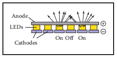
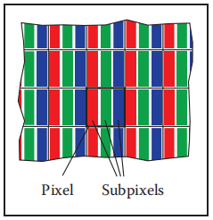
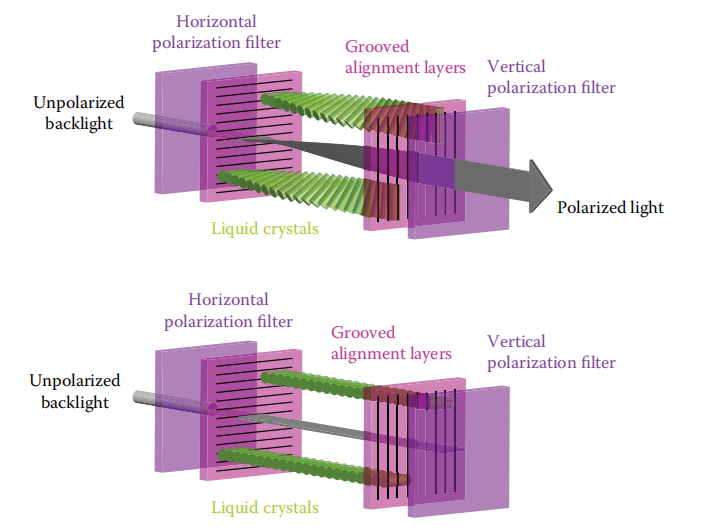

​	大多数计算机图形图像是通过某种光栅显示器（raster display）呈现给用户的，光栅显示器显示图像为矩形像素（pixel）阵列。一个常见的例子是，一种平板电脑显示器或电视，它有一个小的发光像素的矩形阵列，可以单独设置成不同的颜色来产生任何想要的图像。不同的颜色是由不同强度的红、绿、蓝光混合而成的。大多数打印机，如激光打印机和喷墨打印机，也是光栅设备，它们是基于扫描的：其没有物理的像素网格，但图像是通过在网格上选定的点上沉积墨水来顺序放置的。

*像素是 “图像元素” 的缩写*

​		光栅在图像输入设备中也很普遍，数码相机包含一个由光敏像素网格组成的图像传感器，每个像素记录落在它上面的光线的颜色和强度，桌面扫描仪包含一个线性像素阵列，它被扫过被扫描的页面，每秒进行多次测量，以生成一个像素网格。

*打印机的颜色要复杂得多，至少要混合四种颜料。*

​		因为光栅在设备中非常普遍，所以光栅图像（rester image）是存储和处理图像最常用的方法 。光栅图像只是一个二维数组，存储每个像素的像素值——通常是存储为三个数字的一种颜色，分别是红、绿和蓝。存储为三个数字。存储在内存中的光栅图像可以通过使用存储图像中的每个像素来控制显示的一个像素的颜色来显示。

*或者，可能是因为栅格图像太方便了，所以栅格设备很流行。*

​		但我们并不总是希望以这种方式显示图像。我们可能想要改变图像的大小或方向，纠正颜色，甚至显示粘贴在移动三维表面上的图像，即使在电视中，显示器也很少有与所显示图像相同的像素数。这样的考虑破坏了图像像素和显示像素之间的直接联系。最好将光栅图像看作是要显示的图像的与设备无关（device-independent）的描述，而显示设备则是接近理想图像的一种方法。

​		除了使用像素数组之外，还有其他描述图像的方法。矢量图像（vector image）是通过存储对形状的描述来描述的——以线或曲线为边界的颜色区域——而不参考任何特定的像素网格，本质上，这相当于存储显示图像的指令，而不是存储显示图像所需的像素，矢量图像的主要优点是它们与分辨率无关，可以在非常高分辨率的设备上很好地显示，相应的缺点是在显示之前必须对其进行栅格化。矢量图像通常用于文本、图表、机械制图和其他应用，在这些应用中，清晰度和精度很重要，其不需要摄影图像和复杂的着色。

​		在本章中，我们讨论光栅图像和显示器的基础知识，特别关注非线性的标准显示。当我们在后面的章节讨论计算图像时，像素值如何与光强联系起来的细节是非常重要的。

*或者:你必须知道图像中这些数字的真正含义*

### 3.1 光栅设备（Raster Devices）

​		在讨论抽象的光栅图像之前，先看看使用这些图像的一些特定设备的基本操作是有指导意义的。 一些熟悉的光栅设备可以归类为一个简单的层次结构：

- 输出
  - 显示
    - 透射：液晶显示器（liquid crystal display，LCD）
    - 发射：发光二极管（light-emitting diode，LED）显示器
  - 屏幕拷贝
    - 二元：喷墨打印机（ink-jet printer）
    - 连续色调：热升华打印机（dye sublimation printer）
- 输入
  - 二维阵列传感器：数字摄像机
  - 一维阵列传感器：平板扫描仪

#### 3.1.1 显示器（Displays）

​		目前的显示器，包括电视和数字电影放映机以及电脑上的显示器和放映机，几乎都是基于固定的像素阵列。它们可以分为发射型显示器和透射型显示器，前者使用像素直接发射可控数量的光，后者像素本身不发射光，而是改变它们允许通过的光的数量。透射显示器需要光源来照亮它们：在直视（direct-viewed）显示器中，这是阵列后面的背光（backlight），在投影仪中，它是一盏灯，它发出的光通过阵列后投射到屏幕上。发射显示器是它自己的光源。

​		LED 显示器是发射显示器类型的一个例子。每个像素由一个或多个 LED 组成，它们是半导体器件（基于无机或有机半导体），其发光强度取决于通过它们的电流（图 3.1）。

​																											**图3.1 发光二极管显示器的工作图**

​		彩色显示器中的像素被分为三个独立控制的亚像素（subpixels）——红色，绿色，蓝色——每个像素都有自己的 LED 并使用不同的材料，以便它们发出不同颜色的光（图 3.2）。当从远处观看显示器时，眼睛无法分离单独的亚像素，所感知到的颜色是红、绿、蓝的混合色。  

​																						**图3.2  在平板显示器的一个像素内的红、绿、蓝亚像素**

​		LCD 是透射型显示器的一个例子。液晶是一种材料，其分子结构使其能够旋转通过它的光的偏振，并且通过外加电压可以调节旋转的程度。一个 LCD 像素（图3.3）的后面有一层偏振光膜，因此它被偏振光照亮——假设它是水平偏振光。

**图3.3 在关闭状态下(下图)的一个像素的LCD显示器，前面的偏振器阻挡了所有通过后面的偏振器的光。在开启状态（上图），在这个状态下液晶单元旋转光的偏振，使它可以通过前面的偏振器。图由 Erik Reinhard（Reinhard，Khan，Akyuz，& Johnson，2008）提供 **

