​		计算机图形学的基本任务之一是绘制三维物体：取一个场景或模型，由许多几何物体排列在三维空间中，并生成一个二维图像，显示从一个特定的观察点观察到的场景。这和几个世纪以来建筑师和工程师通过绘制图纸来与他人交流设计的做法是一样的。

​		从根本上说，渲染是一个以一组对象作为输入，并产生一个像素数组作为输出的过程。无论如何，渲染涉及到考虑每个对象对每个像素的贡献，它可以以两种一般的方式组织。在物体顺序渲染（object-ordered rendering）中，依次考虑每个对象，并为每个对象查找和更新其影响的所有像素。在图像顺序绘制中，依次考虑每个像素，并为每个像素找到影响它的所有物体并计算像素值。你可以从循环嵌套的角度来考虑它们的不同：在图像顺序渲染中，“for each pixel” 循环位于外部，而在物体顺序渲染中，“for each object” 循环位于外部。

*如果输出的是矢量图像而不是光栅图像，那么渲染就不需要涉及像素，但我们在本书中假设是光栅图像。*

​		图像顺序和物体顺序的渲染方法可以计算完全相同的图像，但它们适用于计算不同类型的效果，并且具有非常不同的性能特征。在讨论他们之后，将在第 8 章进一步探索这两个方法的相对优势，但是一般来说，图像顺序渲染更容易实现，产生更灵活的效果，且通常（但不总是）需要更多的执行时间以产生一个类似的图像。

*在光线追踪器中，很容易计算出精确的阴影和反射，这在物体顺序的框架中是很困难的。*

​		光线追踪是一种用于 3D 场景渲染的图像顺序算法，我们首先考虑它，因为它可以让光线追踪器在不开发任何用于对象顺序渲染的数学机器的情况下工作。

### 4.1 基本光线追踪算法（The Basic Ray-Tracing Algorithm）

​		光线追踪器的工作原理是每次计算一个像素，对于每个像素，基本任务是找到在图像中该像素位置所看到的物体。每个像素 “看” 一个不同的方向，一个像素所看到的任何物体都必须与观察射线（viewing ray）相交，观察射线是从视点向像素看向的方向发出的线。我们想要的特定物体是距离相机最近的与观察射线相交的那个，因为它挡住了后面所有其他物体的视野。一旦找到物体，着色计算使用交点、表面法线和其他信息（取决于所需的渲染类型）来确定像素的颜色。如图 4.1所示，射线与两个三角形相交，但只有击中的第一个三角形 T~2~ 被着色。

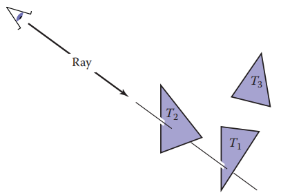

​															**图4.1 光线被 “追踪” 到场景中，击中的第一个物体就是通过像素看到的那个物体。在本例中，返回三角形 T~2~。**

​		因此，一个基本的射线追踪器有三个部分：

1. 光线生成（ray generation），根据相机的几何计算每个像素的观察射线的原点和方向
2. 光线交点（ray intersection），找出与观察光线相交的最近的物体
3. 着色（shading），根据光线相交的结果计算像素颜色

​		基本射线追踪程序的结构如下：

```
for each pixel do
	compute viewing ray
	find first object hit by ray and its surface normal n
	set pixel color to value computed from hit point,light and n
```

本章涵盖了光线生成、光线相交和着色的基本方法，这对于实现一个简单的光线追踪器示例来说是足够的。对于一个真正有用的系统，需要添加第 12 章中更有效的射线相交技术，而广西那追踪器的真正潜力将通过第 10 章中更高级的着色方法和第 13 章中额外的渲染技术看到。

### 4.2 透视图（Perspective）

​		在电脑出现之前的几百年，艺术家们就研究过用 2D 图纸或绘画来表示 3D 物体或场景的问题，照片也用 2D 图像表示 3D 场景。虽然有许多非常规的方法来制作图像，从立体主义绘画到鱼眼镜头（图4.2）再到外围相机，但艺术和摄影以及计算机图形的标准方法是线性透视（linear perspective），它将三维物体投影到图像平面上，使场景中的线变成图像中的线。

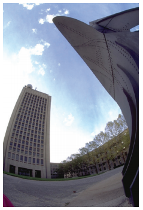

​																	**图4.2 用鱼眼镜头拍摄的图像不是线性透视图像。照片由 Philip Greenspun 提供。**

​		最简单的投影类型是平行投影（parallel projection），即通过将 3D 点沿投影方向移动直到它们到达图像平面，使其映射到 2D（图 4.3-4.4）。所产生的视图由投影方向和图像平面的选择决定，如果图像平面垂直于视图方向，则称投影为正交的（orthographic），否则就叫倾斜的（oblique）。  

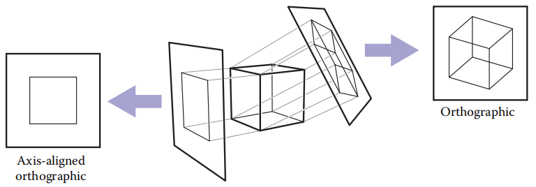

​																					**图4.3 当投影线与图像平面平行且垂直时，得到的视图称为正交的。 **

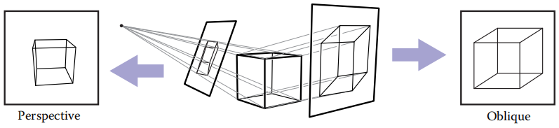

**图4.4 图像平面与投影方向成一个角度的平行投影称为斜投影（右）。在透视投影中，投影线全部通过视点，而不是平行（左）。图中的透视图不是倾斜的，因为通过图像中心绘制的投影线将垂直于图像平面。**

​		平行投影经常用于机械和建筑图纸，因为它们使平行线保持平行，并保持与图像平面平行的平面物体的大小和形状。

*有些书为平行于坐标轴的投影方向保留（reserve） “正交的”*

​		平行投影的优点也是它的局限性。在我们的日常经验中（在照片中更是如此），物体越远，看起来越小，因此，后退到远处的平行线就不显得平行。是因为眼睛和相机不会收集单一观看方向的光线，它们收集通过特定视点的光线。正如文艺复兴时期以来的艺术家们所承认的那样，我们可以使用透视投影来产生自然的景色：我们只是沿着通过一个点（视点）的直线投射，而不是沿着平行线（图 4.4），这样，远离视点的物体在被投射时自然变小。透视图是由视点（而不是投影方向）和图像平面的选择决定的。和平行视图一样，也有斜透视视图和非斜透视视图，其根据图像中心的投影方向来区分。

​		您可能已经了解了三点透视的艺术约定，这是一个手动构建透视图的系统（图 4.5）。关于透视图，一个令人惊讶的事实是，如果我们遵循透视图的简单数学规则，那么所有的透视图绘制规则都会自动遵循：物体直接投射到眼睛，它们被画在眼睛前面的观察平面上。

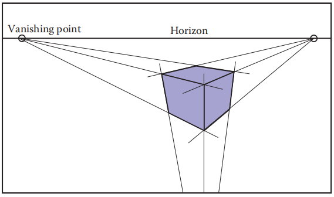

**图4.5 在三点透视中，艺术家选择平行线相交的“消失点”。平行的水平线在地平线上相交于一点。每一组平行线都有它自己的消失点。如果我们基于正确的几何原理实现透视，这些规则会自动遵循**

### 4.3 计算观察射线（Computing Viewing Rays）

​		在上一节中，光线生成的基本工具是视点（或视点方向，对于平行视图）和图像平面，有许多方法来解决相机几何细节，在本节中，我们将说明一种基于标准正交基的支持标准的、斜向平行的、正交的视图的方法。

​		为了生成射线，我们首先需要射线的数学表示。射线其实就是一个原点和一个传播方向，一个三维参数线对于这是理想的。如 2.5.7 节所述，从眼 **e** 到图像平面上点 **s** 的三维参数线（图4.6）为
$$
\vec{p} = \vec{e} + t(\vec{s} - \vec{e})
$$
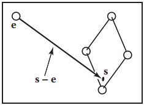

​																		  							**图4.6 从眼睛到图像平面上某一点的射线**

​		这应该解释为，“我们从 **e** 沿着向量 (s - **e**) 的分数距离 t 前进，找到点 **p**。”，所以已知 t，我们可以确定点 **p**，点 **e** 是射线的原点，点 **s** - **e** 是射线的方向。

​		注意 **p**(0) = **e**, **p**(1) = **s**，更一般地说，如果0 < t~1~ < t~2~，那么 **p**(t~1~) 比 **p**(t~2~) 更靠近眼睛。同样，如果 t < 0，那么 **p**(t) 在眼睛 “后面”。当我们寻找光线击中的离眼睛最近的物体时，这些事实会很有用。

*注意：我们正在重载变量 t，它是射线参数也是图像上边缘的 v坐标*

​		为了计算观察射线，我们需要知道 **e**（已知）和 **s**。找到 **s** 可能看起来很困难，但如果我们在正确的坐标系下看问题实际上是很简单的。

​		我们所有的光线生成方法从一个被称为相机坐标系的标准正交坐标系开始，在其中我们将通过 **e** 表示眼睛的点或观察点，坐标系中 **u**，**v**，**w** 为三个基向量，**u** 指向右方向（从相机的视图）,**v** 指向上，**w** 指向后方，所以 {**u**, **v**, **w**} 形成了一个右手坐标系。  最常见的构造相机坐标系的方法是从视点出发，视点变成了 **e**，视点方向是 -**w**，上向量是用来构造一个基底，视点方向和上方向一起定义在平面上的 **v** 和 **w** ， 其使用 2.4.7 节中描述的由两个向量构造标准正交基的过程。 

*因为 **v** 和 **w** 必须是垂直的，所以上向量和 **v** 一般不一样。但是在场景中设置垂直向上的向量将使摄像机以我们认为的“直立”方式进行定位。*

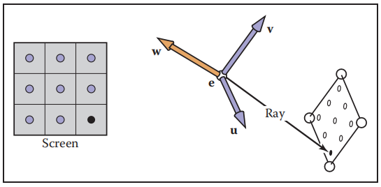

​											**图4.7 屏幕上的采样点映射到 3D 窗口上的一个类似的数组，一个观察射线被发送到该数组上面的每一个位置**

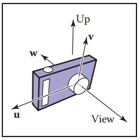

​												**图4.8 相机坐标的向量，还有视图方向和上方向。w 向量与视图方向相反，v 向量与 w 和上向量共面。**

#### 4.3.1 正交视图（Orthographic Views）

​		对于正交视图，所有射线的方向为 -**w**。即使平行视图本身没有视点，我们仍然可以使用相机坐标系的原点来定义光线开始的平面，这样物体就有可能在相机后面。  

*似乎合乎逻辑的是，正交视图射线应该从无限远的地方开始，但这样一来，就不可能对一个房间内的物体制作正交视图。*

​		观察射线应该从点 **e** 和向量 **u** 和 **v** 定义的平面开始，所需的唯一剩余信息是图像应该在平面上的哪个位置。我们将用四个数字定义图像的大小，用于图像的四条边：l 和 r 为图像左和右边缘位置，其从 **e** 开始沿 **u** 方向测量，b 和 t 为图像下和上边缘位置，其从 **e** 开始沿 **v** 方向测量，通常 l < 0 < r，b < 0 < t。（参见图 4.9）。

*许多系统假设 l = - r 和 b = - t，因此一个宽度和一个高度就足够了。*

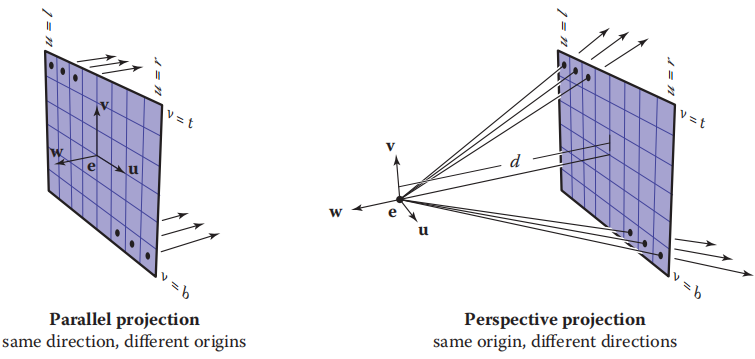

**图4.9 使用相机坐标系生成光线。左边：在正交视图中，光线从图像平面上的像素点位置开始，并且所有光线都共享同一个方向，这个方向等于视图的方向。右边：在透视图中，光线从视点开始，每条光线的方向由通过视点 e 的直线和像素在图像平面上的位置定义**

​		在第3.2节中，我们讨论了图像中的像素坐标。为了让一个 n~x~ × n~y~ 像素的图像放入 (r − l) × (t − b) 大小的矩形中，要让像素水平方向间距为 (r − l) / n~x~ ，垂直方向间距为 (t − b) / n~y~，并在边缘周围留出半像素空间使图形矩形内的像素网格居中。这意味着在栅格图像中位于 (i，j) 位置的像素具有该位置（式 4.1）
$$
u = l + \frac{(r - l)(i + 0.5)}{n_{x}}		\\
v = b + \frac{(t - b)(j + 0.5)}{n_{y}}
$$
其中 (u，v) 为像素在图像平面上的位置坐标，其是根据原点 **e** 和基 {**u**, **v**} 测量的。

​		在正交视图中，我们可以简单地使用像素的图像平面位置作为射线的起始点，并且我们已经知道射线的方向就是视图的方向。然后是产生正交视图的观察射线的程序：

```
compute u and v using (4.1)
ray.direction = -vecW
ray.origin = vecE + u * vecU+v * vecV
```

制作一个倾斜的平行视图非常简单：只需要让图像平面法线 **w** 与视图方向 **d** 分开指定即可。程序是完全相同的，只是用 **d** 代替了 -**w**，当然，**w** 仍然被用来构造 **u** 和 **v**。

*当 l 和 r 都指定时，就有冗余：将视点向右移动一点并相应地减少 l 和 r 将不会改变视图（在 **v** 轴上也是如此）*

#### 4.3.2 透视图（Perspective Views）

​		对于透视图，所有光线在视点处都有同一个原点，每个像素都有不同的方向。图像平面不再位于 **e** 处，而是位于 **e** 前的某一距离 d 处，这个距离就是图像平面距离（image plane distance），通常简单的称为焦距（focal length），因为选择 d 和在真实相机中选择焦距起着相同的作用。每条射线的方向由视点和像素在图像平面上的位置定义。这种情形如图 4.9 所示，且得到的结果程序和正交视图相似：

```
compute u and v using (4.1)
ray.direction = -d * vecW + u * vecU + v * vecV
ray.origin = vecE
```

与平行投影一样，通过在投影方向上单独指定图像平面法线，将射线方向表达式中的 −d**w** 替换为 d**d**，可以实现斜透视视图。

### 4.4 射线-物体的交点（Ray-Object Intersection）

​		一旦我们生成了一条射线 **e** + t**d**，我们接下来需要找到 t > 0 时与任何物体的第一个交点。 在实践中，它被证明是有用的，以解决一个稍微更普遍的问题：求在区间 [t~0~, t~1~] 内，在一个 t 处射线与表面的第一个交点。基本的射线相交是 t~0~ = 0 和 t~1~ = +∞ 的情况。我们将同时解决球面和三角形等多种物体与射线相交的问题，接下来，将讨论这多种物体。

#### 4.4.1 射线-球体的交点（Ray-Sphere Intersection）

​		给定一条射线 **p**(t) = **e** + t**d** 和一个隐式曲面 f(**p**)  =0（见 2.5.3 节），我们想知道它们在哪相交。当射线上的点满足隐式方程时就会出现交点，所以我们求的 t 值就是解方程
$$
f(\vec{p}(t)) = 0 \;\; or \;\; f(\vec{e} + t\vec{d}) = 0
$$
一个圆心为 **c** = (x~c~, y~c~, z~c~)，半径为 R 的球面可以用隐式方程表示
$$
(x - x_{c})^{2} + (y - y_{c})^{2} + (z - z_{c})^{2} - R^{2} = 0
$$
我们可以把这个方程写成向量形式:
$$
(\vec{p} - \vec{c}) \cdot{} (\vec{p} - \vec{c}) - R^{2} = 0
$$
任何满足这个方程的点 **p** 都在球面上。如果我们把射线 **p**(t) = **e** + t**d** 的点代入这个方程，我们得到一个由球上点的 t 值满足的关于 t 的方程：
$$
(\vec{e} + t\vec{d} - \vec{c}) \cdot{} (\vec{e} + t\vec{d} - \vec{c}) - R^{2} = 0
$$
重新排列项得到
$$
(\vec{d} \cdot{} \vec{d})t^{2} + 2\vec{d} \cdot{}(\vec{e}-\vec{c})t + (\vec{e}-\vec{c}) \cdot{} (\vec{e}-\vec{c}) - R^{2} = 0
$$
里，除了参数 t，其他都是已知的，所以这是一个经典的关于 t 的二次方程，这意味着它有这样的形式
$$
At^{2} + Bt + C = 0
$$
这个方程的解在 2.2 节中讨论。二次解的平方根下的项，B^2^ − 4AC，被称为判别式，它告诉我们有多少实解。如果判别式为负，则其平方根为虚数，且线与球不相交。如果判别式是正的，就有两个解：一个是射线进入球体，另一个是射线离开球体。如果判别式为零，射线就会擦过球体，恰好接触到一点。代入球的实际项，然后消去因子 2，就得到
$$
t = \frac{-\vec{d} \cdot{} (\vec{e} - \vec{c}) \pm  \sqrt{(\vec{d} \cdot{} (\vec{e} - \vec{c}))^{2} - (\vec{d} \cdot{} \vec{d})((\vec{e} - \vec{c}) \cdot{} (\vec{e} - \vec{c}) - R^{2})}}{(\vec{d} \cdot{} \vec{d})}
$$
在实际实现中，在计算其他项之前，应该首先检查该判别式的值。如果球体只是用作更复杂物体的边界对象，那么我们只需要确定我们是否击中它，所以检验判别式就足够了。

​		如 2.5.4 节所述，**p** 点的法向量由梯度 **n** = 2(**p** − **c**) 给出，单位法向量为 (**p** − **c**) / R。

#### 4.4.2 射线-三角形的交点（Ray-Triangle Intersection）

​		有许多计算射线三角形交点的算法。我们将为包含三角形的参数平面给出使用重心坐标的形式，因为除了三角形的顶点之外，它不需要长期存储（Snyder & Barr, 1987）。

​		为了使光线与参数曲面相交，我们建立一个笛卡尔坐标完全匹配的方程组：
$$
\left.
\begin{array}{}
x_{e} + tx_{d} = f(u,v)		\\
y_{e} + ty_{d} = g(u,v)		\\
z_{e} + tz_{d} = h(u,v)
\end{array}
\right\}
\;\; or \;\;
\vec{e} + t\vec{d} = \vec{f}(u,v)
$$
这里，我们有三个方程和三个未知数 (t, u, v) 所以我们可以用数值方法求解这些未知数。如果幸运的话，我们可以用解析法解出来。

​		当参数曲面为参数平面时，参数方程可以写成向量形式，如 2.7.2 节所述。如果三角形的顶点是 **a**、**b**、**c**，那么相交的时间为（式 4.2）
$$
\vec{e} + t\vec{d} = \vec{a} + \beta{}(\vec{b} - \vec{a}) + \gamma(\vec{c} - \vec{a})
$$
对于某些 t，β 和 γ。交点 **p** 将在 **e** + t**d** 处，如图 4.10 所示。同样，从 2.7.2 节中我们知道，当且仅当 β > 0， γ > 0，和 β + γ < 1时，交点在三角形内。否则，光线击中了三角形外的平面，所以没有击中三角形。 如果没有解，要么三角形退化，要么射线平行于包含三角形的平面。

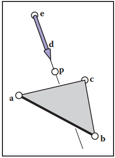

​																										**图4.10：射线击中包含三角形的平面上的点 p**

​		为了求解式（4.2）中的 t， β， γ，我们将其从矢量形式展开为三个坐标的三个方程：
$$
x_{e} + tx_{d} = x_{a} + \beta{}(x_{b} - x_{a}) + \gamma{}(x_{c} - x_{a})		\\
y_{e} + ty_{d} = y_{a} + \beta{}(y_{b} - y_{a}) + \gamma{}(y_{c} - y_{a})		\\
z_{e} + tz_{d} = z_{a} + \beta{}(z_{b} - z_{a}) + \gamma{}(z_{c} - z_{a})
$$
这可以写成一个标准线性方程:
$$
\begin{bmatrix}
x_{a} - x_{b} & x_{a} - x_{c} & x_{d} \\ 
y_{a} - y_{b} & y_{a} - y_{c} & y_{d} \\ 
z_{a} - z_{b} & z_{a} - z_{c} & z_{d}
\end{bmatrix}
\begin{bmatrix}
\beta{} \\ \gamma{} \\ t
\end{bmatrix}
=
\begin{bmatrix}
x_{a} - x_{e} \\ y_{a} - y_{e} \\ z_{a} - z_{e}
\end{bmatrix}
$$
求解这个3 × 3线性方程组最快的经典方法是克莱姆法则（Cramer's rule）。这就给出了解
$$
\beta{} = \frac{\begin{bmatrix} 
x_{a} - x_{e} & x_{a} - x_{c} & x_{d} \\ 
y_{a} - y_{e} & y_{a} - y_{c} & y_{d} \\ 
z_{a} - z_{e} & z_{a} - z_{c} & z_{d}
\end{bmatrix}}{|\vec{A}|}		\\
\gamma{} = \frac{\begin{bmatrix} 
x_{a} - x_{b} & x_{a} - x_{e} & x_{d} \\ 
y_{a} - y_{b} & y_{a} - y_{e} & y_{d} \\ 
z_{a} - z_{b} & z_{a} - z_{e} & z_{d}
\end{bmatrix}}{|\vec{A}|}		\\
t = \frac{\begin{bmatrix} 
x_{a} - x_{b} & x_{a} - x_{c} & x_{a} - x_{e} \\ 
y_{a} - y_{b} & y_{a} - y_{c} & y_{a} - y_{e} \\ 
z_{a} - z_{b} & z_{a} - z_{c} & z_{a} - z_{e}
\end{bmatrix}}{|\vec{A}|}		\\
$$
其中矩阵 A 为
$$
A = \begin{bmatrix}
x_{a} - x_{b} & x_{a} - x_{c} & x_{d} \\ 
y_{a} - y_{b} & y_{a} - y_{c} & y_{d} \\ 
z_{a} - z_{b} & z_{a} - z_{c} & z_{d}
\end{bmatrix}
$$
|A| 表示 A 的行列式。3 × 3 行列式有可以利用的公共子项。看看有哑变量的线性系统
$$
\begin{bmatrix}
a & d & g \\
b & e & h \\
c & f & i
\end{bmatrix}
\begin{bmatrix}
\beta{} \\ \gamma{} \\ t
\end{bmatrix} = 
\begin{bmatrix}
j \\ k \\ l
\end{bmatrix}
$$
克莱姆法则告诉我们
$$
\beta{} = \frac{j(ei - hf) + k(gf - di) + l(dh - eg)}{M}		\\
\gamma{} = \frac{i(ak - jb) + h(jc - al) + g(bl - kc)}{M}		\\
t = -\frac{f(ak - jb) + e(jc - al) + d(bl - kc)}{M}		\\
$$
其中
$$
M = a(ei - hf) + b(gf - di) + c(dh - eg)
$$
我们可以通过重复使用 “ei-hf” 等数字来减少操作次数。

​		对于需要线性解的射线和三角形交点，算法可以有提前终止的条件。因此，函数应该是这样的：

```c++
boolean raytri(ray r, vector3 a, vector3 b, vetor3 c, interval [t0,t1])
	compute t
	if(t < t0 or t > t1) then
		return false
	compute γ
	if(γ < 0 or γ > 1) then
		return false
	compute β
	if(β < 0 or β > 1-γ) then
		return false
	return true
```

#### 4.4.3 射线-多边形的交点（Ray-Polygon Intersection）

​		给定一个平面多边形，其 m 个顶点 **p~1~** 到 **p~m~**，表面法线为 **n**，我们首先用隐式方程计算射线 **e** + t**d** 与包含该多边形的平面的交点
$$
(\vec{p} - \vec{p}_{1}) \cdot{} \vec{n} = 0
$$
我们通过设 **p** = **e** + t**d** 并解出 t 来得到
$$
t = \frac{(\vec{p}_{1} - \vec{e}) \cdot{} \vec{n}}{\vec{d} \cdot{} \vec{n}}
$$
这使得我们可以计算 **p**。如果 **p** 在多边形内部，那么射线击中它，否则，就没有击中。

​		我们可以通过将点和多边形顶点投影到 xy 平面来回答 **p** 是否在多边形内的问题。最简单的方法是从 **p** 发出任意 2D 射线，并计数射线与多边形边界之间的交点数量（Sutherland, Sproull，&Schumacker, 1974；Glassner，1989）。如果交点数为奇数，则该点位于多边形内，否则就不是。这是正确的，因为光线进入一定会出去，从而创造了一对交点，只有从内部开始的光线才不会产生这样的一对交点。为了简化计算，2D 射线也可以沿 x 轴传播:
$$
\begin{bmatrix}x \\ y\end{bmatrix} = \begin{bmatrix}x_{p} \\ y_{p}\end{bmatrix} + s\begin{bmatrix}1 \\ 0\end{bmatrix}
$$
对于s∈(0，∞)，计算这条射线与边如（x1, y1, x2, y2）的交点是很简单的。

​		然而，当多边形在 xy 平面上的投影是一条直线时，问题就出现了。为了解决这个问题，我们可以在 xy, yz 或 zx 平面中选择一个最好的。如果我们实现我们的点来允许索引操作，例如，**p**(0) = x~p~，那么这可以按如下方式完成：

```c++
if(abs(zn) > abs(xn) and abs(zn) > abs(yn)) then
	index0 = 0
	index1 = 1
else if(abs(yn) > abs(xn)) then
	index0 = 0
	index1 = 2
else
	index0 = 1
	index1 = 2
```

现在，所有的计算都可以使用 **p**(index0) 而不是 x~p~，等等。

​		另一种处理多边形的方法，也是实践中经常使用的方法，是用几个三角形来替换它们

#### 4.4.4 一组物体相交（Intersecting a Group of Objects）

​		当然，最有趣的场景包含不止一个物体，当我们将光线与场景相交时，我们必须沿着光线找到离摄像机最近的交集。实现这一点的一个简单方法是将一组物体本身视为另一种类型的物体。要使射线与一组相交，只需将射线与组中的物体相交，并返回 t 值最小的交点。以下代码对区间 t∈[t~0~, t~1~] 的命中情况进行测试:

```c++
hit = false;
for each object o in the group do
	if(o is hit at ray parameter t and t∈[t0, t1])
		hit = true
		hitobj = o
		t1 = t
return hit
```


​								**图4.11 一个简单的场景渲染，只有光线生成和表面相交，但没有着色，每个像素都被设置为固定的颜色，这取决于它击中的物体**

### 4.5 着色（shading）

​		一旦已知像素的可见表面，像素值就通过评估着色模型（shading model）来计算。如何做到这一点完全取决于应用方法，从非常简单的启发式到详细的数值计算。在本章中，我们将介绍两种最基本的着色模型，更高级的模型将在第 10 章中讨论。

​		大多数着色模型，不管怎样，都是为了捕捉光线反射的过程而设计的，即表面被光源照亮，并将部分光线反射到相机上。简单的光照模型是根据点光源的照明来定义的。光反射的重要变量是光的方向 **l**，它是指向光源的单位矢量，观察方向 **v**，是指向眼睛或相机的单位矢量，表面法向量 **n**，它是垂直于表面反射点的单位向量，以及表面的特性——颜色、光泽或其他属性，取决于特定的模型。

#### 4.5.1 兰伯特着色（Lambertian Shading）

​		最简单的着色模型是基于 Lambert 在18世纪的观察得来的：光源照射到某一区域的能量取决于该表面与光线的角度。直接面向光线的表面能获得最大的照明，与光方向相切的表面（或背向光的表面） 没有光照，其间的光照强度与表面法线和光源的夹角 θ 的余弦成正比（图 4.12）。这就引出了兰伯特着色模型（Lambertian shading model）：
$$
L = k_{d}I\max{}(0,\vec{n} \cdot{} \vec{l})
$$
其中 L 是像素的颜色，k~d~ 是漫反射参数（diffuse coefficient）或表面颜色，I 是光源的强度。因为 **n** 和 **l** 是单位向量，我们可以用 **n** · **l** 作为 cos θ 的简写（无论是在纸上还是在代码中）。这个方程（与本节中的其他着色方程一样）分别适用于三种颜色通道，因此像素值的红色分量是红色漫反射分量、红色光源强度和点积的乘积，绿色和蓝色也是如此。

*真实点源的光照会随着距离的平方而减少，但在一个简单的渲染器中，这通常会带来更多的麻烦。*

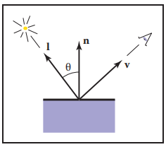

​																													**图4.12 兰伯特着色的几何图**

​		向量 **l** 的计算方法是用光源位置减去光线和表面的交点。别忘了 **v**、**l** 和 **n** 都是单位向量，不归一化这些向量是一个在着色计算中非常常见的错误。

*若有疑问，让光源颜色成中性，使其有相同的红、绿、蓝强度*

#### 4.5.2 布林-冯着色（Blinn-Phong Shading）

​		兰伯特着色是独立于观察的：表面的颜色不依赖于你观察的方向。许多真实的表面显示出一定程度的光泽，产生高光，或镜面反射，它们似乎随着视点的变化而移动。兰伯特着色不产生任何高光，会导致非常哑光，白垩色的外观，许多着色模型在兰伯特着色中添加了一个高光部分，兰伯特部分就是漫反射部分。

​		Phong（Phong, 1975）提出了一个非常简单和广泛使用的高光模型，后来由 Blinn （J. F. Blinn, 1976）更新为今天最常用的形式。这个想法是为了在 v 和 l 对称地穿过表面法线时产生最亮的反射，也就是镜面反射发生的时候，当矢量慢慢离开镜面结构时，反射平滑地减小。

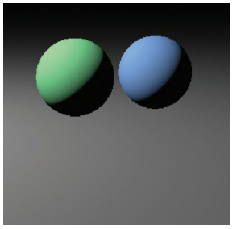

​								 													**图4.13 一个简单的场景渲染，单一光源的漫反射着色。**

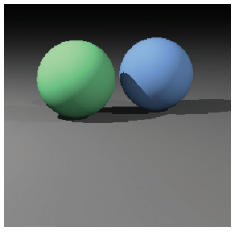

​																	 	**图4.14 一个简单的场景渲染，漫反射着色和三个光源的阴影（章节 4.7）**

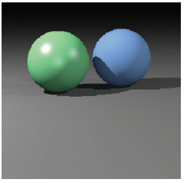

​													**图4.15 一个简单的场景渲染，漫反射着色（蓝色球体），Blinn-Phong 着色（绿色球体），阴影来自三个光源**

​		我们可以通过比较半程矢量 **h**（**v** 和 **l** 之间角的平分线）与表面法线来获得我们与镜面构型的距离有多近（图 4.16）。若半程向量靠近表面法线，那么镜面分量就会变量，若远离就会变暗。这个结果是通过计算 **h** 和 **n** 之间的点积得到的（记住它们是单位向量，所以 **n** · **h** 在向量相等时达到最大值 1），然后对结果进行p > 1次方以使其减少得更快，该 p 次方，或者说 Phong 指数，它控制表面的表面光泽。半程矢量本身很容易计算：因为 **v** 和 **l** 长度相同，它们的和就是平分它们之间夹角的矢量，这个夹角只需要标准化就能得到 **h**。

*p 的经典值：10——”蛋壳（eggsshell）“；100——适当光滑（mildly shiny）；1000——非常光滑（really glossy）；10000——接近镜面（nearly mirror-like）*

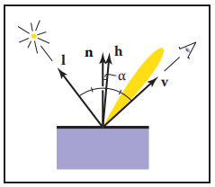

​																											**图4.16 Blinn-Phong 着色的几何图**

​		综上所述，Blinn-Phong 着色模型如下：
$$
\vec{h} = \frac{\vec{v} + \vec{l}}{||\vec{v} + \vec{l}||}		\\
L = k_{d} I \max(0,\vec{n}\cdot{}\vec{l}) + k_{s} I \max(0,\vec{n}\cdot{}\vec{h})^{p}
$$
其中 k~s~ 是镜面的镜面系数，或者说镜面颜色

*若还有疑问，使高光颜色为灰色，具有相同的红色、绿色和蓝色值。*

#### 4.5.3 环境着色（Ambient Shading）

​		没有任何照明的表面将被渲染成完全黑色，这通常是不可取的。避免黑影的一个粗略但有用的启发式方法是在着色模型中添加一个常量分量，它对像素颜色的贡献只取决于击中的对象，而完全不依赖于表面几何形状。这就是所谓的环境着色——就好像表面被来自各处的 “环境” 光照亮一样。为方便调整参数，环境着色通常表示为表面颜色与环境光颜色的乘积，因此，环境着色可以单独调整表面，也可以一起调整所有表面。与 Blinn-Phong模 型的其余部分一起，环境着色完成了一个简单和有用的着色模型的完整版本：（式 4.3）
$$
L = k_{a}I_{a} + k_{a}I\max(0,\vec{n}\cdot{}\vec{l})+k_{s}I\max(0,\vec{n}\cdot{}\vec{h})^{n}
$$
其中 k~a~ 是表面的环境系数，或“环境颜色”，I~a~ 是环境光强度。

*若还有疑问，设置环境光颜色和漫反射颜色相同*

#### 4.5.4 多个点光源（Multiple Point Lights）

​		光的一个非常有用的特性是叠加——由多个光源引起的效应仅仅是光源各自效应的总和。由于这个原因，我们简单的着色模型可以很容易地扩展到处理 N 个光源：（式 4.4）
$$
L = k_{a}I_{a} + \sum_{i=1}^{N}[k_{d}I_{i}\max(0,\vec{n}\cdot{}\vec{l_{i}}) + k_{s}I_{i}\max(0,\vec{n}\cdot{}\vec{h_{i}})^{p}]
$$
其中 I~i~、l~i~、h~i~ 分别是第 i 个光源的强度、方向和半程矢量。

### 4.6 一个光线追踪程序（A Ray-Tracing Program）

​		现在我们知道了如何生成给定像素的观察光线，如何找到与物体最近的交点，以及如何对产生的交点进行着色。这些都是程序生成带有隐藏表面的着色图像所需要的部分。

```c++
for each pixel do
	compute viewing ray
	if(ray hits an object with t∈[0,∞)) then
		Compute vecn
		Evaluate shading model and set pixel to that color
	else
		set pixel color to background color
```

这里的表述的 “如果射线击中一个物体……“，可以使用第 4.4.4 节的算法实现。

​		在实际的实现中，表面交点程序需要以某种方式返回被击中对象的引用，或者至少返回其法向量和着色相关的材质属性。这通常通过传递带有此类信息的记录/结构来实现，在面向对象的实现中，拥有一个叫做 surface 的类和派生类 triangle, sphere, group 等是一个好主意，射线可以相交的任何东西都继承在这个 class 下面。光线追踪程序将对于整个模型有一个参考“表面”，可以很方便的添加新的物体类型和效率结构，。

#### 4.6.1 光线追踪程序的面向对象设计（Obejct-Oriented Design for a Ray-Tracing Program）

​		如前所述，光线跟踪器中的关键类层次结构是构成模型的几何物体。这些应该是一些几何物体类的子类，并且它们应该支持一个 hit 函数（Kirk & Arvo, 1988）。为了避免使用 “object” 这个词造成混淆，经常使用的类名是 surface。有了这样一个类，您可以创建一个具有通用接口的光线跟踪器，该接口对建模基元的假设很少，只使用球体调试它。重要的一点是，任何可以被光线 “击中” 的东西都应该是这个类层次的一部分，例如，即使是表面的集合也应该被认为是 surface 类的子类。这包括效率结构，如边界体积层次结构，它们可以被射线击中，所以它们在类中。

​		例如，“抽象” 或 “基” 类将指定 hit 函数以及一个稍后将证明有用的 bounding box 函数：

```c++
class surface
	virtual bool hit(ray vecE + t*vecD, real t0, real t1, hit-record rec)
	virtual box bounding-box()
```

这里 (t0, t1) 是返回 hit 的射线的间隔，而 rec 是通过引用传递的记录，它包含数据，例如 hit 返回 true 时交集处的 t。该 box 类型是一个 3D “边界盒”，即两个点定义了一个轴对齐的盒子，该盒子包围了表面.例如，对于一个球体，函数将这样实现

```c++
box shpere::bounding-box()
	vector3 min = center - vector3(radius, radius, radius)
	vector3 max = center + vector3(radius, radius, radius)
	return box(min, max)
```

​		另一个有用的类是 material。这允许你抽象材质的行为，然后方便的添加材质。链接物体和材质的一个简单方法是在 surface 类中添加一个指向材质的指针，尽管可能需要更多的可编程行为。一个大问题是如何处理纹理，他们是材质类的一部分还是存在在材质类之外？这将在第 11 章中进一步讨论。

### 4.7 阴影（Shadows）

​		一旦你有了一个基本的光线追踪程序，阴影就可以很容易地添加。回忆一下第4.5节，光线来自某个方向 **l**。我们想象一下自己在已着色表面的点 **p** 处，若我们朝 **l** 方向 “看” 到了一个物体，则该点在阴影中，若没有物体，则光就没有被遮挡。

​		如图 4.17 所示，光线 **p** + t**l** 没有击中任何物体，因此不在阴影中，点 q 在阴影中，因为光线 **q** + t**l** 确实击中了一个物体，这两个点的向量 **l** 是相同的，因为光源 “很远”。这一假设稍后将被放宽。决定在阴影内或阴影外的光线称为阴影光线（shadow rays），以区别于观察光线。

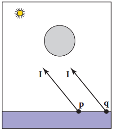

​																										**图4.17 p 点不在阴影中，而 q 点在阴影中**

​		为了得到着色的算法，我们添加了一个 if 语句来确定点是否在阴影中。在简单的实现中，阴影射线将检查 t∈[0，∞)，但由于数值不精确，这可能导致与 **p** 所在的表面相交。相反，为了避免这个问题，通常的调整是检验 t∈[ϵ，∞)，其中 ϵ 是某个小的正的常数（图 4.18）。

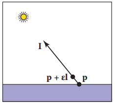

​																**图4.18 通过测试以 ϵ 开始的区间，我们避免了数值不精确导致判断射线击中表面点 p**

​		如果我们使用公式 4.3 为 Phong 照明实现阴影射线，那么我们会得到如下结果：

```c++
function raycolor(ray vecE + t*vecD, real t0, real t1)
	hit-record rec,srec
	if(scene->hit(vecE + t*vecD, t0, t1, rec)) then
		vecP = vecE + (rec.t) * vecD
		color c = rec.ka * Ia
		if(not scene->hit(vecP + s * vecL, ϵ, ∞, srec)) then
			vector3 vecH = normalized(normalized(vecL) + normalized(-vecD))
			c = c + rec.kd * I * max(0, rec.vecN dot vecL) + (rec.ks) * I * (rec.vecN dot vecH)^rec.p
		return c
	else
		return background-color
```

注意，无论 **p** 是否在阴影中，环境色都是添加的。如果有多个光源，我们可以在评估每个光源的着色模型之前发送阴影射线。上面的代码假设 **d** 和 **l** 不一定是单位向量，这对于 **d**  是至关重要的，特别是，如果我们希望稍后干净地添加实例化（参见章节 13.2）。

### 4.8 理想的高光反射（Ideal Specular Reflection）

​		在光线追踪程序中添加理想的高光反射或镜面反射是很简单的。重要的观察如图4.19所示，观测者从 **e** 方向观察时，可以看到从表面上观察到的 **r** 方向的东西。矢量 **r** 是使用 Phong 照明反射方程（10.6）的一个变体来获取的，其符号发生了变化，因为在这个例子中向量 **d** 指向表面（式 4.5）
$$
\vec{R} = \vec{d} - 2(\vec{d} \cdot{} \vec{n})\vec{n}
$$
在现实世界中，当光线从表面反射时，一些能量会损失，而这种损失会因颜色的不同而不同。例如，与蓝色相比，金色反射黄色的效率更高，所以它会改变所反射物体的颜色。这可以通过在射线颜色（raycolor）中添加递归调用来实现：
$$
color c = c + k_{m}raycolor(\vec{p} + s\vec{r}, \epsilon{}, \infty{})
$$
其中 k~m~ （对于 “镜面反射”）是镜面的 RGB 颜色。我们需要确保我们测试 s∈[ϵ，∞) 的原因与我们测试阴影射线的原因相同，我们不希望反射光线击中产生它的物体。

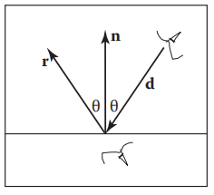

​												**图4.19 当你对着一面完美的镜子看时，朝 d 方向看的人将会看到表面下方朝 r 方向看的人所看到的东西  **

​		上面递归调用的问题是它可能永远不会终止。例如，如果光线从房间内部开始，它将永远反弹，这可以通过增加最大递归深度来解决。如果只在 k~m~ 不为零（黑色）的情况下产生反射射线，代码将更有效。

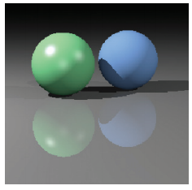

​													**图4.20 一个简单的场景渲染，漫反射和 Blinn-Phong 着色，阴影来自三个光源，镜面反射来自地板**

### 4.9 历史说明（Historical Notes）

​		光线追踪在计算机图形学的早期就有了发展（Appel，1968），但直到有了足够的计算能力才被大量使用（Kay&Greenberg，1979；Whitted，1980）。

​		光线跟踪比基于物体顺序绘制具有更低的渐近时间复杂度（(Snyder & Barr，1987；Muuss，1995；S. Parker et al.，1999；Wald，Slusallek，Benthin，& Wagner，2001）。尽管传统上认为它是一种离线方法，但实时光线追踪实现正变得越来越普遍。  

### 常见问答（Frequently Asked Questions）

- **为什么光线追踪中没有透视矩阵?**

z 缓冲中的透视矩阵是存在的，所以我们可以把透视投影变成平行投影。 这在光线追踪中是不需要的，因为它很容易做透视投影，通过将光线从眼睛中散开。

- **光线追踪可以交互吗?**

对于足够小的模型和图像，任何现代 PC 都足够强大，可以进行交互式的光线追踪。在实践中，一个全屏实现需要多个具有共享帧缓冲区的 cpu。计算机能力的增长速度远远快于屏幕分辨率的提高，传统 PC 能够以屏幕分辨率射线追踪复杂场景只是个时间问题。

- **光线追踪在硬件图形程序中有用吗?**

光线追踪常用于 picking。当用户在3D图形程序中的一个像素上单击鼠标时，该程序需要确定在该像素内可以看到哪个对象。光线追踪是一种理想的方法。

### 练习（Exercises）

1. 射线 (1,1,1) + t(−1,−1,−1) 与半径为 1 的以原点为中心的球面的交点的射线参数是什么？注意：这是一个很好的调试案例。
2. 射线 (1,1,1)+ t(−1,−1,−1) 击中顶点为 (1,0,0)，(0,1,0 ) 和 (0,0,1) 的三角形的重心坐标和射线参数是什么?  注意：这是一个很好的调试案例。
3. 在 “好的”（非对抗性）的模型上对光线追踪的近似时间复杂度进行回溯计算。将你的分析分解为预处理和计算图像的情况，以便你可以预测静态模型的多帧光线追踪行为。（Do a back of the envelope computation of the approximate time complexity of ray tracing on “nice” (non-adversarial) models. Split your analysis into the cases of preprocessing and computing the image, so that you can predict the behavior of ray tracing multiple frames for a static model.）
