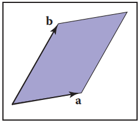
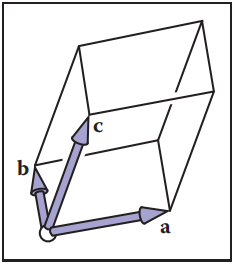
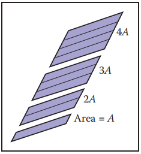
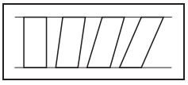
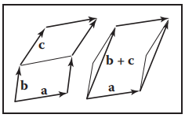
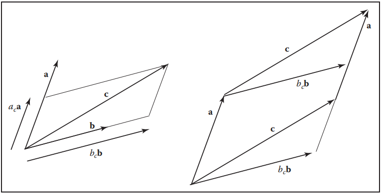
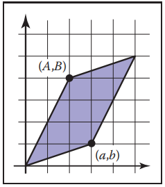
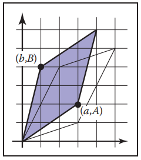

​		也许图形程序中最通用的工具是改变或变换点和向量的矩阵。在下一章中，我们将看到如何将一个向量表示为一个单列矩阵，以及如何通过与一个方阵（square matrix）相乘来以不同的基底表示向量。我们还将描述如何使用这种乘法来完成矢量的变化，如缩放、旋转和平移。在本章中，我们从几何的角度回顾基本的线性代数，重点放在直觉和在二维和三维的情况下工作得很好的算法。

​		熟悉线性代数的读者可以跳过这一章。然而，即使对这样的读者，也可能有一些带来启发的东西，如行列式的发展和对奇异和特征值分解的讨论。

### 5.1 行列式（Determinants）

​		我们通常认为行列式是在线性方程的解中产生的。然而，为了我们的目的，我们把行列式看作是向量相乘的另一种方法。对于二维向量 **a** 和 **b**，行列式 |**a** **b**| 为 **a** 和 **b** 形成的平行四边形的面积（图5.1）。这是一个有符号的面积，如果 **a** 和 **b** 是右旋的则这个符号是正的，如果它们是左旋的，这个符号是负的。这意味着 |**a** **b**| = −|**b** **a**|。在2D中，我们可以将 “右旋” 解释为逆时针旋转第一个向量，使其与第二个向量形成最小的角度。在三维空间中，行列式必须一次取三个向量。对于三个三维向量 **a**, **b**, **c**，行列式 |**a** **b** **c**| 是由三个矢量构成的平行六面体（三维平行四边形；一个剪切的三维盒子）的带符号体积（图5.2）。为了计算一个二维行列式，我们首先需要确定它的一些性质，我们注意到，对平行四边形的一边进行缩放，其面积也会以同样的比例缩放（图 5.3）:
$$
\begin{vmatrix}k\vec{a} & \vec{b} \end{vmatrix} = \begin{vmatrix}\vec{a} & k\vec{b} \end{vmatrix} = 
k\begin{vmatrix}\vec{a} & \vec{b} \end{vmatrix}
$$


​																			**图5.1 平行四边形的带符号面积是 |a b|，在这种情况下，面积是正的**



​										**图5.2 所示平行六面体的带符号的体积用行列式 |a b c| 表示，在这种情况下，体积是正的，因为这些向量构成了右手基。**



​																				**图5.3 沿一个方向缩放一个平行四边形，就会以同样的比例改变面积**

​		同样，我们注意到 “剪切” 平行四边形不会改变它的面积（图5.4）：
$$
\begin{vmatrix}\vec{a} + k\vec{b} & \vec{b} \end{vmatrix} =  \begin{vmatrix}\vec{a} & \vec{b} + k\vec{a} \end{vmatrix} = 
\begin{vmatrix}\vec{a} & \vec{b} \end{vmatrix}
$$


​													**图5.4 剪切平行四边形不会改变它的面积。这四个平行四边形的底长相同，高相同，因此面积相同。**

最后，我们看到行列式有以下性质：（式 5.1）
$$
\begin{vmatrix}\vec{a} & \vec{b} + \vec{c}\end{vmatrix} = 
\begin{vmatrix}\vec{a} & \vec{b}\end{vmatrix} + \begin{vmatrix}\vec{a} & \vec{c}\end{vmatrix}
\tag{5.1}
$$
因为如图 5.5 所示，我们可以 “滑动” 两个平行四边形之间的边，形成一个平行四边形，而不改变原来两个平行四边形中的任何一个的面积。



​													**图5.5 5.1式背后的几何图形。左边的两个平行四边形都可以被剪切获得右边的一个平行四边形。**

​		现在我们假设 **a** 和 **b** 的笛卡尔表示法：
$$
\begin{align}
\begin{vmatrix}\vec{a} & \vec{b}\end{vmatrix}  
& = \begin{vmatrix}x_{a}\vec{x}+y_{a}\vec{y} & x_{b}\vec{x}+y_{b}\vec{y}\end{vmatrix} \\

& = x_{a}x_{b}\begin{vmatrix}\vec{x} & \vec{x}\end{vmatrix} + x_{a}y_{b}\begin{vmatrix}\vec{x} & \vec{y}\end{vmatrix} + 
y_{a}x_{b}\begin{vmatrix}\vec{y} & \vec{x}\end{vmatrix} + y_{a}y_{b}\begin{vmatrix}\vec{y} & \vec{y}\end{vmatrix}	\\

& = x_{a}x_{b}(0) + x_{a}y_{b}(1) + y_{a}x_{b}(-1) + y_{a}y_{b}(0)	\\

& = x_{a}y_{b} - y_{a}x_{b}
\end{align}
$$
这种简化使用了 |**v** **v**| = 0这一事实，对于任何向量 **v**，因为平行四边形都将与 **v** 共线，因此没有面积。

​		在三维空间中，三个三维向量 **a**, **b**, **c** 的行列式表示为 | **a** **b** **c**|。有了向量的笛卡尔表示，平行六面体也有类似平行四边形的规则，我们可以做一个类似的展开，就像在 2D 中做的那样：
$$
\begin{align}
\begin{vmatrix}\vec{a} & \vec{b} & \vec{c}\end{vmatrix} 
&= \begin{vmatrix}x_{a}\vec{x}+y_{a}\vec{y}+z_{a}\vec{z} & x_{b}\vec{x}+y_{b}\vec{y}+z_{b}\vec{z} & x_{c}\vec{x}+y_{c}\vec{y}+z_{c}\vec{z}\end{vmatrix} 	\\
&= x_{a}y_{b}z_{c} - x_{a}z_{b}y_{c} - y_{a}x_{b}z_{c} + y_{a}z_{b}x_{c} + z_{a}x_{b}y_{c} - z_{a}y_{b}x_{c}
\end{align}
$$
如您所见，随着维数的增加，这种方式的行列式的计算会变得越来越难看。我们将在第 5.3 节讨论不易出错的计算行列式的方法。

**例子** 当把一个向量表示成另外两个向量的线性组合时，行列式很自然地出现了——例如，如果我们想把一个向量 **c** 表示成向量 **a** 和 **b** 的组合：
$$
\vec{c} = a_{c}\vec{a} + b_{c}\vec{b}
$$
我们可以从图 5.6 中看出
$$
\begin{vmatrix} b_{a}\vec{b} & \vec{a}\end{vmatrix} = \begin{vmatrix} \vec{c} & \vec{a}\end{vmatrix}
$$


**图5.6 在左边，向量 c 可以用两个基向量表示为 a~c~a + b~c~b。在右边，我们可以看到由 a 和 c 组成的平行四边形是由 b~c~b 和 a 组成的平行四边形的剪切版。**

因为这些平行四边形只是彼此的剪切版本。求 b~c~ 值
$$
b_{c} = \frac{\begin{vmatrix}\vec{c} & \vec{a}\end{vmatrix}}{\begin{vmatrix}\vec{b} & \vec{a}\end{vmatrix}}
$$
类似的求另一个参数
$$
a_{c} = \frac{\begin{vmatrix}\vec{b} & \vec{c}\end{vmatrix}}{\begin{vmatrix}\vec{b} & \vec{a}\end{vmatrix}}
$$
这是克莱姆法则的二维版本，我们稍后会在 5.3.2 节再次讲到。

### 5.2 矩阵（Matrices）

​		矩阵是遵循一定算术规则的数字元素数组。一个两行三列的矩阵的例子是
$$
\begin{bmatrix}1.7 & -1.2 & 4.2 \\ 3.0 & 4.5 & -7.2\end{bmatrix}
$$
矩阵在计算机图形学中经常用于各种目的，包括表示空间变换。为了便于讨论，我们假设矩阵的元素都是实数。本章描述了矩阵算术的技术和 “方阵” 矩阵的行列式，即行数与列数相同的矩阵。

#### 5.2.1 矩阵算术（Matrix Arithmetic）

​		一个矩阵乘以一个常数得到一个矩阵，其中每个元素都乘以那个常数，例如
$$
2\begin{bmatrix}1 & -4 \\ 3 & 2\end{bmatrix} = 
\begin{bmatrix}2 & -8 \\ 6 & 4\end{bmatrix}
$$
矩阵还一个元素一个元素地添加元素，例如
$$
\begin{bmatrix}1 & -4 \\ 3 & 2\end{bmatrix} + \begin{bmatrix}2 & 2 \\ 2 & 2\end{bmatrix} =
\begin{bmatrix}3 & -2 \\ 5 & 4\end{bmatrix}
$$
对于矩阵乘法，我们将第一个矩阵的行与第二个矩阵的列 “相乘”：
$$
\begin{bmatrix}
a_{11} & \cdots{} & a_{1m} \\ \vdots{} & \ddots{} & \vdots{} \\
a_{i1} & \cdots{} & a_{im} \\ \vdots{} & \ddots{} & \vdots{} \\
a_{r1} & \cdots{} & a_{rm}
\end{bmatrix}
\begin{bmatrix}
b_{11} & \cdots{} & b_{1j} & \cdots{} & b_{1c} \\ \vdots{} & \ddots{} & \vdots{} & \ddots{} & \vdots{} \\
b_{m1} & \cdots{} & b_{mj} & \cdots{} & b_{mc}
\end{bmatrix} = 
\begin{bmatrix}
p_{11} & \cdots{} & p_{1j} & \cdots{} & p_{1c} \\ \vdots{} & \ddots{} & \vdots{} & \ddots{} & \vdots{} \\
p_{i1} & \cdots{} & p_{ij} & \cdots{} & p_{ic} \\ \vdots{} & \ddots{} & \vdots{} & \ddots{} & \vdots{} \\
p_{r1} & \cdots{} & p_{rj} & \cdots{} & p_{rc}
\end{bmatrix}
$$
所以结果乘积的元素 p~ij~ 是（式 5.2）
$$
p_{ij} = a_{i1}b_{1j} + a_{i2}b_{2j} + \cdots{} + a_{im}b_{mj}	\tag{5.2}
$$
只有当左矩阵的列数与右矩阵的行数相同时，才能取两个矩阵的乘积。例如
$$
\begin{bmatrix}0 & 1 \\ 2 & 3 \\ 4 & 5\end{bmatrix}
\begin{bmatrix}6 & 7 & 8 & 9 \\ 0 & 1 & 2 & 3\end{bmatrix} = 
\begin{bmatrix}0 & 1 & 2 & 3 \\ 12 & 17 & 22 & 27 \\ 24 & 33 & 42 & 51\end{bmatrix}
$$
矩阵乘法在大多数情况下是不可交换的：（式 5.3）
$$
AB \neq{} BA	\tag{5.3}
$$
同样，如果 AB = AC，也不一定就得出 B = C。幸运的是，矩阵乘法满足结合律和分配律：
$$
(AB)C = A(BC)		\\
A(B+C) = AB + AC	\\
(A+B)C = AC + BC
$$

#### 5.2.2 矩阵上的运算（Operations on Matrices）

​		我们想要一个矩阵有类比实数的逆。我们知道实数 x 的倒数是 1/x，x 和它的倒数的乘积是1。我们需要一个矩阵 I，我们可以把它看作 “矩阵的 1”，它只存在于方阵中，被称为单位矩阵（identity matrix），它由对角线（diagonal）上的 1 和其他地方的 0 组成，例如，4 × 4 的单位矩阵是
$$
I = \begin{bmatrix}1 & 0 & 0 & 0 \\ 0 & 1 & 0 & 0 \\ 0 & 0 & 1 & 0 \\ 0 & 0 & 0 & 1\end{bmatrix}
$$
矩阵 A 的逆矩阵 A^−1^，保证 AA~−1~ = I。例如
$$
\begin{bmatrix}1 & 2 \\ 3 & 4\end{bmatrix}
\begin{bmatrix}-2 & 1 \\ 1.5 & -0.5\end{bmatrix} = 
\begin{bmatrix}1 & 0 \\ 0 & 1\end{bmatrix}
\qquad
所以
\qquad
\begin{bmatrix}1 & 2 \\ 3 & 4\end{bmatrix}^{-1} = 
\begin{bmatrix}-2 & 1 \\ 1.5 & -0.5\end{bmatrix}
$$
注意，A^−1^ 的逆是 A，所以 AA^−1^ = A^−1^A = I。两个矩阵乘积的逆是两个矩阵逆的乘积，但顺序相反：（式 5.4）
$$
(AB)^{-1} = B^{-1}A^{-1}	\tag{5.4}
$$
我们将在本章的后面回到计算逆的问题。

​		矩阵 A 的转置 A^T^ 有相同的数字但是行和列交换了。若我们把 A^T^ 中的项标记为 a'~ij~，有
$$
a_{ij} = a'_{ji}
$$
例如
$$
\begin{bmatrix}1 & 2 \\ 3 & 4 \\ 5 & 6\end{bmatrix}^{T} = 
\begin{bmatrix}1 & 3 & 5 \\ 2 & 4 & 6\end{bmatrix}
$$
两个矩阵乘积的转置遵循类似于式（5.4）的规则：
$$
(AB)^{T} = B^{T}A^{T}
$$
方阵的行列式简单地说就是矩阵列的行列式，它被认为是向量的集合。行列式与刚才讨论的矩阵运算有几个很好的关系，我们列在这里供参考：（式 5.5，式 5.6，式 5.7）
$$
\begin{vmatrix}A & B\end{vmatrix} = \begin{vmatrix}A\end{vmatrix}\begin{vmatrix}B\end{vmatrix} \tag{5.5}
$$

$$
\begin{vmatrix}A^{-1}\end{vmatrix} = \frac{1}{\begin{vmatrix}A\end{vmatrix}} \tag{5.6}
$$

$$
\begin{vmatrix}A^{T}\end{vmatrix} = \begin{vmatrix}A\end{vmatrix} \tag{5.7}
$$

#### 5.2.3 矩阵形式的向量运算（Vector Operations in Matrix Form）

​		在图形学中，我们使用方阵来变换以矩阵表示的向量。例如，如果你有一个 2D 向量 **a** = (x~a~, y~a~) 并且想要绕原点旋转 90 度以形成向量 a‘ =(−y~a~, x~a~)，你可以使用一个 2×2 矩阵和 2×1 矩阵的乘积，称为列向量（column vector）。矩阵形式的运算是
$$
\begin{bmatrix}0 & -1 \\ 1 & 0\end{bmatrix}\begin{bmatrix}x_{a} \\ y_{a}\end{bmatrix} = 
\begin{bmatrix}-y_{a} \\ x_{a}\end{bmatrix}
$$
我们可以通过使用这个矩阵的转置得到同样的结果，并在左边与行向量相乘（“左乘”）：
$$
\begin{bmatrix}x_{a} & y_{a}\end{bmatrix}\begin{bmatrix}0 & 1 \\ -1 & 0\end{bmatrix} = 
\begin{bmatrix}-y_{a} & x_{a}\end{bmatrix}
$$
现在，使用列向量的右乘法（postmultiplication）是相当标准的，但在许多旧的书籍和系统中，你会遇到行向量和左乘法（premultiplication）。唯一的区别是变换矩阵必须用它的转置来替换。

​		我们也可以用矩阵形式来对向量上的运算进行编码。如果我们把点积的结果看成一个 1 × 1 矩阵，它可以写成
$$
\vec{a} \cdot{} \vec{b} = a^{T}b
$$
举个例子，如果我们取两个三维向量
$$
\begin{bmatrix}x_{a} & y_{a} & z_{a}\end{bmatrix}\begin{bmatrix}x_{b} \\ y_{b} \\ z_{b}\end{bmatrix} = 
\begin{bmatrix}x_{a}x_{b} + y_{a}y_{b} + z_{a}z_{b}\end{bmatrix}
$$
​		一个相关的向量乘积是两个向量之间的外积（outer product），它可以表示为矩阵与左边的列向量和右边的行向量的乘积：ab^T^。结果是一个矩阵，由 a 的所有元素对与 b 的元素的乘积组成。对于三维向量，我们有
$$
\begin{bmatrix}x_{a} \\ y_{a} \\ z_{a}\end{bmatrix}\begin{bmatrix}x_{b} & y_{b} & z_{b}\end{bmatrix} = 
\begin{bmatrix}x_{a}x_{b} & x_{a}y_{b} & x_{a}z_{b} \\ y_{a}x_{b} & y_{a}y_{b} & y_{a}z_{b} \\ z_{a}x_{b} & z_{a}y_{b} & z_{a}z_{b}\end{bmatrix}
$$
​		用向量运算来考虑矩阵乘法通常是有用的。为了说明使用三维的情况，我们可以用两种方式把一个 3 × 3 矩阵看作三个三维向量的集合：它要么由三个并排的列向量组成，要么由三个叠加的行向量组成。例如，矩阵与向量 **y** = A**x** 相乘的结果可以解释为一个向量，其元素是 **x** 与 A 的行的点积。把这些行向量命名为 r~i~，我们有
$$
\begin{bmatrix}\vdots{} \\ y_{i} \\ \vdots{}\end{bmatrix} = \begin{bmatrix}\cdots{} \\ r_{i} \\ \cdots{}\end{bmatrix}
\begin{bmatrix}\vdots{} \\ x_{i} \\ \vdots{}\end{bmatrix}
$$

$$
y_{i} = \vec{r_{i}} \cdot{} \vec{x}
$$

或者，我们可以把相同的乘积看成是 A 中 n 列 c~i~ 的和，由 **x** 的分量加权：
$$
\begin{bmatrix}\vdots{} \\ y_{i} \\ \vdots{}\end{bmatrix} = \begin{bmatrix}\vdots{} & c_{i} & \vdots{}\end{bmatrix}
\begin{bmatrix}\vdots{} \\ x_{i} \\ \vdots{}\end{bmatrix}
$$

$$
\vec{y} = x_{1}\vec{c_{1}} + \cdots{} + x_{i}\vec{c_{i}} + \cdots{} + x_{n}\vec{c_{n}}
$$

​		利用同样的思想，我们可以将矩阵乘积 AB 理解为一个数组，它包含 A 的所有行与 B 的所有列的成对点积，作为矩阵 A 与 B 的所有列向量的乘积的集合，从左到右排列；A 的所有行向量与矩阵 B 的乘积的集合，从上到下堆叠；或者是 A 的所有列和 B 的所有行的成对外积的和。（参见练习 8）

​		这些对矩阵乘法的解释通常会带来对运算的有价值的几何解释，否则这些运算可能看起来非常抽象。

#### 5.2.4 特殊类型的矩阵（Special Types of Matrices）

​		单位矩阵是对角矩阵（diagonal matrix）的一个例子，其中所有的非零元素都沿着对角线出现。对角线由列索引等于从左上角开始计数的行索引的元素组成。

​		单位矩阵还有一个性质它和它的转置是一样的。这样的矩阵称为对称矩阵（symmetric）。

​		单位矩阵也是一个正交矩阵（orthogonal matrix），因为它的每一列都被认为是长度为 1 的向量并且这些列是相互正交的，行也是如此（参见练习2）。任何正交矩阵的行列式不是 +1 就是 -1。

*正交矩阵的概念与标准正交基的概念相对应，而不仅仅是正交向量的集合——这在术语上是一个不幸的小故障。*

​		正交矩阵的一个非常有用的性质是它们几乎是它们自己的逆。用一个正交矩阵乘以它的转置得到单位矩阵
$$
R^{T}T = I = RR^{T} \qquad{} R为正交阵
$$
这很容易看出来，因为 R^T^R 的元素是 R 矩阵的列之间的点积。非对角项是正交向量之间的点积，而对角项是（单位长度）列与自身的点积。

**例子** 矩阵
$$
\begin{bmatrix}8 & 0 & 0 \\ 0 & 2 & 0 \\ 0 & 0 & 9\end{bmatrix}
$$
是对角矩阵，因此是对称的，但是不是正交的（列是正交的但它们不是单位长度）。

​		矩阵
$$
\begin{bmatrix}1 & 1 & 2 \\ 1 & 9 & 7 \\ 2 & 7 & 9\end{bmatrix}
$$
是对称矩阵，但不是对角阵和正交阵。

​		矩阵
$$
\begin{bmatrix}0 & 1 & 0 \\ 0 & 0 & 1 \\ 1 & 0 & 0\end{bmatrix}
$$
是正交阵，但是不是对角阵和对称阵。

### 5.3 矩阵和行列式的计算（Computing with Matrices and Determinants）

​		回想一下 5.1 节，行列式取 n 个 n 维向量并将它们组合起来得到由这些向量定义的 n 维平行多面体的有符号的 n 维体积。例如，二维的行列式是由向量组成的平行四边形的面积。我们可以用矩阵来处理计算行列式的技术问题。

​		如果我们有二维向量 **r** 和 **s** ，我们表示行列式为 |**r** **s**|，这个值是由这些向量组成的平行四边形的带符号的面积。假设我们有两个笛卡尔坐标为 (a, b) 和 (A, B) 的 2D 向量（图 5.7）。行列式可以写成列向量的形式，或者简写为：（式 5.8）
$$
\begin{vmatrix} 
\begin{bmatrix}a \\ b\end{bmatrix} & \begin{bmatrix}A \\ B\end{bmatrix} 
\end{vmatrix} \equiv{}
\begin{vmatrix}a & A \\ b & B\end{vmatrix} = 
aB - Ab
\tag{5.8}
$$


​																					**图5.7 式 5.8 中的二维行列式是由二维向量构成的平行四边形的面积**

注意矩阵的行列式和它转置的行列式是一样的：
$$
\begin{vmatrix}a & A \\ b & B\end{vmatrix} =
\begin{vmatrix}a & b \\ A & B\end{vmatrix} =
aB - Ab
$$
​		这意味着，对于任何一个二维平行四边形，都有一个 “兄弟” 平行四边形，其面积相同，但形状不同（图5.8）。例如，由向量 (3,1) 和 (2,4) 定义的平行四边形的面积是 10，由向量 (3,2) 和 (1,4) 定义的平行四边形的面积也是 10。



​																						**图5.8 兄弟平行四边形的面积与图 5.7 平行四边形的面积相同。**

**例子** 三维行列式的几何意义有助于理解为什么某些公式是有意义的。例如，当i = 0、1、2 时，平面通过点 (xi, y~i~, z~i~) 的方程是
$$
\begin{vmatrix}x-x_{0} & x-x_{1} & x-x_{2} \\ y-y_{0} & y-y_{1} & y-y_{2} \\ z-z_{0} & z-z_{1} & z-z_{2}\end{vmatrix} = 0
$$
每一列是一个从点 (x~i~, y~i~, z~i~) 到点 (x, y, z) 的向量。只有当 (x, y, z) 与其他三个点共面时平行六面体的体积才为零。几乎所有涉及行列式的方程都有类似的简单几何。

​		正如我们之前看到的，我们可以通过直接展开来计算行列式，其中大多数项都是零，并且有大量的加号和减号的项。计算行列式的代数运算的标准方法是使用拉普拉斯展开（Laplace's expansion）的形式，这种方法计算行列式的关键部分是求出矩阵各元素的余子式（cofactor）。方阵的每一个元素都有一个余子式，它是矩阵的行列式，该余子式的行和列比矩阵少一，可能乘以- 1，该更小的矩阵是通过消去问题元素所在的行和列得到的。例如，对于 10 × 10 矩阵，a~82~的余子式是消去第 8 行第 2 列的 9 × 9 矩阵的行列式，如果行和列索引的和是偶数，则余子式的符号为正，否则为负。这可以通过棋盘格来记住：
$$
\begin{bmatrix}
+ & - & + & - & \cdots{} \\ - & + & - & + & \cdots{} \\
+ & - & + & - & \cdots{} \\ - & + & - & + & \cdots{} \\
\vdots{} & \vdots{} & \vdots{} & \vdots{} & \ddots{}
\end{bmatrix}
$$
所以，对于一个 4 × 4 矩阵
$$
A = \begin{bmatrix}
a_{11} & a_{12} & a_{13} & a_{14} \\
a_{21} & a_{22} & a_{23} & a_{24} \\
a_{31} & a_{32} & a_{33} & a_{34} \\
a_{41} & a_{42} & a_{43} & a_{44} \\
\end{bmatrix}
$$
第一行的余子式是
$$
a^{c}_{11} = \begin{vmatrix}a_{22} & a_{23} & a_{24} \\ a_{32} & a_{33} & a_{34} \\ a_{42} & a_{43} & a_{44}\end{vmatrix}
, \qquad
a^{c}_{12} = -\begin{vmatrix}a_{21} & a_{23} & a_{24} \\ a_{31} & a_{33} & a_{34} \\ a_{41} & a_{43} & a_{44}\end{vmatrix}
\\
a^{c}_{13} = \begin{vmatrix}a_{21} & a_{22} & a_{24} \\ a_{31} & a_{32} & a_{34} \\ a_{41} & a_{42} & a_{44}\end{vmatrix}
, \qquad
a^{c}_{14} = -\begin{vmatrix}a_{21} & a_{22} & a_{23} \\ a_{31} & a_{32} & a_{33} \\ a_{41} & a_{42} & a_{43}\end{vmatrix}
$$
矩阵的行列式是通过取任意行或列的元素与它们的余子式的乘积的和得到的。例如，上面的 4 × 4 矩阵的行列式可通过取第二列得到
$$
\begin{vmatrix}A\end{vmatrix} = a_{12}a_{12}^{c} + a_{22}a_{22}^{c} +  a_{32}a_{32}^{c} +  a_{42}a_{42}^{c}
$$
我们可以对任意行或列做类似的展开它们都会得到相同的结果。注意这个扩展的递归性质。

**例子** 通过展开第一行的余子式求特定 3 × 3 矩阵的行列式的一个具体例子是
$$
\begin{align}
\begin{vmatrix}0 & 1 & 2 \\ 3 & 4 & 5 \\ 6 & 7 & 8\end{vmatrix} 
&= 0\begin{vmatrix}4 & 5 \\ 7 & 8\end{vmatrix} - 1\begin{vmatrix}3 & 5 \\ 6 & 8\end{vmatrix} + 2\begin{vmatrix}3 & 4 \\ 6 & 7\end{vmatrix} \\
&= 0(32 - 35) - 1(24 - 30) + 2(21 - 24)	\\
&= 0

\end{align}
$$
​		我们可以推导出由列（或者行，因为转置矩阵的行列式是相同的）组成的平行六面体的体积为 0。这等价于说列（或行）不是线性无关的。注意，第一行和第三行的和是第二行的两倍，这意味着线性相关。

#### 5.3.1 计算逆（Computing Inverses）

​		行列式给了我们一个计算矩阵逆的工具。对于大矩阵来说，这是一种非常低效的方法，但在图形学中，我们的矩阵往往很小。扩展这种方法的关键是具有两行相同的矩阵的行列式为零。这应该很清楚，因为如果它的两条边相等则 n 维平行六面体的体积是零。假设我们有一个4 × 4 矩阵 A 我们想求它的逆矩阵 A^-1^。它的逆是
$$
A^{-1} = \frac{1}{|A|}
\begin{bmatrix}
a_{11}^{c} & a_{21}^{c} & a_{31}^{c} & a_{41}^{c} \\
a_{12}^{c} & a_{22}^{c} & a_{32}^{c} & a_{42}^{c} \\
a_{13}^{c} & a_{23}^{c} & a_{33}^{c} & a_{43}^{c} \\
a_{14}^{c} & a_{24}^{c} & a_{34}^{c} & a_{44}^{c}
\end{bmatrix}
$$
注意这就是矩阵的转置矩阵中 A 的元素被替换为它们各自的余子式乘以前导常数（1 或 -1），这个矩阵叫做A的伴随矩阵（adjoint）。伴随矩阵是A的余子矩阵（cofactor matrix）的转置，我们可以看出为什么这是逆矩阵。看看 AA^−1^ 我们认为它是恒等式，如果我们用 A 的第一行乘以伴随矩阵的第一列我们需要得到|A|（记住前面的常数除以 |A|:
$$
\begin{bmatrix}
a_{11} & a_{12} & a_{13} & a_{14} \\ \cdot{} & \cdot{} & \cdot{} & \cdot{} \\
\cdot{} & \cdot{} & \cdot{} & \cdot{} \\ \cdot{} & \cdot{} & \cdot{} & \cdot{}
\end{bmatrix}
\begin{bmatrix}
a_{11}^{c} & \cdot{} & \cdot{} & \cdot{} \\ a_{12}^{c} & \cdot{} & \cdot{} & \cdot{} \\
a_{13}^{c} & \cdot{} & \cdot{} & \cdot{} \\ a_{14}^{c} & \cdot{} & \cdot{} & \cdot{}
\end{bmatrix}
=
\begin{bmatrix}
|A| & \cdot{} & \cdot{} & \cdot{} \\ \cdot{} & \cdot{} & \cdot{} & \cdot{} \\
\cdot{} & \cdot{} & \cdot{} & \cdot{} \\ \cdot{} & \cdot{} & \cdot{} & \cdot{}
\end{bmatrix}
$$
这是正确的，因为 A 的第一行的元素恰好乘以伴随矩阵的第一列的余子式也就是行列式。由于类似的原因，结果矩阵对角线上的其他值是 |A|。这些值为零的也遵循类似的逻辑：
$$
\begin{bmatrix}
\cdot{} & \cdot{} & \cdot{} & \cdot{} \\ a_{21} & a_{22} & a_{23} & a_{24} \\
\cdot{} & \cdot{} & \cdot{} & \cdot{} \\ \cdot{} & \cdot{} & \cdot{} & \cdot{}
\end{bmatrix}
\begin{bmatrix}
a_{11}^{c} & \cdot{} & \cdot{} & \cdot{} \\ a_{12}^{c} & \cdot{} & \cdot{} & \cdot{} \\
a_{13}^{c} & \cdot{} & \cdot{} & \cdot{} \\ a_{14}^{c} & \cdot{} & \cdot{} & \cdot{}
\end{bmatrix}
=
\begin{bmatrix}
\cdot{} & \cdot{} & \cdot{} & \cdot{} \\ 0 & \cdot{} & \cdot{} & \cdot{} \\
\cdot{} & \cdot{} & \cdot{} & \cdot{} \\ \cdot{} & \cdot{} & \cdot{} & \cdot{}
\end{bmatrix}
$$
注意这个乘积是某个矩阵的行列式：
$$
a_{21}a_{11}^{c} + a_{22}a_{12}^{c} + a_{23}a_{13}^{c} + a_{24}a_{14}^{c}
$$
这个矩阵实际上是
$$
\begin{bmatrix}
a_{21} & a_{22} & a_{23} & a_{24} \\ a_{21} & a_{22} & a_{23} & a_{24} \\
a_{31} & a_{32} & a_{33} & a_{34} \\ a_{41} & a_{42} & a_{43} & a_{44}
\end{bmatrix}
$$
因为前两行是相同的，这个矩阵是奇异的，因此，它的行列式是零。

​		上面的论证并不仅仅适用于 4 × 4 矩阵，使用这个尺寸只是简化了排版。对于任何矩阵，其逆矩阵是伴随矩阵除以被逆矩阵的行列式。伴随矩阵是余子矩阵的转置，也就是元素被其余子矩阵所取代的矩阵。

**例子** 一个特定的 3 × 3 矩阵的逆矩阵的行列式是 6，其为
$$
\begin{align}
\begin{bmatrix}
1 & 1 & 2 \\ 1 & 3 & 4 \\ 0 & 2 & 5
\end{bmatrix}^{-1}
&=
\frac{1}{6}
\begin{bmatrix}
\begin{vmatrix}3 & 4 \\ 2 & 5\end{vmatrix} & -\begin{vmatrix}1 & 2 \\ 2 & 5\end{vmatrix} & 
\begin{vmatrix}1 & 2 \\ 3 & 4\end{vmatrix} \\ 
-\begin{vmatrix}1 & 4 \\ 0 & 5\end{vmatrix} & \begin{vmatrix}1 & 2 \\ 0 & 5\end{vmatrix} & 
-\begin{vmatrix}1 & 2 \\ 1 & 4\end{vmatrix} \\ 
\begin{vmatrix}1 & 3 \\ 0 & 2\end{vmatrix} & -\begin{vmatrix}1 & 1 \\ 0 & 2\end{vmatrix} & 
\begin{vmatrix}1 & 1 \\ 1 & 3\end{vmatrix}
\end{bmatrix} \\
&= 
\frac{1}{6}
\begin{bmatrix}
7 & -1 & -2 \\ -5 & 5 & -2 \\ 2 & -2 & 2
\end{bmatrix}
\end{align}
$$
你可以自己把这些矩阵相乘检验一下确保你得到了单位矩阵。

#### 5.3.2 线性方程组（Linear System）

​		我们经常在图形学中遇到 “n 个方程和 n 个未知数” 的线性系统，通常是 n = 2或 n = 3。例如
$$
\begin{align}
3x+7y+2z &= 4 \\ 2x-4y-3z &= -1 \\ 5x + 2y + z &= 1
\end{align}
$$
这里 x，y，z 是我们想要解的“未知数”。我们可以把它写成矩阵形式：
$$
\begin{bmatrix}
3 & 7 & 2 \\ 2 & -4 & -3 \\ 5 & 2 & 1
\end{bmatrix}
\begin{bmatrix}
x \\ y \\ z
\end{bmatrix}
=
\begin{bmatrix}
4 \\ -1 \\ 1
\end{bmatrix}
$$
这种方程组的一个常见的简写是 A**x** = **b**，其中假设 A 是一个已知常数的方阵，**x** 是一个未知的列向量（在我们的例子中包含元素 x、y 和 z）， **b** 是一个已知常数的列矩阵。

​		有很多方法可以求解这样的方程组，而合适的方法取决于矩阵 A 的性质和维数。因为在图形学中，我们经常处理大小为 n ≤ 4 的方程组，我们将在这里讨论一种适用于这些方程组统的方法，称为克莱姆法则，我们之前从二维几何观点见过，在 5.1 节的例子中。在这里，我们用代数方法证明。上面这个方程的解是
$$
x = \frac
{\begin{vmatrix}4 & 7 & 2 \\ -1 & -4 & -3 \\ 1 & 2 & 1\end{vmatrix}}
{\begin{vmatrix}3 & 7 & 2 \\ 2 & -4 & -3 \\ 5 & 2 & 1\end{vmatrix}}
, \qquad{}
y = \frac
{\begin{vmatrix}3 & 4 & 2 \\ 2 & -1 & -3 \\ 5 & 1 & 1\end{vmatrix}}
{\begin{vmatrix}3 & 7 & 2 \\ 2 & -4 & -3 \\ 5 & 2 & 1\end{vmatrix}}
, \qquad{}
z = \frac
{\begin{vmatrix}3 & 7 & 4 \\ 2 & -4 & -1 \\ 5 & 2 & 1\end{vmatrix}}
{\begin{vmatrix}3 & 7 & 2 \\ 2 & -4 & -3 \\ 5 & 2 & 1\end{vmatrix}}
$$
这里的规则是取一个行列式的比率，其中分母是 |A|，分子是一个矩阵的行列式由列向量 **b** 替换 A 的一列生成。被替换的列对应于未知数在向量 **x** 中的位置。例如，y 是第二个未知数，所以第二列被替换。注意，如果 |A| = 0，除法是未定义的，没有解。这只是法则的另一个版本如果A是奇异的（行列式为零）那么方程就没有唯一解。

### 5.4 特征值与矩阵对角化（Eigenvalues and Matrix Diagonalization）

​		方阵具有与之相关的特征值（eigenvalue）和特征向量（eigenvecotr）。特征向量是非零的向量，它们的方向在乘以矩阵时不会改变。例如，假设对于矩阵 A 和向量 **a**，我们有（式 5.9）
$$
A\vec{a} = \lambda{}\vec{a} \tag{5.9}
$$
这意味着我们已经拉伸或压缩了 **a**，但它的方向没有改变。大小因子 λ 称为与特征向量 **a** 相关联的特征值。了解矩阵的特征值和特征向量在许多实际应用中是有帮助的，我们将描述它们来深入了解几何变换矩阵，并作为下一节中描述的奇异值和向量的一步。

​		如果我们假设一个矩阵至少有一个特征向量，那么我们可以做一个标准的操作来找到它。首先，我们把等式两边写成方阵与向量 **a** 的乘积：（式 5.10）
$$
A\vec{a} = \lambda{}I\vec{a}	\tag{5.10}
$$
其中 I 是单位矩阵。这可以重写为（式 5.11）
$$
A\vec{a} - \lambda{}I\vec{a} = 0	\tag{5.11}
$$
因为矩阵乘法满足分配律，我们可以把这些矩阵分组：（式 5.12）
$$
(A - \lambda{}I)\vec{a} = 0	\tag{5.12}
$$
这个方程只有当矩阵（A−λI）是奇异的，即它的行列式为零时才成立。这个矩阵中的元素是 A 中的数字，除了对角线上的数字。例如，对于一个 2 × 2 矩阵，特征值遵循（式 5.13）
$$
\begin{vmatrix}
a_{11} - \lambda{} & a_{12} \\ a_{21} & a_{22} - \lambda{}
\end{vmatrix}
=
\lambda{}^{2} - (a_{11} + a_{22})\lambda{} + (a_{11}a_{22} - a_{12}a_{21}) = 0
\tag{5.13}
$$
因为这是一个二次方程，我们知道 λ 有两个解，这些解可能是唯一的和实数，也可能不是。由于通常不可能找到大于 4 次的多项式方程的精确显式解，我们只能用解析方法计算 4 × 4 或更小矩阵的特征值。对于较大的矩阵，数值方法是唯一的选择。

​		特征值和特征向量特别简单的一个重要特殊情况是对称矩阵（其中 A = A^T^）。实对称矩阵的特征值总是实数，如果它们也是不同的，则它们的特征向量是相互正交的。这样的矩阵可以写成对角形式：（式 5.14）
$$
A = QDQ^{T}	\tag{5.14}
$$
其中 Q 是一个正交矩阵 D 是一个对角矩阵，Q 的列是 A 的特征向量 D 的对角元素是 A 的特征值。把 A 写成这种形式也叫做特征值分解（eignvalue decomposition），因为它把 A 分解成更简单的矩阵的乘积，这些矩阵揭示了它的特征向量和特征值。

*回想一下，正交矩阵有标准正交的行和标准正交的列。*

**例子** 给定一个矩阵
$$
A = \begin{bmatrix}2 & 1 \\ 1 & 1\end{bmatrix}
$$
A 的特征值是下面方程的解
$$
\lambda{}^{2} - 3\lambda{} + 1 = 0
$$
我们为了符号简洁性近似精确值：
$$
\lambda{} = \frac{3 \pm{} \sqrt{5}}{2} \approx{} \begin{bmatrix}2.618 \\ 0.382\end{bmatrix}
$$
现在我们可以找到相关的特征向量。第一个是齐次方程的非平凡解（不是 x = y = 0）
$$
\begin{bmatrix}2-2.618 & 1 \\ 1 & 1-2.618\end{bmatrix}
\begin{bmatrix}x \\ y\end{bmatrix}
=
\begin{bmatrix}
0 \\ 0
\end{bmatrix}
$$
这近似等于 (x, y) = (0.8507, 0.5257)。注意，平行于这个二维向量的解有无穷多个，我们只选了一个单位长度的解。同样，λ~2~ 的特征向量为 (x, y) =(−0.5257, 0.8507)。这意味着 A 的对角线形式是(由于我们的数值近似，在一定的精度范围内)：
$$
\begin{bmatrix}2 & 1 \\ 1 & 1\end{bmatrix}
=
\begin{bmatrix}0.8507 & -0.5257 \\ 0.5257 & 0.8507\end{bmatrix}
\begin{bmatrix}2.618 & 0 \\ 0 & 0.382\end{bmatrix}
\begin{bmatrix}0.8507 & 0.5257 \\ -0.5257 & 0.8507\end{bmatrix}
$$
我们将在下一章中重新讨论这个矩阵作为变换的几何学。

#### 5.4.1 奇异值分解（Singular Value Decomposition）

​		我们在上一节中看到，任何对称矩阵都可以对角化，或者分解成正交矩阵和对角矩阵的乘积。然而，我们在图形学中遇到的大多数矩阵都是不对称的，并且非对称矩阵的特征值分解几乎不是那么方便或简明的，而且通常涉及复数特征值和特征向量，即使是实数输入。

​		对于非对称（甚至是非方阵）矩阵的对称特征值分解还有另一种推广，它就是奇异值分解（singular value decomposition，SVD）。对称矩阵的特征值分解与非对称矩阵的奇异值分解的主要区别在于，在奇异值分解中，左右两侧的正交矩阵不需要相同：
$$
A = USV^{T}
$$
这里 U 和 V 是两个可能不同的正交矩阵，它的列为 A 的左和右奇异向量，而 S 是一个对角矩阵，它的元素为 A 的奇异值。当 A 是对称且所有特征值都是非负时，SVD 和特征值分解是相同的。

*我们建议按照这个顺序学习：对称的特征值/向量，奇异值/向量，然后才是非对称的特征值，这些更复杂。*

​		在奇异值和特征值之间还有另一种关系，可以用来计算 SVD（尽管这不是工业强度 SVD 实现的工作方式）。首先定义 M = AA^T^。我们假设可以对 M 进行 SVD：
$$
M = AA^{T} = (USV^{T})(USV^{T})^{T} = US(V^{T}V)SU^{T} = US^{2}U^{T}
$$
这个替换基于 (BC)^T^ = C^T^B^T^，一个正交矩阵的转置是它的逆矩阵以及一个对角矩阵的转置是矩阵本身。这种新形式的美妙之处在于 M 是对称的，且US^2^U^T^ 是它的特征值分解，其中 S^2^ 包含（所有非负的）特征值。因此，我们发现矩阵的奇异值是矩阵与转置乘积的特征值的平方根，而左奇异向量是该乘积的特征向量。一个类似的论证允许用 A^T^A 计算右奇异向量的矩阵 V。

**例子** 现在我们用一个例子来具体说明：
$$
A = \begin{bmatrix}1 & 1 \\ 0 & 1\end{bmatrix}
; \qquad{}
M = AA^{T} = \begin{bmatrix}2 & 1 \\ 1 & 1\end{bmatrix}
$$
我们在前一节看过这个矩阵的特征值分解。我们立即观察
$$
\begin{bmatrix}1 & 1 \\ 0 & 1\end{bmatrix} = \begin{bmatrix}0.8507 & -0.5257 \\ 0.5257 & 0.8507\end{bmatrix}
\begin{bmatrix}\sqrt{2.618} & 0 \\ 0 & \sqrt{0.382}\end{bmatrix}V^{T}
$$
我们可以用代数方法解出 V：
$$
V = (S^{-1}U^{T}A)^{T}
$$
S 的逆矩阵是一个由 S 对角元素的倒数组成的对角矩阵。其得到
$$
\begin{align}
\begin{bmatrix}1 & 1 \\ 0 & 1\end{bmatrix} 
&= U\begin{bmatrix}\sigma{}_{1} & 0 \\ 0 & \sigma{}_{2}\end{bmatrix}V^{T} \\
&= \begin{bmatrix}0.8507 & -0.5257 \\ 0.5257 & 0.8507\end{bmatrix}\begin{bmatrix}1.618 & 0 \\ 0 & 0.618\end{bmatrix}
\begin{bmatrix}0.8507 & 0.5257 \\ -0.5257 & 0.8507\end{bmatrix}
\end{align}
$$
这种形式使用标准符号 σ~i~ 表示第 i 个奇异值.同样，对于对称矩阵，特征值和奇异值是相同的（σ~i~ = λ~i~）。我们将在第 6.1.6 节进一步研究 SVD 的几何结构。

### 常见问答（Frequently Asked Questions）

- **为什么矩阵乘法是这样定义的而不是一个元素一个元素的?**

元素对元素的乘法是定义矩阵乘法的一种很好的方法，它确实有很好的性质。然而，在实践中它并不是很有用。根本上，大多数矩阵用于变换列向量，例如，在3D中：
$$
\vec{b} = M\vec{a}
$$
其中 **a** 和 **b** 是向量 M 是 3 × 3 矩阵。为了允许旋转等几何运算，**a** 的所有三个元素的组合必须加入 **b** 的每个元素，这要求我们对 M 要么逐行，要么逐列。这个选择是基于具有所需性质的矩阵的复合
$$
M_{2}(M_{1}\vec{a}) = (M_{2}M_{1})\vec{a}
$$
它允许我们使用一个复合矩阵 C = M~2~M~1~ 来变换向量。当许多向量将被同一个复合矩阵变换时，这是很有价值的。所以，总而言之，这个有点奇怪的矩阵乘法规则被设计成有这些想要的性质。

- **有时我听说特征值和奇异值是一样的有时一个是另一个的平方。哪个是正确的?**

如果一个实数矩阵 A 是对称的，并且它的特征值是非负的，那么它的特征值和奇异值是相同的。 如果 A 不是对称的，则矩阵 M = AA^T^ 是对称的，并具有非负的实数特征值。A 和 A^T^ 的奇异值是相同的，是 M 的奇异值/特征值的平方根。因此，当提出平方根命题时，是因为正在讨论两个不同的矩阵（具有非常特殊的关系）：M = AA^T^。 

### 备注（Notes）

行列式作为体积的讨论是基于《A Vector Space Approach to Geometry》（Hausner，1998）。Hausner 对矢量分析和几何基础也有很好的论述。克莱姆法则在二维空间中的几何推导来源于《Practical Linear Algebra：A Geometry Toolbox》（Farin & Hansford, 2004）。那本书也有其他线性代数运算的几何解释，如高斯消去法（Gaussian elimination）。特征值和奇异值的讨论主要基于《Linear Algebra and Its Applications》（Strang, 1988）。在《Computer Graphics and Geometric Modeling》（Salomon, 1999）的讨论基础上，给出了剪切矩阵奇异值分解的实例。

### 练习（Exercises）

1. 用二维行列式写出通过点 (x~0~, y~0~) 和 (x~1~, y~1~) 的二维直线的隐式方程。

2. 证明如果矩阵的列向量是正交的，那么矩阵的行向量也是正交的。

3. 证明方程 (5.5) - (5.7) 中矩阵行列式的性质。

4. 证明对角矩阵的特征值是它的对角元素。

5. 证明对于方阵 A, AA^T^ 是对称矩阵

6. 证明对于三个三维向量 **a**, **b**, **c**，下列等式成立：|**a** **b** **c**| = (**a** × **b**) · **c**。

7. 解释为什么边向量为 **a**, **b**, **c** 的四面体的体积（见图 5.2）可由 |**a** **b** **c**| / 6 得出。

8. 演示矩阵-矩阵乘法的四种解释:取下面的矩阵-矩阵乘法代码，重新排列嵌套循环，并根据矩阵和向量操作解释结果代码。

   ```c++
   function mat-mult(in a[m][p], in b[p][n], out c[m][n]){
   	// the array c is initialized to zero
   	for i = 1 to m
   		for j = 1 to n
   			for k = 1 to p
   				c[i][j] += a[i][k] * b[k][j];
   }
   ```

9. 证明如果 A, Q, D 满足方程（5.14），**v** 是 Q 的第 i 行，λ 是 D 对角线上的第 i 项，则 **v** 是 A 的特征向量，其特征值为 λ。

10. 证明如果 A, Q, D 满足方程（5.14），A 的特征值都是不同的，并且 **v** 是 A 的特征向量 λ，那么对于某个 i, **v** 是 Q 的第 i 行，λ 是 D 对角线上的第 i 项。

11. 给出二维三角形的三个顶点的 (x, y) 坐标，解释为什么面积是
    $$
    \frac{1}{2}\begin{vmatrix}x_{0} & x_{1} & x_{2} \\ y_{0} & y_{1} & y_{2} \\ 1 & 1 & 1\end{vmatrix}
    $$
    
