​		线性代数机制可以用来表达在 3D 场景中安排物体、用摄像机观察它们并将它们放到屏幕上所需的许多操作。像旋转、平移、缩放和投影这样的几何变换（geometric transformation）可以通过矩阵乘法来完成，而用于完成这一操作的变换矩阵（transformation matrice）是本章的主题。

​		我们将展示如果点被表示为来自原点的偏移向量，那么一组点是如何变换的，并且我们将使用图 6.1 所示的时钟作为点集的示例。把时钟看成一串点它们是尾部在原点的向量的端点。我们还讨论了这些变换在位置（点）、位移向量和曲面法向量上的不同操作方式。

### 6.1 2D 线性变换（2D Linear Transformations）

​		我们可以用一个 2 × 2 矩阵来改变或变换一个 2D 向量：
$$
\begin{bmatrix}a_{11} & a_{12} \\ a_{21} & a_{22}\end{bmatrix}\begin{bmatrix}x \\ y\end{bmatrix}
= \begin{bmatrix}a_{11}x + a_{12}y \\ a_{21}x + a_{22}y\end{bmatrix}
$$
这种运算，通过一个简单的矩阵乘法得到另一个 2D 向量，是一个线性变换（linear transformation）。

​		通过这个简单的公式，我们可以实现各种有用的转换，这取决于我们在矩阵的项中放入了什么，这将在下面几节中讨论。出于我们的目的，考虑沿x轴的移动是水平移动，沿y轴的移动是垂直移动。

#### 6.1.1 缩放（Scaling）

​		最基本的变换是沿坐标轴的缩放。这个变换可以改变长度和可能的方向：
$$
scale(s_{x}, s_{y}) = \begin{bmatrix}s_{x} & 0 \\ 0 & s_{y}\end{bmatrix}
$$
注意这个矩阵对具有笛卡尔分量 (x, y) 的向量的作用：
$$
\begin{bmatrix}s_{x} & 0 \\ 0 & s_{y}\end{bmatrix}
\begin{bmatrix}x \\ y\end{bmatrix}
=
\begin{bmatrix}s_{x}x \\ s_{y}y\end{bmatrix}
$$
所以，只要看一个轴对齐缩放的矩阵，我们就能读出两个缩放因子。

**例子** 将 x 和 y 均匀缩小两倍的矩阵是（图 6.1）
$$
scale(0.5,0.5) = \begin{bmatrix}0.5 & 0 \\ 0 & 0.5\end{bmatrix}
$$
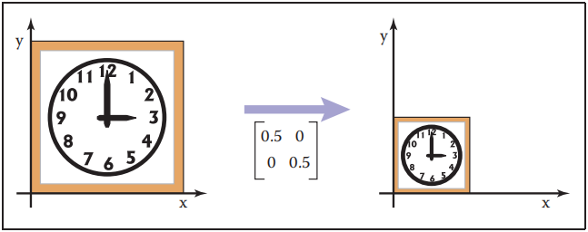

​											**图6.1 每个轴按一半均匀缩放：该轴对齐的缩放矩阵有每个对角元素的变化比例，而非对角元素的变化比例为零。**

一个在水平方向上减半，在垂直方向上增加二分之三倍的矩阵是（见图 6.2）
$$
scale(0.5,1.5) = \begin{bmatrix}0.5 & 0 \\ 0 & 1.5\end{bmatrix}
$$
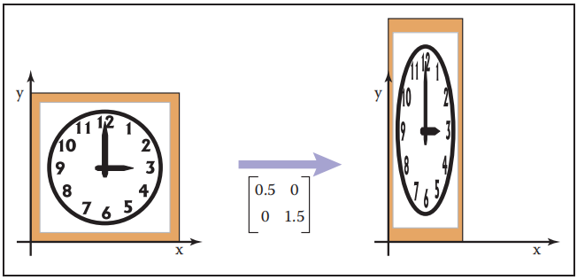

​					**图6.2 在 x 和 y 上不均匀缩放：该缩放矩阵是具有非相等元素的对角矩阵。请注意，时钟的方形轮廓变成了矩形，而圆形的面变成了椭圆形。**

#### 6.1.2 切变（Shearing）

​		切变是把东西往旁边推的东西，就像你用手推一副牌一样，其底部保持不动，卡片移动的越多底部离顶部越近。水平和垂直切变矩阵为
$$
shear\_x(s) = \begin{bmatrix}1 & s \\ 0 & 1\end{bmatrix}
, \qquad{}
shear\_y(s) = \begin{bmatrix}1 & 0 \\ s & 1\end{bmatrix}
$$
**例子** 使垂直线向右倾斜 45^◦^ 的水平切变为（见图 6.3）
$$
shear\_x(s) = \begin{bmatrix}1 & 1 \\ 0 & 1\end{bmatrix}
$$

​				**图6.3 x 轴切变矩阵按其 y 坐标的比例向右移动。现在时钟的方形轮廓变成了一个平行四边形，随着比例的增加，时钟的圆形表面变成了椭圆**

​		垂直方向的一个类似变换是（见图 6.4）
$$
shear\_y(s) = \begin{bmatrix}1 & 0 \\ 1 & 1\end{bmatrix}
$$
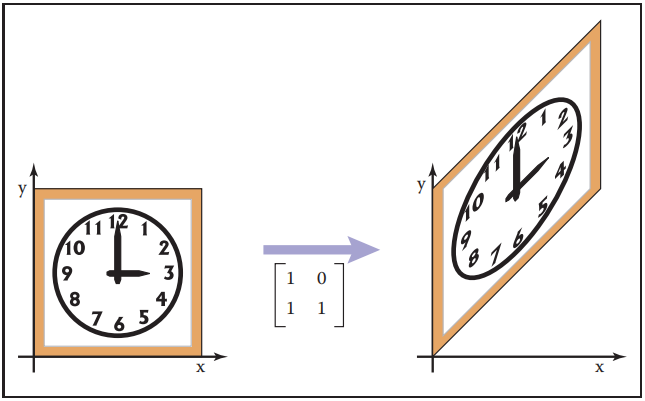

​																							**图6.4 y 轴切变矩阵使点按其横坐标的比例向上移动**

在这两种情况下，剪切时钟的方形轮廓变成一个平行四边形，切变时钟的圆形面变成一个椭圆。  

*事实上，圆在任何矩阵变换下的图像都是椭圆。*

​		另一种考虑剪切的方法是只考虑垂直（或水平）轴的旋转。取垂直轴，顺时针倾斜角度 φ 的切变为
$$
\begin{bmatrix}1 & \tan{\phi{}} \\ 0 & 1\end{bmatrix}
$$
同理，以角度 φ 逆时针旋转水平轴的切变矩阵为
$$
\begin{bmatrix}1 & 0 \\ \tan{\phi{}} & 1\end{bmatrix}
$$

#### 6.1.3 旋转（Rotation）

​		假设我们想要将向量 **a** 逆时针旋转一个角度 φ 来得到向量 **b**（图 6.5）。如果 **a** 和 x 轴的夹角是 α，它的长度是 r = √(x~a~ ^2^+ y~a~^2^)，我们就知道了
$$
x_{a} = r\cos{\alpha{}} \\ y_{a} = r\sin{\alpha{}}
$$
因为 **b** 是 **a** 的旋转，它的长度也是 r。因为它从 a 旋转一个角度 φ，**b** 与 x 轴形成一个角度 (α + φ)。使用三角加法恒等式（2.3.3 节）：（式 6.1）
$$
x_{b} =r\cos{(\alpha{} + \phi{})} = r\cos{\alpha{}}\cos{\phi{}} - r\sin{\alpha{}}\sin{\phi{}} \\
y_{b} =r\sin{(\alpha{} + \phi{})} = r\sin{\alpha{}}\cos{\phi{}} + r\cos{\alpha{}}\sin{\phi{}}
\tag{6.1}
$$
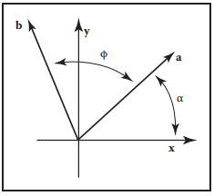

​																													**图6.5 公式（6.1）的几何图**

将 x~a~ = rcos α 和 y~a~ = rsin α 代入得到
$$
x_{b} = x_{a}\cos{\phi{}} - y_{a}\sin{\phi{}} \\
y_{b} = y_{a}\cos{\phi{}} + x_{a}\sin{\phi{}}
$$
在矩阵形式中，从 **a** 到 **b** 的变换是
$$
rotate(\phi{}) = \begin{bmatrix}\cos{\phi{}} & -\sin{\phi{}} \\ \sin{\phi{}} & \cos{\phi{}}\end{bmatrix}
$$
**例子** 以 π/4 弧度（45 度）旋转矢量的矩阵是（见图 6.6）
$$
\begin{bmatrix}\cos{\frac{\pi}{4}} & -\sin{\frac{\pi}{4}} \\ \sin{\frac{\pi}{4}} & \cos{\frac{\pi}{4}}\end{bmatrix}
=
\begin{bmatrix}0.707 & -0.707 \\ 0.707 & 0.707\end{bmatrix}
$$
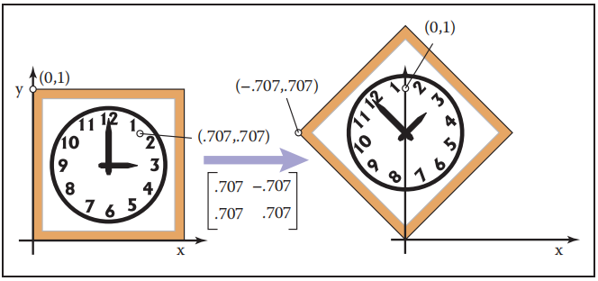

​																				**图6.6 旋转 45^◦^。注意旋转是逆时针的，cos(45^◦^) = sin(45^◦^) ≈ 0.707。**

​		一个沿顺时针方向旋转 π/6 弧度（30 度）的矩阵，在我们的框架中相当于旋转了 -π/6 度（见图 6.7）：
$$
\begin{bmatrix}\cos{(-\frac{\pi}{6})} & -\sin{(-\frac{\pi}{6})} \\ \sin{(-\frac{\pi}{6})} & \cos{(-\frac{\pi}{6})}\end{bmatrix}
=
\begin{bmatrix}0.866 & 0.5 \\ -0.5 & 0.866\end{bmatrix}
$$
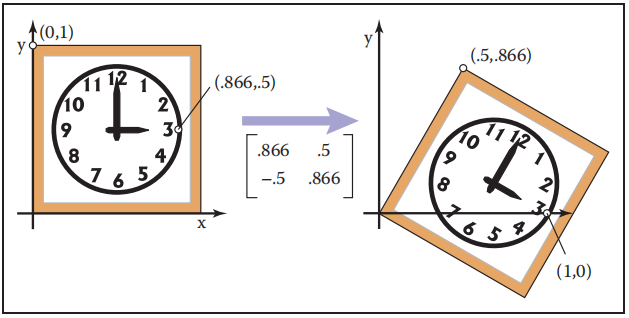

​																		**图6.7 旋转 -30 度。注意旋转是逆时针的，cos(-30^◦^) ≈ 0.866，sin(45^◦^) = -0.5**

​		由于旋转矩阵每一行的范数为1（sin^2^φ + cos^2^φ = 1），且各行正交（cos φ(-sin φ) + sin φ cos φ = 0），可见旋转矩阵是正交矩阵（第 5.2.4 节）。通过观察这个矩阵，我们可以读出两对标准正交向量：这两列向量，是变换中标准基向量 (1,0) 和 (0,1) 的目标向量。这些行，就是这些变换到标准基向量的向量。

*简单地说，R**e~i~** = **u~i~** 和 R**v~i~** = **u~i~**，用于使用列 **u~i~** 和行 **v~i~** 进行旋转。*

#### 6.1.4 翻转（Reflection）

​		我们可以通过使用一个负比例因子的比例来翻转一个向量穿过任意一个坐标（见图 6.8 和 6.9）：
$$
reflect\_y = \begin{bmatrix}-1 & 0 \\ 0 & 1\end{bmatrix}
, \qquad{}
reflect\_x = \begin{bmatrix}1 & 0 \\ 0 & -1\end{bmatrix}
$$
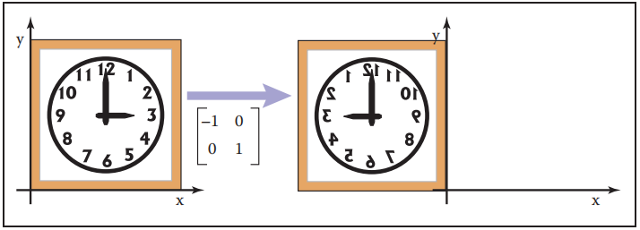

​																					**图6.8 关于 y 轴的翻转是通过将所有 x 坐标乘以 -1 来实现的。**

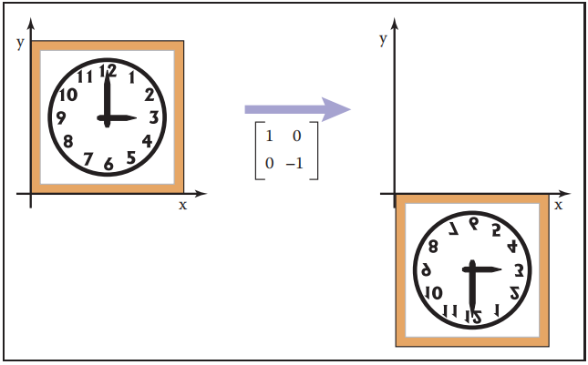

​																					**图6.9  关于 x 轴的翻转是通过将所有 y 坐标乘以 -1 来实现的。**

虽然人们可能认为对角线上两个元素都为 −1 的矩阵也是一个翻转，但实际上它只是一个 π 弧度的旋转。

*这种旋转也可以称为 “通过原点的反射”。*

#### 6.1.5 变换的组成和分解（Composition and Decomposition of Transformations）

​		对于图形程序来说，对一个对象应用多个转换是很常见的。例如，我们可能想先应用一个缩放 S，然后再应用一个旋转 R。这将在 2D 向量 v~1~ 上通过两步完成：
$$
first：\vec{v_{2}} = S\vec{v_{1}}		\\
then:\vec{v_{3}} = R\vec{v_{2}}
$$
另一种写法是
$$
\vec{v_{3}} = R(S\vec{v_{1}})
$$
因为矩阵乘法满足结合律，我们也可以写成
$$
v_{3} = (RS)\vec{v_{1}}
$$
换句话说，我们可以用一个大小相同的矩阵来表示两个矩阵将一个向量按顺序转换的效果，我们可以通过将两个矩阵相乘来计算：M = RS（图 6.10）。

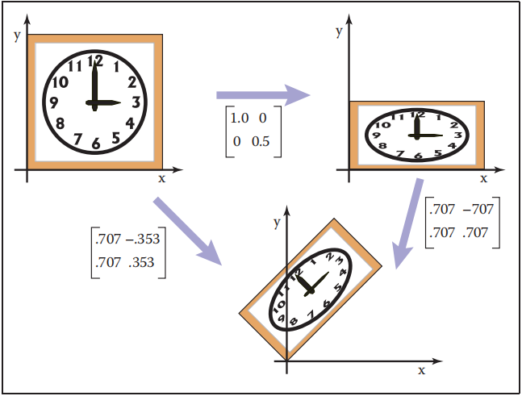

​									**图6.10 将两个变换矩阵按顺序应用与将它们的乘积应用一次是相同的。这是构成大多数图形硬件和软件的关键概念。**

​		重要的是要记住，这些变换首先是从右侧应用的。所以矩阵 M = RS 首先应用 S，然后是 R。

**例子** 假设我们想在垂直方向上缩放 1/2，然后旋转 π/4 弧度（45 度）。得到的矩阵是
$$
\begin{bmatrix}0.707 & -0.707 \\ 0.707 & 0.707\end{bmatrix}
\begin{bmatrix}1 & 0 \\ 0 & 0.5\end{bmatrix}
=
\begin{bmatrix}0.707 & -0.353 \\ 0.707 & 0.353\end{bmatrix}
$$
重要的是要始终记住矩阵乘法是不可交换的。所以变换的顺序很重要。在本例中，首先旋转，然后缩放，得到一个不同的矩阵（见图 6.11）：
$$
\begin{bmatrix}1 & 0 \\ 0 & 0.5\end{bmatrix}
\begin{bmatrix}0.707 & -0.707 \\ 0.707 & 0.707\end{bmatrix}
=
\begin{bmatrix}0.707 & -0.707 \\ 0.353 & 0.353\end{bmatrix}
$$
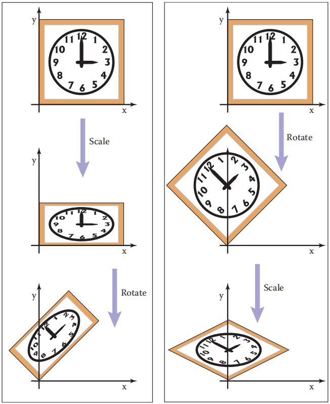

​					**图6.11 应用两个变换的顺序通常很重要。在这个例子中，我们缩放 y 的一半，然后旋转 45◦。将应用这两个转换的顺序颠倒，将产生不同的结果。**

**例子** 使用我们给出的缩放矩阵，非统一缩放只能沿坐标轴进行。如果我们想沿着对角线将时钟拉长 50%，那么 8:00 到 1:00 移动到西北方向，2:00 到 7:00 移动到东南方向，我们可以使用旋转矩阵结合轴向缩放矩阵来得到我们想要的结果。这个想法是使用旋转使缩放轴与坐标轴对齐，然后沿着这个轴缩放，然后旋转回来。在我们的例子中，缩放轴是正方形的 “反斜线” 对角线，我们可以使它与 x 轴平行旋转 +45^◦^。  把这些操作放在一起，整个转换就是
$$
rotate(-45\degree{})scale(1.5,1)rotate(45\degree{})
$$
*记住要从右到左读转换过程。*

​		在数学符号中，这可以写成 RSR^T^。 这三个矩阵相乘的结果是
$$
\begin{bmatrix}1.25 & -0.25 \\ -0.25 & 1.25\end{bmatrix}
$$
*这个矩阵是对称的并不是巧合——试着将转置积法则应用到 RSR^T^ 公式中*

​		从旋转和缩放变换矩阵构建一个变换矩阵实际上适用于任何线性变换，这一事实导致了一种思考这些变换的强大方法，下一节将对此进行探讨。

#### 6.1.6 变换的分解（Decomposition of Transformations）

​		有时需要 “撤消” 变换的组成，将变换分解成更简单的部分。例如，根据单独的旋转和缩放因子向用户展示一个变换，以便进行处理，这通常是有用的，但一个变换可能在内部简单地表示为一个矩阵，旋转和缩放已经混合在一起了。如果能计算出将矩阵分解成所需的小块，对小块进行调整，然后再将这些小块乘在一起将矩阵重新组装，就可以实现这种类型的处理。

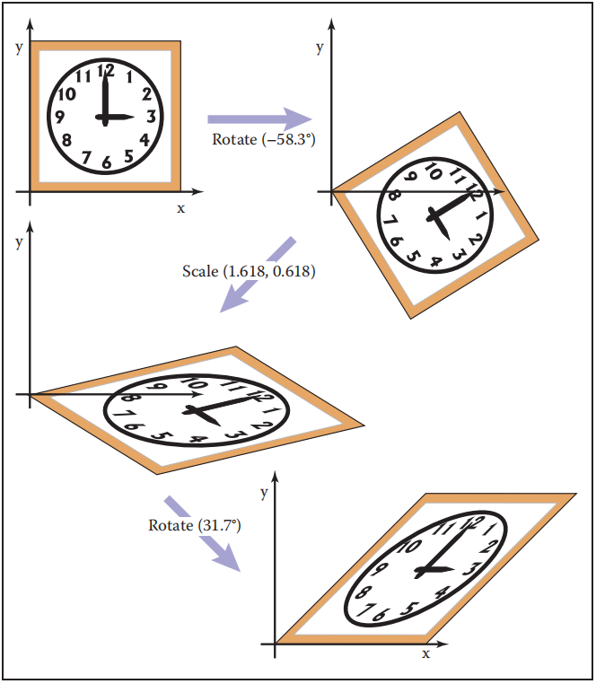

**图6.12 切变矩阵的奇异值分解（SVD）。任何二维矩阵都可以分解成旋转、缩放、旋转的乘积。请注意，时钟的圆形表面必须变成椭圆，因为它只是一个旋转和缩放的圆**

​		事实证明，这种分解或因式分解是可能的，不管矩阵中的项是什么——这一事实提供了一种富有成效的方式来思考变换以及它们对被变换的几何图形做了什么。

**对称的特征值分解**

​		让我们从对称矩阵开始。回忆一下 5.4 节，对称矩阵总是可以使用特征值分解成这种形式的乘积
$$
A = RSR^{T}
$$
其中 R 是一个正交矩阵 S 是一个对角矩阵，我们称 R 的列向量（特征向量）为 v~1~ 和 v~2~，称 S 的对角项（特征值）为 λ~1~ 和 λ~2~。

​		在几何方面，我们现在可以识别 R 是一个旋转，S 是一个苏佛昂，所以这只是一个多步骤的几何变换（图 6.13）：

1. 旋转 v~1~ 和 v~2~ 到 x 轴和 y 轴（通过 R^T^ 变换）
2. 用 (λ~1~, λ~2~) 缩放 x 和 y（通过 S 变换）
3. 将 x 轴和 y 轴旋转回 v~1~ 和 v~2~（通过 R 变换）

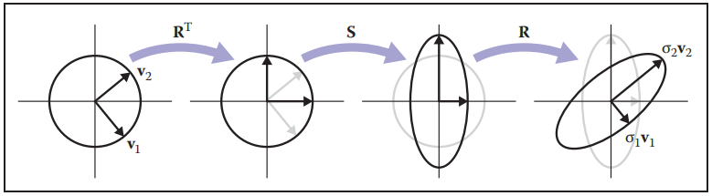

**图6.13 当单位圆被任意对称矩阵 A 变换时会发生什么，也称为非轴对齐、非均匀的缩放。这两个垂直的向量v1和v2，是A的特征向量，其方向是固定的，但是缩放了。根据初等变换，这可以被看作是首先旋转特征向量到标准基，做一个轴对齐的缩放，然后旋转标准基回到特征向量。**

*如果你想计算维度：对称的 2× 2 矩阵有 3 个自由度，特征值分解将其改写为一个旋转角度和两个缩放因子。*

观察这三种变换的效果，我们可以看到它们有沿一对轴的非统一缩放的效果。与轴对齐的缩放一样，轴是垂直的，但它们不是坐标轴，而是 A 的特征向量。这告诉了我们什么是对称矩阵：对称矩阵只是缩放操作——尽管可能是非统一和非轴向的。

**例子** 回想一下 5.4 节中的示例：
$$
\begin{align}
\begin{bmatrix}2 & 1 \\ 1 & 1\end{bmatrix} 
&= R\begin{bmatrix}\lambda{}_{1} & 0 \\ 0 & \lambda{}_{2}\end{bmatrix}R^{T}	\\
&= \begin{bmatrix}0.8507 & -0.5257 \\ 0.5257 & 0.8507\end{bmatrix}\begin{bmatrix}2.618 & 0\\ 0 & 0.382\end{bmatrix}
\begin{bmatrix}0.8507 & 0.5257\\ -0.5257 & 0.8507\end{bmatrix} \\
&= rotate(31.7\degree{})scale(2.618,0.382)rotate(-31.7\degree{})
\end{align}
$$
上面的矩阵，然后，根据它的特征值分解，缩放从 3 点钟方向（x 轴）逆时针旋转 37^◦^ 的方向。如图 6.14 所示，这是在下午 2 点之前位置的一次操作。

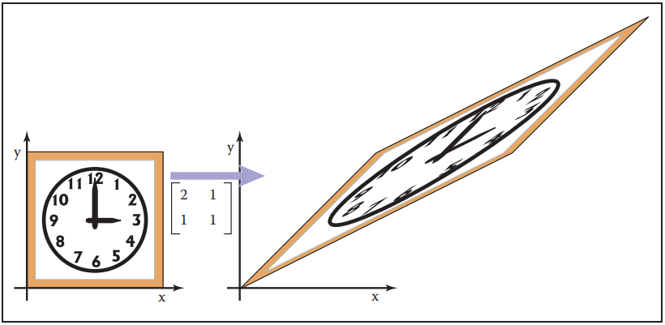

​					**图6.14 对称矩阵总是沿着某一轴的一个缩放。在这种情况下，它是沿着 φ = 31.7^◦^ 方向，这意味着这个矩阵的真实特征向量是在那个方向  **

​		我们也可以反转这个对角化过程，为了缩放 ((*λ*~1~, λ~2~)，第一个缩放方向为从 x 轴顺时针方向角度 φ，我们有
$$
\begin{bmatrix}\cos{\phi{}} & \sin{\phi{}} \\ -\sin{\phi{}} & \cos{\phi{}}\end{bmatrix}
\begin{bmatrix}\lambda{}_{1} & 0 \\ 0 & \lambda{}_{2}\end{bmatrix}
\begin{bmatrix}\cos{\phi{}} & -\sin{\phi{}} \\ \sin{\phi{}} & \cos{\phi{}}\end{bmatrix}
=
\begin{bmatrix}
\lambda{}_{1}\cos{\phi{}}^{2} + \lambda{}_{2}\sin{\phi{}}^{2} & (\lambda{}_{2}-\lambda{}_{1})\cos{\phi{}}\sin{\phi{}} \\ 
 (\lambda{}_{2}-\lambda{}_{1})\cos{\phi{}}\sin{\phi{}} & \lambda{}_{2}\cos{\phi{}}^{2} + \lambda{}_{1}\sin{\phi{}}^{2}
\end{bmatrix}
$$
我们应该记住，这是一个对称矩阵，我们知道它一定是正确的，因为我们从一个对称特征值分解构造它。

**奇异值分解**

​		非常类似的分解也可以用非对称矩阵来做：它是奇异值分解（SVD），也在第 5.4.1 节中讨论。不同之处在于对角矩阵两边的矩阵不再相同：
$$
A = USV^{T}
$$
取代单旋转 R 的两个正交矩阵称为 U 和 V，它们的列分别称为 u~i~（左奇异向量）和 v~i~（右奇异向量）。  在这种情况下，S 的对角项称为奇异值而不是特征值。其几何解释与对称特征值分解非常相似（图 6.15）：

1. 旋转 v~1~ 和 v~2~ 到 x 轴和 y 轴(通过 V^T^ 变换)。
2. 在 x 和 y 上缩放 (σ~1~, σ~2~)（通过 S 变换）。
3. 旋转x轴和y轴到u1和u2（通过 U 变换）。

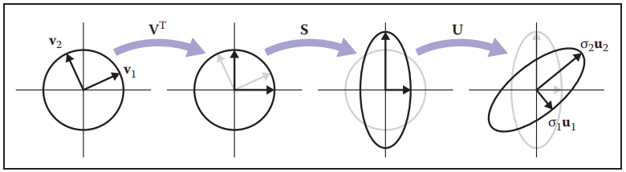

**图6.15 当单位圆被任意矩阵 A 变换时会发生什么。这两个垂直的向量 v~1~ 和 v~2~，它们是 A 的右奇异向量，它们被缩放并在方向上改变以匹配左奇异向量 u~1~ 和 u~2~。根据初等变换，这可以看作是首先将右边的奇异向量旋转到标准基上，进行轴对齐的缩放，然后将标准基旋转到左边的奇异向量上**

*对于维度计数：一般 2 × 2 矩阵有 4 个自由度，SVD 将其重写为两个旋转角度和两个缩放因子。还需要一个比特来记录反射，但这并不会增加维度。*

主要的区别是单个旋转和两个不同的正交矩阵之间的区别。这个差异导致了另一个不那么重要的差异，因为 SVD 两侧奇异向量不同，所以不需要负奇异值：我们总是可以反转一个奇异值的符号，反转其中一个相关的奇异向量的方向，就可以再次得到相同的变换。由于这个原因，SVD 总是产生一个所有条目都是正的对角矩阵，但矩阵 U 和 V 不能保证是旋转矩阵——它们也可以包括翻转。在像图形这样的几何应用中，这是一个不方便的地方，但也是很次要的一个：通过检查行列式很容易区分旋转和翻转，旋转是 +1 翻转是 -1，如果需要旋转，则可以将其中一个奇异值消掉，从而得到一个旋转-缩放-旋转序列，其中翻转是随着缩放得来的，而不是随着一个旋转。

**例子** 第 5.4.1 节中使用的例子实际上是一个切变矩阵（图 6.12）：
$$
\begin{align}
\begin{bmatrix}1 & 1 \\ 0 & 1\end{bmatrix} 
&= R_{2}\begin{bmatrix}\sigma{}_{1} & 0 \\ 0 & \sigma{}_{2}\end{bmatrix}R_{1} \\
&= \begin{bmatrix}0.8507 & -0.5257 \\ 0.5257 & 0.8507\end{bmatrix}\begin{bmatrix}1.618 & 0 \\ 0 & 0.618\end{bmatrix}
\begin{bmatrix}0.5257 & 0.8507 \\ -0.8507 & 0.5257\end{bmatrix} \\
&= rotate(31.7\degree{})scale(1.618, 0.618)rotate(-58.3\degree{})
\end{align}
$$
SVD 存在的直接结果是，我们看到的所有二维变换矩阵都可以由旋转矩阵和缩放矩阵构成。切变矩阵是一种方便的方法，但它们不是表示变换所必需的。

​		总之，每个矩阵都可以通过 SVD 分解为一个旋转乘以一个缩放乘以另一个旋转。只有对称矩阵才能通过特征值对角化分解为旋转乘以缩放乘以反旋转，且这类矩阵是任意方向上的简单缩放。对称矩阵的奇异值分解将通过稍微复杂一点的代数操作产生与特征值分解相同的三重积。

**旋转的 Peath 分解**

​		另一种分解使用切变来表示非零旋转（Paeth, 1990）。下面的等式表现了这个：
$$
\begin{bmatrix}\cos{\phi{}} & -\sin{\phi{}} \\ \sin{\phi{}} & \cos{\phi{}}\end{bmatrix} =
\begin{bmatrix}1 & \frac{\cos{\phi{}}-1}{\sin{\phi{}}} \\ 0 & 1\end{bmatrix} 
\begin{bmatrix}1 & 0 \\ \sin{\phi{}} & 1\end{bmatrix} 
\begin{bmatrix}1 & \frac{\cos{\phi{}}-1}{\sin{\phi{}}} \\ 0 & 1\end{bmatrix} 
$$
例如，π/4（45 度）的旋转是（见图 6.16）（式 6.2）
$$
rotate(\frac{\pi{}}{4}) = \begin{bmatrix}1 & 1 - \sqrt{2} \\ 0 & 1\end{bmatrix}
\begin{bmatrix}1 & 0 \\ \frac{\sqrt{2}}{2} & 1\end{bmatrix} 
\begin{bmatrix}1 & 1 - \sqrt{2} \\ 0 & 1\end{bmatrix} 
\tag{6.2}
$$
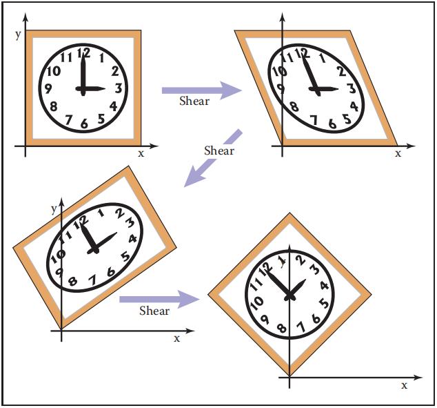

​														**图6.16 任何二维旋转都可以由三个顺序切变完成。在这种情况下，旋转 45^◦^ 分解如公式 6.2 所示。**

​		这种特殊的变换对于光栅旋转非常有用，因为切变是一种非常有效的图像光栅操作，它引入了一些锯齿，但是不会留下任何孔。关键的观察是，如果我们取一个光栅位置 (i, j)，并对其施加一个水平切变，我们得到
$$
\begin{bmatrix}1 & s \\ 0 & 1\end{bmatrix}\begin{bmatrix}i \\ j\end{bmatrix} = 
\begin{bmatrix}i + sj \\ j\end{bmatrix}
$$
如果我们将 sj 四舍五入到最接近的整数，这相当于取图像中的每一行并将其侧向移动一些数量——每一行有不同的数量。因为它在一行中是相同的位移，这允许我们在结果图像中没有间隙的旋转。类似的作用也适用于垂直切变。因此，我们可以很容易地实现一个简单的光栅旋转。

### 6.2 三维线性变换（3D Linear Transformations）

​		线性的三维变换是二维变换的扩展。例如，沿笛卡尔轴的缩放是（式 6.3）
$$
scale(s_{x},s_{y},s_{z}) = \begin{bmatrix}s_{x} & 0 & 0 \\ 0 & s_{y} & 0 \\ 0 & 0 & s_{z}\end{bmatrix}
\tag{6.3}
$$
旋转在 3D 中要比在 2D 中复杂得多，因为有更多可能的旋转轴。然而，如果我们只是想绕 z 轴旋转，这只会改变 x 和 y 坐标，我们可以使用 2D 旋转矩阵，而不需要对 z 进行操作：
$$
rotate\_z(\phi{}) = \begin{bmatrix}\cos{\phi{}} & -\sin{\phi{}} & 0 \\ \sin{\phi{}} & \cos{\phi{}} & 0 \\ 0 & 0 & 1\end{bmatrix}
$$
类似地，我们可以构造绕 x 轴和 y 轴旋转的矩阵：
$$
rotate\_x(\phi{}) = \begin{bmatrix}1 & 0 & 0 \\ 0 & \cos{\phi{}} & -\sin{\phi{}} \\ 0 & \sin{\phi{}} & \cos{\phi{}}\end{bmatrix}
$$

$$
rotate\_{y}(\phi{}) = \begin{bmatrix}\cos{\phi{}} & 0 & \sin{\phi{}} \\0 & 1 & 0 \\ -\sin{\phi{}} & 0 & \cos{\phi{}}\end{bmatrix}
$$

我们将在下一节讨论关于任意轴的旋转。

*为了理解为什么 y 轴旋转的负号在左下角，想想一个圆形序列中的三个轴：y 在 x 之后，z 在 y 之后，x 在 z 之后。*

​		类似在二维空间中，我们可以沿着特定的轴进行切变，例如
$$
shear\_x(d_{y},d_{z}) = \begin{bmatrix}1 & d_{y} & d_{z} \\ 0 & 1 & 0 \\ 0 & 0 & 1\end{bmatrix}
$$
与 2D 变换一样，任何 3D 变换矩阵都可以使用 SVD 变成一个旋转，一个缩放，再一个旋转。任何对称三维矩阵都有一个特征值分解为旋转、缩放和反旋转。最后，一个三维旋转可分解为三维切变矩阵的乘积。

#### 6.2.1 任意三维旋转（Arbitrary 3D Rotations）

​		和 2D 一样，3D 旋转是正交矩阵。在几何上，这意味着矩阵的三行是三个相互正交的单位向量的笛卡尔坐标，如 2.4.5 节所讨论的。列向量是三个，可能不同的，相互正交的单位向量。有无限个这样的旋转矩阵。让我们写下这样一个矩阵：
$$
R_{uvw} = \begin{bmatrix}x_{u} & y_{u} & z_{u} \\ x_{v} & y_{v} & z_{v} \\ x_{w} & y_{w} & z_{w}\end{bmatrix}
$$
这里 **u** = x~u**~x** + y~u~y + z~u~**z**，**v** 和 **w** 也是如此。因为这三个向量是标准正交的，我们知道
$$
\vec{u} \cdot{} \vec{u} = \vec{v} \cdot{} \vec{v} = \vec{w} \cdot{} \vec{w} = 1 \\
\vec{u} \cdot{} \vec{v} = \vec{v} \cdot{} \vec{w} = \vec{w} \cdot{} \vec{u} = 0
$$
我们可以通过对向量 **u**，**v** 和 **w** 的应用来推断旋转矩阵的一些性质。例如，
$$
R_{uvw}\vec{u} = \begin{bmatrix}x_{u} & y_{u} & z_{u} \\ x_{v} & y_{v} & z_{v} \\ x_{w} & y_{w} & z_{w}\end{bmatrix}
\begin{bmatrix}x_{u} \\ y_{u} \\ z_{u}\end{bmatrix}
=
\begin{bmatrix}
x_{u}x_{u} + y_{u}y_{u} + z_{u}z_{u} \\ x_{v}x_{u} + y_{v}y_{u} + z_{v}z_{u} \\ x_{w}x_{u} + y_{w}y_{u} + z_{w}z_{u}
\end{bmatrix}
$$
注意 R~uvw~**u** 的这三行都是点积：
$$
R_{uvw}\vec{u} = \begin{bmatrix}\vec{u} \cdot{} \vec{u} \\ \vec{v} \cdot{} \vec{u} \\ \vec{w} \cdot{} \vec{u}\end{bmatrix}
= \begin{bmatrix}1 \\ 0 \\ 0\end{bmatrix} = \vec{x}
$$
同样，R~uvw~**v** = **y**, R~uvw~**w** = **z**。因此 R~uvw~ 将基 **uvw** 旋转到相应的笛卡尔轴上。

​		如果 R~uvw~ 是一个具有标准正交行的旋转矩阵，那么R^T^~uvw~ 也是一个具有标准正交列的旋转矩阵，实际上也是 R~uvw~ 的逆（正交矩阵的逆总是它的转置）。重要的一点是，对于变换矩阵，代数逆也是几何逆。如果 R~uvw~ 使 **u** 到 **x**，那么 R^T^~uvw~ 使 **x** 到 **u**。我们可以确认这对于 **v** 和 **y** 也应该是一样的：
$$
R^{T}_{uvw}\vec{y} = \begin{bmatrix}x_{u} & x_{v} & x_{w} \\ y_{u} & y_{v} & y_{w} \\ z_{u} & z_{v} & z_{w}\end{bmatrix}
\begin{bmatrix}0 \\ 1 \\ 0\end{bmatrix}
=
\begin{bmatrix}x_{v} \\ y_{v} \\ z_{v}\end{bmatrix} = \vec{v}
$$
所以我们总是可以用标准正交基来创建旋转矩阵。

​		如果我们想旋转一个任意向量 **a**，我们可以创建一个 **w** = **a** 的标准正交基，将这个基旋转到标准基 **xyz**，绕 **z** 轴旋转，然后将标准基旋转回 **uvw** 基。在矩阵形式下，绕 **w** 轴旋转一个角度 φ：
$$
\begin{bmatrix}x_{u} & x_{v} & x_{w} \\ y_{u} & y_{v} & y_{w} \\ z_{u} & z_{v} & z_{w}\end{bmatrix}
\begin{bmatrix}\cos{\phi{}} & -\sin{\phi{}} & 0 \\ \sin{\phi{}} & \cos{\phi{}} & 0 \\ 0 & 0 & 1\end{bmatrix}
\begin{bmatrix}x_{u} & y_{u} & z_{u} \\ x_{v} & y_{v} & z_{v} \\ x_{w} & y_{w} & z_{w}\end{bmatrix}
$$
这里我们有 **w** 是 **a** 方向上的单位向量（也就是a除以它自身的长度）。但是 **u** 和 **v** 是什么？2.4.6 节给出了求合理 **u** 和 **v** 的方法。如果我们有一个旋转矩阵，我们希望以轴角形式旋转，我们可以计算一个实数的特征值（λ = 1)，对应的特征向量是旋转轴。这是一个没有因旋转而改变的轴。

​		除了旋转矩阵外，还有一些常用的表示旋转的方法，请参阅第 16 章。

#### 6.2.2 变换法向量（Transforming Normal Vectors）

​		虽然我们使用的大多数 3D 矢量表示位置（从原点偏移的矢量）或方向，比如光线从哪里来，但有些矢量表示表面法线。表面法向量垂直于表面的切平面。当下面的表面被变换时，这些法线不会以我们想要的方式进行变换。例如，如果一个表面上的点被矩阵 M 变换，那么与表面相切并乘以 M 的向量 **t** 将与变换后的表面相切。然而，由 M 变换的表面法向量 **n** 可能不是变换后的表面的法向量（图 6.17）。

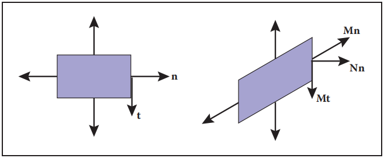

**图6.17 当一个法向量使用变换对象上的点的相同矩阵进行变换时，得到的向量可能不垂直于这个切变矩形的表面。然而，切向量确实转换成与变换后的曲面相切的向量。**

​		我们可以推出一个变换矩阵 N 它把 **n** 放到一个垂直于变换后的曲面的向量上。解决这个问题的一种方法是注意表面法向量和切向量是垂直的，所以它们的点积是零，用矩阵的形式表示为（式 6.4）
$$
\vec{}n^{T}\vec{t} = 0
\tag{6.4}
$$
如果我们将期望的变换向量表示为 **t**~M~ = M**t** 和 **n**~N~ = N**n**，我们的目标是找到使 **n**~N~^T^  **t**~M~ = 0 的 N。我们可以通过代数上的技巧找到 N。首先，我们可以在点积中混入一个单位矩阵，然后利用 M^-1^M = I：
$$
\vec{n}^{T}\vec{t} = \vec{n}^{T}I\vec{t} = \vec{n}^{T}M^{-1}M\vec{t} = 0
$$
虽然上面的操作显然没有得到任何结果，但请注意，我们可以添加括号，使上面的表达式更明显地成为点积：
$$
(\vec{n}^{T} M^{-1})(M\vec{t}) = (\vec{n}^{T}M^{-1})\vec{t}_{M} = 0
$$
这意味着垂直于 t~M~ 的行向量是上面表达式的左边部分。这个表达式对切平面上的任何切向量都成立，因为在3D中只有一个方向（以及它的相反方向）垂直于所有这些切向量，我们知道上面表达式的左边部分一定是 **n**~N~ 的行向量表达式，也就是 **n**~N~^T^，所以这允许我们推断 N：
$$
\vec{n}^{T}_{N} = \vec{n}^{T}M^{-1}
$$
我们可以用它的转置得到
$$
\vec{n}_{N} = (\vec{n}^{T}M^{-1})^{T} = (M^{-1})^{T}\vec{n}
\tag{6.5}
$$
因此，我们可以看到，正确变换法向量使其保持法向量的矩阵是 N = (M^−1^)^T^，即逆矩阵的转置。因为这个矩阵可以改变 n 的长度，我们可以将它乘以任意标量它仍然会产生方向正确的 **n**~N~。回顾第 5.3 节，矩阵的逆是因子矩阵的转置除以行列式 。因为我们不关心法向量的长度，对于 3 × 3 矩阵我们可以跳过除法
$$
N = \begin{bmatrix}m_{11}^{c} & m_{12}^{c} & m_{13}^{c} \\ m_{21}^{c} & m_{22}^{c} & m_{23}^{c} \\ m_{31}^{c} & m_{32}^{c} & m_{33}^{c}\end{bmatrix}
$$
假设第 i 行第 j 列的 M 元素是 m~ij~。所以 N 的完整表达式是
$$
N = 
\begin{bmatrix}
m_{22}m_{33}-m_{23}m_{32} & m_{23}m_{31}-m_{21}m_{33} & m_{21}m_{32}-m_{22}m_{31} \\
m_{13}m_{32}-m_{12}m_{33} & m_{11}m_{33}-m_{13}m_{31} & m_{12}m_{31}-m_{11}m_{32} \\
m_{12}m_{23}-m_{13}m_{22} & m_{13}m_{21}-m_{11}m_{23} & m_{11}m_{22}-m_{12}m_{21}
\end{bmatrix}
$$

### 6.3 平移和仿射变化（Translation and Affine Transformations）

​		我们一直在研究用矩阵M来改变向量的方法。在二维空间中，这些变换有这样的形式
$$
x' = m_{11}x + m_{12}y	\\
y' = m_{21}x + m_{22}y
$$
我们不能使用这种变换来移动对象，只能缩放和旋转它。特别地，原点(0,0)在线性变换下始终是固定的。通过等量移动其所有点去移动或平移一个物体，我们需要一个形式的变换，
$$
x' = x + x_{t}	\\
y' = y + y_{t}
$$
用 (x, y) 乘以 2 × 2 矩阵是不可能的。将平移添加到线性变换系统中的一种可能性是，简单地将一个单独的平移向量与每个变换矩阵关联起来，让矩阵处理缩放和旋转，让向量处理平移。这是完全可行的，但形式是尴尬的，组成两个转换的规则不像线性转换那样简单和干净。

​		相反，我们可以使用一个聪明的技巧来让一个矩阵乘法同时完成这两种操作。这个想法很简单：用一个 3D 向量 [x y 1]^T^ 来表示点 (x, y)，并使用 3 × 3 的矩阵形式
$$
\begin{bmatrix}m_{11} & m_{12} & x_{t} \\ m_{21} & m_{22} & y_{t} \\ 0 & 0 & 1\end{bmatrix}
$$
固定的第三行用于将 1 复制到变换后的向量中，这样所有向量的最后一个位置都有 1，并且前两行作为 x、y 和 1 的线性组合计算 x' 和 y'：
$$
\begin{bmatrix}x' \\ y' \\ 1\end{bmatrix}
=
\begin{bmatrix}m_{11} & m_{12} & x_{t} \\ m_{21} & m_{22} & y_{t} \\ 0 & 0 & 1 \end{bmatrix}
\begin{bmatrix}x \\ y \\ 1\end{bmatrix}
=
\begin{bmatrix}m_{11}x + m_{12}y + x_{t} \\ m_{21}x + m_{22}y + y_{t} \\ 1\end{bmatrix}
$$
这个矩阵实现了一个线性变换，然后是一个平移！这种变换叫做仿射变换，这种通过增加额外维度来实现仿射变换的方法叫做齐次坐标（homogeneous coordinate）（Roberts, 1965; Riesenfeld, 1981; Penna & Patterson,1986）。齐次坐标不仅清理了转换的代码，而且该方案还使如何组合两个仿射转换变得很明显：简单地把这些矩阵相乘。

​		当我们需要变换不是位置的向量时，这种新形式的问题就出现了——它们代表方向或位置之间的偏移。表示方向或偏移量的向量在平移对象时不应改变。幸运的是，我们可以通过将第三个坐标设为零来安排这个：
$$
\begin{bmatrix}1 & 0 & x_{t} \\ 0 & 1 & y_{t} \\ 0 & 0 & 1\end{bmatrix}\begin{bmatrix}x \\ y \\ 0\end{bmatrix}
=
\begin{bmatrix}x \\ y \\ 0\end{bmatrix}
$$
如果在矩阵的左上方 2 × 2 元素中有一个缩放/旋转变换，它将适用于向量，但平移仍然与 0 相乘并被忽略。此外，零被复制到变换后的向量中，因此方向向量在变换后仍然是方向向量。

​		这正是我们想要的向量的行为，所以它们能平滑地融入系统：额外的（第三个）坐标将是 1 或 0，这取决于我们是编码一个位置还是一个方向。我们确实需要存储齐次坐标以便区分位置和其他向量。例如：[3 2 1]^T^ 是一个位置，[3 2 0]^T^ 是一个偏移或者一个方向。稍后，当我们做透视视图时，我们将看到允许齐次坐标取除 1 或 0 以外的值是很有用的。

*这就解释了 “齐次”变换 这个名称：平移、旋转和位置和方向的缩放都适合于一个系统。*

​		齐次坐标几乎普遍用于表示图形系统中的变换。特别是，在图形硬件中实现的渲染器的设计和运算是基于齐次坐标的。我们将在第 7 章中看到，齐次坐标还可以方便地绘制透视图场景，这也是它们流行的另一个原因。

*齐次坐标在计算机视觉中也很普遍。*

​		齐次坐标可以被认为是处理变换记录的一种聪明方法，但也有不同的几何解释。关键的观察是，当我们做一个基于 z 坐标的三维切变时，我们得到这个变换：
$$
\begin{bmatrix}1 & 0 & x_{t} \\ 0 & 1 & y_{t} \\ 0 & 0 & 1\end{bmatrix}\begin{bmatrix}x \\ y \\ z\end{bmatrix} = 
\begin{bmatrix}x + x_{t}z \\ y + y_{t}z \\ z\end{bmatrix}
$$
注意，这几乎具有我们在 x 和 y 中想要的 2D 变换形式，但有一个 z 在 2D 中没有意义。现在是关键的决定：我们将为所有的 2D 位置添加一个坐标 z = 1。这给我们
$$
\begin{bmatrix}1 & 0 & x_{t} \\ 0 & 1 & y_{t} \\ 0 & 0 & 1\end{bmatrix}\begin{bmatrix}x \\ y \\ 1\end{bmatrix} = 
\begin{bmatrix}x + x_{t} \\ y + y_{t} \\ 1\end{bmatrix}
$$
通过将一个（z = 1）坐标与所有 2D 点联系起来，我们现在可以将平移编码为矩阵形式。例如，首先在 2D 中平移 (x~t~, y~t~)，然后旋转角度 φ，我们可以使用矩阵
$$
M = \begin{bmatrix}\cos{\phi{}} & -\sin{\phi{}} & 0 \\ \sin{\phi{}} & \cos{\phi{}} & 0 \\ 0 & 0 & 1\end{bmatrix}
\begin{bmatrix}1 & 0 & x_{t} \\ 0 & 1 & y_{t} \\ 0 & 0 & 1\end{bmatrix}
$$
注意，2D 旋转矩阵现在是 3 × 3，其在 “平移槽” 中为零。这种形式使用沿 z = 1 的切变来编码平移，我们可以将任意数量的 2D 切变、2D 旋转和 2D 平移表示为一个复合的 3D 矩阵。矩阵的下一行总是 (0,0,1) 所以我们不需要存储它。我们只需要记住，当我们把两个矩阵相乘时，它是存在的。

​		在3D中，同样的技术也起作用：我们可以加上第四个坐标，齐次坐标，然后我们就有了平移：
$$
\begin{bmatrix}1 & 0 & 0 & x_{t} \\ 0 & 1 & 0 & y_{t} \\ 0 & 0 & 1 & z_{t} \\ 0 & 0 & 0 & 1\end{bmatrix}
\begin{bmatrix}x \\ y \\ z \\ 1\end{bmatrix} = 
\begin{bmatrix}x + x_{t} \\ y + y_{t} \\ z + z_{t} \\ 1\end{bmatrix}
$$
同样，对于方向矢量，第四个坐标是零，因此矢量不受平移的影响

**例子（窗口变换）** 通常在图形中，我们需要创建一个变换矩阵，将矩形 [x~l~, x~h~] × [y~l~, y~h~] 中的点取到矩形 [x'~l~, x'~h~] × [y'~l~, y'~h~] 中。这可以用单一的缩放和按顺序位移来完成。然而，从三个运算序列创建变换更直观（图 6.18）：

1. 将点 (x~l~, y~l~) 移动到原点。
2. 将矩形缩放为与目标矩形相同的大小。
3. 移动原点到点 (x'~l~, y'~l~)。

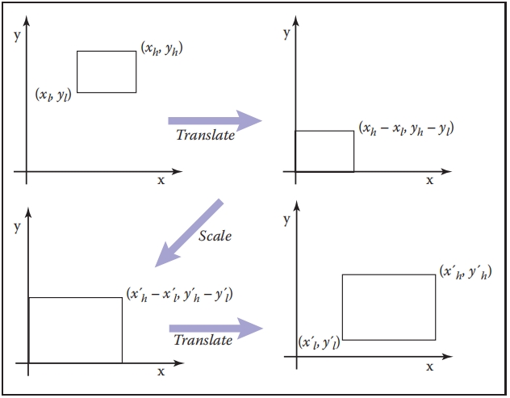

​					**图6.18 要将一个矩形（窗口）移动到另一个，我们首先将左下角移动到原点，然后将其缩放到新的大小，然后将原点移动到目标矩形的左下角。**

记住右手边的矩阵是先应用的，我们可以这样写（式 6.6）
$$
\begin{align}
window 
&= 
translate(x'_{l},y'_{l}) scale(\frac{x'_{h}-x'_{l}}{x_{h}-x_{l}},\frac{y'_{h}-y'_{l}}{y_{h}-y_{l}})translate(-x_{l},-y_{l}) \\
&= 
\begin{bmatrix}1 & 0 & x'_{l} \\ 0 & 1 & y'_{l} \\ 0 & 0 & 1\end{bmatrix}
\begin{bmatrix}\frac{x'_{h}-x'_{l}}{x_{h}-x_{l}} & 0 & 0 \\ 0 & \frac{y'_{h}-y'_{l}}{y_{h}-y_{l}} & 0 \\ 0 & 0 & 1\end{bmatrix}
\begin{bmatrix}1 & 0 & -x_{l} \\ 0 & 1 & -y_{l} \\ 0 & 0 & 1\end{bmatrix} \\
&= 
\begin{bmatrix}
\frac{x'_{h}-x'_{l}}{x_{h}-x_{l}} & 0 & \frac{x'_{l}x_{h} - x'_{h}x_{l}}{x_{h}-x_{l}} \\ 
0 & \frac{y'_{h}-y'_{l}}{y_{h}-y_{l}} & \frac{y'_{l}y_{h} - y'_{h}y_{l}}{y_{h}-y_{l}} \\ 
0 & 0 & 1
\end{bmatrix}
\end{align}
\tag{6.6}
$$
对于一些读者来说，得到的矩阵具有这样的形式可能并不奇怪，但是用三个矩阵构造的过程使结果的正确性毫无疑问。一个完全类似的结构可以用来定义一个3D窗口变换，它将 [x~l~, x~h~] × [y~l~, y~h~] × [z~l~, z~h~] 的盒子映射到 [x‘~l~, x’~h~] × [y‘~l~, y’~h~] × [z‘~l~, z’~h~]：（式 6.7）
$$
\begin{bmatrix}
\frac{x'_{h}-x'_{l}}{x_{h}-x_{l}} & 0 & 0 & \frac{x'_{l}x_{h} - x'_{h}x_{l}}{x_{h}-x_{l}} \\ 
0 & \frac{y'_{h}-y'_{l}}{y_{h}-y_{l}} & 0 & \frac{y'_{l}y_{h} - y'_{h}y_{l}}{y_{h}-y_{l}} \\ 
0 & 0 & \frac{z'_{h}-z'_{l}}{z_{h}-z_{l}} & \frac{z'_{l}z_{h} - z'_{h}z_{l}}{z_{h}-z_{l}} \\ 
0 & 0 & 0 & 1
\end{bmatrix}
\tag{6.7}
$$
有趣的是，如果我们将一个由缩放、切变和旋转组成的任意矩阵与一个简单的平移（平移排在第二位）相乘，我们得到
$$
\begin{bmatrix}1 & 0 & 0 & x_{t} \\ 0 & 1 & 0 & y_{t} \\ 0 & 0 & 1 & z_{t} \\ 0 & 0 & 0 & 1\end{bmatrix}
\begin{bmatrix}
a_{11} & a_{12} & a_{13} & 0 \\
a_{21} & a_{22} & a_{23} & 0 \\
a_{31} & a_{32} & a_{33} & 0 \\
0 & 0 & 0 & 1
\end{bmatrix}
=
\begin{bmatrix}
a_{11} & a_{12} & a_{13} & x_{t} \\
a_{21} & a_{22} & a_{23} & y_{t} \\
a_{31} & a_{32} & a_{33} & z_{t} \\
0 & 0 & 0 & 1
\end{bmatrix}
$$
因此，我们可以把任何矩阵看作一个缩放/旋转部分和一个平移部分，因为这些分量彼此分离得很好。

​		变换中一个重要的类是刚体（rigid-body）变换。它们只由平移和旋转组成，所以它们没有物体的拉伸或收缩。这样的变换将对上面的 a~ij~ 有一个纯旋转。

### 6.4 变换矩阵的逆（Inverses of Transformation Matrices）

​		虽然我们总是可以用代数方法求变换矩阵的逆，但如果我们知道变换的作用，就可以用几何方法。例如，scale(s~x~, s~y~, s~z~) 的逆是 scale(1/s~x~, 1/s~y~, 1/s~z~) 。旋转的逆和角度上有相反的符号的旋转是相同的。平移的逆是反方向的平移。如果我们有一系列矩阵 M = M~1~M~2~ ··· M~n~ 那么 M^−1^ = M~n~^−1^ ··· M~2~^−1^M~1~^−1^。

​		另外，某些类型的变换矩阵很容易求逆。我们已经提到过缩放，它是对角矩阵，第二个重要的例子是旋转，它是正交矩阵。回忆（第 5.2.4 节）正交矩阵的逆就是它的转置。这使得反转旋转和刚体变换变得容易（参见练习 6）。另外，知道一个底部行是 [0 0 0 1] 的矩阵有一个底部行是 [0 0 0 1] 的逆矩阵也是很有用的（参见练习 7）。

​		有趣的是，我们也可以用 SVD 来求矩阵的逆。因为我们知道任何矩阵都可以分解成旋转乘以缩放乘以旋转，所以反推是非常简单的。例如，在 3D 中我们有
$$
M = R_{1}scale(\sigma{}_{1}, \sigma{}_{2}, \sigma{}_{3})R_{2}
$$
从上面的规则可以很容易地得出结论
$$
M^{-1} = R^{T}_{2}scale(\frac{1}{\sigma{}_{1}}, \frac{1}{\sigma{}_{2}}, \frac{1}{\sigma{}_{3}})R^{T}_{1}
$$

### 6.5 坐标变换（Coordinate Transformations）

​		前面所有的讨论都是关于使用变换矩阵来移动点。我们也可以把它们看成是改变点所在的坐标系。例如，在图 6.19 中，我们看到了两种可视化移动的方法。在不同的情况下，这两种解释都可能更合适。

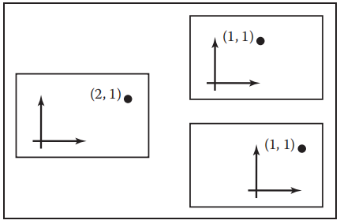

**图6.19 点 (2,1) 有一个变换“移动 (-1,0)” 作用于它。如果我们把这个变换看作是一种物理运动右上角是我们的想象中的图像，而如果我们把它看作是坐标的变化右下角是我们的想象中的图像（在这种情况下是原点的运动）**

​		例如，一款驾驶游戏可能包含一个城市模型和一个汽车模型。如果玩家看到的是挡风玻璃外的风景，汽车内的物体就会出现在屏幕上的相同位置，而街道和建筑则会随着玩家的驾驶而向后移动。在每一帧中，我们对这些物体应用一个变换，使它们比前一帧后退得更远。一种简单的理解方法是它将建筑向后移动，另一种思考方式是，建筑保持不变，但我们想要绘制它们的坐标系统——它们附在汽车上——在移动。在第二种解释中，变换是改变城市几何坐标，将它们表示为汽车坐标系中的坐标。这两种方法将导致矩阵应用到汽车外的几何获得完全相同的结果。

​		如果游戏还支持俯视视图来显示汽车在城市中的位置，那么建筑和街道就需要绘制在固定的位置上，而汽车则需要在坐标系中移动。同样的两种解释适用：我们可以把这种变化看作是把汽车从它的标准位置移动到它在世界上的当前位置，或者我们可以把这个变换看作是简单地改变汽车的几何坐标，它原本是用一个附加在汽车上的坐标系来表示的，而现在用一个相对于城市的固定坐标系来表示。坐标系变化解释清楚地表明，在这两种模式（城市到汽车的坐标变化和汽车到城市的坐标变化）中使用的矩阵是彼此相反的。

​		改变坐标系统的想法很像编程中的类型转换的想法。在将浮点数添加到整数之前，需要根据需要将整数转换为浮点数或将浮点数转换为整数，以便类型匹配。在我们把城市和汽车画在一起之前，我们需要根据我们的需要，把城市转换成汽车坐标，或者把汽车转换成城市坐标，这样坐标系统才能匹配。

​		当管理多个坐标系统时，很容易混淆，并最终在错误的坐标系统中使用对象，导致它们出现在意想不到的地方。但是通过系统地考虑坐标系之间的变换，你可以可靠地得到正确的变换。标准正交基是如此的方便，所以我们通常假设坐标系是标准正交的，除非另有规定。在原点 **p** 和基 {**u**, **v**, **w**} 的坐标系中，坐标 (u, v, w) 描述点
$$
\vec{p} + u\vec{u} + v\vec{v} + w\vec{w}
$$
*当然，在 2D 中，有两个基向量。*

​		当我们在计算机中存储这些向量时，它们需要用某个坐标系来表示。开始，我们必须指定一个规范的坐标系统，通常称为 “全局” 或 “世界” 坐标，用来描述所有其他系统。在城市示例中，我们可能会采用街道网格，并使用惯例，即 x 轴沿着主街指向，y 轴向上，z 轴沿着中央大道指向。然后，当我们用这些坐标写出车坐标系的原点和基底时，我们的意思就很清楚了。

​		在 2D 中，我们的惯例是用点 **o** 作为原点，用 **x** 和 **y** 作为右手标准正交基向量 **x** 和 **y**（图 6.20）。

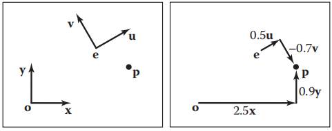

​																											**图6.20 点 p 可以用任一坐标系表示。**

另一个坐标系可能有一个原点 **e** 和右手正交基向量 **u** 和 **v**。注意，标准数据 **o**、**x** 和 **y** 通常不会显式存储。它们是所有其他坐标系的参照系。在那个坐标系中，我们经常把p的位置写成一个有序对，这是一个完整的向量表达式的简写：
$$
\vec{p} = (x_{p}, y_{p}) \equiv{} \vec{o} + x_{p}\vec{x} + y_{p}\vec{y}
$$
例如，在图 6.20 中，(x~p~, y~p~) = (2.5, 0.9)。注意， (x~p~, y~p~) 隐式地假定原点是 **o** 。同样，我们可以用另一个方程来表示 **p**：
$$
\vec{p} = (u_{p}, v_{p}) \equiv{} \vec{e} + u_{p}\vec{u} + v_{p}\vec{v}
$$
在图 6.20 中，有 (u~p~, v~p~) = (0.5，−0.7)。同样，原点 **e** 作为 **u** 和 **v** 坐标系的隐式部分。

​		我们可以用矩阵机制来表达同样的关系，像这样:
$$
\begin{bmatrix}x_{p} \\ y_{p} \\ 1\end{bmatrix} = 
\begin{bmatrix}1 & 0 & x_{e} \\ 0 & 1 & y_{e} \\ 0 & 0 & 1\end{bmatrix}
\begin{bmatrix}x_{u} & x_{v} & 0 \\ y_{u} & y_{v} & 0 \\ 0 & 0 & 1\end{bmatrix}
\begin{bmatrix}u_{p} \\ v_{p} \\ 1\end{bmatrix} = 
\begin{bmatrix}x_{u} & x_{v} & x_{e} \\ y_{u} & y_{v} & y_{e} \\ 0 & 0 & 1\end{bmatrix}
\begin{bmatrix}u_{p} \\ v_{p} \\ 1\end{bmatrix}
$$
注意，这假设我们有点 **e** 和向量 **u** 和 **v** 存储在标准坐标中，(x, y) 坐标系是等式中的第一个。根据我们在本章中讨论的基本类型的转换，这是一个旋转（涉及 **u** 和 **v**）然后是一个平移（涉及 **e**）。同时考虑旋转和平移的矩阵，你会发现很容易写出来：我们只是把 **u** **v** 和 **e** 放到矩阵的列中，通常是 [0,0 1] 在第三行。为了更清楚，我们可以这样写这样一个矩阵：
$$
\vec{p}_{xy} = \begin{bmatrix}\vec{u} & \vec{v} & \vec{e} \\ 0 & 0 & 1\end{bmatrix}\vec{p}_{uv}
$$
我们称这个矩阵为 (u, v) 坐标系的坐标系到标准（frame-to-canonical）矩阵。

*“坐标系到标准” 这个名字是基于将一个向量的坐标从一个坐标系改变到另一个坐标系的想法。考虑到移动的向量，坐标系到标准坐标系的矩阵将标准坐标系映射到 (u,v) 坐标系。*

​		反过来我们有：
$$
\begin{bmatrix}u_{p} \\ v_{p} \\ 1\end{bmatrix} = 
\begin{bmatrix}x_{u} & x_{v} & 0 \\ y_{u} & y_{v} & 0 \\ 0 & 0 & 1\end{bmatrix}
\begin{bmatrix}1 & 0 & -x_{e} \\ 0 & 1 & -y_{e} \\ 0 & 0 & 1\end{bmatrix}
\begin{bmatrix}x_{p} \\ y_{p} \\ 1\end{bmatrix}
$$
这是平移后接旋转，它们是我们用来构建坐标系到标准矩阵的旋转和平移的逆，当它们相乘时，就得到了坐标系到标准矩阵的逆，也就是（不足为奇的）标准到坐标系矩阵：
$$
\vec{p}_{uv} = \begin{bmatrix}\vec{u} & \vec{v} & \vec{e} \\ 0 & 0 & 1\end{bmatrix}^{-1}\vec{p}_{xy}
$$
正规坐标系矩阵取在正规坐标系中表示的点，并将它们转换为在 (u,v) 坐标系中表示的相同点。我们把这个矩阵写成坐标系到标准矩阵的逆矩阵因为它不能直接用 **e** **u** **v** 的标准坐标写出来。但是记住，所有的坐标系都是等价的，只有我们用 x 和 y 坐标来存储向量的惯例才造成了这种表面上的不对称。标准到坐标系的矩阵可以简单地表示为 **o**, **x**, **y** 的 (u, v) 坐标：
$$
\vec{p}_{uv} = \begin{bmatrix}\vec{x}_{uv} & \vec{y}_{uv} & \vec{o}_{uv} \\ 0 & 0 & 1\end{bmatrix}\vec{p}_{xy}
$$
​		所有这些想法在3D中都是非常相似的，我们有（式 6.8）
$$
\begin{align}
\begin{bmatrix}x_{p} \\ y_{p} \\ z_{p} \\ 1\end{bmatrix} &= 
\begin{bmatrix}1 & 0 & 0 & x_{e} \\ 0 & 1 & 0 & y_{e} \\ 0 & 0 & 1 & z_{e} \\ 0 & 0 & 0 & 1\end{bmatrix}
\begin{bmatrix}x_{u} & x_{v} & x_{w} & 0 \\ y_{u} & y_{v} & y_{w} & 0 \\ z_{u} & z_{v} & z_{w} & 0 \\ 0 & 0 & 0 & 1\end{bmatrix}
\begin{bmatrix}u_{p} \\ v_{p} \\ w_{p} \\ 1\end{bmatrix}
\\
\vec{p}_{xyz} &= \begin{bmatrix}\vec{u} & \vec{v} & \vec{w} & \vec{e} \\ 0 & 0 & 0 & 1\end{bmatrix}\vec{p}_{uvw}
\end{align}
\tag{6.8}
$$
以及（式 6.9）
$$
\begin{align}
\begin{bmatrix}u_{p} \\ v_{p} \\ w_{p} \\ 1\end{bmatrix} &= 
\begin{bmatrix}x_{u} & y_{u} & z_{u} & 0 \\ x_{v} & y_{v} & z_{v} & 0 \\ x_{w} & y_{w} & z_{w} & 0 \\ 0 & 0 & 0 & 1\end{bmatrix}
\begin{bmatrix}1 & 0 & 0 & -x_{e} \\ 0 & 1 & 0 & -y_{e} \\ 0 & 0 & 1 & -z_{e} \\ 0 & 0 & 0 & 1\end{bmatrix}
\begin{bmatrix}x_{p} \\ y_{p} \\ z_{p} \\ 1\end{bmatrix}
\\
\vec{p}_{uvw} &= \begin{bmatrix}\vec{u} & \vec{v} & \vec{w} & \vec{e} \\ 0 & 0 & 0 & 1\end{bmatrix}^{-1}\vec{p}_{xyz}
\end{align}
\tag{6.9}
$$

### 常见问答（Frequently Asked Questions）

- **我不能使用硬编码变换吗，而不是使用矩阵形式？**

可以，但在实践中，它更难派生，更难调试，而且不再那么有效。此外，所有当前的图形 API 都使用这种矩阵形式，所以即使使用图形库也必须理解它。

- **矩阵的底行总是 (0,0,0,1)。我需要储存它吗?**

您不必存储它，除非您包含透视图转换（第 7 章）。

### 备注（Notes）

推导法线的变换性质是基于《Properties of Surface Normal Transformations》（Turkowski, 1990）。在 20 世纪 90 年代中期的许多处理中，向量被表示为行向量并进行左乘，例如，**b** = **a**M。在我们的符号中，这是 **b**^T^ = **a**^T^M^T^。如果你想找到一个旋转矩阵 R 它包含一个向量 **a** 到相同长度的向量 **b**：**b** = R**a** 你可以用两个由标准正交基构成的旋转。《Effificiently Building a Matrix to Rotate One Vector to Another》(Akenine-Moller, Haines, & Hoffman, 2008）给出了一种更有效的方法。

### 练习（Exercises）

1. 写下移动 (x~m~, y~m~, z~m~) 的 4 × 4 的三维矩阵。

2. 写下绕 y 轴旋转一个角 θ 的 4 × 4 的三维矩阵。

3. 写下物体在所有方向缩放 50% 的 4 × 4 的三维矩阵。

4. 写出顺时针旋转 90 度的 2D 旋转矩阵。

5. 将练习 4 中的矩阵写成三个切变矩阵的乘积。

6. 求刚体变换的逆：
   $$
   \begin{bmatrix}R & \vec{t} \\ 0 \; 0 \; 0 & 1\end{bmatrix}
   $$
   其中 R 是一个 3 × 3 的旋转矩阵 t 是一个三维向量

7. 证明仿射变换矩阵的逆矩阵（除了右下角的一项外，下面一行都是零）也具有相同的形式。

8. 用文字描述这个二维变换矩阵的作用：
   $$
   \begin{bmatrix}0 & -1 & 1 \\ 1 & 0 & 1 \\ 0 & 0 & 1\end{bmatrix}
   $$

9. 写出 3×3 矩阵使一个 2D 点围绕一个点 p = (x~p~, y~p~) 旋转角度 θ。

10. 写出 4×4 旋转矩阵，其使正交三维向量 **u** = (x~u~, y~u~, z~u~)，**v** = (x~v~, y~v~, z~v~) 和 **w** = (x~w~, y~w~, z~w~) 变为正交三维向量 **a** = (x~a~, y~a~, z~a~)，**b** = (x~b~, y~b~, z~b~)  和 **c** = (x~c~, y~c~, z~c~) ,使得 M**u** = **a**，M**v** = **b**, M**w** = **c**。

11. 上一个问题的逆矩阵是什么?
