​		在前一章中，我们看到了如何使用矩阵变换作为工具来安排二维或三维空间中的几何物体。几何变换的第二个重要用途是在物体的 3D 位置和它们在 3D 世界的 2D 视图中的位置之间转换。这种从 3D 到 2D 的映射称为视图变换（viewing transformation），它在物体顺序绘制中扮演着重要的角色，在这个过程中我们需要快速找到场景中每个物体的图像空间位置。

​		当我们在第 4 章学习光线追踪时，我们讨论了不同类型的透视视图和正交视图，以及如何根据任意给定视图生成观察光线。本章讲述的是与此相反的过程。本章中的变换将场景（世界空间）中的 3D 点投射到图像（图像空间）中的 2D 点，它们将在给定像素的观察射线上投影任何点到该像素在图像空间中的位置。

​		如果您最近没有看过它，在阅读本章之前，建议您回顾一下第 4 章中关于透视和光线生成的讨论。

​		就其本身而言，将点从世界投射到图像的能力只适用于制作线框图（wireframe）渲染——仅绘制物体边缘的效果图，较近的表面不遮挡较远的表面（图 7.1）。就像光线追踪器需要沿着每条观察光线找到最近的表面交点一样，显示固体外观物体的物体顺序渲染器必须计算出在屏幕上任意给定点绘制的（可能有许多）表面中，哪一个最接近，并只显示那一个。在本章中，我们假设我们正在绘制一个模型，它只包含由两个端点的 (x, y, z) 坐标指定的 3D 线段。后面的章节将讨论产生实体表面渲染所需的机制。

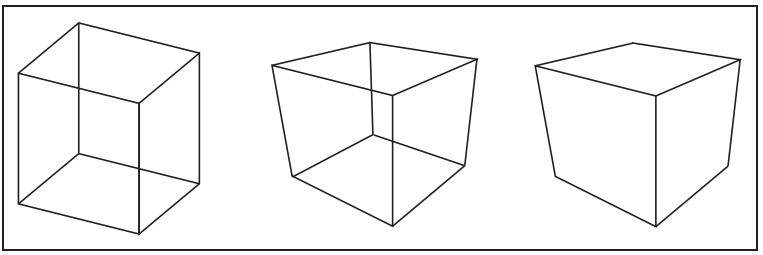

​												**图7.1 左：正交投影的线框立方体。	中：透视投影的线框立方体。	右：移除被遮挡的线的透视投影**

### 7.1 视图矩阵（Viewing Transformations）

​		视图变换的任务是将在标准坐标系中表示为 (x, y, z) 坐标三维位置，映射到图像中以像素单位表示的坐标。它是一个复杂的东西，取决于许多不同的东西，包括相机的位置和方向，投影的类型，视野范围，和图像的分辨率。对于所有复杂的转换，最好将其分解为几个更简单的变换的乘积。大多数图形系统通过使用三个变换序列来实现这一点：

- 一个相机变换（camera transformation）或眼变换（eye transformation），它是一种刚体变换，其将摄像机置于原点，使其处于一个方便的方向。它只取决于相机的位置和方向或姿势。
- 一个投影变换（projection transformation），它从相机空间投射点，使所有可见点在 x 和 y 的范围内为 −1 到 1。它只取决于所需的投影类型。
- 一个视口变换（viewport transformation）或者窗口变换（windowing transformation），它将单元图像矩形映射到所需的像素坐标矩形。它只取决于输出图像的大小和位置。

*一些 API使用 “视图变换” 来实现我们的视图变换的一部分，我们称之为相机变换。*

为了便于描述过程的各个阶段（图 7.2），我们为作为这些变换的输入和输出的坐标系统命名。相机变换将标准坐标（或世界空间）中的点转换为相机坐标（camera coordinates）或将它们放置在相机空间（camera space）中。投影变换将点从相机空间移动到标准视图体（canonical view volume）中。最后，视口变换将标准视图体映射到屏幕空间（screen space）。

*其他命名：相机空间也叫 “眼空间（eye space）”，相机变换有时叫 “视图变换（viewing  transformation）“，标准视图体也叫 “裁剪空间（clip space）” 或 “标准化的设备坐标（normalized device coordinates）”，屏幕空间也叫 “像素空间（pixel coordinates）”。*

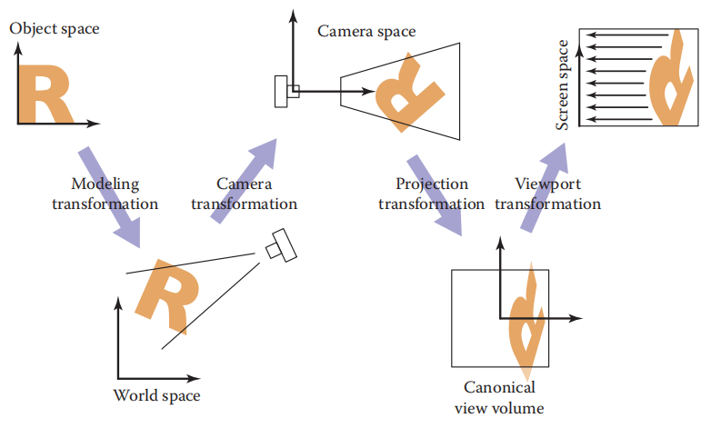

​																			**图7.2 将物体从原始坐标转换到屏幕空间的各个空间和转换序列**

​		每一个转换都是非常简单的。我们将从视口变换开始详细讨论正交投影的情况，然后讨论支持透视投影所需的更改。

#### 7.1.1 视口变换（The Viewport Transformation）

​		我们从这个问题开始，它的解决方案将被重用为任何视图变换条件。我们假设我们想要查看的几何图形是在标准视图体中，并且我们希望用正交相机在 −z 方向上查看它。标准视图体是包含所有笛卡尔坐标在 −1 和 +1 之间的三维点的立方体，即 (x, y, z) ∈ [−1,1]^3^ （图 7.3）。我们将 x =−1 投影到屏幕的左侧，x = +1 投影到屏幕的右侧，y = −1 投影到屏幕的底部，y = +1 投影到屏幕的顶部。

*“标准” 这个词又出现了——它的意味着为了方便而武断的选择的东西。例如，单位圆可以被称为 “标准圆”*

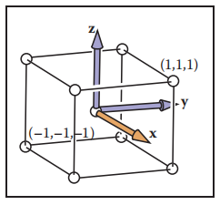

​																					**图7.3 标准视图体是一个边长为 2 的立方体，其中心位于原点。**

​		回想一下第三章中关于像素坐标的约定：每个像素 “拥有” 一个以整数坐标为中心的单位正方形，图像边界从像素中心有一半的距离，最小的像素中心坐标为(0, 0)。如果我们正在绘制一个具有 n~x~ × n~y~ 像素的图像（或屏幕上的窗口），我们需要将正方形 [−1,1]^2^ 映射到矩形 [−0.5,n~x~−0.5] × [−0.5,n~y~−0.5]。

*将一个正方形映射到一个潜在的非正方形矩形不是问题，x 和 y 只是从标准坐标到像素坐标有不同的比例因子。*

​		现在，我们将假设所有要绘制的线段都完全在标准视图体内。稍后我们将在讨论裁剪（clipping）时放松这个假设。

​		由于视口变换将一个轴对齐的矩形映射到另一个，这是一个由公式（6.6）给出的窗口变换的情况：（式 7.1）
$$
\begin{bmatrix}x_{screen} \\ y_{screen} \\ 1\end{bmatrix} = 
\begin{bmatrix}\frac{n_{x}}{2} & 0 & \frac{n_{x}-1}{2} \\ 0 & \frac{n_{y}}{2} & \frac{n_{y}-1}{2} \\ 0 & 0 & 1\end{bmatrix}
\begin{bmatrix}x_{canonical} \\ y_{canonical} \\ 1\end{bmatrix}
\tag{7.1}
$$
注意，这个矩阵忽略了标准视图体中点的 z 坐标，因为点在投影方向上的距离不会影响该点在图像中的投影位置。但是在我们正式称它为视口矩阵之前，我们添加一行和一列来沿着 z 坐标移动而不改变它。在本章中我们不需要它，但最终我们将需要 z 值，因为它们可以用来使更近的表面隐藏更远的表面（参见 8.2.3 节）。（式 7.2）
$$
M_{vp} = 
\begin{bmatrix}
\frac{n_{x}}{2} & 0 & 0 & \frac{n_{x}-1}{2} \\ 
0 & \frac{n_{y}}{2} & 0 & \frac{n_{y}-1}{2} \\ 
0 & 0 & 1 & 0 \\
0 & 0 & 0 & 1
\end{bmatrix}
\tag{7.2}
$$

#### 7.1.2 正交投影变换（The Orthographic Projection Transformation）

​		当然，我们通常希望在空间的某些区域渲染几何体，而不是在标准视图体内。我们泛化视图的第一步将保持观察方向，其朝向固定沿着 −z，+y 向上，但将允许任意矩形被观察。我们不会替换视口矩阵，而是将其与右边的另一个矩阵相乘来增加该作用。

​		在这些约束下，视图体是一个轴对齐的盒子，我们将其边的坐标命名，让该视图体表示为 [l, r] × [b, t] × [f,n]，如图 7.4 所示。我们称这个盒子为正交视图体，并参照如下的边界平面：
$$
\begin{align}
x &= l \equiv{} left \;\; plane	\\
x &= r \equiv{} right \;\; plane	\\
y &= b \equiv{} bottom \;\; plane	\\
y &= t \equiv{} top \;\; plane	\\
z &= b \equiv{} near \;\; plane	\\
z &= f \equiv{} far \;\; plane
\end{align}
$$
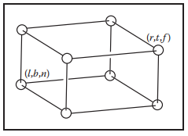

​								  																						**图7.4 正交视图体**

这个描述假设一个观察者沿着负 z 轴看，他的头指向 y 方向（大多数程序员发现 x 轴指向右，y 轴指向上是很直观的。在右手坐标系中，这意味着我们在看 −z 方向。一些系统使用左手坐标系来观察，因此凝视方向是沿着 +z。哪个是最好的是一个感觉问题，这篇文章假设一个右手坐标系。在本章末尾的备注中给出了一个证明左手系的参考文献）。这意味着 n > f，这可能不是直观的，但如果你假设整个正交视图体有负的 z 值，那么当且仅当 n>f 时，z = n “近”平面更接近观察者，这里f是一个比  n小的数，也就是绝对值比 n 大的负数。

​		这个概念如图 7.5 所示。从正交视图体到标准视图体的变换是另一个窗口变换，因此我们可以简单地将正交视图体和标准视图体的边界代入式（6.7），得到该变换的矩阵：（式 7.3）
$$
M_{orth} =
\begin{bmatrix}
\frac{2}{r-l} & 0 & 0 & -\frac{r+l}{r-l} \\ 
0 & \frac{2}{t-b} & 0 & -\frac{t+b}{t-b} \\ 
0 & 0 & \frac{2}{n-f} & -\frac{n+f}{n-f} \\
0 & 0 & 0 & 1
\end{bmatrix}
\tag{7.3}
$$
*这个矩阵非常接近 OpenGL 中传统使用的那个，除了 n, f 和 z~canonical~ 都有相反的符号。*

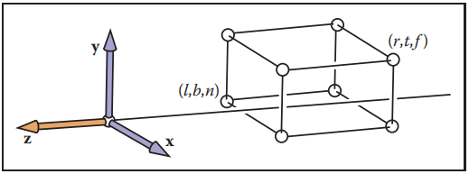

​																						**图7.5 正交视图体沿负 z 轴，因此 f 比 n 更负，所以 n > f**

​		为了在正交投影视图体中绘制 3D 线段，我们将它们投影到屏幕的 x 和 y 坐标中，而忽略 z 坐标。我们结合方程（7.2）和（7.3）来做这件事。 注意，在一个程序中，我们将两个矩阵相乘形成一个矩阵，然后按如下方法去操作点：
$$
\begin{bmatrix}x_{pixel} \\ y_{pixel} \\ z_{canonical} \\ 1\end{bmatrix} = 
(M_{vp}M_{orth})\begin{bmatrix}x \\ y \\ z \\ 1\end{bmatrix}
$$
z 坐标现在将是 [−1,1]。我们现在没有利用它，但是当我们研究 z 缓冲区算法时，它会很有用。

​		因此，用 a~i~ 和 b~i~ 绘制许多三维线的代码变得既简单又高效：

```c++
construct Mvp
construct Morth
M = Mvp Morth
for each line segment (vecAi, vecBi) do
	vecP = M vecAi
	vecQ = M vecBi
	drawline(xp,yp,xq,yq)
```

*这是矩阵变换机制如何使图形程序干净和高效的第一个例子。*

#### 7.1.3 相机变换（The Camera Transformation）

​		我们希望能够在 3D 中改变视点并朝任何方向看。有许多约定来指定观察者的位置和方向。我们将使用下面的方法（参见图 7.6）：

- 眼睛位置 **e**。
- 凝视方向 **g**。
- 视图上方向向量 **t**。

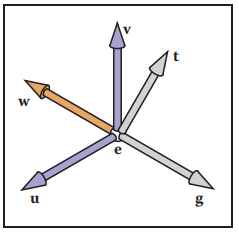

​				**图7.6 用户指定视图为眼睛位置 e、注视方向 g 和向上向量 t。我们构造一个右手基，其中 w 指向注视的相反方向，v 与 g 和 t 在同一平面上**

眼睛的位置是眼睛 “从哪里看” 的位置。如果你把图形看作摄影的过程，它就是镜头的中心。凝视方向是观察者注视方向上的任何向量。视图上向量是平面上的任意将观察者的头部分成左右两半，并且对于站在地面上的人来说指向 “天空” 向量。这些向量为我们提供了足够的信息来建立一个以 **e** 为原点以 **uvw** 为基的坐标系，使用第2.4.7节的构造：
$$
\begin{align}
\vec{w} &= \frac{\vec{g}}{||\vec{g}||} \\
\vec{u} &= \frac{\vec{t} \cross{} \vec{w}}{||\vec{t} \cross{} \vec{w}||} \\
\vec{v} &= \vec{w} \cross{} \vec{u}
\end{align}
$$
​		如果我们希望变换的所有点都存储在原点 **e** 和基向量 **u**、**v**、**w** 的坐标中，那么我们的工作就完成了。但是如图 7.7 所示，模型的坐标存储在标准（或世界）原点 **o** 和 **x**、**y**、**z** 轴上。为了使用我们已经开发的机制，我们只需要转换线段端点的坐标，我们希望从 **xyz** 坐标到 **uvw** 坐标。这种变换在第 6.5 节中讨论过，执行这种变换的矩阵是相机坐标系的 cononical-to-basis 矩阵：（式 7.4）
$$
M_{cam} = \begin{bmatrix}\vec{u} & \vec{v} & \vec{w} & \vec{e} \\ 0 & 0 & 0 & 1 \end{bmatrix}^{-1} = 
\begin{bmatrix}x_{u} & y_{u} & z_{u} & 0 \\ x_{v} & y_{v} & z_{v} & 0 \\ x_{w} & y_{w} & z_{w} & 0 \\ 0 & 0 & 0 & 1\end{bmatrix}
\begin{bmatrix}0 & 0 & 0 & -x_{e} \\ 0 & 0 & 0 & -y_{e} \\ 0 & 0 & 0 & -z_{e}\\ 0 & 0 & 0 & 1\end{bmatrix}
\tag{7.4}
$$
或者，我们可以把这个相同的变换看成是首先将 **e** 移动到原点，然后对齐 **u v w** 到 **x y z**。

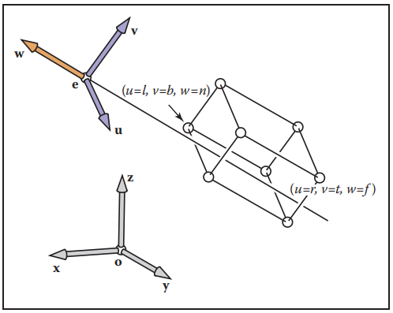

​							**图7.7 对于任意视图变换，我们需要更改存储在 “适当的” 坐标系统中的点。在这里，它有原点 e 和以 uvw 表示的偏移坐标**

​		为了使我们之前的 z-axis-only 视图算法为任何位置和朝向的相机工作，我们只需要在视口和投影变换的结果中添加相机变换，这样它将传入的点在投影之前从世界转换到相机坐标：

```c++
construct Mvp
construct Morth
construct Mcam
M = Mvp Morth Mcam
for each line segment (vecAi, vecBi) do
	vecP = M vecAi
	vecQ = M vecBi
	drawline(xp,yp,xq,yq)
```

同样，一旦矩阵基础结构就位，几乎不再需要任何代码。

### 7.2 投影变换（Projective Transformations）

​		我们把透视法留到最后，因为它需要一点机灵才能使它适应到现在为止已经很好地为我们服务向量和矩阵变换的系统。为了了解我们需要做什么，让我们看看透视投影变换需要对相机空间中的点做什么。回想视点位于原点，相机沿 z 轴观察。

*为了使方程更简单，我们暂时忽略 z 的符号号，但它会在第 7.3 节返回。*

​		透视的关键属性是，对于在原点的眼睛看向负 z 轴，屏幕上物体的大小与 1/z 成比例。这可以用图 7.8 中的几何方程更精确地表达出来：（式 7.5）
$$
y_{s} = \frac{d}{z}y \\
\tag{7.5}
$$
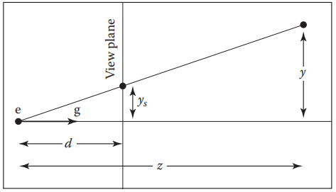

**图7.8 （7.5）式的几何图。观察者的眼睛在 e，注视方向是 g（-z 轴）。观察平面到眼睛的距离为 d。一个点被投影到 e，它与观察平面相交的地方就是它被画的地方。**

其中 y 是点在 y 轴上的距离，y~s~ 是点应该画在屏幕上的位置。

​		若我们真的很想使用我们为正交投影开发的矩阵机制来绘制透视图像，我们可以把另一个矩阵乘到复合矩阵中，就可以使用我们已经拥有的算法。然而，这种其中一个输入向量的坐标出现在分母上类型的变换，不能使用仿射变换来实现。

​		我们可以用齐次坐标机制的一个简单的推广来进行除法，我们已经在仿射变换中使用过了。我们已经同意用齐次向量来表示点 (x, y, z) 为 [x y z 1]^T^，额外的坐标 w 总是等于 1，这是通过总是使用 [0 0 0 1]^T^ 作为一个仿射变换矩阵的第四行来保证的。

​		而不是仅仅把 1 看作是强加矩阵乘法来实现平移的额外部分，我们现在定义它为 x、y 和 z 坐标的分母：齐次向量 [x y z w]^T^ 表示点 (x/w, y/w, z/w)。当 w = 1时，这没有什么区别，但如果我们允许在变换矩阵的底部行中有任何值，则允许实现更广泛的转换，从而使 w 得到除 1 以外的值。具体地说，线性变换允许我们像这样计算表达式：
$$
x' = ax + by + cz
$$
仿射变换将它扩展到
$$
x' = ax + by + cz + d
$$
将w作为分母进一步扩展了可能性，允许我们像这样计算：
$$
x' = \frac{ax + by + cz + d}{ex + fy + gz + h}
$$
这可以称为 x, y, z 的 “线性有理函数”。但还有一个额外的限制——对于变换点的所有坐标，他的分母是相同的：
$$
x' = \frac{a_{1}x + b_{1}y + c_{1}z + d_{1}}{ex + fy + gz + h} \\
y' = \frac{a_{2}x + b_{2}y + c_{2}z + d_{2}}{ex + fy + gz + h} \\ 
z' = \frac{a_{3}x + b_{3}y + c_{3}z + d_{3}}{ex + fy + gz + h}
$$
表示为矩阵变换，
$$
\begin{bmatrix}\tilde{x} \\ \tilde{y} \\ \tilde{z} \\ \tilde{w}\end{bmatrix}
=
\begin{bmatrix}
a_{1} & b_{1} & c_{1} & d_{1} \\ a_{2} & b_{2} & c_{2} & d_{2} \\ 
a_{3} & b_{3} & c_{3} & d_{3} \\ e & f & g & h
\end{bmatrix}
\begin{bmatrix}x \\ y \\ z \\ 1\end{bmatrix}
$$
和
$$
(x',y',z') = (\frac{\tilde{x}}{\tilde{w}},\frac{\tilde{y}}{\tilde{w}},\frac{\tilde{z}}{\tilde{w}})
$$
这样的变换被称为投影变换（projective transformation）或单应（homography）。

**实例** 矩阵
$$
M = \begin{bmatrix}2 & 0 & -1 \\ 0 & 3 & 0 \\ 0 & \frac{2}{3} & \frac{1}{3}\end{bmatrix}
$$
表示对单位正方形（[0,1] × [0,1]）进行二维投影变换到图 7.9 所示的四边形。

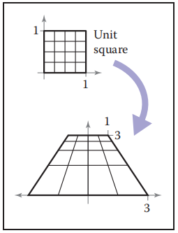

​																**图7.9 一个将一个正方形映射到一个四边形的投影变换，保留直线而不是平行线。**

​		例如，在 (1,0) 处的正方形右下角用齐次向量 [1 0 1]^T^ 表示，变换如下：
$$
\begin{bmatrix}2 & 0 & -1 \\ 0 & 3 & 0 \\ 0 & \frac{2}{3} & \frac{1}{3}\end{bmatrix}
\begin{bmatrix}1 \\ 0 \\ 1\end{bmatrix} = 
\begin{bmatrix}1 \\ 0 \\ \frac{1}{3}\end{bmatrix}
$$
其代表点 (1/(1/3), 0/(1/3))，或者 (3, 0)。注意若我们使用矩阵
$$
3M = \begin{bmatrix}6 & 0 & -3 \\ 0 & 9 & 0 \\ 0 & 2 & 1\end{bmatrix}
$$
替换，结果是 [3 0 1]^T^，也代表 (3, 0)。事实上，任何标量乘积 cM 都是等价的：分子和分母都是 c 的倍数，这不会改变结果。

​		有一种更优雅的方式来表达相同的想法，它避免了特别处理 w 坐标。在这个观点中，一个 3D 投影变换仅仅是一个 4D 线性变换，其额外的规定是一个向量的所有标量倍数指向同一个点
$$
\vec{x} \sim{} \alpha{}\vec{x} \qquad{} for \; all \; \alpha{} \ne{} 0
$$
符号 ~ 被理解为 “等价于”，意思是两个齐次向量都描述了空间中的同一点。

**实例** 在一维齐次坐标中，我们使用二维向量来表示实线上的点，我们可以用齐次向量 [1.5 1]^T^ 来表示点 (1.5)，或者齐次空间中 x = 1.5h 线上的任何其他点。（参见图 7.10）

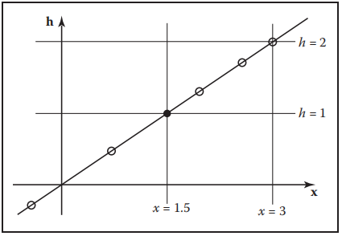

**图7.10 点 x = 1.5 可以用直线 x = 1.5h 上的任意点表示，比如空心圆上的点。然而，在我们将 x 解释为一个常规的笛卡尔坐标之前，我们首先除以 h，得到 (x, h) =(1.5, 1)，如黑点所示。**

​		在二维齐次坐标中，我们用 3 个向量来表示平面上的点，我们可以用齐次向量 [−2 −1 2]^T^ 或 **x** = α[−1 −0.5  1]^T^ 线上任何其他点来表示 (-1, -0.5)。直线上的任意齐次向量都可以映射到直线与平面 w = 1 的交点，从而得到直线的笛卡尔坐标。（参见图 7.11）

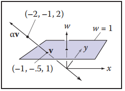

​						**图7.11 齐次坐标中的一个点等价于通过它和原点的直线上的任何其他点，对这个点进行归一化，等于这条直线与平面 w = 1 相交**

齐次向量的次数只要需要可以变换任意次，而不用考虑 w 坐标的值——事实上，如果 w 坐标在某个中间阶段为零，那是没问题的。只有当我们想要一个点的普通笛卡尔坐标时，我们才需要将其归一化为 w = 1 的等值点，这相当于将所有坐标除以 w。一旦我们这样做了，我们就可以从齐次向量的前三个分量中读出 (x, y, z) 坐标。

### 7.3 透视投影（Perspective Projection）

​		投影变换的机制使实现透视所需的 z 除法变得简单。在图 7.8 所示的 2D 例子中，我们可以通过矩阵变换实现透视投影，如下所示：
$$
\begin{bmatrix}y_{s} \\ 1\end{bmatrix} \sim{} 
\begin{bmatrix}d & 0 & 0 \\ 0 & 1 & 0\end{bmatrix}\begin{bmatrix}y \\ z \\ 1\end{bmatrix}
$$
这个将二维齐次向量 [y z 1]^T^ 变换到一维齐次矢量 [dy z]^T^，它表示一维点 (dy/z)（因为它等价于一维齐次矢量 [dy/z 1]^T^）。这和式（7.5）相符。

​		对于3D中的 “官方” 透视投影矩阵，我们将采用我们通常的惯例，即原点的摄像机面向 -z 方向，因此点 (x, y, z) 的距离为 -z。与正交投影一样，我们也采用近平面和远平面的概念，这限制了可见距离的范围。在这种情况下，我们将使用近平面作为投影平面，因此像平面距离为 −n。

*记住 n < 0*

​		所需的映射是 y~s~ = (n/z)y，对于 x 也是如此。这个转换可以通过透视矩阵来实现：
$$
P = 
\begin{bmatrix}
n & 0 & 0 & 0 \\ 0 & n & 0 & 0 \\ 0 & 0 & n+f & -fn \\ 0 & 0 & 1 & 0
\end{bmatrix}
$$
第一行、第二行和第四行只是实现透视方程。第三行，就像在正交和视口矩阵中一样，被设计为带着 z 坐标，以便我们以后可以使用它来移除隐藏的表面。但是在透视投影中，加上一个非常量的分母使得我们不能保持 z 的值——实际上不可能在 x 和 y 发生我们想要的变化的同时保持 z 不变化。相反，我们选择对近平面和远平面上的点保持 z 不变。

*稍后详细描述*

​		有许多矩阵可以作为透视矩阵，它们都是非线性扭曲 z 坐标的。这个特定的矩阵具有如图 7.12 和 7.13 所示的良好属性，它让 (z = n) 平面上的点完全独立，也让 (z = f) 平面上的点在 x 和 y 中以适当的数量 “挤压” 它们。矩阵对点 (x, y, z) 的影响是
$$
P\begin{bmatrix}x \\ y \\ z \\ 1\end{bmatrix} = 
\begin{bmatrix}nx \\ ny \\ (n+f)z-fn \\ z\end{bmatrix} \sim{}
\begin{bmatrix}\frac{nx}{z} \\ \frac{ny}{z} \\ (n+f)-\frac{fn}{z} \\ 1\end{bmatrix}
$$
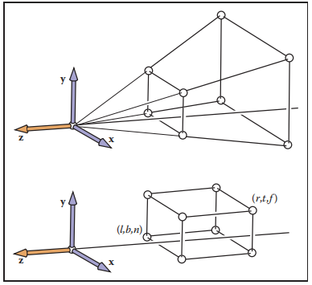

​											**图7.12 透视投影保持 z=n 平面上的点不变，并将透视体后面的 z=f 大矩形映射到正交体后面的 z=f 小矩形。**

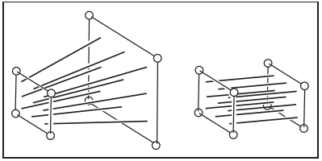

​											**图7.13 透视投影将通过原点/眼睛的任何直线映射到一条平行于 z 轴的直线上，并且不移动直线上 z=n 处的点。**

如你所见，x 和 y 被缩放，更重要的是，其除以z。因为 n 和 z(在观察体内）都是负的，所以在 x 和 y 中没有 “翻转”。然这并不明显（参见本章末尾的练习），但转换也保留了 z 值在 z = n 和 z = f 之间的相对顺序，允许我们在应用这个矩阵后进行深度排序。这在我们以后做隐面消除时很重要。

​		有时我们想求 P 的逆，例如，把屏幕坐标加 z 带回到原来的空间，就像我们挑选时想做的那样。它的逆为
$$
P^{-1} = 
\begin{bmatrix}
\frac{1}{n} & 0 & 0 & 0 \\ 0 & \frac{1}{n} & 0 & 0 \\ 
0 & 0 & 0 & 1 \\ 0 & 0 & -\frac{1}{fn} & \frac{n+f}{fn}
\end{bmatrix}
$$
由于齐次向量乘以标量不会改变它的意义，所以对齐次向量作用的矩阵也是如此。所以我们可以通过乘以 nf 把逆矩阵写成更漂亮的形式：
$$
P^{-1} = 
\begin{bmatrix}
f & 0 & 0 & 0 \\ 0 & f & 0 & 0 \\ 
0 & 0 & 0 & fn \\ 0 & 0 & -1 & n+f
\end{bmatrix}
$$
*这个矩阵不是矩阵 P 的逆矩阵，但是它描述的变换是由 P 描述的变换的逆。*

​		在公式（7.3）中的正交投影矩阵 M~orth~ 的背景下，透视矩阵简单地将透视观察体（形状像金字塔的切片或截锥）映射到正交观察体（这是一个轴对齐的盒子）。透视矩阵的美妙之处在于，一旦我们应用它，我们可以使用一个正交变换来得到标准观察体。因此，所有的正交机制都适用，我们所添加的只是一个矩阵和除以 w。令人鼓舞的是，我们并非 “浪费” 4 × 4 矩阵的最下面一行！

​		将 P 与 M~orth~ 连接就得到了透视投影矩阵，
$$
M_{per} = M_{orth}P
$$
​		然而，有一个问题是：对于透视投影 l,r,b,t 是如何确定的?它们确定了我们观察的 “窗口”。由于透视矩阵不改变 (z = n) 平面上 x 和 y 的值，我们可以指定 (l, r, b, t) 在该平面上。

​		为了将透视矩阵集成到我们的正交基础设施中，我们简单地用 M~per~ 替换 M~orth~，它在相机矩阵 M~cam~ 应用之后但在正交投影之前插入透视矩阵 P。所以透视视图的全部矩阵集合是
$$
M = M_{vp}M_{orth}PM_{cam}
$$
​		得到的算法为：

```c++
compute Mvp
compute Mper
compute Mcam
M = MvpMperMcam
for each line segment(vecAi,vecBi) do
	vecP = MvecAi
	vecQ = MvecBi
	drawline(xp/wp,yp/wp,xq/wq,yq/wq)
```

注意，除了附加矩阵之外，唯一的变化是除以齐次坐标 w。

​		乘出来，M~per~ 矩阵看起来像这样:
$$
M_{per} = 
\begin{bmatrix}
\frac{2n}{r-l} & 0 & \frac{l+r}{l-r} & 0 \\ 0 & \frac{2n}{t-b} & \frac{b+t}{b-t} & 0 \\
0 & 0 & \frac{f+n}{n-f} & \frac{2fn}{f-n} \\ 0 & 0 & 1 & 0
\end{bmatrix}
$$
这种或类似的矩阵经常出现在文档中，当人们意识到它们通常是几个简单矩阵的乘积时，它们就不那么神秘了.

**实例** 许多 API，如 OpenGL（Shreiner, Neider, Woo, & Davis, 2004）使用这里展示的相同标准观察体。他们还通常让用户指定 n 和 f 的绝对值。OpenGL 的投影矩阵是
$$
M_{OpenGL} =
\begin{bmatrix}
\frac{2|n|}{r-l} & 0 & \frac{l+r}{l-r} & 0 \\ 0 & \frac{2|n|}{t-b} & \frac{b+t}{b-t} & 0 \\
0 & 0 & \frac{|f|+|n|}{|n|-|f|} & \frac{2|f||n|}{|f|-|n|} \\ 0 & 0 & -1 & 0
\end{bmatrix}
$$
其他 API 分别将 n 和 f 发送给 0 和 1。Blinn（J. Blinn, 1996）建议将标准观察体为 [0,1]^3^ 以提高效率。所有这些决定都会稍微改变投影矩阵。

### 7.4 投影变换的一些属性（Some Properties of the Perspective Transform）

​		透视变换的一个重要特性是它将直线转换为直线，将平面转换为平面。此外，它将观察体中的线段转换为标准体中的线段。要了解这一点，考虑线段
$$
\vec{q} + t(Q - \vec{q})
$$
经 4×4 矩阵 M 变换后，其为齐次坐标可能发生变化的点：
$$
M\vec{q} + t(MQ - M\vec{q}) \equiv{} \vec{r} + t(R - \vec{r})
$$
均匀化的三维线段为
$$
\frac{\vec{r} + t(R - \vec{r})}{w_{r} + t(w_{R} - w_{r})}
\tag{7.6}
$$
若式（7.6）能被重写为这样形式
$$
\frac{\vec{r}}{w_{r}} + f(t)(\frac{R}{w_{R}} - \frac{\vec{r}}{w_{r}})
\tag{7.7}
$$
那么所有均匀化的点都在一条 3D 直线上。对式（7.6）的蛮力操作产生这样的形式
$$
f(t) = \frac{w_{R}t}{w_{r} + t(w_{R} - w_{r})}
\tag{7.8}
$$
它还证明线段的映射过去的线段保留上面点的顺序（练习 8），也就是说，它们不会被重新排序或 “撕裂”。

​		将线段转换为线段的一个副产品是它将一个三角形的边和顶点转换为另一个三角形的边和顶点。因此，它让三角形对三角形，平面对平面。

### 7.5 视野（Field-of-View）

​		虽然我们可以使用 (l, r, b, t) 和 n 值指定任何窗口，但有时我们希望有一个更简单的坐标系使我们能透过窗口的中心。这意味着约束
$$
l = -r \\
b = -t
$$
如果再加上像素为正方形的约束，即图像中没有形状变形，则 r 与 t 的比值必须等于水平像素数与垂直像素数的比值：
$$
\frac{n_{x}}{n_{y}} = \frac{r}{t}
$$
一旦指定了 n~x~ 和 n~y~，就只剩下一个自由度。这通常使用图 7.14 所示的 θ 的 FOV（field-of-view）来设置。这有时被称为垂直 FOV，以区分左右两边的角度或对角线之间的角度。从图中我们可以看出
$$
\tan{\frac{\theta{}}{2}} = \frac{t}{|n|}
$$
如果 n 和 θ 是指定的，那么我们可以推导出 t，并对更一般的视图坐标系使用代码。在某些坐标系中，n 的值被硬编码成某个合理的值，因此我们少了一个自由度。

### 常见问答（Frequently Asked Questions）

- **正交投影在实践中有用吗？**

它在相对长度判断很重要的应用中很有用。在某些医疗可视化应用程序中透视图过于昂贵的情况下，它还可以用来简化。

- **我在透视中画的棋盘花纹的球体看起来像椭圆形。这是 bug 吗？**

不。这是正确的现象。如果你将眼睛放在与屏幕的相对位置上，就像虚拟观察者与视口的相对位置一样，那么这些椭圆形就会看起来像圆圈，因为它们本身是以一个角度被观看的。

- **透视矩阵是否以相反的顺序取负 z 值到正 z 值？那不会引起麻烦吗？**

是的。变换后的 z 方程是
$$
z' = n + f - \frac{fn}{z}
$$
因此 z = +ε 被转化为 z’ = −∞，z = −ε 被转化为 z = ∞。因此，任何长度为 z = 0 的线段都将被 “撕裂”，尽管所有的点都将被投影到合适的屏幕位置。当所有的物体都包含在观察体中时，这种撕裂就无关紧要了。这通常通过剪切到观察体来保证。然而，正如第 8 章所讨论的，撕裂现象使剪切本身变得更加复杂。

- **透视矩阵改变了齐次坐标的值。这难道不会使移动和缩放变换不再正常工作吗？**

对齐次点进行平移，我们有
$$
\begin{bmatrix}1 & 0 & 0 & t_{x} \\ 0 & 1 & 0 & t_{y} \\ 0 & 0 & 0 & t_{z} \\ 0 & 0 & 0 & 1\end{bmatrix}
\begin{bmatrix}hx \\ hy \\ hz \\ h\end{bmatrix} = 
\begin{bmatrix}hx + ht_{x} \\ hy + ht_{y} \\ hz + ht_{z} \\ h\end{bmatrix}
\underrightarrow{homogenize} \begin{bmatrix}x + t_{x} \\ y + t_{y} \\ z + t_{z} \\ 1\end{bmatrix}
$$
类似的效果也适用于其他转换（参见练习 5）。

### 备注（Notes）

多数关于视图矩阵的讨论是基于《Real-Time Rendering》（Akenine-Moller 等人，2008），《OpenGL Programming Guide》（Shreiner 等人, 2004），《Computer Graphics》（Hearn & Baker, 1986）以及《3D Game Engine Design》（Eberly, 2000）中的信息。

### 练习（Exercises）

1. 构造一个坐标系所需的视口矩阵，其中像素坐标从图像的顶部向下计数，而不是从底部向上计数。
2. 将视口和正交投影矩阵相乘，并表明结果也可以通过方程（6.7）的单一应用得到。
3. 由近平面和远平面上的点保持 z 值的约束条件获得式（7.3）的第三行。
4. 用代数方法证明透视矩阵保持了观察体内 z 值的顺序。
5. 对于任意顶部三行，底部一行为 (0,0,0,1) 的 4×4 矩阵，证明 (x, y, z, 1) 和 (hx, hy, hz, h) 经过均匀化后变换为同一点。
6. 验证文中给出的 M^−1^~p~ 的形式是正确的。
7. 证明完整的透视标准矩阵 M~projection~ 将 (r, t, n)变换为 (1,1,1)。
8. 写出 n = 1，f = 2的透视矩阵。
9. 对于点 **p** = (x, y, z, 1)，在练习 6 中透视矩阵变换后的点的均匀化和非均匀化结果是什么？
10. 对于眼睛位置 **e** = (0, 1, 0)，注视向量 **g** = (0, −1, 0)，以及观察上向量 **t** = (1, 1, 0)，得到的用于坐标旋转的标准正交 **uvw** 基是什么？
11. 证明，对于透视变换，在观察体中开始的线段在均匀化后会映射到标准体中的线段。进一步证明两线段上点的相对排序是相同的。提示：证明式（7.8）中的 f(t) 具有 f(0) = 0, f(1) = 1 的性质，对于所有 t∈[0,1] f 的导数都是正的，齐次坐标不改变符号。

