​		前几章已经建立了数学框架，我们需要看看渲染的第二种主要方法：将物体一个一个地绘制到屏幕上，或按物体顺序渲染。不像在光线追踪中，我们依次考虑每个像素并找到影响其颜色的物体，我们现在将依次考虑每个几何物体并找到它可能产生影响的像素。找到图像中所有被几何基元占用的像素的过程称为光栅化（rasterization），因此物体顺序渲染也可以称为光栅化渲染。从物体开始，以更新图像中的像素结束的操作序列称为图形管线（graphics pipeline）。  

*任何图形系统都有一个或多个可以直接处理的 “原始物体” 类型，更复杂的物体被转换成这些 “原始物体”。三角形是最常用的原始图形。*

*基于光栅化的系统也称为扫描线渲染器（scanline renderer）*

​		物体顺序渲染由于其效率而获得了巨大的成功。对于大型场景，数据访问模式的管理对性能至关重要，与重复搜索场景以获取着色每个像素所需的物体相比，在场景中访问每一个几何图形一次具有显著的优势。

​		本章的标题表明，只有一种方法可以进行物体顺序渲染。这当然不是真的——有两个目标迥异的图形管线的不同例子，一个是通过 OpenGL 和 Direct3D 等 API 支持交互渲染的硬件管线，另一个是用于电影制作的软件管线，支持 API 如 RenderMan 等。硬件管线必须运行得足够快，以便对游戏、可视化和用户界面做出实时反应。制作管线必须尽可能渲染最高质量的动画和视觉效果，并将规模扩大到巨大的场景，但这可能需要更多的时间。尽管这些不同的目标导致了不同的设计决策，但在大多数的（尽管不是全部）管线中，有相当一部分是共享的，本章试图关注这些共同的基础，而不是错误的关注和硬件管线联系更紧密的那些。

​		在物体顺序渲染中需要完成的工作可以组织到光栅化本身的任务中，光栅化之前是对几何体所做的操作，以及光栅化之后是对像素所做的操作。最常见的几何操作是应用矩阵变换，如前两章所讨论的，将定义几何的点从物体空间映射到屏幕空间，以便光栅化器的输入以像素坐标或屏幕空间表示。最常见的像素操作是移除隐藏表面（hidden surface removal），它让离观察器更近的表面出现在离观察器更远的表面前面。在每个阶段还可以包含许多其他操作，从而使用相同的通用流程实现各种不同的渲染效果。

​		出于本章的目的，我们将按照四个阶段来讨论图形管线（图 8.1）。几何物体从交互式应用程序或场景描述文件输入到管线中，它们总是用顶点集描述。在顶点处理阶段（vertex-processing stage）对顶点进行操作，然后使用这些顶点的基元被发送到光栅化阶段（resterization stage）。光栅化器将每个基元分解成若干片元（fragment），每个片元对应基元覆盖的每个像素。在片元处理阶段（fragment processing stage）对片元进行处理，然后在片元混合阶段（fragment blending stage）对每个像素对应的各个片元进行组合。

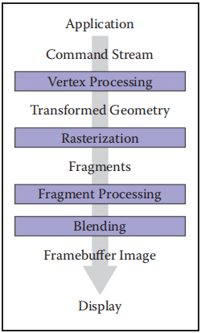

​																				**图8.1 图形管线的阶段**

### 8.1 光栅化（Rasterzaation）

​		光栅化是物体顺序图形的中心操作，而光栅器是任何图形管线的中心。对于每个传入的基元，光栅器有两个任务：它枚举（enumerate）基元覆盖的像素，并在基元中插值（interpolate）称为属性的值——这些属性的用途将在后面的示例中变清楚。光栅器的输出是一组片元，每个片元对应基元覆盖的每个像素。每个片元 “存在” 在一个特定的像素上，并携带自己的一组属性值。

​		在本章中，我们将介绍一个观点光栅化，以便使用它来渲染三维场景。同样的光栅化方法也用于在 2D 中绘制线条和形状——尽管在 “幕后” 使用 3D 图形系统来做所有的 2D 绘图已经变得越来越普遍。

#### 8.1.1 画线（Line Drawing）

​		大多数图形包都包含一个线绘制命令，它接受两个屏幕坐标中端点（参见图 3.10），并在它们之间绘制一条线。例如，调用端点 (1, 1) 和 (3, 2) 将打开像素 (1, 1) 和 (3, 2)，并在它们之间填充一个像素。对于一般的屏幕坐标端点 (x~0~, y~0~) 和 (x~1~, y~1~)，惯例应该绘制一些 “合理的” 像素集以近似它们之间的一条线。画这样的线基于线的方程，我们有两种类型的方程可供选择：隐式和参数。本节介绍使用隐式直线的方法。

*尽管我们经常使用整值端点作为示例，但正确支持任意端点也是很重要的。*

**用隐式直线方程画线**

​		用隐式方程画线最常见的方法是中点算法（midpoint algorithm）（Pitteway 1967, van Aken and Novak 1985）。中点算法最终画出了与 Bresenham 算法（Bresenham, 1965）相同的线，但它在某种程度上更直接。

​		首先要做的是找到这条直线的如 2.5.2 节隐式方程：
$$
f(x,y) \equiv{} (y_{0} - y_{1})x + (x_{1} - x_{0})y + x_{0}y_{1} - x_{1}y_{0} = 0
\tag{8.1}
$$
我们假设 x~0~ *≤* x~1~。如果它不成立，我们交换点使它成立。直线的斜率 m 是
$$
m = \frac{y_{1} - y_{0}}{x_{1} - x_{0}}
$$
下面的讨论假设 m∈(0,1]。对于 m∈(−∞, −1]，m∈(−1, 0]，m∈(1,∞) 也可以得到类似的讨论。这四种情况涵盖了所有的可能性。

​		对于 m∈(0,1]，“跑” 比 “升” 多，即直线在 x 上的移动速度比在 y 上的移动速度快。如果我们有一个 y 轴向下的 API，我们可能会担心这是否会使过程更困难，但事实上，我们可以忽略这个细节。我们可以忽略 “上” 和 “下” 的几何概念，因为这两种情况的代数是完全相同的。谨慎的读者可以验证所得到的算法适用于 y 轴向下的情况。中点算法的关键假设是，我们尽可能画出没有间隙的最细的线。两个像素之间的对角线连接不被认为是一个间隙。

​		当直线从左端点向右移动时，只有两种可能：绘制与绘制到其左侧的像素相同高度的像素，或绘制更高的像素。在端点之间的每一列像素中总是有一个精确的像素。0 表示有空隙，2 表示这条线太粗了。对于我们所考虑的情况，可能在同一行中有两个像素，这条线是水平的而不是垂直的，所以有时它会向右，有时向上。这个概念如图 8.2 所示，其中显示了三条 “合理” 的线，每条线在水平方向上比在垂直方向上前进得更多。

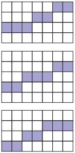

​																		**图8.2 三条 “合理” 的线，其中水平方向 7 个像素，垂直方向 3 个像素**

​		m∈(0,1] 的中点算法首先建立最左边的像素和最右边像素的列数（x 值），然后水平循环建立每个像素的行（y 值）。算法的基本形式是：

```c++
y = y0
for x = x0 to x1 do
	draw(x,y)
	if(some condition) then
		y = y + 1
```

注意 x 和 y 是整数。也就是说，“从左到右绘制像素，有时在 y 方向向上移动“。关键是在 if 语句中建立有效的决策方法。

​		做出选择的一种有效方法是查看两个潜在像素中心之间的线的中点。更具体地说，刚刚绘制的像素是像素 (x, y) 其实际屏幕坐标的中心是 (x, y)。要绘制到右边的候选像素是像素 (x+1, y)和 (x+1, y+1)。两个候选像素中心之间的中点为 (x+1, y+0.5)。如果直线通过中点以下，我们绘制底部像素，否则我们绘制顶部像素（图 8.3）。

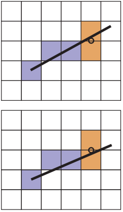

​												**图8.3 顶部：线在中点之上，所以上面的像素被画出来。底部：线在中点以下，因此下面像素被绘制。**

​		为了确定直线是高于 (x+1, y+0.5) 还是低于 (x+1, y+0.5)，我们在式（8.1）中计算 f(x, y+0.5)。回忆一下第 2.5.1 节，对于直线上的点 (x, y) 其 f(x, y)=0，直线一侧的点f(x, y) > 0，直线另一侧的点 f(x, y) < 0。因为 −f(x, y) = 0 和 f(x, y) = 0 都是直线的完美方程，所以并不是立即明确 f(x, y) 为正时是否表示 (x, y) 在直线之上或之下。然而，我们可以算出来，  式（8.1）中的关键项是 y 项 (x~1~−x~0~)y。注意 (x~1~−x~0~) 肯定是正的，因为 x~1~ > x~0~。意味着，随着y的增加，(x~1~-x~0~)y 项变得更大（即，更多的正或更少的负）。因此，f(x,+∞) 一定是正的，而且一定在直线之上，这意味着直线之上的点都是正的。另一个方式是看梯度向量的 y 分量是正的。所以在直线上，y可以任意增加，f(x, y) 一定是正的。这意味着我们可以通过填充 if 语句使代码更具体：

```c++
if f(x+1, y+0.5) < 0 then
	y = y + 1
```

上面的代码可以很好地适用于斜率合适的直线（即在 0 和 1 之间）。读者可以算出另外三种情况，它们只是在小细节上有所不同。

​		如果需要更高的效率，使用增量方法（incremental method）会有所帮助。增量方法试图通过重用前一步的计算来提高循环的效率。在本文提出的中点算法中，主要计算 f(x+1, y+0.5) 的值。注意，在循环内部，在第一次迭代之后，我们已经计算了 f(x−1,y+0.5) 或 f(x−1,y−0.5)（图8.4）。还要注意这个关系：
$$
\begin{align}
f(x+1,y) &= f(x,y) + (y_{0} - y_{1}) \\
f(x+1,y+1) &= f(x,y) + (y_{0} - y_{1}) + (x_{0} - x_{1})
\end{align}
$$
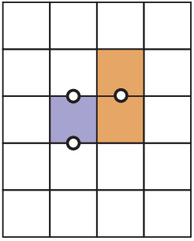

​											**图8.4 当使用两个橙色像素之间显示的决策点时，我们只画出蓝色像素，因此我们在左边显示的两个点之一计算 f**

​		这允许我们编写代码的增量版本：

```c++
y = y0
d = f(x0+1, y0+0.5)
for x = x0 to x1 do
	draw(x,y)
	if d < 0 then
		y = y + 1
		d = d + (x1 - x0) + (y0 - y1)
	else
		d = d + (y0 - y1)
```

这段代码应该运行得更快，因为它相比于非增量版本（这对于增量算法并不总是正确的）几乎没有额外的设置成本，但它可能积累更多数字错误，因为对于长直线来说 f(x, y+0.5) 的求值可以由许多加法组成。  然而，考虑到给定的线很少超过几千像素，这样的错误不太可能是严重的。通过将 (x~1~−x~0~) + (y~0~−y~1~) 和 (y~0~−y~1~) 存储为变量，可以实现略长的设置成本，但更快的循环执行。我们可能希望一个好的编译器能帮我们做到这一点，但是如果代码是关键的，那么检查编译结果来确保正确是明智的。

​		我们经常想要画一个 2D 三角形，其中 2D 点屏幕坐标 **p~0~** = (x~0~, y~0~)， **p~1~** = (x~1~, y~1~)， **p~2~** = (x~2~, y~2~) 。这类似于画线问题，但它有自己的一些微妙之处。与画线一样，我们可能希望从顶点的值中插值颜色或其他属性。如果我们有重心坐标，这就很简单了（第 2.7节）。例如，如果顶点的颜色是 **c~0~**、**c~1~** 和 **c~2~**，则三角形中以质心坐标 (α、β、γ) 表示的点的颜色为
$$
\vec{c} = \alpha{}\vec{c}_{0} + \beta{}\vec{c}_{1} + \gamma{}\vec{c}_{2}
$$
在它的发明者后（Gouraud，1971），这种类型的颜色插值在图形学中被称为 Gouraud 插值。

​		光栅化三角形的另一个微妙之处是，我们通常光栅化共享顶点和边的三角形。这意味着我们想要光栅化相邻的三角形，这样就没有洞了。我们可以通过使用中点算法来绘制每个三角形的轮廓，然后填充内部像素。这意味着相邻三角形沿着每条边都画出相同的像素。如果相邻三角形有不同的颜色，图像将取决于两个三角形的绘制顺序。为了避免顺序问题和消除孔洞，最常用的光栅化三角形的方法是使用约定，即当且仅当像素的中心在三角形内部时才绘制像素，即像素中心的重心坐标都在区间 (0,1) 内。这就产生了一个问题：如果中心正好在三角形的边缘，该怎么办。有几种方法可以处理这个问题，本节稍后将对此进行讨论。关键的观察是，重心坐标允许我们决定是否绘制像素，以及如果我们从顶点插值颜色，该像素应该是什么颜色。因此，我们的三角形光栅化问题归结为有效地找到像素中心的重心坐标（Pineda, 1988）。蛮力光栅化算法为：

```c++
for all x do
	for all y do
		compute(α, β, γ) for (x,y)
		if(α∈[0,1] and β∈[0,1] and γ∈[0,1]) then
			vecC = αvecC0 + βvecC1 + γvecC2
			drawpixel(x,y) with color vecC
```

算法的其余部分将外循环限制在更小的候选像素集上，使重心计算更加高效。

​		我们可以增减一点简单的效率，通过找到三个顶点的边界矩形，并只在这个矩形上循环候选像素来绘制。质心坐标可由式（2.32）计算。这就产生了算法：

```c++
xmin = floor(xi)
xmax = ceiling(xi)
ymin = floor(yi)
ymax = ceiling(yi)
for y = ymin to ymax do
	for x = xmin to xmax do
		α = f12(x,y) / f12(x0,y0)
		β = f20(x,y) / f20(x1,y1)
		γ = f01(x,y) / f01(x2,y2)
		if(α > 0 and β > 0 and γ > 0) then
			vecC = αvecC0 + βvecC1 + γvecC2
			drawpixel(x,y) with color vecC
```

这里 f~ij~ 是由式（8.1）给出的带有适当顶点的直线：
$$
f_{01}(x,y) = (y_{0}-y_{1})x + (x_{1}-x_{0})y + x_{0}y_{1} - x_{1}y_{0} \\
f_{12}(x,y) = (y_{1}-y_{2})x + (x_{2}-x_{1})y + x_{1}y_{2} - x_{2}y_{1} \\ 
f_{20}(x,y) = (y_{2}-y_{0})x + (x_{0}-x_{2})y + x_{2}y_{0} - x_{0}y_{2}
$$
注意，我们已经将检验 α∈(0,1) 与 α > 0 等进行了交换，因为如果所有的α、 β、 γ都是正的，那么我们知道它们都小于1，因为 α + β + γ = 1。我们也可以只计算三个重心变量中的两个，并从这个关系中得到第三个，但不清楚一旦算法进行增量是否节省了计算，虽然增量在画线算法中是可能节省的，α、β 和 γ 的每一个计算都是以 f(x, y) = Ax + By + C 的形式计算的。在内部循环中，只有 x 改变，且它每次改变 1。注意 f(x+1, y) = f(x, y) + A。这是增量算法的基础。在外循环中，f(x, y) 的求值变化为 f(x, y+1)，因此可以达到类似的效率。因为 α、 β 和 γ 在循环中以常数的增量变化，所以颜色 **c** 也是如此。所以这也可以是递增的。例如，像素 (x+1, y) 的红色值与像素 (x, y) 的红色值相差一个可预先计算的常量。一个带有颜色插值的三角形示例如图 8.5 所示。

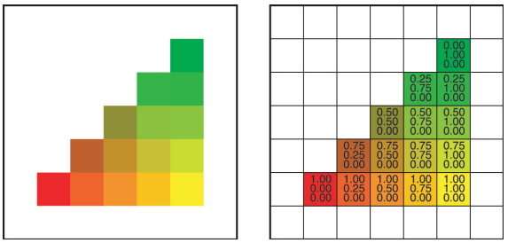

​			**图8.5 一个带重心插值的彩色三角形。注意，颜色分量的变化在每行、每列以及每条边都是线性的。事实上，它在每条直线上都是常数，比如对角线**

**处理三角形边上的像素**

​		我们还没有讨论如何处理中心正好在三角形边缘的像素。如果一个像素恰好在三角形的边缘，那么它也在相邻三角形的边缘（如果有相邻三角形的话）。没有一种明显的方法将像素授予一个三角形或另一个三角形。最糟糕的决定是不画像素，因为两个三角形之间会出现一个洞。更好的方法是让两个三角形都绘制像素，但仍然不是很好。如果三角形是透明的，就会产生双色。我们希望将像素分配给其中一个三角形，且希望这个过程能够简单些，选择哪个三角形并不重要，只要选择是明确的。

​		一种方法是注意任何 off-screen 点都是在共享边的一边，这就是我们要画的边。对于两个不重叠的三角形，不在边上的两个顶点在共享边的两侧。恰好有一个顶点与off-screen 点在同一条边上（图 8.6）。这是测试的基础。测试数字 p 和 q 是否具有相同的符号可以实现为测试 pq > 0，这在大多数环境中非常有效。

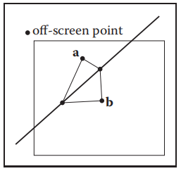

​															**图8.6 off-screen 点将在三角形边的一边或另一边。只有一个非共享顶点 a 和 b 在同一边。**

​		请注意，这个测试并不完美，因为通过边的线也可能通过 off-screen 的点，但我们至少大大减少了问题情况的数量。使用哪个屏幕外点是任意的，(x, y) = (−1,−1) 是最好的选择。我们将需要添加一个检查的情况，一个点正好在边缘上。我们希望这种检查不触及普通情况，这是完全内部或外部测试。这建议：

```c++
xmin = floor(xi)
xmax = ceiling(xi)
ymin = floor(yi)
ymax = ceiling(yi)
fα = f12(x0,y0)
fβ = f20(x1,y1)
fγ = f01(x2,y2)
for y = ymin to ymax do
	for x = xmin to xmax do
		α = f12(x,y) / fα
		β = f20(x,y) / fβ
		γ = f01(x,y) / fγ
		if(α > 0 and β > 0 and γ > 0) then
		if(α > 0 or fαf12(-1,-1)) and (β > 0 or fβf20(-1,-1)) and (γ > 0 or fγf01(-1,-1)) then
			vecC = αvecC0 + βvecC1 + γvecC2
			drawpixel(x,y) with color vecC
```

我们可能期望，只有当我们对两个三角形使用完全相同的直线方程时，上述代码才能消除孔洞和绘制两次。事实上，只有当两个共享顶点在每个三角形的绘制调用中具有相同的顺序时，直线方程才是相同的。否则方程符号可能会倒过来。依赖编译器是否更改运算顺序这可能是一个问题。因此，如果需要健壮的实现，可能需要检查编译器和算术单元的细节。上面伪代码中的前四行必须仔细编码，以处理边缘正好碰到像素中心的情况。

​		除了适应增量实现之外，还有几个潜在的早期退出点。例如，如果 α 是负的，就不需要计算 β 或 γ。虽然这可能会很好地提高速度，但分析总是一个好主意，额外的分支可能会减少管线传输或并发性，并可能降低代码速度。因此，与往常一样，如果代码是关键部分，请测试任何看起来有吸引力的优化。

​		上述代码的另一个细节是，对于退化三角形，除法可以是被零除法，也就是如果 f~γ~ = 0。应该正确地考虑浮点错误条件，否则就需要进行另一个测试。

#### 8.1.3 裁剪（Clipping）

​		简单地将基元转换到屏幕空间并对它们进行光栅化并不能完全独立地工作。这是因为基元是在观察体之外的——特别是，基元是在眼睛后面——可能最终被光栅化，导致不正确的结果。例如，考虑图 8.7 中所示的三角形。两个顶点在观察体中，但第三个顶点在眼睛后面。投影变换将这个顶点映射到远平面后面一个毫无意义的位置，如果允许这种情况发生，三角形将不正确地光栅化。由于这个原因，光栅化之前必须进行一个裁剪操作，删除部分可能扩大到眼睛后面的基元。

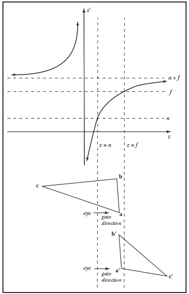

**图8.7 深度 z 通过透视变换转换为深度 z‘。注意，当 z 从正到负时，z’ 从负到正。因此，眼睛后面的顶点会移动到眼睛前面，且超出 z‘ = n + f。这将导致错误的结果，这就是为什么三角形首先被裁剪，以确保所有顶点都在眼睛前面。**

​		裁剪是图形中的一种常见操作，每当一个几何实体 “裁剪” 另一个实体时都需要它。例如，如果你在平面 x = 0 上裁剪一个三角形，如果顶点的 x 坐标的符号不完全相同，那么平面会将三角形切割成两部分。在大多数裁剪的应用中，在平面上 “错的” 一边的三角形部分被丢弃。单个平面的操作如图 8.8 所示。

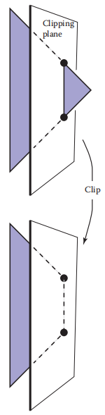

​																				**图8.8 多边形被裁剪到裁剪平面上。平面的 “内部” 部分被保留。**

​		在为光栅化做准备的裁剪中，“错误” 的一边面是观察体体外的那边。它总是安全的裁剪掉所有观察体之外的几何——也就是说，对所有六个面进行剪切，但许多系统只对近平面进行剪切。

​		本节讨论裁剪模块的基本实现。那些对实现工业速度的裁剪感兴趣的人应该看看 Blinn 在本章末尾的备注中提到的书。

​		实现裁剪的两种最常见的方法是：

1. 在世界坐标系中，用六个平面表示平截头体。
2. 在齐次除法之前的四维变换空间中。

对每个三角形采用以下方法，任何一种可能性都可以有效地实现（J. Blinn, 1996）:  

```c++
for each of six planes do
	if(triangle entirely outside of plane) then
		break(triangle is not visible)
	else if triangle spans plane then
		clip triangle
		if(quadrilateral is left) then
			break into two triangles
```

#### 8.1.4 变换前的裁剪（选项1）（Clipping Before the Transform(Option 1)）

​		选项 1 有一个简单的实现。唯一的问题是，“六个平面方程是什么”？因为这些方程对于在单一图像中渲染的所有三角形都是相同的，所以我们不需要非常高效地计算它们。出于这个原因，我们可以求逆图 5.11 所示的变换，并将其应用到变换后的观察体的 8 个顶点上：
$$
\begin{align}
(x,y,z) = &(l,b,n) \\ &(r,b,n) \\ &(l,t,n) \\ &(r,t,n) \\ &(l,b,f) \\ &(r,b,f) \\ &(l,t,f) \\ &(r,t,f)
\end{align}
$$
从这里可以推导出平面方程。或者，我们可以使用矢量几何直接从观察参数得到平面。

#### 8.1.5 齐次坐标下的裁剪（选项2）（Clipping in Homogeneous Coordinates(Option 2)）

​		令人惊讶的是，通常实现的选项是在除法之前在齐次坐标中进行裁剪。这里的观察体是 4D 的，它被 3D 体（超平面）所包围。这些是
$$
\begin{align}
-x + lw &= 0 \\ x - rw &= 0 \\ -y + bw &= 0 \\ y -tw &= 0 \\ -z + nw &= 0 \\ z -fw &= 0
\end{align}
$$
这些平面非常简单，所以效率比选项 1 更好。它们仍然可以通过将观察体 [l, r] × [b, t] × [f,n] 变换到 [0, 1]^3^ 来改进。事实证明，三角形的裁剪并不比在 3D 复杂多少。

#### 8.1.6 以一个平面裁剪（Clipping against a Plane）

​		无论我们选择哪一种选项，我们都必须以一个平面裁剪。回想一下第 2.5.5 节通过点 **q** 且法向 **n** 的平面的隐式方程是
$$
f(\vec{p}) = \vec{n} \cdot{} (\vec{p} - \vec{q}) = 0
$$
这经常被写成
$$
f(\vec{p}) = \vec{n} \cdot{} \vec{p} + D = 0
\tag{8.2}
$$
有趣的是，这个方程不仅描述了一个三维平面，还描述了一条二维的直线和一个四维平面的类似体积的东西。所有这些实体在其相应的维度上通常被称为平面。

​		如果我们有一条线段在点 **a** 和点 **b** 之间，我们可以使用在第 12.4.3 节描述的 BSP 树程序中切割 3D 三角形的边的技术将它“裁剪”到一个平面上。在这里，通过检查 f(**a**) 和 f(**b**) 是否有不同的符号来测试点 **a** 和 **b** 是否在平面 f(**p**) = 0 的两边。通常定义 f(**p**) < 0 在平面内，f(**p**) > 0 在平面外。如果平面确实分割了直线，那么我们可以通过将方程代入参数直线来求交点，
$$
\vec{p} = \vec{a} + t(\vec{b} - \vec{a})
$$
代入式（8.2）的 f(**p**)=0 平面。这得到
$$
\vec{n} \cdot{} (\vec{a} + t(\vec{b} - \vec{a})) + D = 0
$$
解 t 得到
$$
t = \frac{\vec{n} \cdot{} \vec{a} + D}{\vec{n} \cdot{} (\vec{a} - \vec{b})}
$$
然后我们可以找到交点并 “缩短” 这条线。

​		为了裁剪一个三角形，我们也可以按照 12.4.3 节来生产一个或两个三角形。

### 8.2 光栅化前后的操作

​		在可以光栅化一个基元之前，定义它的顶点必须在屏幕坐标中，并且应该在基元中插入的颜色或其他属性必须是已知的。准备这些数据是管线中顶点处理阶段的工作。这个阶段，进入的顶点通过模型、视图和投影变换进行转换，将它们从原始坐标映射到屏幕空间（回想一下，在这里，位置是用像素度量的）。同时，其他信息，如颜色、表面法线或纹理坐标，将根据需要进行转换，我们将在下面的示例中讨论这些附加属性。

​		在光栅化后，进一步处理，为每个片元计算颜色和深度。这个处理过程可以简单到只需通过一个插值的颜色和使用光栅器计算的深度，也可以到涉及复杂着色运算。最后，混合阶段结合由重叠每个像素的（可能是几个）基元生成的片元来计算最终的颜色。最常见的混合方法是用最小的深度（最接近眼睛）选择片元的颜色。

​		不同阶段的目的最好通过例子来说明。

#### 8.2.1 简单的 2D 绘制（Simple 2D Drawing）

​		最简单的管线在顶点或片元阶段什么都不做，在混合阶段，每个片元的颜色只是覆盖前一个片元的值。应用程序直接在提供基元像素坐标，然后光栅化完成所有工作。这种基本安排是许多用于绘制用户界面、平面图、图形和其他 2D 内容的简单、较老的 API 的精髓。单一颜色的形状可以通过为每个基元的所有顶点指定相同的颜色来绘制，我们的模型管线也支持使用插值平滑地变化颜色。

#### 8.2.2 最小的 3D 管线（A Minimal 3D Pipeline）

​		要绘制 3D 中的物体，只需要对 2D 绘制管线进行一个矩阵变换：顶点处理阶段将进入的顶点位置乘以建模、相机、投影和视口矩阵的乘积，产生屏幕空间的三角形，然后以相同的方式绘制，就像在 2D 中直接指定一样。

​		最小的 3D 管线的一个问题是为了得到正确的遮挡关系——得到在较远的物体前面的较近的物体——基元必须按照从后往前的顺序绘制。这个去除隐藏表面的被称为画家算法（painter's algorithm），类似于先画一幅画的背景，然后在它上面画前景。画家的算法是去除隐藏表面的完美有效方法，但它有几个缺点。它不能处理彼此交叉的三角形，因为没有正确的顺序来画它们。类似地，几个三角形，即使它们没有交叉，仍然可以被安排在一个闭塞循环（occlusion cycle）中，如图 8.9 所示，这是另一种不存在前后顺序的情况。最重要的是，根据深度对基元进行排序很慢，特别是在大场景中，并且干扰了数据的有效传输，这使得物体顺序渲染如此之快。图 8.10 显示了物体不按深度排序时此过程的结果。

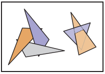

​																						**图8.9 两个循环遮挡的，其不能按从后往前的顺序画**

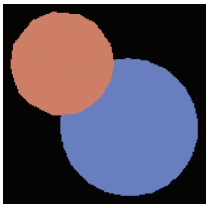

**图8.10 用最小的管线绘制两个相同大小的球体的结果。看起来较小的球体距离较远，但却是最后绘制的，因此它错误地覆盖了较近的球体。**

#### 8.2.3 对隐藏表面使用 z-Buffer（Using a z-Buffer for Hidden Surfaces）

​		在实践中，画家的算法很少被使用，取而代之的是一种简单而有效的隐藏表面去除算法，即 z-buffer 算法。方法很简单：在每个像素上，我们跟踪到目前为止所绘制的最近的表面的距离，并丢弃比这个距离更远的片元。最近距离是通过为每个像素分配一个除了红色、绿色和蓝色的值以外额外的值来存储的，这被称为深度，或z值。深度缓冲（depth buffer），或 z-buffer，是包含深度值的网格的名称。

​		z-buffer算法是在碎片混合阶段实现的，通过比较每个片元的深度与 z-buffer 中存储的当前值。如果片元的深度更近，它的颜色和深度值都会覆盖颜色和深度缓冲区中当前的值。如果片元的深度更远，它就被丢弃。为了确保第一个片段将通过深度测试，z-buffer 被初始化为最大深度（远平面的深度）。无论表面的绘制顺序如何，相同的片元将赢得深度测试，最终的图像将是相同的。

*当然，在深度测试中可能存在关联，在这种情况下，顺序可能很重要*

​		z-buffer 算法要求每个片元携带一个深度。这只需将 z 坐标作为顶点属性插值，就像插值颜色或其他属性一样。

​		z-buffer 是处理物体顺序渲染中隐藏表面的一种简单而实用的方法，它是目前最主要的方法。它比将表面切割成可以按深度排序的块的几何方法简单得多，因为它避免了解决任何不需要解决的问题。深度顺序只需要在像素的位置上确定，这就是 z-buffer 所做的。它得到了硬件图形管线的普遍支持，也是软件管线最常用的方法。图 8.11 显示了一个示例结果。

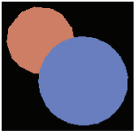

​																								**图8.11 结果是用 z-buffer 画出两个相同的球体。**

**精度问题**

​		实际上，存储在缓冲区中的 z 值是非负整数。这比真正的浮点数更可取，因为 z 缓冲区所需的快速内存有点昂贵，且值得保持在最小值。

​		使用整数会导致一些精度问题。如果我们使用一个具有 B 个值的整数范围 {0, 1, …, B−1}，我们可以将 0 映射到近裁剪平面 z = n，将 B−1 映射到远裁剪平面 z = f。注意，在这个讨论中，我们假设 z，n 和 f 是正的。这将导致与负数情况相同的结果，但论证的细节更容易理解。我们将每个 z 值发送到一个深度为 Δz = (f−n)/B 的 “桶”。如果内存不是额外花费，我们就不会使用整数 z-buffer，因此使 B 尽可能小是很有用的。 

​		如果分配 b 位来存储 z 值，那么 B = 2^b^。我们需要足够的位来确保任何在另一个三角形前面的三角形将它自己的深度映射到不同的深度容器。

​		例如，如果您正在渲染一个场景，其中三角形的间距至少为一米，那么 Δz < 1 应该生成没有 artifacts 的图像。有两种方法可以让 Δz 变小：把 n 和 f 移得更近或增加 b。如果 b 是固定的（可能在某些 API 中或者在特定的硬件平台上），则调整 n 和 f 是唯一的选择。

​		当创建透视图像时，z-buffer 的精度必须非常小心地处理。上面的值 Δz 是在透视除法之后使用的。回忆一下在第 7.3 节中透视图除法的结果是
$$
z = n + f - \frac{fn}{z_{w}}
$$
实际的容器深度与世界深度 z~w~ 有关，而不是与透视除法后的深度 z 有关。我们可以通过求两边的微分来近似容器的大小：
$$
\Delta{}z \approx{} \frac{f_{n}\Delta{}z_{w}}{z_{w}^{2}}
$$
容器大小的深度各不相同。世界空间的容器大小是
$$
\Delta{}z_{w} \approx{} \frac{z_{w}^{2}\Delta{}z}{f_{n}}
$$
请注意，Δz 的数量与前面讨论的相同。对于 z' = f，最大的容器是
$$
\Delta{}z_{w}^{max} \approx{} \frac{f\Delta{}z}{n}
$$
请注意，如果我们不想丢失眼前的物体，n = 0是很自然的选择，这将导致一个无限大的容器——非常糟糕的情况。为了使Δz~w~^max^ 尽可能小，我们想让 f 最小化，n 最大化。因此，仔细选择 n 和 f 总是很重要的。

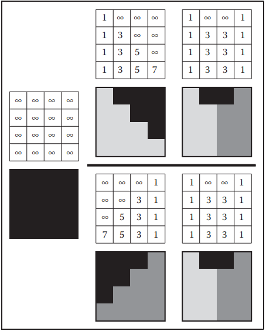

**图8.12 z-buffer 光栅化两个三角形，在两种可能的顺序。第一个三角形是完全光栅化的。第二个三角形计算了每个像素，但其中三个像素的深度竞赛失败了，这些像素也没有被绘制出来。不管怎样，最终的图像都是一样的。**

#### 8.2.4 逐顶点着色（Per-vertex Shading）

​		到目前为止，将三角形发送到管线中的应用程序负责设置颜色，光栅器只是插值颜色，且它们直接写入输出图像。对于某些应用程序来说，这已经足够了，但在很多情况下，我们想要用着色来绘制 3D 物体，如使用与第 4 章中用于图像顺序渲染的相同的照明方程。回想一下，这些方程需要光方向、眼睛方向和表面法线来计算表面的颜色。

​		处理着色计算的一种方法是在顶点阶段执行它们。应用程序提供顶点上的法向量，并且光源的位置和颜色是单独提供的（它们不会在整个表面上变化，所以它们不需要为每个顶点指定）。对于每个顶点，观察者的方向和每个光源的方向都是基于摄像机、光源和顶点的位置计算的。计算所需的着色方程来计算一个颜色，然后将其作为顶点颜色传递给光栅器。逐顶点着色有时被称为 Gouraud 着色

​		需要做的一个决定是在哪个坐标系中做着色计算。世界空间或眼睛空间都是不错的选择。在世界空间中，选择一个标准正交的坐标系是很重要的，因为着色方程依赖于向量之间的角度，而这些角度不会被模型变换经常使用的非均匀缩放或常用于投影到标准观察体的透视投影等操作所保留。眼空间中的着色有一个优点，我们不需要跟踪摄像机的位置，因为在透视投影中，摄像机总是在眼空间的原点，或者在正交投影中观察方向总是+z。

​		逐顶点着色的缺点是，它不能在着色中产生比绘制表面所用的基元更小的细节，因为它只对每个顶点计算一次着色，而从不在顶点之间计算。例如，带有地板的一个房间是用两个大三角形且由房间中间的光源照明，着色将评估只在房间的角落，所以中心的插值可能会太黑。此外，着色高光的曲面必须使用足够小的基元去解决高光。

​		图 8.13 显示了我们用逐顶点着色绘制的两个球体。

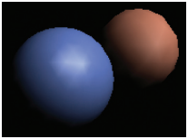

​														**8.13 使用逐顶点（Gouraud）着色绘制两个球体。因为三角形很大，所以可以看到插值 artifacts**

#### 8.2.5 逐片元着色（Per-fragment Shading）

​		为了避免与逐顶点着色相关的插值 artifacts，我们可以通过在插值后执行着色计算来避免插值颜色，也就是在片元阶段。在逐片元着色，相同的着色方程被评估，但为每个片元使用插值向量评估它们，而不是每个顶点使用来自应用程序的向量。

*逐片元着色有时被称为 Phong 着色，这是令人困惑的，因为相同的名称附加到 Phong 照明模型。*

​		在逐片元着色中，着色所需的几何信息作为属性通过光栅器传递，因此顶点阶段必须与片元阶段协调以适当地准备数据。一种方法是插值眼空间表面法线和眼空间顶点位置，然后就可以像在逐顶点着色中那样使用它们。

​		图8.14显示了我们用逐片元着色绘制的两个球体。

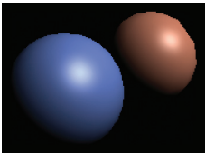

​														**8.14 使用逐片元着色绘制两个球体。因为三角形很大，所以可以看到插值 artifacts**

#### 8.2.6 纹理映射（Texture Mapping）

​		纹理（在第 11 章中讨论）是用来为表面的着色添加额外细节的图，若没有会看起来过于均匀和仿造感。这个想法很简单：每次计算着色时，我们读取一个用于着色计算的值——例如漫反射颜色——从纹理中，而不是使用附加到被渲染的几何图形的属性值。这个操作称为纹理查找（texture lookup）：着色代码指定一个纹理坐标（texture coordinate），它是纹理域中的一个点，纹理映射系统在纹理图像中找到那个点的值并返回它。纹理值随后用于着色计算。

​		定义纹理坐标最常见的方法是简单地将纹理坐标作为另一个顶点属性。每一个基元都知道它在纹理中的位置。

#### 8.2.7 着色频率（Shading Frequency）

​		关于在哪里进行着色计算的决定取决于颜色变化的速度——计算细节的比例。具有大规模特征的着色，如在曲面上的漫反射着色，可以相当不频繁地评估，然后插值：它可以用较低的着色频率来计算。产生小尺度特征的着色，如锐利的高光或细节纹理，需要在高着色频率下进行评估。对于需要在图像中看起来锐利和清晰的细节，着色频率需要是每个像素至少一个着色样本。

​		因此，即使定义基元的顶点相距许多像素，也可以在顶点阶段安全地计算大规模效果。需要高着色频率的效果也可以在顶点阶段进行计算，只要顶点在图像中距离很近，或者，当基元大于像素时，可以在片元阶段计算它们。

​		例如，在电脑游戏中使用的硬件管线，通常使用覆盖多个像素的基元以确保高效率，通常逐片元进行大多数着色计算。另一方面，PhotoRealistic RenderMan 系统逐顶点进行所有的着色计算，在第一次细分或切割（dice）之后，所有的表面都被细分为称为微多边形（micropolygon）的小四边形，大小与像素差不多。由于基元很小，在这个系统中逐顶点着色达到了一个高的着色频率，这适合于细节着色。

### 8.3 简单的抗锯齿（Simple Antialiasing）

​		就像光线追踪一样，如果我们完全或完全不确定每个像素是否在基元内部，光栅化将产生锯齿状的线条和三角形边缘。事实上，在本章所描述的简单的三角形光栅化算法（有时被称为标准或走样光栅化）产生的一组片元，其和通过一个发送一个射线通过每个像素中心的光线追踪器来映射到三角形的像素集一模一样。同样在光线追踪中，解决方案是允许像素部分被基元覆盖（Crow, 1978）。在实践中，这种形式的模糊有助于视觉质量，特别是在动画中。如图 8.15 的上面那条直线所示。

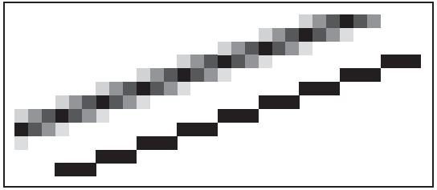

​												 								**图8.15 近距离查看一个抗锯齿线和锯齿线，所以个别像素是可见的。**

​		在光栅化应用中有许多不同的抗锯齿方法。就像光线追踪器一样，我们可以通过将每个像素值设置为该像素所在正方形区域上图像的平均颜色来生成抗锯齿图像，这种方法称为 box filter。这意味着我们必须将所有可绘制的实体视为具有良好定义的区域。例如，图 8.15 中的线可以被认为近似于一个像素宽的矩形。

*有比 box filter 更好的过滤器，但 box filter 除了最苛刻的将满足所有应用程序。*

实现 box filter 抗锯齿最简单的方法是超采样（supersample）：创建非常高分辨率的图像，然后降低采样。例如,如果我们的目标是一个 256×256 像素包含宽度 1.2 像素的线的图像，我们可以光栅化一个矩形版本为 1024×1024  像素的屏幕上 4.8 像素宽度的线，然后对 4×4 组像素进行平均，得到 “萎缩” 的 256×256 图像中每个像素的颜色。这是实际 box filter 图像的近似，但当物体相对于像素之间的距离不是非常小时，效果很好。

​		然而，超采样相当昂贵。由于导致锯齿的非常尖锐的边缘通常是由基元的边引起的，而不是基元内着色的突然变化，一个广泛使用的优化是以比着色更高的频率采样可见性。如果在每个像素中存储一些点的覆盖和深度信息，即使只计算一种颜色，也可以获得非常好的抗锯齿效果。在 RenderMan 这样使用逐顶点着色的系统中，这是通过高分辨率光栅化实现的：这样做成本不高，因为着色只是简单地为许多片元或可见性样本生成颜色插值。按逐片元着色的系统中，例如硬件管线，多样本抗锯齿（multisample antialiasing）是通过为每个片元存储一个单一的颜色加上覆盖掩码和一组深度值来实现的。

### 8.4 为了效率而剔除基元（Culling Primitives for Efficiency）

​		物体顺序渲染的优势在于，它需要对场景中的所有几何图形进行一次遍历，但这在复杂场景中也是一个弱点。例如，在一个完整的城市模型中，在任何给定的时间只有少数建筑可能是可见的。一个正确的图像可以通过绘制场景中的所有基元来获得，但大量的努力将被浪费在处理可见建筑后面或观察者后面的几何图形上，因此不会对最终的图像做出贡献。

​		识别和丢弃不可见的几何图形，以节省处理它的时间，这被称为剔除（Culling）。三种常用的剔除策略（通常串联使用）是：

- 观察体剔除——移除观察体之外的几何形状。

- 遮挡剔除——移除可能在观察体内但被其他靠近相机的几何物体遮挡或封闭的几何物体。

- 背面剔除——移除背对着相机的基元。

  ​	我们将简要讨论观察体剔除和背面剔除，但高性能系统中的剔除是一个复杂的话题，参见（Akenine-Moller 等人，2008）获得完整的讨论和关于遮挡剔除的信息。

#### 8.4.1 观察体剔除（View Volume Culling）

​		当整个基元位于观察体之外时，它可以被剔除，因为它在光栅化时不会产生片元。如果我们可以通过快速测试剔除许多基元，我们可能会显著的加快绘图速度。

​		观察体剔除也称视锥剔除（view frustum culling），在许多三角形被组合成一个具有相关包围体的物体时特别有用。如果包围体位于观察体之外，那么组成物体的所有三角形也都在观察体之外。例如，如果我们有1000个三角形被一个圆心为 **c**，半径为 r 的球体包围，我们可以检查球体是否位于裁剪平面之外，
$$
(\vec{p} - \vec{a}) \cdot{} \vec{n} = 0
$$
其中 **a** 是平面上的一点，**p** 是一个变量。这等价于检查从球的中心 **c** 到平面的带符号的距离是否大于 +r。这数量是检查
$$
\frac{(\vec{c} - \vec{a}) \cdot{} \vec{n}}{||\vec{n}||} > r
$$
请注意，即使在所有三角形都位于平面外的情况下，球体也可能与平面重叠。因此，这是一个保守的测试。测试的保守程度取决于球体与物体的边界。

​		如果场景是按照第 12 章中描述的空间数据结构组织的，那么同样的想法也可以分层级应用。

#### 8.4.2 背面剔除（Backface Culling）

​		当多边形模型是封闭的，即它们包围了一个没有孔的封闭空间时，然后通常假设它们有如第10章所讨论的面向外边的法向量。对于这样的模型，背对眼睛的多边形肯定会被面朝眼睛的多边形覆盖。因此，这些多边形甚至可以在管线开始之前被剔除。此条件的测试与第 10.3.1 节为轮廓绘制给出的测试相同。

### 常见问答（Frequently Asked Questions）

- **我经常看到对裁剪的详细讨论，这是一个比本章描述的更复杂的过程。这是怎么回事？**

本章中描述的裁剪是有效的，但是缺乏工业强度裁剪器所具有的优化。在章节备注中列出的 Blinn 的最佳工作中详细讨论了这些优化。

- **非三角形的多边形如何光栅化？**

这些可以直接逐线扫描，也可以分解成三角形。后者似乎是更流行的技术。

- **抗锯齿总是更好吗？**

不。有些图像在没有抗锯齿的情况下看起来更清晰。许多程序使用没有抗锯齿的 “屏幕字体”，因为它们更容易阅读。

- **我的 API 文档谈到了 “场景图” 和 “矩阵堆栈”。这些是图形管线的一部分吗？**

图形管线的设计当然是考虑到这些因素的，我们是否将其定义为管线的一部分是一个体验问题。这本书将他们的讨论推迟到第 12 章。

- **均匀距离 z-buffer 是否优于包含透视矩阵非线性的标准 z-buffer？**

看情况而定。非线性的一个 “特征” 是 z-buffer 在眼睛附近有更高的分辨率，而在远处则更低。如果使用的是细节层次系统，那么远处的几何就会更粗糙，z-buffer 的 “不公平性” 可能是件好事

- **软件 z-buffer 有用吗?**

是的。大多数使用 3D 计算机图形的电影都使用了皮克斯公司（Pixar）开发的软件 z-buffer 的变体（Cook, Carpenter，&Catmull, 1987）。

### 备注（Notes）

《Jim Blinn’s Corner：A Trip Down the Graphics Pipeline》（J. Blinn, 1996）是一本关于设计图形管线的好书。《3D Game Engine Design》（Eberly, 2000）《Real-Time Rendering》（Akenine-Moller等人, 2008）中有许多关于管线和剔除的细节。

### 练习（Exercises）

1. 假设在透视变换中我们有 n = 1和 f = 2。在什么情况下，我们会有一个“反转”，即透视转换前后的顶点从眼睛的前面翻转到眼睛的后面，或者反之？
2. 有什么原因在透视除法后不在 x 和 y 上裁剪（参见图 11.2，阶段 3）？
3. 对于 0 < m ≤ 1，推导带颜色的端点中点画线算法的增量形式。
4. 修改三角形绘制算法，以便它将为通过 (x, y)=(−1,−1) 的三角形边上的点精确绘制一个像素。
5. 假设你正在为飞行模拟设计一个整数 z-buffer，其中所有的物体都至少有 1 米厚，与观察者的距离永远不会超过 4m，最远可能会达到 100km。z-buffer 中需要多少位才能确保没有可见性错误？假设可见性错误只影响到观察者附近，即小于 100m 的距离。在这种情况下需要多少位？

