​		在图形学中，我们经常处理有连续变量的函数：图像是您看到的第一个例子，但随着您继续探索图形学，您将遇到更多的例子。从本质上讲，连续函数不能直接在计算机中表示，我们必须用有限的比特来表示它们。表示连续函数最有用的方法之一是使用函数的样本（sample）：只将函数的值存储在许多不同的点上，并在需要的时候或如果需要的话重新构建这些值。

​		现在，您已经熟悉了使用二维像素网格表示图像的概念——因此，您已经看到了一个被采样的表示！想想用数码相机拍摄的图像：摄像机镜头形成的场景的实际图像是图像平面上位置的连续函数，摄像机将该函数转换为二维样本网格。从数学上讲，摄像机将类型为 R^2^→**C**（**C** 是颜色集合）的函数转换为二维颜色样本数组或类型为 Z^2^→**C** 的函数。

​		另一个样本表示的例子是 2D 数字化面板，如平板电脑的屏幕或艺术家使用的单独的笔板（pen tablet）屏幕。在这种情况下，原始的函数是笔尖的运动，这是一个在时间上变化的 2D 位置，或 R→R^2^ 类型的函数。 数字化仪在许多时间点测量笔尖的位置，产生一个二维坐标序列或 Z→R^2^ 类型的函数。动作捕捉（motion capture）系统对附着在演员身上的特殊标记做了完全相同的事情：随着时间的推移，它获取标记的 3D 位置（R→R^3^），并使其成为一系列瞬时位置测量（Z→R^3^）。

​		在维度上，医用 CT 扫描仪，用于非侵入性的检查一个人的身体内部，测量密度作为身体内部位置的函数。扫描仪的输出是一个包含密度值的三维网格。它将物体的密度（R^3^→R）转换为实数的 3D 数组（Z^3^→R）。

​		这些例子看起来不同，但实际上它们都可以用完全相同的数学方法来处理。在所有情况下，函数都是在一个或多个维度的格子（lattice）的点上被采样的，在所有情况下，我们都需要能够从样本数组中重构原始的连续函数。

​		从2D图像的例子来看，像素似乎足够了，一旦相机离散了图像我们就再也不需要考虑连续函数了。但如果我们想让图像在屏幕上变大或变小，尤其是通过非整数缩放因子？事实证明，最简单的算法执行效果很差，引入了明显的视觉 artifacts，即走样。解释为什么会发生走样以及理解如何防止走样需要采样理论的数学知识。得到的算法相当简单，但它们背后的推理和使它们表现良好的细节可能是微妙的。

​		当然，在计算机中表示连续函数并不是图形学所独有的，采样和重构的想法也不是。从数字音频到计算物理的应用程序都使用采样表示，图形学只是相关算法和数学理论的一个应用途径（且绝不是第一个）。关于如何进行采样和重构的基本事实自 20 世纪 20 年代以来在通信领域就已为人所知，并在 20 世纪 40 年代以我们使用它们的确切形式加以阐述（Shannon & Weaver, 1964）。

​		本章首先以数字音频的一维具体例子来总结采样和重构。然后，我们继续介绍在一维和二维采样和重构基础上的基本数学和算法。最后，我们深入到频域观点的细节，这提供了这些算法行为许多深刻见解。

### 9.1 数字音频：一维采样（Digital Audio：Sampling in 1D）

​		虽然采样表示法已在通信领域中使用了多年，但随着在前十年中音频数字记录的使用增加，1982 年激光唱片的问世，是采样技术的第一个非常明显的消费者应用。

​		在音频录制中，麦克风将空气中作为压力波存在的声音转换成一个时变电压，该电压相当于测量麦克风所在位置处变化的气压。这种电子信号需要以某种方式储存起来，以便在以后播放，可以发送到扬声器，通过与电压同步移动膜片，将电压转换回压力波。

​		记录音频信号的数字方法（图 9.1）使用了采样：模拟-数字转换器（analog-to-digital convert，A/D 转换器，ADC）测量电压每秒几千次，生成整数流可以很容易地存储在很多媒体，如录音室里电脑上的磁盘，或者传输到其他地方，如一个便携式音频播放器的内存。在回放时，数据以适当的速率读出并发送到数字-模拟转换器（digital-to-analog converter，D/A 转换器，DAC）。DAC 根据它接收到的数字产生电压，并且，如果我们取足够的样本来公平地表示电压的变化，产生的电信号对于所有实际用途来说与输入相同。

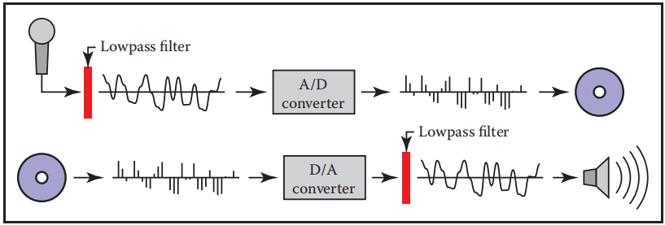

​																											**图9.1 数字音频的采样和重构**

​		结果表明，要达到良好的复制效果，每秒所需的样本数量取决于我们试图录制的声音的音调有多高。如果我们试着录制短笛或钹，一个用于复制弦贝司或踢鼓的采样率会产生奇怪的结果，但这些声音在较高的采样率下可以很好地再现。为了避免这些采样过疏（undersampling） artifact，数字音频记录器对 ADC 的输入进行滤波（filter），以去除可能导致问题的高频。

​		另一种问题出现在输出端。DAC 产生一个电压，当一个新样本进入时电压会发生变化，但在下一个样本之前保持不变，产生一个阶梯形图形。这些台阶就像噪音，增加了一种高频的、依赖信号的嗡嗡声。为了消除这种重构（reconstruction） artifacts，数字音频播放器对 DAC 的输出进行滤波，使波形平滑。

#### 9.1.1 采样 artifacts 和走样（Sampling Artifacts and Aliasing）

​		数字音频记录链可以作为图形学中发生的采样和重构过程的具体模型。图像或其他在图形学中采样信号的应用也会出现同样的采样过疏和重构 artifacts，解决方法也是一样的：采样前滤波，重构时再滤波。

​		图 9.2 显示了由过低的样本频率产生的一种 artifacts的具体示例。这里我们用两个不同的采样频率对一个简单的正弦波进行采样：每周期 10.8 个样本在上面，每周期 1.2 个样本在下面。更高频率产生的一组样本，它捕获的信号显然更好，但低采样率产生的样本与低频正弦波的样本之间是不能辨别的——事实上，面对这组样本，似乎更有可能被解释为低频正弦波。

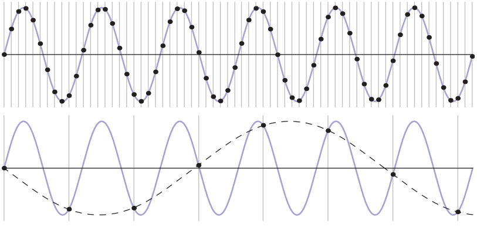

**图9.2 以两种不同频率采样的正弦波（蓝色曲线）。上：在高采样率下，得到的样本（黑点）很好地代表了信号。下：较低的采样率产生一个模糊的结果，这些样本与对频率低得多的波（虚曲线）进行采样所得到的结果完全相同。**

​		一旦采样完成，就不可能知道这两个信号哪个——快或慢的正弦波——是最初的，因此，没有一种方法可以在两种情况下正确地重构信号。因为高频信号 “假装” 是低频信号，这种现象被称为走样（aliasing）。

​		当采样和重构的缺陷导致惊人频率的 artifacts 时，就会出现走样。在音频中，走样的形式是听起来奇怪的额外音调——以 10KHz 的频率响铃在以 8KHz 采样之后，结果是 6KHz 的音调。在图像中，走样通常以摩尔纹（moire pattern）的形式出现，这是由于样本网格与图像中的规则特征相互作用而产生的，例如图 9.34 中的百叶窗。

​		合成图像中另一个走样的例子是熟悉的只用黑白像素渲染的阶梯状直线（图 9.34）。这是一个小尺度特征（线条的尖锐边缘）在不同尺度上（对于浅斜线，楼梯台阶非常长）产生 artifacts 的例子。采样和重构的基本问题可以简单地根据特征太小或太大来理解，但一些更定量的问题更难回答：

- 多高的采样率能确保良好的结果？
- 什么类型的滤波器适合采样和重构？
- 为了避免走样，需要多大程度的平滑？

这些问题的确切答案要等到我们在第 9.5 节中完整发展了这个理论之后。

### 9.2 卷积（Convolution）

​		在讨论采样和重构算法之前，我们先来看看它们所基于的数学概念——卷积。卷积是一个简单的数学概念，它是用于采样、滤波和重构的算法的基础。这也是我们在本章后面分析这些算法的基础。

​		卷积是对函数的一种运算：它取两个函数并将它们组合成一个新的函数。在这本书中，卷积算子用星号表示：对函数 f 和 g 进行卷积的结果是 f * g。我们称之为 f 与 g 卷积，或 f * g 是 f 和 g 的卷积。

​		卷积既可以应用于连续函数（函数 f(x) 为任何实参数 x 定义），也可以应用于离散序列（函数 a[i] 只为整数参数 i 定义）。它也可以应用于一维、二维或更高维域上定义的函数（即具有一个、两个或多个参数的函数）。我们将从离散的一维情况开始，然后继续讨论连续函数以及二维和三维函数。

​		为了方便定义，我们通常假设函数的域是无限的，尽管在实践中它们必须在某个地方停止，而且我们必须以一种特殊的方式处理端点。

#### 9.2.1 移动平均（Moving Averages）

​		为了获得卷积的基本图像，考虑使用移动平均平滑一维函数的例子（图 9.3）。为了得到任意点上的平滑值，我们计算函数在每个方向上延伸距离 r 范围内的平均值。称为平滑操作的半径的距离 r，是一个控制平滑程度的参数。

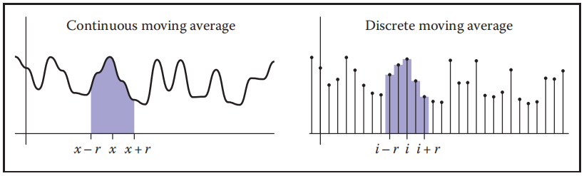

​																											**图9.3 使用移动平均进行平滑。**

​		对于离散或连续函数，我们可以在数学上表述这个概念。如果我们平滑一个连续函数 g(x)，平均意味着在一个区间内对 g 积分然后除以区间的长度：
$$
h(x) = \frac{1}{2r}\int^{x+r}_{x-r}{g(t)dt}
$$
另一方面，如果我们平滑一个离散函数 a[i]，平均意味着对一个索引范围的 a 求和，然后除以值的数量：（式 9.1）
$$
c[i] = \frac{1}{2r+1}\sum^{i+r}_{j=i-r}a[j]
\tag{9.1}
$$
在每种情况下，选择标准化常数，这样如果我们平滑一个常数函数，结果将是相同的函数。

​		移动平均的概念是卷积的本质，唯一的区别是在卷积中移动平均是加权平均。

#### 9.2.2 离散卷积（Discrete Convolution）

​		我们将从卷积最具体的例子开始：将一个离散序列 a[i] 与另一个离散序列 b[i] 卷积。结果是一个离散序列 (a * b)[i]。这个过程就像用一个移动平均平滑 a，但是这次我们没有对距离 r 内的所有样本使用相同的权重，而是使用第二个序列 b 给每个样本赋一个权重（图 9.4）。值 b[i−j] 给出位置 j 的样本权重，该位置与我们计算卷积的下标 i 距离 i-j。以下是 (a*b) 的定义，用公式表示为：（式 9.2）
$$
(a \star{} b)[i] = \sum_{j}a[j]b[i-j]
\tag{9.2}
$$
通过省略 j 的边界，我们指明这个和适用于所有整数（即从 −∞ 到 +∞）。图 9.4 使用 b = 1/16[..., 0, 1, 4, 6, 4, 1, 0, ...] 例子说明了如何计算一个输出样本，即 b[0] = 6/16, a[±1] = 4/16，以此类推。

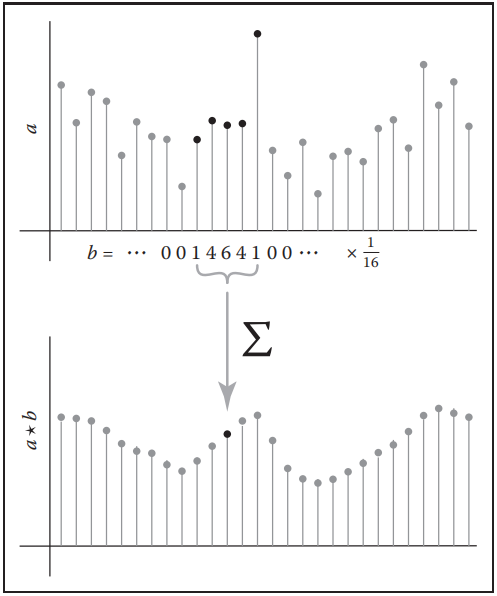

​					**图9.4 计算序列 a 与支持五个样本宽的滤波器 b 的离散卷积中的一个值。a*b 中的每个样本是 a 附近样本用 b 的值进行加权的平均值。**

​		在图形学中，这两个函数中的一个通常具有有限支持（finite support）（如图 9.4 中的示例所示），这意味着它仅在参数值的有限区间内是非零的。若我们假设 b 有有限支持，存在一个半径 r，当 |k| > r 时 b[k] = 0。在这种情况下，我们可以将前面的和写为
$$
(a \star{} b)[i] = \sum^{i+r}_{j=i-r}a[j]b[i-j]
$$
且我们可以用代码来表示这个定义为：

```c++
funtion convolve(sequence a, filter b, int i)
	s = 0
	b = b.radius
	for j = i-r to i+r do
		s = s + a[j]b[i-j]
	return s
```

**卷积滤波器**

​		卷积很重要，因为我们可以用它来进行滤波。回顾我们的第一个滤波例子，移动平均，我们现在可以将平滑操作重新解释为与特定序列的卷积。当我们在有限的下标范围内计算平均值时，这就相当于对这个范围内的所有点进行相同的加权，并对其余的点进行零加权。这种滤波器，在它不为零的区间内有一个常数值，被称为盒子滤波器（因为如果你画出它的图像，看上去就想一个矩形——参见图 9.5）。对于半径为 r 的盒子滤波器，其权重为 1/(2r + 1)：
$$
b[k] = 
\left\{
\begin{array}{}
\frac{1}{2r+1} \qquad{} -r \leq{} k \leq{} r\\
0 \qquad{}\qquad{} otherwise
\end{array}
\right.
$$
如果你将这个滤波器代入方程（9.2），你会发现它退化到方程（9.1）中的移动平均。

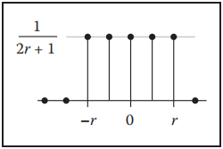

​	 																											**图9.5 一个离散的盒子滤波器**

​		在这个例子中，通常将卷积滤波器的和设计为 1。这样，它们就不会影响信号的整体水平。

**示例（一个盒子和一个阶梯的卷积）** 举一个滤波的简单例子，让信号为阶梯函数（step function）
$$
a[i] = 
\left\{
\begin{array}{}
1 \qquad{} i \ge{} 0\\
0 \qquad{} i \lt{} 0
\end{array}
\right.
$$
滤波器是以 0 为中心的五点盒子滤波器，
$$
b[k] = \frac{1}{5}
\left\{
\begin{array}{}
1 \qquad{} -2 \leq{} k \leq{} 2\\
0 \qquad{} \;\;\;\; otherwise
\end{array}
\right.
$$
a 和 b 的卷积结果是什么？在特定的下标 i 处，如图 9.6 所示，结果是阶梯函数在 i−2 到 i+2 范围内的平均值。如果 i < −2，我们将所有零取平均，结果为零。如果 i ≥ 2，我们取所有 1 的平均值，结果是 1。中间有 i+3 个 1，结果是 (i+3)/5。 输出是一个线性斜坡，从 0  到 1 除以 5 个样本：1/5[..., 0, 0, 1, 2, 3, 4, 5, 5, ...]。

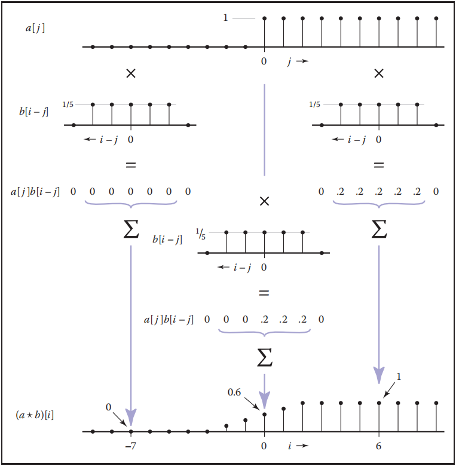

​																								**图9.6 箱形函数与阶梯函数的离散卷积**

**卷积的性质**

​		到目前为止我们写的方法，卷积看起来像是一个非对称运算：a 是我们要平滑的序列，b 提供权重。但是卷积的一个很好的性质是哪个是哪个没有任何区别：滤波器和信号是可互换的。要理解这一点，只需重新考虑式（9.2）中的和，其中下标从滤波器 b 的原点计数，而不是从滤波器 a 的原点计数。也就是说，我们用 i−k 替换 j。这个变量的变化的结果是
$$
\begin{align}
(a \star{} b)[i] &= \sum_{k}a[i-k]b[i-(i-k)] \\ &=\sum_{k}b[k]a[i-k]
\end{align}
$$
​		这与式（9.2）完全相同，但 a 作为滤波器，b 作为信号。所以对于任意序列 a 和 b， (a * b) = (b * a)，我们说卷积是一个可交换的（commutative）运算。（你可能已经注意到卷积和中的一个函数似乎被翻转了——也就是说，b[k] 在序列的前面 k 单位给出了样本的权重，而 b[−k] 在序列的后面 k 单位给出了样本的权重。这样做的原因是为了确保结合律，参见练习 4。我们使用的大多数滤波器都是对称的，所以你几乎不需要担心这个。）

​		更一般地说，卷积是一种 “类似乘法” 的运算。与数字或函数的乘法或加法一样，参数的顺序和括号的位置都不会影响结果。此外，卷积与加法的关系和与乘法的关系是一样的。确切地说，卷积是交换的和结合的，且它满足加法的分配律。
$$
\begin{align}
交换律:\qquad{}\; (a \star{} b)[i] &= (b \star{} a)[i] \\
结合律:\; (a \star{} (b \star{} c))[i] &= ((a \star{} b) \star{} c)[i] \\
分配律:(a \star{} (b + c))[i]& = (a \star{} b + a \star{} c)[i]
\end{align}
$$
如果我们把卷积看作是乘法这些性质是很自然的，了解它们是有用的，因为它们可以帮助我们在实际计算卷积之前通过简化卷积来节省工作。例如，假设我们要用一个序列 a 与三个滤波器 b~1~、b~2~、b~3~ 进行卷积——也就是说，我们想要 ((a * b~1~) * b~2~) * b~3~。

​		作为离散卷积的单位（identity）的一个非常简单的滤波器：它是半径为 0 的离散滤波器，或者序列 d[i] = […, 0, 0, 1, 0, 0, …]（图 9.7）。如果我们用 d 与信号 a 卷积，在和中将只有一个非零项：
$$
\begin{align}
(a \star{} b)[i] &= \sum^{j=i}_{j=i}a[j]d[i-j] \\ &= a[i]
\end{align}
$$
很明显，a 与 d 的卷积会得到 a。这个序列 d 称为离散脉冲（discrete impluse）。它有时在表示滤波器时很有用：例如，用滤波器 b 平滑信号 a，然后从原信号中减去滤波器 b 的过程可以表示为与滤波器 d−b 的单个卷积：
$$
c = a - a \star{} b = a \star{} d - a \star{} b = a \star{} (d - b)
$$
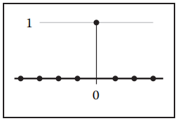

​																													**图9.7 离散单位滤波器。**

#### 9.2.3 卷积作为移位滤波器的和（Convolution as a Sum of Shifted Filters）

​		对式（9.2）还有另一种完全相同的解释方法。每次观察 a*b 的样本就会得到我们已经看到的加权平均解释。但是如果我们省略 [i]，我们可以把和看成是把整个序列加在一起。要做到这一点，需要一个符号：如果 b 是一个序列，那么向右移动 j 位的相同序列称为 b~→j~（图 9.8）：
$$
b_{\rightarrow{}j}[i] = b[i-j]
$$
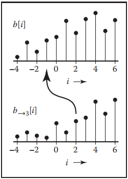

​																													**图9.8 移动序列 b 得到 b~→j~**

然后，我们可以将式（9.2）写成关于整个序列 (a*b) 的陈述，而不是逐个元素：
$$
(a \star{} b) = \sum_{j}a[j]b_{\rightarrow{}j}
$$
从这个角度看，卷积是由 a 的项加权 b 的移位副本的和（图 9.9）。因为交换性，我们可以选择 a 或 b 作为滤波器，如果我们选择 b，那么我们将为输入中的每个样本添加一个滤波器副本。

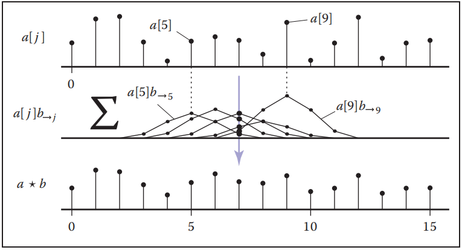

​																							**图9.9 离散卷积作为滤波器的移位副本的和。**

#### 9.2.4 连续函数的卷积（Convolution with Continuous Functions）

​		虽然离散序列确实是我们在计算机程序中使用的，但这些采样序列应该表示连续函数，通常我们需要对连续函数进行数学推理，以便计算出要做什么。因此，定义连续函数之间以及连续函数和离散函数之间的卷积是有用的。

​		两个连续函数的卷积是（9.2）式的明显推广，用积分来代替求和：
$$
(f \star{} g)(x) = \int^{+\infin{}}_{-\infin{}}f(t)g(x-t)dt
\tag{9.3}
$$
一种解释这个定义的方法是在参数 x 处取值的 f 和 g 的卷积，就是平移 g 使 g(0) 与 f(t) 对齐后这两个函数的乘积在曲线下的面积。就像在离散情况下一样，卷积是一个移动平均，滤波器提供平均的权重（见图 9.10）。

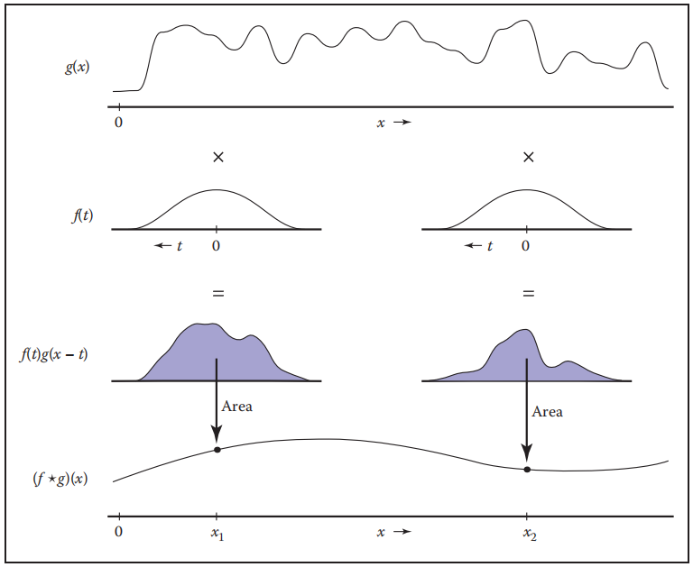

​																															**图9.10 连续卷积**

像离散卷积一样，连续函数的卷积是交换的和结合的，且满足加法分配率。同样，和离散情况一样，连续卷积可以看作是滤波器副本的和，而不是加权平均的计算。只不过，在该情况下，有无限的多个滤波器 g 的副本：
$$
(f \star{} g) = \int^{+\infin{}}_{-\infin{}}f(t)g_{\rightarrow{}t}dt
$$
**示例（两个盒函数的卷积）** 设 f 为盒函数：
$$
f(x) =
\left\{
\begin{array}{}
1 \qquad{} -\frac{1}{2} \leq{} x \lt{} \frac{1}{2}\\
0 \qquad{}\;\;\;\;\;\; otherwise
\end{array}
\right.
$$
然后 f * f 是什么？式 9.3 的定义给出：
$$
(f \star{} f)(x) =\int^{+\infin{}}_{-\infin{}}f(t)f(x-t)dt
$$
图 9.11 展示了这个积分的两种情况。当 x≤−1 或 x≥1 时，两个盒子可能没有重叠，在这种情况下，结果是零。当 −1<x<1 时，重叠取决于两个盒子之间的距离，即 |x|，结果是 1−|x|。因此
$$
(f \star{} f)(x) =
\left\{
\begin{array}{}
1-|x| \qquad{} -1 \lt{} x \lt{} 1\\
0 \qquad{}\qquad{}\;\;\;\;\; otherwise
\end{array}
\right.
$$
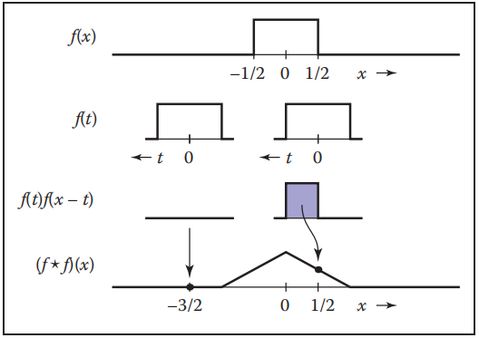

​																								**图9.11 将两个盒子卷积就产生了一个帐篷函数。**

这个函数被称为帐篷函数（tent function），是另一个常见的滤波器（参见 9.3.1 节）。

**狄拉克函数**

​		在离散卷积中，我们看到离散脉冲 d 作为一个单位：d * a = a。在连续的情况下，也有一个单位函数，叫做狄拉克脉冲（Dirac impulse）或者狄拉克函数（Dirac delta function），表示为 δ(x)。

​		直觉来说，脉冲函数是一个非常窄，非常高的尖峰，它有无穷小的宽度，但仍然有等于 1 的面积（图 9.12）。脉冲函数的关键定义性质是，将它乘以一个函数，就会选出精确在 0 处的值：
$$
\int^{+\infin{}}_{-\infin{}}\delta{}(x)f(x)dx = f(0)
$$
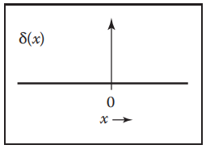

​																													**图9.12 狄拉克函数 δ(x)**

函数在 0 处没有定义明确的值（你可以把它的值看作是+∞），但是对于所有的 x != 0，它有值 δ(x) = 0。

​		从选择单个值的特性可以得出，脉冲函数是连续卷积的单位（图 9.13），因为将 δ 与任意函数 f 进行卷积会产生结果
$$
(\delta{} \star{} f)(x) = \int^{+\infin{}}_{-\infin{}}\delta{}(t)f(x-t)dt = f(x)
$$
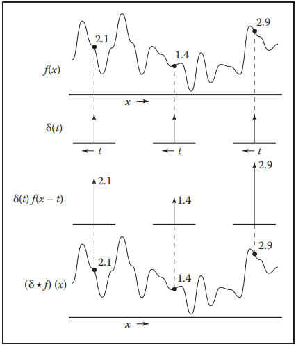

​																							**图9.13 将函数与 δ(x)进行卷积将返回相同函数的副本**

所以 δ * f = f（由于交换性，f * δ 也等于 f）。

#### 9.2.5 离散和连续的卷积（Discrete-Continuous Convolution）

​		有两种方法可以连接离散的和连续的世界。一个是采样：我们将一个连续函数转换成一个离散函数，方法是写下函数在所有整数参数下的值，而忽略其余的。给定一个连续函数 f(x)，我们可以对其进行采样，将其转换为一个离散序列 a[i]：
$$
a[i] = f(i)
$$
反过来，从离散函数，或者说序列，到连续函数，叫做重构（reconstruction）。这是用另一种形式的卷积来完成的，离散到连续形式。在这种情况下，我们用连续滤波器 f(x) 滤波一个离散序列 a[i]：
$$
(a \star{} f)(x) = \sum_{i}a[i]f(x-i)
$$
重构函数 a * f 在 x 处的值是 i 在 x 附近值的样本 a[i] 的加权和（图 9.14）。权值来自滤波器 f，它是在一组以一个单位为间隔的点上计算的。例如，如果 x = 5.3,  f 的半径为 2，则 f 的值为 1.3、0.3、−0.7和−1.7。注意，对于离散到连续卷积，我们通常先写序列，然后写滤波器，这样和就基于整数。

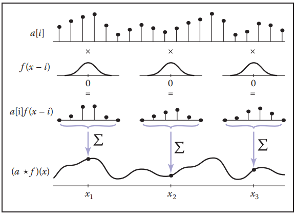

​																													**图9.14 离散到连续卷积**

就像离散卷积一样，如果我们知道滤波器的半径 r，我们就可以给求和设定边界，消除所有 x 和 i 之间的差值至少为 r 的点：
$$
(a \star{} f)(x) = \sum^{\lfloor{}x+r\rfloor{}}_{i=\lceil{}x-r\rceil{}}a[i]f(x-i)
$$
注意，如果一个点恰好落在距离 x 的 r 处（即，如果 x - r 是一个整数），它将被排除在求和之外。这与离散情况相反，在离散情况中，我们包含了 i - r 点。

​		在代码中表示为：

```c++
function reconstruct(sequence a, filter f, real x)
	s = 0
	r = f.radius
	for i = ceil(x-r) to floor(x+r) do
		s = s + a[i]f(x-i)	
	return s
```

其他形式的卷积一样，离散到连续卷积可以看作是对滤波器的移位副本进行求和（图 9.15）
$$
(a \star{} f) = \sum_{i}a[i]f_{\rightarrow{}i}
$$
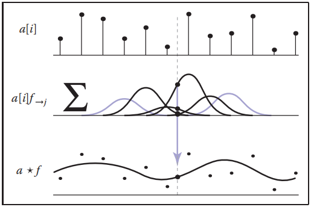

​																						**图9.15 重构（离散到连续卷积）作为滤波器移位副本的和。**

​		离散到连续卷积与样条密切相关。对于均匀样条（例如，均匀 B 样条），样条的参数化曲线恰好是样条的基函数与控制点序列的卷积（见 15.6.2 节）。

#### 9.2.6 超过一维的卷积（Convolution in More Than One Dimension）

​		到目前为止，我们所说的关于采样和重构的一切都是一维的：有一个变量 x 或者一个序列索引 i。然而，在图形学中，采样和重构的许多重要应用都应用于二维函数——特别是二维图像。幸运的是，将采样算法和理论从一维推广到二维、三维及以上，在概念上非常简单。

​		从离散卷积的定义开始，我们可以通过将其求和变为求两次和从一维推广到二维：
$$
(a \star{} b)[i,j] = \sum_{i'}\sum_{j'}a[i',j']b[i-i',j-j']
$$
​		如果 b 是半径为 r 的有限支持滤波器（即它有 (2r + 1)^2^ 个值），则可以将这个求和写成有界的（图 9.16）：
$$
(a \star{} b)[i,j] = \sum^{i+r}_{i'=i-r}\sum^{j+r}_{j'=j-r}a[i',j']b[i-i',j-j']
$$
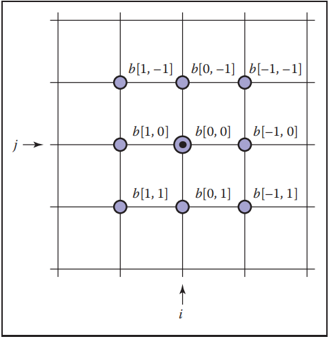

​																**图9.16 用于在点 (i, j) 与半径为 1 的滤波器 b 进行离散卷积的 9 个输入样本的权值 **

用代码表达出来：

```c++
function convolve2d(sequence2d a, filter2d b, int i, int j)
	s = 0
	r = b.radius
	for i'=i-r to i+r do
		for j'=j-r to j+r do
			s = s + a[i'][j']b[i-i'][j-j']
		return s
```

​		这个定义可以用与一维情况相同的方式来解释：每个输出样本都是输入区域的加权平均值，使用 2D 滤波器作为 “掩码” 来确定每个样本在平均中的权重。

​		继续推广，我们也可以在 2D 中写出连续到连续（图 9.17）和离散到连续（图 9.18）卷积：
$$
(f \star{} g)(x,y) = \int{}\int{}f(x',y')g(x-x',y-y')dx'dy' \\
(a \star{} f)(x,y) = \sum_{i}\sum_{j}a[i,j]f(x-i,y-j)
$$
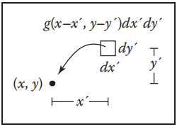

​																			**图9.17  输入信号和 (x, y) 处的连续卷积产生的一个无限小区域的权值**

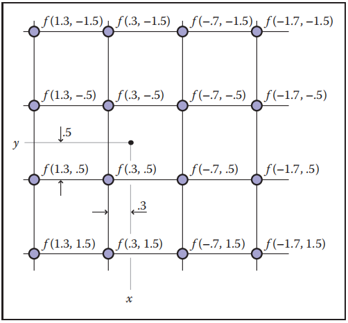

​														**图9.18 对于半径为 2 的重构滤波器，用于在 (x, y) 点的离散到连续卷积的 16 个输入样本的权值**

在每种情况下，特定点的结果是该点附近输入的加权平均值。对于连续到连续的情况，它是一个以该点为中心的区域的加权积分，而在离散到连续的情况下，它是所有落在该点附近的样本的加权平均。

​		一旦我们从 1D 发展到 2D，就应该很清楚如何进一步推广到 3D 甚至更高维度。

### 9.3 卷积滤波器（Convolution Filters）

​		现在我们已经了解了卷积的原理，让我们来研究一些在图形中常用的特殊滤波器。

​		下面的每个滤波器都有一个自然半径，当采样间隔为一个单位时，这是用于采样或重构的默认大小。在本节中，滤波器按此自然大小定义：例如，盒子滤波器的自然半径为 1/2，立方滤波器的自然半径为 2。我们还安排每个滤波器积分为 1：∫^∞^~x=0~f(x)dx = 1，这样可以在不改变信号的平均值的前提下进行采样和重构。

​		正如我们将在 9.4.3 节中看到的，一些应用程序需要不同大小的滤波器，这可以通过缩放基本滤波器获得。对于滤波器 f(x)，我们可以定义缩放 s 的一个版本：
$$
f_{s}(x) = \frac{f(x/s)}{s}
$$
滤波器水平拉伸 s 倍，然后垂直压缩 1/s 倍，使其面积不变。一个自然半径为 r 并用于规模 s 的滤波器，它的支持半径为 sr（参见图 9.20）

#### 9.3.1 卷积滤波器画廊（A Gallery of Convolution Filters）

**盒子滤波器（box filter）**

盒子滤波器（图 9.19）是一个积分为 1 的分段常值函数。作为一个离散滤波器，它可以写成
$$
a_{box,r}[i] =
\left\{
\begin{array}{}
\frac{1}{2r+1} \;\; \qquad{} |i| \le{} r \\
0 \qquad{} otherwise
\end{array}
\right.
$$
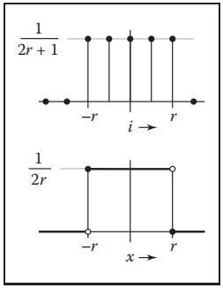

​																												**图9.19 离散和连续盒子滤波器**

​		作为一个连续滤波器，我们写为
$$
f_{box,r}(x) =
\left\{
\begin{array}{}
\frac{1}{2r} \qquad{} -r \le{} x \lt{} r \\
0 \;\;\;\; \qquad{} otherwise
\end{array}
\right.
$$
在本例中，我们排除了一个端点，这使得半径为 0.5 的盒子可用作重构滤波器。因为盒子滤波器是不连续的，这些边界情况很重要，所以对于这个特殊的滤波器我们需要注意它们。我们只用 f~box~ 表示 r = 1 的自然半径。

**帐篷滤波器（tent filter）**

​		帐篷，或线性滤波器（图 9.20），是一个连续的、分段的线性函数：
$$
f_{tent}(x) =
\left\{
\begin{array}{}
1-|x| \qquad{} |x| < 1 \\
0 \;\;\;\; \qquad{} otherwise
\end{array}
\right.
$$
它的自然半径是 1。对于至少为 C^0^ 的滤波器（即值中没有突然的跳跃，就像盒子中那样），我们不再需要分离离散滤波器和连续滤波器的定义：离散滤波器就是在整数处采样的连续滤波器。

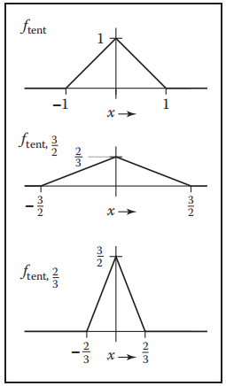

​																							  			**图9.20 帐篷滤波器和两个缩放版本。**

**高斯滤波器（Gaussian filter）**

​		高斯函数（图 9.21），也称为正态分布，在理论上和实践中都是一个重要的滤波器。随着这一章的继续，我们会看到它的更多特殊性质：
$$
f_{g},\sigma{}(x) = \frac{1}{\sigma{}\sqrt{2\pi{}}}e^{-\frac{x^{2}}{2\sigma{}^{2}}}
$$
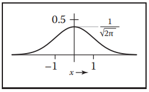

​																														**图9.21 高斯滤波器**

参数 σ 称为标准差。高斯滤波器是很好的采样滤波器，因为它非常平滑，我们将在本章后面更精确地说明这一点。

​		高斯滤波器没有任何特定的自然半径，它是 σ 范围内有用的采样滤波器。高斯也没有一个有限的支持半径，尽管因为指数衰减，它的值迅速变得小到可以忽略。当需要的时候，我们可以通过在半径 r 之外将函数的尾部设置为零来修剪函数的尾部，从而得到修剪高斯函数（trimmed Gaussian）。这意味着滤波器的宽度和自然半径可以根据应用程序的不同而变化，一个按 s 缩放的修剪高斯函数与一个标准偏差为 sσ 和半径为 sr 的没有缩放的未修剪高斯函数相同。在实践中处理这一问题的最佳方法是将 σ 和 r 设置为滤波器的属性，在指定滤波器时加以固定，然后在应用滤波器时将其像其他滤波器一样进行缩放。

*好的初始值是 σ = 1, r = 3。*

**B 样条立方滤波器（B-Spline Cubic Filter）**

​		许多滤波器被定义为分段多项式，四段（自然半径为 2）的立方滤波器常被用作重构滤波器。这样一个滤波器被称为 B 样条滤波器（B-spline filter）（图 9.22），因为它的起源是作为样条曲线的混合函数（见第 15 章）：
$$
f_{B}(x) = \frac{1}{6}
\left\{
\begin{array}{}
-3(1-|x|)^{3} + 3(1-|x|)^{2} + 3(1-|x|)+1 \qquad{} -1 \le{} x \le{} 1 \\
(2-|x|)^{3} \qquad{}\qquad{}\qquad{}\qquad{}\qquad{}\qquad{}\qquad{}\;\; \qquad{} 1 \le{} |x| \le{} 2 \\
0 \qquad{}\qquad{}\qquad{}\qquad{}\qquad{}\qquad{}\qquad{}\qquad{}\qquad{}\; \qquad{} otherwise
\end{array}
\right.
$$
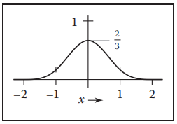

​																														**图9.22 B 样条滤波器**

在分段三次曲线中，B 样条是特殊的，因为它有连续的一阶导数和二阶导数，也就是 C^2^。定义这个滤波器更简洁的方式是 f~B~ = f~box~ * f~box~ * f~box~ * f~box~，证明上面的长形式是等价的是一个很好的卷积练习（参见练习 3）。

**Catmull-Rom 立方滤波器（Catmull-Room cubic filter）**

​		另一个以样条命名的分段立方器 Catmull-Rom 滤波器（图 9.23），在 x=−2、−1、1、2 处的值为零，这意味着当它作为重构滤波器将插值样本（章节 9.3.2）：
$$
f_{C}(x) = \frac{1}{2}
\left\{
\begin{array}{}
-3(1-|x|)^{3} + 4(1-|x|)^{2} + (1-|x|) \qquad{} -1 \le{} x \le{} 1 \\
(2-|x|)^{3} - (2-|x|)^{2} \;\;\qquad{}\qquad{}\qquad{}\;\; \qquad{} 1 \le{} |x| \le{} 2 \\
0 \qquad{}\qquad{}\qquad{}\qquad{}\qquad{}\qquad{}\qquad{}\qquad{}\; \qquad{} otherwise
\end{array}
\right.
$$
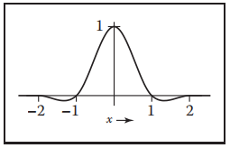

​																												**图9.23 Catmull-Rom 滤波器**

**Mitchell-Netravali 立方滤波器（Mitchell-Netravali 立方滤波器）**

​		对于重采样图像极重要的应用，Mitchell 和 Netravali（Mitchell & Netravali, 1988）对立方滤波器进行了研究，并建议在前两个滤波器之间选择一个中间的滤波器作为最佳的全面选择（图 9.24）。它只是前面两个滤波器的简单加权组合：
$$
\begin{align}
f_{M}(x) &= \frac{1}{3}f_{B}(x) + \frac{2}{3}f_{C}(x) \\
&= \frac{1}{18}
\left\{
\begin{array}{}
-21(1-|x|)^{3} + 27(1-|x|)^{2} + 9(1-|x|) + 1 \qquad{} -1 \le{} x \le{} 1 \\
7(2-|x|)^{3} - 6(2-|x|)^{2} \qquad{}\qquad{}\qquad{}\qquad{}\quad{}\;\; \qquad{} 1 \le{} |x| \le{} 2 \\
0 \qquad{}\qquad{}\qquad{}\qquad{}\qquad{}\qquad{}\qquad{}\qquad{}\qquad{}\quad{}\;\;\; \qquad{} otherwise
\end{array}
\right.
\end{align}
$$
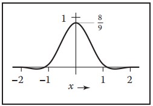

​				  																						**图9.24 Mitchell-Netravali 滤波器**

#### 9.3.2 滤波器的性质（Properties of Filters）

​		滤波器有一些传统的术语伴随着它们，我们用其来描述滤波器，并互相比较。

​		滤波器的脉冲响应（impulse response ）只是函数的另一个名称：它是滤波器对只包含脉冲的信号的响应（回想一下，与脉冲进行卷积就会得到滤波器）。

​		如果得到的函数恰好是采样点上的样本值，连续滤波器就是插值（当它被用来从一个离散序列重构一个连续函数时）——也就是说，它 “连接点” 而不是产生一个只靠近点的函数。插值滤波器就是那些 f(0) = 1 和 f(i) = 0（对于所有非零整数 i）的滤波器（图 9.25）。

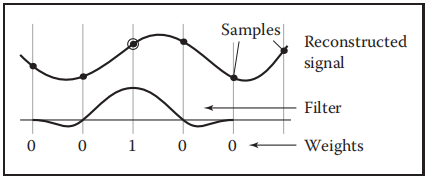

​																	**图9.25 插值滤波器精确地重构采样点，因为它的值在所有从中心的非零整数偏移处为零**

​		取负值的滤波器会产生振铃（ringing）或过冲（overshoot）：它会在被滤波函数的值急剧变化的周围产生额外的振荡。

​		例如，Catmull-Rom 滤波器在两边都有负部分，如果你用它来滤波一个阶梯函数，它会将阶梯扩大一点，导致函数值下冲 0 和过冲 1（假设有0和1两个阶梯，函数值实际都是在 0 或者 1 上，过冲就是有超过 1 或者小于 0 的，下冲就是小于 1 且 大于 0 的）（图 9.26）。

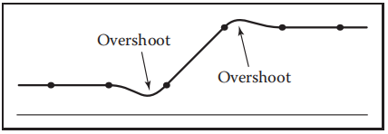

​																	**图9.26 带有负部分的滤波器在滤波或重构尖锐的不连续时总是会产生一些过冲**

​		如果连续滤波器将一个常数序列重构为常数函数（图 9.27），它是无波纹的（ripple free）（当用作重构滤波器时）。这相当于要求滤波器在任何整数间隔网格上的和为 1：
$$
\sum_{i}f(x+i) = 1 \qquad{} for \; all \; x
$$
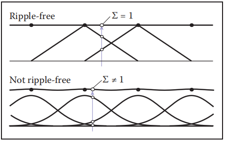

​															**图9.27 半径为 1 的帐篷滤波器为无波纹重构滤波器，标准偏差为 1/2 的高斯滤波器则不是**

除了高斯之外，第 9.3.1 节中的所有滤波器在其自然半径处都是无波纹的，但当它们在非整数范围内使用时，它们都不一定是无纹波的。如果需要在离散到连续卷积中消除纹波纹，是很容易做到的：将每个计算样本除以用于计算它的权重之和：（式 9.4）
$$
(\overline{a \star{} f})(x) = \frac{\sum_{i}a[i]f(x-i)}{\sum_{i}a[i]}
\tag{9.4}
$$
这个表达式仍然可以解释为 a 和滤波器 f 平均之间的卷积（见练习 6）。

​		连续滤波器具有连续性程度（degree of continuity），即处处都有定义的最高阶导数。一个滤波器，像盒子滤波器，其值有突然的跳跃，根本不是连续的。一个连续但有尖角（一阶导数不连续）的滤波器，例如帐篷滤波器，连续阶为零，我们说它是 C^0^。具有连续导数（无尖角）的滤波器，如前一节中的分段立方滤波器，是 C^1^，如果它的二阶导数也是连续的，就像 B 样条滤波器一样，它就是 C^2^。由于重构函数继承了滤波器的连续性，因此重构滤波器的连续性程度对重构滤波器尤为重要。

**可分离的滤波器（Separable Filters）**

​		到目前为止，我们只讨论了用于 1D 卷积的滤波器，但对于图像和其他多维信号，我们也需要滤波器。一般来说，任何 2D 函数都可以是一个 2D 滤波器，偶尔这样定义它们是有用的。但是，在大多数情况下，我们可以从我们已经看到的一维滤波器构建合适的二维（或高维）滤波器。

​		完成这个最有用的方法是使用可分离滤波器。可分离滤波器 f~2~(x, y) 在特定 x 和 y 处的值是简单地 f~1~（1D 滤波器）在 x 和 y 处的值的乘积：
$$
f_{2}(x,y) = f_{1}(x)f_{1}(y)
$$
类似地，对于离散滤波器，
$$
b_{2}[i, j] = b_{1}[i]b_{1}[j]
$$
通过 f~2~ 的任何水平或垂直切片都是 f~1~ 的缩放副本。f~2~ 的积分是 f~1~ 积分的平方，特别地，如果 f~1~ 归一化了，那么 f~2~ 也归一化了

**示例（可分离帐篷滤波器）** 如果我们为 f~1~ 选择帐篷函数，得到的分段双线性函数（图 9.28）为
$$
f_{2,tent}(x,y) =
\left\{
\begin{array}{}
(1-|x|)(1-|y|) \qquad{} |x| < 1,|y| < 1 \\
0 \qquad{}\qquad{}\qquad{}\qquad{} \qquad{} otherwise
\end{array}
\right.
$$
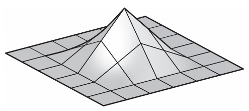

​																													**图9.28 可分离帐篷滤波器**

沿着坐标轴的剖面图是帐篷函数，但沿对角线的剖面图是二次曲线（例如，在正象限沿着直线 x = y，我们看到二次函数 (1 - x)^2^）。

**示例（2D 高斯滤波器）** 如果我们为 f~1~ 选择高斯函数，得到的 2D 函数（图 9.29）是
$$
\begin{align}
f_{2,g}(x,y) &= \frac{1}{2\pi{}}(e^{-\frac{x^{2}}{2}}e^{-\frac{y^{2}}{2}}) \\
&= \frac{1}{2\pi{}}(e^{-\frac{x^{2} + y^{2}}{2}}) \\
&= \frac{1}{2\pi{}}e^{-\frac{r^{2}}{2}}
\end{align}
$$
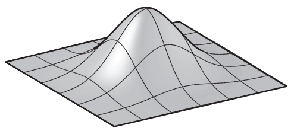

​																								**图9.29 二维高斯滤波器，既可分离又径向对称。**

注意，如果我们将一维高斯函数绕原点旋转，生成一个圆对称的函数，我们得到的函数是相同的（直到一个比例因子）。同时具有圆对称和可分离的性质是高斯函数所独有的。沿着坐标轴的剖面图是高斯分布的，但在从原点任意偏移处沿着任意方向的剖面图也是高斯分布。

​		与其他二维滤波器相比，可分离滤波器的关键优点在于实现效率。我们把 a~2~ 的定义代入到离散卷积的定义中：
$$
(a \star{} b_{2})[i,j] = \sum_{i'}\sum_{j'}a[i',j']b_{1}[i-i']b_{1}[j-j']
$$
注意 b~1~[i-i'] 不依赖于 j'，所以可以从内部和中提取出来
$$
= \sum_{i'}b_{1}[i-i']\sum_{j'}a[i',j']b_{1}[j-j']
$$
​		让我们把内和缩写为 S[i']：（式 9.5）
$$
S[i'] = \sum_{j'}a[i',j']b_{1}[j-j']
$$

$$
(a \star{} b_{2})[i,j] = \sum_{i'}b_{1}[i-i']S[i']
\tag{9.5}
$$

对于这种形式的方程，我们首先可以对每个 i' 计算和存储 S[i']，然后使用这些存储值计算外部和。乍一看，这似乎没有什么了不起的，因为我们仍然需要做与 (2r + 1)^2^ 成比例的工作来计算所有的内部和。然而，如果我们想要计算多个点 [i, j] 的值，情况就大不相同了。

​		假设我们需要 在 [2,2] 和 [3,2] 处计算 a*b~2~，b~1~ 的半径是 2。检查 9.5 式，我们可以看到我们将需要 S[0], …, S[4] 来计算 [2,2] 处的结果，我们需要 S[1], …, S[5] 计算 [3,2] 处的结果。所以，在可分离变量公式中，我们可以只计算总共 6 个 S 值，然后共享 S[1], …, S[4]（图 9.30）。

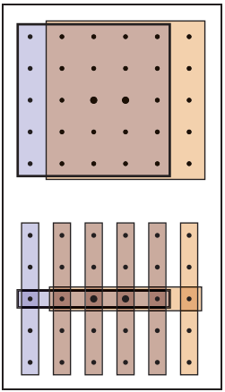

​					**图9.30 使用包含 25 个样本的单独二维数组计算两个输出点（上图）vs 沿着列滤波一次，然后使用 5 个样本的单独一维数组（下图）。**

​		这种节省对于大型滤波器有很大的意义。用半径为 r 的滤波器对图像进行滤波，一般情况下每像素需要 (2r + 1)^2^ 个乘法计算，而用相同大小的可分离滤波器对图像进行滤波则需要 2(2r + 1) 乘法计算（以牺牲一些中间存储为代价）。从 O(r^2^) 到 O(r) 的渐近复杂度的变化使得使用更大的滤波器成为可能.

​		算法是：

```c++
function filterImage(image I, filter b)
	r = b.radius
	nX = I.width
	nY = I.height
	allocate storage array S[0 ... nX-1]
	allocate image Iout[r ... nX-r-1, r ... nY-r-1]
	initialize S and Iout to all zero
	for j=r to nY-r-1 do
		for i'=0 to nX-1 do
			S[i'] = 0
			for j'=j-r to j+r do
				S[i'] = S[i'] + I[i',j']b[j-j']
		for i=r to nX-r-1 do
			for i'=i-r to i+r do
				Iout[i,j] = Iout[i,j] + S[i']b[i-i']
	return Iout
```

​		为简单起见，该函数通过在输出图像的所有四边修剪 r 像素来避免所有边界问题。在实践中，有各种方法来处理边界，参见 9.4.3 节。

### 9.4 图像信号处理（Signal Processing for Images）

​		到目前为止，我们已经讨论了抽象的采样、滤波和重构，主要以一维信号为例。但正如我们在本章开始时所观察到的，信号处理在图形中的最重要和最常见的应用是采样图像。让我们仔细看看这些如何应用于图像。

#### 9.4.1 使用离散滤波器的图像滤波（Image Filtering Using Discrete Filters）

​		也许卷积最简单的应用是使用离散卷积处理图像。图像处理程序的一些最广泛使用的特性是简单的卷积滤波器。图像的模糊可以通过与许多常见的低通滤波器卷积来实现，从盒子到高斯（图 9.31）。高斯滤波器创建一个看着非常光滑的模糊，所以通常用于这个目的。

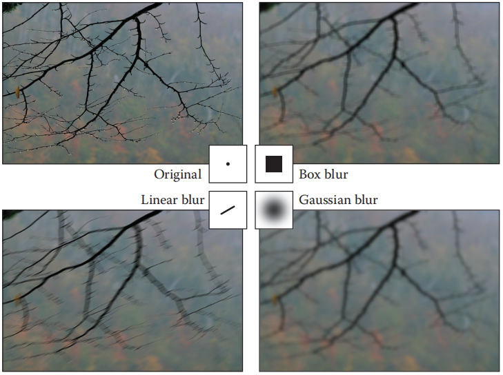

 																						**图9.31 用三个不同的滤波器中的每一个卷积模糊图像。**

​		与模糊相反的是锐化，其中一种方法是使用 “非锐化蒙版” 程序来完成这个：从原始图像中减去模糊图像的 α 分数。为了避免改变整体亮度重新进行了调整，我们有：
$$
\begin{align}
I_{sharp} &= (1 + \alpha{})I - \alpha{}(I \star{} f_{g,\sigma{}}) \\
&= I \star{} ((1+\alpha{})d - \alpha{}f_{g,\sigma{}}) \\
&= I \star{} f_{sharp}(\sigma{}, \alpha{})

\end{align}
$$
其中f~g,σ~ 为宽度 σ 的高斯滤波器。利用离散脉冲 d 和卷积的分配律，我们可以把整个过程写成一个单独的滤波器，它取决于模糊的宽度和锐化的程度（图 9.32）。


​																											**图9.32 使用卷积滤波器锐化图像**

​		结合两个离散滤波器的另一个例子是投影。这是常见的采取一个模糊的，移动的副本的对象的轮廓，以创建一个软投影（图9.33）。我们可以将移位运算表示为与偏离中央的脉冲的卷积：
$$
d_{m,n}(i,j) =
\left\{
\begin{array}{}
1 \qquad{} i = m,j = n \\
0 \quad{} \qquad{} otherwise
\end{array}
\right.
$$


​																														**图9.33 一个软阴影**

移动，然后模糊，是通过与两个滤波器卷积来实现的:
$$
\begin{align}
I_{shadow} &= (I \star{} d_{m,n}) \star{} f_{g,\sigma{}} \\
&= I \star{} (d_{m,n} \star{} f_{g,\sigma{}}) \\
&= I \star{} f_{shadow}(m,n,\sigma{})
\end{align}
$$
在这里，我们使用结合性将两个操作组合成一个带有三个参数的滤波器。

#### 9.4.2 图像采样中的反走样（Antialiasing in Image Sampling）

​		在图像合成中，我们经常有生成图像的采样表示的任务，对于图像我们有一个连续的数学公式（或者至少是一个程序，我们可以用来计算任意点的颜色，而不仅仅是整数像素位置)。光线追踪是一个常见的例子，关于光线追踪和反走样的具体方法在第四章。在信号处理语言中，我们有一个连续的二维信号（图像），我们需要在一个规则的二维格子上采样。如果我们在没有任何特殊措施的情况下对图像进行采样，结果将显示出各种走样 artifacts（图 9.34）。在图像的尖锐边缘，我们看到阶梯状的 artifacts，称为 “锯齿（jaggies）”。在有重复图案的区域，我们看到被称为摩尔纹（moire patterns）的宽条纹。

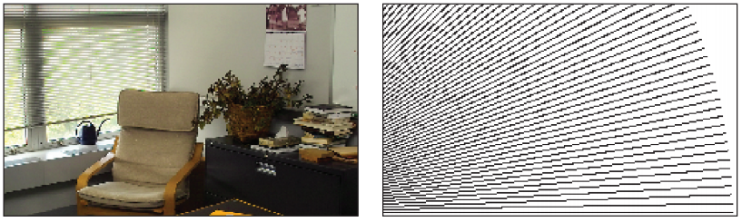

​															**图9.34 图像中的两个 artifacts：周期性纹理中的摩尔纹（左图），和直线上的锯齿（右图）**

​		这里的问题是图像包含了太多的小尺度特征，我们需要在采样前通滤波波使其平滑。回顾（9.3）式中连续卷积的定义，我们需要在像素位置周围的区域上平均图像，而不仅仅是在单个点上取值。具体的方法在第 4 章中讨论。一个简单的滤波，像盒子，将改善锐利边缘的外观，但它仍然产生一些摩尔纹（图 9.35）。非常平滑的高斯滤波器，在整体上稍微更模糊的代价上更有效的去抵抗摩尔纹。这两个例子说明了清晰度和走样之间的权衡，这是选择反走样滤波器的基础。

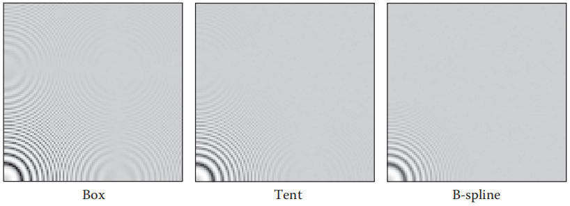

​								**图9.35 比较三种不同的采样滤波器用于反走样一个困难的测试图像，图像包含圆圈，因为它们变得更大间距所以越来越近**

#### 9.4.3 重构和重采样（Reconstruction and Resampling）

​		最常见的且仔细滤波是至关重要的图像操作之一是重采样——改变采样率，或改变图像大小。

​		假设我们用一个 3000 × 2000 像素的数码相机拍摄了一张图像，我们想在一个只有 1280 × 1024 像素的显示器上显示它。为了使它适配，同时保持 3:2 的宽高比，我们需要重新采样到 1278 × 852 像素。我们该怎么做呢?

​		解决这个问题的一种方法是将这个过程看作是像素下降：其大小比率在 2 和 3 之间，所以我们必须在保留的像素之间去掉一到两个像素。可以用这种方法缩小图像，但结果的质量很低——图 9.34 中的图像是使用像素下降制作的。然而，像素下降非常快，在交互操作期间预览调整大小的图像是一个合理的选择。

​		我们可以把调整图像大小看作是一个重采样操作：我们想要在一个特定网格上的图像的一组样本，该网格由新的图像维度定义，我们通过对输入样本重构的连续函数进行采样来获得它们（图 9.36）。从这个角度看，它只是一系列标准的图像处理操作：首先，我们从输入样本重构一个连续函数，然后我们对这个函数进行采样就像对其他连续图像进行采样一样。为了避免 artifacts，需要在每个阶段使用适当的滤波器。

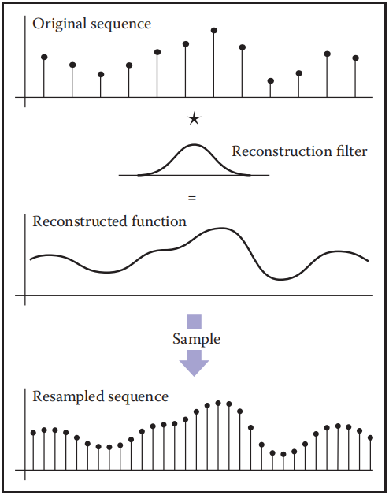

**图9.36 对图像的重新采样由两个逻辑步骤组成，并在代码中合并为单个操作。 首先，我们使用重构滤波器从输入样本定义一个平滑的连续函数。然后，我们在一个新的网格上对该函数进行采样以获得输出样本。**

​		一个小例子如图 9.37 所示：如果原始图像是 12 x 9 像素且新的图像是 8 x 6 像素，每个维度的输出像素是输入像素的 2/3，所以它们在图像上的间距是原始样本间距的 3/2。

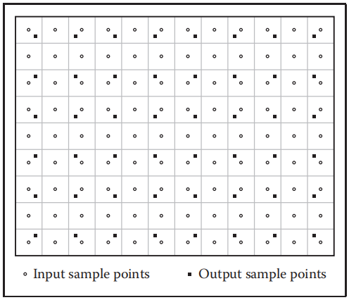

​													**图9.37 在对一个 12 × 9 的图像进行重采样以生成一个 8 × 6 的图像时，输入和输出网格的样本位置。**

​		为了得到每个输出样本的值，我们需要以某种方式对图形计算样本之间的值。像素下降算法为我们提供了一种方法：只需要在输入图像中取最近的样本值并将其作为输出值。这完全相当于用 1 像素宽（半径为 1/2）的盒子滤波器重构图像，然后进行点采样。

​		当然，如果选择像素下降或其他非常简单的滤波的主要原因是性能，那么就不会将该方法作为一般重构和重采样程序的特殊情况来实现。事实上，由于不连续性，很难使盒子滤波器在一般框架下工作。但是，对于高质量的重采样，重构/采样框架提供了宝贵的灵活性。

​		要弄懂算法的细节，最简单的方法是降至 1D 并讨论重新采样一个序列。编写一个实现的最简单方法是使用 9.2.5 节中定义的重构函数。

```c++
function resample(sequence a, float x0, float deltaX, int n, filter f)
	create sequence b of length n
	for i=0 to n-1 do
		b[i] = reconstruct(a,f,x0+i*deltaX)
	return b
```

​		参数 x~0~ 根据旧序列的样本给出新序列的第一个样本的位置。也就是说，如果第一个输出样本位于输入序列中的样本 3 和样本 4 之间，则 x~0~ 为 3.5。

​		该程序通过将输入序列与连续滤波器进行卷积，然后对其进行点采样来重构连续图像。这并不是说这两个操作是顺序发生的——连续函数仅在原理上存在，其值仅在采样点处计算。但在数学上，这个函数计算函数 a*f 的一组点样本。

​		这个点采样似乎是错误的，因为我们刚刚说过信号应该用适当的平滑滤波器进行采样以避免走样。我们应该将重构函数与采样滤波器 g 进行卷积，所以点采样为 g * (f * a) 。但是因为这个和 (g * f) * a 一样，我们可以把采样滤波器和重构滤波器放在一起，我们总共只需要一个卷积运算（图 9.38）。这种重构和采样滤波器的组合称为重采样滤波器（resampling filter）。

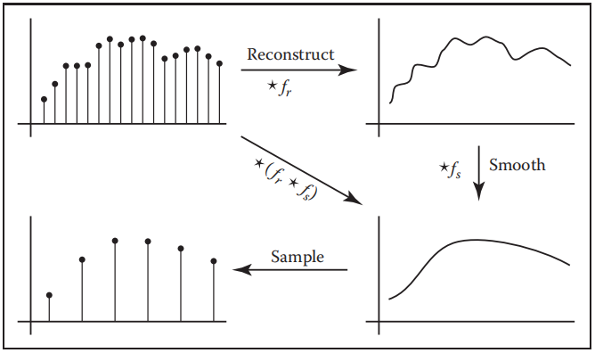

**图9.38 重采样包括对重构和采样进行滤波。由于顺序应用的两个卷积滤波器可以用一个滤波器代替，所以我们只需要一个重采样滤波器，它起到重构和采样的作用。**

​		当对图像进行重新采样时，我们通常用旧图像的单位指定源矩形（source rectangle），其指定我们想要保留在新图像中的部分。例如，使用第 3 章中的像素样本定位约定，我们用于重新采样整个图像的矩形是 (−0.5, n~x~^old^-0.5) x (-0.5, n~y~^old^-0.5)。给定源矩形 (x~l~, x~h~) × (y~l~, y~h~)，新图像样本的 x 间距 Δx = (x~h~ - x~l~)/n~x~^new^，y 间距 Δy =  (y~h~ - y~l~)/n~y~^new^。左下角的样本位于 (x~l~ + Δx/2, y~l~ + Δy/2)。

​		修改 1D 伪代码以使用此约定，并将对重构函数的调用扩展到隐含的双循环中，我们得到

```c++
function resample(sequence a, float xl, float xh, int n, filter f)
	create sequence b of length n
	r = f.radius
	x0 = xl + deltaX/2
	for i=0 to n-1 do
		s = 0
		x = x0 + i * deltaX
		for j=ceil(x-r) to floor(x+r) do
			s = s + a[j] * f(x-j)
		b[i] = s;
	return b;
```

这个例程包含了重新采样图像的所有基础。最后一个有待解决的问题是在图像边缘做什么，在这里简单版本将访问超出输入序列的边界。我们可以做几件事：

- 在序列的末尾停止循环。这相当于在图像的所有边填充零。
- 将所有数组访问剪辑到序列的末尾——也就是说，当我们想要访问 a[−1] 时返回 a[0]。这相当于通过扩展最后一行或一列来填充图像的边缘。
- 当我们接近边缘时修改滤波器，使其不会超出序列的边界。

第一种方法导致当我们重新采样整个图像时边缘变暗，这不是真正令人满意的。第二种方法很容易实现，第三种可能是表现最好的。修改靠近图像边缘的滤波器最简单的方法是对其进行重正化（renormalize）：将滤波器除以图像中部分滤波器的总和。这样，滤波器在实际图像样本上的总和始终为 1，所以它保持了图像的强度。为了提高性能，最好将边缘（需要重正化）与中心（包含更多像素且不需要重正化）的滤波半径内的像素带分开处理。

​		重采样滤波器的选择是很重要的。有两个独立的问题：滤波器的形状和大小（半径）。由于滤波器既可作为重构滤波器又可作为采样滤波器，因此这两种角色的要求都会影响滤波器的选择。对于重构，我们希望滤波器足够平滑，以避免在放大图像时产生走样，并且滤波器应该是无波纹的。采样时，滤波器应足够大，以避免采样过疏，并足够光滑以避免摩尔纹。图 9.39 说明了这两种不同的需求。

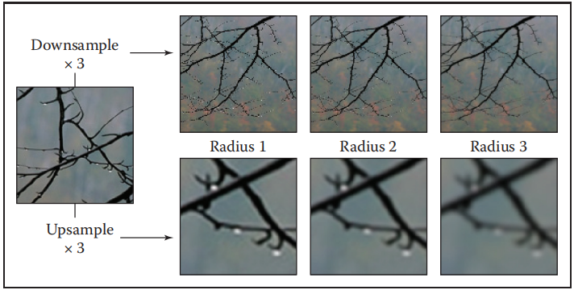

​																	**图9.39 使用不同大小的滤波器对图像进行上采样（放大）或下采样（缩小）的效果。**

​		一般情况下，我们会根据输入和输出的相对分辨率选择一个滤波器形状，并将其缩放。两个分辨率中较低的决定了滤波器的大小：当输出比输入采样更粗糙时（下采样，或缩小图像），适当采样所需的平滑大于重构所需的平滑，因此我们根据输出样本间距（图 9.39 中的半径 3）来调整滤波器的大小。另一方面，当输出更精细采样（上采样，或放大图片）然后重构所需的平滑占主导（重构函数已经足够光滑去以比它开始以更高的频率采样），所以滤波器的大小是由输入样本间距决定（图 9.39 中的半径 1）。

​		选择滤波器本身就是在速度和质量之间的权衡。常见的选择有盒子滤波器（当速度是最重要的），帐篷滤波器（质量中等），或分段立方滤波器（质量优秀）。在分段立方的情况下，可以通过在 f~B~ 和 f~C~ 之间插值来调整平滑程度，Mitchell-Netravali 滤波器是一个很好的选择。

​		与图像滤波一样，可分离滤波器可以提供显著的加速。其基本思想是首先对所有行进行重新采样，生成一个宽度变化但高度不变的图像，然后对该图像的列进行重新采样以生成最终结果（图 9.40）。修改前面给出的伪代码使其利用这种优化是相当简单的。

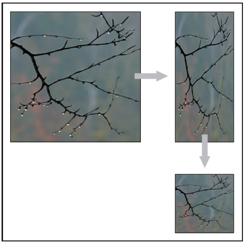

​																									**图9.40 使用可分离方法对图像进行重采样**

### 9.5 采样理论（Sampling Theory）

​		如果您只对实现感兴趣，可以在这里停止阅读，前面几节中的算法和建议将让您实现执行采样和重构并获得出色结果的程序。然而，采样有一个更深层次的数学理论，其历史可以追溯到采样表示在通讯中的第一次使用。采样理论回答了许多严格基于规模参数的推理难以回答的问题。

​		但最重要的是，采样理论为采样和重构工作提供了有价值的见解。它为学习它的学生提供了一套额外的智力工具，用于推理如何用最有效的代码实现最佳结果。

#### 9.5.1 傅里叶变换（The Fourier Transform）

​		傅里叶变换和卷积是构成采样理论的主要数学概念。你可以在很多关于分析的数学书中读到傅里叶变换，也可以在关于信号处理的书中读到。

​		傅里叶变换背后的基本思想是通过将所有频率的正弦波（正弦曲线）相加来表示任何函数。通过为不同的频率使用适当的权重，我们可以安排正弦曲线相加为我们想要的任何（合理的）函数。

​		例如，图 9.41 中的方波可以用正弦波序列表示：
$$
\sum^{\infin{}}_{n=1,3,5...}\frac{4}{\pi{}n}\sin{2\pi{}nx}
$$
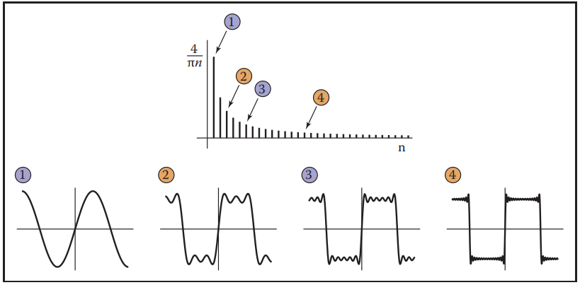

​																											**图9.41 用有限正弦的和近似方波。**

这个傅里叶级数（Fourier series）从频率为 1.0 的正弦波（sin(2πx)）开始——与方波相同——剩下的项加上越来越小的修正以减少波纹，在极限情况下精确地再现方波。注意，和中的所有项的频率都是方波频率的整数倍。这是因为其他频率产生的结果与方波的周期不同。

​		一个令人惊讶的事实是，一个为了以这种方式表示为正弦曲线的和的信号并不一定是周期性的：非周期信号仅需要更多的正弦曲线。我们不是对一个离散的正弦序列求和，而是对一族连续的正弦波积分。例如，一个盒函数可以写成一族余弦波的积分：（式 9.6）
$$
\int^{\infin{}}_{-\infin{}}\frac{\sin{\pi{}u}}{\pi{}u}\cos{2\pi{}uxdu}
\tag{9.6}
$$
​		（9.6）式中的积分是无穷多个余弦相加，以权重 (sin(πu))/πu 给频率为 u 的余弦加权。当我们包含越来越高的频率时，其结果收敛于盒函数（参见图 9.42）。当频率为 u 的函数 f 用这种方式、这个权值表示时，叫做 f 的傅里叶变换，记作 fˆ。函数 fˆ 告诉我们如何通过对一族正弦积分来构造 f：（式 9.7）
$$
f(x) = \int^{\infin{}}_{-\infin{}}\hat{f}(u)e^{2\pi{}iux}du
\tag{9.7}
$$
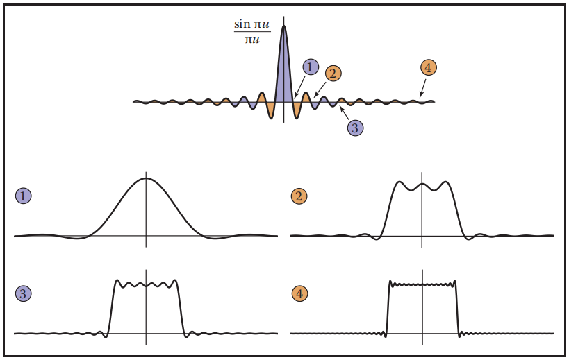

​																					**图9.42 用四个截止频率的余弦积分近似一个盒函数。**

方程（9.7）被称为傅里叶逆变换（inverse Fourier transform，IFT)，因为它从 f 的傅里叶变换开始，以 f 结束。（注意，术语 “傅里叶变换” 既用于函数 fˆ，也用于从 f 求出 fˆ 的运算。不幸的是，这种相当模糊的用法是标准的）

​		注意，在（9.7）式中，复指数 e^2πiux^ 已经代替了前一个方程中的余弦。此外，fˆ 是一个复数值函数。为了控制正弦波的相位和频率，需要使用复数机制，这对于表示任何在零上不对称的函数是必要的。fˆ 的大小被称为傅里叶频谱（Fourier spectrum），对于我们的目的来说，这已经足够了——我们不需要担心相位或者直接使用任何复数。

​		从 f 中计算 fˆ 和从 fˆ 中计算 f 非常相似：（式 9.8）
$$
\hat{f}(u) = \int^{\infin{}}_{-\infin{}}f(x)e^{-2\pi{}iux}dx
\tag{9.8}
$$
式（9.8）称为（正向）傅里叶变换（FT）。指数中的符号是傅里叶正变换和逆变换之间的唯一区别，这实际上只是一个技术细节。出于我们的目的，我们可以把 FT 和 IFT 看作是相同的运算。

​		有时 f - (fˆ) 的符号很不方便，所以我们将 f 的傅里叶变换表示为 F{f}，逆变换 fˆ 为 F^-1^{fˆ}。

​		一个函数和它的傅里叶变换有许多有用的联系。我们将在本章后面用到的一些事实（大部分很容易证明）是：

- 一个函数和它的傅里叶变换有相同的平方积分：
  $$
  \int{}(f(x))^{2}dx = \int{}(\hat{f}(u))^{2}du
  $$
  物理上的解释是两者具有相同的能量（图 9.43）。

  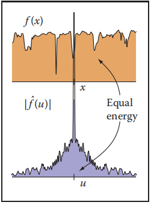

  ​																			 					**图9.43 傅里叶变换保持了信号的平方积分。**

  特别地，将一个函数扩大 a 倍也将其傅里叶变换乘以 a。即 F{af} = aF{f}。

- 沿着 x 轴拉伸一个函数和将其傅里叶变换沿 u 轴压缩有相同的因子（图 9.44）：
  $$
  F\{f(\frac{x}{b})\} = b\hat{f}(bx)
  $$
  （为了保持能量不变，需要将 b 重正化。）

  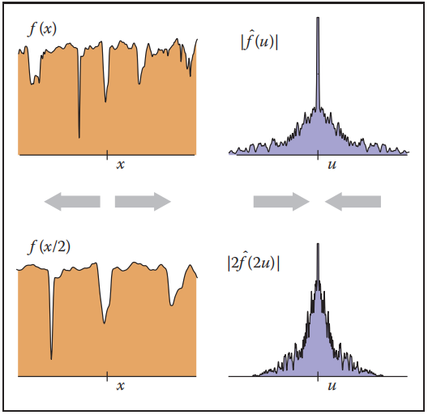

  ​																				**图9.44 在空间域中沿 x 轴缩放信号会导致在频域沿 u 轴的反缩放**

  这意味着如果我们对一族不同宽度和高度的函数感兴趣（比如所有盒函数都以 0 为中心），然后我们只需要知道一个标准函数的傅里叶变换（比如说宽度和高度都等于 1 的盒函数)，我们就可以很容易地知道这个函数的所有缩放和膨胀版本的傅里叶变换。例如，我们可以立即将式（9.6）推广，得到宽 b 高 a 的盒函数的傅里叶变换：
  $$
  ab\frac{\sin{\pi{}bu}}{\pi{}bu}
  $$

- f 的平均值等于 fˆ(0)。这是有意义的，因为 fˆ(0) 被认为是信号的零频率分量（如果我们考虑一个电压，那么它就是直流（DC）分量）。

- 如果 f 是实数（对我们来说总是实数），fˆ 是偶函数——也就是说，fˆ(u) = fˆ(−u)。同样地，如果 f 是偶函数，那么 fˆ 就是实数（这在我们的定义域中并不常见，但记住我们只关心 fˆ 的大小）。

#### 9.5.2 卷积和傅里叶变换（Convolution and the Fourier Transform）

​		傅里叶变换最后一个值得特别提及的性质是它与卷积的关系（图 9.45）。简单来说，
$$
F\{f \star{} g\} = \hat{f}\hat{g}
$$
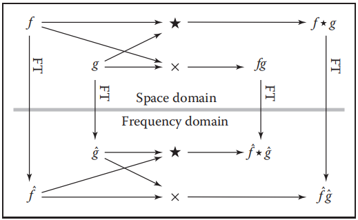

**图9.45 一个交换图直观地显示了卷积和乘法之间的关系。如果我们在空间中乘以 f 和 g，然后转换到频率，我们最终会得到和我们把 f 和 g 转换到频率然后卷积它们一样的地方。同样地，如果我们在空间中卷积 f 和 g 然后转换成频率，我们最终会得到和我们把 f 和 g 转换成频率然后相乘一样的地方。**

两个函数的卷积的傅里叶变换是傅里叶变换的乘积。遵循我们现在熟悉的对称性
$$
\hat{f} \star{} \hat{g} = F\{fg\}
$$
两个傅里叶变换的卷积就是两个函数乘积的傅里叶变换。从定义中推导出这些事实是相当简单的。

​		这种关系是傅里叶变换在研究采样和重构效果时有用的主要原因。我们已经看到了如何用卷积来看待采样、滤波和重构，现在傅里叶变换给了我们一个新的域——频域——这些运算在里面只是乘积。

#### 9.5.3 傅里叶变换的画廊（A Gallery of Fourier Transforms）

​		现在我们有了傅里叶变换的一些事实，让我们看一些单独函数的例子。特别地，我们将看看 9.3.1 节中的一些滤波器，它们的傅里叶变换如图 9.46 所示。我们已经看过盒函数了：
$$
F\{f_{box}\} = \frac{\sin{\pi{}u}}{\pi{}u} = \rm{sinc} \; \pi{}u
$$
函数（你可能注意到 sin πu/πu 在 u = 0 时是没有定义的。然而，它是在 0 上连续的，在 u = 0 处，我们把它理解为我们使用这个比值的极限值 1。） sinx/x 很重要，有它自己的名字，sinc x。

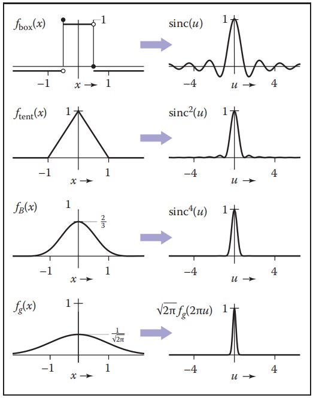

​										  												**图9.46 盒子、帐篷、B 样条和高斯滤波器的傅里叶变换。**

​		帐篷函数是盒子与自身的卷积，所以它的傅里叶变换就是盒子函数傅里叶变换的平方：
$$
F\{f_{tent}\} = \frac{\sin^{2}{\pi{}u}}{\pi{}^{2}u^{2}} = \rm{sinc^{2}} \; \pi{}u
$$
​		我们可以继续这个过程来得到 B 样条滤波器的傅里叶变换（参见练习 3）：
$$
F\{f_{B}\} = \frac{\sin^{4}{\pi{}u}}{\pi{}^{4}u^{4}} = \rm{sinc^{4}} \; \pi{}u
$$
​		高斯函数有一个特别好的傅里叶变换：
$$
F\{f_{G}\} = e^{-\frac{(2\pi{}u)^{2}}{2}}
$$
这是另一个高斯！标准差为 1.0 的高斯变成了标准差为 1/2π 的高斯

#### 9.5.1 采样理论中的狄拉克脉冲（Dirac Impulses in Sampling Theory）

​		脉冲在采样理论中有用的原因是我们可以用它们来讨论连续函数和傅里叶变换中的样本。我们表示一个样本，它有一个位置和一个值，可以用一个平移到那个位置并按那个值缩放的脉冲表示。这样我们就可以将函数 f(x) 在 a 处的采样运算表示为 f 乘以 δ(x - a)。结果是 f(a)δ(x−a)。

​		因此，在一系列等间距的点上对函数进行采样可以表示为将函数乘以一系列等间距脉冲的和，称为脉冲序列（impulse train）（图 9.47）。一个周期为 T 的脉冲序列，意味着脉冲间隔为 T：
$$
s_{T}(x) = \sum^{\infin{}}_{i = -\infin{}}\delta{}(x - Ti)
$$
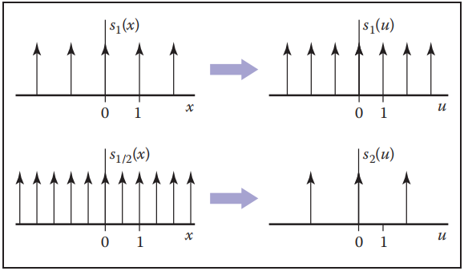

​						**图9.47 脉冲序列。一个脉冲序列的傅里叶变换是另一个脉冲序列。在空间上改变脉冲序列的周期会引起频率周期的反向变化**

s~1~ 的傅里叶变换和 s~1~ 相同：所有整数频率的脉冲序列。当我们把脉冲序列乘以正弦信号并积分时，通过思考会发生什么，你们可以看到为什么这是正确的。我们最后把所有整数处的正弦值加起来。对于非整数频率，这个和正好抵消为零，对于整数频率，它发散为 +∞。

​		由于傅里叶变换的膨胀特性，我们可以猜测周期为 T 的脉冲序列（类似于 s~1~ 的膨胀）的傅里叶变换是周期为 1/T 的脉冲序列。在空间域中采样越精细，脉冲在频域中的距离就越远。

#### 9.5.5 采样和走样（Sampling and Aliasing）

​		现在我们已经建立了数学机制，我们需要从频域的观点来理解采样和重构过程。引入傅里叶变换的关键优点是，它使卷积滤波对信号的影响更加清晰，并且更精确地解释了采样和重构时为什么需要滤波。

​		我们从原始的连续信号开始这个过程。一般来说，它的傅里叶变换可以包含任何频率的分量，尽管对于大多数类型的信号（尤其是图像），我们预计其内容会随着频率的增加而减少。图像也倾向于在零频率有一个很大的分量——记住零频率分量，或DC，是整个图像的积分，因为图像都是正的值，这往往是一个很大的数字。

​		让我们看看傅里叶变换会发生什么如果我们不做任何特殊的滤波去采样和重构（图 9.48）。当我们对信号进行采样时，我们将运算模型化为与脉冲序列的乘法运算，采样信号为 f~sT~。由于卷积乘法特性，采样信号的 FT 为 fˆ * (sT)ˆ = fˆ * (s~1~/T)ˆ。

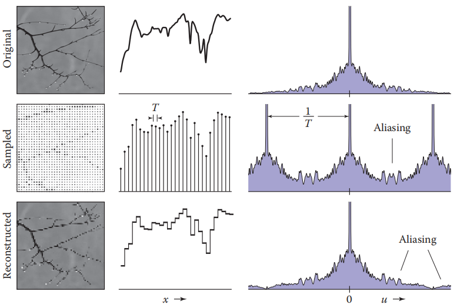

**图9.48 无滤波的采样和重构。采样产生基频谱上重叠和混合的杂频谱。用盒子滤波器重构可以从杂频谱中收集更多的信息。其结果是一个具有严重走样 artifacts 的信号**

​		回想一下，δ 是卷积的单位。这意味着
$$
(\hat{f} \star{} \frac{s_{1}}{T})(u) = \sum^{\infin{}}_{i=-\infin{}}\hat{f}(u-\frac{i}{T})
$$
也就是说，与脉冲序列卷积会得到一整系列等间距的 f 的频谱副本。这个看似奇怪的结果的一个好的直观解释是,所有这些副本只是表达一个事实（正如我们在 9.1.1 节看到的），我们已经采样的频率和采样频率相差整数倍的频率是无法区分的——他们会产生完全相同的样本集。原始频谱称为基频谱（base spectrum）这些副本被称为杂频谱（alias spectra）。

​		如果这些信号频谱的副本重叠，问题就开始了，而如果信号包含任何超过样本频率一半的重要内容，就会发生重叠。当这种情况发生时，频谱相加，不同频率的信息不可逆地混合在一起。这是第一个可能发生走样的地方，如果它发生在这里，它是由于采样过疏——使用过低的频率对信号采样。

​		假设我们用最近邻技术重构信号。这相当于与宽度为 1 的盒子进行卷积（用于实现这一目的的离散到连续卷积与与表示样本的脉冲序列的连续卷积相同)。卷积乘法性质意味着，重构信号的频谱将是采样信号的频谱与盒子的频谱的乘积。得到的重构傅里叶变换包含了基频谱（尽管在较高的频率上有些衰减），加上所有杂频谱的衰减副本。因为盒子有一个相当宽的傅里叶变换，这些衰减的伪谱是重要的，且它们是第二种走样形式，由于一个不适当的重构滤波器。这些伪分量在图像中表现为具有最近邻重构特征的正方形图案。

**防止采样中的走样（Preventing Aliasing in Sampling）**

​		为了实现高质量的采样和重构，我们发现我们需要选择合适的采样和重构滤波器。从频域的角度来看，采样时低通滤波的目的是限制信号的频率范围，使杂频谱不与基频谱重叠。图 9.49 显示了采样信号的傅里叶变换上的采样率的影响。较高的采样率使杂频谱分离得更远，最终留下的重叠部分都无关紧要。

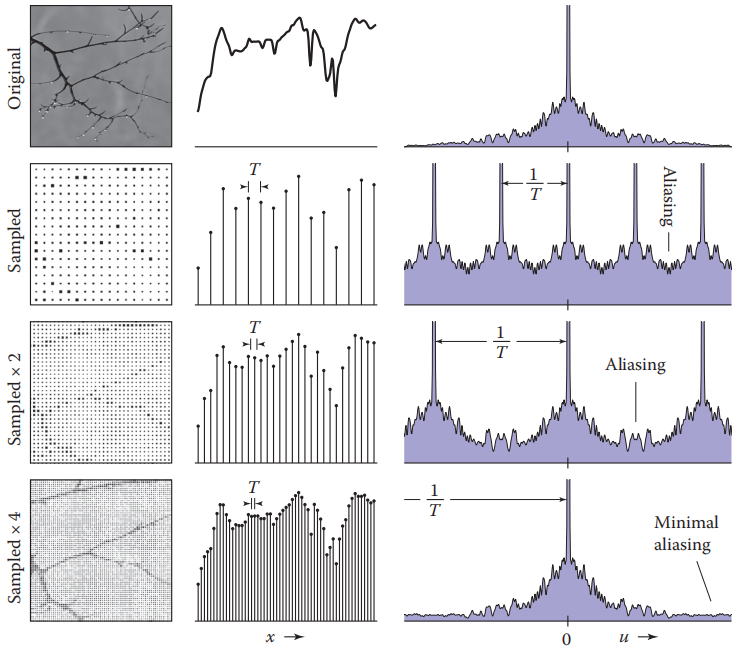

​													**图9.49 采样率对采样信号频谱的影响。较高的采样率会将频谱的副本分开，从而减少重叠造成的问题。**

​		关键的标准是频谱的宽度必须小于拷贝之间的距离——即，信号中的最高频率必须小于样本频率的一半。这被称为奈奎斯特准则（Nyquist criterion），最高允许频率被称为奈奎斯特频率（Nyquist frequency）或奈奎斯特极限（Nyquist limit）。奈奎斯特-香农采样定理（Nyquist-Shannon sampling theorem）表明，一个频率不超过奈奎斯特极限的信号（或者，换句话说，一个带宽限制在奈奎斯特频率的信号），原则上可以从样本中精确地重构。

​		对于有足够高采样率的一个特定信号，我们不需要使用采样滤波器。但是，如果我们遇到的是一个频率范围很广的信号（比如一幅边缘尖锐的图像)，我们必须在采样之前使用一个采样滤波器来带宽限制信号。图 9.50 显示了三个低通（平滑）滤波器在频域的效果，图 9.51 显示了采样时使用这些相同滤波器的效果。即使频谱在没有滤波的情况下重叠，用低通滤波器对信号进行卷积也可以将频谱缩小到足以消除重叠，并产生滤波后信号的良好采样表示。当然，我们失去了高频信号，但总比让它们被信号干扰变成 artifacts 强。

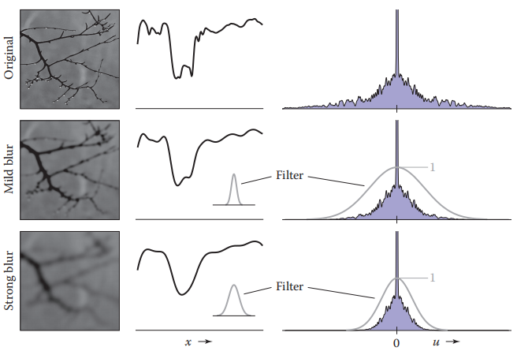

​																								**图9.50 应用低通（平滑）滤波器缩小信号的频谱。**

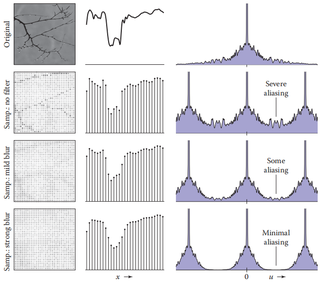

​				**图9.51 图 9.50 中的低通滤波器如何在采样期间防止走样。低通滤波使频谱变窄，致使复制的重叠更少，杂频谱的高频对基频谱的干扰更小。**

**防止重构中的走样（Preventing Aliasing in Reconstruction）**

​		从频域的角度来看，重构滤波器的工作是在保留基频谱的同时去除杂频谱。在图 9.48 中，我们可以看到，最粗糙的重构滤波器，盒子，确实会衰减杂频谱。最重要的是，它完全阻断了所有杂频谱的直流峰值（DC spike）。这是所有合理的重构滤波器的特点：它们在采样频率的所有倍数的频率空间中都有零。这结果等价于空间域中的无波纹性质。

​		因此，一个好的重构滤波器需要是一个好的低通滤波器，同时还有完全阻断采样频率的所有倍数的附加需求。采用与盒子滤波器不同的重构滤波器的目的是为了更彻底地消除杂频谱，减少高频 artifacts 泄漏到重构信号中，同时尽可能地减少对基频谱的干扰。图 9.52 显示了在重构过程中使用不同滤波器的效果。正如我们所看到的，盒子滤波器是相当 “漏” 的，即使取样率足够高，也会导致大量的 artifacts。帐篷滤波器，导致线性插值，衰减高频更多，导致更温和的 artifacts，而 B 样条滤波器非常平滑，能有效地控制杂频谱。它也平滑了一些基频谱，这是我们之前看到过的平滑和走样之间的权衡。

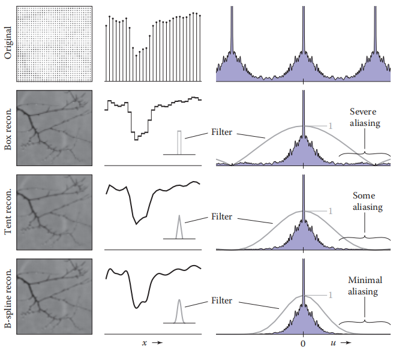

​														**图9.52 不同重构滤波器在频域的影响。好的重构滤波器能有效地衰减杂频谱，同时保留基频谱**

**防止重采样中的走样（Preventing Aliasing in Resampling）**

​		当重构和采样操作在重采样中结合时，同样的原理也适用，只是一个滤波器同时做重构和采样工作。图 9.53 说明了重采样滤波器必须去除杂频谱，且使频谱足够窄来用新的采样率进行采样。

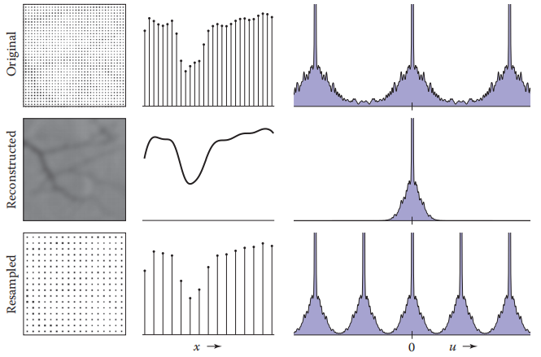

​							**图9.53 在频域观察重采样。重采样滤波器既重构信号（去除杂频谱），又为了以新的速率采样限制它的带宽（减少它的宽度）。**

#### 9.5.6 理想的滤波器 vs. 有用的滤波器（Ideal Filters vs. Useful Filters）

​		根据频域分析得出的逻辑结论，在频域中恰好是一个盒子的滤波器对于采样和重构都是理想的。这样的滤波器可以在两个阶段防止走样，而不会减少低于奈奎斯特频率的频率。

​		回想一下傅里叶逆变换和正变换本质上是相同的，所以傅里叶变换为盒子的空间域滤波器是函数 (sin πx)/πx = sinc πx。

​		然而，sinc 滤波器在实践中通常不使用，无论是采样还是重构（即使它是最优的符合频域准则），因为它不切实际而且因为在许多应用中它并不能产生最佳结果。

​		对于采样，sinc 滤波器的无限延伸，以及它随距离中心的距离相对较慢的下降速度，是一个不利因素。此外，对于某些类型的采样，负部分是有问题的。高斯滤波器是一种很好的采样滤波器，即使在输入信号中高频模式必须被去除的困难情况下也是如此，因为它的傅里叶变换呈指数衰减，不会让杂频突兀的泄漏。对于不太困难的情况，一个帐篷滤波器通常就足够了。

​		对于重构，sinc 函数的大小又会产生问题，但更重要的是，许多波纹在重构信号中产生 “振铃” artifacts。

### 练习（Exercises）

1. 证明离散卷积是交换的和结合的。对连续卷积做同样的证明。

2. 离散到连续卷积不能交换，因为它的参数有两种不同类型。但要证明它是结合的。

3. 证明 B 样条是四个 box 函数的卷积。

4. 通过使用这个（不正确的）定义尝试证明卷积是可交换的和关联的，然后证明 “翻转” 卷积的定义是必要的（见 9.2.2 节）：
   $$
   (a \star{} b)[i] = \sum_{j}a[j]b[i+j]
   $$

5. 证明 F{f * g} = fˆgˆ 以及 fˆ * gˆ = F{fg}

6. 方程 9.4 可以解释为 a 与滤波器 f 平均的卷积。为 “消除波纹” 滤波器 f 平均写一个数学表达式。策划一个滤波器，结果将盒子、帐篷和 B 样条滤波器的波纹消除到 s = 1.25。

