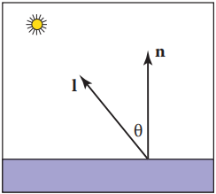
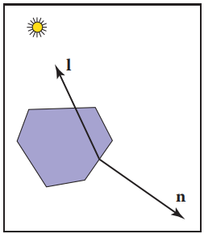
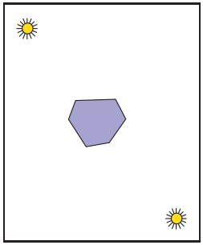
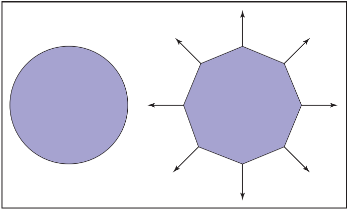
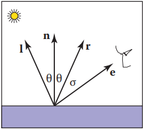
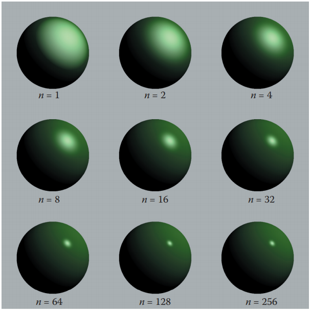
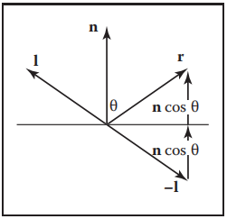
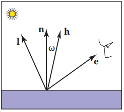
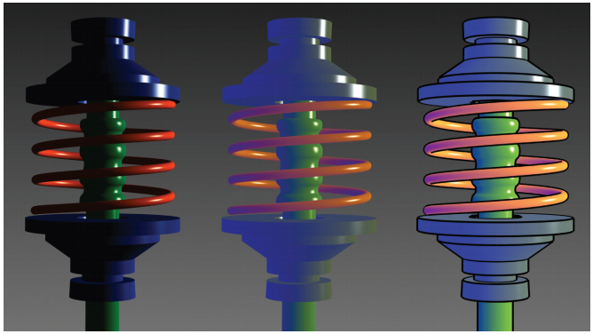

​		为了使物体看起来有更大的体积，使用着色是有帮助的，也就是说，表面是用光 “绘制” 的。本章介绍最常见的启发式阴影方法。前两种，漫反射和 Phong 着色，是在 20 世纪 70 年代开发的，可以在大多数图形库中使用。后一种是艺术着色，它使用艺术惯例给物体分配颜色。这创建的图像让人想起在许多应用中合适的技术图纸。

### 10.1 漫反射着色（Diffuse Shading）

​		世界上许多物体的表面外观被宽泛地描述为 “哑光”，这表明该物体根本没有光泽。例如，纸张、未加工的木材和干燥、未抛光的石头。在很大程度上，这样的物体不会随着视点的变化而发生颜色变化。例如，如果你盯着一张纸上的一个特定点并移动纸张，同时保持你的目光盯着这个点，这个点上的颜色将保持相对恒定。这样的哑光物体可以被认为具有兰伯特（Lambertian）物体的行为。本节讨论如何实现这些物体的着色。关键是，本章所有公式都应在世界坐标中求值，而不是在透视变换后的扭曲坐标中求值。否则，法线之间的角度会改变，着色将是不准确的。

#### 10.1.1 兰伯特着色模型（Lambertian Shading Model）

​		一个兰伯特物体遵循兰伯特余弦定律（Lambert‘s cosine law），即表面的颜色 c 与表面法线与光源方向夹角的余弦成正比（Gouraud, 1971）：
$$
c ∝ \cos{\theta{}}
$$
或向量形式：
$$
c ∝ \vec{n} \cdot{} \vec{l}
$$
其中 **n** 和 **l** 如图 10.1 所示。因此，表面上的颜色将根据表面法线和光线方向之间的夹角的余弦变化。注意，通常假设向量 **l** 不依赖于对象的位置。这个假设相当于假设光相对于物体的大小来说是 “遥远的”。这种 “遥远的” 的光通常被称为定向光（directional light），因为它的位置仅由一个方向来确定。

<b>图10.1 兰伯特定律的几何表示。n 和 l 都是单位向量。</b>

​		通过改变光源的强度或表面的反射率，表面可以变得更亮或更暗。漫反射系数 c~r~ 是被表面反射的光的比例。这个比例对于不同的颜色成分是不同的。例如，如果一个表面反射的红色入射光比蓝色入射光的比例更高，那么它就是红色的。如果我们假设表面颜色与从表面反射的光成正比，那么漫反射系数 c~r~——一个 RGB 颜色——也必须被包含：（式 10.1）
$$
c ∝ c_{r}\vec{n} \cdot{} \vec{l}
\tag{10.1}
$$
式（10.1）右手边是 RGB 颜色，所有 RGB 分量都在 [0,1] 范围内。我们想添加光强度的效果，同时保持 RGB 组分量在范围 [0,1]。这建议增加一个 RGB 强度项 c~l~，它本身的分量在[0,1]范围内：（式 10.2）
$$
c = c_{r}c_{l}\vec{n}\cdot{}\vec{l}
\tag{10.2}
$$
这是一种非常方便的形式，但它可以产生 c 的 RGB 分量在范围 [0,1] 之外，因为点积可以是负的。如图 10.2 所示，当表面指向远离光的方向时点积是负的。

<b>图 10.2 当一个表面指向远离光线的地方时，它应该没有接收光线。这种情况可以通过检验 l 和 n 的点积是否为负来验证。

可以在公式（10.2）中添加 “max” 函数来检测这种情况：（式 10.3）
$$
c = c_{r}c_{l}\max(0, \vec{n} \cdot{} \vec{l})
\tag{10.3}
$$
另一种处理 “负” 光线的方法是使用绝对值：（式 10.4）
$$
c = c_{r}c_{l}|\vec{n} \cdot{} \vec{l}|
\tag{10.4}
$$
虽然（10.4）式在物理上似乎不可信，但它实际上对应于两个方向相反的光的（10.3）式。由于这个原因，它通常被称为双面照明（two-sided lighting）（图 10.3）。

<b>图10.3 使用式（10.4），即双面照明公式，它等效于假设两个颜色相同的相反光源。

#### 10.1.2 环境着色（Ambient Shading）

​		公式（10.3）的漫反射着色的一个问题是，任何法线面远离光线的点都是黑色的。在现实生活中，光是被到处反射，且有些光是从各个方向入射的。此外，经常有天空光提供 “环境” 照明。解决这个问题的一种方法是使用多个光源。一个常见的技巧是总是在眼睛处放一个昏暗的光源，这样所有可见的点都会收到一些光。另一种方法是使用等式（10.4）所描述的双面照明。一种更常见的方法是添加环境项（Gouraud, 1971）。这只是添加到（10.3）式中的常数颜色项。
$$
c = c_{r}(c_{a}+c_{l}\max{(0,\vec{n} \cdot{} \vec{l})})
$$
直观地说，你可以认为环境光颜色 c~a~ 是场景中所有表面的平均颜色。如果要确保计算出的 RGB 颜色保持在 [0,1]^3^ 范围内，则 c~a~ + c~l~ ≤ (1,1,1)。否则，你的代码应该 “夹住（clamp）”  RGB 值高于 1 的使其为 1。

#### 10.1.3 基于顶点的漫反射着色（Vertex-Based Diffuse Shading）

​		如果我们将（10.1）式应用于由三角形组成的物体，它通常会有一个 有小面的外观。三角形通常是光滑表面的近似值。为了避免小面的外观，我们可以在三角形的顶点处放置表面法向量（Phong，1975），使用顶点的法向量在每个顶点上应用（10.3）式（参见图 10.4）。这将给每个三角形顶点一个颜色，并且这个颜色可以使用 8.1.2 节中描述的重心插值。

<b>图10.4 一个圆（左）用一个八边形（右）近似。顶点法线记录原始曲线的表面法线。

​		在三角形顶点上着色的一个问题是我们需要从某处得到法线。许多模型将提供法线。如果你绘制自己的平滑模型，你可以在创建三角形时创建法线。如果你有一个多边形模型，顶点上没有法线，你想要平滑地着色它，你可以通过各种启发式方法计算法线。最简单的方法是对共享每个顶点的三角形的法线取平均值，并在顶点处使用这个法线平均值。这个平均法线不会自动变为单位长度，所以你应该在使用它着色之前将它转换成单位向量。

### 10.2 Phong 着色（Phong Shading）

​		有些表面本质上像哑光表面，但它们有高光（highlights）。这种表面的例子包括抛光的瓷砖地板、有光泽的油漆和书写白板。高光随着视点的移动在表面上移动。这意味着我们必须在方程中加入一个朝向眼睛的单位向量 **e**。如果你仔细观察高光部分，你会发现它们其实是光的反射，有时这些反射是模糊的。这些高光的颜色是光的颜色——表面的颜色似乎没有什么影响。这是因为反射发生在物体表面，而穿透物体表面并捕捉到物体颜色的光是漫反射的。

#### 10.2.1 Phong 光照模型（Phong Lighting Model）

​		我们想在正确的地方添加一个与光源相同颜色的模糊 “光点”。点的中心应该画在 e 到眼睛的方向 “对齐” 反射 r 的自然方向，如图 10.5 所示。这里 “对齐” 在数学上等同于 “夹角 σ 为零” 。我们希望高光有一些非零区域，以便眼睛在 σ 很小的地方看到一些高光。

<b>图10.5 Phong 照明模型的几何图形。如果 σ 很小，眼睛应该看到一个高光。

​		给定 **r**，我们想要一个启发式函数，当 **e** = **r** 时是亮的，当 **e** 远离 **r** 时逐渐下降。一个明显的候选是它们之间夹角的余弦值：
$$
c = c_{l}(\vec{e} \cdot{} \vec{r})
$$
使用这个方程有两个问题。 第一个是点积可以是负的。这可以通过一个 “if” 语句来从计算上解决，该语句在点积为负时将颜色设置为零。更严重的问题是，这个等式产生的高光比现实生活中看到的要广泛得多。最大值是在正确的地方，它是正确的颜色，但就是它的范围太大了。我们可以通过提高到一个幂缩小它的范围而不减少它的最大颜色：（式 10.5）
$$
c = c_{l}\max(0,\vec{e} \cdot{} \vec{r})^{p}
\tag{10.5}
$$
这里 p 被称为 Phong 指数（Phong exponent），它是一个正实数（Phong, 1975）。改变Phong指数对高亮显示的影响可以在图 10.6 中看到。

<b>图10.6 Phong 指数对高光特征的影响。高光使用了公式（10.5）。还有一个漫反射组件，给物体一个闪亮的非金属外观。图片由 Nate Robins 提供。

​		为了实现式（10.5），我们首先需要计算单位向量 **r**。给定单位向量 **l** 和 **n**, **r** 是向量 **l** 关于 **n** 的反射。图 10.7 显示出这个向量可以像如下计算：（式 10.6）
$$
\vec{r} = -\vec{l} + 2(\vec{l} \cdot{} \vec{n})\vec{n}
\tag{10.6}
$$

<b>图10.7 计算向量 r 的几何图形。

其中点积用来计算 cosθ。

​		一个可替代的基于公式（10.5）的启发式模型消除了检查作为指数基数的数字是否为负值的需要（Warn，1983）。我们不计算 **r**，而是计算 **h**，它是在 **l** 和 **e** 中间的单位向量（图 10.8）：
$$
\vec{h} = \frac{\vec{e} + \vec{l}}{||\vec{e} + \vec{l}||}
$$

<b>图10.8 在 l 和 e 中间的单位向量 h。

当 **h** 接近 **n** 时，即 cos ω = **h** · **n** 接近 1 时，高光出现。这显示了这个规则：（式 10.7）
$$
c = c_{l}(\vec{h} \cdot{} \vec{n})^{p}
\tag{10.7}
$$
这里的指数 p 将具有类似于式（10.5）中指数的控制行为，但 **h** 和 **n** 之间的角度是 **e** 和 **r** 之间的角度的一半大小，所以细节将略有不同。 使用 **n** 和 **h** 之间的余弦的优点是，对于平面上的眼睛和光线，余弦总是正的。缺点是需要平方根和除法来计算 **h**。

​		在实践中，我们希望大多数材料除了高光外还有漫反射的外观。我们可以结合式（10.3）和（10.7）得到（式 10.8）
$$
c = c_{r}(c_{a} + c_{l}\max({0,\vec{n} \cdot{} \vec{l}})) + c_{l}(\vec{h} \cdot{} \vec{n})^{p}
\tag{10.8}
$$
如果我们想让用户调暗高光，我们可以添加一个控制项 c~p~：
$$
c = c_{r}(c_{a} + c_{l}\max(0,\vec{n} \cdot{} \vec{l})) + c_{l}c_{p}(\vec{h} \cdot{} \vec{n})^{p}
\tag{10.9}
$$
c~p~ 是一个 RGB 颜色，它允许我们改变高光颜色。c~p~ = c~r~ 对于金属很有用，因为金属上的高光显示出金属的颜色。另外，将 c~p~ 设为小于 1 的中性值通常是有用的，这样颜色就会保持在 1 以下。例如，设置 c~p~ = 1−M（ M 是 c~r~ 的最大组成部分），将保持一个光源的颜色低于1 ，且没有环境项。

#### 10.2.2 表面法向量插值（Surface Normal Vector Interpolation）

​		与具有相同几何形状的兰伯特表面相比，带有高光的光滑表面易于快速改变颜色。因此，在法向量上的着色可以产生干扰的 artifacts。

​		这些问题可以通过在多边形上插值法向量，然后在每个像素上应用 Phong 着色来减少。这可以让你得到好的图像，而不使三角形的大小极小。回想一下第三章，当光栅化一个三角形时，我们计算重心坐标 (α, β, γ) 来插值顶点颜色 c~0~, c~1~, c~2~：（式 10.10）
$$
c = \alpha{}c_{0} + \beta{}c_{1} + \gamma{}c_{2}
\tag{10.10}
$$
我们可以使用相同的方程来插值表面法线 n~0~, n~1~ 和 n~2~：（式 10.11）
$$
\vec{n} = \alpha{}\vec{n}_{0} + \beta{}\vec{n}_{1} + \gamma{}\vec{n}_{2}
\tag{10.11}
$$
使用每个像素计算出的 **n** 就可以计算式（10.9）。注意，由公式（10.11）得到的 **n** 通常不是单位法线。如果在使用着色计算之前将其转换为单位向量，将获得更好的视觉效果。这种类型的法向插值通常被称为 Phong 法线插值（Phong normal interpolation）（Phong, 1975）。

### 10.3 艺术着色（Artistic Shading）

​		兰伯特和 Phong 着色方法是基于启发式设计来模仿真实世界中物体的外观。艺术着色是为了模仿人类艺术家的绘画（Yessios, 1979；Dooley & Cohen, 1990；Saito & Takahashi, 1990；L. Williams, 1991）。这种着色在许多应用中似乎有优势。例如，汽车制造商雇佣艺术家为车主指南绘制图表。这比使用更 “现实” 的照片要昂贵得多，所以当需要某些类型的交流时，艺术家的技术可能有一些内在的优势。在本节中，我们将展示如何制作巧妙的着色线条画，让人想起人类绘制的图像。创建这样的图像通常被称为非真实感渲染（non-photorealistic rendering），但我们将避免使用这个术语，因为许多非真实感技术用于提高效率，与任何艺术实践无关。

#### 10.3.1 线条画（Line Drawing）

​		我们在人类绘画中看到的最明显的东西是我们在现实生活中看不到的轮廓（silhouette）。当我们有一组共享边的三角形时，当共享边的两个三角形中的一个面向观看者，而另一个面向远离观看者时，我们应该画一条边作为轮廓。这个条件可以用两个法线 **n~0~** 和 **n~1~** 来测试，通过
$$
draw \; silbouette \; if \; (\vec{e} \cdot{} \vec{n}_{0})(\vec{e} \cdot{} \vec{n}_{1}) \le{} 0
$$
这里 **e** 是一个从边缘到眼睛的向量。这可以是边上的任意一点也可以是三角形中的任意一个。或者，如果 f~i~(**p**) = 0 是这两个三角形的隐式平面方程，则测试可以写成
$$
draw \; silhouette \; if \; f_{0}(\vec{e})f_{1}(\vec{e}) \le{} 0
$$
我们还想绘制多边形模型的可见边缘。为了做到这一点，我们可以使用第12章中的任何一种隐藏表面方法来绘制背面颜色，然后用黑色绘制每个三角形的轮廓。事实上，这也将捕捉到轮廓。不幸的是，如果多边形代表一个光滑的表面，我们真的不想画大部分的边。然而，在集合中确实是角落的地方，我们可能想要画出所有的折痕（crease）。我们可以使用启发式阈值来测试折痕：
$$
draw \; crease \; if \; (\vec{n}_{0} \cdot{} \vec{n}_{1}) \le{} threshold
$$
这与轮廓测试相结合将给出漂亮的线条图。

#### 10.3.2 冷到暖着色（Cool-to-Warm Shading）

​		当艺术家给线条画着色时，他们经常使用低强度的着色来给表面一些曲线的效果，并给物体颜色（Gooch，Gooch, Shirley， & Cohen, 1998）。朝一个方向的表面用冷色着色，如蓝色，朝相反方向的表面用暖色着色，如橙色。通常这些颜色不是很饱和，也不是很暗。这样，黑色的轮廓就能很好地展现出来。总的来说，这给了一个卡通般的效果。这可以通过设置到 “暖” 光的方向 **l** 和使用余弦调整颜色来实现，其中暖常数 k~w~ 定义在 [0,1] 上：
$$
k_{w} = \frac{1 + \vec{n} \cdot{} \vec{l}}{2}
$$
颜色 c 是冷色 c~c~ 和暖色 c~w~ 的线性混合：
$$
c = k_{w}c_{w} + (1-k_{w})c_{c}
$$
有许多可能的 c~w~ 和 c~c~ 将产生看起来合理的结果。猜测的一个好起点是
$$
c_{c} = (0.4,0.4,0.7) \\
c_{c} = (0.8,0.6,0.6)
$$
图 10.9 显示了传统的 Phong 照明和这种艺术着色类型的比较。

<b>图10.9 左：Phong 照明图。中：没有轮廓的冷到暖着色。右：加上轮廓的冷到暖着色。图片由 Amy Gooch 提供。

### 常见问答（Frequently Asked Questions）

- **本章中所有的着色看起来都像是巨大的修改。这是真的吗?**

是的。然而，它们都是经过精心设计的修改，在实践中被证明是有用的。从长远来看，我们可能会有更有动力的算法，包括物理、心理学和色调映射。然而，图像质量的改善可能是渐进的。

- **我讨厌调用 pow()。在进行 Phong 照明时，有办法避免这种情况吗?**

​	一个简单的方法是只取本身是 2 的幂的指数，例如，2 4 8 16 . . . .。在实践中，这对大多数应用程序来说并不是一个有困难的限制。查找表也是可以的，但通常不会有很大的加速。

### 练习（Exercises）

1. 通过漫反射或 Phong 着色不好近似月亮。什么观察告诉你这话是真的？
2. 通过漫反射或 Phong 着色不好近似天鹅绒（velvet）。什么观察告诉你这话是真的？
3. 为什么大多数塑料物体上的高光看起来是白色的，而金色金属物体上的高光看起来是金色的？