- 当试图复制真实世界的外观时，人们很快就会意识到几乎没有任何表面是无特征的。木头随纹路生长，皮肤长出皱纹，布显示其编织结构，油漆显示出涂抹它的刷子或滚筒的痕迹。即使是光滑的塑料也有凹凸的部分，而光滑的金属则显示出加工过程的痕迹。曾经毫无特征的材料很快就会被痕迹、凹痕、污渍、划痕、指纹和污垢所覆盖。

​		在计算机图形学中，我们把所有这些现象归为 “空间变化的表面特性”——表面的属性因地而异，但并不真正以有意义的方式改变表面的形状（shape）。为了实现这些效果，各种建模和渲染系统都提供了一些纹理映射（texture mapping）的方法：使用一个图像（称为纹理图（texture map），纹理图像（texutre image），或者就叫纹理（texture））来存储你想要在表面上的细节，然后在数学上 “映射” 图像到表面上。

*这就是第 2.1 节所说的映射。*

​		事实证明，一旦将图像映射到表面的机制存在，就会有许多不太明显的方法可以使用，而不仅仅是引入表面细节的基本目的。纹理可以用来制造阴影和反射，提供照明，甚至定义表面形状。在复杂的交互程序中，纹理被用来存储各种各样的数据，这些数据甚至与图片没有任何关系！

​		本章讨论了使用纹理来表示表面细节、阴影和反射。虽然基本的想法很简单，但一些实际问题使纹理的使用变得复杂。首先，纹理很容易变形，设计将纹理映射到表面的功能是具有挑战性的。此外，纹理映射是一个重采样过程，就像缩放图像一样，正如我们在第 9 章中看到的，重采样很容易引入走样 artifacts。纹理映射和动画的结合使用很容易产生真正引人注目的走样，纹理映射系统的许多复杂性都是由用于驯服这些 artifacts 的反走样措施造成的。

### 11.1 查找纹理值（Looking Up Texture Values）

​		首先，让我们考虑一个简单的纹理映射应用。我们有一个木地板的场景，我们希望地板的漫反射颜色由一个显示木纹地板纹理的图像来控制。为了使用它作为第 10 章中的兰伯特着色模型的漫反射颜色，无论我们使用光线追踪或光栅化，对光线和表面交点或对一个光栅器生成的片元计算颜色的着色代码纹理图在着色点的颜色。

​		为了得到这种颜色，着色器执行纹理查找（texture lookup）：它在纹理图像的坐标系统中计算出对应于着色点的位置，并读出图像中该点的颜色，从而生成纹理样本（texture sample）。这种颜色随后被用于着色，由于纹理查找发生在每个看到地板的像素的纹理的不同位置，不同颜色的图案就会在图像中显示出来。代码可能是这样的：

```c++
Color texture_lookup(Texture t, float u, float v){
	int i = round(u * t.width() -0.5)
	int j = round(v * t.height() - 0.5)
	return t.get_pixel(i,j);
}

Color shade_surface_point(Surface s, Point p, Texture t){
	Vector normal = s.get_normal(p)
	(u,v) = s.get_texcoord(p)
	Color diffuse_color texture_lookup(u,v)
	// compute shading using diffuse_color and normal
	// return shading result
}
```

​		在这段代码中，着色器询问表面在纹理中的哪去找，而我们想要使用纹理着色的每个表面都需要能够以某种方式回答这个查询。这给我们带来了纹理映射的第一个关键要素：我们需要一个函数从表面映射到纹理，我们可以很容易地计算每个像素。这是纹理坐标函数（texture coordinate function）（图 11.1），我们说它为表面上的每个点分配纹理坐标。数学上，它是从表面 S 到纹理域 T 的映射：
$$
\Phi{} : S \rightarrow{} T = (x,y,z) \mapsto{} (u,v)
$$
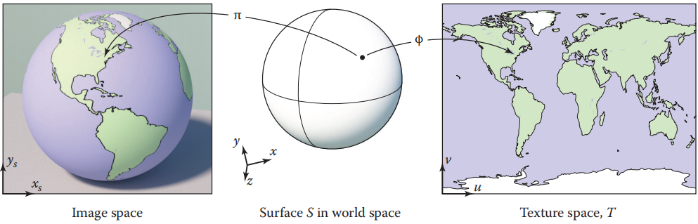

<center><b>图11.1 就像视图投影 π 将物体表面 S 上的每个点映射到图像上的一个点一样，纹理坐标函数 φ 将物体表面上的每个点映射到纹理映射 T 上的一个点。适当定义这个函数 φ 是所有纹理映射应用的基础

集合 T（通常称为 “纹理空间”）通常只是一个包含图像的矩形，通常使用单位平方形 (u, v)∈[0,1]^2^ （在本书中，我们将使用名称 u 和 v 作为两个纹理坐标）。在很多方面，它与第 7 章讨论的视图投影（本章称之为 π）相似，它将场景表面上的点映射到图像上的点， 都是 3D 到 2D 映射，两者都是渲染所需要的——一个是知道从哪里得到纹理值，一个是知道在图像中把着色结果放在哪里。但也有一些重要的区别：π 几乎总是透视投影或正交投影，而 φ可以有多种形式；一个图像只有一个视图投影，而场景中的每个物体都可能有一个完全独立的纹理坐标函数。

​		当我们的目标是将纹理放到表面上时，φ 是一个从表面到纹理的映射，这似乎令人惊讶，但这是我们需要的功能。

*所以…你要学习的第一件事是如何逆向思考。*

​		对于木地板的情况，如果地板恰好处于恒定的 z 轴并与 x 轴和 y 轴对齐，我们可以使用映射
$$
u = ax \\ v = by
$$
对于一些适当选择的比例因子 a 和 b，分配纹理坐标 (s, t) 到点 (x, y, z)~floor~，然后使用最接近 (u, v) 的纹理像素或纹素（texel）值作为 (x, y) 处的纹理值。通过这种方式，我们渲染了图 11.2 中的图像。

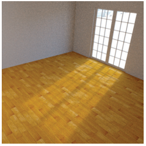

<center><b> 图11.2 一个木地板，简单的用直接点 x 和 y 坐标的纹理坐标函数进行纹理。

不过，这是相当有限的：如果房间的模型与 x 轴和 y 轴有一定的角度，或者如果我们想要在弯曲的椅子靠背上使用木材纹理呢？我们需要一些更好的方法来计算表面上的点的纹理坐标。

​		从最简单的纹理映射形式中产生的另一个问题，通过一个非常接近低分辨率图像的角度绘制一个高对比度的纹理到得到了很好的说明。图 11.3 使用了相同的方法显示了一个更大的平面纹理，但使用了高对比度的网格图和朝向地平线的视图。你可以看到，当没有使用适当的过滤器时，它包含走样的 artifacts（前面的台阶，远处的波浪形和闪光图案)，类似于图像重采样（第 9 章）中出现的 artifacts。虽然这需要一个极端的条件，使这些 artifacts 如此明显地将一个微小的静止图像打印在一本书上，在动画中，即使他们是非常微妙的，这些图四处运动且非常分散。

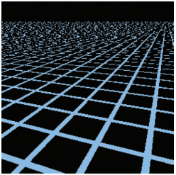

<center><b>图11.3  一个大的水平平面，纹理与图 11.2 相同，并显示严重的走样 artifacts。

​		现在我们已经看到了基本纹理映射中的两个主要问题：

- 定义纹理坐标函数。
- 查找纹理值而不引入太多的走样。

这两个问题是所有类型的纹理映射应用的基础，它们将在第 11.2 节和 11.3 节中讨论。一旦你理解了它们和它们的一些解决方案，那么你就理解了纹理映射。剩下的只是如何将基本的纹理机制应用于各种不同的目的，这将在第 11.4 节中讨论。

### 11.2 纹理坐标的函数（Texture Coordinate Functions）

​		设计好纹理坐标函数 φ 是获得良好纹理映射效果的关键。你可以将其视为决定如何变形一个平面、矩形图像，使其符合你想要绘制的 3D 表面。或者，你将表面轻轻地压平，不让它起皱、撕裂或折叠，使它平躺在图像上。有时这很简单：也许 3D 表面已经是一个平面矩形！在其他情况下，这是非常棘手的：3D 形状可能非常复杂，比如角色身体的表面。

​		定义纹理坐标函数的问题在计算机图形学中并不新鲜。在设计覆盖地球表面大片区域的地图时，制图师也面临着同样的问题：从曲面地球到平面地图的映射不可避免地会导致区域、角度和/或距离的失真，这很容易让地图产生误导。几个世纪以来，人们提出了许多地图投影，它们都是为了平衡纹理映射所面临的相同的竞争问题——在覆盖大面积连续区域的同时尽量减少各种失真。

​		在某些应用程序中（我们将在本章后面看到），使用特定映射有明确的理由。但在大多数情况下，设计纹理坐标映射是一项精巧的任务，需要平衡竞争问题，熟练的建模人员为此付出了相当大的努力。

*“UV映射” 或 “表面参数化” 是你可能遇到的纹理坐标函数的其他名称。*

​		你可以用任何你能想到的方式来定义 φ。但还有几个相互竞争的目标需要考虑：

- 双射性。在大多数情况下，你会希望 φ 是双射的（参见 2.1.1 节），这样表面上的每个点都会映射到纹理空间中的不同点。如果几个点映射到同一个纹理空间点，纹理中一个点的值会影响到表面上的几个点。当你想要纹理在表面上重复时（比如墙纸或地毯的重复图案），你便需要特意引入从表面点到纹理点的多对一映射，但你也不希望这种情况意外发生。
- 尺寸畸变。 纹理的比例在整个表面上应该是近似恒定的。也就是说，表面上任何距离相同的近距离点应该映射到纹理中距离相同的点。对于函数 φ 来说，φ 导数的大小不应变化太大。
- 形状畸变。纹理不应该被扭曲。也就是说，绘制在表面上的一个小圆应该映射到纹理空间中的一个合理的圆形形状，而不是一个被极度压扁或拉长的形状。对于 φ 来说，φ 在不同方向上的导数不应相差太大。
- 连续性。缝不能太多：表面上的相邻点应该映射到纹理中的相邻点。也就是说，φ 应该是连续的，或有尽可能少的不连续。在大多数情况下，一些不连续是不可避免的，我们想把它们放在不显眼的地方。

​	由参数方程定义的表面（章节 2.5.8）带有内置的纹理坐标函数选择：简单地反转定义表面的函数，并使用表面的两个参数作为纹理坐标。这些纹理坐标可能有也可能没有理想的属性，这取决于表面，但它们确实提供了映射。

​		但是对于隐式定义的表面，或者仅仅由三角形网格定义的表面，我们需要一些其他的方法来定义纹理坐标，而不依赖于现有的参数化。广义地说，定义纹理坐标的两种方法是从表面点的空间坐标几何上计算纹理坐标，或者，对于网格表面，在顶点上存储纹理坐标的值并在整个表面上插值它们。让我们逐个看看这些选项。

#### 11.2.1 几何确定的坐标（Geometrically Determined Coordinates）

​		几何决定的纹理坐标用于简单的形状或特殊情况，其作为快速解决方案，或作为设计手工调整纹理坐标映射的起点。

​		我们将通过将图 11.4 中的测试图像映射到表面来阐述各种纹理坐标函数。图像中的数字可以让您从渲染图像中读出近似的 (u, v) 坐标，网格可以让您看到映射的失真程度。

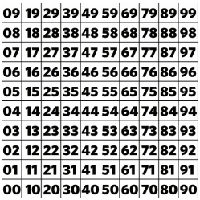

<center><b>图11.4 测试图像

**平面投影（Planar Projection）**

​		从 3D 到 2D 最简单的映射可能是平行投影——与用于正交投影的映射相同（图 11.5）。我们已经为视图（章节 7.1）开发的机制可以直接用于定义纹理坐标：就像正交投影归结为乘上一个矩阵并丢弃 z 分量一样，通过平面投影生成纹理坐标可以用一个简单的矩阵乘法来完成：
$$
\phi{}(x,y,z) = (u,v) \; where \; \begin{bmatrix}u \\ v \\ * \\ 1 \end{bmatrix} = 
M_{t}\begin{bmatrix}x \\ y \\ z \\ 1 \end{bmatrix}
$$
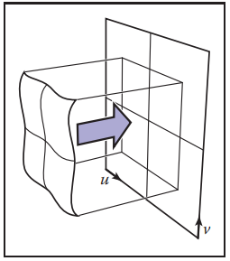

<center><b>图11.5 如果投影方向大致沿着整个法线选择，平面投影对物体是一个有用的参数化或是几乎是平的开始的物体的部分。

其中纹理矩阵 M~t~ 表示仿射变换，星号表示我们不关心第三个坐标的结果。

​		这对于平面表面来说非常有效，其没有太多的表面法线变化，并且可以通过取平均法线找到一个好的投影方向。然而，对于任何一种闭合形状，平面投影都不是单射的：前面和后面的点将映射到纹理空间中的同一个点（图 11.6）。

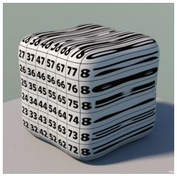

<center><b>图11.6 在一个封闭的物体上使用平面投影总是会导致一个非单射，一对多的映射，以及在投影方向与表面相切的点附近的极度失真。

​		通过简单地用透视投影代替正交投影，我们得到了投影纹理坐标（图 11.7）：
$$
\phi(x,y,z) = (\frac{\tilde{u}}{w},\frac{\tilde{v}}{w}) \; where \; 
\begin{bmatrix}\tilde{u} \\ \tilde{v} \\ * \\ w \end{bmatrix} = 
P_{t}\begin{bmatrix}x \\ y \\ z \\ 1 \end{bmatrix}
$$
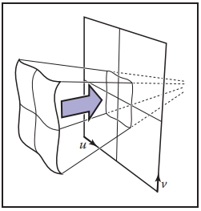

<center><b>图11.7 投射纹理变换使用了向某一点投射的类视图变换。

现在 4×4 矩阵 P~t~表示一个投影（不一定是仿射）变换——也就是说，最后一行可能不是 [0,0,0,1]。

​		投影纹理坐标在阴影映射技术中非常重要，将在 11.4.4 节中讨论。

**球面坐标（Spherical Coordinates）**

​		对于球体，纬度/经度参数化是熟悉的，并且被广泛使用。它在两极附近有很多失真，这可能会导致困难，但它确实覆盖了整个球体，且只有沿一条纬度线的不连续。

​		表面大致是球形的形状可以使用纹理坐标函数参数化，该函数使用径向投影将表面上的一点映射到球体上的一点：从球面的中心取一条直线穿过表面上的点，求与球面的交点。这个交点的球坐标是在表面上你开始的点的纹理坐标。

​		另一种说法是，用球坐标 (ρ, θ, φ) 表示表面点，然后去掉 ρ 坐标，将 θ 和 φ 分别映射到范围 [0,1]。公式依赖于球坐标约定，使用第 2.5.8 节的约定
$$
\phi{}(x,y,z) = (\frac{\pi{} +atan2(y,x)}{2\pi{}}, \frac{\pi{} - \acos{}(\frac{z}{||x||})}{\pi{}})
$$
*这个和本章中的其他纹理坐标函数用于在盒子 [−1,1]^3^ 中并在原点居中的物体。*

如果从中心点整个表面是可见的，那么一个球坐标映射除了极点将在所有地方是双射的。它在两极附近继承了与球体上的经纬度映射相同的失真。图 11.8 显示了一个球体坐标提供了合适的纹理坐标函数的物体。

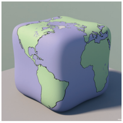

<center><b>图11.8 对于这个模糊的类球形物体，将每个点投影到以物体中心为中心的球体上提供了一个单射映射，这里被用于放置与球体图像相同的映射纹理。注意，当表面离中心较远时，区域会被放大（表面点在纹理空间中聚集在一起），而当表面离中心较近时，区域会收缩。

**柱面坐标（Cylindrical Coordinates）**

对于柱状而非球面的物体，从一个轴向外投影到圆柱体可能比从点投影到球面更好（图 11.9）。类似于球面投影，这相当于转换为柱坐标并丢弃半径：
$$
\phi{}(x,y,z) = (\frac{1}{2\pi{}}\frac{\pi{} + atan2(y,x)}{2\pi{}},\frac{1}{2}[1+z])
$$


<center><b>图11.9 一个远离球形的花瓶，其球面投影产生很多失真（左），圆柱形投影在外部表面产生一个非常好的结果

**立方体贴图（Cubemaps）**

​		使用球坐标参数化球形或类球形形状会导致极点附近的形状和区域高度失真，这通常会导致可见的 artifacts，其表明有两个特殊的点纹理出了问题。一种流行的替代方案要均匀得多，但代价是有更多的不连续。这个想法是投射到一个立方体上，而不是一个球体上，然后为立方体的六个面使用六个独立的正方形纹理。6 个正方形纹理的集合称为立方体贴图（cubemap）。这在立方体的所有边缘上都引入了不连续，但它保持了形状和区域的低失真。

​		计算立方地图纹理坐标也比计算球坐标便宜，因为投影到一个平面上只需要一个除法——本质上与用于视图的透视投影相同。例如，对于一个投射到立方体的 +z 面上的点：
$$
(x,y,z) \mapsto{} (\frac{x}{z}, \frac{y}{z})
$$
立方体贴图一个令人困惑的方面是建立如何在六个面上定义 u 和 v 方向的约定。任何约定都可以，但是选择的约定会影响纹理的内容，所以标准化是很重要的。因为立方体纹理通常用于从立方体内部观察的纹理（参见第 11.4.5 节中的环境映射），所以通常的惯例是 u 轴和 v 轴朝向，使其从内部看 v 在 u 的顺时针方向。OpenGL 使用的约定是
$$
\phi{}_{-x}(x,y,z) = \frac{1}{2}\frac{1 + (+z,-y)}{|x|} \\
\phi{}_{+x}(x,y,z) = \frac{1}{2}\frac{1 + (-z,-y)}{|x|} \\
\phi{}_{-y}(x,y,z) = \frac{1}{2}\frac{1 + (+x,-z)}{|y|} \\
\phi{}_{+y}(x,y,z) = \frac{1}{2}\frac{1 + (+x,+z)}{|y|} \\
\phi{}_{-z}(x,y,z) = \frac{1}{2}\frac{1 + (-x,-y)}{|z|} \\
\phi{}_{+z}(x,y,z) = \frac{1}{2}\frac{1 + (+x,-y)}{|z|} \\
$$
下标表示每个投影对应立方体的哪个面。例如，φ~-x~ 用于在 x = +1 处投影到立方体表面的点。你可以通过查看绝对值最大的坐标来判断一个点投射到哪个面：例如，如果 |x| > |y| 和 |x| > |z|，点投射到 +x 面或 −x 面，这取决于 x 的符号。

​		用于立方体贴图的纹理有 6 个方形块。（参见图 11.10）通常它们被打包在一个图像中存储，就像立方体被打开一样。

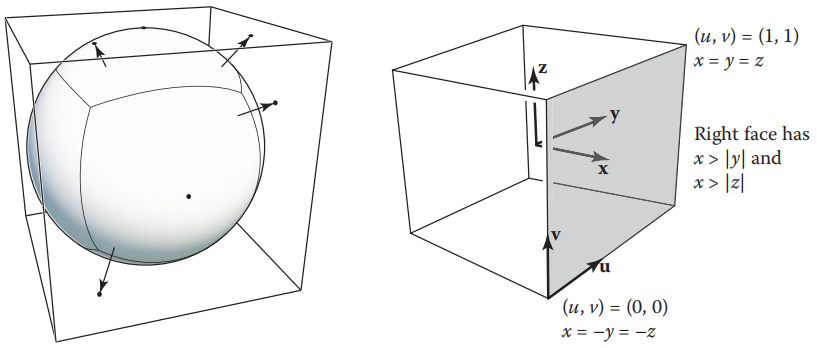

<center><b>图11.10 被投影成立方体贴图的表面。表面上的点从中心向外投射，每个点映射到六个面上的一个点上。

#### 11.2.2 插值纹理坐标（Interpolated Texture Coordinates）

​		为了对三角形网格表面上的纹理坐标函数进行更细粒度的控制，你可以显式地在每个顶点存储纹理坐标，并使用重心插值（章节 8.1.2）将它们插入到三角形中。它的工作方式与你在网格上定义的任何其他平滑变量完全相同：颜色，法线，甚至它自己的 3D 位置。

*插值纹理坐标的想法非常简单，但一开始可能会有点混乱。*

​		让我们看一个单三角形的例子。图 11.11 显示了一个三角形纹理映射到现在熟悉的测试图的一部分。通过查看呈现在三角形上的图，您可以推断出三个顶点的纹理坐标是 (0.2,0.2)、(0.8,0.2) 和 (0.2,0.8)，因为这些是纹理中出现在三角形三个角上的点。就像前一节中几何决定的映射一样，我们通过给出从表面到纹理域的映射来控制纹理在表面上的位置，在本例中，我们通过指定每个顶点在纹理空间中的位置。一旦你定位了顶点，其余的就由三角形的线性（重心）插值处理了。

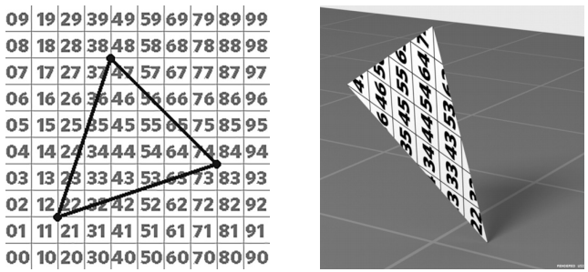

<center><b>图11.11 使用线性插值纹理坐标的单个三角形。左：纹理空间中绘制的三角形，右：在 3D 场景中渲染的三角形。

​		在图 11.12 中，我们展示了一种在整个网格上可视化纹理坐标的常用方法：简单地在纹理空间中绘制三角形，其顶点位于纹理坐标处。这个可视化告诉你哪个三角形正在使用纹理的哪个部分，它是一个方便的工具，用于评估纹理坐标和调试各种纹理映射代码。

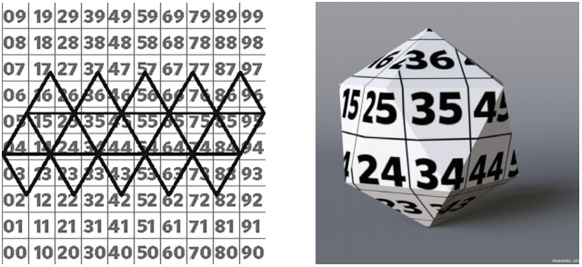

<center><b>图11.12 一个二十面体，它的三角形布局在纹理空间中，其提供零失真，但有许多接缝。

​		由顶点纹理坐标定义的纹理坐标映射的质量取决于分配给顶点的坐标——也就是说，网格在纹理空间中是如何布局的。无论分配什么坐标，只要网格中的三角形共享顶点（章节 12.1），纹理坐标映射总是连续的，因为相邻三角形在共享边的点上的纹理坐标是一致的。但是上面描述的其他可取的品质并不是那么必然的。单射意味着三角形在纹理空间中不重叠——如果它们重叠，就意味着纹理中的某个点出现在表面的地方会超过一个。

​		当纹理空间中的三角形区域与其三维空间中的三角形区域成比例时，尺寸失真较小。例如，如果使用连续的纹理坐标函数映射角色的脸，那么角色的鼻子就会被压缩到一个相对较小的纹理空间中，如图 11.13 所示。虽然鼻子上的三角形比脸颊上的三角形小，但在纹理空间上，大小比例更极端。结果是鼻子上的纹理被放大了，因为一小块纹理必须覆盖大面积的表面。类似地，比较前额和太阳穴，三角形在 3D 中大小相似，但太阳穴周围的三角形在纹理空间上更大，导致纹理在那里看起来更小。

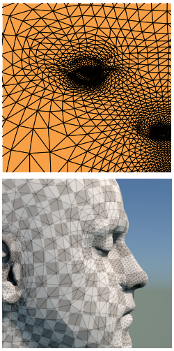

<center><b>图11.13 一种人脸模型，其分配纹理坐标，以达到合理的低形状失真，但仍然显示出了适度的区域失真。

​		同样地，当三维空间中的三角形和纹理空间的三角形的形状相似时，形状失真较小。脸的例子具有相当低的形状失真，但是，例如，图 11.17 中的球体在极点附近具有非常大的形状失真。

#### 11.2.3 平铺，缠绕模式，以及纹理变换（Tiling，Wrapping Modes，and Texture Transformations）

​		允许纹理坐标超出纹理图像的边界通常是有用的。有时这是一个细节：纹理坐标计算中的舍入误差可能会导致恰好落在纹理边界上的顶点略微偏外，在这种情况下，纹理映射机制应该不会失败。但它也可以是一个建模工具。

​		如果纹理只覆盖部分表面，但纹理坐标已经设置好去将整个表面映射到单位正方形，一个选项是准备一个纹理图像，其大部分是空白的只有一小部分内容。但这可能需要一个非常高分辨率的纹理图像来获得相关区域的足够细节。另一种选择是按比例放大所有纹理坐标，使其覆盖更大的范围——例如，[−4.5,5.5]×[−4.5,5.5]，将单位正方形定位为表面中心的十分之一大小。  

​		对于像这样的情况，纹理图像所覆盖的单位正方形区域之外的纹理查找应该返回一个恒定的背景颜色。一种方法是设置一个背景颜色，以便在单位正方形之外的纹理查找时返回。如果已经有一个恒定的背景颜色纹理图像（例如，在白色背景上的一个 logo），另一种在平面上自动扩展这个背景的方法是，为单位正方形外的查找安排为返回纹理图像边上的最接近点的颜色，其通过将 u 和 v 坐标截断（clamp）到图像中从第一个像素到最后一个像素的范围来实现。

​		有时我们想要一个重复的图案，例如棋盘、瓷砖地板或砖墙。如果图案在矩形网格上重复，那么创建包含许多相同数据副本的图像将是一种浪费。相反，我们可以使用缠绕索引处理纹理图像之外的纹理查找——当查找点离开纹理图像的右边缘时，它绕到左边缘。这可以非常简单地使用像素坐标上的整数余数运算来处理。

```c++
Color texture_lookup_wrap(Texture t, float u, float v){
	int i = round(u * t.width() - 0.5)
	int j = round(v * t.height() - 0.5)
	return t.get_pixel(i % t.width, j % t.height())
}

Color texture_lookup_wrap(Texture t, float u, float v){
	int i = round(u * t.width() - 0.5)
	int j = round(v * t.height() - 0.5)
	return t.get_pixel(max(0, min(i, t.width() - 1)), max(0, min(j, t.height() - 1)))
}
```

​		这两种处理越界查找的方式之间的选择是通过从包含平铺、截断以及这两种方式的组合或变体的列表中选择缠绕模式（wrapping mode）来指定的。使用缠绕模式，我们可以自由地将纹理视为一个函数，它为无限的 2D平 面上的任何点返回颜色（图 11.14）。当我们使用图像指定纹理时，这些模式描述了如何使用有限的图像数据来定义这个函数。在 11.5 节中，我们将看到程序纹理可以自然地扩展到无限平面，因为它们不受有限图像数据的限制。由于两者在逻辑上都是无限的，这两种类型的纹理是可以互换的。

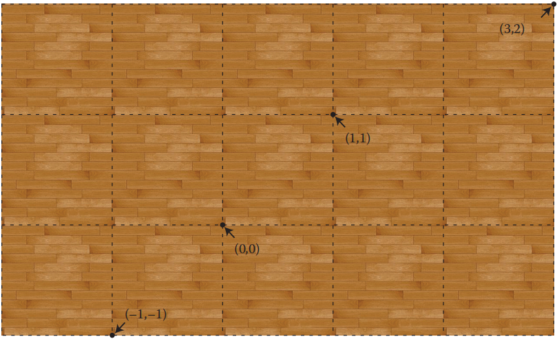

<center><b>图11.14 通过缠绕纹素坐标将木地板纹理平铺在纹理空间上

​		当调整纹理的比例和位置时，可以很方便地避免实际更改生成纹理坐标的函数或者存储在网格顶点上的纹理坐标值，而是在使用纹理坐标采样之前对纹理坐标应用矩阵变换：
$$
\phi{}(x) = M_{T}\phi{}_{model}(x)
$$
其中 φ~modle~ 是模型提供的纹理坐标函数，M~T~ 是一个 3 × 3 的矩阵，其表示使用齐次坐标的二维纹理坐标仿射或投影变换。这种转换有时仅限于缩放和/或平移，大多数使用纹理映射的渲染器都支持这种转换。

#### 11.2.4 透视校正插值（Perspective Correct Interpolation）

​		通过在三角形上插值纹理坐标来实现正确观看的投影有一些微妙之处，但我们可以在栅格化阶段解决这个问题。事情不是那么简单的原因是在屏幕空间中插值纹理坐标会导致不正确的图像，如图 11.15 中的网格纹理所示。因为随着观察者距离的增加，视角中的物体会变得更小，所以在 3D 中间隔均匀的线条在二维图像空间中会被压缩。为了实现这一点，需要更仔细地插值纹理坐标。

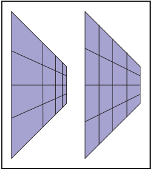

<center><b>图11.15 左：正确的投影。右：屏幕空间的插值。

​		我们可以通过插值 (u, v) 坐标，修改章节 8.1.2 的光栅化方法，在三角形上实现纹理映射，但这导致了如图 11.15 右侧所示的问题。如果使用如下光栅化代码所示的屏幕空间重心坐标，则三角形也会出现类似的问题：

```c++
for all x do
	for all y do
		compute (alpha, beta, gamma) for (x, y)
		if 0<alpha<1 and 0<beta<1 and 0<gamma<1 then
        	t = alpha * t0 + beta * t1 + beta * t2
        	drawpixel(x, y) with color texture(t) for a solid texture
      		or with texture(beta, gamma) for a 2D texture
```

这段代码将生成图像，但有一个问题。为了解开这个基本问题，让我们考虑从世界空间 **q** 到齐次点 **r** 再到齐次点 **s** 的一系列过程：
$$
\begin{bmatrix}x_{q} \\ y_{q} \\ z_{q} \\ 1\end{bmatrix} \underrightarrow{transform}
\begin{bmatrix}x_{r} \\ y_{r} \\ z_{r} \\ h_{r}\end{bmatrix} \underrightarrow{homogenize}
\begin{bmatrix}\frac{x_{r}}{h_{r}} \\ \frac{y_{r}}{h_{r}} \\ \frac{z_{r}}{h_{r}} \\ 1\end{bmatrix} \equiv{} 
\begin{bmatrix}x_{s} \\ y_{s} \\ z_{s} \\ 1\end{bmatrix}
$$
纹理坐标插值问题最简单的形式是，当我们有纹理坐标 (u, v) 与两个点 **q** 和 **Q** 相关联，我们需要沿着 **s** 和 **S** 之间的直线在图像中生成纹理坐标。如果在 **q** 和 **Q** 之间的线上的世界空间点 **q‘** 投射到 **s** 和 **S** 之间线上的屏幕空间点 **s’**，那么这两个点应该具有相同的纹理坐标。

​		简单的屏幕空间方法，体现在上面的算法，其表示在点 **s’** = **s** + α(**S** - **s**)，我们应该使用纹理坐标 u~s~ +α(u~S~ - u~s~) 和 v~s~ +α(v~S~ - v~s~)。这并不正确，因为世界空间的点 **q‘** 转换为 **s’** 不是 **q** + α(**Q** − **q**)。

​		然而，从第 7.4 节我们知道，**q** 和 **Q** 之间线段上的点确实在 **s** 和 **S** 之间线段上的某个地方结束，事实上，在那节我们已经展示过了
$$
\vec{q} + t(\vec{Q} - \vec{q}) \mapsto{} \vec{s} + \alpha{}(\vec{S} + \vec{s})
$$
插值参数 t 和 α 是不相同的，但我们可以从另一个方程计算其中一个：（这值得你自己从式（7.6）推导出这些函数，在那一章的注释中，α = f (t)）（式 11.1）
$$
t(\alpha{}) = \frac{\omega{}_{r}\alpha{}}{\omega{}_{R}+\alpha{}(\omega{}_{r}-\omega{}_{R})} 
\; and \;
\alpha{}(t) = \frac{\omega{}_{R}t}{\omega{}_{r} + t(\omega{}_{R}-\omega{}_{r})}
\tag{11.1}
$$
这些方程为屏幕空间插值思想提供了一个可能的解决方案。为了得到屏幕空间点 **s‘** = **s** + α(**S** -**s**) 的纹理坐标，计算u’~s~ = u~s~ +t(α)(u~S~ - u~s~) 和 v‘~s~ = v~s~ +t(α)(v~S~ - v~s~)。这些是映射到 **s’** 的点 **q‘** 的坐标，所以这是可行的。然而，计算每个片段的 t(α) 是缓慢的，有一个更简单的方法。

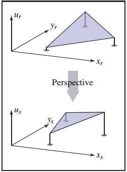

<center><b>图11.16 屏幕空间插值的几何推理。上图：ur 将被插值为 (xr, yr) 的线性函数。下：从(xr, yr, ur, wr) 进行透视变换后到 (xs, ys, us, 1)，us 是 (xs, ys) 的线性函数。

​		关键是注意到，因为我们知道，透视变换保留了直线和平面，所以在三角形上线性插值我们想要的任何属性是安全的，但前提是它们与点一起经过透视变换。 为了获得这个的几何直观，减小维数，使我们有齐次点 (x~r~, y~r~, w~r~) 和一个单独的属性 u 被插值。属性 u 应该是 x~r~ 和 y~r~ 的线性函数，所以如果我们把 u 画成 (x~r~, y~r~) 上的高度场，结果是一个平面。现在，如果我们认为 u 是一个三维空间坐标（称之为 u~r~，强调和对待其他的一样），把整个三维齐次点（x~r~,y~r~,u~r~,w~r~) 通过透视变换，其结果 (x~s~, y~s~,u~s~ ) 仍然产生位于一个平面上点,。在平面内会有一些扭曲，但平面保持平坦。这意味着 u~s~ 是 (x~s~, y~s~) 的线性函数——也就是说，我们可以在任何地方通过基于坐标 (x~s~, y~s~) 的线性插值来计算 u~s~。

​		回到完整的问题，我们需要插值纹理坐标 (u, v)，它们是世界空间坐标 (x~q~, y~q~, z~q~) 的线性函数。在将点转换到屏幕空间并假装它们是额外坐标添加纹理坐标之后，我们便拥有了（式 11.2）
$$
\begin{bmatrix}u \\ v \\ 1 \\ x_{r} \\ y_{r} \\ z_{r} \\ w_{r}\end{bmatrix}
\underrightarrow{homogenize}
\begin{bmatrix}u/\omega{}_{r} \\ v/\omega{}_{r} \\ 1/\omega{}_{r} \\ x_{r}/\omega{}_{r} = x_{s} \\ y_{r}/\omega{}_{r} = y_{s} \\ z_{r}/\omega{}_{r} = z_{s} \\ 1\end{bmatrix}
\tag{11.2}
$$
上一段的实际含义是，我们可以继续并根据 (x~s~, y~s~) 的值插值所有这些变量——包括 z 缓冲区中使用的值 z~s~。简单方法的问题很简单，就是因为我们正在插值选择不一致的分量——只要所涉及的变量是在透视除法之前或全部在之后，一切都会很好。

​		剩下的一个问题是 (u/w~r~, v/w~r~) 对于查找纹理数据不是直接有用的，我们需要 (u, v)。这就解释了（11.2）中添加的额外参数的用途，这些值总是 1：一旦我们有 u/w~r~、v/w~r~、1/w~r~，我们可以很容易地通过除法得到 (u, v)。

​		为了验证这是正确的，让我们检查一下，在屏幕空间内插值 1/w~r~ 确实会产生在世界空间内插值的 w~r~ 的倒数。要验证这一点，请证明（练习 2）:（式 11.3）
$$
\frac{1}{\omega_{r}} + \alpha(t)(\frac{1}{\omega_{R}} - \frac{1}{\omega_{r}}) = 
\frac{1}{\omega'_{r}} = \frac{1}{\omega_{r} + t(\omega_{R}-\omega_{r})}
\tag{11.3}
$$
记住，α(t) 和 t 由公式 11.1 联系起来。

​		这种在变换空间中没有错误的线性插值 1/w~r~ 的能力允许我们正确地纹理三角形。我们可以使用这些事实来为三个点 t~i~ = (x~i~, y~i~, z~i~, w~i~)  修改扫描转换代码，这三个点已经通过视图矩阵但没有被均匀化，完整的纹理坐标 **ti** = (u~i~, v~i~)：

```c++
for all xs do
	for all ys do
		compute (alpha,beta,gamma) for (xs,ys)
		if 0<=alpha<=1 and 0<=beta<=1 and 0<=gamma<=1 then
			us = alpha(u0/w0) + beta(u1/w1) + gamma(u2/w2)
			vs = alpha(v0/w0) + beta(v1/w1) + gamma(v2/w2)
			1s = alpha(1/w0) + beta(1/w1) + gamma(2/w2)
        	u = us / 1s
        	v = vs / 1s
        	drawpixel(xs,ys) with color texture(u,v)
```

当然，为了提高速度，伪代码中出现的许多表达式都是在循环外部预先计算的。对于单独的纹理，将原始的世界空间坐标 x~q~, y~q~, z~q~ 包含在属性列表中很简单，与 u 和 v 一样处理，得到正确的插值可以传递给实体纹理函数的世界空间坐标。

#### 11.2.5 连续性和接缝（Continuity and Seams）

​		虽然在纹理坐标函数中具有低失真和连续性是很好的特性，但不连续往往是不可避免的。有些东西必须要放弃，通过引入接缝——表面上纹理坐标突然改变的曲线——我们可以在其他地方得到低失真。上面讨论的许多几何确定的映射已经包含了接缝：在球坐标和柱坐标中，接缝是在由 atan2 计算的角度从 π 缠绕到 -π 的位置，而在立方体贴图中，接缝沿着立方体边缘，也就是在六个正方形纹理之间的映射切换的位置。

​		使用插值纹理坐标，接缝需要特别考虑，因为它们不会自然发生。我们前面观察到插值纹理坐标在共享顶点网格上是自动连续的——共享纹理坐标保证了这一点。但这意味着，如果一个三角形跨越一条缝，在一边有一些顶点另一边也有一些顶点，插值机制将直接提供一个连续的映射，但它可能会被高度扭曲或折叠，因此它不是单射的。图 11.17 在用球坐标映射的地球上说明了这个问题。例如，在地球底部附近有一个三角形，它的一个顶点位于新西兰南岛的顶端，另一个顶点位于太平洋上新西兰北岛的东北约 400 公里处。一个明智的飞行员在这些点之间飞行会飞越新西兰，但路径开始在经度 167◦s E(+167) 和结束在 179◦s W（即经度 −179），所以线性插值选择途中会跨越南美的路线。这使得整个地图的反向拷贝被压缩成跨越 180 度子午线的三角形带！解决方案是用等效经度 181◦s E 标记第二个顶点，但这只是将问题推到下一个三角形。

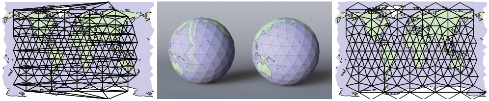

<center><b>图11.17 多边形地球仪：在左边，对于所有共享的顶点，纹理坐标函数是连续的，但是对于穿过180度子午线的三角形必然会有问题，因为纹理坐标是从接近 180 度的经度插值到接近 −180 度的经度。在右侧，一些顶点被复制，它们具有相同的 3D 位置，但纹理坐标在经度上有 360 度的差异，因此纹理坐标是在子午线上插值的而不是在整个地图上。

​		创建干净过渡的唯一方法是避免在接缝处共享纹理坐标：穿越新西兰的三角形需要插入经度 +181，在太平洋的下一个三角形需要继续从经度 −179 开始。为此，我们复制接缝上的顶点：对于每个顶点，我们添加具有相同的经度第二个顶点，相差的 360◦，且在接缝的相反边的三角形使用不同的顶点。这个解决方案如图 11.17 的右半部分所示，其中纹理空间最左边和最右边的顶点是重复的，它们具有相同的3D位置。

### 11.3 反走样纹理查找（Antialiasing Texture Lookups）

​		纹理映射的第二个基本问题是反走样。渲染纹理映射图像是一个采样过程：将纹理映射到表面上，然后将表面投影到图像中，生成一个横跨图像平面的2D函数，我们以像素对其进行采样。正如我们在第 9 章中所看到的，当图像包含细节或尖锐的边缘时，使用点样本来做这个将产生走样 artifacts——由于纹理上全部的点就是引入细节，它们成为走样问题的主要来源，就像我们在图 11.3 中看到的那样。

*现在复习一下第 9 章的前半部分是个好主意。*

​		就像线或三角形的反走样光栅化、反走样射线追踪（第 13.4 节）或向下采样图像（第 9.4 节）一样，解决方案是使每个像素不是一个点样本，而是图像的区域平均值，区域大小与像素相似。使用与反走样光栅化和光线追踪相同的超采样方法，在不改变纹理映射机制的情况下，只要有足够的采样，就可以获得良好的结果：一个像素区域内的许多样本会落在纹理图的不同位置，使用不同的纹理查找计算出的平均着色结果是近似图像在像素上的平均颜色的一种精确的方法。然而，使用详细的纹理需要很多样本才能得到好的结果，这是缓慢的。在表面上纹理存在的情况下，有效地计算这一区域平均值是纹理反走样的第一个关键问题。

​		纹理图像通常由光栅图像定义，因此也需要考虑重构问题，就像上采样图像一样（章节 9.4）。对于纹理，解决方案是相同的：使用重构过滤器在像素之间进行插值。

​		我们将在以下各节中详细讨论这些主题。

#### 11.3.1 一个像素的覆盖区（The Footprint of a Pxiel）

​	使反走样纹理比其他类型的反走样更复杂的是，渲染图像和纹理之间的关系是不断变化的。每个像素值都应该作为图像中属于该像素的区域的平均颜色来计算，在通常情况下，该像素正在查看单个表面，这相当于对表面上的一个区域进行平均。如果表面颜色来自纹理，那么这就相当于对纹理的相应部分进行平均，被称为像素的纹理空间覆盖区（texture space footprint）。图 11.18 展示了正方形区域（在低分辨率图像中可能是像素区域）的覆盖区如何映射到地板纹理空间中大小和形状非常不同的区域。

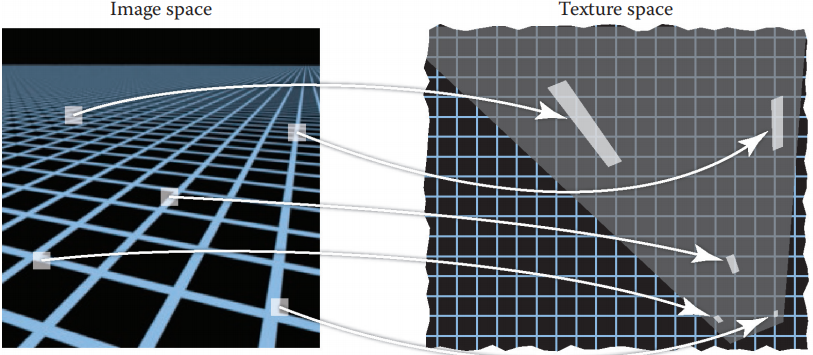

<center><b>图11.18 图像中相同大小的正方形区域在纹理空间中的覆盖区大小和形状在整个图像中都不同。

​		回想一下使用纹理渲染所涉及的三个空间：将三维点映射到图像的投影 π 和将三维点映射到纹理空间的纹理坐标函数 φ。为了处理像素覆盖区，我们需要理解这两个映射的组成：首先使用 π 的逆从图像到表面，然后使用 φ 。ψ = φ ◦ π^−1^ 是决定像素覆盖区的组合：一个像素的覆盖区是该像素在 ψ 映射下的图像的像素的方形面积的图像。

​		纹理反走样的核心问题是计算纹理在像素覆盖区上的平均值。一般来说，准确地做到这一点可能是一项相当复杂的工作：对于具有复杂表面形状的远处物体，覆盖区可以是一个覆盖纹理空间中的大片区域复杂的形状，或者可能是纹理空间中几个不相连的区域。但在典型情况下，一个像素落在表面的平滑区域，该区域被映射到纹理中的单个区域。

​		由于 ψ 同时包含从图像到表面的映射和从表面到纹理的映射，所以覆盖区的大小和形状取决于观察情况和纹理坐标函数。当表面距离相机越近，像素覆盖区越小，当该表面移动得更远时，覆盖区就会变大。当以斜角观察表面时，表面上的像素覆盖区被拉长，这通常意味着它在纹理空间中也会被拉长。即使是一个固定的视角，纹理坐标函数也会导致覆盖区的变化：如果它扭曲了区域，覆盖区的大小就会变化，如果它扭曲了形状，它们甚至可以被拉长，即使对于正面观察表面。

​		然而，为了找到一个有效的算法计算反走样查找，将需要一些大量的近似。当一个函数是平滑的时候，线性近似通常是有用的。在纹理反走样的情况下，这意味着将 ψ 从图像空间到纹理空间的映射近似为从 2D 到 2D 的线性映射：
$$
\Psi{}(x) = \Psi{}(x_{0}) + J(x - x_{0})
$$
*用数学家的术语，我们给出了 ψ 函数的一项泰勒级数近似。*

其中 2 × 2 矩阵 J 是 ψ 的导数的近似。它有四个分量，如果我们将图像空间位置表示为 **x** = (x, y)，纹理空间位置表示为 **u** = (u, v)，那么
$$
M = \begin{bmatrix}\frac{du}{dx} & \frac{du}{dy} \\ \frac{dv}{dx} & \frac{dv}{dy}\end{bmatrix}
$$
当我们改变 x 和 y 时，这四个导数描述了在图像中的一点 (x, y) 上被看见的纹理点 (u, v) 的变化。

​		这种近似的几何解释是说，在图像中以 x 为中心的一个单位大小的正方形像素区域将会近似映射到纹理空间中一个平行四边形，它以 ψ(x) 为中心且边平行于向量 **u~x~** = (du/dx, dv/dx) 和 **u~y~** = (du/dy, dv/dy)。

​		导数矩阵 J 是有用的，因为它讲述了图像（近似的）纹理空间覆盖区变化的整个故事。大小越大的导数表示纹理空间覆盖区越大，导数向量 **u~x~** 和 **u~y~** 之间的关系表示形状。当它们是正交的并且长度相同时，覆盖区是正方形的，当它们变得歪斜和/或在长度上非常不同时，覆盖区就会变长。

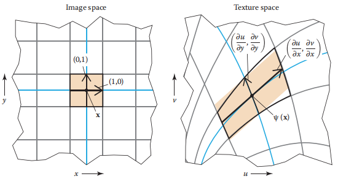

<center><b>图11.19 使用从 (x, y) 到 (u, v) 的映射的导数可以得到一个像素纹理空间覆盖区的近似。x 和 y 的偏导数平行于 x 和 y 等值线的图像（蓝色），并跨越一个平行四边形（橙色），其近似精确覆盖区的曲线形状（黑色轮廓）。

​		我们现在已经达到了通常被认为是 “正确答案” 的问题的形式：在特定图像空间位置的过滤纹理样本应该是在通过纹理坐标在那个点的导数定义的平行四边形形状的覆盖区上的纹理贴图平均值。这已经包含了一些假设——即，从图像到纹理的映射是平滑的——但对于优秀的图像质量来说，它是足够精确的。然而，这个平行四边形的面积平均值已经太昂贵，无法精确计算，所以使用了各种各样的近似。纹理反走样的方法在速度/质量上的权衡是不同的，它们在近似这个查找时做出了不同的选择。我们将在下几节讨论这些问题。

*这里的方法是使用盒子过滤器对图像进行采样。有些系统使用高斯像素过滤器，它在纹理空间中变成椭圆高斯，也就是椭圆加权平均（elliptical weighted averaging，EWA）。*

#### 11.3.2 重构（Reconstruction）

​		当覆盖区小于一个纹素时，我们放大纹理将其映射到图像中。这种情况类似于对图像进行上采样，主要考虑的是在纹素之间进行插值，以产生一个纹素网格不明显的平滑图像。就像在图像上采样，平滑过程是由一个重构滤波器定义的，其用于计算纹理空间中任意位置的纹理样本。（参见图 11.20）

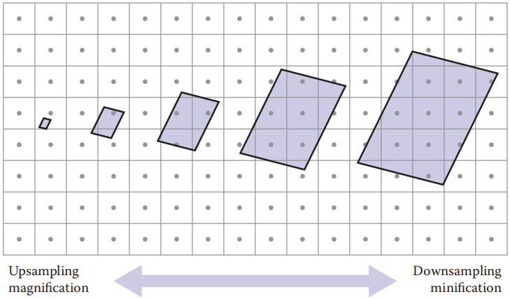

<center><b>图11.20 纹理过滤的主要问题随覆盖区大小而变化。对于小的覆盖区（左），需要在像素之间插值，以避免块状的 artifacts，对于大的覆盖区，挑战是有效地找到许多像素的平均值。

​		这些考虑事项与图像重采样基本相同，但有一个重要的区别。在图像重采样中，任务是在规则网格上计算输出样本，而这种规则性使可分离重构滤波器的重要优化成为可能。在纹理过滤中，查找的图案不规律，需要单独计算样本。这意味着大的，高质量的重建过滤器的使用是非常昂贵，由于这个原因，通常用于纹理的最高质量的过滤器是双线性插值。双线性插值纹理样本的计算相当于用双线性插值计算上采样图像中的一个像素。首先，我们用（实值）纹素坐标表示纹理空间样本点，然后读取四个相邻纹素的值并进行平均。纹理通常在单位正方形上参数化，纹素的定位方式与任何图像中的像素相同，在 u 方向上间隔 1/n~u~ 距离，在 v 方向上间隔 1/n~v~ 距离，纹素 (0,0) 位于距离边缘对称的半个纹素位置。（参见第 9 章获得完整的解释）

```c++
Color tex_sample_bilinear(Texture t, float u, float v){
	u_p = u * t.width - 0.5
	v_p = v * t.height - 0.5
	iu0 = floor(u_p)
	iu1 = iu0 + 1
	iv0 = floor(v_p)
	iv1 = iv0 + 1
	a_u = (iu1 - u_p)
	b_u = 1 - a_u
	a_v = (iv1 - v_p)
	b_v = 1 - a_v
	return a_u * a_v * t[iu0][iv0] + a_u * b_v * t[iu0][iv1] + 
		b_u * a_v * t[iu1][iv0] + b_u * b_v * t[iu1][iv1]
}
```

​		在许多系统中，这个运算成为一个重要的性能瓶颈，主要是因为从纹理数据中获取四个纹素值所涉及的内存延迟。对纹理采样点的图案是不规则的，因为从图像到纹理空间的映射是任意的，但通常是连贯的，因为附近的图像点倾向于映射到可能读取相同纹素的附近纹理点。因此，高性能系统有专门用于纹理采样的特殊硬件，其用于处理插值，和管理最近使用的纹理数据的缓存以最小化从存储纹理数据的内存中获取缓慢数据的数量。

​		读完第 9 章后，你可能会抱怨线性插值对于某些苛刻的应用来说可能不是一个足够平滑的重构。然而，使用更好的滤波器足够好的将纹理重采样到更高的分辨率，所以双线性插值也能很好地工作使纹理足够光滑，

#### 11.3.3 Mipmapping（多级渐远纹理）

​		只满足于纹理被放大的情况的一个好的插值：像素覆盖区比纹素间距小的地方。当一个像素覆盖区覆盖许多纹素时，良好的反走样需要计算许多纹素的平均值来平滑信号，以便安全采样。

​		一个非常精确的计算覆盖区上的平均纹理值的方法是找到覆盖区内的所有纹素，并将它们相加。然而，当覆盖区很大时，这可能会非常昂贵——仅一次查找就需要读取数千纹素。一个更好的方法是预计算和存储不同大小位置的不同区域纹理的平均值。

*“mip” 这个名字代表拉丁短语 multim in parvo，意思是 “在一个小空间中的很多”*

​		这个想法的一个非常流行的版本被称为 “MIP 映射” 或简称为 mipmapping。一个 mipmap 是一个纹理序列，所有纹理都包含相同的图像，但分辨率越来越低。原始的全分辨率纹理图像被称为 mipmap 的基础级别，或级别0，而级别 1 是通过获取该图像并在每个维度上对其进行因子 2 的向下采样而生成的，结果是有四分之一的纹素的图像。这个图像中的纹素，粗略地说，是 0 级图像中 2 × 2 纹素大小的正方形区域的平均值。

​		这个过程可以继续定义任意多的想要的 mipmap 级别：k 级图像通过对 k−1 级图像向下采样 2 来计算。一个 k 级的纹素对应于原始纹理中 2^k^ × 2^k^ 纹素的正方形区域。例如，从 1024 × 1024 的纹理图像开始，我们可以生成一个包含 11 个级别的 mipmap：级别 0 是 1024 × 1024 ，第 1 级是 512 × 512 ，如此类推，直到第 10 级，它只有一个纹素。这种以一系列越来越低的采样率表示相同内容的图像结构被称为图像金字塔（iamge pyramid），它是基于将所有较小的图像堆叠在原始图像之上的视觉隐喻。

#### 11.3.4 使用 Mipmap 进行基本纹理过滤（Basic Texture Filtering with Mipmaps）

​		有了 mipmap 或图像金字塔在手，纹理过滤可以比单独访问多个纹素更有效地完成。当我们需要一个大区域的平均纹理值时，我们只需简单的使用 mipmap 的更高级别的值，这些值已经是大区域图像的平均值了。最简单和最快的方法是从 mipmap 中查找单个值，选择级别，使该级别的纹素所覆盖的大小与像素覆盖区的总体大小大致相同。当然，像素覆盖区可能在形状上与纹素所代表的（总是正方形）区域有很大的不同，我们可以预期这会产生一些 artifacts。  

​		暂且不考虑当像素覆盖区有一个细长形状时该怎么办的问题，假设覆盖区是宽度 D 的正方形，以全分辨率纹理中的纹素测量的。什么级别的 mipmap 适合采样？因为 k 级的像素覆盖宽度为 2^k^ 的正方形，所以合适的 k 的选择似乎是
$$
2^{k} \approx{} D
$$
所以我们让 k = log~2~D。当然，这在大多数情况下会给出 k 的非整数值，我们只存储了整数级别的 mipmap 图像。两种可能的解决方案是只查找最接近 k 的整数的值（有效，但在层之间的突变处会产生接缝）或查找最接近 k 的两个整数的值，然后线性插值这些值（工作量翻倍，但更平滑）。

​		在我们真正写下采样 mipmap 的算法之前，我们必须决定当覆盖区不是正方形时，我们将如何选择 “宽度” D。一些可能的方法是使用面积的平方根，或者找到覆盖区的最长轴并将其作为宽度。一个很容易计算的实用折中方法是使用最长边的长度：
$$
D = \max{\{||\vec{u_{x}}||,||\vec{u_{y}}||\}}
$$

```c++
Color mipmap_sample_trilinear(Texture mip[], float u, float v, matrix J){
	D = max_column_norm(J)
	k = log2(D)
	k0 = floor(k)
	k1 = k0 + 1
	a = k1 - k
	b = 1 - a
	c0 = tex_sample_bilinear(mip[k0], u, v)
	c1 = tex_sample_bilinear(mip[k1], u, v)
	return a * c0 + b * c1
}
```

​		基本的 mipmapping 在消除走样方面做得很好，但因为它无法处理拉长的或各向异性（anisotropic）的像素覆盖区，所以当以掠角观看表面时，它的表现就不太好。最常见的是在大平面上，是观察者站的一个表面。由此产生的图像在水平方向上会出现模糊。

#### 11.3.5 各向异性过滤（Anisotropic Filtering）

​		一个 mipmap 可以与多个查找一起使用，以更好地近似一个延长的覆盖区。其思想是根据覆盖区的最短轴而不是最长轴来选择 mipmap 级别，然后将沿着长轴间隔的几个查找相加求平均。（参见图 11.21）

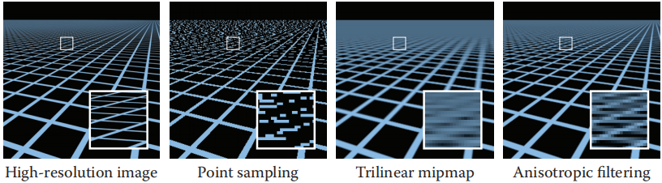

<center><b>图11.21 使用三种不同的策略对具有挑战性的测试场景（左边，显示详细结构的参考图像）进行反走样处理的结果：简单地用最近邻插值取单点样本；使用 mipmap 金字塔去平均纹理中的每个像素的正方形区域；使用来自mipmap的几个样本来平均纹理中的各向异性区域。

### 11.4 纹理映射的应用（Applications of Texture Mapping）

​		一旦您理解了为一个表面定义纹理坐标的概念和查找纹理值的机制，这种机制就有许多用途。在这一节中，我们将介绍一些纹理映射中最重要的技术，但是纹理是一个非常通用的工具，它的应用只受限于程序员所能想到的。

#### 11.4.1 控制着色参数（Controlling Shading Parameters）

​		纹理映射最基本的用途是通过在着色计算中使用漫反射颜色来引入颜色的变化——无论是在光线追踪器还是在片元着色器中——依赖于从纹理中查找的值。纹理漫反射分量可以用于粘贴贴花、油漆装饰或在表面上打印文本，它还可以模拟材料颜色的变化，例如木材或石头。

​		没有什么限制我们只改变漫反射的颜色。任何其他参数，如镜面反射或高光粗糙度，也可以被纹理化。例如，粘有透明包装胶带的纸板箱各处的漫反射颜色可能相同，但胶带所在的地方比其他地方更闪亮，具有更高的镜面反射和更低的粗糙度。在很多情况下，不同参数的映射是相关的：比如，一个光滑的白色陶瓷杯，上面印着一个标志，标志所在的地方可能更粗糙和黑（图 11.22），用金属油墨印刷书名的书可能会在漫反射色、镜面色和粗糙度上同时发生变化。

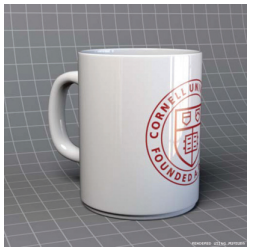

<center><b>图11.22 高光粗糙度由漫射颜色纹理的倒数副本控制的陶瓷杯。

#### 11.4.2 法线贴图和凹凸贴图（Normal Maps and Bump Maps）

​		另一个对着色很重要的参数是表面法线。通过法线插值（第 8.2 节），我们知道着色法线不必与表面的几何法线相同。法线映射通过让着色法线依赖于从纹理贴图中读取的值来利用这一事实。最简单的方法就是将法线存储在一个纹理中，并在每个被解释的纹素中存储三个数字，它不是作为一个颜色的三个分量，而是作为法线向量的 3D 坐标。

​		在使用法线贴图之前，我们需要知道从贴图读取的法线是在什么坐标系中表示的。将法线直接存储在对象空间中，使用与表示表面几何本身相同的坐标系，这是最简单的：从贴图上读取法线的方式可以与表面本身记录的法线完全相同：在大多数情况下，它将需要为光照计算转化到世界空间，就像一个正常的几何体。

​		然而，存储在对象空间中的法线贴图本质上是与表面几何形状绑定的——即使法线贴图没有效果（也就是完全和几何法线相同），为了用几何法线再现结果，法线贴图的内容必须跟踪表面的方向。此外，如果表面将要变形，导致几何法线改变，对象空间法线贴图也将不再被使用，因为它也要保持提供相同的着色法线。

​		解决方法是为附着在表面上的法线定义一个坐标系。这样的坐标系可以基于表面的切线空间来定义（参见 2.5 节）：选择一对切向量并使用它们来定义标准正交基（参见 2.4.5 节）。纹理坐标函数本身提供了一个有用的方法来选择一对切线向量：使用与 **u** 和 **v** 坐标轴相切的方向。这些切线通常不是正交的，但我们可以使用第 2.4.7 节的过程来获得标准正交基，或者它可以使用表面法线和一个切向量来定义。

​		当法线在这个基上表示时，它们的变化会小得多；因为它们大多指向光滑表面的法线方向附近，所以它们将接近法线贴图中的向量 (0,0,1)^T^。

​		法线贴图从何而来？它们通常是从一个更详细的模型中计算出来的，而光滑表面只是一个近似；其他时候，它们可以直接从实际表面测量。们也可以作为建模过程的一部分进行编写；在这种情况下，最好使用凹凸贴图（bump map）来间接指定法线。它的思想是凹凸贴图是一个高度场：一个函数，给出超过光滑表面的精细表面的局部高度。如果值很高（如果你将贴图显示为图像，就看起来很亮），那么表面就会突出在平滑表面之外；在值低的地方（贴图看起来很暗），表面就会下降到它下面。例如，凹凸贴图中的一条狭窄的黑线是一个划痕，或者一个小白点是一个凹凸。

​		从凹凸贴图导出法线贴图是很简单的：法线贴图（在切线坐+标系中表示）是凹凸贴图的导数。

​		图 11.23 显示了用于创建木纹颜色的纹理贴图，并模拟由于完成浸泡入木材多孔部分导致表面粗糙度增加，且和凹凸贴图一起在木板之间创建不完美的光面和缝隙，以制作真实的木地板。

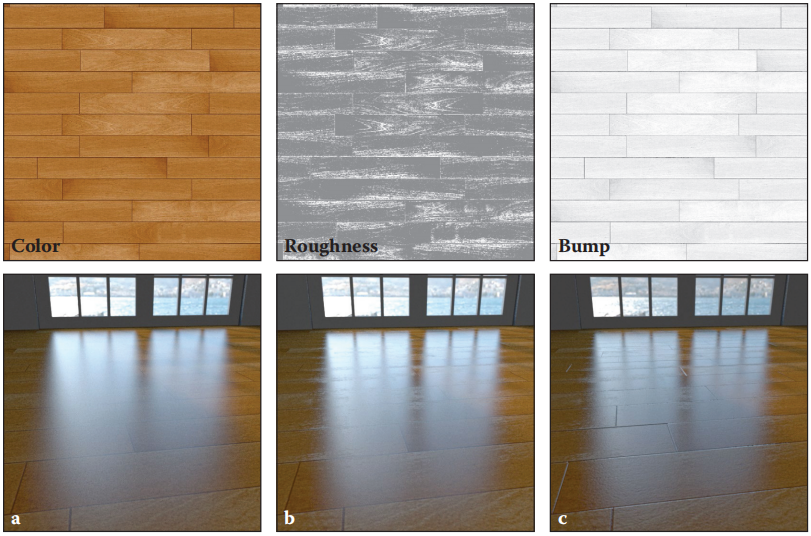

<center><b>图11.23 使用纹理贴图来控制着色的木地板渲染。(a)只有由纹理贴图调制的漫反射颜色。(b)高光粗糙度也由第二个纹理贴图调节。(c)表面法线通过凹凸贴图进行修改。

#### 11.4.3 位移贴图（Displacement Maps）

​		法线贴图的一个问题是，它们实际上根本不会改变表面；它们只是一个着色技巧。当法线贴图所暗示的几何图形在3D中产生明显的效果时，这一点就变得很明显。在静态图像中，首先要注意的问题通常是，尽管物体内部出现了凸起，但阴影仍然是平滑的。在动画中，缺乏视差暴露了凸起，尽管令人信服，但实际上只是 “绘制” 在表面上。

​		纹理不仅可以用于着色，他们也可以用来改变几何。位移贴图是这个想法最简单的版本之一。这个概念和凹凸贴图是一样的：一个标量（一个通道）贴图，它给出了基于 “平均地形” 的高度。但效果是不同的。与在使用平滑几何图形时从高度贴图中导出着色法线不同，位移贴图实际上改变了表面，它沿着平滑表面的法线移动每个点到一个新的位置，每一种情况下的法线大致相同，但表面不同。

​		最常见的实现位移贴图的方法是用大量的小三角形对光滑的表面进行细化，然后使用位移贴图置换得到的网格的顶点。 在图形管线中，这可以通过在顶点阶段使用纹理查找来实现，对于地形尤其方便。

#### 11.4.4 阴影贴图（Shadow Maps）

​		阴影是场景中物体关系的重要线索，正如我们所见，在光线追踪图像中包含阴影很简单。 然而，如何在光栅化渲染中得到阴影并不明显，因为表面是孤立地，一次只能考虑一个。

​		阴影贴图的概念是表示由点光源照亮的空间体积。想象一个像聚光灯或视频投影仪的光源，它从一个点向一个有限的方向发射光线。那个被照亮的体积——如果你把光源拿在手上，你就会看到光的点的集合——是将光源连接到离这个点最近的每条光线上的线段的结合。

​		  有趣的是，这个体积与位于光源同一点的透视相机所能看到的体积相同：当且仅当一个点从光源位置可见时，它才被光源照亮。在这两种情况下，有必要评估场景中各点的可见性：对于可见性，我们需要知道一个片元对相机是否可见，知道是否在图像中绘制它；对于阴影，我们需要知道一个片元对光源是否可见，知道它是否被光源照亮。（见图 11.24）

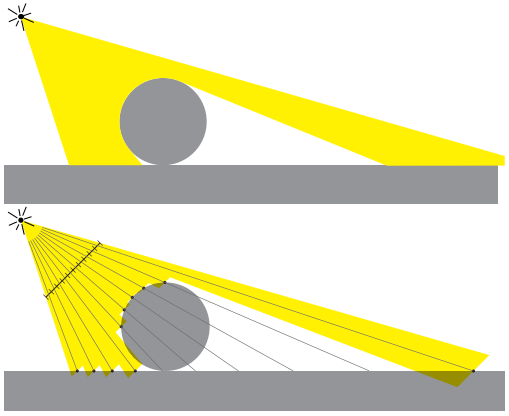

<center><b>图11.24 上图:被点光源照亮的空间区域。下图:用 10 像素宽的阴影贴图近似的区域。

​		在这两种情况下，解决方案是相同的：一张深度图，它可以告诉我们沿一堆光线到最近表面的距离。在可见性的情况下，这是 z-buffer（第 8.2.3 节），而在阴影情况下，它被称为阴影贴图。在这两种情况下，可见性都是通过比较新片元的深度和贴图中存储的深度来评估的，如果表面的深度大于最近的可见表面的深度，那么它将从投射点被隐藏（遮挡或阴影）。不同的是，z-buffer 用于跟踪到目前为止看到的最近的表面，并在渲染期间更新，而阴影贴图告诉整个场景中到最近的表面的距离。

​		阴影贴图是提前在单独的渲染 pass 中计算的：像往常一样简单地光栅化整个场景，并保留得到的深度图（不需要计算像素值）。然后，有了阴影贴图在手，你执行一个普通的渲染 pass，当你需要知道一个片元是否对光源可见， 你将它的位置投射到阴影贴图中（使用与最初渲染阴影贴图相同的透视投影），并将查找的值 d~map~ 与到光源的实际距离 d 进行比较。 如果距离相同，片元的点被照亮；如果 d > d~map~，这意味着有一个不同的表面更接近光源，所以它是阴影。

​		“如果距离相同” 这句话应该引起你的注意：因为所有涉及的量都是有限精度的近似，我们不能期望它们完全相同。对于可见点，d ≈ d~map~，但有时 d 会大一点，有时会小一点。由于这个原因，一个可以容忍的偏差是必需的：如果 d − d~map~ <  ε，则认为一个点被照亮。这种容忍 ε 被称为阴影偏差（shadow bias）。

​		当在阴影贴图中查找时，在贴图中记录的深度值之间进行插值并没有多大意义。这可能会在平滑区域产生更精确的深度（需要更少的阴影偏差），但会在阴影边界附近造成更大的问题，那里的深度值突然改变。因此，阴影贴图中的纹理查找是使用最近邻重构来完成的。为了减少走样，可以使用多个样本，平均 1 或 0 阴影结果（而不是深度）；这就是所谓的百分比更近过滤（percentage closer filtering）。

#### 11.4.5 Environment Maps（环境贴图）

​		就像纹理不需要添加更多的细节到模型中，就可以方便地将细节引入到表面的着色中一样，纹理也可以用于将细节引入到光照中，而不需要建模复杂的光源几何。当光线来自远处时，相对于视野中物体的大小，场景中从一个点到另一点的光照变化很小。假设光照只取决于你看的方向这个做法是很方便的，这样场景中所有的点都是一样的，然后用环境贴图来表达光照对方向的依赖。

​		环境贴图的概念是，在 3D 中定义方向的函数是单位球体上的函数，所以它可以使用纹理贴图来表示，就像我们在球形物体上表示颜色变化一样。我们不是从一个表面点的 3D 坐标计算纹理坐标，而是使用完全相同的公式从单位向量的 3D 坐标计算纹理坐标，该单位向量代表我们想要知道的光照方向。

​		环境贴图最简单的应用是在光线追踪器中给光线赋予颜色，而不击中任何物体：

```c++
trace_ray(ray, scene){
	if(surface = scene.intersect(ray)){
		return surface.shade(ray)
	}else{
		u, v = spheremap_coords(r.direction)
		return texture_lookup(scene.env_map, u, v)
	}
}
```

随着光线追踪器的改变，反射其他场景物体的光滑物体现在也会反射背景环境。

​		在光栅化的上下文中，可以通过在着色计算中添加一个镜面反射来实现类似的效果，着色计算与光线追踪器的计算方法相同，但只是简单的在环境贴图中直接查找，而不考虑场景中的其他对象：

```c++
shade_fragment(view_dir, normal){
	out_color = diffuse_shading(k_d, normal)
	out_color += specular_shading(k_s, view_dir, normal)
	u, v = shperemap_coords(reflect(view_dir, normal))
	out_color += k_m * texture_lookup(environment_map, u, v)
}
```

这种技术被称为反射映射（reflection mapping）。

​		一个更高级的环境贴图用法是从环境贴图计算所有的光照，而不仅仅是镜面反射。这是环境光照（environment lighting），可以在光线追踪器中使用蒙特卡罗积分来计算，也可以在光栅化中通过使用一组点光源并计`算许多阴影贴图来近似环境光照。

​		环境贴图可以存储在任何可以用于映射球体的坐标中。球面（经纬度）坐标是一种流行的选择，尽管在极点上压缩纹理会浪费纹理分辨率，并且会在极点上创建 artifacts。立方体贴图是一种更有效的选择，在交互式应用程序中广泛使用（图 11.25）。

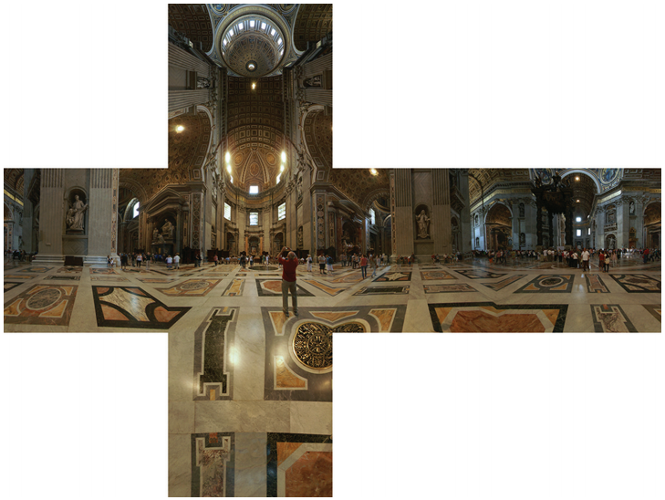

<center><b>图11.25 一幅圣彼得大教堂的立方体贴图，六个面以展开的 “水平交叉” 排列方式存储在图像中。（图片：Emil Persson）

### 11.5 程序化 3D 纹理（Procedural 3D Textures）

​		在前几章中，我们使用 c~r~ 作为物体上某一点的漫反射。对于一个不是单一颜色的对象，我们可以用一个函数 c~r~(**p**) 来代替它，它将 3D 点映射到 RGB 颜色（Peachey, 1985；佩林，1985）。这个函数可能只返回包含 **p** 的物体的反射率。但是对于带有纹理的物体，我们应该期望 c~r~(**p**) 随着 **p** 在一个表面上移动而变化。

​		定义从 3D 表面映射到 2D 纹理域的纹理映射函数的另一种方法是创建一个 3D 纹理，该纹理在 3D 空间的每个点上定义一个 RGB 值。我们只对表面上的点 **p** 调用它，但通常对所有三维点定义它要比可能是任意表面上的一个奇怪的 2D 点子集更容易。3D 纹理映射的优点是很容易定义映射函数，因为表面已经嵌入到 3D 空间中，并且从 3D 到纹理空间的映射没有失真。这种策略显然适用于从固体介质“雕刻”出来的表面，例如大理石雕塑。

​		3D 纹理的缺点是，将它们存储为 3D 光栅图像或体积会消耗大量内存。由于这个原因，3D 纹理坐标最常用于程序化纹理，其中纹理值是使用数学过程计算的，而不是通过从纹理图像中查找它们。在本节中，我们将介绍几个用于定义程序化纹理的基本工具。这些也可以用来定义 2D 程序化纹理，尽管在 2D 中更常见的是使用光栅纹理图。

#### 11.5.1 3D 条纹纹理（3D Sprite Texture）

​		制作条纹纹理的方法多得惊人。让我们假设我们有两种颜色 c~0~ 和 c~1~，我们想要使用它们来制作条纹颜色。我们需要一些振动函数使能在两个颜色中切换。一个简单的例子是 sin：

```c++
RGB stripe(point vecP){
	if(sin(x_p) > 0) then
		return c_0
	else
		return c_1
}
```

我们还可以使条纹的宽度 w 可控：

```c++
RGB stripe(point vecP, real w){
	if(sin(pi * x_p / w) > 0) then
		return c_0
	else
		return c_1
}
```

如果我们想在条纹颜色之间平滑地插值，我们可以使用一个参数 t 来线性地改变颜色:

```c++
RGB stripe(point vecP, real w){
	t = (1 + sin(pi * p_x / w)) / 2
	return (1 - t)c_0 + t * c_1
}
```

这三种可能性如图 11.26 所示。

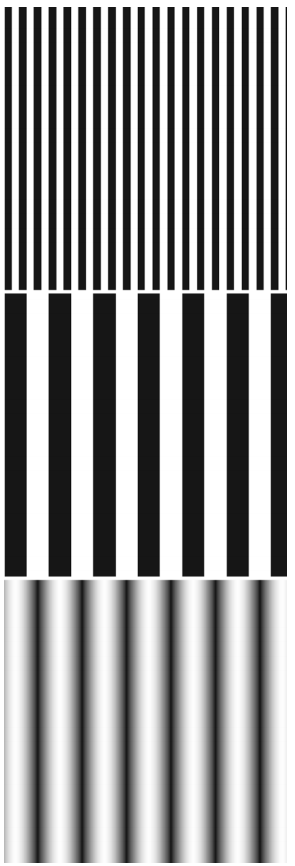

<center><b>图11.26 在保持 z 不变的情况下，绘制 xy 点的固定数组会产生各种条纹纹理。

#### 11.5.2 立体噪声（Solid Noise）

​		虽然规则纹理（如条纹）通常很有用，但我们希望能够制作出 “斑纹” 纹理，就像我们在鸟蛋上看到的那样。这通常是通过使用一种 “立体噪音” 来实现的，通常被称为柏林噪音（Perlin noise），以其发明者的名字命名，他因其对电影工业的影响而获得了奥斯卡技术奖（Perlin，1985）。

​		通过为每个点调用一个随机数来获得一个有噪声的外观是不合适的，因为它就像电视静电噪声中的 “白噪声”。我们想让它更平滑，而不失去随机的质量。一种可能性是模糊白噪声，但这没有实际的实现。另一种可能性是，在每个 lattice 点上用一个随机数做一个大 lattice，然后为这些 lattice 节点之间将这些随机点插值为新的点；这只是一个 3D 纹理数组，如上一节所述，数组中包含随机数。这种技术使 lattice 过于明显。柏林使用了各种技巧来改进这种基本的 lattice 技术，所以 lattice 就不那么明显了。这导致了一组看起来相当巴洛克（baroque）的步骤，但本质上只有从线性插值一个随机值的 3D 数组的三个变化。第一个变化是使用 Hermite 插值来避免马赫带（mach bands），就像规则纹理可以做的那样。第二个变化是使用随机向量而不是随机值，通过点积得到随机数；这使得底层的网格结构在视觉上不那么明显，因为它移动了网格顶点的局部极小值和极大值。第三个变化是使用 1D 数组和哈希来创建随机向量的虚拟 3D 数组。这增加了计算以减少内存使用。以下是他的基本方法：
$$
n(x, y, z) = \sum^{\lfloor{}x\rfloor{}+1}_{i=\lfloor{}x\rfloor{}}\sum^{\lfloor{}y\rfloor{}+1}_{j=\lfloor{}y\rfloor{}}\sum^{\lfloor{}z\rfloor{}+1}_{k=\lfloor{}z\rfloor{}}\Omega_{ijk}(x-i, y-j, z-k)
$$
其中 (x, y, z) 是 **x** 的笛卡尔坐标，且
$$
\Omega_{ijk}(u,v,w) = \omega(u)\omega(v)\omega(w)(\Gamma_{ijk} \cdot{} (u,v,w))
$$
ω(t) 为三次加权函数：
$$
\omega(t) = \left\{
\begin{array}{c}
2|t|^{3} - 3|t|^{2} + 1 \qquad{} if\;|t|\;<\;1,
\\
0 \qquad{}\qquad{}\qquad{}\qquad{} ohterwise
\end{array}
\right.
$$
​		最后一点是 Γ~ijk~ 是 lattice 点 (x, y, z) = (i, j, k) 的一个随机单位向量。因为我们想要任何潜在的ijk，所以我们使用一个伪随机表：
$$
\Gamma_{ijk} = G(\phi(i + \phi(j + \phi(k))))
$$
其中 G 为 n 个随机单位向量的预计算数组，φ(i) = P[i mod n]，其中 P 是一个长度为 n 的数组，其包含从 0 到 n−1 的一系列整数。实际上，柏林发现 n = 256 可以很好地工作。为了选择一个随机的单位向量 (v~x~, v~y~, v~z~)  首先设置
$$
\begin{align}
v_{x} &= 2\xi - 1 \\
v_{y} &= 2\xi' - 1 \\
v_{z}& = 2\xi'' - 1
\end{align}
$$
其中 ξ，ξ''，ξ'' 是标准随机数（在区间 [0,1] 中一致）。然后，如果(v~x~^2^ +v~y~^2^ +v~z~^2^) < 1，则使向量成为一个单位向量。否则，继续随机设置它，直到它的长度小于 1，然后使它成为一个单位向量。这是一个拒绝方法（rejection method）的例子，将在第 14 章中详细讨论。本质上，“小于” 测试在单位球面上得到一个随机点，而原点到这个点的向量是均匀随机的。这对于立方体中的随机点来说是不成立的，所以我们在测试中 “删除” 了角落。

​		因为立体噪声可以是正的或负的，所以它必须在转换成颜色之前进行变换。如图 11.27 所示，一个 10 × 10 的正方形上噪声的绝对值以及拉伸的版本。这些版本通过缩放输入到噪声函数的点来拉伸。

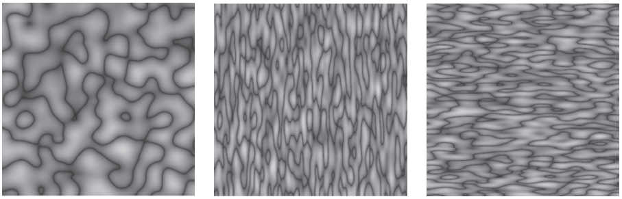

<center><b>图11.27 立体噪声的绝对值，以及按比例缩放 x 和 y 值的噪声

​		黑色的曲线是原始噪声函数从正到负的变化。由于噪声从 −1 到 1 不等，为颜色使用 (噪声+ 1)/2 可以获得更平滑的图像。然而，由于接近 1 或 −1 的噪声值很少，这将是一个相当平滑的图像。更大的缩放可以增加对比（图 11.28）。

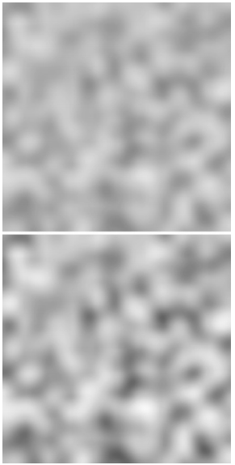

<center><b>图11.28 为强度选择 0.5(噪声+1)（上图）和 0.8(噪声+1)（下图）

#### 11.5.3 湍流（Turbulence）

​		许多自然纹理在同一纹理中包含不同的特征大小。柏林使用了伪分形 “湍流” 函数：
$$
n_t(\vec{x}) = \sum_{i}\frac{|n(2^{i}\vec{x})|}{2^{i}}
$$
如图 11.29 所示，这有效地在噪声函数自身之上重复添加缩放副本。

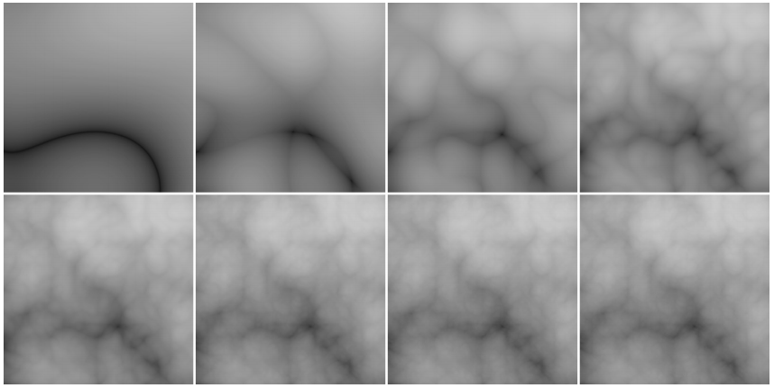

<center><b>图11.29 湍流函数（从左上到右下）求和中有一项到八项。

​		湍流可以用来扭曲条纹函数：

```c++
RGB turbstripe(point vecP, double w){
	RGB turbstripe(point vecP, double w)
	double t = (1 + sin(k_1*z_p + turbulence(k_2 * vecP)) / w) / 2
	return t * s_0 + (1 - t) * s_1
}
```

k~1~ 和 k~2~ 的不同值被用来生成图 11.30。

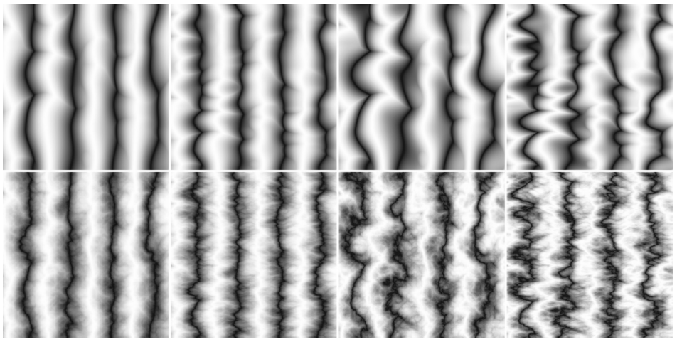

<center><b>图11.30 不同的 k_1, k_2 的各种湍流条纹纹理。第一行只有湍流系列的第一项。

### 常见问答（Frequently Asked Questions）

- **我如何在光线追踪中实现位移贴图？**

  没有理想的方法来做这件事。生成所有三角形并在必要时缓存几何图形将防止内存过载（Pharr & Hanrahan, 1996;

Pharr, Kolb, Gershbein, & Hanrahan, 1997）。 当位移函数受到限制时，尝试直接与位移表面相交是可能的。（Patterson,

Hoggar, & Logie, 1991; Heidrich & Seidel, 1998; Smits, Shirley, & Stark, 2000）

- **为什么我的纹理图像看起来不真实？**

  人类善于看到表面上的小瑕疵。几何缺陷（Geometric imperfections）通常在使用纹理贴图的计算机生成的图像中是不存在的，所以它们看起来“太光滑”。

### 备注（Notes）

​		透视校正纹理的讨论是基于 《Fast Shadows and Lighting Effects Using Texture Mapping》(Segal, Korobkin, van Widenfelt, Foran, & Haeberli, 1992) 和 《3D Game Engine Design》（Eberly, 2000）。

### 练习（Exercises）

1. 使用表面和立体技术找到几种实现无限 2D 棋盘（checkerboard）的方法。哪个是最好的呢？
2. 使用蛮力代数验证式（11.3）为有效等式。
3. 如何使用 z-buffer 深度和一个矩阵变换实现立体贴图。
4. 将函数 mipmap_sample_trilinear 展开为一个单独的函数。
