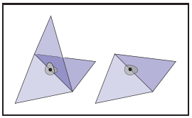
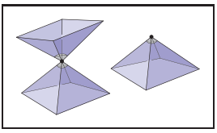
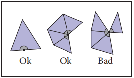
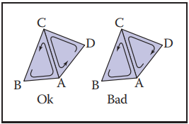
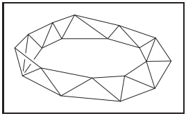
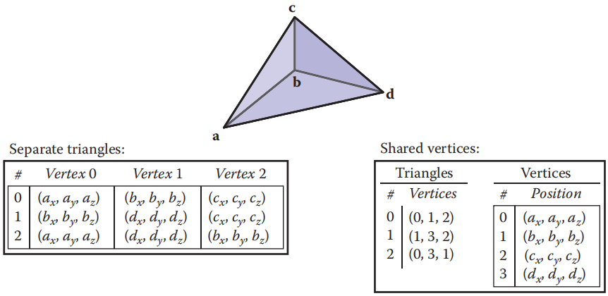

​		某些数据结构似乎在图形应用程序中反复出现，可能是因为它们处理了基本的底层思想，如表面、空间和场景结构。本章讨论了几种最常见和最有用的基本和不相关的数据结构:网格结构、空间数据结构、场景图和平铺多维数组。

​		对于网格，我们将讨论用于存储静态网格和将网格传输到图形 api 的基本存储方案。我们还讨论了翼边（winged-edge）数据结构（Baumgart, 1974）和相关的半边结构，这些结构对于管理在如细分或模型简化时发生镶嵌变化的模型非常有用。虽然这些方法适用于任意多边形网格，但我们在这里将重点放在更简单的三角形网格上。

​		接着，给出了场景图数据结构。这种数据结构的各种形式在图形应用程序中普遍存在，因为它们在管理对象和转换方面非常有用。所有新的图形 api 都被设计用来支持场景图形。

​		对于空间数据结构，我们讨论了在三维空间中组织模型的三种方法——包围体层次、层次空间细分和均匀空间细分——以及使用分层空间细分（BSP 树）进行隐藏面去除。同样的方法也用于其他目的，包括几何裁剪和碰撞检测。

​		最后，给出了平铺多维数组。这种结构最初是为了帮助需要从磁盘交换图形数据的应用程序的分页性能而开发的，现在无论阵列是否适合主存，这种结构对于机器上的内存局部化都是至关重要的。

### 12.1 三角形网格（Triangle Meshes）

​		大多数真实世界的模型都是由具有共享顶点的三角形组成的复合体。这些通常被称为三角网格（triangular mesh）、三角形网格（triangle）或三角形不规则网络（irregular network，TIN），有效地处理它们对许多图形程序的性能至关重要。网格存储在磁盘和内存中，我们希望最小化存储的消耗量。当网格在网络间或从CPU传输到图形系统时，它们会消耗带宽，而带宽往往比存储更宝贵。在对网格执行操作的应用程序中，除了简单地存储和绘制它们之外——例如细分、网格编辑、网格压缩或其他操作——高效地访问邻接信息是至关重要的。三角形网格通常用于表示表面，所以网格不仅仅是不相关的三角形的集合，而是通过共享的顶点和边相互连接，形成单个连续的表面的三角形网。这是一个关于网格的关键观点：一个网格可以比相同数量的不相关三角形的集合更有效地处理。

​		三角形网格所需的最小信息是一组三角形（顶点的三元组）及其顶点的位置（在三维空间中）。但是很多（如果不是大多数的话）程序需要在顶点、边或面存储额外数据的能力，以支持纹理映射、着色、动画和其他操作。顶点数据是最常见的：每个顶点可以有材质参数、纹理坐标、辐照度——任何在整个表面上值变化的参数。这些参数然后在每个三角形上线性插值，以在网格的整个表面上定义一个连续函数。然而，能够在每个边或每个面中存储数据有时也很重要。

#### 12.1.1 网格拓扑（Mesh Topology）

​		类似于表面的网格可以被形象化为网格拓扑的约束——三角形连接在一起的方式，不考虑顶点位置。许多算法只能在具有可预测连接的网格上工作，或者更容易实现。在网格的拓扑结构上，对于表面最简单和最严格的要求是变为流形（manifold）。一个流行网格是 ”水密的“——它没有缝隙，将表面的内部空间与外部空间隔开。 它看起来也像表面的所有地方都在网格上。

​		流形这个术语来自于拓扑学的数学领域：粗略的说，一个流形（特别是二维流形，或 2-流形）是一种表面，其中任何点周围的一个小邻域可以被磨平成一点平面。反例可以最清楚地解释这个观点：如果网格上的一个边有三个三角形连接，边上的一个点的邻域与三角形内部的一个点的邻域不同，因为它有一个额外的“鳍”伸出来（图 12.1）.如果这条边恰好有两个三角形与之相连，那么边上的点有像内部的点一样的邻域，只是中间有一条折痕。类似地，如果共享一个顶点的三角形处于图 12.2 中左边的那个形状中，邻域就像中间粘在一起的两块表面，如果不将其加倍，就无法将其平展。右边所示的带有更简单领域的顶点就很好。



<center><b>图12.1 非流形（左图）和流形（右图）的内部边



<center><b>图12.2 非流形（左图）和流形（右图）的内部顶点

​		许多算法都假设网格是流形的，如果你处理的是一个畸形的网格，输入的时候验证这个属性总是一个好主意，以防止崩溃或无限循环。这种验证可以归结为通过验证以下条件来检查所有的边是否为流形，以及所有的顶点是否为流形：

- 每条边都正好由两个三角形共享。
- 每个顶点周围都有单独的、完整的三角形循环。

图 12.1 说明了一条边因为有太多三角形而在第一个测试中失败的原因，图 12.2 说明了一个顶点如果有两个单独的三角形循环连接在它上面，就会在第二个测试中失败。

​		流形网格是方便的，但有时允许网格有边或边界是必要的。这样的网格不是流形的，边界上的点有一个一边被切断的邻域。它们不一定是水密的。然而，我们可以将流形网格的要求放宽到不会对大多数网格处理算法造成问题的具有边界的流形网格。放宽的条件是：

- 每条边都被一个或两个三角形使用
- 每个顶点都连接到一个三角形的单一用边连接的集合。

图 12.3 说明了这些条件：从左到右，有一个三角形的一条边，有一个其相邻的三角形位于一个单一边相连的集合中顶点，还有一个顶点与两个不相连的三角形集合相连。



<center><b>图12.3 具有边界的流形边的条件

​		最后，在许多应用程序中，能够区分表面的 “正面” 或 “外部” 与 “背面” 或 “内部” 是非常重要的——这被称为表面的朝向（orientation）。对于单个三角形，我们根据顶点列出的顺序定义方向：正面是三角形的三个顶点按逆时针顺序排列的那一边。一个连通的网格，如果它的三角形都一致同意哪边是前面的，这是朝向一致——当且仅当每一对相邻三角形都朝向一致时是正确的。

​		在一对朝向一致的三角形中，两个共享的顶点以相反的顺序出现在两个三角形的顶点列表中（图 12.4）。重要的是朝向的一致性——一些系统用顺时针而不是逆时针的顺序来定义正面。



<center><b>图12.4 三角形 (B,A,C) 和 (D,C,A) 是朝向一致的，然而 (B,A,C) 和 (A,C,D) 朝向不一致

​		任何具有非流形边的网格都不能朝向一致。但也有可能是一个带有边界的有效流形（甚至是流形）的网格，其没有一致的方法来确定三角形的方向——它们不是可定向的表面。如图 12.5 所示的 Mobius 条带就是一个例子。然而，在实践中这很少是一个问题。



<center><b>图12.5 一个 Mobius 三角条纹，它是不可定向的

#### 12.1.2 索引网格存储（Indexed Mesh Storage）

​		一个简单的三角网格如图 12.6 所示。你可以把这三个三角形作为独立的实体存储，每一个都是这种形式：

```c++
Triangle{
	vector3 vertexPosition[3];
}
```



<center><b>图12.6 一个有四个顶点的三个三角形网格，用单独的三角形（左图）和共享的顶点（右图）表示。

这将导致顶点 **b** 存储 3 次，其他顶点每个存储 2 次，总共存储 9 个点（三个三角形每个存储 3 个顶点）。或者你可以安排共享公共顶点，只存储四个，得到一个共享顶点网格（shared-vertex mesh）。逻辑上，该数据结构具有指向包含顶点数据的顶点的三角形：

```c++
Triangle{
	Vertex v[3];
}

Vertex{
	vector3 position;
}
```

注意 v 数组中的条目是指向 Vertex 对象的引用或指针；顶点不包含在三角形中。

​		在实现中，顶点和三角形通常存储在数组中，三角形到顶点的引用通过存储数组索引来处理：

```c++
IndexedMesh{
	int tInd[nt][3]
	vector3 verts[nv]
}
```

第 i 个三角形的第 k 个顶点的索引在 tInd\[i\][k\] 中找到，该顶点的位置存储在 verts 数组的相应行中；示例见图 12.8。*：*这种存储共享顶点网格的方法是索引三角形网格。这种存储共享顶点网格的方法是索引三角形网格（indexed triangle mesh）。


