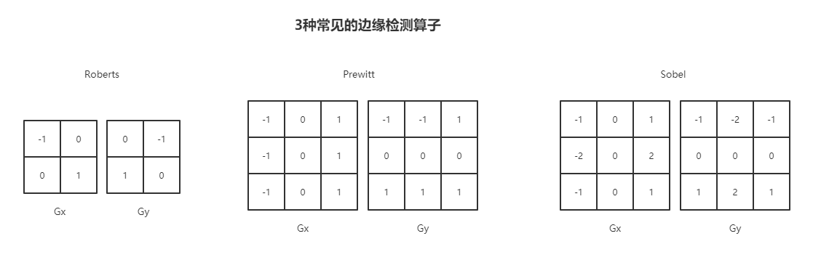

### 12.1 建立一个基本的屏幕后处理脚本系统

- 屏幕后处理：在渲染完整个场景得到屏幕图像后，再对该图像进行一系列操作，实现各种屏幕特效

- Unity提供了OnRenderImage函数将当前渲染得到的图像存储在第一个参数对应的渲染纹理中，通过函数中的一系列操作后再把第二个参数目标渲染纹理显示在屏幕上，默认情况下该函数会在所有的不透明和透明Pass执行完毕后被调用，以便对场景中所有游戏对象都产生影响，若只想在不透明Pass执行完后立即调用，则在该函数前添加ImageEffectOpaque属性实现该效果。而在OnRenderImage函数中通常使用Graphics.Blit函数完成对渲染纹理的处理

  ```c#
  public static void Blit(Texture src, RenderTexture dest);
  // pass为-1表示依次调用Shader内所有Pass，否则只调用给定索引的pass
  public static void Blit(Texture src, RenderTexture dest, Material mat, int pass = -1);
  public static void Blit(Texture src, Material mat, int pass = -1);
  ```

- 在Unity中实现屏幕后处理效果过程通常如下：

  1. 检查一些系列条件是否满足，如当前平台是否支持渲染纹理和屏幕特效，是否支持当前UnityShader等
  2. 在摄像中添加用于屏幕后处理的脚本
  3. 在脚本中实现OnRenderImage函数获取当前屏幕的渲染纹理
  4. 调用Graphics.Blit函数使用特定的UnityShader对当前图像进行处理，再把返回的渲染纹理显示到屏幕上

```c#
// 检查是否满足屏幕后处理的各种条件的基类
using UnityEngine;

[ExecuteInEditMode]
[RequireComponent (typeof(Camera))]
public class PostEffectsBase : MonoBehaviour
{
    protected void CheckResources()
    {
        bool isSupported = CheckSupport();
        if (isSupported == false)
        {
            NotSupported();
        }
    }

    // 对于屏幕后处理可以重载这些函数进行更多检查
    protected bool CheckSupport()
    {
        // 已经过时两个都返回true
        if(SystemInfo.supportsImageEffects == false || SystemInfo.supportsRenderTextures == false)
        {
            Debug.LogWarning("This platform dost not support image effects or render textures.");
            return false;
        }
        return true;
    }

    protected void NotSupported()
    {
        enabled = false;
    }

    /// <summary>
    /// 检查Shader的可用性，通过则返回一个使用了该Shader的材质
    /// </summary>
    /// <param name="shader">特效需要使用的shader</param>
    /// <param name="material">用于后期处理的材质</param>
    /// <returns></returns>
    protected Material CheckShaderAndCreateMaterial(Shader shader, Material material)
    {
        if (shader == null)
            return null;

        if (shader.isSupported && material && material.shader == shader)
            return material;

        if (!shader.isSupported)
            return null;
        else
        {
            material = new Material(shader);
            material.hideFlags = HideFlags.DontSave;
            if (material)
                return material;
            return null;
        }
    }

    void Start()
    {
        CheckResources();
    }
}
```

### 12.2 调整屏幕的亮度、饱和度和对比度

```c#
using UnityEngine;

public class BrightnessSaturationAndContrast : PostEffectsBase
{
    public Shader briSatConShader;
    private Material briSatConMaterial;
    public Material material
    {
        get
        {
            briSatConMaterial = CheckShaderAndCreateMaterial(briSatConShader, briSatConMaterial);
            return briSatConMaterial;
        }
    }

    // 亮度
    [Range(0.0f, 3.0f)]
    public float brightness = 1.0f;

    // 饱和度
    [Range(0.0f, 3.0f)]
    public float saturation = 1.0f;

    // 对比度
    [Range(0.0f, 3.0f)]
    public float contrast = 1.0f;

    private void OnRenderImage(RenderTexture source, RenderTexture destination)
    {
        if(material != null)
        {
            material.SetFloat("_Brightness", brightness);
            material.SetFloat("_Saturation", saturation);
            material.SetFloat("_Contrast", contrast);

            Graphics.Blit(source, destination, material);
        }
        else
        {
            Graphics.Blit(source, destination);
        }
    }

}

```

```c++
Shader "Unity Shaders Book/Chapter 12/Brightness Saturation Contrast"{
	
	Properties{
		_MainTex("Base (RGB)", 2D) = "white" {}
		// 实际上这三个值由脚本提供，所以可以不用定义，且生成的材质也是临时的也不需要在材质面板上显示
		_Brightness("Brightness", Float) = 1
		_Saturation("Saturation", Float) = 1 
		_Contrast("Contrast", Float) = 1
	}

	SubShader{
		Pass{
			ZTest Always
			Cull Off 
			// 关闭深度写入防止挡住在其后面被渲染的物体
			ZWrite Off

			CGPROGRAM

			#pragma vertex vert 
			#pragma fragment frag 
			#include "UnityCG.cginc"

			sampler2D _MainTex;
			half _Brightness;
			half _Saturation;
			half _Contrast;

			struct v2f {
				float4 pos : SV_POSITION;
				float2 uv : TEXCOORD0;
			};

			// appdata_img包含了图像处理是必须的顶点坐标和纹理坐标等，在UnityCG.cginc中
			v2f vert(appdata_img v){
				v2f o;

				o.pos = UnityObjectToClipPos(v.vertex);
				o.uv = v.texcoord;

				return o;
			}

			fixed4 frag(v2f i) : SV_Target{
				fixed4 renderTex = tex2D(_MainTex, i.uv);
				
				// 调整亮度，原颜色乘以亮度系数
				fixed3 color = renderTex.rgb * _Brightness;

				// 计算亮度值，使用各分量乘以特定系数，然后通过亮度值创建饱和度为0的颜色值，再进行插值
				fixed luminance = 0.2125 * renderTex.r + 0.7154 * renderTex.g + 0.0721 * renderTex.b;
				fixed3 luminanceColor = fixed3(luminance, luminance, luminance);
				color = lerp(luminanceColor, color, _Saturation); 

				// 创建对比度为0的颜色（各分量为0.5），然后与上一个得到的颜色进行插值
				fixed3 avgColor = fixed3(0.5, 0.5, 0.5);
				color = lerp(avgColor, color, _Contrast);

				return fixed4(color, renderTex.a);
			}

			ENDCG
		}
	}
	FallBack Off
}
```

### 12.3 边缘检测

- 边缘检测是描边效果的一种实现方法，其原理是利用一些边缘检测算子对图像进行卷积操作

**什么是卷积**

- 在图像处理中，卷积操作指使用一个卷积核对一张图像中的每个像素进行一系列操作，卷积核通常是一个四方形网格结果，该区域内每个方格都有个权重值，当对某个像素进行卷积时会将卷积核的中心放置于该像素上。

**常见的边缘检测算子**

- 若相邻像素之间存在差别明显的颜色、亮度、纹理等属性，则认为它们之间有一条边界，这种相邻像素间的差值可用梯度表示，边缘处的梯度绝对值比较大

- 三种常见的边缘检测算子如下。都包含了两个方向的卷积核，分别用于检测水平方向和垂直方向上的边缘信息。进行边缘检测时对每个像素分辨进行一次卷积计算，整体梯度可按以下公式计算得
  $$
  G=\sqrt{G_x^2 + G_y^2})
  $$
  因为涉及开根号操作，所以有时用绝对值操作代替开根号
  $$
  G = |G_x| + |G_y|
  $$



**实现**

- 此边缘检测仅利用了颜色信息，在实际应用中，物体的纹理、阴影等信息均会影响边缘检测的结果，使结果包含了许多非预期的描边，为得到更准确的边缘信息，往往会在屏幕的深度纹理和发现纹理上进行边缘检测

```c#
using UnityEngine;

public class EdgeDetection : PostEffectsBase
{
    public Shader edgeDetectShader;
    private Material edgeDetectMaterial = null;
    public Material material
    {
        get
        {
            edgeDetectMaterial = CheckShaderAndCreateMaterial(edgeDetectShader, edgeDetectMaterial);
            return edgeDetectMaterial;
        }
    }

    [Range(0.0f, 1.0f)]
    public float edgesOnly = 0.0f;

    public Color edgeColor = Color.black;

    public Color backgroundColor = Color.white;

    private void OnRenderImage(RenderTexture source, RenderTexture destination)
    {
        if(material != null)
        {
            material.SetFloat("_EdgeOnly", edgesOnly);
            material.SetColor("_EdgeColor", edgeColor);
            material.SetColor("_BackgroundColor", backgroundColor);

            Graphics.Blit(source, destination, material);
        }
        else
        {
            Graphics.Blit(source, destination);
        }
    }

}
```

```c++
Shader "Unity Shaders Book/Chapter 12/Edge Detection"{

	Properties{
		_MainTex("Base (RGB)", 2D) = "white" {}
		_EdgeOnly("Edge Only", Float) = 1.0
		_EdgeColor("Edge Color", Color) = (1, 1, 1, 1)
		_BackgroundColor("Background Color", Color) = (1, 1, 1, 1)
	}

	SubShader{
		Pass{
			ZTest Always
			Cull Off 
			Zwrite Off 

			CGPROGRAM

			#pragma vertex vert 
			#pragma fragment frag

			#include "UnityCG.cginc"

			sampler2D _MainTex;
			half4 _MainTex_TexelSize;
			fixed _EdgeOnly;
			fixed4 _EdgeColor;
			fixed4 _BackgroundColor;

			struct v2f {
				float4 pos :SV_POSITION;
				half2 uv[9] : TEXCOORD0;
			};

			v2f vert(appdata_img v){
				v2f o;

				o.pos = UnityObjectToClipPos(v.vertex);
				half2 uv = v.texcoord;

				// 对应该像素的周围9个纹理坐标
				o.uv[0] = uv + _MainTex_TexelSize.xy * half2(-1, -1);
				o.uv[1] = uv + _MainTex_TexelSize.xy * half2(0, -1);
				o.uv[2] = uv + _MainTex_TexelSize.xy * half2(1, -1);
				o.uv[3] = uv + _MainTex_TexelSize.xy * half2(-1, 0);
				o.uv[4] = uv + _MainTex_TexelSize.xy * half2(0, 0);
				o.uv[5] = uv + _MainTex_TexelSize.xy * half2(1, 0);
				o.uv[6] = uv + _MainTex_TexelSize.xy * half2(-1, 1);
				o.uv[7] = uv + _MainTex_TexelSize.xy * half2(0, 1);
				o.uv[8] = uv + _MainTex_TexelSize.xy * half2(1, 1);

				return o;
			}

			// 计算亮度
			fixed luminance(fixed4 color){
				return 0.2125 * color.r + 0.7154 * color.g + 0.0721 * color.b;
			}

			// Sobel边缘检测
			half Sobel(v2f i){
				const half Gx[9] = { 
					-1, -2, -1,
					 0,  0,  0,
					 1,  2,  1
				};
				const half Gy[9] = { 
					-1, 0, 1,
					-2, 0, 2,
					-1, 0, 1
				};

				half texColor;
				half edgeX = 0;
				half edgeY = 0;
				for(int it = 0; it < 9; it++){
					texColor = luminance(tex2D(_MainTex, i.uv[it]));
					edgeX += texColor * Gx[it];
					edgeY += texColor * Gy[it];
				}
				// edge值越小，越可能为边缘点
				half edge = 1 - abs(edgeX) - abs(edgeY);
				return edge;
			}

			fixed4 frag(v2f i) : SV_Target{
				half edge = Sobel(i);

				fixed4 withEdgeColor = lerp(_EdgeColor, tex2D(_MainTex, i.uv[4]), edge);
				fixed4 onlyEdgeColor = lerp(_EdgeColor, _BackgroundColor, edge);

				return lerp(withEdgeColor, onlyEdgeColor, _EdgeOnly);
			}

			ENDCG
		}
	}
	FallBack Off
}
```

### 12.4 高斯模糊

#### 12.4.1 高斯滤波

- 高斯滤波同样利用了卷积计算，使用的卷积核名为高斯核，是一个正方形大小的滤波核，每个元素的计算都是基于下面高斯方程，高斯方程很好的模拟了领域每个像素对当前处理像素的影响程度，距离越近影响越大，高斯核的维度越高，模糊程度越大
  $$
  G(x,y) = \frac{1}{2\pi\sigma^2}e^{-\frac{x^2+y^2}{2\sigma^2}}（\sigma为标准差，一般为1，x、y为当前位置到卷积中心的整数距离）\\=\frac{1}{2\pi\sigma^2}e^{-\frac{x^2}{2\sigma^2}}*\frac{1}{2\pi\sigma^2}e^{-\frac{y^2}{2\sigma^2}} = G(x)*G(y)
  $$

- 要构建高斯核，需要计算高斯核中各个位置对应的高斯值，为保证滤波后的图像不会变暗，需要对高斯核中的权重进行归一化，让每个权重除以所有权重的核。所以高斯函数e前面的系数不会对结果有任何影响

#### 12.4.2 实现

```c#
using System.Collections;
using System.Collections.Generic;
using UnityEngine;

public class GaussianBlur : PostEffectsBase
{
    public Shader gaussianBlurShader;
    private Material gussianBlurMat = null;
    public Material material
    {
        get
        {
            gussianBlurMat = CheckShaderAndCreateMaterial(gaussianBlurShader, gussianBlurMat);
            return gussianBlurMat;
        }
    }

    // 模糊迭代次数
    [Range(0, 4)]
    public int iterations = 3;
    // 模糊范围
    [Range(0.2f, 3.0f)]
    public float blurSpread = 0.6f;
    // 缩放系数
    [Range(1, 8)]
    public int downSample = 2;

    // 版本1：基础版本
    //private void OnRenderImage(RenderTexture source, RenderTexture destination)
    //{
    //    if (material != null)
    //    {
    //        int rtW = source.width;
    //        int rtH = source.height;
    //        // 高斯模糊需要两个pass处理（横向和纵向），用buffer存第一次处理的结构
    //        RenderTexture buffer = RenderTexture.GetTemporary(rtW, rtH, 0);

    //        Graphics.Blit(source, buffer, material, 0);
    //        Graphics.Blit(buffer, destination, material, 1);

    //        RenderTexture.ReleaseTemporary(buffer);
    //    }
    //    else
    //    {
    //        Graphics.Blit(source, destination);
    //    }
    //}

    // 版本2：用缩放和双线性滤波对图像进行降采样
    //private void OnRenderImage(RenderTexture source, RenderTexture destination)
    //{
    //    if (material != null)
    //    {
    //        // 声明缓冲区的大小小于屏幕大小，但若过于小可能会使图像像素化
    //        int rtW = source.width / downSample;
    //        int rtH = source.height / downSample;

    //        RenderTexture buffer = RenderTexture.GetTemporary(rtW, rtH, 0);
    //        // 临时渲染纹理的滤波模式为双线性
    //        buffer.filterMode = FilterMode.Bilinear;

    //        Graphics.Blit(source, buffer, material, 0);
    //        Graphics.Blit(buffer, destination, material, 1);

    //        RenderTexture.ReleaseTemporary(buffer);
    //    }
    //    else
    //    {
    //        Graphics.Blit(source, destination);
    //    }
    //}

    // 版本3：考虑高斯模糊的迭代次数
    private void OnRenderImage(RenderTexture source, RenderTexture destination)
    {
        if (material != null)
        {
            // 声明缓冲区的大小小于屏幕大小，但若过于小可能会使图像像素化
            int rtW = source.width / downSample;
            int rtH = source.height / downSample;

            RenderTexture buffer0 = RenderTexture.GetTemporary(rtW, rtH, 0);
            // 临时渲染纹理的滤波模式为双线性
            buffer0.filterMode = FilterMode.Bilinear;

            Graphics.Blit(source, buffer0);
            // 进行迭代
            for(int i  = 0; i < iterations; i++)
            {
                material.SetFloat("_BlurSize", 1.0f + i * blurSpread);

                RenderTexture buffer1 = RenderTexture.GetTemporary(rtW, rtH, 0);

                Graphics.Blit(buffer0, buffer1, material, 0);

                RenderTexture.ReleaseTemporary(buffer0);
                buffer0 = buffer1;
            }
            Graphics.Blit(buffer0, destination, material, 1);

            RenderTexture.ReleaseTemporary(buffer0);
        }
        else
        {
            Graphics.Blit(source, destination);
        }
    }
}
```

```c++
Shader "Unity Shaders Book/Chapter 12/GaussianBlur"{
	
	Properties{
		_MainTex ("Base (RGB)", 2D) = "white" {}
		// 越大模糊程度越高，但采样数不会受到影响。过大会造成虚影
		_BlurSize ("Blur Size", Float) = 1.0
	}

	SubShader{
		// 不需要包含在任何Pass语义块中，使用时只需要在Pass中直接指定需要使用的顶点着色器和片元着色器的函数名即可，类似于头文件
		CGINCLUDE

		#include "UnityCG.cginc"

		sampler2D _MainTex;
		half4 _MainTex_TexelSize;
		float _BlurSize;

		struct v2f{
			float4 pos : SV_POSITION;
			half2 uv[5] : TEXCOORD0;
		};

		v2f vertVertical(appdata_img v){
			v2f o;

			o.pos = UnityObjectToClipPos(v.vertex);
			
			half2 uv = v.texcoord;
			
			o.uv[0] = uv;
			o.uv[1] = uv + float2(0.0, _MainTex_TexelSize.y * 1.0) * _BlurSize;
			o.uv[2] = uv - float2(0.0, _MainTex_TexelSize.y * 1.0) * _BlurSize;
			o.uv[3] = uv + float2(0.0, _MainTex_TexelSize.y * 2.0) * _BlurSize;
			o.uv[4] = uv - float2(0.0, _MainTex_TexelSize.y * 2.0) * _BlurSize;

			return o;
		}

		v2f vertHorizontal(appdata_img v){
			v2f o;

			o.pos = UnityObjectToClipPos(v.vertex);
			
			half2 uv = v.texcoord;
			
			o.uv[0] = uv;
			o.uv[1] = uv + float2(_MainTex_TexelSize.x * 1.0, 0.0) * _BlurSize;
			o.uv[2] = uv - float2(_MainTex_TexelSize.x * 1.0, 0.0) * _BlurSize;
			o.uv[3] = uv + float2(_MainTex_TexelSize.x * 2.0, 0.0) * _BlurSize;
			o.uv[4] = uv - float2(_MainTex_TexelSize.x * 2.0, 0.0) * _BlurSize;

			return o;
		}

		fixed4 frag(v2f i) : SV_Target{
			float weight[3] = {0.4026, 0.2442, 0.0545};

			fixed3 color = tex2D(_MainTex, i.uv[0]).rgb * weight[0];

			for(int it = 1; it < 3; it++){
				color += tex2D(_MainTex, i.uv[it * 2 - 1]).rgb * weight[it];
				color += tex2D(_MainTex, i.uv[it * 2]).rgb * weight[it];
			}

			return fixed4(color, 1.0);
		}

		ENDCG

		ZTest Always
		Cull Off
		ZWrite Off 

		Pass{
			NAME "GAUSSIAN_BLUR_VERTICAL"

			CGPROGRAM

			#pragma vertex vertVertical
			#pragma fragment frag 

			ENDCG
		}

		Pass{
			NAME "GAUSSIAN_BLUR_HORIZONTAL"

			CGPROGRAM

			#pragma vertex vertHorizontal
			#pragma fragment frag 

			ENDCG
		}
	}
    FallBack Off

}
```

### 12.5 Bloom效果

- Bloom效果让画面中较亮的区域扩散到周围区域中，造成一种朦胧的感觉。其原理是根据一个阈值提取出图像中较亮区域，将它们存储在一张渲染纹理中，再利用高斯模糊对这张渲染纹理进行模糊处理，模拟光线扩散的效果，最后将其和原图像混合

```c#
using UnityEngine;

public class Bloom : PostEffectsBase
{
    public Shader bloomShader;
    private Material bloomMat = null;
    public Material material
    {
        get
        {
            bloomMat = CheckShaderAndCreateMaterial(bloomShader, bloomMat);
            return bloomMat;
        }
    }

    // 模糊迭代次数
    [Range(0, 4)]
    public int iterations = 3;
    // 模糊范围
    [Range(0.2f, 3.0f)]
    public float blurSpread = 0.6f;
    // 缩放系数
    [Range(1, 8)]
    public int downSample = 2;
    //控制提取较亮区域使用的阈值,若未开启HDR,该阈值在0-1之间
    [Range(0.0f, 4.0f)]
    public float luminanceThreshold = 0.6f;

    private void OnRenderImage(RenderTexture source, RenderTexture destination)
    {
        if(material != null)
        {
            material.SetFloat("_LuminanceThreshold", luminanceThreshold);

            int rtW = source.width / downSample;
            int rtH = source.height / downSample;

            // 使用第一个Pass提取屏幕中较亮的地方
            RenderTexture buffer0 = RenderTexture.GetTemporary(rtW, rtH, 0);

            Graphics.Blit(source, buffer0, material, 0);
            for(int i = 0; i < iterations; i++)
            {
                material.SetFloat("_BlurSize", 1.0f + i * blurSpread);
                RenderTexture buffer1 = RenderTexture.GetTemporary(rtW, rtH, 0);

                Graphics.Blit(buffer0, buffer1, material, 1);

                RenderTexture.ReleaseTemporary(buffer0);
                buffer0 = buffer1;
            }
            // 使用第四个Pass进行最后的混合
            material.SetTexture("_Bloom", buffer0);
            Graphics.Blit(source, destination, material, 3);

            RenderTexture.ReleaseTemporary(buffer0);
        }
        else
        {
            Graphics.Blit(source, destination);
        }
    }
}
```

```c++
Shader "Unity Shaders Book/Chapter 12/Bloom"{
	Properties{
		_MainTex("Base (RGB)", 2D)  = "white" {}
		_Bloom("Bloom (RGB)", 2D) = "black" {}
		_LuminanceThreshold("Luminance Threshold", Float) = 0.5
		_BlurSize("Blur Size", Float) = 1.0
	}

	SubShader{
		CGINCLUDE

		#include "UnityCG.cginc"

		sampler2D _MainTex;
		half4 _MainTex_TexelSize;
		sampler2D _Bloom;
		float _LuminanceThreshold;
		float _BlurSize;

		struct v2f{
			float4 pos : SV_POSITION;
			half2 uv : TEXCOORD0;
		};

		v2f vertExtractBright(appdata_img v){
			v2f o;

			o.pos = UnityObjectToClipPos(v.vertex);
			o.uv = v.texcoord;
			
			return o;
		}

		fixed luminance(fixed4 color){
			return 0.2125 * color.r + 0.7154 * color.g + 0.0721 * color.b;
		}

		fixed4 fragExtractBright(v2f i) : SV_Target{
			fixed4 color = tex2D(_MainTex, i.uv);
			// 用亮度值减去阈值并截取结果到0-1范围
			fixed val = clamp(luminance(color) - _LuminanceThreshold, 0.0, 1.0);

			return color * val;
		}

		struct v2fBloom{
			float4 pos : SV_POSITION;
			half4 uv : TEXCOORD0;
		};

		v2fBloom vertBloom(appdata_img v){
			v2fBloom o;

			o.pos = UnityObjectToClipPos(v.vertex);
			// 对应原图像的纹理坐标
			o.uv.xy = v.texcoord;
			// 对应Bloom的纹理坐标
			o.uv.zw = v.texcoord;

			// 平台差异化处理
			#if UNITY_UV_STARTS_AT_TOP
			if(_MainTex_TexelSize.y < 0)
				o.uv.w = 1.0 - o.uv.w;
			#endif

			return o;
		}

		fixed4 fragBloom(v2fBloom i) : SV_Target{
			return tex2D(_MainTex, i.uv.xy) + tex2D(_Bloom, i.uv.zw);
		}

		ENDCG

		ZTest Always
		Cull Off 
		ZWrite Off
		
		Pass{
			CGPROGRAM
			#pragma vertex vertExtractBright 
			#pragma fragment fragExtractBright

			ENDCG
		}
		// unity内部会把所有的Pass改成大写的形式，所以使用Pass名字时要大写
		UsePass "Unity Shaders Book/Chapter 12/GaussianBlur/GAUSSIAN_BLUR_VERTICAL"

		UsePass "Unity Shaders Book/Chapter 12/GaussianBlur/GAUSSIAN_BLUR_HORIZONTAL"

		Pass {
			CGPROGRAM
			#pragma vertex vertBloom
			#pragma fragment fragBloom

			ENDCG
		}
	}
	FallBack Off
}
```

### 12.6 运动模糊

- 运动模糊又很多中实现方法：
  1. 利用一块累积缓存来混合多张连续的图像，当物体快速移动产生多张图像后，去它们的平均值作为最后的运动模糊图像。但该方法对性能的消耗很大，需要在同一帧里渲染多次场景
  2. 应用广泛的一种方法，创建和使用速度缓存，该缓存中存储了各个像素当前的运动速度，然后利用该值来决定模糊的方向和大小

```c#
// 使用类似第一种方式进行处理，不在同一帧渲染多张图，而是不断将之前图形进行叠加，该性能比原始的更好
using UnityEngine;

public class MotionBlur : PostEffectsBase
{
    public Shader motionBlurShader;
    private Material motionBulrMat;
    public Material material
    {
        get
        {
            motionBulrMat = CheckShaderAndCreateMaterial(motionBlurShader, motionBulrMat);
            return motionBulrMat;
        }
    }

    [Range(0.0f, 0.9f)]
    public float blurAmount = 0.5f;

    private RenderTexture accumulationTexture;

    // 在该脚本不运行时删除，在下次运行时重新叠加图像
    private void OnDisable()
    {
        DestroyImmediate(accumulationTexture);
    }

    private void OnRenderImage(RenderTexture source, RenderTexture destination)
    {
        if(material != null)
        {
            // 判断是否为空，分辨率是否相同
            if(accumulationTexture == null || accumulationTexture.width != source.width || accumulationTexture.height != source.height)
            {
                DestroyImmediate(accumulationTexture);
                accumulationTexture = new RenderTexture(source.width, source.height, 0);
                // 不会显示在Hierarchy中也不会保存在场景中
                accumulationTexture.hideFlags = HideFlags.HideAndDontSave;
                Graphics.Blit(source, accumulationTexture);
            }

            // 进行纹理恢复操作，其发生在渲染到纹理而该纹理有没有被提前清空或销毁的情况下
            accumulationTexture.MarkRestoreExpected();

            material.SetFloat("_BlurAmount", 1.0f - blurAmount);

            Graphics.Blit(source, accumulationTexture, material);
            Graphics.Blit(accumulationTexture, destination);
        }
        else
        {
            Graphics.Blit(source, destination);
        }
    }
}
```

```c++
Shader "Unity Shaders Book/Chapter 12/Motion Blur"{
	Properties{
		_MainTex("Base (RGB)", 2D) = "white" {}
		_BlurAmount("Blur Amount", Float) = 1.0
	}

	SubShader{
	
		CGINCLUDE

		#include "UnityCG.cginc"

		sampler2D _MainTex;
		fixed _BlurAmount;

		struct v2f{
			float4 pos : SV_POSITION;
			half2 uv : TEXCOORD0;
		};

		v2f vert(appdata_img v){
			v2f o;

			o.pos = UnityObjectToClipPos(v.vertex);
			o.uv = v.texcoord;

			return o;
		}

		fixed4 fragRGB(v2f i) : SV_Target{
			return fixed4(tex2D(_MainTex, i.uv).rgb, _BlurAmount);
		}

		half4 fragA(v2f i) : SV_Target{
			return tex2D(_MainTex, i.uv);
		}
		ENDCG

		ZTest Always
		Cull Off 
		ZWrite Off

		Pass{
			Blend SrcAlpha OneMinusSrcAlpha
			ColorMask RGB
			CGPROGRAM

			#pragma vertex vert 
			#pragma fragment fragRGB

			ENDCG
		}

		Pass{
			Blend One Zero
			ColorMask A

			CGPROGRAM

			#pragma vertex vert 
			#pragma fragment fragA

			ENDCG
		}
	}
	FallBack Off 
}
```

