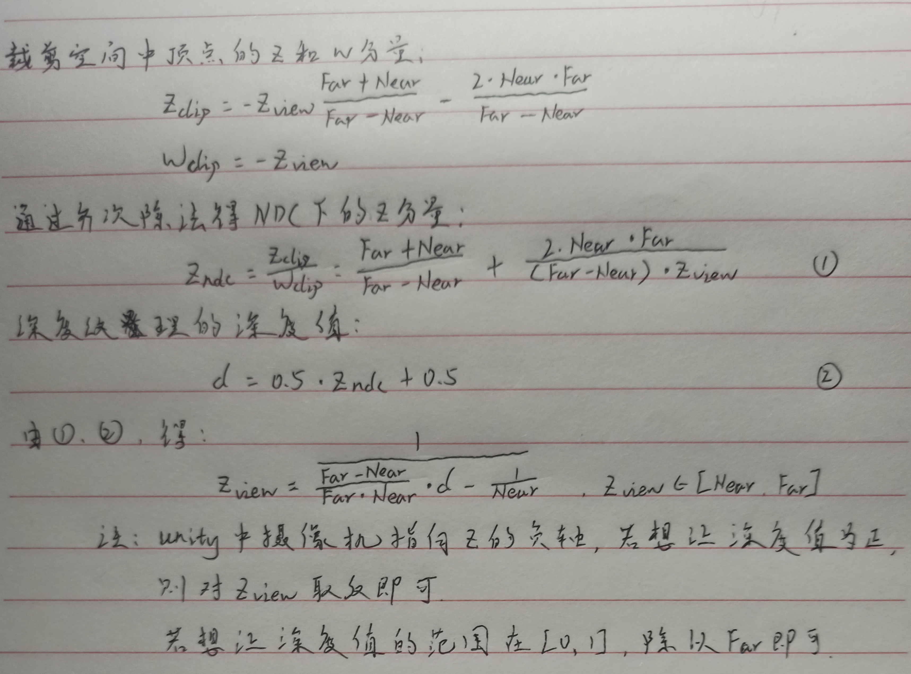

### 13.1 获取深度和法线纹理

#### 13.1.1 背后的原理

- 深度纹理实际上是一张渲染纹理，其中存储的像素值是一个高精度的深度值，由于被存储在一张纹理中，深度纹理的深度值范围在[0,1]之间，且通常是非线性分布的（经过了透视投影变换，正交投影是线性的）。
-  在Unity中，深度纹理可以直接来自于真正的深度缓存，也可以是一个由单独的Pass渲染而得，其取决于使用的渲染路径和硬件。通常当使用延迟渲染路径时，深度纹理理所当然可以访问到，因为其会把这些信息渲染到G-buffer中。当无法直接获取深度缓存时，深度和法线纹理是通过一个单独的Pass渲染得到的，Unity会使用着色器替换技术（Shader Replacement）选择那些渲染类型为Opaque的物体，判断使用的渲染队列是否小于2500（包含内置的Background、Geometry和AlphaTest），若满足条件则渲染到深度和发现纹理中，所以要想让物体能出现在深度和法线纹理中必须在Shader中设置正确的RenderType
- Unity中可以选择让一个摄像机生成一张深度纹理或是深度+法线纹理
  - 当需要一张单独的深度纹理时，Unity会直接获取深度缓存或通过着色器替换技术选取需要的不透明物体，并使用投射阴影是使用的Shadow Caster Pass得到深度纹理，若不包含该Pass，则该物体不会出现在深度纹理中。深度纹理的精度通常为24或16位，取决于使用的深度缓存的精度
  - 当需要深度+法线纹理时，Unity会创建一张和屏幕分辨率相同，精度为32位的纹理，其中观察空间下的法线信息会被编码进纹理的R和G通道，深度信息被编码进B和A通道。在延迟渲染中发现的信息获取很容易，但在前向渲染中，默认情况是不会创建法线缓存的，因此Unity底层使用了一个单独的Pass把整个场景再次渲染一遍来获取，该Pass被包含在内置的Unity Shader中（builtin_shaders-xxx/DefaultResources/Camera-DepthNormalTexture.shader）

#### 13.1.2 如何获取

```c#
// 设置摄像机的depthTextureMode生成深度纹理,之后可以在Shader中通过声明_CameraDepthTexture变量进行访问
camera.depthTextureMode = DepthTextureMode.Depth;
// 让摄像机生成深度+法线纹理，之后可以在Shader中通过声明_CameraDepthNormalsTexture变量进行访问
camera.depthTextureMode = DepthTextureMode.DepthNormals;
// 也可以组合两种模式，生成深度纹理和深度+法线纹理
camera.depthTextureMode |= DepthTextureMode.Depth;
camera.depthTextureMode |= DepthTextureMode.DepthNormals;
```

- 绝大多数情况下，可以直接使用tex2D函数对深度纹理采样，但在某些平台（如PS2、PS3）上需要进行特殊处理。Unity提供了一个统一的宏用来处理由于平台差异造成的纹理，可以直接使用宏对纹理进行采样。包含在HLSLSupport.cginc文件中，包括：

  - SAMPLE_DEPTH_TEXTURE(texture, flaot2 uv)，对深度纹理采样

  - SAMPLE_DEPTH_TEXTURE_PROJ(texture, float3/float4 uv)， 内部使用了tex2Dproj进行投影纹理采样，纹理坐标的前两个首先会除以第三个分量在进行纹理采样。若提供了第四个分量则还会进行一次比较，通常用于阴影的实现中。该宏的第二个参数通常为由顶点着色器输出插值的屏幕坐标
  - SAMPLE_DEPTH_TEXTURE_LOD



- Unity提供LinearEyeDepth负责把深度纹理的采样结果转换到视角空间下的深度值，Linear01Depth则返回一个范围在[0, 1]的线性深度值，这两个函数内部使用了内置的_ZBufferParams变量来得到远近裁剪平面的距离

- 若获取深度+法线纹理，可以直接使用tex2D函数对_CameraDepthNormalsTexture进行采样，然后使用Unity提供的复制函数DecodeDepthNormal对其进行解码得到深度值和法线方向。该函数在UnityCG.cginc中被定义

  ```c++
  // enc是对深度+法线纹理的采样结果，该结果是Unity对深度和法线信息编码后的结果。深度值是[0,1]的线性深度值（和单独的深度纹理不同）
  // 得到的法线是在视角空间下的
  inline void DecodeDepthNormal(float4 enc, out float depth, out float3 nromal){
      // 也可以直接调用这两个函数进行解码
  	depth = DecodeFloatRG(enc.zw);
  	normal = DecodeViewNormalSteret(enc);
  }
  ```

### 13.2 再谈运动模糊

- 速度缓冲的生成有多种方法：
  1. 把场景中所有物体的速度渲染到一张纹理中，该方法缺点缺点是需要修改场景中所有物体的Shader代码，使其添加计算速度的代码并输出到一个渲染纹理中
  2. 利用深度纹理在片元着色器为每个像素计算其在世界空间下的位置，这是通过使用当前的视角*投影矩阵的逆矩阵对NDC下的顶点坐标进行变换得到的。得到世界空间中的顶点坐标后，使用前一帧的视角\*投影矩阵对齐变换，得到该位置在前一帧的NDC坐标，然后计算前一帧和当前帧的位置差，生成该像素的速度。该方法优点是可以在一个屏幕后处理步骤中完成整个效果的模拟，缺点是在片元着色器中进行了两次矩阵乘法的操作，对性能有影响

```c#
using UnityEngine;

public class MotionBlurWithDepthTexture : PostEffectsBase
{
    public Shader motionBlurShader;
    private Material motionBlurMat = null;
    public Material material
    {
        get
        {
            motionBlurMat = CheckShaderAndCreateMaterial(motionBlurShader, motionBlurMat);
            return motionBlurMat;
        }
    }

    [Range(0.0f, 1.0f)]
    public float blurSize = 0.5f;

    private Matrix4x4 previousViewProjectionMatrix;

    private Camera mCamera;
    public Camera _Camera
    {
        get
        {
            if(mCamera == null)
            {
                mCamera = GetComponent<Camera>();
            }
            return mCamera;
        }
    }

    private void OnEnable()
    {
        _Camera.depthTextureMode |= DepthTextureMode.Depth;
    }

    private void OnRenderImage(RenderTexture source, RenderTexture destination)
    {
        if(material != null)
        {
            material.SetFloat("_BlurSize", blurSize);

            material.SetMatrix("_PreviousViewProjectionMatrix", previousViewProjectionMatrix);
            // 获得当前的视角*投影矩阵
            Matrix4x4 currentViewProjectionMatrix = _Camera.projectionMatrix * _Camera.worldToCameraMatrix;
            Matrix4x4 currentViewProjectionInverseMatrix = currentViewProjectionMatrix.inverse;
            material.SetMatrix("_CurrentViewProjectionInverseMatrix", currentViewProjectionInverseMatrix);
            previousViewProjectionMatrix = currentViewProjectionMatrix;
            Graphics.Blit(source, destination, material);
        }
        else
        {
            Graphics.Blit(source, destination);
        }
    }
}
```

```c++
Shader "Unity Shaders Book/Chapter 12/Motion Blur With Depth Texture"{
	Properties{
		_MainTex("Base (RGB)", 2D) = "white" {}
		_BlurSize("Blur Size", Float) = 1.0
	}

	SubShader{
	
		CGINCLUDE
			
			#include "UnityCG.cginc"

			sampler2D _MainTex;
			half4 _MainTex_TexelSize;
			sampler2D _CameraDepthTexture;
			float4x4 _CurrentViewProjectionInverseMatrix;
			float4x4 _PreviousViewProjectionMatrix;
			half _BlurSize;

			struct v2f{
				float4 pos : SV_POSITION;
				half2 uv : TEXCOORD0;
				half2 uv_depth : TEXCOORD1;
			};

			v2f vert(appdata_img v){
				v2f o;
				
				o.pos = UnityObjectToClipPos(v.vertex);
				o.uv = v.texcoord;
				o.uv_depth = v.texcoord;

				// DirectX等纹理y轴反向
				#if UNITY_UV_STARTS_AT_TOP
				if(_MainTex_TexelSize.y < 0)
					o.uv_depth.y = 1 - o.uv_depth.y;
				#endif

				return o;
			}

			fixed4 frag(v2f i) : SV_Target{

				// 采样深度值，范围[0, 1]
				float depth = SAMPLE_DEPTH_TEXTURE(_CameraDepthTexture, i.uv_depth);
				// 构建该像素坐标的NDC坐标，从原本[0, 1]范围变为[-1, 1]
				float4 NDCPos = float4(i.uv.x * 2 - 1, i.uv.y * 2 - 1, depth * 2 - 1, 1);
				// 乘以视角*投影逆矩阵再除以w分量变换到世界空间的坐标
				float4 temp = mul(_CurrentViewProjectionInverseMatrix, NDCPos);
				float4 worldPos = temp / temp.w;

				float4 currentPos = NDCPos;
				// 获取前一帧在NDC下的坐标
				float4 previousPos = mul(_PreviousViewProjectionMatrix, worldPos);
				previousPos /= previousPos.w;
				// 获取速度
				float2 velocity = (currentPos.xy - previousPos.xy) / 2.0f;
				// 使用速度对周围的像素采样
				float2 uv = i.uv;
				float4 color = tex2D(_MainTex, uv);
				uv += velocity * _BlurSize;
				for(int it = 1; it < 3; it++, uv += velocity * _BlurSize){
					float4 currentColor = tex2D(_MainTex, uv);
					color += currentColor;
				}
				color /= 3;
				
				return fixed4(color.rgb, 1.0);
			}

		ENDCG

		Pass{
			ZTest Always
			Cull Off 
			ZWrite Off 

			CGPROGRAM

			#pragma vertex vert 
			#pragma fragment frag 

			ENDCG
		}
	}
	FallBack Off
}
```

### 13.3 全局雾效

- Unity内置的雾效可以产生基于距离的线性或指数雾效。若想在自己的顶点/片元着色器中实现无效，需要在Shader中添加#pragma multi_compile_fog指令，同时使用相关的内置宏，如UNITY_FOG_COORDS、UNITY_TRANSFER_FOG、UNITY_APPLY_FOG等。此方法缺点是不仅需要为场景中所有物体添加相关的渲染代码，且能实现的效果也非常有限
- 基于屏幕后处理的全局雾效的关键是，根据深度纹理来重建每个像素在世界空间下的位置。首先对图像空间下的视椎体射线进行插值，该射线存储了像素在世界空间下到摄像机的方向信息，然后将射线与线性化后的视角空间下的深度值相乘，再加上摄像机的世界位置，就可以得到像素在世界空间下的位置。得到世界坐标后就可以轻松使用各个公式模拟全局雾效

#### 13.3.1 重建世界坐标（未完

- 通过摄像机在世界空间下的位置，以及世界空间下该像素相对于摄像机的偏移量，相加即可得到该像素的世界坐标

  ```c++
  float4 worldPos = _WorldSpaceCameraPos + linearDepth * interpolatedRay;
  ```

#### 13.3.2 雾的计算

- 在简单的雾效实现中，需要计算一个雾效系数f作为混合原始颜色和雾的颜色的混合系数：

  ```c++
  float3 afterFog = f * fogColor + (1-f) * orignalColor;
  ```

- 雾效系数有很多计算方法。Unity内置雾效实现中，支持线性、指数以及指数的平方：

  1. Linear
     $$
     f = \frac{d_{max} - |z|}{d_{max} - d_{min}}，d_{max}和d_{min}分别表示受雾影响的最大、最小距离
     $$

  2. Exponential
     $$
     f = e^{-d|z|}，d是雾浓度的参数
     $$

  3. Exponential Squared
     $$
     f = e^{-(d-|z|)^{2}}，d是控制雾浓度的参数
     $$

#### 13.3.3 实现

```c#
using UnityEngine;

public class FogWithDepthTexture : PostEffectsBase
{
    public Shader fogShader;
    private Material fogMat = null;
    public Material material
    {
        get
        {
            fogMat = CheckShaderAndCreateMaterial(fogShader, fogMat);
            return fogMat;
        }
    }

    private Camera mCamera;
    public Camera _Camera
    {
        get
        {
            if(mCamera == null)
            {
                mCamera = GetComponent<Camera>();
            }
            return mCamera;
        }
    }

    // 雾的浓度
    [Range(0.0f, 3.0f)]
    public float fogDensity = 1.0f;
    public Color fogColor = Color.white;
    // 雾的起始、终止高度
    public float fogStart = 0.0f;
    public float fogEnd = 2.0f;

    private void OnEnable()
    {
        _Camera.depthTextureMode |= DepthTextureMode.Depth;
    }

    private void OnRenderImage(RenderTexture source, RenderTexture destination)
    {
        if(material != null)
        {
            Matrix4x4 frustumCorners = Matrix4x4.identity;

            float fov = _Camera.fieldOfView;
            float near = _Camera.nearClipPlane;
            float far = _Camera.farClipPlane;
            float aspect = _Camera.aspect;

            // 计算摄像机指向近平面四个角的向量
            float halfHeight = near * Mathf.Tan(fov / 2 * Mathf.Deg2Rad);
            Vector3 toRight = _Camera.transform.right * halfHeight * aspect;
            Vector3 toUp = _Camera.transform.up * halfHeight;

            Vector3 topLeft = _Camera.transform.forward * near + toUp - toRight;
            float scale = topLeft.magnitude / near;

            topLeft.Normalize();
            topLeft *= scale;

            Vector3 topRight = _Camera.transform.forward * near + toUp + toRight;
            topRight.Normalize();
            topRight *= scale;

            Vector3 bottomLeft = _Camera.transform.forward * near - toUp - toRight;
            bottomLeft.Normalize();
            bottomLeft *= scale;

            Vector3 bottomRight = _Camera.transform.forward * near - toUp + toRight;
            bottomRight.Normalize();
            bottomRight *= scale;

            frustumCorners.SetRow(0, bottomLeft);
            frustumCorners.SetRow(1, bottomRight);
            frustumCorners.SetRow(2, topRight);
            frustumCorners.SetRow(3, topLeft);

            material.SetMatrix("_FrustumCornersRay", frustumCorners);
            material.SetMatrix("_ViewProjectionInverseMatrix", (_Camera.projectionMatrix * _Camera.worldToCameraMatrix).inverse);

            material.SetFloat("_FogDensity", fogDensity);
            material.SetColor("_FogColor", fogColor);
            material.SetFloat("_FogStart", fogStart);
            material.SetFloat("_FogEnd", fogEnd);

            Graphics.Blit(source, destination, material);
        }
        else
        {
            Graphics.Blit(source, destination);
        }
    }
}
```

```c++
Shader "Unity Shaders Book/Chapter 12/Fog With Depth Texture"{
	Properties{
		_MainTex("Base (RGB)", 2D) = "white" {}
		_FogDensity("Fog Density", Float) = 1.0
		_FogColor("Fog Color", Color) = (1, 1, 1, 1)
		_FogStart("Fog Start", Float) = 0.0
		_FogEnd("Fog End", Float) = 1.0
	}

	SubShader{
	
		CGINCLUDE

		#include "UnityCG.cginc"

		float4x4 _FrustumCornersRay;
		sampler2D _MainTex;;
		half4 _MainTex_TexelSize;
		sampler2D _CameraDepthTexture;
		half _FogDensity;
		fixed4 _FogColor;
		float _FogStart;
		float _FogEnd;

		struct v2f{
			float4 pos : SV_POSITION;
			half2 uv : TEXCOORD0;
			half2 uv_depth : TEXCOORD1;
			float4 interpolatedRay : TEXCOORD2;
		};

		v2f vert(appdata_img v){
			v2f o;

			o.pos = UnityObjectToClipPos(v.vertex);
			o.uv = v.texcoord;
			o.uv_depth = v.texcoord;

			#if UNITY_UV_STARTS_AT_TOP
			if(_MainTex_TexelSize.y < 0)
				o.uv_depth.y = 1 - o.uv_depth.y;
			#endif

			int index = 0;
			if(v.texcoord.x < 0.5 && v.texcoord.y < 0.5){
				index = 0;
			}else if(v.texcoord.x > 0.5 && v.texcoord.y < 0.5){
				index = 1;
			}else if(v.texcoord.x > 0.5 && v.texcoord.y > 0.5){
				index = 2;
			}else{
				index = 3;
			}

			#if UNITY_UV_STARTS_AT_TOP
			if(_MainTex_TexelSize.y < 0)
				index = 3 - index;
			#endif

			o.interpolatedRay = _FrustumCornersRay[index];

			return o;
		}

		fixed4 frag(v2f i) : SV_Target{
			float linearDepth = LinearEyeDepth(SAMPLE_DEPTH_TEXTURE(_CameraDepthTexture, i.uv_depth));
			float3 worldPos = _WorldSpaceCameraPos + linearDepth * i.interpolatedRay.xyz;
			
			float fogDensity = (_FogEnd - worldPos.y) / (_FogEnd - _FogStart);
			fogDensity = saturate(fogDensity * _FogDensity);

			fixed4 finalColor = tex2D(_MainTex, i.uv);
			finalColor.rgb = lerp(finalColor.rgb, _FogColor.rgb, fogDensity);

			return finalColor;
		}

		ENDCG

		Pass{
			ZTest Always
			Cull Off 
			ZWrite Off

			CGPROGRAM

			#pragma vertex vert 
			#pragma fragment frag 

			ENDCG
		}
	}
	FallBack Off
}
```

### 13.4 再谈边缘检测

- Roberts算子是计算左上角和右下角的差值，乘以右上角和左下角的差值，作为评估边缘的依据
- 下面描边效果是基于整个屏幕空间进行的，所有物体都会被添加描边效果。若相对特定物体进行描边，可以使用Unity提供的Craphics.DrawMesh或Graphics.DrawMeshNow函数对需要描边的物体进行描边

```c#
using UnityEngine;

public class EdgeDetectNormalsAndDepth : PostEffectsBase
{
    public Shader edgeDetectShader;
    private Material edgeDetectMat;
    public Material material
    {
        get
        {
            edgeDetectMat = CheckShaderAndCreateMaterial(edgeDetectShader, edgeDetectMat);
            return edgeDetectMat;
        }
    }

    [Range(0.0f, 1.0f)]
    public float edgesOnly = 0.0f;
    public Color edgeColor = Color.black;
    public Color backgroundColor = Color.white;
    // 采样距离，越大，描边越宽
    public float sampleDistance = 1.0f;
    // 进行法线和深度检测的灵敏度,当深度和法线差为多少时认为是边缘
    public float sensitivityDepth = 1.0f;
    public float sensitivityNormals = 1.0f;

    private void OnEnable()
    {
        GetComponent<Camera>().depthTextureMode |= DepthTextureMode.DepthNormals;
    }

    // 只对不透明物体有影响
    [ImageEffectOpaque]
    private void OnRenderImage(RenderTexture source, RenderTexture destination)
    {
        if(material != null)
        {
            material.SetFloat("_EdgeOnly", edgesOnly);
            material.SetColor("_EdgeColor", edgeColor);
            material.SetColor("_BackgroundColor", backgroundColor);
            material.SetFloat("_SampleDistance", sampleDistance);
            material.SetVector("_Sensitivity", new Vector4(sensitivityNormals, sensitivityDepth, 0.0f, 0.0f));

            Graphics.Blit(source, destination, material);
        }
        else
        {
            Graphics.Blit(source, destination);
        }
    }
}
```

```c++
Shader "Unity Shaders Book/Chapter 13/Fog With Depth Texture"{
	Properties{
		_MainTex("Base (RGB)", 2D) = "white" {}
		_FogDensity("Fog Density", Float) = 1.0
		_FogColor("Fog Color", Color) = (1, 1, 1, 1)
		_FogStart("Fog Start", Float) = 0.0
		_FogEnd("Fog End", Float) = 1.0
	}

	SubShader{
	
		CGINCLUDE

		#include "UnityCG.cginc"

		float4x4 _FrustumCornersRay;
		sampler2D _MainTex;;
		half4 _MainTex_TexelSize;
		sampler2D _CameraDepthTexture;
		half _FogDensity;
		fixed4 _FogColor;
		float _FogStart;
		float _FogEnd;

		struct v2f{
			float4 pos : SV_POSITION;
			half2 uv : TEXCOORD0;
			half2 uv_depth : TEXCOORD1;
			float4 interpolatedRay : TEXCOORD2;
		};

		v2f vert(appdata_img v){
			v2f o;

			o.pos = UnityObjectToClipPos(v.vertex);
			o.uv = v.texcoord;
			o.uv_depth = v.texcoord;

			#if UNITY_UV_STARTS_AT_TOP
			if(_MainTex_TexelSize.y < 0)
				o.uv_depth.y = 1 - o.uv_depth.y;
			#endif

			int index = 0;
			if(v.texcoord.x < 0.5 && v.texcoord.y < 0.5){
				index = 0;
			}else if(v.texcoord.x > 0.5 && v.texcoord.y < 0.5){
				index = 1;
			}else if(v.texcoord.x > 0.5 && v.texcoord.y > 0.5){
				index = 2;
			}else{
				index = 3;
			}

			#if UNITY_UV_STARTS_AT_TOP
			if(_MainTex_TexelSize.y < 0)
				index = 3 - index;
			#endif

			o.interpolatedRay = _FrustumCornersRay[index];

			return o;
		}

		fixed4 frag(v2f i) : SV_Target{
			float linearDepth = LinearEyeDepth(SAMPLE_DEPTH_TEXTURE(_CameraDepthTexture, i.uv_depth));
			float3 worldPos = _WorldSpaceCameraPos + linearDepth * i.interpolatedRay.xyz;
			
			float fogDensity = (_FogEnd - worldPos.y) / (_FogEnd - _FogStart);
			fogDensity = saturate(fogDensity * _FogDensity);

			fixed4 finalColor = tex2D(_MainTex, i.uv);
			finalColor.rgb = lerp(finalColor.rgb, _FogColor.rgb, fogDensity);

			return finalColor;
		}

		ENDCG

		Pass{
			ZTest Always
			Cull Off 
			ZWrite Off

			CGPROGRAM

			#pragma vertex vert 
			#pragma fragment frag 

			ENDCG
		
		}
	}
	FallBack Off
}
```

