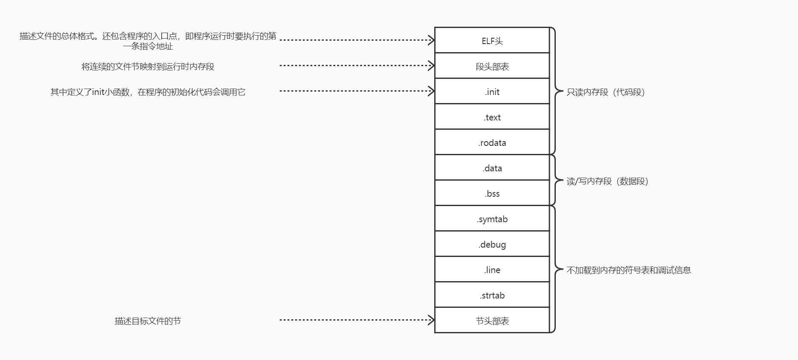

- 链接是将各种代码和数据片段收集并组合成一个单一文件的过程，该文件可被加载到内存并执行。其可以执行与编译时，即源代码被翻译成机器代码时；也可以执行于加载时，即程序被加载器加载到内存并执行时；甚至可以执行与运行时，即由应用程序来执行
- 链接器使得分离编译成为可能，不用将一个大型的应用程序组织为一个巨大的源文件，而是可以将其分解为更小的、更易管理的模块，可以独立的修改和编译。当改变这些模块中的一个时，只需简单的重新编译并重新链接应用，而不需要重新编译其他文件
- 学习关于链接器的原因：
  1. 将帮助构造大型程序。大型程序中经常会遇到由于缺少模块引用、库以及不兼容的库版本引起的链接器错误
  2. 将帮助避免一些危险的编程错误。如错误的在多个不同文件中定义同名的全局变量
  3. 帮助理解语言的作用域规则是如何实现的。如全局和局部变量之间的区别、static变量和函数的意义
  4. 帮助理解其他重要的系统概念。其产生的可执行目标文件在重要的系统功能中扮演关键角色
  5. 能够利用共享库。

### 7.1 编译器驱动程序

- 大多数编译系统提供编译器驱动程序，代表用户在需要时调用语言与处理器、编译器、汇编器和链接器

- 驱动程序将一个源文件翻译成可执行文件的过程：

  1. 运行C预处理器，将C的源程序.c翻译成一个ASCII码中间文件.i
  2. 运行C编译器，将.i文件翻译成一个ASCII汇编语言文件.s
  3. 运行汇编器，将.s翻译成可重定向目标文件.o
  4. 若引用了其他源文件将按以上过程将其编译成.o文件，最后运行链接器程序，将这些有关系的.o文件以及一些必要的系统目标文件组合起来，创建一个可执行文件

  通过加载器将可执行文件中的代码和数据复制到内存，然后将控制转移到该程序的开头

### 7.2 静态链接

- 静态链接器以一组可重定位目标文件和命令行作为输入，生成一个完全链接的、可以加载和运行的可执行目标文件作为输出，输入的可重定位目标文件由各种不同的代码和数据节组成，每一节都是一个连续的字节序列。指令在一节中，初始化了的去全局变量在另一节中，而未初始化的变量又在另一节中
- 为构造可执行文件，链接器必须完成两个主要任务：
  - 符号解析。目标文件定义和引用符号，每个符号对应一个函数、全局变量或静态变量，解析的目的是将每个符号引用正好和一个符号定义关联起来
  - 重定位。编译器和汇编器生成从地址0开始的代码和数据节，链接器通过把每个符号定义与一个内存位置关联起来，从而重定位这些节，然后修改所有对这些符号的引用，使得它们指向这个内存位置。链接器使用汇编器产生的重定位条目的详细指令不加甄别的执行这样的重定位
- 目标文件存粹是字节块的集合，其中有些包含程序代码，有些包含程序数据，而其他的则包含引导链接器和加载器的数据结构。链接器将这些块连接起来，确定被连接块运行时的位置，并且修改代码和数据块中的各种位置。链接器对目标机器了解甚少，产生目标文件的编译器和汇编器已经完成了大部分工作

### 7.3 目标文件

- 目标文件的三种形式：

  - 可重定位目标文件：包含二进制代码和数据，其形式可以在编译时与其他可重定位目标文件合并起来，创建一个可执行目标文件
  - 共享目标文件：一种特殊类型的可重定位目标，可以在加载或运行时被动态的加载进内存并链接
  - 可执行目标文件。包含二进制代码和数据，其形式可以被直接复制到内存并执行

  编译器和汇编器生成可重定位目标文件，链接器生成可执行目标文件

- 从技术上来说，一个目标模块就是一个字节序列，而一个目标文件就是一个以文件形式存放在磁盘中的目标模块

- 目标文件是按照特定的目标文件格式来组织的，各个系统的目标文件格式都不相同，但基本的概念是相似的

### 7.4 可重定位目标文件


### 7.5 符号和符号表

- 每个可重定位目标文件都有一个符号表，包含该模块定义和引用的符号的信息

- 在链接器上下文，有三种不同的符号：

  - 由本模块定义并能被其他模块引用的全局符号。全局链接器符号对应非静态的函数和全局变量
  - 由其他模块定义并被本模块引用的全局符号，称为外部符号，对应在其他模块中定义的非静态函数和全局变量
  - 只被本模块定义和引用的局部符号，对应带static属性的函数和全局变量，它们在本模块任何位置可见但不能被其他模块引用

- 定义带有static属性的本地过程变量是不在栈中管理的，编译器在.data和.bss中为每个定义分配空间，并在符号表中创建一个有唯一名字的本地链接器符号

- 符号表由汇编器构造，使用编译器输出到汇编语言文件中的符号。符号表中包含一个条目的数组，格式如下

  ```c++
  typedef struct{
  	int name;			// 字符串表中的字节偏移，指向符号的以null结尾的字符串名字
  	char type:4,		// 通常为数据或函数，但还可以包含各个节的条目，以及对应原始源文件的路径名的条目。
  		 bingding:4;	// 表示符号是本地的或全局的
  	char reserved;		// Unused
  	short section;		// 表示符号被分配到目标文件的某个节，其也是一个到节头部表的索引
  	long value;			// 符号地址。 对可重定位模块是距定义目标的节的起始位置的偏移，对可执行目标文件是绝对运行时地址
  	long size;			// 目标的大小（byte）
  }Elf64_Symbol;
  ```

  section中三个特殊的伪节，在节头部表中是没有条目的：

  1. ABS，代表不该被重定位的符号
  2. UNDEF，代表未定义的符号，即在本目标模块中引用，但却在其他地方定义的符号
  3. COMMON，达标还未被分配位置的未初始化的数据目标。value字段中给出对齐要求，size给出最小大小

  只有可重定位目标文件中才有伪节，可执行目标文件中没有

- COMMON和.bss的区别很小，现代的GCC版本根据一下规则将可重定位目标文件中的符号分配到COMMON和.bss中

  - COMMON：未初始化的全局变量
  - .bss：未初始化的静态变量，以及初始化为0的全局会静态变量

### 7.6 符号解析

- 链接器解析符号引用的方法是将每个引用与它输入的可重定位目标文件的符号表中的一个确定符号定义关联起来。编译器只允许每个模块中每个局部符号有一个定义，静态局部变量也会有本地链接器符号，编译器还要确保它们拥有唯一的名字
- 对于全局符号，当编译器遇到一个不是在当前模块中定义的符号时，会假设该符号是在其他某个模块中定义的（此时作为弱符号），生成一个链接器符号表条目并交给链接器处理。若链接器在它的任何输入模块中都找不到这个被引用的符号的定义，就输出一条错误信息并终止，若多个目标文件定义相同名字的全局符号，链接器必须要以某种方法选出一个定义并抛弃其他定义
- C++和java都允许重载方法，这些方法在源代码中有相同的名字却有不同的参数列表，编译器将每个唯一的方法和参数列表组合编码成一个对链接器来说唯一的名字，该过程叫重整，相反的过程叫做恢复

#### 7.6.1 链接器如何解析多重定义的全局符号

- 在Linux中，若多个模块定义同名的全局符号，编译时编译器向汇编器输出每个全局符号，或是强或是弱，汇编器会将这个信息隐含的编码在可重定位目标文件的符号表里，函数和已初始化的全局变量是强符号，未初始化的全局变量是弱符号
- Linux链接器使用如下规则处理多重定义的符号名：
  1. 不允许有多个同名的强符号
  2. 若有一个强符号和多个弱符号同名，则选择强符号
  3. 若有多个弱符号同名，则从这些弱符号中任选一个。注意，类似于一个32位int类型和64位的double同名，从中任选一个可能会造成严重运行时错误，但是链接器只会给出一个警告，当然可以使用命令行选项让其报告错误
- 当编译器在翻译某个模块时，遇到一个弱全局符号，其并不知道是否在其他地方有定义且若有多重定义也不知道使用哪一个，所以将其分配成COMMON将决定权交给链接器。若是一个强全局符号则编译器可以自信的将其分配成.bss，类似的，静态符号构造必须唯一，所以编译器可以自信的分配成.data或.bss

#### 7.6.2 与静态库链接

- 所有的编译系统都提供一种机制，将所有相关的目标模块打包称为一个单独的文件称为静态库，可以用作链接器的输入，当链接器构造一个输出的可执行文件时只复制静态库里被应用程序引用的目标模块

- 若不使用静态库可以使用的向用户提供函数的方法：

  1. 让编译器辨认出对标准函数的调用并直接生成相应代码（Pascal采用该方法）。

     缺点：

     - C定义了大量的标准函数，该方法将给编译器显著添加复杂性，且每次增加、删除或修改一个标准函数时就需要一个新的编译器版本，对于应用程序员而言该方法会非常方便，因为标准库函数将总是可用的

  2. 将所有标准C函数都放在一个单独的可重定位目标模块中，应用程序员可以直接将这个模块链接到可执行文件中

     优点：

     - 相较上一种方法，该方法将编译器的实现和标准库函数的实现分开，并且仍然对程序员保持适度的便利

     缺点：

     - 系统中的每个可集合文件都包含一份标准函数集合的完全副本，这对磁盘空间是很大的浪费。且每个运行的程序都将它自己这些函数的副本放在内存中，对内存也极度浪费
     - 对任何标准函数的任何改变，都要求开发人员重新编译整个源文件，这是一个非常耗时的操作，使标准函数的开发和维护变的很复杂

  3. 为每个标准函数创建一个独立的可重定位文件，将它们存放在一个大家知道的目录中解决一些问题

     缺点：

     - 要求程序员显示的链接合适的目标模块到可执行文件中，这是容易出错且耗时的过程

- 静态库概念被提出以解决不同方法的缺点：相关的函数可以被编译成一个独立的目标模块，然后封装成一个单独的静态库文件，应用程序可以通过在命令行指定单独的文件名字来使用这些在库中定义的函数，在链接时链接器只复制被程序引用的目标模块，这减少了可执行文件在磁盘和内存中的大小。另一方面程序员只需要包含较少的库文件的名字

- Linux系统中，静态库以一种称为存档的特殊文件格式存放在磁盘中，其是一组连接起来的可重定位目标文件的集合，有一个头部用来描述每个成员目标文件的大小和位置，存档文件名由由后缀.a标识

#### 7.6.3 链接器如何使用静态库来解析应用

- 在符号解析阶段，链接器从左到右按照在编译器驱动程序命令行上出现的顺序来扫描可重定向目标文件和存档文件。该扫描中，链接器维护一个可重定位目标文件的集合E（该集合中的文件会被合并起来形成可执行文件），一个未解析的符号集合U（引用了但是尚未定义），以及在其之前输入文件中已经定义的符号集合D。

  初始时三个集合都为空

  - 对于命令行每个输入文件都会判断是目标文件还是存档文件
    1. 若是目标文件则链接器将其添加到E中，修改U和D来反应该文件中的符号定义和引用，然后继续下一个输入文件
    2. 若是存档文件则链接器继续尝试匹配U中未解析的符号和由存档文件成员定义的符号。若某个存档成员定义了一个符号来解析U中的一个引用，就将该成员添加到E中，并且链接器修改U和D来反应该成员中的符号定义和引用，对存档文件中的所有成员目标文件都依次执行该过程，直到U和D不再变化，此时任何不包含在E中的成员目标文件都简单的被抛弃，而链接器处理下一个输入文件
  - 当链接器完成对命令行上输入文件的扫描后，若U是非空的，则链接器就会输出一个错误并终止，否则会合并并重定位E中的目标文件，构建输出的可执行文件

- 该算法会导致一些令人困扰的链接时错误，命令行上的库和目标文件的顺序非常重要，若定义一个符号的库出现在引用这个符号的目标文件之前，那么引用就不能被解析，链接会失败

  解决方法：将库放在命令行的结尾

  - 若库之间的成员是相互独立的，那么可以以任何顺序放置在命令行结尾
  - 若库不是相互独立的，则必须对它们进行排序，使得每个被依赖的库在前面出现。若需要满足依赖需求，可以在命令行重复库。或者将依赖的库合并成一个单独的库

### 7.7 重定位

- 一旦连接器完成了符号解析这一步，就将代码中的每个符号引用和正好和一个符号定义关联起来，此时链接器就知道它的输入目标模块中的代码节和数据节的确切大小，就可以开始重定位步骤
- 重定位：合并输入模块并为每个符号分配运行时地址，其由两步组成：
  1. 重定位节和符号定义：链接器将所有相同类型的节合并为同一类型的新聚合节，链接器将运行时内存地址赋给新的聚合节，赋给输入模块定义的每个节以及赋给输入模块定义的每个符号，当这一步完成时程序中的每条指令和全局变量都有唯一的运行时内存地址了
  2. 重定位节中的符号引用：链接器修改代码节和数据节中对每个符号的引用，使得它们指向正确的运行时地址。该步中链接器依赖于可重定位目标模块中称为重定位条目的数据结构

#### 7.7.1 重定位条目

- 当汇编器生成一个目标模块时，并不知道数据和代码最终将放在内存中的什么位置，也不知道这个模块引用的任何外部定义的函数或者全局变量的位置，所以无论何时遇到对最终位置未知的目标引用，就会生成一个重定位条目，告诉链接器在将目标文件合并成可执行文件时如何修改这个引用

- 代码的重定位条目放在.rel.text中，已初始化数据的重定位条目放在.rel.data中

- ELF重定位条目格式

  ```c++
  typedef struct{
  	long offset;		// 需要被修改的引用的节偏移
  	long type:32,		// 标识链接器如何修改引用
  		 symbol:32;		// 标识被修改引用应该指向的符号
  	long addend;		// 符号常数，一些类型的重定位要使用它对被修改的引用的值做偏移调整
  }Elf64_Rela;
  ```

  ELF定义了32种不同的重定位类型，有些相当隐秘，以下是两种最基本的重定义类型：

  1. R_X86_64_PC32：重定位一个使用32位PC相对地址的引用。一个PC相对地址就是距程序计数器的当前运行值的偏移量，当CPU执行一条使用PC相对寻址的指令时，就将在指令中编码的32位值加上PC的当前运行时值，得到有效地址
  2. R_X86_64_32：重定位一个使用32位绝对地址的引用。通过绝对寻址，CPU直接使用在指令中编码的32位值作为有效地址，不需要进一步修改

  这两种重定位类型支持x86-64小型代码模型，该模型假设可执行目标文件中的代码和数据总体大小小于2GB，因此在运行时可以用32位PC相对地址来访问。

- GCC默认使用小型代码模型，大于2GB的程序可以用-mcmodel=mdedium（中型代码模型）和-mcmodel=large（大型代码模型）标志来编译

#### 7.7.2 重定位符号引用

- 重定位算法伪码：

  ```c++
  // 遍历每个节s
  foreach section s{
      // 遍历每个节相关连的重定位条目，其为Elf64_Rela的结构体
      foreach relocation entry r{
          refptr = s + r.offset;		//引用指针被重定位
          
          // 相对地址
          if(r.type == R_X86_64_PC32){
              // ADDR(s)计算每个节的运行时地址
              refaddr = ADDR(s) + r.offset;
              // ADDR(r.symbol)计算每个符号的运行时地址
              *refptr = (unsigned)(ADDR(r.symbol) + r.addend - refaddr);
          }
          
          // 绝对地址
          if(r,type == R_X86_64_32){
              *refptr = (unsigned)(ADDR(r.symbol) + r.addend);
          }
      }
  }
  ```

### 7.8 可执行目标文件

- 典型的ELF可执行目标文件

  

  .text、.rodata、.data节与可重定向目标文件中的节是相似的，但是它们已经被定为到最终的运行时内存地址

  可执行文件是完全链接的，所以.rel节是不需要的

- ELF可执行文件被设计的很容易加载到内存，可执行文件的连续的片被映射到连续的内存段，程序头部表描述了这种映射关系，其会根据可执行目标文件的内容初始化两个内存段

- 对于任何段，链接器必须选择一个起始地址vaddr，使得vaddr mod align = off mod align。off为目标文件中段的第一个节的偏移量，align是程序头部中指定的对齐，该对齐要求是一种优化，使得当程序执行时，目标文件中的段能够有效率传送到内存中。原因在于虚拟内存的组织方式，其被组织成一个很大的、连续的、大小为2的幂的字节片

### 7.9 加载可执行目标文件

- 加载器将可执行目标文件中的代码和数据从磁盘复制到内存中，然后通过跳转到程序的第一个条指令或入口点来运行该程序，将程序复制到内存并运行的过程叫加载

- Linux x86-64运行时内存映像

  

  用户栈总是从最大的合法用户地址（2^48 - 1）开始，向较小的内存地址增长。栈上的区域为内核中的代码和数据保留的

  实际上，由于.data段有对齐要求，所以代码段和数据段之间是有间隙的，同时在分配栈、共享库和堆运行时地址的时候，链接器还会使用地址空间布局随机化（ASLR）。虽然每次程序运行时地址都会改变，但相对位置是不变的

- 当加载器运行时，在程序头部表的引导下，加载器将可执行文件的片复制到代码段和数据段，加载器跳转到程序的入口点，也就是\_start函数的地址，该函数是在系统目标文件ctrl.o中定义的，对所有的C程序都是一样的。\_start函数函数调用系统启动函数_ \_libc\_start\_main，该函数定义在libc.so中，其初始化执行环境，调用用户层的main函数，处理main函数的返回值并在需要的时候将控制返回内核

- 加载器工作的概述：Linux系统中的每个程序都运行在一个进程的上下文中，有自己的虚拟地址空间，当shell运行一个程序时，父shell进程生成一个子进程，其是一个父进程的复制，子进程通过execve系统调用启动加载器，加载器删除子进程现有的虚拟内存段并创建一组新的代码、数据、堆和栈段。新的栈和堆段被初始化为0，通过将虚拟地址空间中的页映射到可执行文件的页大小的片，新的代码和数据段被初始化为可执行文件的内容。最后加载器跳转到_start地址，最终调用应用程序的main函数。除了一些头部星系，在加载过程中没有任何从磁盘到内存的数据复制，知道CPU引用一个被映射的虚拟页时才会进行复制，此时操作系统利用它的页面调度机制自动将页面从磁盘传送到内存

### 7.10 动态链接共享库

- 静态链接库的缺点：

  - 和所有软件一样，需要定期维护和更新，若程序员想要使用一个库的最新版本，必须以某种方式了解该库的更新情况，然后显式的将程序与更新的库重新链接
  - 常用的函数的代码会被复制到每个运行进程的文本段中，在一个运行上百个进程的系统上，将是对稀缺内存系统资源的极大浪费

- 共享库是一个目标模块，在运行或加载时可以加载到任意内存地址并和一个在内存中的程序连接起来，该过程称为动态链接，由一个叫做动态链接器的程序来执行的

- 共享库也称共享目标，在Linux系统中通常用.so后缀表示，微软中使用.dll表示

- 共享库是以两种不同的方式来“共享”的。

  - 在任何给定的文件系统中，对于一个库只有一个共享文件，所以引用该库对额可执行目标文件共享这个文件汇总的代码和数据，而不是像静态链接库那样被复制和嵌入到 引用它们的可执行文件中
  - 在内存中，一个共享库的.text节的一个副本可以被不同的正在运行的进程共享

- 动态链接的基本思路是当创建可执行文件时，静态执行一些链接，然后在程序加载时动态完成链接过程，此时没有任何动态链接库中的代码和数据节真的被复制到可执行文件中，而是复制了一些重定位和符号表信息，使得运行时可以解析共享库中的代码和数据的引用

  当加载器加载和运行可执行文件时，加载部分链接的可执行文件，然后注意到其中包含一个.interp节，该节中包含动态链接器的路径名，然后加载器加载和运行该动态链接器，动态链接器通过重定位动态库中的文本和数据到某个内存段以及重定位可执行文件中所有由动态库中定义的符号的引用完成链接任务，最后动态链接器将控制传递给引用程序，此时共享库的位置就固定了且在程序执行的过程中都不会改变


### 7.11 从应用程序中加载和链接共享库

- 应用程序还可能在它运行时要求动态链接器加载和链接某个共享库，而无须在编译时链接到应用中
- 一些使用例子：
  - 分发软件：微软WIndows应用的开发者常常利用共享库来分享软件更新，其生成一个共享库的新版本，然后用户可以下载，并用其代替当前的版本。下一次运行应用程序时应用将自动链接和加载新的共享库
  - 构建高性能Web服务器。许多Web服务器生成动态内容，早期的Web服务器通过使用fork和execve创建一个子进程，并在该子进程上下文中运行CGI程序来生成动态内容。现代的Web服务器可以使用基于动态链接的更有效和完善的方法来生成动态内容，思路是将每个生成动态内容的函数打包在共享库中，当一个来自Web浏览器的请求到达时服务器动态的加载和链接适当的函数，然后直接调用它，函数会一直缓存在服务器的地址空间中，所以只要一个简单的函数调用开销就可以处理所有的请求，这对一个频繁的网站来说是有很大影响的，在运行时无须停止服务器就可以更新已存在的函数，以及添加新的函数

### 7.12 位置无关代码

- 多个进程共享程序的一个副本：

  - 给每个共享库分配一个事先与被的专用地址空间片，然后要求加载器总是在这个地址加载共享库

    缺点：

    1. 对地址空间的使用效率不高，即使没有进程使用该库，还是会分配这部分空间
    2. 难以管理，必须保证没有片会重叠，每次当一个库修改之后必须确认已分配给它的片适合它的大小，若不适合就必须找一个新的片，且若创建一个新的库就必须为它寻找空间
    3. 对每个系统而言，库在内存中的分配都是不同的，引起了更多令人头痛的管理问题

- 可以加载而无须重定位的代码称为位置无关代码（Position-Independent Code，PIC）

- 在一个x86-64系统中，对同一个目标模块中符号的引用是不需要特殊处理使之成为PIC，可以用PC相对寻址来编译这些引用，构造目标文件时由静态链接器重定位

- 无论在内存中的何处加载一个目标模块，数据段和代码段的距离总是保持不变，因此代码段中任何指令和数据段中的任何变量间的距离都是一个运行时差狗粮，与代码段和数据段的绝对内存位置无关

- 生成对全局变量PIC引用的编译器在数据段开始的地方创建了一个全局偏移量表（Global Offset Table，GOT），每个被该目标模块引用的全局数据过程或变量都有一个8字节条目，编译器还为GOT中每个条目生成一个重定位记录，在加载时动态链接器会重定位GOT中的每个条目使得它包含目标的正确的绝对地址，每个引用全局目标的目标模块都有自己的GOT

- 若程序调用一个由共享库定义的函数，正常的方法是为该引用生成一条重定位记录，然后动态链接器在程序加载的时候再解析它，不过该方法并不是PIC，因为它需要链接器修改调用模块的代码段，GUN编译系统使用了延迟绑定，即将过程地址的绑定延迟到第一次调用该过程时

- 延迟绑定能避免动态链接器在加载时进行成百上千个不需要的重定位，第一次调用过程的运行时开销很大，但其后的每次调用都只会花费一条指令和一个间接的内存引用

- 延迟绑定通过两个数据结构之间的交互实现的，包括GOT的过程链接表（Procedure Linkage Table，PLT），若一个目标模块调用定义在共享库中的任何函数，则它有自己的GOT和PLT，GOT是数据段的一部分，PLT是代码段的一部分：

  - PLT：一个数组，其中每个条目是16字节代码，PLT[0]是一个特殊条目，它跳转到动态链接器中，每个被可执行程序调用的库函数都有它自己的PLT条目，每个条目都负责都负责调用一个具体的函数。PLT[1]调用系统启动函数，初始化执行环境，调用main函数并处理返回值。从PLT[2]开始的条目调用用户代码调用你的函数
  - GOT：一个数组，其中每个条目是8字节地址。和PLT联合使用时GOT[0]和GOT[1]包含动态链接器在解析函数地址时会使用的信息，GOT[2]是动态链接器在模块汇总的入口点，其余的每个条目对应于一个被调用的函数，其地址需要在运行时被解析，每个条目都有一个相匹配的PLT条目

- GOT和PLT协同工作：当第一次调用一个函数时

  1. 不直接调用函数，程序调用进入PLT与该函数对应的条目
  2. PLT指令通过GOT中对应的条目进行间接跳转，因为每个GOT条目初始时都指向它对应的PLT条目的第二条指令，该间接跳转只是简单的将控制传送回PLT中对应的下一条指令
  3. 将函数的ID压入栈后，PTL中函数对应的条目跳转到PLT[0]
  4. PLT[0]通过GOT[1]间接的把动态链接器的一个参数压入栈中，然后通过GOT[2]间接跳转进动态链接器中，动态链接器使用两个栈条目来确定该函数的运行时地址，用该地址重写GOT中该函数对应的条目，然后将控制传给该函数

  之后调用该函数时：

  1. 先将控制传到PLT中与该函数对应的条目
  2. 通过GOT中该函数的条目间接跳转，会将控制直接转移到函数

### 7.13 库打桩机制

- 库打桩：允许截获对共享库函数的调用，取而代之执行自己的代码。使用该机制可以追踪对某个特殊库函数的调用次数，验证和追踪它的输入和输出值，甚至把它替换成一个完全不同的实现
- 基本思想：给定一个需要打桩的目标函数，创建一个包装函数，其原型与目标函数完全一样，然后使用某种特殊的打桩机制，欺骗系统调用包装函数而不是目标函数。包装函数通常执行它自己的逻辑，然后调用目标函数再将目标函数的返回值传递给调用者
- 打桩可以发生在编译时、链接时或当程序被加载和执行的运行时
