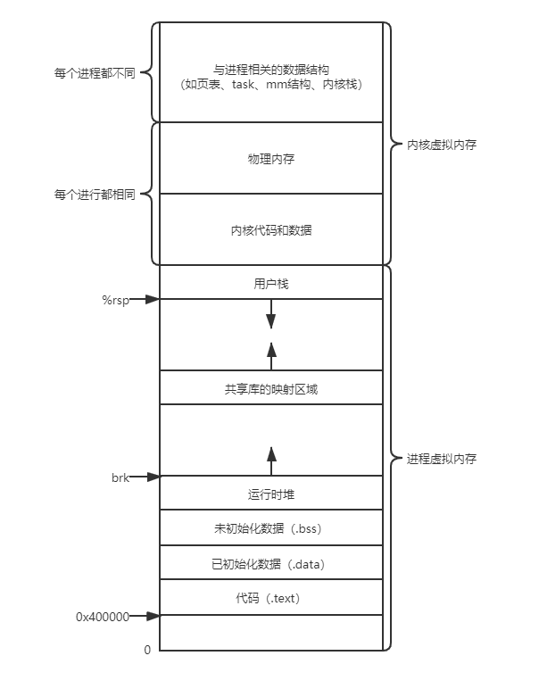

- 现代系统提供了一种对主存的抽象概念——虚拟内存（VM），它是硬件异常、硬件地址翻译、主存、磁盘文件和内核软件的完美交互，为么个进程提供了一个大的、一致的和私有的地址空间。虚拟内存提供了三个重要的能力：
  1. 将主存看成一个存储在磁盘上的地址空间的高速缓存，在主存中只保存活动区域，并根据需要在硬盘和主存之间来回传送数据，通过该方式高效的使用主存
  2. 它为每个进程提供了一致的地址空间，从而简化了内存管理。
  3. 它保护了每个进程的地址空间不被其他进程破坏。
- 虚拟内存成功的主要原因是因为它沉默的、自动的工作，不需要应用程序员的干涉。
- 理解虚拟内存的几个原因：
  - 虚拟内存是核心的。其遍及计算机系统的所有层面，在硬件异常、汇编器、链接器、加载器、共享对象、文本和进程的设计中扮演着重要角色。理解它可以帮助更好理解系统是如何工作的。
  - 虚拟内存是强大的。它给予应用程序强大的能力，可以创建和销毁内存片、将内存片映射到磁盘文件的某个部分，以及与其他进程共享内存。理解它可以帮助利用它的强大功能在应用程序中添加动力。
  - 虚拟内存是危险的。每次应用程序引用一个变量、间接引用一个指针，或者调用一个如 malloc 这样的动态分配程序时，就会和虚拟内存发生交互。若虚拟内存内存使用不当，应用将遇到复杂危险的与内存有关的错误。理解它以及如 malloc 之类的管理虚拟内存的分配程序，可以帮助避免这些错误。

### 9.1 物理和虚拟寻址

- 计算机系统的主存被组织成一个由 M 个连续的字节大小的单元组成的数组，每字节都有一个唯一的物理地址（Physical Address，PA）。第一个字节的地址为 0，接下来的为 1，再下为 2，以此类推。
- CPU 访问内存的最自然的方式就是使用物理地址，将该方式称为物理寻址（physical addressing）。早期的 PC 使用物理寻址，诸如数字信号处理器、嵌入式微控制器以及 Cray 超级计算机这样的系统仍然继续使用这种寻址方式。
- 现代处理器使用虚拟寻址（virtual addressing）的寻址形式，CPU 通过生成一个虚拟地址（Virtual Address，VA）来访问主存，该虚拟地址通过地址翻译（address translation）转换成适当的物理地址然后被送到内存。地址翻译需要 CPU 硬件和操作系统之内的紧密合作 CPU，CPU 芯片上有内存管理单元（Memory Management Unit，MMU）的专用硬件，利用存放在主存中的查询表来动态翻译虚拟地址，该表的内容由操作系统管理。

### 9.2 地址空间

- 地址空间（address space）是一个非负整数地址的有序集合：
  $$
  \{0,1,2,\cdots{}\}
  $$
  一个地址空间的大小是由其最大地址所需要的位数来描述的。

  若地址空间中的整数是连续的，则说是线性地址空间（linear address space）。

  在一个带虚拟内存的系统中，CPU 从一个有 N=2^n^ 个地址的地址空间中生成虚拟地址，该空间称为虚拟地址空间（virtual address space），现代系统通常支持 32 位或者 64 位虚拟地址空间。

  一个系统还有一个物理地址空间（physical address space）对应于系统中物理内存的 M 个字节，M 不要求是 2 的幂。

- 地址空间清楚地区分了数据对象（字节）和它们的属性（地址），可以将其推广到允许每个数据对象有多个独立的地址，其中每个地址都选自不同的地址空间。主存中的每字节都有一个选自虚拟地址空间的虚拟地址和一个选自物理地址空间的物理地址。

### 9.3 虚拟内存作为缓存工具

- 虚拟内存被组织为一个由存放在磁盘上的 N 个连续的字节大小的单元组成的数组，每字节都有一个唯一的虚拟地址作为到数组的索引。磁盘上数组的内容被缓存到主存中。
- 和存储器层次结构中其他缓存一样，磁盘（较低层）上的数据被分割成块，这些块作为磁盘和主存（较高层）之间的传输单元。VM 系统通过将虚拟内存分割成称为虚拟页（Virtual Page，VP）的大小固定的块来处理这个问题，每个虚拟页的大小为 P = 2^p^ 字节。物理内存被分割成物理页（Physical Page，PP）（也称为页帧（page frame）），大小也为 P 字节。
- 任意时刻，虚拟页面的集合都分为三个不相交的子集：
  - 未分配的：VM 系统还未分配或创建的页。未分配的块没有任何数据和它们相关联，因此也就不占用任何磁盘空间。
  - 缓存的：当前已缓存在物理内存中的已分配页。
  - 未缓存的：未缓存在物理内存中的已分配页。

#### 9.3.1 DRAM缓存的组织结构

- 使用术语 SRAM 缓存表示位于 CPU 和主存之间的 L1、L2、L3 高速缓存，用术语 DRAM 缓存表示虚拟内存系统的缓存，它在主存中缓存虚拟页。
- DRAM 比 SRAM 要慢约 10 倍，而磁盘要比 DRAM 慢约 100000 多倍，因此 DRAM 缓存中的不命中比起 SRAM 缓存中的不命中要昂贵得多，而且，从磁盘的一个扇区读取第一个字节的时间开销比起读这个扇区中连续的字节要慢大约 100000 倍。所以 DRAM 缓存的组织结构完全是由巨大的不命中开销驱动的。
  - 因为大的不命中处罚和访问第一个字节的开销，虚拟页往往很大，通常是 4KB~2MB。
  - 由于大的不命中触发，DRAM 缓存是全相联的，即任何虚拟页都可以放置在任何的物理页中。
  - 不命中时的替换策略也重要，替换错了虚拟页的处罚也非常高，所以与硬件对 SRAM 缓存相比，操作系统对 DRAM 缓存使用了更复杂紧密的替换算法。
  - 因为对磁盘的访问时间很长，DRAM 缓存总是使用写回而不是直写。

#### 9.3.2 页表

- 同任何缓存一样，虚拟内存系统必须有某种方法来判定一个虚拟页是否缓存在 DRAM 中的某个地方。若是，系统还必须确定这个虚拟页存放在哪个物理页中，若不命中，系统必须判断这个虚拟页存放在磁盘的哪个位置，在物理内存中选择一个牺牲页，并将虚拟页从磁盘复制到 DRAM 中替换该牺牲页。

  这些功能是软硬件联合提供的，包括操作系统软件、内存管理单元（MMU）中的地址翻译硬件、存放在物理内存中页表（page table）数据结构。每次地址翻译硬件将一个虚拟地址转换为物理地址时，都会读取页表，页表将虚拟页映射到物理页。操作系统负责维护页表的内容以及在磁盘与 DRAM 之间来回传送页。

- 页表就是一个页表条目（Page Table Entry，PTE）数组，虚拟地址空间中的每个页都在页表中一个固定偏移量处有一个 PTE（页表条目也可以被缓存）。

  假设每个 PTE 由一个有效位（valid bit）和一个 n 为地址字段组成。有效位表明该虚拟页是否被缓存在 DRAM 中，若设置了有效位，则地址字段就表示 DRAM 中相应的物理页的其实位置，该物理页缓存了该虚拟页。若没有，则一个空地址表示该虚拟页还未被分配，否则该地址就指向该虚拟页在磁盘上的起始位置。

#### 9.3.4 缺页

- DRAM 缓存不命中称为缺页（page fault）。

- 当想要使用某个虚拟页东西时，地址翻译硬件从内存中读取页表对应的表目，然后从有效位推断出该虚拟页未被缓存，就会触发一个缺页异常，缺页异常调用内核中的缺页异常处理程序。

  该程序会选择一个牺牲页，内核会修改该牺牲虚拟页的页表条目，反映出该虚拟页不在主存的事实，若该牺牲页已经被修改则内核还会将其复制回磁盘。接下来内核从磁盘复制虚拟页到内存中的对应物理页，然后更新页表条目，随后异常处理程序返回，其会重新启动导致缺页的指令，该指令会把导致缺页的虚拟地址重发送到地址翻译硬件。

- 在虚拟内存的说法中，块被称为页。

  在磁盘和内存之间传送页的活动成为交换（swapping）或页面调度（paging）。

  页从磁盘换入（或叫页面调入） DRAM 和从 DRAM 换出（或叫页面调出）磁盘。当有不命中发生时才换入页面的这种策略称为按需页面调度（demand paging）。也可以采用其他方法，但所有现代系统都是用按需页面调度的方式。

#### 9.3.5 分配页面

- 当操作系统分配一个新的页面时，会在磁盘上创建空间，并更新页表上的条目，使一个条目指向磁盘上新创建的页面。

#### 9.3.6 又是局部性救了我们

- 尽管在真个运行过程中程序引用的不同页面的总是可能超出物理内存总的大小，但局部性保证了在任意时刻，程序将趋向于在一个较小的活动页面（active page）集合上工作，该集合叫工作集（working set）或常驻集合（resident set）。在初始开销，即将工作集页面调度到内存中之后，接下来对该工作集的引用将导致命中，而不会产生额外的磁盘流量。只要程序有良好的时间局部性，虚拟内存系统就能工作的很好。但并非所有程序都满足局部性，若工作集的大小超出了物理内存的大小，那么程序将会产生抖动（thrashing），页面将不断的换进换出。若程序的性能很慢则需要考虑是否发生了抖动。

### 9.4 虚拟内存作为内存管理工具

- 一些早期的系统，支持的是一个比物理内存更小的虚拟地址空间，然而虚拟地址仍然是一个有用的机制，因为其大大简化了内存管理，并提供了一种的保护内存的方法。
- 操作系统为每个进程提供了一个独立的页表，也就是一个独立的虚拟地址空间。
- 多个虚拟页面可以映射到同一个共享页面上。
- 按需页面调度和独立的虚拟地址空间的结合，对系统中内存的使用和管理造成了深远的影响，特别是，VM 简化了链接和加载、代码和数据共享、应用程序的内存分配：
  - 简化链接。独立的地址空间允许每个进程的内存印象使用相同的基本格式，而不管代码和数据实际存放在物理内存的何处。对于 64 位地址空间，代码段总是从虚拟地址 0x400000 开始，数据段跟在代码段之后，中间有一段符合要求的对齐空白。栈占据用户进程地址空间最高部分，并向下生长。这样的一致性极大简化了链接器的设计和实现，允许链接器生成完全链接的可执行文件，这些执行文件是独立于物理内存中代码和数据的最终位置的。
  - 简化加载。虚拟内存让向内存中加载可执行文件和共享目标文件更简单。要把目标文件中 .text 和 .data 节加载到一个新创建的进程中，Linux 加载器为代码和数据段分配虚拟页，然后将其它们标记为无效的（未被缓存的），将页表条目指向目标文件中适当位置。加载器不从磁盘到内存实际复制任何数据，在每个页初次被引用时（CPU取指令或一条正在执行的指令引用一个内存位置），虚拟内存系统会按照需要自动的调入数据页。将一组连续的虚拟页映射到任意一个文件中的任意位置的表示法称作内存映射（memory mapping）。Linux 提供 mmap 的系统调用允许应用程序自己做内存映射。
  - 简化共享。独立地址空间为操作系统提供了一个管理用户进程和操作系统自身之间共享的一致机制。一般而言每个进程都有自己私有的代码、数据、堆以及栈区域，对这种不共享的，操作系统创建页表将相应的虚拟页映射到不连续的物理页面。在一些需要进程共享代码和数据的情况，操作系统通过将不同进程中适当的虚拟页面映射到相同的物理页面，从而安排多个进程共享这部分代码的一个副本，而不是在每个进程中都包括单独的内核和 C 标准库副本。
  - 简化内存分配。虚拟内存向用户进程提供了一个简单的分配额外内存的机制。当一个运行在用户进程中的程序要求额外的堆空间时，操作系统分配一个适当数量的连续虚拟内存页面，并将它们映射到物理内存中任意位置的 k 个任意物理页面。由于页表工作的方式，操作系统没必要分配 k 个连续的物理内存页面，页面可以随机分散在物理内存中。

### 9.5 虚拟内存作为内存保护的工具

- 任何现代计算机系统必须为操作系统提供手段来控制对内存系统的访问
  - 不应该允许一个用户进程修改它的只读代码段
  - 不应该允许读或修改任何内核中的代码和数据结构
  - 不应该允许它读或写其他进程的稀有内存
  - 不应该允许它修改任何与其他进程共享的虚拟页面，除非所有的共享者都显式的允许它这么做（通过调用民权的进程间通信系统调用）
- 每次 CPU 生成一个地址时，地址翻译硬件都会读取一个 PTE ，通过在 PTE 上添加一些额外的许可证来控制对一个虚拟页面内容的访问十分简单。如添加三个许可位，SUP 表示进程是否必须在内核模式下才能访问该页，READ 和 WRITE 位控制对页面的读和写访问。若一条指令违反了这些许可条件，那么 CPU 就触发一个一般保护故障，将控制传递给一个内核中的异常处理程序，Linux shell 一般将该异常报告为 “段错误（segmentation fault）”。

### 9.6 地址翻译

- 地址翻译是一个 N 元素的虚拟地址空间（VAS）中的元素和一个 M 元素的物理地址空间（PAS）中元素的映
  $$
  MAP:VAS \rightarrow{} PAS \cup{} \emptyset{}
  $$

  $$
  MAP(A) = 
  \left\{
  \begin{array}{l}
  A' \qquad{} 若虚拟地址A处的数据在PAS的物理地址A'处\\
  \emptyset{} \;\; \qquad{} 若虚拟地址A处的数据不在物理内存中
  \end{array}
  \right.
  $$

- CPU 中的一个控制寄存器——页表基址寄存器（Page Table Base Register，PTBR）指向当前页表。n 位的虚拟地址包含两个部分：一个 p 位的虚拟页面偏移（Virtual Page Offset，VPO）和一个 (n-p) 位的虚拟页号（Virtual Page Number，VPN）。

  MMU 利用 VPN 来选择适当的 PTE，然后将页表条目中的物理页号（Physical Page Number，PPN）和虚拟地址中的 VPO 串联起来，因为物理地址和虚拟页面都是 P 字节，所以物理页面偏移（Physical Page Offset，PPO）和 VPO 是VPO 是相同的，就得到相应的物理地址。

  页面命中时 CPU 硬件执行的步骤：

  - 第 1：处理器生成一个虚拟地址，并传给 MMU。
  - 第 2：MMU 生成 PTE 地址，并从高速缓存/主存请求得到它。
  - 第 3：高速缓存/主存向 MMU 返回 PTE。
  - 第 4：MMU 构造物理地址，并把它传给高速缓存/主存。
  - 第 5：高速缓存/主存返回所请求的数据字给处理器。

  页面未命中时 CPU 硬件和操作系统内核执行的步骤：

  - 第 1~3：同上
  - 第 4：PTE 中的有效位是 0，MMU 触发一次异常，传递 CPU 中的控制到操作系统内核中的缺页异常处理程序。
  - 第 5：缺页处理程序确定出物理内存中的牺牲页，若该页面已经被修改了，则将其换出到磁盘。
  - 第 6：缺页处理程序页面调入新的页面，并更新内存中的 PTE。
  - 第 7：缺页处理程序返回到原来的进程，再次执行导致缺页的指令。CPU 将引起缺页的虚拟地址重新发给 MMU。

#### 9.6.1 结合高速缓存和虚拟内存

- 在任何既使用虚拟内存又使用 SRAM 高速缓存的系统中，都需要确定使用虚拟地址还是物理地址来访问 SRAM 高速缓存的问题。大多数系统选择物理寻址，因为多个进程同时在高速缓存中有存储块和共享来自相同虚拟页面的块称为很简单的事情，且高速缓存无需处理保护问题，因为访问权限的检查是地址翻译的一部分。
- 使用物理寻址的高速缓存和虚拟内存结合起来，其主要思路是地址翻译发生在高速缓存查找之前。

#### 9.6.2 利用 TLB 加速地址翻译

- 每次 CPU 产生一个虚拟地址，MMU 就必须查阅一个 PTE 以便虚拟地址翻译为物理地址，在糟糕的情况下，会要求从内存多取一次数据，代价是几十到几百个周期，若 PTE 恰好在 L1 中，开销就降到 1 到 2 个周期。
- 许多系统试图消除这样的开销，在 MMU 中包括了一个关于 PTE 的小的缓存，称为翻译后备缓冲器（Translation Lookaside Buffer，TLB），其中每一行都保存着一个由单个 PTE 组成的块。TLB 通常有高度相联度，用于组选择和行匹配的索引和标记字段是从虚拟地址中的虚拟页号 VPN 中提取出来的。若 TLB 有 T=2^t^ 个组，那么 TLB 索引（TLBI）是由 VPN 的 t 个最低位组成的，而 TLB 标记（TLBT）是由 VPN 中剩余的位组成的。
- 当有 TLB 后，MMU 会在这里面找对应的 PTE，若 TLB 不命中，则 MMU 必须从 L1 缓存中取出相应的 PTE，然后存放到 TLB 中，此时可能覆盖掉一个已经存在的条目。

#### 9.6.3 多级页表

- 若有一个 32 位地址空间、4KB 的页面和 4 字节的 PTE，那么即使应用所使用的知识虚拟地址空间中很小的部分，也总是需要 4MB 的页表常驻内存。

- 用来压缩页表的常用方法是使用层次结构的页表。对于32 位虚拟地址空间中一个两级页表，4KB 的页和 4 字节的PTE，一级页表中的每个 PTE 负责映射虚拟空间一个 4MB 的片（chunk），每个片都由 1024 个连续的页构成。若片 i 的每个页面都未被分配，那么一级 PTEi 为空，否则指向一个二级页表基址。二级页表中的每个 PTE 都负责映射一个 4KB 的虚拟内存页面。

  该方法从两方面减少了内存要求：

  1. 若一级页表中的一个 PTE 是空的，则相应的二级页表就不存在
  2. 只有一级页表才需要总是在内存中，虚拟内存系统可以在需要时创建、页面调入或调出二级页表，这减少了主存的压力。

- k 级页表层次结构的地址翻译：虚拟地址被划分为 k 个 VPN 和 1 个 VPO，VPNi（i∈[1,k]）是到第 i 级页表的索引。第 j（ji∈[1,k-1]）级页表中的每个 PTE 都指向 j+1 级的某个页表基址，第 k 级页表中每个 PTE 包含某个物理页面 PPN 或一个磁盘块的地址。

  为了构造物理地址，在能确定 PPN 之前 MMU 必须访问 k 个 PTE。和只有一级的页表结构一样，PPO 和 VPO 是相同的。虽然访问 k 个看上去昂贵，但这里 TLB 能起作用，可以缓存不同层次上页表的 PTE，所以不比单级页表慢很多。

### 9.7 案例研究：Intel Core i7/Linux 内存系统

- 虽然Intel Core i7 底层的 Haswell 微体系结构允许完全的 64 位虚拟和物理地址空间，而现在以及可预见的未来的 Core i7 实现的 48 位（256TB）虚拟地址空间和 52 位（4PB）物理地址空间，还有一个兼容模式支持 32 位（4GB）虚拟和物理地址空间。

- Core i7 的处理器封装（processor package）包括四个核、一个大的所有核共享的 L3 高速缓存、一个DDR3 内存控制器。

  其中每个核包含了一个层次结构的 TLB、一个层次结构的数据和指令高速缓存，以及一组快速的点到点链路，该链路基于 QuickPath 技术，可以让一个核与其他核以及外部 I/O 桥直接通信。

  TLB 是虚拟寻址的，4 路组相联。

  L1、L2、L3 高速缓存是物理寻址的，块大小为 64 字节，L1 和 L2 是 8 路组相联的，而 L3 是 16 路组相联的。

  页大小可以在启动时被配置为 4KB 或 4MB，Linux 使用的是 4KB。


<center><b>图9.21 Core i7 的内存系统</b></center>

#### 9.7.1 Core i7 地址翻译

- Core i7 采用四级页表层次结构，每个进程有它自己私有的页表层次结构。当一个 Linux 进程运行时，虽然 Core i7 体系结构允许页表换进换出，但与已分配了页，其相关联的页表都是驻留在内存中的。

  CR3 控制寄存器指向第一级页表（L1）的起始位置，该控制器的值是进程上下文的一部分，所以每次上下文切换时 CR3 的值都会变化。

- 第一到三级 PTE 格式：

  |  63  | 62~52  |     51~12      |  11~9  |  8   |  7   |  6   |  5   |  4   |  3   |  2   |  1   |  0   |
  | :--: | :----: | :------------: | :----: | :--: | :--: | :--: | :--: | :--: | :--: | :--: | :--: | :--: |
  |  XD  | 未使用 | 页表物理基地址 | 未使用 |  G   |  PS  |      |  A   |  CD  |  WT  | U/S  | R/W  |  P   |

  | 字段      | 描述                                        |
  | --------- | ------------------------------------------- |
  | P         | 子页表在物理内存中（1），不在（0）          |
  | R/W       | 对于所有可访问页，只读或读写访问权限        |
  | U/S       | 对于所有可访问页，用户或内核模式访问权限    |
  | WT        | 子页表的直写或写回缓存策略                  |
  | CD        | 能否缓存子页表                              |
  | A         | 引用位（由 MMU 在读和写时设置，由软件清除） |
  | PS        | 页大小为 4KB 或 4MB（只对第一层 PTE 定义）  |
  | Base addr | 子页物理基地址的最高 40 位                  |
  | XD        | 能否从该 PTE 可访问的所有页中取指令         |

  第四级 PTE 格式：

  |  63  | 62~52  |     51~12      |  11~9  |  8   |  7   |  6   |  5   |  4   |  3   |  2   |  1   |  0   |
  | :--: | :----: | :------------: | :----: | :--: | :--: | :--: | :--: | :--: | :--: | :--: | :--: | :--: |
  |  XD  | 未使用 | 页表物理基地址 | 未使用 |  G   |  0   |  D   |  A   |  CD  |  WT  | U/S  | R/W  |  P   |

  | 字段      | 描述                                        |
  | --------- | ------------------------------------------- |
  | P         | 子页表在物理内存中（1），不在（0）          |
  | R/W       | 对于子页，只读或读写访问权限                |
  | U/S       | 对于子页，用户或内核模式访问权限            |
  | WT        | 子页的直写或写回缓存策略                    |
  | CD        | 能否缓存                                    |
  | A         | 引用位（由 MMU 在读和写时设置，由软件清除） |
  | D         | 修改位（由 MMU 在读和写时设置，由软件清除） |
  | G         | 全局页（在任务切换时不从 TLB 中驱逐出去）   |
  | Base addr | 子页物理基地址的最高 40 位                  |
  | XD        | 能否从该子页中取指令                        |

  XD 位在 64 位系统中引入的，其可以通过限制只能执行只读代码段，使操作系统内核减低缓冲区溢出攻击的风险。

  当 MMU 翻译每一个虚拟地址时，还会更新另外两个内核缺页处理程序会用到的位。每次访问一个页时，MMU 都会设置 A 位（引用位），内核可以用它实现页替换算法。每次对一个页进行写了之后，MMU 都会设置 D 位（修改位或脏位），告诉内核在赋值替换页之前是否必须写回牺牲页。内核可以通过一条特殊的内核模式指令来清除这两个位。

- 虚拟地址的格式：

  |   9   |   9   |   9   |   9   |  12  |
  | :---: | :---: | :---: | :---: | :--: |
  | VPN 1 | VPN 2 | VPN 3 | VPN 4 | VPO  |

  36 位 VPN 被划分为 4 个 9 位的片，每个片被用于到一个页表的偏移量，CR3 寄存器包含 L1 页表的基地址，然后 VPN 1 包含到 L1 PTE 的偏移量，L1 PTE 又包含到 L2 页表的基地址，VPN 2 包含到 L2 PTE 的偏移量，以此类推。

- 实际硬件实现使用的地址翻译，使用了一个灵活的技巧。Core i7系统上有 12 位的 VPO，且和物理地址中 PPO 的 12 位相同。因为八路组相联的、物理寻址的 L1 缓存有 64 个组 和 大小为 64KB 的缓存块，所以每个物理地址有 6 个（log~2~64）缓存偏移位和 6 个（log~2~64）索引位，这 12 位恰好符合虚拟地址的 VPO 部分：

  - 当 CPU 需要翻译一个虚拟地址时，就发送 VPN 到 MMU，发送 VPO 到高速 L1 缓存
  - 当 MMU 向 TLB 请求一个 PTE 时， L1 高速缓存利用 VPO 位查找相应的组，并读出该组里的 8 个标记和相应的数据字
  - 当 MMU 从 TLB 得到 PPN 时，缓存已经准备好尝试把该 PPN 和 8 个标记中的一个进行匹配了

#### 9.7.2 Linux 虚拟内存系统

- 内核虚拟内存包含内核中的代码和数据结构，其某些区域被映射到所有进程共享的物理页面，其他区域包含每个进程都不相同的数据（如页表、栈、记录虚拟地址空间当前组织的各种数据结构）。Linux也将一组连续的虚拟页面（大小等于系统中 DRAM 的总量）映射到相应的一组连续的物理页面，这为内核提供了一种便利的方法来访问物理内存中任何特定的位置。



<center><b>一个 Linux 进程的虚拟内存</b></center>

**Linux 虚拟内存区域**

- Linux 将虚拟内存组织成一些区域（也叫做段）的集合。一个区域就是已经存在着的（已分配的）虚拟内存的连续片（chunk），这些页是以某种方式相关联的。每个存在的虚拟页面都保存在某个区域中，而不属于某个区域的虚拟页是不存在的，并且不能被进程引用。

  区域的概念很重要，它允许虚拟地址空间有间隙，内核不用记录那些不存在的虚拟页，而这样的页也不占用内存、磁盘或内核本身中的任何额外资源

- 内核为系统中每个进程维护一个单独的任务结构（task_struct），其中的元素包含或指向内核运行该进程所需要的所有信息。

  有一个条目指向 mm_struct，它描述了虚拟内存当前的状态，里面有两个字段 pgd 和 mmp，pgd 指向第一级页表的基址，mmap 指向一个 vm_area_structs（区域结构）的链表，其中每个 vm_area_structs 都描述了当前虚拟地址空间的一个区域，当内核运行这个进程时，就将 pgd 存放在 CR3 控制寄存器中。

**Linux 缺页异常处理**

- 缺页处理程序执行步骤：

  1. 该虚拟地址是合法的吗（在某个区域结构定义的区域内）？缺页处理程序搜索区域结构的链表，把地址和每个区域结构中的 vm_start（指向该区域的起始位置）和 vm_end（指向该区域的结束位置）作比较，若该指令不合法，处理程序就触发一个段错误从而终止该进程。

     因为一个进程可以创建任意数量的新虚拟内存区域，所以顺序搜索链表花销可能会很大，在实际中通常使用某种字段在链表中构建一颗树，并在树上查找。

  2. 试图进行的内存访问是否合法（进程是否有读、写或执行该区域内页面的权限）？若该访问不合法，处理程序就会触发一个保护异常从而终止该进程

  3. 若通过前两个检查，该缺页就是合法操作造成的，就会选择一个牺牲页面，若被修改就会交换出去，换入新的页面并更新页表，然后指向之前引发缺页的指令

### 9.8 内存映射

- 内存映射（memory mapping）：将一个虚拟内存区域与一个磁盘上的对象关联起来，以初始化这个虚拟内存区域的内容。

  虚拟内存区域可以映射到两种类型对象中的一种：

  - Linux 文件系统中的普通文件：一个区域可以映射到一个普通磁盘文件的连续部分（如可执行目标文件）。文件区（section）被分成页大小的片，没一片包含一个虚拟页面的初始内容，因为按需页面调度，这些虚拟页面没有实际交换进入物理内存，直到第一次引用到页面。若区域比文件区大则用零来填充这个区域的余下部分。
  - 匿名文件：由内核创建的，其中包含的全是二进制零。CPU 第一次引用这样一个区域内的虚拟页面时，内核就在物理内存找到一个合适的牺牲页面，若页面被修改过就换出来，用二进制零覆盖牺牲页面并更新页表，将该页面标记为驻留在内存中的。磁盘和内存之间并没有实际的数据传送，所以映射到匿名文件的区域中的页面有时也叫请求二进制零的页（demand-zero page）。

- 一旦一个虚拟页面被初始化了，就在一个由内核维护的专门的交换文件（swap file）（也叫交换空间（swap space）或交换区域（swap area））之间换来换去。在任何时刻，交换空间都限制当前运行的进程能够分配的虚拟页数总数。

#### 9.8.1 再看共享对象

- 内存映射的概念来源于，若虚拟内存系统可以集成到传统的文件系统中，那么就能提供一种简单而高效的把程序和数据加载到内存中的方法

- 一个对象可以被映射到虚拟内存的一个区域，可以作为共享对象或稀有对象：

  - 若进程将一个共享对象映射到虚拟地址空间的一个区域（共享区域）内，则该进程对这个区域的任何写操作，对于那些把这个共享对象映射到它们虚拟内存的其他进程而言也是可见的，且该变化也会反映到硬盘的原始对象中。
  - 若对于一个映射到私有对象的区域（私有区域）做的改变，对于其他进程来说是不可见的，且进程对于这个区域所做的任何写操作都不会反映在磁盘上的对象中。

- 若一个进程将一个共享对象映射到它的虚拟内存的一个区域中，因为每个对象都有唯一的文件名，当后面的进程要映射该共享对象时，内核可以迅速判定有进程已经映射了这个对象，且可以使后来的进程的页表条目指向相应的物理页面。这样即使对象被映射到多个共享区域，物理内存中也只需要存放共享对象的一个副本。

- 私有对象使用写时复制（copy-on-write）技巧被映射到虚拟内存中，其开始生命周期的方式和共享对象基本一样，在物理内存只保存私有对象的一个副本。对于每个映射私有对象的进程，相应私有区域的页表条目都被标记为只读，且区域结构标记为私有的写时复制

  当有一个进程试图写私有区域内的某个页面，那么该写操作就会触发一个保护故障，然后故障处理程序发现进程试图写私有的写时复制区域中的一个页面，就会在物理内存中创建该页面的一个副本，更新页表条目指向这个新的副本，然后恢复该页面的可写权限。故障处理程序返回时，CPU 重新执行写操作。

#### 9.8.2 再看 fork 函数

- 当 fork 函数被当前进程调用时，内核为新进程创建各种数据结构，并分配一个唯一的 PID。为了给新进程创建虚拟内存，它创建了当前进程的 mm_struct、区域结构和页表的原样副本，将两个进程中的每个页面都标记为只读，并将每个区域结构都标记为私有的写时复制。

#### 9.8.3 再看 execve 函数

- 在一个进程中调用 execve 函数会在当前进程中加载并运行指定的可执行目标文件中的程序，并用指定程序有效替换当前程序。该过程需要几个步骤：
  - 删除已存在的用户区域。删除当前进程虚拟地址的用户部分中的已存在的区域结构。
  - 映射私有区域。为新程序的代码、数据、bss、栈区域创建新的区域结构，所有这些都是私有的、写时复制的。代码和数据区域被映射到 .text 和 .data。 .bss 区域是请求二进制零的，映射到匿名文件，其大小包含在可执行目标文件中。栈和堆区域也是请求二进制零的，初始长度为零。
  - 映射共享区域。若可执行目标文件中的程序与共享对象链接，那么这些对象都是动态链接到该程序的，然后再映射到用户虚拟地址空间中的共享区域内。
  - 设置程序计数器（PC）。使 PC 指向代码区域的入口点。

#### 9.8.4 使用 mmap 函数的用户级内存映射

```c++
// 创建新的虚拟内存区域，并将对象映射到该区域中
// 成功返回指向映射区域的指针，出错则为 MAP_FAILED(-1)
void *mmap(void *start, size_t length, int prot, int flags, int fd, off_t offset);
```

- 该函数要求内核创建一个新的虚拟内存区域，最好从地址 start 开始（只是一个暗示，通常被定义为 NULL），并将文件描述符 fd 指定的对象的一个连续的片映射到该区域。连续的对象片大小为 length 字节，从距文件开始的 offset 字节的地方开始。

  参数 prot 包含描述新映射的虚拟内存区域的访问权限位（区域结构中的 vm_prot 位）：

  - PROT_EXEC：该区域内的页面由可以被 CPU 执行的指令组成。
  - PROT_READ：该区域内的页面可读。
  - PROT_WRITE：该区域内的页面可写。
  - PROT_NONE：该区域内的页面不能被访问。

  参数 flags 由描述被映射对象类型的位组成：

  - MAP_ANON：被映射的对象是一个匿名对象，相应的虚拟页面是请求二进制零的
  - MAP_PRIVATE：被映射的对象是一个私有的、写时复制的对象
  - MAP_SHADRED：被映射的对象是一个共享对象

```c++
// 删除虚拟内存的区域
// 成功返回 0，出错返回 -1
int munmap(void *start, size_t length);
```

- 该函数删除从虚拟地址 start 开始的，length 字节组成的区域。删除后对该区域的引用会导致段错误。

### 9.9 动态内存分配

- 动态内存分配器维护着一个进程的虚拟内存区域——堆（heap），系统之间的细节不同，但不失通用性。分配器将堆视为一组不同大小的块的集合来维护，每个块都是一个连续的虚拟内存片，要么是已分配的要么是空闲的。已分配的块显式的保留供应用程序使用，空闲块可用来分配，其一直保持空闲直到它显式的被应用程序所分配。一个已分配的块保持已分配的状态直到释放，该释放要么是显式执行的要么是分配器自身隐式执行的
- 分配器有两种，都要求应用显式的分配块，但区别在于由谁负责释放分配的块。
  - 显式分配器（explicit allocator），要求应用程序显式的释放任何已分配的块。C 程序通过调用 malloc 函数分配一个块，并通过 free 释放一个块。
  - 隐式分配器（implicit allocator），也叫垃圾收集器（garbage collector）。要求分配器检测一个已分配块何时不再被程序使用，然后释放该块，自动释放未使用的已分配的块的过程也叫垃圾收集（garbage collection）。

#### 9.9.1 malloc 和 free 函数

```c++
// 从堆中分配块
// 成功返回已分配的块，出错返回 NULL
void *malloc(size_t size);
```

- 该函数分配成功返回一个指针，指向大小至少为 size 的块，该块为可能包含在块内的任何数据对象类型做对齐，在 32 位模式中返回的地址总是 8 的倍数，在 64 位中总是 16 的倍数，其不初始化它返回的内存

  若遇到问题（如要求的内存块比可用的虚拟内存大）则返回 NULL 并设置 errno。

- 若想要已初始化的动态内存可以使用 calloc，它是基于 malloc 的瘦包装函数，将分配的内存初始化为零。

- 若想改变一个以前已分配块的大小可以使用 realloc 函数。

```c++
// 通过将内核的 brk 指针增加 incr 来扩展堆和收缩堆
// 成功返回旧的 brk 指针，出错返回 -1 并设置 errno 为 ENOMEM
void *sbrk(intptr_t incr);
```

- 该函数的 incr 为零则返回当前 brk 值。用一个负的 incr 调用该函数也是合法的，且其返回值（brk 旧值）指向距新堆顶向上 abs(incr) 字节处
- 动态内存分配器，可以通过使用 mmap 和 munmap 函数显式的分配和释放堆内存，或使用 sbrk 函数。

```c++
// 释放已分配的块
void free(void *ptr);
```

- 该函数的 ptr 参数必须指向一个从 malloc、calloc、realloc 获得的已分配块的起始位置，否则 free 的行为就是未定义的。且因为它不返回东西，所以应用程序也不知道是否出现了错误。

#### 9.9.2 为什么要使用动态内存分配

- 程序使用动态分配内存的重要原因是：直到程序实际运行时才知道某些数据结构的大小。

#### 9.9.3 分配器的要求和目标

- 显式分配器必须在一些相当严格的约束条件下工作：

  - 处理任意请求序列。一个应用可以有任意的分配请求和释放请求，对于每个释放请求要求必须对应一个当前已分配的块（以前的分配请求获得）。所以分配器不能假设分配和释放请求的顺序。
  - 立即相应请求。不允许分配器为了提高性能重新排列或缓冲请求。
  - 只使用堆。为了使分配器可扩展，使用的任何非标量数据结构都必须保存在堆里。
  - 对齐要求。必须对齐块，使得它们可以保存任何类型的数据对象
  - 不修改已分配的块。只能操作或改变空闲块。所以诸如压缩已分配块这样的技术不允许使用。

  在这些限制条件下，分配器的编写者要尽量实现吞吐率最大化和内存使用率最大化：

  - 最大化吞吐率。吞吐率定义为每个单位时间里完成的请求数。开发一个具有合理性能的分配器并不困难，其分配请求最坏运行时间与空闲块的数量呈线性关系，而释放请求运行时间为常数。
  - 最大化内存利用率。一个系统中被所有进程分配的虚拟内存的全部数量受磁盘上交换空间的数量的限制

- 有很多方式描述一个分配器使用堆的效率如何，最有用的标准是峰值利用率（peak utilization）。若一个应用程序请求一个 p 字节的块，得到的已分配块的有效载荷（payload）为 p 字节，在请求 k 个（包含分配和释放）之后，聚集有效载荷（aggregate payload）（当前已分配块的有效载荷之和）为 P~k~，H~k~ 表示堆当前的大小（单调非递减）。则第 k + 1 个请求的峰值利用率 U~k~：
  $$
  U_{k} = \frac{\max_{i \le{} k}P_{i}}{H_{k}}
  $$
  分配器的目标是在整个序列中使峰值利用率最大化。

#### 9.9.4 碎片

- 造成堆利用率很低的主要原因是碎片（fragmentation），当虽然有未使用的内存但不能用来满足分配请求时，就发生这种现象。有两种形式：
  - 内部碎片（internal fragmentation）：在一个已分配块比有效载荷大时发生的，有很多原因可以造成。内部碎片的量化是非常简单的，是所有已分配块大小和有效载荷之差的和，任意时刻内存碎片的数量只取决于之前请求的模式和分配器的实现方式。
  - 外部碎片（external fragmentation）：当空闲内存合起来可以满足一个分配请求，但没有一个单独的空闲块足够大去满足该请求。其量化很困难，不仅取决于以前请求的模式和分配器的实现方式，还取决于将来请求的模式。由于其难以量化和不可预测，分配器通常采用启发式策略来试图维持少量的大空闲块，而不是维持大量的小空闲块。

#### 9.9.5 实现问题

- 一个实际的分配器要在吞吐率和利用率之间把握好平衡，必须考虑以下问题：
  - 空闲块组织：如何记录空闲块
  - 放置：如何选择一个合适的空闲块来放置一个新分配的块
  - 分割：将一个新分配的块放置到某个空闲块之后，如何处理该空闲块的剩余部分
  - 合并：如何处理一个刚刚被释放的块

#### 9.9.6 隐式空闲链表

- 任何实际的分配器都虚要一些数据结构，允许它来区别块边界，以及区别已分配块和空闲块。大多数分配器将这些信息嵌入块本身，一个块由以下部分组成：

  - 头部：编码了这个块的大小（bit），以及该块是分配还是空闲的，若我们强加一个双字的约束条件则该块大小总是 8 的倍数，且块大小的最低 3 位总是零，所以可以用这 3 位编码其他信息，如用最低位编码该块是否已分配。
  - 有效载荷：应用调用类似 malloc 之类函数请求的。
  - 可能的一些额外填充：有很多原因可能造成填充，如分配器策略用来对付外部碎片，或满足对齐要求。

- 可以将堆组织为一个连续的已分配块和空闲块的序列，该结构称为隐式空闲链表。空闲块通过头部中大小字段隐含的连接着的，分配器可以通过遍历堆中所有的块，从而间接的遍历整个空闲块的结合，且需要某种特殊标记的结束块。

  该结构的优点是简单，显著的缺点是任何操作的开销，所需的时间与堆中已分配块和空闲块的总数呈线性关系。

- 系统对齐要求和分配器对块格式的选择会对分配器上的最小块大小有强制要求，如双字对齐则每个块不会小于两个字节。

#### 9.9.7 放置已分配的块

- 当应用请求一个 k 字节的块时，分配器搜索空闲链表，查找一个足够大可以放置所请求块的空闲块，该搜索方式由放置策略决定（placement policy）：
  - 首次适配：从头开始搜索空闲链表，选择第一个合适的空闲块。优点是趋向将大的空闲块保留在链表后面，缺点是趋向于在靠近链表起始处留下小空闲块的碎片，增加了对较大块的搜索时间。
  - 下一次适配：从上次查询结束的地方开始搜索空闲链表，选择第一个合适的空闲块。该思想是上一次在某个空闲块里已经发现了一个匹配，那么很可能下一次也能在这个剩余块中发现匹配。该策略比首次适配运行起来要快一些，尤其是当链表前面布满许多小碎片时，但有些研究表明，它的内存利用率比首次适配低得多。
  - 最佳适配：检查每个空闲块，选择适合满足请求大小的最小空闲块。内存利用率比首次适配和下一次适配高，但在简单空闲链表组织结构中，使用最佳适配的缺点是要求对堆进行彻底的搜查，所以要使用更复杂的组织结构来让该策略工作的好。

#### 9.9.8 分割空闲块

- 当分配器找到一个空闲块，需要做另一个策略决定，分配这个空闲块的多少空间：
  - 整个空闲块，该方式简单快捷，但主要缺点是造成内部碎片，若放置策略趋向于产生好的匹配，那么额外的内存碎片也可以接受
  - 将这个空闲块分割成两部分，第一部分变成分配块，剩下的变成新的空闲块，这是通常在匹配不太好的情况下通常的策略

#### 9.9.9 获取额外的堆内存

- 若分配器不能为请求块找到合适的空闲块，一个选择是合并在内存中物理上相邻的空闲块来创建一些更大的空闲块。若合并后还是没有足狗大的块，则分配器就会通过调用 sbrk 函数向内核请求额外堆内存，并将该内存转换成一个大的空闲块，将该块插入到空闲链表中，然后将请求的块放置到该新的内存块。

#### 9.9.10 合并空闲块

- 当分配器释放一个已分配的块时，可能有其他空闲块与这个新释放的空闲块相邻，这些邻接的空闲块可能引起假碎片（fault fragmentation）现象，许多可用的空闲块被切割成小的、无法使用的空闲块。
- 为了解决假碎片问题，任何实际的分配器都需要合并（coalescing）相邻的空闲块，所以需要一个策略决定何时进行合并：
  - 立即合并（immediate coalescing），在每次一个块被释放就合并所有相邻空闲块。其可以在常数时间内执行完成，但对于某些请求模式，该方式会产生一种形式的抖动，块会反复的合并然后分割。
  - 推迟合并（deferred coalescing），等到某个稍晚的时候再合并空闲块。快速的分配器通常选择某种形式的推迟合并。

#### 9.9.11 带边界标记的合并

- 合并下一个空闲块很简单且高效，可以检查当前块的下一块是否是空闲的，是就将下一块大小简单的相加到当前块上。

- 合并上一个空闲块在单链表中比较低效。边界标记（boundary tag）允许在常数时间内进行对前面的块合并，其思想是在每个块的结尾添加一个脚部（footer），该部是头部的一个副本，若每个块都包含脚部，则分配器可以通过检查脚部判断前一个块的其实位置和状态，该脚部总是在距当前块开始位置一个字的距离。

  该概念是非常简单优雅的，对许多不同类型的分配器和空闲链表组织都是通用的。但其有一个潜在的缺陷，要求每个块都保持一个头部和一个脚部，在应用程序操作许多小块时会产生显著的内存开销。有一种优化方法，因为视图在内存中合并当前块与前面块或后面块时，只有在当前块是空闲的时候才会用到它的脚部，若把前面块的已分配/空闲位存放在当前块多出来的低位时，对于已分配的块就不需要脚部了。

#### 9.9.13 显式空闲链表

- 因为块分配与堆块的总数呈线性关系，所以对于通用的分配器隐式空闲链表是不合适的

- 更好的方法是将空闲块组织为某种形式的显式数据结构，根据定义程序不需要一个空闲块的主体，所以实现该数据结构的指针可以存放在这些空闲块的主体里面。

- 堆可以组织成一个双向空闲链表，每个空闲块中包含一个 pred（前驱） 和 succ（后继） 指针。使用双向链表使首次适配的分配时间从块总数的线性时间减少到空闲块数量的线性时间，但释放一个块的时间取决于所选择的空闲链表中块的排序策略：

  - 后进先出（LIFO）的顺序维护链表，将新释放的块放置在链表的开始处，此时链表会首先检查最近使用过的块。释放一个块可以在常数时间内完成，若使用了边界标记则合并也可以在常数时间内完成
  - 按地址顺序维护链表，链表中每个块的地址都小于它的后继地址，该情况下释放一个块需要线性时间搜索合适的前驱。该方法的首次适配比 LIFO 有更高的内存利用率，接近最佳适配的利用率。

  显式链表的缺点是空闲块必须足够大以包含所有需要的指针、头部和可能的脚部，导致最小块大小变大，也潜在提高了内部碎片的程度。

#### 9.9.14 分离的空闲链表

- 分离存储（segregated storage）是一种流行的减少分配时间的方法，其维护多个空闲链表，每个链表中的块有大致相等的大小。

  一般思路是将所有可能的块大小分成一些等价类，也叫大小类（size class），有很多种方式来定义大小类。分配器维护一个空闲链表数组，每个大小类一个空闲链表，按照大小的升序排序。当分配器需要一个大小为 n 的块时，搜索相应的空闲链表，若不能找到合适的块与之匹配就搜索下一个链表。

  有关动态内存分配的文献描述了几十种分离存储方法，主要区别在于如何定义大小类、何时进行合并、何时向操作系统请求额外堆内存、是否允许分割。

**简单分离存储（simple segregated storage）**

- 简单分离存储：每个大小类的空闲链表包含大小相等的块，每个块的大小就是这个大小类中最大元素的大小。

  为分配一个给定大小的块，检查相应的空闲链表。若链表非空，则简单分配其中第一块的全部，它不会分割来满足分配请求的。若链表为空，分配器就向操作系统请求一个固定大小的额外内存片（通常是页大小的整数倍），将这个片分成大小相等的块并将这些块链接起来形成新的空闲链表，要释放一个块分配只要简单的将这个块插入到相应的空闲链表的前部。

  优点：

  - 分配和释放都是很快的常数时间操作
  - 每个片中都是大小相等的块，所以每个已分配块的大小可以从它的地址推断出来，不分割不合并，所以不需要分配/空闲标记和脚部，所以两个合起来就不需要头部；因为分配和释放操作都是在空闲链表的起始处操作，所以只需要单向而不需要双向。意味着每个块只有很少的内存开销，任何块中都只需要唯一一个字段为空闲块的 succ 指针，所以最小块大小就是一个字。

  缺点：因为空闲块是不会被分割的，所以可能会造成内部碎片。因为不会合并空闲块，所以某些引用模式会引起极多的外部碎片。

**分离适配（segregated fit）**

- 该方法，分配器维护一个空闲链表的数组，每个空闲链表是和一个大小类相关联的，并且被组织成某种类型的显式或隐式链表，每个链表包含潜在的大小不同的块，这些块的大小是大小类的成员，分离适配分配器有很多种。该方法是一个常见的选择，GUN malloc 包也是采用该方法。

- 为了分配一个块，必须确定请求的大小类，并且对适当的空闲链表做首次适配，查找一个合适的块。若找到一个就（可选的）分割它，并将剩余的部分插入到适当的空闲链表中，若找不到就搜索下一个更大的大小类的空闲链表，如此重复。

  若空闲链表没有合适的块，就像操作系统请求额外的堆内存，从这个新的堆内存中分配出一个块，将剩余部分放置在适当的大小类中

  要释放一个块，就执行合并，并将结果放置到相应的空闲链表中。

  优点：搜索时间减少了，它的搜索被限制在堆的某个部分，而不是整个堆。内存利用率得到改善，对分离空闲链表的简单的首次适配搜索，其内存利用率近似于对整个堆的最佳适配搜索。

**伙伴系统（buddy system）**

- 伙伴系统是分离适配的一个特例，其中每个大小类都是 2 的幂。思路：假设一个堆的大小为 2^m^ 个字，为每个块大小 2^k^ 维护一个分离空闲链表，其中 0 <= k <= m。请求块大小向上舍入到最接近的 2 的幂。最开始只有一个 2^m^ 的块。

- 为了分配一个 2^k^ 的块，先找到第一个可用的、大小为 2^j^ 的块，其中 k <= j <= m，若 j = k 则完成，否则递归的二分割这个块直到 j = k，分割下来的其他半块（称为伙伴）被放置在相应的空闲链表中。

  要释放一个大小为 2^k^ 的块，继续合并空闲的伙伴，当遇到一个已分配的伙伴时就停止合并。

  给定地址和块的大小，很容易计算出它的伙伴的地址，即一个块的地址和它的伙伴的地址只有一位不同。

  优点：可以快速搜索和快速合并。

  缺点：要求块大小为 2 的幂可能导致显著的内存碎片。所以该分配器不适合通用目的的工作负载，但可以适用某些特定的工作负载。

### 9.10 垃圾收集

#### 9.10.1 垃圾收集器的基本只是

- 垃圾收集器将内存视为一张有向可达图（reachability graph），该图的节点被分成一组根节点和一组堆节点：

  - 每个堆节点对应于堆中一个已分配的块，有向边 p->q 意味着块 p 中的某个位置指向块 q 中的某个位置。
  - 根节点对应于一种不在堆中的位置，它们包含指向堆中的指针，这些位置可以是寄存器、栈中的变量、虚拟内存中读写数据区域内的全局变量。

  当存在一条从任意根节点触发并到达 p 的有向路径，则节点 p 是可达的。在任意时刻，不可达节点对应于垃圾，是不能被应用再次使用的。

  垃圾收集器的角色是维护可达图的某种表示，并通过释放不可达节点并将其返回给空闲链表来定期回收它们。

- 像 Java 这样的语言的垃圾收集器，对应用如何创建和使用指针有很严格的控制，所以能够维护可达图的一种精确表示，也就能够回收所有垃圾。

  如 C 这样的语言的收集器通常不能维护可达图的精确表示，这样的也叫做保守的垃圾收集器（conservative garbage collector），每个可达块都被正确的标记为可达了，但一些不可达节点也可能被错误的标记为可达。

  将保守的收集器加入到已存在的 malloc 包中：无论何时需要堆空间，应用都用通常方式调用 malloc，若它找不到一个合适的空闲块就调用垃圾收集器，收集器识别出垃圾块并调用 free 函数将它们返回堆（即代替应用去调用 free），当收集器返回时 malloc 重试，若还不行则请求操作系统额外内存。

- 收集器可以按需提供它们的服务，或者作为一个和应用并行的独立线程，不断的更新可达图和回收垃圾。

#### 9.10.2 Mark & Sweep 垃圾收集器

- Mark & Sweep 垃圾收集器由标记阶段和清除阶段组成，标记阶段标记出根节点的所有可达的和已分配的后继，而清除阶段释放每个未被标记的已分配块，块头部中空闲的低位中的一位通常用来表示该块是否被标记。

```c++
typedef void *ptr;

// 若 p 指向一个已分配块中的某个字，则返回一个指向该块的起始位置的指针 b，否则返回 NULL
ptr isPtr(ptr p);

// 若块 b 是已标记就返回 true
int blockMarked(ptr b);

// 若块 b 是已分配的就返回 true
int blockAllocated(ptr b);

// 标记块 b
void markBlock(ptr b);

// 返回块 b 的以字为单位的长度(不包括头部)
int length(b);

// 将块 b 的状态由已标记改为未标记
void unmarkBlock(ptr b);

// 返回堆中块 b 的后继
ptr nextBlock(ptr b);

void mark(ptr p){
	if((b = isPtr(p)) == NULL)		// p 不指向一个已分配的块
		return;
	if(blockMarked(b))				// p 不指向一个未标记的块
		return;
	markBlock(b);
	len = length(b);
	for(int i = 0; i < len; i++)
		mark(b[i]);
	return;
}

void sweep(ptr b, ptr end){
	while(b < end){
		if(blockMarked(b))
			unmarkBlock(b);
		else if(blockAllocated(b))
			free(b)
		b = nextBlock(b);
	}
	return;
}
```

- 标记阶段为每个根节点调用一次 mark 函数，标记该根节点下所有未标记且可达的后继节点。

  清除阶段调用一次 sweep 函数，它在堆上每个块上反复循环，释放它遇到的所有未标记的已分配块。

#### 9.10.3 C 程序的保守 Mark & Sweep

- C 语言为 isPtr 函数的实现造成了一些问题：

  - C 不会用任何类型信息来标记内存位置，因此对 isPtr 没有一种明显的方式来判断 p 是否是一个指针。
  - 没有明显的方式判断 p 是否指向一个已分配块的有效载荷中的某个位置。

  第二个问题的解决方法是将已分配块集合维护成一颗平衡二叉树，左子树中的所有块都放在较小的地址处，右子树中所有块都放在较大地址处，所以每个已分配块的头部都有 left 和 right 指向其他某个已分配块的头部。然后 isPtr 函数用树执行对已分配块的二分查找，每次都依赖于块头部中的大小字段判断 p 是否落入这个块的范围内。

  该方法保证会标记所有从根节点可达的节点，但它可能会不正确的标记实际上不可达的块，所以不会释放某些垃圾，导致不必要的外部碎片。

- C 程序的 Mark & Sweep 收集器必须是保守的，根本原因是 C 语言不会用类型信息标记内存位置，所以其他如 int、float 的标量可以伪装成指针，收集器没办法推断它是否是指针，需要保守的将该块标记为可达。

### 9.11 C 程序中常见的与内存有关的错误

- 一些常见的内存错误：

  - 间接引用坏指针：在进程的虚拟地址空间中有较大的洞没有映射到任何有意义的数据，若试图间接引用一个指向这些洞的指针，则操作系统就会以段异常终止程序，且虚拟内存的某些区域是只读的，试图写这些区域将会以保护异常终止这个程序。

    一个常见的实例是在 scanf 从 stdin 读入一个数据到一个变量，但是传递给函数一个变量而不是地址，在比较好的情况下程序立即以异常终止，若该变量正好能解释成一个合法地址，则会覆盖掉对应的内容，造成不可预知的后果。

  - 读未初始化内存：堆内存并不一定被加载器初始化为零，所以假设堆内存被初始化是错误的。

  - 允许栈缓冲区溢出：若一个程序不检查输入串的大小就写入栈中的目标缓冲区，则会有缓冲区溢出错误（buffer overflow bug）。

  - 假设指针和它们指向的对象大小相同

  - 错位错误，另一种很常见的造成覆盖错误的来源，通常是在循环中边界条件问题

  - 如果不太注意 C 操作符的优先级，就会错误的去操作指针而不是指针所指向的对象

  - 忘记指针的算术操作是以它们指向的对象大小为单位，而不是固定以一字节为单位。

  - 引用不再合法的变量，如函数返回的局部变量指针

  - 引用空闲堆块中的数据，也就是引用了已经被释放的对象

  - 若程序员忘记释放已分配块会造成堆中的垃圾没有清理，渐渐的会充满垃圾，占用整个虚拟地址空间，引起内存泄漏