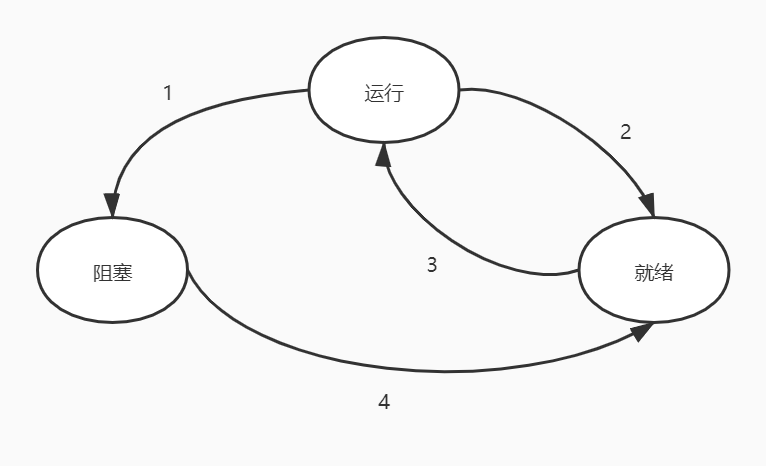

，

### 2.1 进程

- 在任何多道程序设计系统中，CPU由一个进程快速切换至另一个进程，使每个进程各运行几十或几百毫秒，即某一瞬间CPU只能运行一个进程，但在1s内可能运行多个进程，这样就产生并行的错觉，叫伪并行。真正的并行是多处理器系统，该系统中有两个或以上CPU共享同一个物理内存，可以真正的并行

#### 2.1.1 进程模型

- 在进程模型中计算机上所有可运行的软件，通常包括操作系统，被组织成若干顺序进程，简称进程
- 一个进程是一个正在执行程序的实例，包括程序计数器、寄存器和变量的当前值，每个进程拥有它自己的虚拟CPU，实际上真正的CPU在各进程之间来回切换
- 考虑在伪并行情况下运行的进程集要比试图跟踪CPU如何在程序间来回切换简单的多
- 由于CPU在各进程之间来回切换，所以每个进程执行其运算的速度是不确定的，且当同一进程进程再次运行时，其运算速度通常也不可再现，所以在对进程编程时不能对时序做任何相当然的假设
- 当一个进程具有严格的实时要求时，也就是一些特定时间一定要在所指定的若干毫秒内发生，那么必须采取特殊措施以保证它们一定在这段时间中发生，但通常大多数进程并不受CPU多道程序设计或其他进程相对速度的影响
- 一个进程是某种类型的一个活动，它有程序、输入、输出以及状态，单个处理器可以被若干进程共享，它使用某种调度算法决定何时停止一个进程的工作并转而为另一个进程提供服务
- 若一个进程运行了两遍则算作两个进程，操作系统能使它们共享代码，因此只有一个副本在内存中，但只是技术性的细节不会改变有两个进程正在运行的概念

#### 2.1.2 进程的创建

- 一些只为运行一个应用程序设计的系统，可能在系统启动时，以后所需要的所有进程都已存在

- 在通用系统中，需要有某种方法在运行时按需要创建或撤销进程。四种主要时间会导致进程的创建：

  1. 系统初始化：启动系统时通常会创建若干个进程，其中有些是前台进程即和用户交互且帮助完成工作的那些进程，其他的是后台进程，这些进程与特定的用户没有关系，但却具有专门的功能。停留在后台处理如电子邮件、Web页面等之类的活动称为守护进程，在大型系统通常有很多守护进程。在UNIX中可以用ps程序列出正在运行的进程，Windows中使用任务管理器
  2. 正在运行的程序执行了创建进程的系统调用：一个正在运行的进程经常发出系统调用以便创建一个或多个新进程协助其工作，当该工作可容易的划分成若干相关的但没有相互作用的进程时，创建新的进程就特别有效果
  3. 用户请求创建一个新进程：在交互式系统中，键入一个命令或双击一个图标就可以启动一个程序，这两个动作都会开始一个新进程并在其中运行所选择的程序。在基于命令行的UNIX系统中运行程序，新的进程会从该进程接管开启它的窗口。Windows中多数情况下，在一个进程开始时并没有窗口，但它可以创建一个或多个窗口。UNIX和Windows系统中，用户可以同时打开多个窗口，每个窗口都运行一个进程，通过鼠标用户就可以选择一个窗口并与该进程交互
  4. 一个批处理作业的初始化：在大型机的批处理系统中，用户提交批处理作业，在操作系统认为有资源可运行另一个作业时，它创建一个新进程并运行其输入队列中的下一个作业

  从技术上来看，新进程都是由于一个已存在的进程执行了一个用于创建进程的系统调用而创建的，该进程可以是一个运行的用户进程、一个由键盘或鼠标启动的系统进程或一个批处理管理进程，其做的工作是执行一个用来创建新进程的系统调用通知操作系统创建一个新进程，并直接或间接的指定在该进程中运行的程序

- UNIX系统中，只有fork系统调用可以创建新进程，该系统调用会创建一个与调用进程相同的副本，父进程和子进程拥有相同的内存映像、同样的环境字符串和同样的打开文件。通常子进程接着执行execve或一个类似的系统调用以修改其内存映像并运行一个新的程序

  Windows中，一个WIN32函数调用CreateProcess既处理进程的创建也负责把正确的程序装入新的进程。该调用有10个参数，包括要执行的程序、输入给该程序的命令行参数、各种安全属性、有关打开的文件是否被继承的控制位、优先级信息、该进程所需要创建的窗口规格（若有的话）、指向一个结构的指针，在该结构中新创建进程的信息被返回给调用者。除了该函数外还有大约100个其他函数用于处理进程的管理、同步以及相关事务

- 在UNIX和Windows中进程创建后，父进程和子进程都有各自不同的地址空间，若其中某个进程在其地址空间中修改了一个字，这个修改对其他进程而言是不可见的。

  UNIX中子进程的初始地址空间是父进程的一个副本，但涉及到两个不同的地址空间，不可写的内存区是共享的。某些UNIX的实现使程序正文在两者间共享因为它不能被修改，或子进程共享父进程的所有内存，这种情况下内存通过写时复制共享，即一旦两者之一想要修改部分内存，则这块内存首先被明确的复制以确保修改发生在私有内存区域，实际上可写的内存还是不能共享。

  在Windows中从一开始父进程的地址空间和子进程的地址空间就是不同的

#### 2.1.3 进程的终止

- 进程终止通常由下列条件引起：

  1. 正常退出（自愿）：多数进程是由于完成它们的工作而终止，当编译器完成了所给定程序的编译之后，编译器执行一个系统调用通知操作系统他的工作已经完成。UNIX中是exit，Windows中是ExitProcess，面向屏幕的程序也支持自愿终止
  2. 出错退出（自愿）：由于程序中的错误所致，有些系统中进程可以通知操作系统，希望自行处理某些类型的错误，在这类错误中进程会收到信号被中断而不是在这类错误出现时终止
  3. 严重错误（非自愿）
  4. 被其他进程杀死（非自愿）：某个进程执行一个系统调用通知之操作系统杀死某个其他进程，UNIX中该系统调用是kill，Win32中是TerminateProcess。这个系统调用必须获得确定的授权以便进行动作

  在有些系统中当一个进程终止时，不论自愿还是其他原因，由该进程所创建的所有进程也一律立即被杀死，但UNIX和Windows都不是该方式

#### 2.1.4 进程的层次结构

- 某些系统中，当进程创建了另一个进程后，父进程和子进程就以某种形式继续保持关联，子进程本身可以创建更多的进程组成一个进程的层次结构。一个进程只能有个一个父进程但可以有0-n个子进程
- UNIX中，进程和它的所有子进程以及后裔共同组成一个进程组，当用户从键盘发出一个信号时，该信号被发送给当前与键盘相关的进程组中的所有成员，通常是当前窗口创建的所有活动进程，每个进程可以分别捕获信号、忽略该信号或采取默认动作
- Windows中没有进程层次概念，所有进程的地位相同，唯一类似于层次的暗示是在创建进程时，父进程得到一个句柄，该句柄可以用来控制子进程，但它有权将句柄传给其他进程这样就不存在进程层次了。UNIX中进程不能剥夺其子进程的“继承权”

#### 2.1.5 进程的状态

- 尽管每个进程是独立的实体，有自己的程序计数器和内部状态，但进程之间经常需要相互作用，一个进程的输出结果可能作为另一个进程的输入

- 一个进程在逻辑上不能继续运行时就会被阻塞，这是自身原因引起，还有的是能够运行的进程由于操作系统调度另一个进程调用CPU被迫停止，这是系统技术上的原因引起的

- 三状态转换图：

  1. 运行态：进程占用CPU
  2. 就绪态：可运行，但因为其他进程正在运行而暂时停止
  3. 阻塞态：除非某种外部事件发生，否则进程不能运行

  

  状态转换：

  - 转换1：操作系统发现进程不能继续运行下去。某些系统中，进程可以执行一个如pause的系统调用来进入阻塞状态，在其他系统中包括UNIX，当一个进程从管道或设备文件读取数据时，若没有有效的输入存在则进程自动阻塞
  - 转换2、3：由进程调度程序引起，进程调度程序是操作系统的一部分，进程甚至感觉不到调度程序的存在。当系统认为一个运行进程占用处理器的时间已经过场，决定让其他进程使用CPU时间时，发生转换2。在系统已经让所有其他进程享有了它们应有的公平待遇而重新轮到某个进程再次占用CPU运行时，发生转化3。调度程序的主要工作是决定应当运行哪个进程。何时运行及应该运行多长时间
  - 转换4：当进程所等待的外部事件发生

- 一个理想的模型：操作系统最底层是调度程序，在它上面有许多进程，所有关于中断处理、启动进程、停止进程的具体细节都隐藏在调度程序中，实际上调度程序是一段非常短小的程序，操作系统的其他部分被简单的组织成进程的形式，很少有真实系统这样构造

#### 2.1.6 进程的实现

- 为实现进程模型，操作系统维护一张进程表（一个结构数组），每个进程占用一个进程表项（有的称这些表项为进程控制块），该表项包含了进程状态的重要信息，包括程序计数器、堆栈指针、内存分配状况、所打开文件的状态、账号、调度信息、其他在进程由运行态转换到就绪态或阻塞态必须保存的信息，从而保证进程随后能再次启动

- 进程表项所需的一些字段：

  | 进程管理        | 存储管理   | 文件管理   |
  | --------------- | ---------- | ---------- |
  | 寄存器          | 正文段指针 | 根目录     |
  | 程序计数器      | 数据段指针 | 工作目录   |
  | 程序状态字      | 堆栈指针   | 文件描述符 |
  | 堆栈指针        |            | 用户ID     |
  | 进程状态        |            | 组ID       |
  | 优先级          |            |            |
  | 调度参数        |            |            |
  | 进程ID          |            |            |
  | 父进程          |            |            |
  | 进程组          |            |            |
  | 信号            |            |            |
  | 进程开始时间    |            |            |
  | 使用的CPU时间   |            |            |
  | 子进程的CPU时间 |            |            |
  | 下次定时器时间  |            |            |

- 与每一个I/O类关联的是一个称作中断向量的位置（靠近内存底部的固定区域），包含中断服务程序的入口地址。当中断发生操作系统最底层的工作步骤：

  1. 中断硬件程序将程序计数器、程序状态字、有时有一个或多个寄存器压入堆栈
  2. 硬件从中断向量装入新的程序计数器，计算机随即跳转到中断向量所指示的地址
  3. 中断服务例程（汇编语言）接管一切剩余工作，所有的中断都从保存寄存器开始，对于当前进程通常是保存在进程表项中
  4. 随后从堆栈中删除由中断硬件机制存入堆栈的那部分信息，并将堆栈指针指向一个由进程处理程序所使用的临时堆栈
  5. 调用C过程（假设操作系统用C语言编写）处理某个特定的中断类型剩下的工作
  6. 调度程序决定下一个运行的进程
  7. C过程返回至汇编代码，为当前的进程装入寄存器值以及内存映射并启动该进程运行

#### 2.1.7 多道程序设计模型

- 采用多道程序设计可以提高CPU的利用率。假设一个进程等待I/O的时间与其停留在内存中的时间比为p，当内存中同时存在n个进程时，所有n个进程都在等待I/O的概率就是p^n，此时CPU空转
  $$
  CPU利用率 = 1 - p^{n}
  $$
  可以看出对于同一个p来说，随着n增大，CPU利用率增加

- 从完全精确的角度考虑，该概率模型只是描述了一个大致的状况，它假设所有n个进程是独立的，但在单个CPU中不能同时运行多个进程，所以当CPU忙时已就绪的进程也必须等待CPU，因而进程不是独立的。更精确的模型应该用排队论构建，但该模型仍然是有效的，只是真实曲线会有略微不同

### 2.2 线程

#### 2.2.1 线程的使用

- 需要多线程的原因：
  - 在许多应用中同时发生着多种活动，某些活动随着时间的推移会被阻塞，通过将这些应用程序分解成可以准并行的多个顺序线程，程序设计模型会变得更简单
  - 线程比进程那更轻量级，比进程更容易创建，更容易撤销。在许多系统中创建一个线程较创建一个进程要快10至100倍，在有大量线程需要动态和快速修改时具有这一特性是很有用的
  - 若多个线程都是CPU密集型的，那么并不能获得性能上的增强，但若存在着大量的计算和大量的I/O处理，拥有多个线程允许这些活动彼此重叠进行，从而加快应用程序执行的速度
  - 在多CPU系统中多线程是有益的，该系统中真正的并行有了实现的可能性

#### 2.2.2 经典的线程模型

- 进程拥有一个执行的线程，在线程中有一个程序计数器用来记录接着要执行的指令，拥有寄存器保存线程当前的工作变量，拥有堆栈记录执行历史，每一帧保存了一个已调用但还没有从中返回的过程。

- 尽管线程必须在某个进程中执行，但线程和它的进程是不同的概念可以分别处理，进程用于把资源进程到一起，而线程则是在CPU上被调度执行的实体

- 线程给进程模型增加了一项内容，即在同一个进程环境中允许彼此之间有较大独立性的多个线程执行，在同一个进程中并行运行多个线程是对在同一台计算机上并行运行运行多个进程的模拟。多个线程共享同一个地址空间和其他资源，多个进程共享物理内存、磁盘、打印机以及其他资源。线程具有进程的某些性质所以有时称为轻量级进程，多线程也用来描述在同一个进程中运行多个线程的情形

- 当多线程进程在但CPU系统中运行时线程轮流运行，CPU在线程之间快速切换，制造了线程并行运行的假象，好似在一个比实际CPU慢一些的CPU上同时运行

- 进程中的不同线程不像不同进程那样存在很大的独立性，所有线程有完全一样的地址空间，意味着共享同样的全局变量。由于各个线程都可以访问进程地池空间中的每一个内存地址，所以一个线程可以读、写或甚至清除另一个线程的堆栈，线程之间是没有保护的，因为不可能也没有必要。不同的进程会来自不同的用户，彼此之间可能有敌意，一个进程总是由某个用户所拥有，而用户创建多个线程是为了它们之间的合作而不是彼此间争斗，除了共享地址空间之外，所有线程还共享同一个打开的文件集、子进程、定时器以及相关信号

- 共享内存的线程的结构

  | 进程中的内容       | 每个独立线程中的内容 |
  | ------------------ | -------------------- |
  | 地址空间           | 程序计数器           |
  | 全局变量           | 寄存器               |
  | 打开文件           | 堆栈                 |
  | 子进程             | 状态                 |
  | 即将发生的定时器   |                      |
  | 信号与信号处理程序 |                      |
  | 账户信息           |                      |

- 线程概念试图实现的是共享一组资源的多个线程的执行能力以便这些线程可以为完成某一任务而共同工作

- 和传统进程一样线程可以处于若干种状态的任何一个：运行、阻塞、就绪、终止。正在运行的线程拥有CPU且是活跃的，被阻塞的线程正在等待某个释放它的事件，就绪线程可被调度运行且只要轮到它很快就可以运行

- 每个线程有自己的堆栈，其中有一帧供各个被调用但还没有从中返回的过程调用但还没有从中返回的过程调用，在该栈帧中存放了相应过程的局部变量以及过程调用完成之后使用的返回地址，通常每个线程会调用不同的过程，从而有一个各自不同的执行历史

- 在多线程此情况下，进程通常会从当前的单个线程开始，该线程有能力通过一个库函数（如thread_create）创建新的线程，没有必要对新线程的地址空间加以规定，因为新线程会自动创建在创建线程的地址空间中运行。有时线程是有层次的，具有父子关系，但通常不存在这样的关系，所有线程都是平等的。

- 当一个线程完成工作后可以调用一个库过程（如thread_exit）退出，该线程接着消失不再可调度。在某些线程系统中通过调用一个过程（如thread_join），这个过程阻塞调用线程等待一个特定线程退出。还要thread_yield允许线程自动放弃CPU从而让另一个线程运行，该调用很重要，因为线程库不能像进程利用时钟中断强制让出CPU，所以让线程可以随时间推移自动交出CPU以便让其他线程有机会运行就很重要。还有的调用允许某个线程等待另一个线程完成某些任务或等待一个线程宣称它已经完成了有关工作

#### 2.2.3 POSIX线程

- 为实现可移植的线程程序，IEEE在IEEE标准1003.1c中定义了线程的标准，线程包叫做pthread，大部分UNIX系统都支持该标准，其定义了超过60个函数调用

- 所有pthread线程都有某些特性，每一个都含有一个标识符、一组寄存器、一组存储在结构中的属性（包括堆栈大小、调度参数、其他线程需要的项目）

- 主要的pthread函数

  | 线程调用             | 描述                           |
  | -------------------- | ------------------------------ |
  | pthread_create       | 创建一个新线程                 |
  | pthread_exit         | 结束调用的线程                 |
  | pthread_join         | 等待一个特定的线程退出         |
  | pthread_yield        | 释放CPU来运行另一个线程        |
  | pthread_attr_init    | 创建并初始化一个线程的属性结构 |
  | pthread_attr_destroy | 删除一个线程的属性结构         |

  - pthread_create：新创建的线程标识符会作为函数值返回
  - pthread_exit：当一个线程完成分配给它的工作时，可通过调用pthread_exit终止，该调用终止该线程并释放它的栈
  - pthread_join：一个线程在运行前需要等待另一个线程完成它的工作并退出，可以使用该函数调用等待特定线程的终止，该特定线程用线程标识符作为参数给出
  - pthread_yield：一个线程逻辑上没有阻塞，但感觉已经运行足够长时间并希望给另一个线程机会去运行，可以通过调用pthread_yield完成该目标
  - pthread_attr_init：建立关联一个线程的属性结构并初始化为默认值，这些值可通过修改属性结构中的域值来改变
  - pthread_attr_destroy：删除一个线程的属性结构并释放它占用的内存，它不会影响调用它的线程

#### 2.2.4 在用户空间中实现线程

- 有主要三种方法实现线程包：在用户空间、在内核中、两种方法混合实现

- 把整个线程包放在用户空间中，内核对线程包一无所知，从内核角度考虑就是按正常的单线程进程方式处理。线程在一个运行时系统的上层运行，该运行时系统是一个管理线程的过程集合。在用空间管理线程时，每个进程需要有其专用的线程表，用来跟踪该进程中的线程，这些表和内核中的进程表类似，但仅仅记录各个线程的属性（程序计数器、堆栈指针、寄存器、状态等），线程表由运行时系统管理。当一个线程切换状态时，由运行时系统负责检查和处理

  优点：

  - 用户线程包可以在不支持线程的操作系统上实现。过去所有的操作系统都属于这个范围，即使现在也有些操作系统还是不支持线程。
  - 允许每个进程有自己定制的调度算法
  - 具有较好的可扩展性，在内核空间中内核线程需要一些固定的表格空间和堆栈空间，若内核线程的数量非常大就会出现问题

  缺点：

  - 实现阻塞系统调用比较难，使用线程的一个主要目标是允许每个线程使用阻塞调用，但要避免被阻塞的线程影响其他线程。一种解决方法是将系统调用全改为非阻塞，但需要修改操作系统，而用户线程就是要能在现有的操作系统上运行，所以该方法不好。另一种替代方案是若某个调用会阻塞就提前通知，如某些UNIX版本中select系统调用允许调用者通知预期的read是否会阻塞，该方法需要重写部分系统调用库，所以效率也不高
  - 缺页中断问题，若某个程序调用或跳转到一条不在内存的指令上就会发生页面故障，而操作系统将到磁盘上取回这个丢失的指令。在对所需的指令进行定位和读入时，相关的进程就被阻塞，若有一个线程引起页面故障，内核由于不知道线程的存在，通常会把整个进程阻塞尽管其他的线程是可以运行的
  - 若一个线程开始运行该线程中的其他线程就不能运行，除非第一个线程自动放弃CPU。在一个单独的进程内部没有时钟中断，所以不可能用轮转调度的方式调度线程。一个可能的解决方案是让运行时系统请求固定时间一次的时钟星号，但这样对程序是生硬且无序的
  - 程序员通常在经常发生线程阻塞的应用中才希望使用多个线程。这些线程持续的进行系统调用，而一旦发生内核陷阱进行系统调用，若原有的线程已经阻塞就很难让内核进行线程的切换，若要内核消除这个情形就需要持续的进行检查

#### 2.2.5 在内核中实现线程

- 不再需要运行时系统，每个进程中也没有进程表，在内核中有用来记录系统中所有线程的进程表，当线程希望创建一个新线程或撤销一个已有线程时，其进行一个系统调用，通过对线程表的更新完成线程创建或撤销工作。所有能够阻塞线程的调用都以系统调用的形式实现，与运行时系统相比代价比较高。当一个线程阻塞时，内核可以运行同一个进程中的另一个线程或运行另一个进程中的线程。由于在内核中创建或撤销线程的代价比价大，某些系统采取回收线程的方式，当某个线程被撤销时就把它标记为不可运行的，但其内核数据结构没有受到影响，稍后在需要创建一个新线程时就重新启动某个旧线程，从而节省一些开销。内核线程需要任何新的、非阻塞系统调用，且若某个进程中的线程引起了页面故障，内核可以很方便的检查该进程是否有任何其他可运行的线程，若有则在等待所需要的页面从磁盘读入时就选择一个可运行的线程运行。

  缺点：系统调用的代价比较大，若线程的操作比较多就会带来很大的开销

#### 2.2.6 混合实现

- 将用户线程和内核线程结合起来：一种方法是使用内核级线程，然后将用户级线程与某些或全部内核线程多路复用起来，采用该方法编程人员可以决定有多少个内核线程和多少个用户级线程彼此多路复用，该模型带来最大的灵活度。该方法中内核只标识内核级线程，并对其进行调度，其中一些内核级线程会被多个用户级线程多路复用，每个内核级线程有一个可以轮流使用的用户级线程集合

#### 2.2.7 调度程序激活机制

- 内核级线程在一些关键点上优于用户级线程，但内核级线程比较慢，保持内核线程的优良特性改进速度的一种方式是调度程序激活机制

  目标：模拟内核线程的功能，但为线程包提供通常在用户空间中才能实现的更好的性能和更大的灵活性，若用户线程从事某种系统调用是安全的那就不应该进行专门的非阻塞调用或进行提前性检查，若线程阻塞在某个系统调用或页面故障上，只要在同一个进程中有任何就绪的线程，就应该有可能运行其他的线程。由于避免了在用户空间和内核空间不必要的转换，从而提高了效率

- 当使用调度程序激活机制时，内核给每个进程安排一定数量的虚拟处理器，并让用户空间运行时系统会将线程分配到处理器上，该机制也可用于多处理器中，此时虚拟处理器可能成为真实的CPU。分配给一个进程的虚拟处理器的初始化数量是一个，但进程可以申请更多的处理器并在不用时退回，内核也可以取回已分配出去的虚拟处理器，以便将它们分给需要更多处理器的进程

  工作时，当内核了解到一个线程被阻塞之后，通知该进程的运行时系统，并在堆栈中以参数形式传递有问题的线程编号和所发生的事件的一个描述，内核通过在一个已知的起始地址中启动运行时系统，从而发起通知，这是对UNIX中信号的一种粗略模拟，该机制称为上行调用（违反层次系统内在结构的概念，下层调用上层）。接着运行时系统把当前线程标记为阻塞并从就绪表中取出另一个线程，设置其寄存器然后再启动。当阻塞线程又可调用时，内核又一次上行调用运行时系统通知该事件，此时运行时系统按自己判断重启阻塞的线程或放入就绪表稍后执行

  在某个用户线程运行的同时发生一个硬件中断时，被中断的CPU切换至内核态，若被中断的进程对引起该中断的事件不感兴趣，则中断处理程序结束之后就把被中断的线程恢复到中断前的状态，若进程对中断感兴趣，则被中断的线程就不再启动，代之为挂起被中断的线程，而运行时系统则启动对应的虚拟CPU，此时被中断线程的状态保存在堆栈中，运行时系统决定在该CPU上调度哪个线程

#### 2.2.8 弹出式线程

- 处理到来的消息的创痛方法是将进程或线程阻塞在一个receive系统调用上，等待消息的到来，当消息到达时该系统调用接收消息，并打开消息检查其内容，然后进行处理
- 弹出式线程：一个消息的到达导致系统创建一个处理该消息的线程。好处是这种线程相当新，没有必须存储的寄存器、堆栈等内容，每个线程彼此之间完全一样，这样就可以快速创建这类线程，对该新线程指定所要处理的消息，所以消息到达与处理开始的时间相当短
  - 在内核空间中运行弹出式线程通常比用户空间中容易且快捷，且内核空间中的弹出式线程可以很容易访问所有的表格和I/O设备，也许在中断处理时非常有用，另一方面，出错的内核线程会比出错的用户线程造成更大的损害

#### 2.2.9 使单线程代码多线程化

- 单线程改多线程的问题：

  - 一个线程的代码就想进程一样，通常包含多个过程，有局部变量、全局变量、过程参数，其中局部变量和过程参数不会引发问题，而全局变量对于某个线程可能是，但对于整个程序来说就不一定了。有许多变量之所以是全局的是因为线程中的许多过程都会使用，但其他线程在逻辑上和这些变量无关

    一种解决方法是全面禁止全局变量，但该想法不一定合适，因为它同许多已有的软件冲突。另一个解决方法是每个线程赋予其室友的全局变量，在效果上这个方案创建了新的作用域层，这些变量对一个线程中的所有过程都是可见的，而在原来的作用域层变量只对一个过程可见并在程序中处处可见。多数程序设计语言具有表示局部变量和全局变量的方式，而没有中间的形式，有可能为全局变量分配一块内存并将它转送给线程中的每个过程作为额外的参数。另一个方案是引入显得库过程，以便创建、设置和读取这些线程范围的全局变量

  - 许多库过程并不是可重入的，即对于任何给定的过程，当前面的调用尚未结束前，不能进行第二期调用，类似的还有内存分配的过程。要有效解决这些问题意味着重写整个库，而这可能引入一些微妙的错误

  - 信号，有些信号逻辑上是线程专用的，但另一些不是

  - 堆栈的管理，许多系统中当一个进程的堆栈溢出时，内核只是自动为该进程提供更多的堆栈，当一个进程有多个线程时就必须有多个堆栈。若内核不了解所有的堆栈就不能使它们自动增长，直到造成堆栈出错，事实上内核可能没有意识到内存错误和某个线程栈增长有关

  这些问题是可以可负担，但表明了给已有的系统引入线程而不进行实质性的重新设计系统根本不行的，至少需要重新定义系统调用的语义，且不得不重写库，这些工作必须与在一个进程中有一个线程的原有程序向后兼容

### 2.3 进程间通信

- 进程间通信（Inter Process Communication，IPC）：

  1. 进程如何把信息传递给另一个
  2. 确保两个及以上进程在关键活动中不会出现交叉
  3. 正确的顺序

  其中第二个问题和第三个问题对线程同样使用

#### 2.3.1 竞争条件

- 在一些操作系统中，协作的进程可能共享一些彼此都能读写的公用存储区，该公用存储区可能在内存中，也可能是一个共享文件，该共享存储区的位置并不影响通信的本质及其带来的问题
- 竞争条件：多个进程读写某些共享数据，最后的结果取决于进程运行的精确时序

#### 2.3.2 临界区

- 互斥：以某种手段确保当一个进程在使用一个共享变量或文件时，其他进程不能做出同样操作
- 临界区域、临界区：对共享内存进行访问的程序片段。能够适当的安排是的两个进程不会同时处于临界区中，就能避免竞争条件
- 避免竞争条件好的解决办法需要满足一下条件：
  1. 任何两个进程不能同时处于其临界区
  2. 不应对CPU的速度和数量做出任何假设
  3. 临界区外运行的进程不得阻塞其他进程
  4. 不得使进程无限期等待进入临界区

#### 2.3.3 忙等待的互斥

- 忙等待：连续测试一个变量直到某个值出现为止称为忙等待

- 自旋锁：用于忙等待的锁

- 互斥方案：

  - 屏蔽中断：在单处理器系统中，最简单的方法是使每个进程在刚刚进入临界区后立即屏蔽所有中断，并在就要离开之前再打开中断，屏蔽中断后时钟中断也被屏蔽，CPU只有发生时钟中断或其他中断才会进行进程切换，所以在屏蔽中断之后CPU将不会被切换到其他进程

    缺点：

    - 单处理器整个系统可能会因此终止，而多处理器，则屏蔽中断仅仅对执行disable指令的那个CPU有效，其他CPU仍将继续运行并可以访问共享内存
    - 对内核来说，当它在更新变量或列表的几条指令期间将中断屏蔽是很方便的，当就绪进程队列之类的数据状态不一致时将发生中断，导致竞争条件

  - 锁变量：一种软件解决方案。有一个共享锁变量，0表示临界区内没有进程，1表示已经有某个进程进入临界区。当一个进程向进入临界区时首先测试该锁，若锁的值为0，则设置为1并进入临界区，若锁的值为1，则线程等待至所为0

    缺点：一个进程读出所变量的值并发现它为0，然后另一个进程别调度运行将该锁变量设置为1，这样两个进程仍可以同时进入临界区

  - 严格轮转法：使用整型变量turn，用于记录哪个进程进入临界区并检查或更新共享内存

    缺点：在一个进程比另一个慢许多的情况下，该方法对较快的进程不公平

    ```c++
    // 进程0
    while(true){
    	while(turn != 0);	// turn不等于0则等待
    	执行临界区代码;
    	turn = 1;
    	执行非临界区代码;
    }
    
    // 进程1
    while(true){
    	while(turn != 1);	// turn不等于0则等待
    	执行临界区代码;
    	turn = 0;
    	执行非临界区代码;
    }
    ```

  - Peterson解法：在使用共享变量前，每个进程使用其进程号0或1作为参数来调用enter_region，该调用在需要时将使进程等待，直到能安全进出入临界区，在完成对共享变量的操作之后进程调用leave_region表示操作已完成，若其他进程希望进入临界区则现在就可以进入

    ```c++
    int turn;				// 现在轮到谁
    int interested[N];		// 进程是否感兴趣
    
    void enter_region(int process){
    	int ohter;			// 另一个进程
    	other = 1 - process;
    	interested[process] = true;
    	turn = process;
    	while(turn == process && interested[other] == true);		// 当另一个进程感兴趣且轮到当前线程才会阻塞，所以就不管谁先谁后都不会出问题
    }
    
    void leave_region(int process){
    	interested[process] = false;
    }
    ```

  - TSL指令：硬件支持方案，某些计算机特别是设计为多处理器的计算机，都有TSL RX,LOCK指令，称为测试并加锁（test and setlock），将一个内存字lock读到寄存器RX中，然后在改内存地址上存一个非零值。读字和写字操作是不可分割的，即指令结束之前其他处理器均不允许访问该内存字。执行TSL指令的PCU将锁住内存总线以禁止其他CPU在本指令结束前访问内存。为了使用TSL指令要使用一个共享变量lock来协调对共享内存的访问，当lock为0时任何进程都可以使用TSL指令将其设置为1，并读写共享内存，当操作结束时进程用一条普通的move指令将lock重新设置为0。一条可替代TSL的指令是XCHG，其原子性的交换两个位置的内容

    ```
    enter_region:
    	TSL REGISTER,LOCK		| 复制锁到寄存器并将锁设为1
    	CMP REGISTER,#0			| 判断锁是否为0
    	JNE enter_region		| 若不是0则锁被设置，跳转到开始循环
    	RET						| 返回调用者，进入临界区
    
    leave_region:
    	MOVE LOCK,#0			| 将锁设为0
    	RET
    	
    enter_region:
    	MOVE REGISTER,#1		| 在寄存器中放入1
    	XCHG REGISTER,LOCK		| 交换寄存器和锁的内容
    	CMP REGISTER,#0			| 判断锁是否为0
    	JNE enter_region		| 若不是0则锁被设置，跳转到开始循环
    	RET						| 返回调用者，进入临界区
    
    leave_region:
    	MOVE LOCK,#0			| 将锁设为0
    	RET
    ```

  严格轮转法、Peterson解法、TSL、XCHG都是正确的，但是都用忙等的缺点，总体的算法思想为当一个进程想进入临界区时先检查是否允许进入，若不允许则该进程将原地等待知道允许为止

- 忙等的缺点：

  - 浪费CPU时间
  - 优先级反转问题：调度规则规定高优先级进程处于就绪状态则理解调用，当低优先级和高优先级都需要使用临界区资源，低优先级先进入临界区，此时高优先级进入就绪状态，调度程序切换高优先级进程运行，此时高优先级进程将一直忙等下去

#### 2.3.4 睡眠与唤醒

- 有几条进程间通信原语，在无法进入临界区时将阻塞而不是忙等。最简单的是sleep和wakeup，sleep将引起调用进程阻塞，直到另一个进程将其唤醒，wakeup有一个参数表示被唤醒的进程

- 生产者消费者问题，也称有界缓冲区问题：两个进程共享一个公共的固定大小的缓存区，其中一个是生产者，将信息放入缓冲区，另一个是消费者从缓冲区中取出消息

- 使用sleep和wakeup解决生产者消费者问题

  ```c++
  #define N 100					// 缓冲区的槽数
  int count = 0;					// 缓冲区的数据项数
  
  void producer(){
  	int item;
  	
  	while(true){
  		item = produce_item();				// 产生下一数据项
  		if(count == N) sleep();				// 若缓冲区满则休眠
  		intert_item(item);					// 将新数据放入缓冲区
  		count++;							
  		if(count == 1) wakeup(consumer);	// 缓冲区刚好为1时启动消费者
  	}
  }
  
  void consumer(){
  	int item;
  	
  	while(true){
  		if(count == 0) sleep();				// 若缓冲区为空则休眠
  		item = remove_item();				// 从缓冲区崇取出数据
  		count--;
  		if(count == N-1) wakeup(producer);	// 缓冲区刚好比满了少一个时启动生产者
  		consume_item(item);
  	}
  }
  ```

  问题：由于对count没有访问限制，若当消费者提取count时为0，然后切换到生产者生产一个数据项然后激活消费者，但消费者此时还未休眠所以激活无效，等消费者时就认为count为0开始休眠，后面生产者也一直生产到缓冲区满开始休眠

  解决：增加一个唤醒等待位，当一个wakeup信号发送给一个清醒的基恩成时该位置为1，当进程要睡眠时若环型等待位为1则将改为清除，该进程仍然保持清醒。但对于多个进程来说，这个等待位指数增长，所以没有从根本上解决问题

#### 2.3.5 信号量

- Dijkstra提出信号量，即使用一个整型变量累计唤醒次数。其设立P（荷兰语：Proberen尝试）V（荷兰语：Verhogen增加）操作：

  - P操作检查信号量是否大于0，若大于0则减1并继续，若等于0则将进程休眠且此时P操作未结束
  - V操作将信号量加1，若一个至多个进程在该信号量上睡眠，则由系统选择其中一个并允许进程完成P操作，此时信号量还是为0但是睡眠的进程少了一个

  这两操作都是原子操作。操作系统在执行这两个操作时将屏蔽所有中断，由于只需要几条指令所有不会带来什么副作用。且信号量操作只需要几毫秒，比忙等耗时更短

- PV操作在Algol 68语言中首次引入，并命名为down和up

- 原子操作：一组相关联的操作要不不间断的执行，要么不执行

- 使用信号量解决生产者消费者问题

  ```c++
  #define N 100
  int mutex = 1;		// 互斥量
  int empty = N;		// 空槽数
  int full = 0;		// 已有数
  
  void producer(){
  	int item;
  	
  	while(true){
  		item = produce_item();		// 生产数据
  		P(empty);					// 空槽数减一
  		P(mutex);					// 进入临界区
  		insert_item(item);			// 将新数据放入缓冲区
  		V(mutex);					// 离开临界区
  		V(full);					// 已有数加一
  	}
  }
  
  void consumer(){
  	int item;
  	
  	while(true){
  		P(full);					// 已有数减一
  		P(mutex);					// 进入临界区
  		item = remove_item();		// 将新数据放入缓冲区
  		V(mutex);					// 离开临界区
  		V(empty);					// 空槽数加一
  	}
  }
  ```

#### 2.3.6 互斥量

- 若不需要信号量的计数能力，可以使用信号量的一个简化版本互斥量，其仅适用于管理共享资源或一小段代码。其处于解锁和加锁两种状态，只需要用一个二进制位表示，不过实际上使用整型，0表示加锁其他表示解锁。

- mutex_lock和mutex_unlock实现

  ```
  mutex_lock
  	TSL REGISTER,MUTEX			| 将互斥信号量复制到寄存器并将互斥信号量置1
  	CMP REGISTER,#0				| 判断互斥量是否为0
  	JZE ok						| 为0则被解锁，直接返回
  	CALL thread_yield			| 否则调用另一个线程
  	JMP mutex_lock				| 再试一遍
  	ok: RET
  	
  mutex_unlock:
  	MOVE MUTEX,#0				| 将互斥量置为0
  	RET
  ```

  其与enter_region不同的是，后者会忙等一段时间等待时钟切换，若在用户线程中是无法通过时钟中断完成线程切换的，会一直忙等。而前者的thread_yield是在用户空间中对线程调度程序的调用，运行非常快

- 大多数早期解决方案，如Peterson算法和信号量，都有一个前提，即多个进程至少应该访问一些共享内存。若进程有不连续的地址空间，则需要其他方式共享变量。一种解决方案是有些共享数据解耦股可以放在内核中，如信号量，且只能通过系统调用访问。另一种是多数现代操作系统（包括UNIX和Windows）提供一些方法让进程和其他进程共享其部分地址空间，该方法中缓冲区和其他数据结构可以共享，在任何最坏的情形下若没有可共享的途径则可以使用共享文件

- 随着并行的增加，有效的同步和锁机制对性能而言非常重要，若等待时间短的话，自旋锁会很快，否则会浪费CPU周期。若有很多竞争则阻塞该进程且仅当所被释放的时候让内核解除阻塞会更有效，但若只有很小的竞争该方法不停的切换内核花费就比较大

- futex，或称快速用户空间互斥：Linux的一个特性，实现了基本的锁（类似互斥锁）但避免了陷入内核，除非必须要。其包含两部分：

  - 内核服务：提供一个等待队列，允许多个进程在一个锁上等待，它们不会运行，除非内核明确解除阻塞。将一个进程放入等待队列需要代价很大的系统调用，应避免该情况
  - 用户库：没有竞争时，futex完全在用户空间工作

  进程共享通用的锁变量，假设锁初始值为1（释放状态），线程通过执行原子操作“减少并检验”夺取锁，若锁处于释放状态则成功夺取该锁，否则futex库使用一个系统调用将这个线程放在内核的等待队列上，当一个线程使用完锁，会通过原子操作“增加并检验”来释放锁，若此时有进程阻塞在内核等待队列上则通知内核可以对等待队列里的一个或多个进程解除阻塞

- pthread中的互斥量：基本机制是使用一个可被锁定和解锁的互斥量来保护每个临界区，若一个线程想要进入临界区首先尝试锁住相关互斥量，若互斥量没有加锁则可以立即进入，且该互斥量被自动锁定以防止其他线程进入。若互斥量已被加锁则调用线程被阻塞，直到该互斥量被解锁。若多个线程在等待同一个互斥量，当它被解锁时这些等待的线程只有一个被允许运行并将互斥量重新锁定。这些锁由程序员保证线程正确使用

  | 线程调用               | 描述                   |
  | ---------------------- | ---------------------- |
  | pthread_mutex_init     | 创建一个互斥量         |
  | pthread_mutex_destroy  | 撤销一个已存在的互斥量 |
  | p_thread_mutex_lock    | 获得一个锁或阻塞       |
  | p_thread_mutex_trylock | 获得一个锁或失败       |
  | p_thread_mutex_unlock  | 释放一个锁             |

  pthread中的条件变量：允许线程由于一些未达到的条件阻塞

  | 线程调用               | 描述                           |
  | ---------------------- | ------------------------------ |
  | pthread_cond_init      | 创建一个条件变量               |
  | pthread_cond_destory   | 撤销一个条件变量               |
  | pthread_cond_wait      | 阻塞以等待一个信号             |
  | pthread_cond_signal    | 向另一个线程发信号来唤醒       |
  | pthread_cond_broadcast | 想多个进程发信号将它们全部唤醒 |

  通常两者一起使用，用于让一个线程锁住一个互斥量，然后当不能获得它其他的结果时等待一个条件变量，等另一个线程向其发信号使它可以继续执行

- 使用pthread解决生产者消费者问题：

  ```c++
  #define MAX 100						// 需要生产的数量
  pthread_mutex_t mutex;
  pthread_cond_t condc,condp;
  int buffer = 0;						// 生产者消费者使用的缓冲区
  
  void *producer(void* ptr){
  	int i ;
  	
  	for(i = 1; i <= MAX; i++){
  		pthred_mutex_lock(mutex);					// 互斥使用缓冲区
          while(buffer != 0) 
              pthread_cond_wait(condp, mutex);
          buffer = i;									// 将数据放入缓冲区
          pthread_cond_signal(condc);					// 唤醒消费者
          pthread_mutex_unlock(mutex);				// 释放缓冲区
  	}
      pthread_exit(0);
  }
  
  void *consumer(void* ptr){
      int i;
      
      for(i = 1; i <= MAX; i++){
          pthread_mutex_lock(mutex);					// 互斥使用缓冲区
          while(buffer == 0) pthread_cond_wait(condc, mutex);
          buffer = 0;									// 从缓冲区取数据
          pthread_cond_signal(condp);					// 唤醒生产者
          pthread_mutex_unlock(mutex);				// 释放缓冲区
      }
      pthread_exit(0);
  }
  ```

- 使用信号量需要注重PV操作的顺序，就如栈一样，后P的先进行V操作，否则可能会造成死锁问题

#### 2.3.7 管程

- 管程：为了更易编写正确程序提出的一种高级同步原语。其由过程、变量及数据结构等组成的一个集合，形成一个特殊的模块或软件包。进程可在任何需要的时候调用管程中的过程，但不能在管程之外声明的过程中直接访问管程内的数据结构。管程有一个重要特性即任一时刻管程只能有一个活跃的进程，其使管程能有效完成互斥。管程编程语言的组成部分，编译器知道其特殊性，因此可以采用与其他过程调用不同的方法处理管程的调用，典型的方法是当一个进程调用管程过程时，该过程前几条指令将检查在管程中是否有其他的活跃进程，若有调用进程则被挂起，直到另一个进程离开管程将其唤醒，若没有则直接进入管程。

  进入管程的互斥由编译器负责，通常做法是使用一个互斥量或二元信号量，任一时刻，写管程的人无须关心编译器是如何实现互斥的，只需要知道将所有临界区转换成管程过程即可，不会有两个进程同时执行临界区中的代码。

  还需要一种方法使得进程在无法继续时被阻塞，解决方法是引入条件变量以及两个相关操作wait和signal，当一个管程过程发现它无法继续运行时会在某个条件变量上执行wait操作导致调用进程自身阻塞，并且将另一个以前等在管程之外的进程调入管程。另一进程可以通过对应条件变量的signal唤醒伙伴进程。为避免管程中同时有两个活跃进程，需要有一条规则通知在signal之后该怎么办，Hoare建议让新唤醒的进程运行而挂起另一个进程，Brinch Hansen建议执行signal的进程必须理解退出管程，且signal语句只能作为一个管程过程的最后一条语句，第三个方法是让发信号者继续运行，且只有在其退出管程之后才允许等待进程开始运行

- 缺点：

  - 管程是一个编程语言概念，编译器必须要识别管程并用某种方式对其互斥做出安排，C、Pascal以及多数其他语言都没有管程，所以指望这些编译器遵守互斥规则是不合理的
  - 管程和信号量是设计用来解决访问公共内存一个或多个CPU上的互斥问题，通过将信号量放在共享内存中并用TSL或XCHG指令来保护它们可以避免竞争。若分布式系统具有多个CPU，且每个CPU拥有自己的私有内存，通过一个局域网相连，则这些原语将失效

#### 2.3.8 消息传递

- 消息传递：使用send和receive两条原语，是系统调用。send向一个给定目标发送一条消息，receive从一个给定源接受一条消息，若没有消息可用则接收者可能被阻塞，直到一条消息到达，或使用一个错误码立即返回

- 消息传递系统的设计要点：

  - 为防止消息丢失，等接收到消息，接收方就马上回送一条特殊的确认消息，若发送方在一段时间间隔未收到确认则重发消息

    若消息本身被正确接收，但返回给发送者的确认消息丢失，发送者将重发消息，接受者将接收到两条消息，所以需要区分新消息和老消息。通常采用在每条原始消息中嵌入一个连续的序号解决噶问题，若接收者收到一条消息，它具有与前面某一条消息一样的需要就知道该消息是重复的可以忽略

  - 进程命令问题，在send和receive调用中所制定的进程必须是无二义性的，即身份认证的问题

  - 性能问题，将消息从一个进程复制到另一个进程通常比信号量操作和管程要慢

- 消息传递可以有许多变体。对消息进行编址的方法：

  - 可以为每个进程分配一个唯一的地址，让消息按进程的地址编址

  - 引入一种新的数据结构信箱，信箱是一个用来对一定数量的消息进行缓冲的地方，信箱中消息数量的设置方法也有多种

    典型的是在信箱创建时确定消息的数量。在使用信箱时，send和receive中调用的地址参数就是信箱的地址而非进程的地址，当一个进程试图向一个满的信箱发消息时将被挂起，直到信箱内有消息被取走，从而为新消息腾出空间。

    另一种极端方法是取消缓冲，send或receive谁先执行则对应的进程先阻塞，然后等另一个进程发送或接收消息，该方案常被称为会合

- 使用N条消息解决生产者消费者问题：

  ```c++
  #define N 100
  
  void producer(){
  	int item;
  	message m;
  	
  	while(true){
  		item = produce_item();			// 生产数据
  		receive(consumter, m);			// 等待消费者发送空缓冲功能区
  		build_message(m, item);			// 建立一个待发送的消息
  		send(consumer, m);				// 发送数据项给消费者
  	}
  }
  
  void consumer(){
  	int item, i;
  	message m;
  	
  	for(i = 0; i < N; i++)
  		send(producer, m);				// 发送N个缓冲区
  	
  	while(true){
  		receive(producer, m);			// 生产数据
  		item = extract_item(m);			// 将数据项从消息中提取出来
  		send(producer, m);				// 将空缓冲区发送回生产者
  		consume_item(item);				// 处理数据项
  	}
  }
  ```

- 通常在并行系统中使用消息传递，一个著名的消息传递系统是消息传递接口（Message-Passing Interface，MPI）

#### 2.3.9 屏障

- 在有些应用中划分了若干阶段，且除非所有的进程都就绪准备着手下一个阶段，否则任何进程都不能进入下一个阶段，可以通过在每个阶段的结尾安置屏障来实现该行为，当一个进程到达屏障时，它就会被屏障阻拦，直到所有进程都到达该屏障为止，屏障可用于一组进程同步

#### 2.3.10 避免锁：读-复制-更新

- 最快的锁是没有锁，在某些情况下可以允许写操作来更新数据结构，即便还有其他的继承正在使用它，主要在于确保每个读操作要么是读取旧的数据版本要么是读取新的数据版本，而不是新旧数据的一些奇怪组合
- 读-复制-更新（Read-Copy-Update，RCU）将更新过程中的移除和再分配过程分离开来，其支持同时进行一个写入和多个读取。RCU谨慎的决定读操作持有一个数据结构引用的最大时间，该时间之后就能安全的内存回收，特别的读者通过读端临界区访问数据结构可以包含任意代码，只要该代码不阻塞或者休眠，这就能知道需要等待的最大时长。定义一个任意时间段的宽限期，该时期内每个线程至少有一次在读端临界区外，若等待至少一个宽限期的时间段后进行回收就能很好的运行。由于读端临界区中的代码不允许阻塞或者休眠，因此一个简单的准则就是一直等到所有线程执行完一次上下文切换

### 2.4 调度

- 当计算机系统是多道程序设计系统时，通常就会有多个进程同时竞争CPU，若只有一个CPU可用，那么必须选择下一个要运行的进程。操作系统通过调度程序完成选择工作，该程序使用过的算法称为调度算法
- 许多适用于进程调度的处理方法同样使用于线程调度，当内核管理线程的时候，调度经常按线程级别进行的，和线程所属的进程没有关联

#### 2.4.1 调度简介

- 不同时代需要考虑的问题：

  - 早期以磁带上的卡片作为输入的批处理系统时代，调度算法很简单，依次运行磁带上的每一个作业
  - 对于多道程序设计系统，由于经常有多个用户等候服务，调度算法要复杂一点。有些大型机系统仍旧按批处理和分时服务结合使用，需要调度程序决定下一个运行的是一个批处理作业还是终端上的一个交互用户，由于在这些机器中CPU是稀缺资源，所以好的调度程序可以在提高性能和用户满意度方面下手
  - 个人计算机中，多数时间内只有一个活动进程，且计算机速度极快，多数程序受到用户当前数据速率的限制而不是CPU处理速率的限制。所以在简单的PC上调度程序并不重要
  - 网络服务器中多个进程经常竞争CPU，因此调度功能再一次变的至关重要
  - 很多移动设备上资源也并不重组，CPU依旧薄弱，内存偏小，且因为电池寿命短，调度算法还要努力优化电量损耗，缺为了选取正确进程运行，调度程序还要考虑CPU的利用率，因为进程切换的代价比较高，需要从用户态切换到内核态然后保存当前进程状态，通过调度程序选择一个新进程运行，且进程切换还要使整个内存高速缓存失效，强迫缓存从内存中动态重新装入两次

- 几乎所有进程的I/O请求和计算都是交替突发的，CPU不停顿的运行一段时间然后发出一个系统调用以便读写文件，在完成系统调用之后CPU又开始计算直到需要读更多的数据或写更多的数据为止。

- 某些I/O活动可以看做计算，只要使用了CPU就是计算。以这种观点，I/O活动指当一个进程等待外部设备完成工作被阻塞

- 计算密集型：进程花费绝大多数时间在计算上。其具有较长时间的CPU集中使用和较小频度的I/O等待

  I/O密集型：进程花费绝大多数时间在等待I/O上，其具有较短时间的CPU集中使用和频繁的I/O等待，该进程在I/O请求之间较少进行计算，并不是因为它们有特别长的I/O请求，在I/O开始后无论处理数据是多还是少都花费同样的时间提出硬件请求读取磁盘块

  随着CPU变的越来越快，更多的进程倾向于I/O密集型，该现象发生因为CPU的改进比硬盘的改进快得多。所以调度基本思想是若需要运行I/O密集型进程，就应该让它尽快得到机会，以便发出磁盘请求并保持磁盘始终忙碌

- 何时进行调度决策：

  - 在创建一个新进程后，需要决定是运行父进程还是运行子进程，由于两种进程都处于就绪状态所以是一种正常的调度决策，可以任意决定
  - 在一个进程退出时，必须从就绪进程几种选择另外某个进程，若没有就绪进程通常会运行一个系统提供的空闲进程
  - 当一个进程阻塞在I/O和信号量上由于其他原因阻塞时，必须选择另一个进程运行，有时阻塞的原因会成为选择的因素，但通常调度程序不拥有做出这种相关考虑的必要信息
  - 在一个I/O中断发生时必须做出调度决策。若中断来自I/O设备，而该设备完成现在完成了工作，某些被阻塞的等待该I/O的进程就称为可运行的就绪进程，是否让新就绪的进程运行取决于调度程序的决定
  - 若硬件时钟提供50HZ、60HZ或其他频率的周期性中断，可以在每个始终中断或在每k个时钟中断时做出调度决策，根据如何处理时钟中断可以将调度算法分为两类：
    1. 非抢占式调度：挑选一个进程让该进程运行直至被阻塞或自动释放CPU为止，即使该进程运行若干小时也不会被强迫挂起。在时钟中断时也不会进行调度，在处理完时钟中断后若没有更高优先级的进程就绪，则被中断的进程会继续执行
    2. 抢占式调度算法：挑选一个进程，让该进程运行某个固定时段的最大值，若该时段结束进程仍在运行就会被挂起，调度程序挑选另一个就绪进程运行。进行抢占式调度处理需要在时间间隔 的末端发生时钟中断，以便把CPU控制返回给调度程序，若没有可用的时钟那么非抢占式调度就是唯一的选择了

- 调度算法分类：

  - 批处理系统：不会有用户不耐烦的在终端旁等待一个短请求的快捷相应，因此非抢占式算法或对每个进程都有长时间周期的抢占式算法通常都是可以接受的，该处理方式减少了进程切换从而改善的了性能
  - 交互式系统：为了避免一个进程霸占CPU拒绝为其他进程服务，抢占是必须的，即使进程想永远运行。但某个进程由于一个程序错误也可能无限期的排斥所有其他进程，为避免该现象发生，抢占也是必要的。服务器也归于此类因为通常要服务多个突发的远程用户
  - 实时系统：抢占有时是不需要的，因为进程了解它们肯呢个会长时间得不到运行，所以通常很快的完成各自的工作并阻塞。实时系统和交互式系统的差别时，前者只运行那些用来推进现有应用的程序，而后者是通用的可以运行任意的非协作甚至是有恶意的程序

- 调度算法的目标：

  - 对所有系统：

    - 公平性，相似的进程应得到相似的服务，对一个进程给予较其他等价的进程更多的CPU时间是不公平的，且不同类型的进程可以采用不同方式处理。与其相关的是系统策略的像只执行。若局部策略是只要需要就必须运行安全控制进程，那么调度程序就必须保证能够强制执行该策略
    - 保持系统所有部分尽可能忙碌。若CPU和所有I/O设备能够一直运行，相对于空转而言没秒钟可以完成更过工作

  - 对于批处理系统：

    - 吞吐量：系统每小时完成的作业数量

    - 周转时间：从一个批处理作业提交时刻开始知道该作业完成时刻为止的平均时间，该数据度量了用户要得到输出所需的平均等待时间，越小越好。

      能使吞吐量最大化的调度算法不一定有最小的周转时间

    - CPU利用率：长航用于度量批处理系统，但它不是一个好的度量参数，真正有价值的是吞吐量和周转时间，但知道什么时候CPU利用率接近100%比知道什么时候要求得到更多的计算能力要有用

  - 对于交互式系统：

    - 最小相应时间：发出命令到得到响应之间的时间
    - 均衡性：用户对做一件事情需要多长时间总有一种固有的看法，最好在这时间周围完成工作

  - 对于实时系统：

    - 实时性：满足所有或大多数截止时间要求
    - 可预测性：特别是设计多媒体的试试系统，偶尔不能满足截止时间要求问题并不严重，但若媒体进程运行的错误太多就会导致质量变的很差

#### 2.4.2 批处理系统中的调度

- 先来先服务：非抢占式，进程按照它们请求CPU的顺序使用CPU。当第一个作业从外部进入系统后，就立即开始并允许它所期望的时间长度，该作业不会因为运行太长时间而被中断。当其他作业进入时它们排到就绪队列尾部，当运行的进程被阻塞，就绪队列中第一个进程接着运行。当阻塞进程变为就绪时，就想一个新来到的作业一样排到就绪队列的末尾

  优点：易于理解和便于使用

  缺点：计算活动需要等待I/O活动，造成更多的空转

- 最短作业优先：非抢占式，当输入队列中有若干同等重要的作业被启动时，谁的作业短谁先运行。必须先掌握作业的运行时间

  优点：在所有作业都可以同时运行的情况下是最优的

  缺点：若不是同一时间进入系统，那可能造成长作业一直得不到运行

- 最短剩余时间优先：最短作业优先的抢占式版本，调度程序总是选择剩余运行时间最短的那个进程运行。当新作业到达时，其整个时间同当前进程剩余时间进行比较，若新进程比当前进程需要更少的时间，则当前进程被挂起运行新的进程

  优点：使新的短作业获得良好服务

#### 2.4.3 交互式系统中的调度

- 轮转调度：最古老、最简单、最公平且使用最广的调度算法。每个进程被分配一个时间片，允许该进程在该时间片中运行，若在时间片结束时该进程还在运行则剥夺CPU并分配给另一个进程，若该进程在时间片结束前阻塞或结束则CPU立即进行切换。时间片轮转调度很容易实现，调度程序所要做的就是维护一张可运行进程列表，当一个进程用完它的时间片后就移到队列末尾。其做出一个隐含的假设，所有的进程同等重要

  比较需要设计的是时间片的长度，时间片设的太短会导致更多的进程切换，降低CPU效率，设的太长又可能引起对短的交互请求的响应时间边长。20-50ms是一个比较合理的折中

- 优先级调度：每个进程赋予一个优先级，允许优先级最高的可运行进程先运行，优先级可以是静态赋予或动态赋予，如为使I/O密集型进程获得较少的服务，一种简单算法是将其优先级设为1/上一时间片中所占部分。为了防止高优先级进程无休止的运行下去，调度程序可能在每个时钟中断降低当前进程的优先级，若导致该进程的优先级低于次高优先级进程则进行进程切换、另一种方法是给每个进程赋予一个允许运行的最大时间片，当用完这个时间片时次高优先级进程便获得运行机会。若不偶尔对优先级进行调整，则低优先级进程可能会产生饥饿现象

- 多级队列：设立优先级类，属于最高优先级类的进程运行一个时间片，属于次高优先级的类的进程运行两个时间片，再次一级运行四个时间片。

  优先级调度中，为CPU密集型进程设置较长时间片比频繁的分给它们很短的时间片可以减少交换次数，更为高效，但长时间片的进程又会影响响应时间，所以可以很方便的将一组进程按优先级分成若干类，并且在各类之间采用优先级调度，而在各类进程的内部采用轮转调度

- 最短进程优先：交互进程通常遵循等待命令、执行命令不断反复的模式，若将一条命令的执行看做一个独立的作业，则可以通过首先运行最短的作业来时相应时间最短。

  从当前可运行进程中获取最短进程的一种方法是，根据进程过去的行为进程推测并执行估计运行时间最短的那个，即可以通过加权平均的方式，该技术称为老化

- 保证调度：向用户做出明确的性能保证，然后去实现。

  如有n个用户登录，保证每个用户获得CPU处理能力的1/n。为实现该保证，系统必须跟踪各个进程自创建以来已使用了多少CPU时间，然后计算各个进程应获得的CPU然后除以n，由于各个进程实际获得的CPU时间是已知的，所以很容易计算出真正获得CPU时间和应获得CPU时间之比，然后该算法转向比率最低的进程，直到该进程的比率超过它最接近竞争者为止

- 彩票调度：为进程提供各种系统资源的彩票，一旦需要做出一项调度决策时就随机抽出一张彩票，拥有该彩票的进程获得该资源。可以给更重要的进程额外的彩票以增加获胜的机会。

  彩票调度具有一些有趣的性质：

  - 在新进程出现后分配彩票，在下一次调度中就可以有机会运行，即其反应速度非常快。
  - 多个协作进程可以交换它们的彩票，当其中一个进程阻塞时就可以将彩票给另一个进程让其获得更多的机会运行，当进程不阻塞时就可以收回彩票
  - 可以解决其他调度难以解决的问题，比如某些进程需要按不同帧率执行，那么可以给这些进程分配对应的彩票，就可以按大致的帧率进行运行

- 公平分享调度：避免在多用户情况下，一个用户开的进程多分配了更多的时间导致其他用户分配时间较少的情况，在调度时考虑谁拥有该进程这一因素，每个用户平等方式分配到CPU时间的一部分。当然公平还可以按照其他含义来划分

#### 2.4.4 实时系统中的调度

- 实时系统是一种时间起主导作用的系统，通常可以分为硬实时和软实时。前者的含义是必须满足绝对的截止时间，后者的含义是不希望偶尔错过截止时间但可以接受。实时性能都是通过把程序划分为一组进程而实现的，其中每个进程的行为是可预测和提前掌握的，这些进程一般寿命较短并且极快的运行完成，在检测到一个外部星号时，调度程序的任务就是按照满足所有截止时间的要求调度程序

- 实时系统中的时间可以按照响应方式进一步分类为周期性时间或非周期性时间。一个系统可能要响应多个周期性时间流，根据每个时间需要处理时间的长短，系统甚至有可能无法处理完所有的事件。若有m个周期事件，事件i周期为Pi，并需要Ci秒CPU时间处理一个事件
  $$
  \sum_{i=1}^m{\frac{Ci}{Pi}} \le 1
  $$
  满足该条件的实时系统成为可调度的，意味着实际上会实现，一个不满足次检验标准的进程不能被调度

- 实时系统的调度算法可以是静态或动态得到，前者在操作系统开始运行之前做出调度决策，后者在运行过程中进行调度决策。只有在可以提前掌握所完成的工作以及必须满足的截止时间等全部信息时静态调度才能工作，而动态调度算法不需要这些限制

#### 2.4.5 策略和机制

- 大多数情况下系统中所有进程分属于不同的用户，且进程间相互竞争CPU，但有时会出现该情况：一个进程有许多子进程并在其控制下运行。主进程完全可能掌握哪一个子进程最重要而哪一个不重要，但以上算法都没有从用户进程接受有关的调度决策信息，导致了调度程序很少能够做出最优的选择。解决方法是将调度机制与调度策略分离，将调度算法那以某种方式参数化，而参数可以由用户进程填写

#### 2.4.6 线程调度

- 当若干进程都有多个线程时就存在进程和线程两个层次的并行，在这样的系统中调度吹了有本质差别，首先这取决于所支持的是用户级线程还是内核级线程或者两者都支持：

  - 用户级线程：由于内核并不知道有线程存在，所以内核还是和以前一样的操作，选取一个进程，进程中的线程调度程序决定哪个线程运行，由于用户线程并不存在时钟中断，所以该线程可以按其意愿任意运行多长时间，若该线程用完了进程的全部时间片内核就会选择另一个进程运行。且一个线程内的不合群行为不会营销到其他进程

    运行时系统使用的调度算法可以是进程调度算法的额任意一种，从实用性考虑一般是轮转调度和优先级调度更实用。唯一局限是缺乏一个时钟中断运行过长的线程，但由于线程之间的合作关系，这通常也不是问题

  - 内核级线程：内核选择一个特定的线程运行，不用考虑该线程属于哪个进程，不过若有必要的话可以这么做，对被选择的线程赋予一个时间片，若超过了时间片就强制挂起该线程

- 用户级线程和内核级线程之间的差别：

  - 性能：用户级线程切换需要少量的机器指令，而内核级线程需要完整的上下文切换，修改内存映像，是高速缓存失效，导致了若干数量级的延迟。
  - 在使用内核级线程时，一旦线程阻塞在I/O上就不需要像在用户级线程中将整个进程挂起
  - 用户级线程可以使用专为应用程序定制的线程调度程序，在内核级线程中不了解每个线程的作用

### 2.5 经典IPC问题

#### 2.5.1 哲学家就餐问题

- 五个哲学家围坐在一张圆桌周围，每个哲学家面前都有一盘通心粉，由于通心粉很滑需要两个叉子才能夹住，相邻两个盘子之间放有一把叉子。哲学家的生活中有两个交替活动时段：吃饭和思考。当哲学家觉得饿了时就视图分两次去取左边和右边的叉子，每次拿一把但部分次序，若成功的拿到两把叉子就开始吃饭，吃完后放下叉子继续思考。为每个哲学家写一段描述其行为的程序且不会死锁

- 哲学家对于互斥访问有限资源的竞争问题建模过程有用

- 解法：

  - 拿左边叉子后检查右边叉子是否可用，若不可用则放在左边的叉子等一会后重复过程

    问题：可能在某一瞬间所有的哲学家同时该算法，然后都看到右叉子不可用又都放下左叉子。所有程序都在运行但都无法取得进展，即饥饿现象

    解决：哲学家拿起右边叉子后等待一个随机时间，这样发生互锁的概率就比较小了

  - 使用一个二元信号量对调用think后的拿叉子、吃饭、放叉子进行保护，在开始拿叉子前哲学家先对互斥量mutex执行P操作，在放回叉子后在对mutex执行V操作。

    问题：任一时刻只能有一位哲学家进餐，但五把叉子实际上可以允许两位哲学家同时进程

  - 使用数组state跟踪每个哲学家处于的状态（进餐、思考、试图拿叉子），一个哲学家只有两个邻居都没有进餐时才能进入进餐状态

#### 2.5.2 读者-写者问题

- 多个进程同时同时读数据库是可以接受的，但若一个进程正在写数据库，则其他所有进程都不能访问该数据库
- 读者-写者问题对于数据库访问建立了一个模型

### 2.6 有关进程与线程的研究

- 进程问题已经有了成熟的解决方案，几乎所有系统都把进程视为一个容器，用以管理相关资源，如地址空间、线程、打开的文件、权限保护等，不同的系统管理进程资源的基本想法大致相同，只是在工程处理上略有差别，相关领域也很少有新的研究
- 线程是比进程更新的概念，但同样经过了深入的西靠，现在线程相关研究仍然仍时常出现：多处理器上的线程集群、Linux等现代操作系统对于海量线程在多核处理器上的可扩展性
- 线程执行过程的记录和重放也是一个非常活跃的研究领域，重放技术可以帮助开发者追踪一些难以发现的程序漏洞，也有助于程序安全领域的专家对于程序进行检查
- 操作系统安全问题，为了抵御攻击者和仿佛用户自身的误操作，用户需要更完善的保护措施，一种方法是详细的跟踪并谨慎的限制操作系统中的信息流
- 调度问题，包括移动设备上的低能耗调度、超连成调度、偏置意识调度。
- 现在进程、线程和调度已不是研究的热点，功耗管理、虚拟化、云计算和安全问题成为了热点主题

