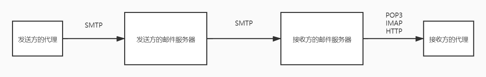
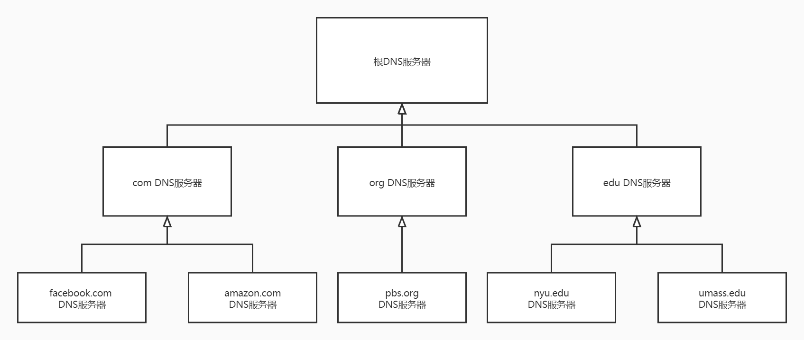

### 2.1 应用层协议原理

- 网络核心设备并不在应用层上起作用，而仅在较低层起作用，特别是在网络层及下面层次起作用，这种基本设计将应用软件限制在端系统对额方法，促进了大量网络应用程序的迅速开发和部署

#### 2.1.1 网络应用程序体系结构

- 从应用程序研发者角度看，网络体系结构是固定的，并为应用程序提供了特定的服务集合。应用程序体系结构由应用程序研发者规定了如何在各种端系统上组织该应用程序

- 网络应用程序的两种主流体系结构：

  1. 客户-服务器体系结构：总是有一个打开的主机称为服务器，其服务于来自许多其他称为客户的主机的请求，客户相互之间不直接通信。服务器具有固定的、周知的地址。

     在一个客户-服务器应用中，常常会出现一台单独的服务器主机跟不上它所有客户请求的情况，为此配备大量主机的数据中心常被用于创建强大的虚拟服务器。一个数据中心能够有数十万台服务器，它们必须要供电和维护，且服务提供商必须支付不断出现的互联和带宽费用以发送和接受到达和来自数据中心的数据

  2. 对等体系结构：应用程序在间断连接的主机对之间使用直接通信，这些主机对称为对等方，它们并不为服务提供商所有，却为用户控制的桌面机和膝上机所有。其最大的特性之一是自扩展性。其也是有成本效率的，它们通常不需要庞大的服务器基础设施和服务器带宽。未来P2P应用由于高度非集中式，面临安全性、性能和可靠性等挑战

#### 2.1.2 进程通信

- 进行通信的是进程而不是程序，一个进程可以被认为是运行在端系统中的一个程序、当多个进程运行在相同的端系统上时，他们使用进程间通信机制相互通信，进程间通信的规则由端系统上的操作系统确定。两个不同端系统上的进程通过跨越计算机网络交换报文相互通信
- 网络应用程序由成对的进程组成，这些进程通过网络相互发送报文。在一对进程之间的通信会话场景中，发起通信的进程被标识为客户，在会话开始时等待联系的进程是服务器
- 进程通过一个称为套接字的软件接口向网络发送报文和从网络接收报文。套接字是同一台主机内应用层与运输层之间的接口，由于该套接字是建立网络应用程序的可编程接口，因此套接字也称为应用程序和网络之间的应用程序编程接口
- 应用程序开发者可以控制套接字在应用层端的一切，但对于套接字的运输层几乎没有控制权，仅限于选择运输层协议、设定一些运输层参数
- 为标识接收进程，需要定义两个信息：
  1. 主机的地址，因特网中由IP进行标识
  2. 目的主机中接收进程的标识，即端口号

#### 2.1.3 可供应用程序使用的运输服务

- 应用程序的服务要求大体可分为四类：
  1. 可靠数据传输：一个协议提供确保由应用程序的一端发送的数据正确的、完全的交付给该应用程序的另一端。当一个运输层协议不提供可靠数据传输时，由发送进程发送的某些数据可能到达不了接收进程，这可能能被容忍丢失的应用所接收
  2. 吞吐量：运输层协议能以某种特定的速率提供确保的可用吞吐量。具有吞吐量要求的应用被称为带宽敏感应用，许多多媒体应用在该类中。弹性应用能够根据当前可用的带宽或多或少的利用可供使用的吞吐量，如电子邮件、文件传输等
  3. 定时：其有多种形式的实现，如保证到达接收方的时间不超过一定量。这对于交互式实时应用程序有吸引力力，对于非实时应用，较低的时延总比高的好，但对端到端的时延没有严格约束
  4. 安全性：运输协议能够为应用程序提供一种或多种安全性服务。如加密发送进程传输的数据并在接受进程解密、数据完整性等

#### 2.1.4 因特网提供的运输服务

- 因特网更一般的是TCP/IP网络，为应用程序提供了两个运输层协议UDP和TCP，每个协议为调用它们的应用程序提供了不同的服务集合

- TCP服务模型包括两个服务：

  1. 面向连接服务：在应用层数据报文开始流动之前，TCP让客户和服务器互相交换运输层控制信息，该握手过程提醒客户和服务器，让它们为大量分组的到来做好准备。握手阶段后会在两个进程间建立一条全双工的TCP连接，双方进程可以在此连接上同时进行报文收发，当应用程序结束报文发送时必须拆除该连接
  2. 可靠数据传输服务：依靠TCP，无差错、按适当顺序交付所有发送的数据

- TCP还具有拥塞控制机制，该服务不一定能为通信进程带来直接的好处，但能为因特网带来整体好处

- 无论是TCP还是UDP都没有提供任何加密机制，发送进程传进其套接字的数据与经网络专属到目的进程的数据相同。

- 因特网界已经研制了TCP的加强版本，称为安全套接字层（Secure Sockets Layer，SSL），用SSL加强后的TCP不仅能够做传统的TCP所能做的一切，且提供了关键的进程到进程的安全性服务，包括加密、数据完整性、端点鉴别。其对TCP的强化是在应用层上实现的，若一个应用程序要使用SSL服务，需要在该应用程序的客户端和服务器端包括SSL代码。

- SSL有自己的套接字API，当第一个应用使用SSL时，发送进程向SSL套接字传递明文数据，在发送主机中的SSL则加密该数据并将加密的数据传递给TCP套接字。加密的数据经过因特网传送到接收进程中的TCP套接字，该接收套接字将加密数据传递给SSL，由其进行解密，最后SSL通过它的SSL套接字将明文数据传递给接收进程

- UDP是一种不提供不必要服务的轻量级运输协议，仅提供最小服务。它是无连接的看因此在两个进程通信前没有握手过程，其提供一种不可靠数据传输服务，当进程将一个报文发送进UDP套接字时，并不保证该报文将到达接收进程，且UDP没有包括拥塞控制机制，所以UDP发送端可以用它选定的任何速率向下层注入数据，但实际端到端的吞吐量可能小于该速率，可能是因为中间链路的带宽受限或因为拥塞而造成的

- 目前的因特网运输协议并没有提供对吞吐量和定时保证，所以应用程序被设计成尽最大可能对付这种保证的缺乏

- 流行的因特网应用及其应用层协议和支撑的运输协议

  | 应用         | 应用层协议              | 支撑的运输协议 |
  | ------------ | ----------------------- | -------------- |
  | 电子邮件     | SMTP                    | TCP            |
  | 远程终端访问 | Telnet                  | TCP            |
  | Web          | HTTP                    | TCP            |
  | 文件传输     | FTP                     | TCP            |
  | 流式多媒体   | HTTP                    | TCP            |
  | 因特网电话   | SIP、RTP或专用的如Skype | UDP或TCP       |

#### 2.1.5 应用层协议

- 应用层协议定义了运行在不同端系统上的应用程序进程如何相互传递报文，其定义了：

  - 交换的报文类型
  - 各种报文类型的语法
  - 字段的语义，即这些字段中的信息的含义
  - 确定一个进程何时以及如何发送报文，对报文进行响应的规则

  有些应用层协议是由RFC文档定义的，位于公共域中，还有很多别的应用层协议是专用的，不为公共域使用

- 应用层协议只是网络应用的一部分

### 2.2 Web和HTTP

#### 2.2.1 HTTP概况

- Web的应用层协议是超文本传输协议（HyperText Transfer Protocol，HTTP），在RFC 1945和RFC 2616中进行了定义
- HTTP由客户程序和服务器程序实现，它们运行在不同的端系统中，通过交换HTTP报文进行会话，HTTP定义了这些报文结构以及客户和服务器进行报文交换的方式
- Web页面是由对象组成的，一个对象只是一个文件，且它们可以通过一个URL地址寻址。多数Web页面含有一个HTML基本文件和几个引用对象，每个URL地址由两部分组成：存放对象的服务器主机名和对象的路径名
- Web浏览器实现了HTTP的客户端，Web服务器实现了HTTP的服务端，用于存储Web对象，每个对象由URL寻址
- HTTP定义了Web客户端向Web服务器请求Web页面的方式以及服务器向客户传送Web页面的方式
- HTTP是一个而无状态协议，服务器向客户发送被请求的文件，而不存储任何关于该客户的状态信息

#### 2.2.2 非持续连接和持续连接

- 在许多因特网应用程序中，客户和服务器在一个相当长的时间范围内通信，其中客户发出一系列请求且服务器对每个请求进行响应。当客户服务器之间是用TCP进行传输的，需要决定使用以下哪种方式：

  1. 非持续连接：每个请求/响应对是经过一个单独的TCP连接发送的
  2. 持续连接：所有的请求及相应经相同的TCP连接发送

  HTTP既能使用非持续连接，也能够使用持续连接，默认为持续

- HTTP在非持续连接中，每个TCP连接在服务器发送一个对象后关闭，即该连接并不为其他的对象而持续下来，每个TCP连接只传输一个请求报文和一个响应报文

- 往返时间（Round-Trip Time，RTT）：一个短分组从客户端到服务器然后再返回客户所花费的时间，包括分组传播时延、分组在中间路由器和交换机上的排队时延、分组处理时延

- 非持续连接的缺点：

  1. 必须为每一个请求的对象建立和维护一个去哪性的连接，对每个这样的连接在客户和服务器中都要分配TCP的缓冲区和保持TCP变量，给Web服务器带来了严重的负担
  2. 每一个对象经受两倍RTT的交付时延，一个RTT用于创建TCP，另一个RTT用于请求和接受一个对象

- 在采用HTTP1.1持续连接情况下，服务器在发送响应后保持该TCP连接打开，在相同的客户与服务器之间，后续的请求和响应报文能够通过相同的连接进行传送，特别是一个完整的Web页面可以用单个持续TCP连接进行传送，甚至位于同一台服务器的多个Web页面在从该服务器发送给同一个客户时，可以在单个连续TCP上进行，对对象的请求可以一个接一个的发出而不必等待回答。一般来说若一条连接经过一定时间间隔仍未被使用，HTTP服务器就关闭连接

#### 2.2.3 HTTP报文格式

- HTTP报文有两种：请求报文和响应报文

- HTTP请求报文：

  - 请求行，包含方法字段、URL字段、HTTP版本字段。方法字段包括GET、POST、HEAD、PUT、DELETE。
    - 绝大部分的HTTP请求报文使用GET方法，此时URL字段带有请求对象的标识
    - 当用户提交表单的时候HTTP客户端通常使用POST请求
    - HEAD类似于GET方法，当服务器收到一个使用HEAD方法的请求时，将会用一个HTTP报文进行响应，但是并不返回请求对象，开发整常用该方法进行调试跟踪
    - PUT也被那些需要向Web服务器上传对象的应用程序使用
    - DELETE方法允许用户或应用程序删除Web服务器上的对象

  - 首部行：
    - Host：指明了对象所在主机，该首部行提供的信息是Web代理告诉缓存所要求的
    - Connection：高速服务器是否使用可持续连接，为close则使用非持续连接
    - User-agent：指明用户代理，即向服务器发送的浏览器的类型，通过该首部行服务器可以有效的为不同类型的用户代理发送相同的对象的不同版本
    - Accept-language：用户想要得到该对象的语言版本，若不存在该版本则发送默认版本
  - 实体体：使用GET方法时为空，使用POST方法时才使用该实体体。

- HTTP响应报文：

  - 状态行：包含协议版本字段、状态码、相应状态信息

    常见状态码：

    - 200 OK：请求成功，信息在返回的响应报文中
    - 301 Moved Permanently：请求的对象已经被永久转移了，新的URL定义在响应报文的Location首部行中，客户软件将自动获取新的URL
    - 400 Bad Request：通用差错代码，该请求不能被服务器解析
    - 404 Not Found：被请求的文档不在服务器上
    - 505 HTTP Version Not Supported：服务器不支持请求报文使用的HTTP协议版本

  - 首部行：

    - Connection：是否关闭该TCP连接
    - Date：指示服务器产生并发送该相应报文的日期和时间，该时间是服务器从文件系统中检索到该对象，将该对象插入响应报文，并发送该响应报文的时间
    - Server：指示该报文由什么服务器产生的
    - Last-Modified：只是对象创建或最后修改的日期和时间。对拥有代理服务器的十分重要
    - Content-Length：被发送对象中的字节数
    - Content-Type：实体体中的对象是什么类型的文本

  - 实体体：报文的主要部分，包含了所请求对象本身

#### 2.2.4 用户与服务器的交互：cookie

- HTTP使用了cookie允许沾点对用户进行跟踪，在RFC 6265中定义
- cookie技术有4个组件：
  1. 在HTTP响应报文中的一个cookie首部行
  2. 在HTTP请求报文中的一个cookie首部行
  3. 在用户端系统中保留有一个coolie文件，并由用户的浏览器进行管理
  4. 位于Web站点的一个后端数据库
- cookie可以用于标识一个用户，用户首次访问一个站点时，可能需要提供一个用户标识，在后继绘画中，浏览器向服务器传递一个cookie首部，从而向该服务器标识了用户，因此cookie可以在无状态的HTTP上建立一个用户会话层
- cookie的使用仍具有争议，认为它是对用户隐私的一种侵害

#### 2.2.5 Web缓存

- Web缓存器也叫代理服务器，是能够代表初始Web服务器来满足HTTP请求的网络实体，其拥有自己的磁盘存储空间，并在存储空间中保存最近请求过的对象的副本。
- 可以配置用户的浏览器，使得用户的所有HTTP请求首先指向Web缓存器，一旦某浏览器被配置，每个对某对象的浏览器请求首先被定向到该Web缓存器：
  1. 浏览器创建一个到Web缓存器的TCP连接，并向Web缓存器中的对象发送一个HTTP请求
  2. Web缓存器进行检查本地是否存储了该对象的副本，若有则Web缓存器就想客户浏览器用HTTP响应报文返回该对象
  3. 若Web缓存器中没有该对象，它就打开一个与该对象的初始服务器的TCP连接，Web缓存器则在这个缓存器到服务器的TCP连接上发送一个对该对象的HTTP请求，在收到该请求后，初始服务器向Web缓存器发送具有该对象的HTTP响应
  4. 当Web缓存器收到该对象时，它在本地存储空间存储一份副本，并向客户的浏览器用HTTP响应报文发送该副本
- 在因特网上不是Web缓存器有两个原因：
  1. 可以大大减少对客户请求的响应时间，特别是当客户与Web服务器之间有一个高速连接（常常如此），并且若用户所请求的对象在Web缓存器上，则Web缓存器可以迅速将该对象交付给用户。
  2. 其能大大减少一个机构的接入链路到因特网的通信量，就不必急于增加带宽，因此降低了费用。且能从整体上大大降低因特网上的Web流量，从而改善了所有应用的性能
- 通过使用内容分发网络（Content Distribution Network，CDN），Web缓存器正在因特网中发挥着越来越重要的作用，CDN公司在因特网上安装了许多地理上分散的缓存器，因而使大量流量实现本地化。有多个共享的CDN和专用的CDN

#### 2.2.6 条件GET方法

- 尽管高速缓存能减少用户感受到的响应时间，但存放在缓存器中的对象副本可能是陈旧的
- HTTP协议中有条件GET，允许缓存器证实它的对象是最新的。若请求报文使用GET方法，且其中包含一个If-Modified-Since首部行，则该HTTP报文就是一个条件GET请求报文
- 条件GET方法的操作：
  1. 一个代理缓存器代表一个请求浏览器向某Web服务器发送一个请求报文
  2. 该Web服务器向缓存器发送具有被请求的对象的响应报文，该响应报文中包含了Last-Modified首部行，存储了最后更新时间，代理服务器将该时间存储起来
  3. 代理服务器在适当时间向Web服务器发送条件GET语句，其中If-Modified-Since首部行的值等于上次存储的Last-Modified值，若Web服务器已经被更改了，则需要重新发送对象
  4. Web服务器发送一个响应报文，包含是否被修改的信息，其中不包含对象以免浪费带宽

### 2.3 因特网中的电子邮件

- 因特网电子邮件有三个主要组成部分：
  - 用户代理：允许用户阅读、回复、转发、保存和撰写报文
  - 邮件服务器：电子邮箱体系结构的核心，每个接收方在其中的某个邮件服务器上有一个邮箱，该邮箱管理和维护着发送给接收方的报文
  - 简单邮件传输协议（Simple Mail Trasfer Protocol，SMTP）：使用TCP可靠数据传输服务，其也包含两个部分，运行在发送方邮件服务器的客户端和运行在接受方邮件服务器的服务器端，每台邮件服务器上既运行SMTP的客户端也运行服务器端
- 一个典型的邮件发送过程是：从发送方的用户代理开始，传输到发送方的邮件服务器，再传输到接收方的邮件服务器，然后在这里被分发到接收方的邮箱中。当接收方在他的邮箱中读取该报文时，包含他邮箱的邮件服务器使用用户名和口令来鉴别接收者。发送这的邮箱也必须能够处理接受者的邮件服务器故障，若发送者不能将邮件交付给接收者的服务器，则发送者的服务器在一个报文队列中保持该报文并在以后尝试再次发送，通常每30分钟进行一次尝试，若几天后仍不能成功，服务器就删除该报文并以电子邮件的形式通知发送方
- SMTP是因特网电子邮件中主要的应用层协议，使用TCP可靠数据传输服务，其有两个部分：运行在发送方邮件服务器的客户端和运行在接收方邮件服务器的服务器端，每台邮件服务器上及运行SMTP的客户端也运行SMTP的服务器端

#### 2.3.1 SMTP

- RFC5321给出了SMTP的定义
- SMTP是因特网电子邮件的核心，其问世时间比HTTP要长的多，尽管电子邮件应用在因特网上的独特地位可以证明SMTP有着众多非常出色的性质，但所具有的某些陈旧特征表明它仍然是一种继承的技术。如限制所有邮件报文体部分只能采用简单的7bit的ASCII表示，这在以前的年代限制是合理的，但在今天多媒体时代，用SMTP传送邮件之前需要把二进制的媒体数据编码为ASCII码，并在使用SMTP传输后要将相应的ASCII码邮件还原为多媒体数据
- SMTP一般不使用中间邮件服务器发送邮件，不论这两个服务器的距离多远，若接收方邮件服务器没有开机，则该邮件停留在发送方的服务器上并等待新的尝试
- SMTP交互方式：首先客户SMTP在25号端口建立一个到服务器SMTP的TCP连接，若服务器没有开机客户会在稍后继续尝试。一旦连接简历，服务器和客户会执行某些应用层的握手，SMTP客户指示发送方的邮件地址和接收方的邮件地址。一旦该SMTP客户和服务器彼此介绍完之后，客户发送该报文。SMTP能依赖TCP提供的可靠数据传输无差错的将邮件投递到接收服务器。该客户如果有另外的报文要发送到该服务器，就在该相同的TCP连接上重复这种处理，否则指示TCP关闭连接。即SMTP用的持续连接，若发送邮件服务器有几个报文发往同一个接收邮件服务器，就可以通过同一个TCP连接发送这些所有的报文

#### 2.3.2 与HTTP的对比

- 相同点：

  - 都用于从一台主机向另一台主机传送文件：HTTP从Web服务器向Web客户传送文件，SMTP从一个邮件服务器向另一个邮件服务器
  - 进行文件传送时，持续的HTTP和SMTP都使用持续连接

- 不同点：

  - HTTP主要是一个拉协议，在方便的时候某些人在Web服务器上装载信息，用户使用HTTP从该服务器拉取这些信息，特别是TCP连接是由想接收文件的机器发起的

    SMTP基本上是一个推协议，发送邮件服务器把邮件推向接收邮件服务器，特别是该TCP连接是由发送该文件的机器发起的

  - SMTP要求每个报文采用7bit的ASCII码格式，若某报文包含饿了非7bit的ASCII字符或二进制数据，则该表文必须按照ASCII码编码

    HTTP数据不受该限制

  - 处理一个既包含文本又包含图形的文档，HTTP把每个对象封装到它自己的HTTP响应报文中

    SMTP将所有报文对象放在一个报文中

#### 2.3.3 邮件报文格式

- 包含环境信息的首部位于报文体前面，这些环境信息包括在一系列首部行中，这些行由RFC 5322定义。首部行和该报文的体用空行进行分隔，报文体以ASCII格式表示。每个首部行包含了可读的文本，由关键词后跟冒号和它的值组成，某些关键词是必须的，某些是可选的。每个首部行必须含有一个From:首部行和一个To:首部行，也需还会包含一个Subject:首部行和其他可选的首部行

#### 2.3.4 邮件访问协议

- 一直到20世纪90年代，标准的方式是接收方登录到服务器主机，然后直接在该主机上运行一个邮件阅读程序来阅读他的邮件

- 现今邮件访问使用了一种CS体系结构，用户通过在用户端系统上运行客户程序来阅读电子邮件，可以享受一系列丰富的特性，包括查看多媒体报文和附件。

- 若在本地PC上运行客户代理程序并在本地防止一个邮件服务器，发送方的邮件服务器就能直接和接收方的PC通信，但该方法的问题是，为了及时接受任何时候到达的新邮件，接收方的PC必须不间断的运行并保持在线，这对许多英特网用户都是不现实的。所以典型的用户通常在本地PC运行一个用户代理程序且它访问存储在总是保持开机的共享邮件服务器上的邮箱，该邮箱服务器与其他用户共享并且通常由用户的ISP进行维护

- 

  SMTP被设计成将电子邮件从一台主机推到另一台主机，通常发送方的用户代理和接收方的邮件服务器之间没有一个直接的SMTP对话，若发送方的用户代理用SMTP将电子邮件报文推入发送方邮件服务器，接着发送方邮件服务器作为客户再使用SMTP将邮件中继到接收方的邮件服务器，若不使用发送方的邮件服务器进行中继，那么发送方的用户代理将没有任何办法到达一个不可达的目的地接受服务器，通过将邮件放在自己的邮件服务器中可以重复尝试向接收方邮件服务器发送该报文。SMTP RFC文档定义了如何使用SMTP命令经过多个SMTP服务器进行报文中继

  接收方的用户代理也不能使用SMTP得到报文，因为取报文是一个拉操作，而SMTP是一个推协议，所以通过引入一个特殊的邮件访问协议解决该问题，该协议将接受方邮件服务器上的报文传送给接收方的用户代理。目前一些流行的邮件访问协议：第三版的邮局协议（Post Office Protocol-Version3，POP3）、英特网邮件访问协议（Internet Mail Access Protocol，IMAP）、HTTP

- POP3：由RFC 1939进行定义，该协议非常简单功能也相当有限。当用户代理打开了一个到邮件服务器端口110上的TCP连接后，该协议就开始工作了。期分为三个阶段进行工作：

  1. 特许：用户代理以明文形式发送用户名和口令以鉴别用户。主要有user \<user name\> 和 pass \< password \> 两个命令。

  2. 事务处理：用户代理取回报文，同时在该阶段用户代理还能对报文做删除标记、取消删除标记、获取邮件统计信息等操作。用户代理发出一些命令，服务器对每个命令做出回答：+OK（有时后跟有服务器到客户的数据）指示前面的命令是正常的，-ERR指示前面的命令出现了某些差错。

     用户代理经常被用户配置为“下载并删除”或“下载并保留”的方式，用户代理发出的命令序列取决于这两种工作方式。若使用前者，则会发出list、retr和dele命令，其存在的问题是邮箱接收方可能是移动的，希望从不同的主机上都能访问到他的邮件豹纹，下载并删除方式会对接收者的邮件报文根据不同机器进行划分，若接受者现在其他地方接受了该消息则不能再接收。若使用后者，用户代理下载某邮件后该邮件仍保留在邮件服务器上

  3. 更新：在客户发出quit命令后，结束POP3会话，且邮件服务器删除那些被标记为删除的报文

  在用户代理与邮件服务器之间的POP3会话期间，该POP3服务器保留了一些状态信息，特别是记录了哪些用户报文被标记为删除了，但POP3服务器并不在POP3会话过程中携带状态信息，这大大简化了POP3服务的实现

  使用POP3访问时，一旦接收方将邮件下载到本地主机后，就能建立邮件文件夹，并将下载的邮件放入该文件夹中，接收方可以删除报文、在文件夹之间移动报文、查询报文。但对于移动用户来说，更喜欢使用一个在远程服务器上的层次文件夹，这样就可以从任何一台机器上对所有报文进行访问，但POP3协议没有给用户提供任何创建远程文件夹并为报文指派文件夹的方法

- IMAP：由RFC 3501进行定义，其比POP3更具有特色但比POP3复杂的多。IMAP把每个报文与一个文件夹联系起来，当报文第一次到达服务器时，它与收件人的INBOX文件夹相关联，收件人则能够把邮件移到一个新的、用户创建的文件夹中阅读邮件、删除邮件等。IMAP协议为用户提供了创建文件夹、将邮件从一个文件夹移动到另一个文件夹、在远程文件夹中查询邮件的命令，按指定条件去查询匹配的邮件，且与POP3不同，IMAP服务器维护了IMAP会话的用户状态信息。其另一个重要特性是它具有允许用户代理获取报文某些部分的命令，当用户代理和其邮件服务器之间使用低带宽连接，用户可能并不想取回他邮箱中的所有邮件，尤其是包含媒体文件的大邮件

- 基于Web的电子邮件，用户代理就是普通的浏览器，用户和他的远程邮箱之间通信通过HTTP进行。当一个收件人想从邮箱中访问一个报文时，该电子邮件从接收者邮件服务器发送到他的浏览器，使用的是HTTP协议，当发件人要发送一封电子邮件到他的邮件服务器上使用HTTP协议，但发送者邮件服务器到接收这邮件服务器之间仍使用SMTP

### 2.4 DNS：因特网的目录服务

- 主机的一种标识方法是使用主机名，其便于记忆和容易被人们接受，但主机名几乎没有提供关于主机在因特网中的位置信息，且因为主机名可能由不定长的字母数字组成路由器很难处理。主机的另一种标识方法是IP地址

#### 2.4.1 DNS提供的服务

- 人们喜欢便于记忆的主机名表示方式，路由器则喜欢定长的、有着层次结构的IP地址，所以需要中医能进行主机名到IP地址转换的目录服务

- 域名系统（Domain Name System，DNS）：

  - 由分层的DNS服务器实现的分布式数据库
  - 使主机能够查询分布式数据库的应用层协议

  其运行在UDP上，使用53号端口

- DNS服务器通常是运行BIND（Berkeley Internet Name Domain）软件的UNIX机器

- DNS协议是应用层协议，原因是：

  - 使用CS模型运行在通信的端系统之间
  - 在通信的端系统之间使用端到端的运输协议（如HTTP、SMTP、FTP）来传送DNS报文

  与其他应用程序不同点是，DNS不是一个直接和用户打交道的应用，它是为因特网上的用户应用程序以及其他软件提供一种核心功能，即将主机名转换为其背后的IP地址

- DNS会给使用它的因特网引用带来额外的时延，有时时延还比较长。但想获得的IP地址通常缓存在一个比较近的DNS服务器中，有助于减少DNS的网络流量和DNS的平均时延

- DNS提供的一些其他重要服务：

  - 主机别名。有着复杂主机名的主机能拥有一个或多个别名，原本的名字称为规范主机名，主机别名一般比规范主机名更加容易记忆。应用程序可以调用DNS来获得主机别名对应的规范主机名以及主机的IP地址
  - 邮件服务器别名。人们也希望电子邮件地址容易记忆，所以可以让电子邮件中的规范主机名使用主机别名替代，那么电子邮件应用程序可以调用DNS对提供的主机别名进行解析。实际上MX记录允许一个公司的邮件服务器和Web服务器使用相同的主机别名
  - 负载分配。DNS可以用于在冗余的服务器之间进行负载分配。繁忙的站点被冗余分布在多台服务器上，每台服务器均运行在不同的端系统上，每个都有着不同的IP地址，所以一个IP地址集合和一个规范主机名联系。DNS数据库中存储着这些IP地址集合，当客户对映射到某地址集合的名字发出一个DNS请求时，该服务器用IP地址的整个集合进行响应，但在每个回答中循环这次地址次序。因为客户通常总是向IP地址排在前面的服务器发送HTTP请求报文，所以DNS就在所有这些冗余的Web服务器之间循环分配了负载。DNS的循环同样可以用于邮件服务器，所以多个邮件服务器可以具有相同的别名

- DNS由RFC 1034和RFC1035定义，并在几个附加的RFC中进行更新。DNS是一个复杂的系统，只是对几个主要方面进行学习

#### 2.4.2 DNS工作机理概述

- 运行在用户主机上的某些应用程序需要将主机名转换为IP地址，就会调用DNS的客户端并指明需要被转换的主机名，用户主机上的DNS接收到后向网络中发送一个DNS查询报文，所有的DNS请求和回答报文都是用UDP数据报经端口53发送，经过若毫秒到若干秒的延迟之后用户上的DNS接收到一个提供所希望映射的DNS回答报文，该结果传递给调用DNS的应用程序。所以从用户主机上的应用程序角度看，DNS是一个提供简单、直接的转换服务的黑盒子。事实上实现这个服务的黑盒子非常复杂，由分布于全球的大量DNS服务器以及定义了DNS服务器与查询主机通信方式的应用层协议组成

- DNS的一种简单设计是因特网上只使用一个DNS服务器，该服务器包含所有的映射，客户直接将所有查询发送到单一的DNS服务器，同时该DNS服务器直接对所有的查询客户做出响应。

  该设计的问题：

  - 单点故障：若该DNS服务器崩溃，整个因特网随之瘫痪
  - 通信容量：单个DNS服务器不得不处理所有的DNS查询
  - 远距离的集中式数据库：单个DNS服务器不可能对所有客户都是“邻近”的
  - 维护：单个DNS服务器将不得不为所有的因特网主机保留记录，这会中央数据库变的庞大，且不得不为解决每个新添加的主机而频繁更新

  这种设计没有任何扩展能力

- 为了处理扩展性问题，DNS使用了大量的DNS服务器，以层次方式组织并分布在全世界范围内，没有一台DNS服务器拥有因特网上所有主机的映射，这些映射分布在所有的DNS上。大致来说有三类DNS服务器：

  - 根DNS服务器：提供TLD服务器的IP地址。有400个根DNS服务器分布在全世界，它们由13个不同的组织管理。根DNS服务器的全部清单连同管理它们的组织及其IP地址可以在[Root Servers 2016] 中找到。
  - 顶级域（Top-Level Domain，TLD）DNS服务器：提供权威DNS服务器的IP地址。对于每个顶级域（如com、org、net、edu、gov）和所有国家顶级域（如uk、cn）都有TLD服务器或服务器集群。所有顶级域的列表参见 [TLD list 2016]
  - 权威DNS服务器：在因特网上具有公共可访问主机的每个组织机构必须提供公共可访问的DNS记录，这些记录将这些主机名字映射为IP地址。一个组织机构的权威DNS服务器收藏了这些DNS记录。组织可以自己实现权威DNS服务器以保存这些记录，或支付奋勇让这些记录存储在某个服务提供商的一个权威DNS服务器中。多数大学和大公司实现和维护它们自己基本和辅助备份的权威DNS服务器

  

  客户首先会和根服务器之一联系，其返回顶级域名的TLD服务器的IP地址，然后客户和TLD服务器之一联系，然后会返回对应权威服务器的IP地址，最后客户和权威服务器的IP地址联系，其为主机名返回IP地址

- 还有另一个重要的DNS服务器称为本地DNS服务器，严格说该服务器不属于DNS服务器的层次结构，但对于层次结构是至关重要的。当主机发出DNS请求时该请求发往本地DNS服务器，而本地DNS服务器起代理作用将请求转发到DNS服务器层次结构中。每个ISP都有一台本地DNS服务器，当主机与某个ISP连接时，该ISP提供一台主机的IP地址，该主机具有一台或多台其本地DNS服务器的IP地址，通过访问Windows或UNIX网络状态窗口，用户能够容易的确定他的本地DNS服务器的IP地址。主机的本地DNS服务器通常和主机“邻近”，对某机构ISP而言它们可能就在同一个局域网中，对于更小的ISP来说它们之间相隔不超过几台路由器。

  递归查询：以自己的名义请求别人帮忙获得映射。

  迭代查询：直接向对应DNS服务器请求映射。

  从理论上任何讲任何DNS服务器查询既可以是递归的也可以是迭代的。但实践中从请求主机到本地DNS服务器的查询是递归的，从本地DNS服务器到层次结构服务器是迭代的

- 为了改善时延性能并减少在因特网上到处传输的DNS报文数量，DNS广泛采用了缓存技术。其原理是，在一个请求链中当某DNS服务器接收一个DNS回答时，它能将映射缓存在本地存储器中，这样另一个对相同主机名的查询到达该DNS服务器时，该DNS服务器就能够提供所要求的IP地址，即使它不是该主机名的权威服务器。由于主机和主机名与IP地址间的映射并不是永久的，DNS服务器在一段时间后（通常设置为两天）将丢弃缓存信息

#### 2.4.3 DNS记录和报文

- 共同实现DNS分布式数据库的所有DNS服务器存储了资源文件（Resource Record，RR），RR提供了主机名到IP地址的映射，每个DNS回答报文包含了一条或多条资源记录。资源记录是一个包含了4个字段的四元组：(Name, Value, Type, TTL)

  - TLL是该记录的生存时间，决定了资源记录应当从缓存中删除的时间
  - Name和Value的值取决于Type：
    - 若Type=A。Name为主机名，Value是主机名对应的IP地址。即A类型的资源记录提供了标准的主机名到IP地址映射
    - 若Type=NS。Name是域，Value是知道如何获得该域中主机IP地址的权威DNS服务器的主机名。即NS类型的资源记录用于沿着查询链来路由DNS查询
    - 若Type=CNAME。Name是别名，Value是对应的规范主机名。即CNAME类型的资源记录能够查询一个别名对应的规范主机名
    - 若Type=MX。Name是邮件服务器别名，Value是对应的邮件服务器的规范主机名。即MX类型的资源记录能获取邮箱别名。通过使用该记录可以让邮件服务器和其他服务器使用相同的别名，若要获取邮件的就是用MX，其他的就使用CNAME

  若一台DNS服务器是用于某特定主机名的权威DNS服务器，则该DNS服务器会有一条包含用于该主机名的A类型记录，但即使不是权威服务器也可能在缓存中包含该主机名的A类型记录。若服务器不是用于某主机名的权威服务器，那么该服务器将包含一条NS类型记录以及一条A类型记录，其提供了在NS记录中权威DNS服务器的IP地址

- DNS报文格式：

  - 前12个字节是首部区域，包含几个字段：

    1. 标识符，16bit的数，用于标识该查询，这个标识符会被复制到对查询的回答报文中以便让客户用它来匹配发送的请求和接收到的回答。

       标志位中包含若干标志：

       - 1bit查询/回答标志位，0代表查询，1代表回答
       - 1bit权威标志位，1代表是该请求名字的权威服务器
       - 1bit希望递归标志位，1代表希望递归查询。若该DNS服务器支持递归查询，则回答报文中会包含1bit的递归可用标志设置位
       - 还有4个有关数量的字段，包括问题数、回答RR数、权威RR数、附加RR数，指出了首部后面4类数据区域出现的数量

  - 问题区域，包含正在进行的查询信息，该区域包括：

    - 名字字段，正在被查询的主机名字
    - 类型字段，有关该名字正被询问的问题类型

  - 回答区域，包含对最初请求的名字的资源记录。包含了Type（A、NS、CNAME、MX）、Value和TLL字段。在该区域中可以包含多条RR，因此一个主机名能有多个IP地址

  - 权威区域，包含了其他权威服务器的记录

  - 附加区域，包含了其他有帮助的记录

- 记录进入数据库的流程：

  首先在注册登记机构注册域名，注册登记机构是一个商业实体，它验证该域名的唯一性，将该域名输入DNS数据库，对提供的服务收取少量费用。1999年前唯一的注册登记机构是Nework Solution，他独家运营对于com、net、org域名的注册。现在有许多注册登记机构竞争客户，因特网名字和地址分配机构（Internet  Corporation for Assigned Names and Numbers，ICANN）向各种注册登记机构授权

  当向某些注册登记机构注册域名时，需要向该机构提供基本和服务权威DNS服务器的名字和IP地址，对每个权威DNS服务器，注册登记机构确保将一个类型NS和一个类型A的记录输入TLD服务器。还必须确保用于Web服务器的类型A资源记录以及用于邮件服务器的类型MX资源记录被输入到权威DNS服务器中，在很长一段时间，每台DNS服务器中的内容都是静态配置的，最近DNS协议中天界了一个更新选项，允许通过DNS报文对数据库中的内容进行动态添加或删除

- DNS的安全性：

  - 分布式拒绝服务（DDoS）带宽洪泛攻击：国籍者向每个DNS根服务器发送大量分组使大多数合法DNS请求得不到回答。但许多的DNS根服务器受到了分组过滤器的保护，配置的分组过滤器阻挡了所有指向根服务器的ICMP ping报文，且大多数本地DNS服务器缓存了顶级域名服务器的IP地址，使得这些请求过程通常绕过了DNS根服务器。

    对DNS的潜在更有效的DDoS攻击是向顶级域名服务器发送大量DNS请求，过滤指向DNS服务器的DNS请求将更困难，且顶级域名服务器不像根服务器那样容易绕过，但该攻击的严重性可通过本地DNS服务器中的缓存技术进行缓解

  - 中间人攻击：攻击者截获来自主机的请求并返回伪造的回答

  - DNS毒害攻击：向一台DNS服务器发送伪造的回答，诱使服务器在它的缓存中接收伪造的记录

  这些攻击都难以实现，因为它们要求截获分组或遏制住服务器。DNS自身已经显示了对抗攻击的健壮性，至今为止还没有一个攻击成功的妨碍了DNS服务

### 2.5 P2P文件分发

- 一个非常自然的P2P应用，从单一服务器向大量主机分发一个大文件。在CS架构文件分发中，该服务器必须向每个对等方发送该文件的一个副本，即服务器承受了极大的负担并且消耗了大量的服务器带宽。在P2P架构文件分发中，每个对等方能够向其他任何对等方重新分发它已经收到的该文件的任何部分，从而在分发过程中协助该服务器。至2016年为止最流行的P2P文件分发协议是BitTorrent

- 服务器和对等方使用接入链路与因特网相连，us表示服务器接入链路的上载速率，ui表示第i个对等方的上载速率，di表示了第i对等方接入链路的下载速率。F表示被分发的文件长度，N表示要获得文件副本的对等方数量。分发时间是所有N个对等方得到该文件的副本所需要的时间。假设因特网核心具有足够的带宽，服务器和客户端没有参与任何网络应用，它们的上传和下载访问带宽能被全部用于分发该文件

  CS体系结构：

  - 服务器必须向N个对等方的传输该文件的副本，因此该服务器必须传输NF比特，且服务器上载熟虑是us，所以分发该文件的时间至少为NF/us
  - dmin表示具有对等方中的最小下载速率，即dmin = min{d1, d2, ..., dN}。最小效率对应的主机是所有对等方中需要时间最长的，即分发时间至少为F/dmin

  所以文件分发时间 >= max{NF/us, F/dmin}，分发时间随N数量线性增加，且没有上界

  P2P体系架构：

  - 分发开始时只有服务器具有文件，为了让对等方收到文件，服务器必须经其接入链路至少发送该文件的每个比特一次，所以分发时间至少为F/us
  - 具有最低下载速率的对等方获得文件的时间至少为F/dmin
  - 系统整体的上载能能力等于服务器的上载速率加上每个对等方的上载速率，即utotal=us + u1 + ... + uN，系统必须为N个对等方分发文件即总共NF比特，所以分发时间至少为NF/utotal

  所以文件分发时间 >= max{F/us, F/dmin, NF/utotal}，最小分发时间小于CS架构且有上界。

  所以具有P2P体系结构的应用程序能够是自扩展的，因为对等方除了是比特的消费者还是重新分发者

- BitTorrent：一种用于文件分发的流行P2P协议，其将参与一个特定文件分发的所有对等方集合称作洪流，在一个洪流中对等方彼此下载等长度的文件块。当一个对等方首次加入一个洪流时它没有块，随着时间的流逝积累了越来越多的块，当它下载块时也为其他对等方上传了多个块。一旦某对等方获得了整个文件，它可以离开洪流或留在洪流继续向其他对等方上传块。任何对等方可能在任何时候仅具有块的子集就离开洪流，并在以后重新加入洪流

  每个洪流具有一个基础设施节点称为追踪器，当一个对等方加入洪流时向追踪器注册自己，并周期性的通知追踪器它仍在该洪流中。当一个新对等方加入洪流时，追踪器随机的从参与对等方的集合中选择一个子集，并将这些对等方的IP地址发送给新对等方。此时新对等方持有该列表并试图和列表上的所有对等方创建并行的TPC连接，称成功建立TCP连接的对等方为邻近对等方。随时间流逝列表中的对等方某些可能离开，其他对等方可能试图和该对等方建立TCP连接，所以一个对等方的邻近对等方将随时间而波动

  任何给定时间内每个对等方将具有来自需要接收的文件的块的子集，且不同的对等方具有不同的子集。一个对等方会周期性的经TCP连接询问每个对等方它们所具有的的块列表，有了该列表就可以通过TCP请求他还没有块。所以需要有两个决策：

  1. 对等方从邻居那请求哪些块：最稀缺优先技术。针对它没有的块在邻居中决定最稀缺的块并首先请求这些块，这样最稀缺的块可以得到更为迅速的重新分发，可以大致均衡每个块在洪流中的副本数量。
  2. 对等方应当向哪些请求的邻居发送块：根据当前能够以最高速率向该对等方提供数据的邻居给出其优先权，其对于每个都持续的测量收到比特的速率并确定以最高速率流入的n个邻居，BitTorrent称这n个为疏通，每过一段时间对等方会重新计算速率并修改这n大小的集合，除了该集合中的其他邻居都无法从该对等方接收任何块。每过一段时间会随机选择另一个邻居并向其发送块，当该对等方向邻居发送块时，该对方就可能成为邻居疏通集合的一员，那么邻居就有可能向该对等方发送数据。这种效果是对等方能够以趋向于找到彼此协调的速率上载。该交换机制称为常被称为一报还一报

  BitTorrent还具有的有趣的机制：片小块、流水线、随机优先选择、残局模型、反怠慢

- 分布式散列表（DHT），P2P应用。其是一种简单的数据库，数据库记录分布在一个P2P系统的多个对等方上

### 2.6 视频流和内容分发网

#### 2.6.1 因特网视频

- 在流式存储视频应用中，基础的媒体是预先录制的视频，它们被放置在服务器上，用户按需像这些服务器发送请求来观看视频
- 视频是一系列的图像，通常以一种恒定的速率来展现。一副未压缩、数字编码的图像由像素阵列组成，其中每个像素是由一些比特编码来表示亮度和颜色。视频的一个重要特征是能被压缩，因此可用比特率来权衡视频质量，现今的压缩算法能将一个视频压缩成所希望的任何比特率
- 从网络观点看，视频最突出的特征是它的高比特率，对流式视频的最为重要的性能度量是平均端到端吞吐量，为了提供连续不断的布局，网络必须为流式应用提供平均吞吐量，该流式应用至少与压缩视频的比特率一样大
- 可以使用压缩是生成相同视频的多个版本，每个版本有不同的质量等级，用户能根据当前可用带宽决定观看哪个版本

#### 2.6.2 HTTP流和DASH

- HTTP流中视频只是存储在HTTP服务器中的一个普通文件，每个文件有特定的URL。当用户观看该视频，客户与服务器创建一个TCP连接并发送对该URL的HTTP GET请求，服务器则以底层网络协议和流量条件的允许的尽可能快的速率，在一个HTTP响应报文中发送该视频文件。在客户端，这些字节被收集在客户应用的缓存中，一旦缓存中的字节数量超过预先设定的门限，客户应用程序就开始播放，流式视频应用程序周期性的从客户应用程序缓存中抓取帧，对这些帧解压缩并在用户屏幕上展现。因此流式视频应用接收到视频就进行播放，同时缓存该视频后面部分的帧

- HTTP流的缺陷：所有客户接收到相同编码的视频，尽管对不同的客户或对于相同客户的不同时间而言，客户可用的带宽大小有很大的不同

- 经HTTP的动态适应流（Dynamic Adaptive Streaming over HTTP，DASH），在DASH中，视频编码为几个不同的版本，其中每个版本具有不同的比特率对应于不同的质量水平，客户动态的请求来自不同版本且长度为几秒的视频段数据块。当可用带宽量较高时，客户自然的选择来自高速率版本的块，当可用带宽量较低时，客户自然你的选择来自速率版本的块，客户用HTTP GET请求报文一次选择一个不同的块

  DASH允许客户使用不同的以太网接入速率流式播放具有不同编码速率的视频，若端到端带宽在会话过程中改变的话，DASH允许客户适应可用带宽。每个视频版本存储在HTTP服务器中，每个版本都有一个URL及其比特率。HTTP服务器也有一个告示文件，为每个版本提供一个URL及其比特率。客户首先请求该告示文件并且得知各种各样的版本，然后客户通过在HTTP GET请求报文中对每块指定一个URL和一个字节范围，一次选择一块。在下载块的同时客户也测量接收带宽并运行一个速率决定算法来选择下次请求的块以便用户根据当前网络对版本做出选择

#### 2.6.3 内容分发网

- 体用流式视频服务最为直接的方法是建立单一的大规模数据中心，在数据中心中存储其所有视频，并直接从该数据中心向世界范围的客户传送流式视频。但存在三个问题：

  1. 若客户远离数据中心，服务器到客户的分组将跨越许多通信链路并可能通过许多ISP，其中某些ISP可能位于不同的大洲。若这些链路提供的吞吐量小于视频消耗速率，端到端吞吐量也将小于该消耗速率，给用户带来严重的停滞时延
  2. 流行的视频可能经过相同的通信链路发送很多次，不仅了浪费了网络带宽，因特网视频公司自己也将为向因特网反复发送相同的字节而向其ISP运营商支付费用
  3. 单点故障，若数据中心或其通向因特网的链路崩溃，它将不能分发任何视频流

- 为了应对向分布于全世界的用户分发巨量视频数据的挑战，几乎所有主要的视频流公司都利用内容分发网（Content Distribution Network，CDN）。CDN管理分布在多个地理位置上的服务器，在它的服务器中存储视频和其他类型的Web内容副本，并且所有试图将每个用户请求定向到一个将提供最好的用户提亚你的CND位置。CDN可以是专用CDN，由内容提供商自己拥有，或是第三方CDN，其代表多个内容提供上分发内容

- 为了支持巨量云服务阵列，骨骼已经部署了一个广泛的专用网和CDN基础设施，其CDN基础设施具有三个等级的服务器集群：

  1. 14个“百万数据中心”，负责服务于动态的且经常是个性化的内容，包括搜索结果和Gmail报文
  2. IXP中大约50个集群分布于全球，每个集群由100-500台服务器组成，其负责静态内容，包括youtube视频
  3. 数以百计的“深入”集群位于一个接入ISP中，该集群通常由位于一个机架上的数十台服务器组成，其执行TCP分岔并服务于静态内容，包括体现搜索结果的Web网页的静态部分

  所有这些数据中心和集群位置与谷歌字节的专用网连接在一起。当用户进行搜索请求时，该请求常常先经过本地ISP发送到邻近的“深入服务器”缓存中，在这里检索静态内容，同时将该静态内容提供给客户，邻近的缓存也经谷歌的专用网将请求转发给“大型数据中心”，从这里检索个性化的搜索结果。总的来说除了本地ISP，谷歌云服务在很大程度上是由独立于公共因特网的网络基础设施提供的

- CND通常采用两种不同的服务器安置原则：

  - 深入。由Akamai首创，通过在遍及全球的接入ISP中部署服务器集群来深入到ISP的接入网中。Akamai在大约1700个位置采用该方法部署集群，目标是靠近端用户减少端用户和CND集群之间链路和路由器数量，从而改善用户感受的时延和吞吐量。但维护和管理集群的任务称为挑战
  - 邀请做客。由Limelight和许多其他CDN公司采用。通过少量关节位置建造大集群来邀请到ISP做客，不是将集群放在接入ISP中，这些CDN通常将它们的集群放置在因特网交换点（IXP）。其产生较低的维护和管理开销，可能以对端用户的较高时延和较低吞吐量为代价

  一旦CDN的集群准备就绪，就可以跨集群赋值内容，CDN可能不希望将每个视频的副本放置在每个集群中，因为某些视频很少观看或仅在某些国家中流行。事实上许多CDN没有将视频推入它们的集群，而是使用一种简单的拉策略，若客户向一个未存储该视频的集群请求某视频，则该集群检索该视频，向客户流式传输视频的同时在本地存储一个副本，当某集群存储器变满时删除不经常请求的视频

- 当用户主机中的一个浏览器指令检索一个特定的视频（由URL标识）时，CDN必须截获该请求，以便能确定此时适用于该用户的CDN服务器集群，和将客户的请求重定向到该集群的某台服务器。大多数CDN利用DNS来截获和重定向请求：

  1. 用户访问Web网页
  2. 当用户点击网页中视频链接时就会发送一个视频的DNS请求
  3. 用户的本地DNS将该DNS请求中继到一台用于该Web网页的权威DNS服务器，该服务器观察到主机名中标识视频的相关字符串，然后该权威DNS服务器返回一个该域的主机名
  4. 从这时起DNS请求进入了专用的DNS基础设施，用户本地DNS发送第二个请求，此时是对该域的主机DNS请求，DNS系统最终向本地DNS返回内容服务器的IP地址，此时指定了CND服务器，客户能从这台服务器接收到它的内容
  5. 本地DNS向主机转发内容服务CDN节点的IP地址
  6. 一旦客户收到内容服务器的IP地址，它具有该IP地址的服务器创建了一条直接的TCP连接，并且对该视频发出的HTTP GET请求。若使用了DASH，服务器将首先向客户发送具有URL列表的告示文件，每个URL对应视频的每个版本，且客户将动态选择来自不同版本的块

- CDN部署的核心是集群选择策略，即动态的将客户定向到CDN中某个服务器集群或数据中心的机制：

  - 一种简单策略是指派客户到地理上最邻近的集群，使用商用地理位置数据库，每个本地DNS IP地址都映射到一个地理位置，当一个特殊的本地DNS接收到一个DNS请求时，CDN选择地理上最为接近的集群。这样的解决方案对众多用户能工作的很好，但对于某些客户，该解决方案执行效果差，因为网络路径长度或跳数而言，地理最临近的集群可能并不是最近的集群，且所有基于DNS的方法都内在具有的问题是某些端用户配置使用位域远地的本地DNS，该情况下本地DNS位置可能远离客户的位置，该简单策略忽略了时延和可用带宽随因特网路径时间而变化，总是为特定用户指派相同的集群
  - 为基于当前流量条件为客户决定最好的集群，CDN能够对其集群和客户之间的时延和丢包性能执行周期性的实时测量，如CDN让它的每个集群周期性的向位于全世界的所有本地DNS发送探测分组，缺点是许多本地DNS被配置为不会响应这种探测

#### 2.6.4 学习案例：Netflix、YouTube、看看

- Netflix：其视频分发具有两个主要部件，亚马逊云和自己专用CDN基础设施

  其有个一个Web网站来处理若干功能，包括注册、登录、计费、浏览和搜索的电影目录、电影推荐系统。该Web网站以及关联的后端数据库完全运行在亚马逊云中的亚马逊服务器上，且亚马逊云处理下列关键功能：

  - 内容提取：在Netflix能够向它的用户分发某电影之前，必须首先获取和处理该电影。Netflix接收制片厂电影的母带且将其上载到亚马逊云的主机上
  - 内容处理：亚马逊云中的机器为每部电影生成许多不同格式，以适合在桌面计算机、智能手机、与电视机相连的游戏机上运行的不同类型的客户视频播放器。为每种格式和比特率都生成一种不同的版本，允许使用DASH经HTTP适应性播放流
  - 向其CDN上载版本：一旦某电影的所有版本均已生成，在亚马逊云中的主机向其CDN上载这些版本

  当Netflix在 2007 奶奶首次退出视频流式服务时，雇佣了三个第三方CDN公司来分发视频内容，那时起Netflix创建了自己专用的CDN，后面从这些专用CDN分发所有视频，但仍使用Akamai分发Web网页。Netflix在超过50个IXP位置具有服务器机架，也有数百个ISP位置存放Netflix机架，其中Netflix向潜在的ISP合作伙伴提供了在其网络中安装一个免费Netflix机架的操作指南。在机架中每台服务器具有几个Gbps以太网端口和超过10TN的存储，在一个机架中服务器的数量是变化的：IXP安装通常有数十台服务器并包含整个Netflix流式视频库，包括多个版本的视频以支持DASH。本地IXP也许仅有一台服务器并仅包含最为流行的视频，Netflix不使用拉告诉缓存以在IXP和ISP中扩充它的CDN服务器，反而在非高峰时段通过推将这些视频分发给CDN服务器。对于不能保存整个库的那些位置，Netflix仅推送最为六星的视频，其流行度是基于当天的数据来决定的

  当用户选择一个电影准备播放时，运行在亚马逊云中的Netflix软件首先确定它的哪个CDN服务器具有该电影的拷贝，在具有拷贝的服务器中，该软件决定客户请求的“最好的”服务器，若该客户正在使用一个住宅ISP，它具有安装在该ISP中的Netflix CDN服务器机架并且该机架具有所请求的电影的拷贝，则通常选择这个机架中的一台服务器，否则选择邻近 IXP 的一台服务器。

